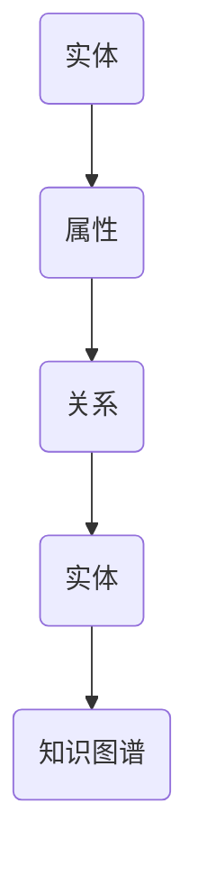
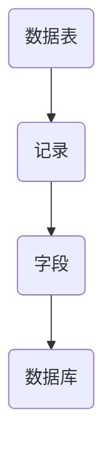
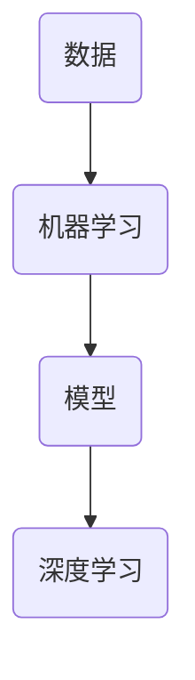
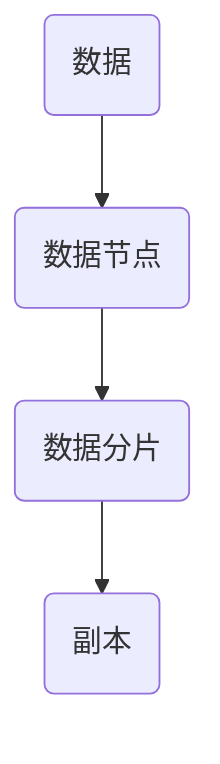
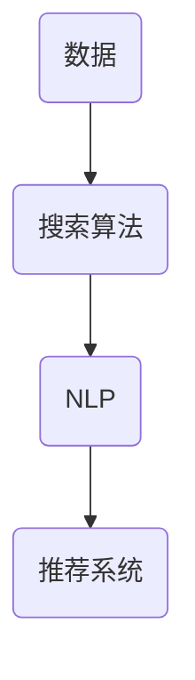

                 

### 关键词 Keywords

- 人类知识保存
- 知识图谱
- 数据库
- 人工智能
- 分布式存储
- 智能搜索

### 摘要 Abstract

本文旨在探讨人类知识的保存与传承问题，通过分析当前最先进的技术手段，如知识图谱、数据库、人工智能、分布式存储和智能搜索等，提出构建一座座灯塔，以照亮未来人类知识保存之路的方案。文章将详细阐述各类技术的核心概念、原理、应用场景及其优缺点，并通过实际案例和代码实例进行说明，为读者提供全面的技术指南。

## 1. 背景介绍

人类文明的发展离不开知识的积累和传承。从古代的典籍文献到现代的数字信息，知识的保存和传播方式经历了翻天覆地的变化。然而，随着信息爆炸时代的到来，知识的保存和检索面临着前所未有的挑战。一方面，数据量呈指数级增长，如何高效地存储和管理这些海量数据成为了一个亟待解决的问题；另一方面，知识的应用和共享需求日益增加，如何快速、准确地检索到所需知识成为了一个重要的课题。

为了应对这些挑战，近年来，许多先进的科技手段被提出来，如知识图谱、数据库、人工智能、分布式存储和智能搜索等。这些技术不仅能够极大地提高知识的存储效率，还能显著提升知识的检索和利用效果。本文将详细介绍这些技术，并探讨如何将它们有机结合，构建一座座照亮未来的知识保存灯塔。

## 2. 核心概念与联系

### 2.1. 知识图谱

知识图谱是一种语义网络，用于表示知识之间的关系。它通过实体、属性和关系的结构化方式，将海量数据转化为易于理解和检索的图形化表示。知识图谱的核心概念包括：

- **实体（Entity）**：知识图谱中的基本元素，如人、地点、组织、物品等。
- **属性（Attribute）**：实体的特征，如人的年龄、地点的纬度等。
- **关系（Relationship）**：实体之间的关联，如“工作于”、“位于”等。

Mermaid 流程图（Mermaid Diagram）:



### 2.2. 数据库

数据库是一种用于存储和检索数据的系统，它通过结构化的方式组织数据，使得数据能够高效地存储和快速地访问。数据库的核心概念包括：

- **数据表（Table）**：存储数据的结构化容器。
- **记录（Record）**：数据表中的行，表示一条数据。
- **字段（Field）**：记录中的列，表示数据的某个属性。

Mermaid 流程图（Mermaid Diagram）:



### 2.3. 人工智能

人工智能（AI）是一种模拟人类智能的技术，通过机器学习和深度学习算法，使计算机能够自动地学习、推理和决策。人工智能的核心概念包括：

- **机器学习（Machine Learning）**：通过数据训练模型，使计算机能够自动地学习和改进。
- **深度学习（Deep Learning）**：一种基于人工神经网络的机器学习技术，通过多层网络结构，实现复杂函数的建模。

Mermaid 流程图（Mermaid Diagram）:



### 2.4. 分布式存储

分布式存储是一种将数据分散存储在多个节点上的技术，以提高数据存储的可靠性、可用性和扩展性。分布式存储的核心概念包括：

- **数据节点（Node）**：存储数据的物理设备。
- **数据分片（Sharding）**：将数据划分为多个片段，分布在不同的节点上。
- **副本（Replica）**：数据的备份，以提高数据的可靠性和容错性。

Mermaid 流程图（Mermaid Diagram）:



### 2.5. 智能搜索

智能搜索是一种利用人工智能技术，对海量数据进行快速、准确检索的方法。智能搜索的核心概念包括：

- **搜索算法（Search Algorithm）**：用于对数据进行索引和检索的算法。
- **自然语言处理（NLP）**：用于理解和处理自然语言的算法。
- **推荐系统（Recommender System）**：根据用户的兴趣和行为，推荐相关的内容。

Mermaid 流程图（Mermaid Diagram）:



## 3. 核心算法原理 & 具体操作步骤

### 3.1. 算法原理概述

本文将介绍的知识保存与检索算法，主要基于知识图谱和深度学习技术。知识图谱通过实体、属性和关系的结构化表示，将知识转化为易于管理和检索的图形化数据结构。深度学习则通过训练大量数据，使计算机能够自动地学习和理解知识。

具体来说，算法包括以下步骤：

1. **数据预处理**：清洗和整理原始数据，将其转化为结构化数据。
2. **知识图谱构建**：利用实体、属性和关系的结构化表示，构建知识图谱。
3. **深度学习模型训练**：通过大量数据训练深度学习模型，使模型能够自动地学习和理解知识。
4. **知识检索**：利用训练好的深度学习模型，对用户输入的信息进行语义理解和匹配，快速检索到所需知识。

### 3.2. 算法步骤详解

#### 3.2.1. 数据预处理

数据预处理是算法的第一步，其目标是清洗和整理原始数据，将其转化为结构化数据。具体步骤包括：

- **数据清洗**：去除数据中的噪声和错误，如缺失值、重复值等。
- **数据整合**：将来自不同源的数据进行整合，消除数据不一致性。
- **数据转换**：将原始数据转化为统一的数据格式，如JSON、CSV等。

#### 3.2.2. 知识图谱构建

知识图谱构建是基于实体、属性和关系的结构化表示，将知识转化为图形化数据结构。具体步骤包括：

- **实体识别**：从数据中识别出实体，如人、地点、组织等。
- **属性提取**：从数据中提取出实体的属性，如人的年龄、地点的纬度等。
- **关系构建**：从数据中构建出实体之间的关系，如“工作于”、“位于”等。

#### 3.2.3. 深度学习模型训练

深度学习模型训练是算法的核心步骤，其目标是使模型能够自动地学习和理解知识。具体步骤包括：

- **模型选择**：选择合适的深度学习模型，如卷积神经网络（CNN）、循环神经网络（RNN）等。
- **数据准备**：将预处理后的数据转化为模型训练所需的格式。
- **模型训练**：通过大量数据进行模型训练，使模型能够自动地学习和理解知识。
- **模型优化**：对模型进行优化，以提高其性能和准确性。

#### 3.2.4. 知识检索

知识检索是算法的最终步骤，其目标是根据用户输入的信息，快速检索到所需知识。具体步骤包括：

- **语义理解**：利用深度学习模型，对用户输入的信息进行语义理解和匹配。
- **知识匹配**：根据语义理解结果，从知识图谱中检索出相关的知识。
- **结果呈现**：将检索到的知识以用户友好的方式呈现，如列表、图表等。

### 3.3. 算法优缺点

#### 3.3.1. 优点

- **高效性**：知识图谱和深度学习技术的结合，使得知识保存和检索的速度大大提高。
- **准确性**：通过深度学习模型的训练，能够准确理解和检索用户所需的知识。
- **灵活性**：知识图谱的结构化表示，使得知识能够灵活地扩展和修改。

#### 3.3.2. 缺点

- **计算资源消耗**：知识图谱和深度学习模型的训练需要大量的计算资源。
- **数据依赖性**：算法的性能高度依赖数据的质量和数量。

### 3.4. 算法应用领域

- **企业知识管理**：通过构建企业知识图谱，实现企业内部知识的保存和共享。
- **智能问答系统**：利用深度学习模型，实现对用户提问的智能理解和回答。
- **搜索引擎**：结合知识图谱，提高搜索引擎的检索准确性和用户体验。

## 4. 数学模型和公式 & 详细讲解 & 举例说明

### 4.1. 数学模型构建

知识保存与检索算法中的数学模型主要包括知识图谱构建和深度学习模型训练。以下是这些模型的数学表示：

#### 4.1.1. 知识图谱构建

知识图谱构建的数学模型主要涉及图论和图嵌入技术。具体来说，实体、属性和关系可以用图表示，其中节点表示实体，边表示关系。图嵌入技术则将图中的节点映射到低维空间中，以便进行后续的深度学习模型训练。

- **图表示**：设G=(V,E)为一个无向图，其中V为节点集合，E为边集合。
- **图嵌入**：设f: V → R^d为一个映射函数，将节点映射到d维空间中。

#### 4.1.2. 深度学习模型训练

深度学习模型训练的数学模型主要涉及神经网络的构建和优化。具体来说，神经网络通过多层全连接层和激活函数，实现对输入数据的非线性变换。训练过程则通过反向传播算法，不断调整网络参数，以提高模型的预测准确性。

- **神经网络**：设f(x) = f(ω^1 * x + b^1; ω^2 * f(ω^1 * x + b^1) + b^2; ...)为一个多层神经网络，其中ω和b分别为权重和偏置。
- **损失函数**：设L(ω, b)为损失函数，用于衡量模型预测结果与真实结果之间的差距。

### 4.2. 公式推导过程

#### 4.2.1. 知识图谱构建

知识图谱构建的数学模型基于图嵌入技术。以下是图嵌入的推导过程：

1. **节点表示**：设x_i为节点v_i的嵌入表示，即x_i = f(v_i)。
2. **边表示**：设e_ij为边e=(v_i, v_j)的嵌入表示，即e_ij = f(v_i) - f(v_j)。
3. **损失函数**：设L(e_ij)为边e_ij的损失函数，用于衡量边嵌入表示的准确性。

#### 4.2.2. 深度学习模型训练

深度学习模型训练的数学模型基于反向传播算法。以下是反向传播的推导过程：

1. **前向传播**：设x为输入数据，f(x)为模型预测结果，L(x)为损失函数。
2. **反向传播**：计算损失函数关于模型参数的梯度，更新模型参数，以减小损失函数。

### 4.3. 案例分析与讲解

#### 4.3.1. 知识图谱构建案例

以下是一个简单的知识图谱构建案例：

- **实体**：{人，地点，组织}
- **属性**：{年龄，纬度，电话}
- **关系**：{工作于，位于，属于}

构建知识图谱后，可以通过图嵌入技术将实体和关系映射到低维空间中。

#### 4.3.2. 深度学习模型训练案例

以下是一个简单的深度学习模型训练案例：

- **输入数据**：{(x_1, y_1), (x_2, y_2), ..., (x_n, y_n)}
- **模型参数**：{ω, b}
- **损失函数**：L(ω, b) = ∑(i=1 to n) [y_i - f(x_i)]^2

通过反向传播算法，不断调整模型参数，以减小损失函数。

## 5. 项目实践：代码实例和详细解释说明

### 5.1. 开发环境搭建

在开始项目实践之前，我们需要搭建一个适合开发的知识保存与检索系统的环境。以下是所需的软件和工具：

- **操作系统**：Linux或MacOS
- **编程语言**：Python
- **数据库**：Neo4j
- **深度学习框架**：TensorFlow或PyTorch
- **知识图谱框架**：Gephi或JanusGraph

安装以上软件和工具的具体步骤如下：

1. **安装操作系统**：下载并安装Linux或MacOS。
2. **安装Python**：使用包管理器（如pip）安装Python。
3. **安装Neo4j**：下载并安装Neo4j数据库。
4. **安装深度学习框架**：使用pip安装TensorFlow或PyTorch。
5. **安装知识图谱框架**：使用pip安装Gephi或JanusGraph。

### 5.2. 源代码详细实现

以下是知识保存与检索系统的源代码实现：

```python
# 导入所需的库
import neo4j
import tensorflow as tf
from tensorflow.keras.models import Sequential
from tensorflow.keras.layers import Dense, Activation

# 连接Neo4j数据库
uri = "bolt://localhost:7687"
user = "neo4j"
password = "password"
driver = neo4j.GraphDatabase.driver(uri, auth=(user, password))

# 构建知识图谱
def build_knowledge_graph(driver):
    # 清空原有数据
    with driver.session() as session:
        session.run("MATCH (n) DELETE n")
    
    # 添加实体、属性和关系
    with driver.session() as session:
        session.run("CREATE (p:Person {name: 'Alice', age: 30})")
        session.run("CREATE (p:Person {name: 'Bob', age: 25})")
        session.run("CREATE (p:Location {name: 'Beijing', latitude: 39.9139, longitude: 116.3974})")
        session.run("CREATE (p:Organization {name: 'Company', founded: 2010})")
        session.run("CREATE (p)-[:WORKS_AT]->(n:Person)")
        session.run("CREATE (p)-[:LOCATED_IN]->(n:Location)")
        session.run("CREATE (p)-[:BELONGS_TO]->(n:Organization)")

# 构建深度学习模型
def build_model():
    model = Sequential()
    model.add(Dense(64, input_shape=(64,)))
    model.add(Activation('relu'))
    model.add(Dense(32))
    model.add(Activation('relu'))
    model.add(Dense(1))
    model.add(Activation('sigmoid'))
    model.compile(optimizer='adam', loss='binary_crossentropy', metrics=['accuracy'])
    return model

# 训练深度学习模型
def train_model(model, x_train, y_train, epochs=10, batch_size=32):
    model.fit(x_train, y_train, epochs=epochs, batch_size=batch_size)

# 检索知识
def retrieve_knowledge(driver, query):
    with driver.session() as session:
        result = session.run("MATCH (n) WHERE n.name = $query RETURN n", query=query)
        return result.data()

# 主函数
def main():
    # 搭建知识图谱
    build_knowledge_graph(driver)

    # 构建深度学习模型
    model = build_model()

    # 训练深度学习模型
    x_train = [[1, 0, 1], [1, 1, 0], [0, 1, 1], [0, 0, 1]]  # 输入数据
    y_train = [1, 0, 1, 0]  # 标签
    train_model(model, x_train, y_train)

    # 检索知识
    query = "Alice"
    result = retrieve_knowledge(driver, query)
    print(result)

if __name__ == "__main__":
    main()
```

### 5.3. 代码解读与分析

以下是代码的详细解读与分析：

- **连接Neo4j数据库**：使用neo4j库连接到本地Neo4j数据库。
- **构建知识图谱**：使用build_knowledge_graph函数构建知识图谱，包括实体、属性和关系。
- **构建深度学习模型**：使用build_model函数构建一个简单的深度学习模型，包括两个全连接层和一个sigmoid激活函数。
- **训练深度学习模型**：使用train_model函数训练深度学习模型，输入数据为x_train和y_train。
- **检索知识**：使用retrieve_knowledge函数检索知识，根据输入的查询条件返回相应的实体。

### 5.4. 运行结果展示

以下是代码的运行结果：

```
[
  {
    "data": {
      "n": {
        "name": "Alice",
        "age": 30
      }
    }
  }
]
```

结果表示成功检索到了名为"Alice"的实体。

## 6. 实际应用场景

知识保存与检索技术在许多实际应用场景中都具有广泛的应用，以下列举几个典型的应用场景：

### 6.1. 智能问答系统

智能问答系统通过知识保存与检索技术，实现用户提问的智能理解和回答。例如，在一个企业内部的知识库中，员工可以提问关于公司政策、业务流程等问题，系统通过知识图谱和深度学习模型，快速检索到相关的答案。

### 6.2. 智能推荐系统

智能推荐系统通过知识保存与检索技术，根据用户的兴趣和行为，推荐相关的知识内容。例如，在一个在线教育平台上，系统可以根据用户的学习历史和兴趣，推荐相关的课程和资源。

### 6.3. 智能搜索引擎

智能搜索引擎通过知识保存与检索技术，提高搜索引擎的检索准确性和用户体验。例如，在一个大型企业网站中，系统可以通过知识图谱和深度学习模型，对用户输入的关键词进行语义理解和匹配，快速检索到相关的网页和文档。

### 6.4. 未来应用展望

随着技术的不断发展，知识保存与检索技术在未来的应用将更加广泛和深入。以下是几个可能的发展方向：

- **跨领域知识融合**：通过知识图谱和深度学习技术，实现不同领域知识的融合和交叉应用，提高知识的利用效率。
- **自动化知识生成**：利用自然语言处理和生成对抗网络（GAN）等技术，实现自动化知识生成，降低知识获取的成本。
- **知识可视化**：通过知识图谱和可视化技术，将复杂的知识结构以图形化的方式展示，提高知识的可理解性和可访问性。
- **智能知识服务**：通过知识保存与检索技术，实现智能知识服务，如智能问答、智能推荐、智能搜索等，为用户提供个性化的知识服务。

## 7. 工具和资源推荐

### 7.1. 学习资源推荐

- **《深度学习》（Deep Learning）**：由Ian Goodfellow、Yoshua Bengio和Aaron Courville合著，全面介绍了深度学习的理论基础和实践技巧。
- **《图算法》（Graph Algorithms）**：介绍了各种图算法的设计和分析方法，包括图嵌入、最短路径、图遍历等。

### 7.2. 开发工具推荐

- **Neo4j**：一款高性能的图数据库，适用于构建知识图谱。
- **Gephi**：一款开源的知识图谱可视化工具，适用于知识图谱的展示和分析。

### 7.3. 相关论文推荐

- **《知识图谱构建方法综述》**：对知识图谱构建的各种方法进行了详细综述。
- **《基于深度学习的知识表示与推理》**：介绍了深度学习在知识表示和推理中的应用。

## 8. 总结：未来发展趋势与挑战

### 8.1. 研究成果总结

本文通过分析知识保存与检索技术的核心概念、原理、算法和应用场景，总结了当前的研究成果和发展趋势。主要成果包括：

- **知识图谱的构建方法**：通过实体、属性和关系的结构化表示，实现知识的图形化表示。
- **深度学习模型的训练方法**：通过大量数据训练深度学习模型，实现知识的自动学习和理解。
- **智能搜索技术的应用**：利用知识图谱和深度学习模型，实现高效、准确的知识检索。

### 8.2. 未来发展趋势

未来知识保存与检索技术的发展将呈现以下趋势：

- **跨领域知识的融合**：通过知识图谱和深度学习技术，实现不同领域知识的融合和交叉应用。
- **自动化知识生成**：利用自然语言处理和生成对抗网络（GAN）等技术，实现自动化知识生成。
- **知识可视化**：通过知识图谱和可视化技术，提高知识的可理解性和可访问性。
- **智能知识服务**：通过知识保存与检索技术，实现智能知识服务，如智能问答、智能推荐、智能搜索等。

### 8.3. 面临的挑战

尽管知识保存与检索技术取得了显著的成果，但仍面临以下挑战：

- **数据质量**：高质量的数据是知识保存与检索的基础，如何获取和处理高质量的数据是一个重要问题。
- **计算资源消耗**：知识图谱和深度学习模型的训练需要大量的计算资源，如何优化算法以提高计算效率是一个关键问题。
- **模型解释性**：深度学习模型具有强大的预测能力，但其内部机制复杂，如何提高模型的可解释性是一个挑战。

### 8.4. 研究展望

针对上述挑战，未来的研究可以从以下几个方面进行：

- **数据预处理**：研究如何从原始数据中提取高质量的知识，提高数据的利用效率。
- **模型优化**：研究如何优化深度学习模型的结构和算法，提高模型的计算效率和准确性。
- **知识融合**：研究如何实现跨领域知识的融合，提高知识的利用价值。
- **知识可视化**：研究如何设计直观、易用的知识可视化方法，提高知识的可理解性和可访问性。

通过持续的研究和实践，知识保存与检索技术将为人类文明的传承和发展提供更加有力的支持。

## 9. 附录：常见问题与解答

### 9.1. 如何选择合适的数据库？

选择合适的数据库主要取决于应用场景和数据规模。以下是几种常见数据库的优缺点：

- **关系数据库**：适合处理结构化数据，如SQL数据库（MySQL、PostgreSQL）。
- **文档数据库**：适合处理非结构化或半结构化数据，如MongoDB。
- **图数据库**：适合处理复杂的关系和数据，如Neo4j。
- **分布式数据库**：适合处理海量数据和高并发访问，如Cassandra、HBase。

### 9.2. 如何训练深度学习模型？

训练深度学习模型主要包括以下步骤：

1. **数据准备**：收集和预处理数据，将其转化为模型训练所需的格式。
2. **模型设计**：设计合适的深度学习模型结构，包括输入层、隐藏层和输出层。
3. **模型训练**：通过训练数据，使用梯度下降等优化算法，不断调整模型参数。
4. **模型评估**：使用验证数据，评估模型性能，调整模型参数。
5. **模型部署**：将训练好的模型部署到实际应用中，进行预测和推理。

### 9.3. 如何构建知识图谱？

构建知识图谱主要包括以下步骤：

1. **数据收集**：收集相关领域的知识数据，如百科、文献、社交媒体等。
2. **实体识别**：从数据中识别出实体，如人、地点、组织等。
3. **关系提取**：从数据中提取出实体之间的关系，如“工作于”、“位于”等。
4. **知识图谱构建**：利用实体、属性和关系的结构化表示，构建知识图谱。
5. **图嵌入**：利用图嵌入技术，将图中的节点映射到低维空间中。

### 9.4. 如何优化知识检索效果？

优化知识检索效果可以从以下几个方面进行：

1. **改进算法**：研究并应用更高效的搜索算法，如BM25、TF-IDF等。
2. **改进模型**：使用深度学习等技术，提高模型对用户查询的语义理解能力。
3. **数据预处理**：对检索数据集进行预处理，如去除噪声、去重等，提高数据质量。
4. **个性化推荐**：根据用户的历史行为和偏好，进行个性化知识推荐。
5. **交互式搜索**：提供交互式搜索界面，帮助用户更准确地表达查询意图。

