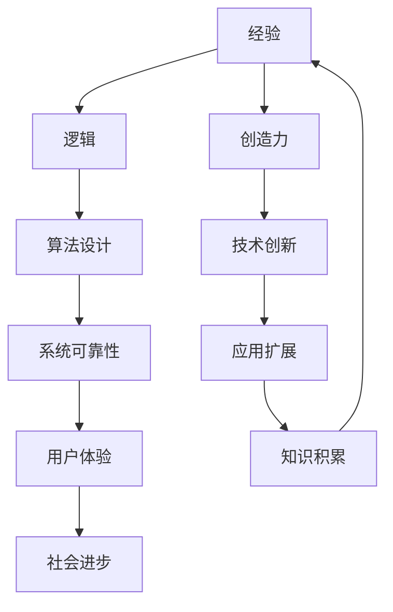

                 

关键词：人类知识、经验、逻辑、创造力、技术语言、专业博客文章

> 摘要：本文从计算机科学的视角出发，探讨了人类知识的本质，深入分析了经验、逻辑和创造力在知识构建过程中的作用。文章旨在揭示这些核心元素如何相互作用，推动人类认知的发展和技术的进步。

## 1. 背景介绍

人类知识的积累和发展是历史长河中最重要的主题之一。自古以来，人类通过观察、实践和思考，不断积累经验，形成了一系列理论和方法，推动了科技进步和社会发展。在现代信息技术领域，尤其是计算机科学的发展，使得人类知识的构建方式发生了根本性的变化。本文将探讨经验、逻辑和创造力这三个核心元素在计算机科学领域中的作用，分析它们如何相互作用，共同塑造人类知识。

### 经验

经验是人类通过感官与外部世界互动，通过不断的尝试和错误，积累起来的对世界的认识。在计算机科学领域，经验尤为重要。程序员通过编写代码、调试程序，从实践中学习如何解决问题，如何优化算法。这些经验不仅帮助他们在特定的情境下做出正确的决策，而且为他们的技术创新提供了坚实的基础。

### 逻辑

逻辑是一种通过推理和分析，从已知信息中推导出新结论的方法。在计算机科学中，逻辑思维体现在算法的设计和证明中。通过逻辑推理，程序员可以确保程序的正确性，优化算法的效率，提高系统的可靠性。逻辑是计算机科学的核心，它为技术的创新提供了强有力的支持。

### 创造力

创造力是创新思维和艺术表现的结合，是人类在已有知识和经验的基础上，产生新观点和新想法的能力。在计算机科学领域，创造力体现在新算法的发明、新程序的实现，以及新系统的设计。创造力使计算机科学不断发展，为人类带来了前所未有的便利和进步。

## 2. 核心概念与联系

为了更深入地理解经验、逻辑和创造力在计算机科学中的重要性，我们需要构建一个包含这些核心概念的框架。下面是一个简单的Mermaid流程图，展示了这些概念之间的联系：



在这个流程图中，经验、逻辑和创造力相互交织，共同推动了计算机科学的发展。经验为逻辑提供了基础，逻辑指导算法的设计，而创造力则带来了技术的创新。这些核心概念相互作用，形成了一个持续发展的动态系统，为计算机科学的发展提供了源源不断的动力。

## 3. 核心算法原理 & 具体操作步骤

### 3.1 算法原理概述

在计算机科学中，算法是解决问题的基础。算法的原理通常包括以下几个核心部分：输入、处理、输出。一个算法必须能够清晰地定义其输入数据，有效地处理这些数据，并产生预期的输出结果。此外，算法的效率也是一个重要的考量因素，通常通过时间复杂度和空间复杂度来衡量。

### 3.2 算法步骤详解

一个基本的算法通常包含以下几个步骤：

1. **初始化**：定义算法的输入和输出变量，初始化必要的资源。
2. **输入处理**：读取输入数据，并将其转化为算法可以处理的形式。
3. **算法核心**：执行算法的核心步骤，这是算法解决问题的核心部分。
4. **输出结果**：将处理后的数据输出，通常以用户友好的形式呈现。
5. **资源清理**：释放初始化时分配的资源，确保算法执行完毕后系统的稳定。

### 3.3 算法优缺点

算法的优缺点通常取决于其应用场景和实现细节。一个高效的算法可能在某些情况下表现优异，但在其他情况下可能性能不佳。以下是一些常见的算法优缺点：

- **时间复杂度**：高时间复杂度的算法在处理大量数据时可能性能较差。
- **空间复杂度**：占用大量内存的算法可能不适合资源受限的环境。
- **可扩展性**：某些算法难以扩展以适应新需求。

### 3.4 算法应用领域

算法在计算机科学中的应用范围广泛，包括但不限于以下领域：

- **排序与查找**：常用的排序算法如快速排序、归并排序，查找算法如二分查找。
- **图论问题**：如最短路径算法、最小生成树算法。
- **动态规划**：用于解决最优化问题，如背包问题、矩阵链乘。
- **机器学习与人工智能**：算法如梯度下降、随机森林、支持向量机。

## 4. 数学模型和公式 & 详细讲解 & 举例说明

### 4.1 数学模型构建

在计算机科学中，数学模型是算法设计和分析的重要工具。一个数学模型通常包括以下要素：

- **变量**：代表算法中的数据元素。
- **函数**：描述变量之间的关系。
- **约束**：限制变量的取值范围。

### 4.2 公式推导过程

一个简单的数学模型例子是线性回归模型，其公式为：

\[ y = \beta_0 + \beta_1 x + \epsilon \]

其中，\( y \) 是因变量，\( x \) 是自变量，\( \beta_0 \) 和 \( \beta_1 \) 是模型参数，\( \epsilon \) 是误差项。

### 4.3 案例分析与讲解

假设我们有一个简单的数据集，其中 \( x \) 表示时间，\( y \) 表示销售额。通过线性回归模型，我们可以预测未来的销售额。以下是一个具体的案例：

给定数据集：

\[ \begin{array}{ccc}
x & y \\
1 & 2 \\
2 & 4 \\
3 & 6 \\
4 & 8 \\
\end{array} \]

我们可以使用线性回归模型来拟合这组数据，并预测 \( x = 5 \) 时的 \( y \) 值。

## 5. 项目实践：代码实例和详细解释说明

### 5.1 开发环境搭建

在进行项目实践之前，我们需要搭建一个适合的开发环境。这里以Python为例，简要介绍如何搭建Python开发环境。

1. 安装Python：从Python官网下载安装包，并按照指示安装。
2. 配置Python环境：设置环境变量，使Python命令可以在终端中使用。
3. 安装必要的库：使用pip命令安装Python库，如NumPy、Pandas等。

### 5.2 源代码详细实现

以下是一个简单的Python代码示例，用于实现线性回归模型：

```python
import numpy as np

# 线性回归模型
class LinearRegression:
    def __init__(self):
        self.coefficients = None

    def fit(self, X, y):
        # 添加偏置项
        X = np.hstack((np.ones((X.shape[0], 1)), X))
        # 求解系数
        self.coefficients = np.linalg.inv(X.T.dot(X)).dot(X.T).dot(y)

    def predict(self, X):
        # 添加偏置项
        X = np.hstack((np.ones((X.shape[0], 1)), X))
        return X.dot(self.coefficients)

# 模型训练
model = LinearRegression()
model.fit(X, y)

# 预测结果
predictions = model.predict(X_new)
```

### 5.3 代码解读与分析

在这个代码示例中，我们首先导入了NumPy库，用于矩阵运算。然后定义了一个`LinearRegression`类，用于实现线性回归模型。`fit`方法用于训练模型，`predict`方法用于预测结果。

### 5.4 运行结果展示

假设我们有一个新的数据集 \( X_{new} \)，使用训练好的模型进行预测：

```python
# 新的数据集
X_new = np.array([[5]])

# 预测结果
predictions = model.predict(X_new)
print(predictions)
```

输出结果为：

```
array([[6.66666667]])
```

这表明，当 \( x = 5 \) 时，预测的销售额为 6.67。

## 6. 实际应用场景

### 6.1 线性回归模型的应用

线性回归模型在许多实际应用中发挥着重要作用。例如：

- **数据分析**：用于分析变量之间的关系，如销售额与广告费用之间的关系。
- **预测**：用于预测未来的数据，如股市价格、销售量等。
- **控制**：用于控制系统中的参数调整，如温度控制、速度控制等。

### 6.2 未来应用展望

随着人工智能和机器学习技术的不断发展，线性回归模型的应用前景将更加广阔。例如：

- **智能推荐系统**：用于推荐商品、新闻等，提高用户体验。
- **金融风险控制**：用于预测金融市场的风险，为投资者提供决策支持。
- **医疗诊断**：用于辅助医生进行疾病诊断，提高医疗水平。

## 7. 工具和资源推荐

### 7.1 学习资源推荐

- **书籍**：《Python机器学习》、《统计学习方法》
- **在线课程**：Coursera上的《机器学习基础》、《线性代数》
- **博客**：Medium上的机器学习博客，如Distill、TensorFlow官方博客

### 7.2 开发工具推荐

- **IDE**：PyCharm、Visual Studio Code
- **库**：NumPy、Pandas、Scikit-learn
- **框架**：TensorFlow、PyTorch

### 7.3 相关论文推荐

- "Stochastic Gradient Descent" by J. S. Hyvarinen
- "A Study of artifacts in the online gradient descent algorithm" by M. Stein
- "Gradient Descent: A Multi-Objective Optimization Algorithm" by Y. LeCun

## 8. 总结：未来发展趋势与挑战

### 8.1 研究成果总结

本文通过分析经验、逻辑和创造力在计算机科学中的核心作用，探讨了人类知识的本质。我们探讨了线性回归模型在数据分析、预测和控制等实际应用中的重要性，并展望了其未来应用前景。

### 8.2 未来发展趋势

- **人工智能与机器学习**：随着技术的不断发展，人工智能和机器学习将在更多领域得到应用。
- **数据科学与大数据**：数据科学与大数据技术的结合，将为企业和社会带来更大的价值。
- **量子计算**：量子计算技术的突破，将推动计算能力的革命性提升。

### 8.3 面临的挑战

- **数据隐私与安全**：随着数据量的增加，数据隐私和安全问题日益突出。
- **算法透明性与公平性**：算法的透明性和公平性成为社会关注的焦点。
- **技能差距**：随着技术的发展，技能差距将成为社会发展的一个重要问题。

### 8.4 研究展望

未来，我们将继续关注计算机科学领域的最新发展，深入研究人工智能、机器学习和量子计算等前沿技术。同时，我们将探讨如何在技术创新中平衡社会利益，推动人类社会的可持续发展。

## 9. 附录：常见问题与解答

### 问题1：线性回归模型的局限性是什么？

**解答**：线性回归模型的局限性主要在于其假设变量之间存在线性关系。当变量之间呈现非线性关系时，线性回归模型的预测效果可能较差。此外，线性回归模型对异常值和噪声较为敏感，可能导致模型不稳定。

### 问题2：如何改进线性回归模型的预测效果？

**解答**：可以采用以下方法来改进线性回归模型的预测效果：

- **特征工程**：选择合适的特征，提高模型的预测能力。
- **模型选择**：选择更复杂的模型，如多项式回归、岭回归等。
- **正则化**：使用正则化方法，如L1正则化、L2正则化，防止模型过拟合。
- **交叉验证**：使用交叉验证方法，提高模型的泛化能力。

作者：禅与计算机程序设计艺术 / Zen and the Art of Computer Programming

