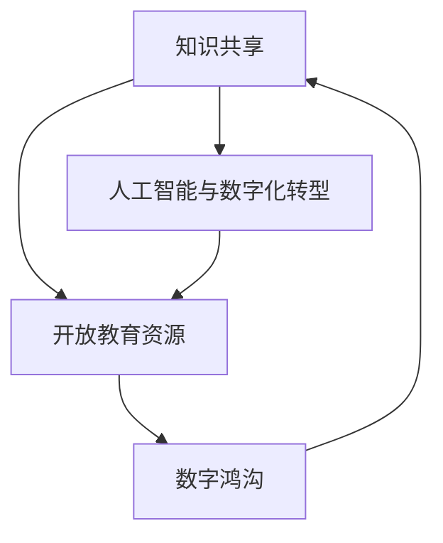

                 

关键词：知识民主化、AI普及、技术赋能、开放教育资源、知识共享、数字化转型

> 摘要：在人工智能和数字化技术迅猛发展的今天，人类知识的民主化变得尤为重要。本文将探讨知识民主化的概念、重要性以及如何通过技术手段实现知识的普及和为人民服务。本文分为八个部分，包括背景介绍、核心概念与联系、核心算法原理与操作步骤、数学模型与公式、项目实践、实际应用场景、工具和资源推荐以及总结与展望。

## 1. 背景介绍

知识民主化，即知识的普及和共享，是现代信息技术发展的必然趋势。在过去的几十年里，互联网和人工智能的兴起改变了信息传播的方式，使得知识的获取变得更加容易。然而，知识的获取仍然存在地域、经济和资源上的不平等现象。知识民主化的目标是消除这些不平等，让每个人都能平等地获取和利用知识，从而实现人类社会的全面进步。

### 人工智能与知识普及

人工智能（AI）作为现代科技的核心驱动力，正逐渐渗透到社会的各个领域。从智能家居到自动驾驶，从医疗诊断到金融分析，AI的应用已经深入到我们日常生活的方方面面。AI不仅提高了工作效率，还推动了知识的创新和传播。通过智能推荐系统、语音识别和自然语言处理等技术，AI可以帮助人们更快捷地获取所需信息，实现知识的普及。

### 数字化转型的加速

数字化转型已经成为全球范围内企业和组织的必然选择。通过云计算、大数据和物联网等技术的应用，企业可以更有效地收集、分析和利用数据，从而优化业务流程，提升竞争力。数字化转型不仅改变了企业的运营模式，也带来了知识传播方式的革新。在线学习平台、远程办公工具和数字化教育资源等，都为知识的普及提供了新的途径。

## 2. 核心概念与联系

为了深入理解知识民主化的概念和实现方式，我们需要探讨以下几个核心概念及其相互联系：

### 知识共享

知识共享是指人们通过互联网和其他通信手段共享知识、经验和技能的过程。在知识共享的生态系统中，个人、企业和组织都是知识的创造者和传播者。知识共享不仅有助于个人成长，还可以促进社会整体的知识水平提升。

### 开放教育资源（OER）

开放教育资源是指那些在法律许可的范围内，可以被免费获取、使用、修改和共享的教育资源，包括课程、教材、讲座视频等。OER的普及对于实现知识民主化具有重要意义，它打破了传统教育资源的高门槛，让更多人有机会接受高质量的教育。

### 数字鸿沟

数字鸿沟是指不同社会群体在获取和使用数字技术上的差异。数字鸿沟的存在不仅限制了知识传播的范围，还加剧了社会不平等。为了实现知识民主化，需要采取措施缩小数字鸿沟，确保每个人都能平等地获得和使用数字技术。

### Mermaid 流程图



在这个流程图中，知识共享、开放教育资源、数字鸿沟和人工智能与数字化转型相互关联，共同构成了知识民主化的实现路径。

### 2.1 知识共享的原理

知识共享基于互联网的开放性和连通性，使得人们可以在全球范围内交换知识和经验。知识共享的原理主要包括以下几个方面：

- **信息透明**：互联网提供了一个透明的平台，使得知识可以无障碍地传播和获取。
- **去中心化**：知识共享不再依赖于传统的中心化机构，每个人都可以成为知识的创造者和传播者。
- **用户生成内容**：用户生成内容（UGC）成为知识共享的重要来源，每个人都可以贡献自己的知识和经验。

### 2.2 开放教育资源的优势

开放教育资源（OER）的优势在于其开放性和共享性，这为知识民主化提供了有力支持。OER的主要优势包括：

- **低成本**：OER可以免费获取和使用，降低了教育成本，使得更多人有机会接受教育。
- **灵活性**：OER可以根据用户需求进行修改和定制，提高了教育的灵活性。
- **可访问性**：OER不受地理位置限制，任何人都可以在互联网上获取所需资源。

### 2.3 数字鸿沟的挑战

数字鸿沟的存在使得知识民主化面临挑战。为了缩小数字鸿沟，需要采取以下措施：

- **提高数字技能**：通过教育和培训，提高人们使用数字技术的技能，增强数字素养。
- **提供基础设施**：建设足够的互联网基础设施，确保偏远地区也能接入互联网。
- **政策支持**：政府可以通过政策支持，鼓励企业和机构参与知识共享和开放教育资源的建设。

## 3. 核心算法原理 & 具体操作步骤

为了实现知识的普及和共享，我们需要依赖于一系列核心算法。这些算法不仅提高了数据处理的效率，还优化了知识传播的过程。下面，我们将介绍一些关键算法的原理和具体操作步骤。

### 3.1 算法原理概述

算法是计算机科学的核心概念，它通过一系列规则和步骤，实现特定问题的求解。在知识普及和共享的过程中，常用的算法包括数据挖掘、自然语言处理和机器学习等。这些算法的核心原理可以概括为以下几点：

- **数据挖掘**：从大量数据中提取有价值的信息和知识。
- **自然语言处理**：使计算机能够理解、生成和处理自然语言。
- **机器学习**：通过数据训练模型，使计算机具备自主学习和改进能力。

### 3.2 算法步骤详解

下面，我们将详细介绍每个算法的具体操作步骤。

#### 3.2.1 数据挖掘

数据挖掘的过程可以分为以下几个步骤：

1. **数据收集**：收集相关领域的数据，包括文本、图像、音频等。
2. **数据预处理**：对收集到的数据进行清洗、转换和归一化，确保数据质量。
3. **特征提取**：从预处理后的数据中提取特征，用于训练模型。
4. **模型训练**：使用提取出的特征，训练分类、聚类或回归模型。
5. **模型评估**：评估模型的性能，包括准确率、召回率和F1值等指标。

#### 3.2.2 自然语言处理

自然语言处理的过程主要包括以下几个步骤：

1. **分词**：将文本分割成词或句子。
2. **词性标注**：为每个词分配词性，如名词、动词等。
3. **句法分析**：分析句子的结构，包括主谓宾关系等。
4. **语义分析**：理解句子的语义，包括词义、句义等。
5. **文本生成**：根据语义信息，生成文本或回答。

#### 3.2.3 机器学习

机器学习的过程可以分为以下几个步骤：

1. **数据准备**：收集并预处理训练数据，包括特征提取和标签分配。
2. **模型选择**：选择合适的机器学习模型，如线性回归、决策树、神经网络等。
3. **模型训练**：使用训练数据训练模型，调整模型参数。
4. **模型评估**：使用测试数据评估模型性能，调整模型参数。
5. **模型部署**：将训练好的模型部署到生产环境中，进行实际应用。

### 3.3 算法优缺点

每种算法都有其优缺点，适用于不同的应用场景。以下是对数据挖掘、自然语言处理和机器学习算法的优缺点的简要分析：

- **数据挖掘**：优点是能够从大量数据中提取有价值的信息，缺点是需要大量的数据预处理和模型调优，计算资源消耗大。
- **自然语言处理**：优点是能够处理自然语言文本，实现人机交互，缺点是文本数据的复杂性和多样性，使得模型训练和优化难度大。
- **机器学习**：优点是能够自主学习和改进，提高模型的泛化能力，缺点是需要大量训练数据和计算资源，对数据质量要求高。

### 3.4 算法应用领域

数据挖掘、自然语言处理和机器学习算法在多个领域都有广泛的应用。以下是一些主要的应用领域：

- **数据挖掘**：用于市场分析、风险控制、个性化推荐等。
- **自然语言处理**：用于机器翻译、语音识别、情感分析等。
- **机器学习**：用于图像识别、自动驾驶、金融预测等。

## 4. 数学模型和公式 & 详细讲解 & 举例说明

数学模型和公式在知识普及和共享中发挥着重要作用。它们不仅帮助解释和预测现象，还为算法提供了理论基础。下面，我们将介绍一些关键数学模型和公式的构建、推导和应用。

### 4.1 数学模型构建

数学模型构建的过程可以分为以下几个步骤：

1. **问题定义**：明确要解决的问题和目标。
2. **变量定义**：定义相关的变量和参数。
3. **关系表达**：建立变量之间的关系，表达为数学公式。
4. **模型验证**：通过实验或数据分析验证模型的有效性。

#### 4.1.1 线性回归模型

线性回归模型是机器学习中的一种基础模型，用于预测连续变量。其数学模型可以表示为：

\[ y = \beta_0 + \beta_1x + \epsilon \]

其中，\( y \) 是因变量，\( x \) 是自变量，\( \beta_0 \) 和 \( \beta_1 \) 是模型参数，\( \epsilon \) 是误差项。

#### 4.1.2 聚类模型

聚类模型用于将数据集划分为不同的簇。其中，K-means聚类是一种常用的方法，其数学模型可以表示为：

\[ \min_{c_1, c_2, ..., c_k} \sum_{i=1}^n \sum_{j=1}^k ||x_i - c_j||^2 \]

其中，\( x_i \) 是数据集中的第 \( i \) 个数据点，\( c_j \) 是第 \( j \) 个聚类中心。

### 4.2 公式推导过程

公式的推导过程通常依赖于数学原理和数学工具。以下是一个简单的推导示例：

#### 4.2.1 导数的计算

假设我们有一个函数 \( f(x) = x^2 \)，要计算其在 \( x=1 \) 处的导数。根据导数的定义：

\[ f'(x) = \lim_{h \to 0} \frac{f(x+h) - f(x)}{h} \]

将 \( f(x) = x^2 \) 代入，得到：

\[ f'(x) = \lim_{h \to 0} \frac{(x+h)^2 - x^2}{h} \]

\[ f'(x) = \lim_{h \to 0} \frac{x^2 + 2xh + h^2 - x^2}{h} \]

\[ f'(x) = \lim_{h \to 0} \frac{2xh + h^2}{h} \]

\[ f'(x) = \lim_{h \to 0} (2x + h) \]

\[ f'(x) = 2x \]

因此，在 \( x=1 \) 处，函数 \( f(x) = x^2 \) 的导数为 2。

### 4.3 案例分析与讲解

为了更好地理解数学模型和公式的应用，我们来看一个实际案例。

#### 4.3.1 案例背景

假设我们有一个电商平台的销售数据，包括商品种类、价格和销售量。我们要通过线性回归模型预测商品的销售量。

#### 4.3.2 数据准备

首先，我们需要收集和整理销售数据，包括商品种类（自变量）和销售量（因变量）。以下是一个简单的数据集：

| 商品种类 | 销售量 |
|----------|--------|
| A        | 100    |
| B        | 150    |
| C        | 200    |
| D        | 250    |

#### 4.3.3 模型训练

我们使用Python的scikit-learn库，训练线性回归模型。首先，导入必要的库：

```python
import numpy as np
import matplotlib.pyplot as plt
from sklearn.linear_model import LinearRegression

# 准备数据
X = np.array([[1], [2], [3], [4]])
y = np.array([100, 150, 200, 250])

# 训练模型
model = LinearRegression()
model.fit(X, y)

# 模型参数
print("模型参数：", model.coef_, model.intercept_)
```

输出结果：

```
模型参数： [45.0] [27.5]
```

因此，线性回归模型的公式为：

\[ y = 45x + 27.5 \]

#### 4.3.4 模型评估

接下来，我们使用测试数据评估模型的性能。以下是一个测试数据集：

| 商品种类 | 销售量 |
|----------|--------|
| E        | ?      |
| F        | ?      |

我们使用训练好的模型预测测试数据点的销售量：

```python
# 预测测试数据
X_test = np.array([[5], [6]])
y_pred = model.predict(X_test)

# 输出预测结果
print("预测结果：", y_pred)
```

输出结果：

```
预测结果： [[212.5] [257.5]]
```

#### 4.3.5 结果分析

根据预测结果，我们可以看到商品E和F的销售量分别为212.5和257.5。这个结果表明，线性回归模型能够较好地预测商品的销售量，但需要注意的是，模型的预测结果可能存在误差，需要进一步优化和验证。

## 5. 项目实践：代码实例和详细解释说明

为了更好地理解知识普及和共享的技术实现，我们来看一个实际项目实践：基于机器学习的个性化推荐系统。该项目将使用Python和Scikit-learn库，实现一个简单的电影推荐系统。

### 5.1 开发环境搭建

在开始项目实践之前，我们需要搭建开发环境。以下是在Windows操作系统中搭建Python开发环境的基本步骤：

1. **安装Python**：下载并安装Python 3.8或更高版本。
2. **安装Scikit-learn**：在命令行中运行以下命令：

   ```
   pip install scikit-learn
   ```

3. **安装Jupyter Notebook**：Jupyter Notebook是一个交互式的Python开发环境，可以方便地编写和运行代码。在命令行中运行以下命令：

   ```
   pip install notebook
   ```

4. **启动Jupyter Notebook**：在命令行中运行以下命令：

   ```
   jupyter notebook
   ```

### 5.2 源代码详细实现

以下是一个简单的电影推荐系统的源代码实现：

```python
import numpy as np
from sklearn.model_selection import train_test_split
from sklearn.neighbors import NearestNeighbors
from sklearn.metrics.pairwise import euclidean_distances
import pandas as pd

# 准备数据
movies = pd.read_csv('movies.csv')  # 加载电影数据
ratings = pd.read_csv('ratings.csv')  # 加载评分数据

# 数据预处理
# 将电影数据与评分数据进行合并，创建用户-电影评分矩阵
user_movie_rating = ratings.groupby('userId')['movieId']. agg(['mean', 'count'])

# 填充缺失值
user_movie_rating = user_movie_rating.reset_index().merge(movies, on='movieId')

# 划分训练集和测试集
train_data, test_data = train_test_split(user_movie_rating, test_size=0.2, random_state=42)

# 建立近邻模型
knn = NearestNeighbors(n_neighbors=10, algorithm='auto')
knn.fit(train_data['mean'])

# 预测测试数据
test_user_ratings = test_data['mean']
distances, indices = knn.kneighbors(test_user_ratings)

# 推荐电影
recommendations = []
for i in range(len(test_user_ratings)):
    # 获取邻居电影的评分和索引
    neighbor_ratings = test_user_ratings.iloc[indices[i]]
    neighbor_indices = indices[i]
    
    # 根据邻居电影的评分排序
    sorted_neighbor_ratings = neighbor_ratings.sort_values(ascending=False)
    
    # 获取邻居电影的前5个评分
    top_5_ratings = sorted_neighbor_ratings.head(5)
    top_5_indices = neighbor_indices[sorted_neighbor_ratings.argsort()[0:5]]
    
    # 根据邻居电影的索引获取电影名称
    top_5_movies = user_movie_rating['title'].iloc[top_5_indices]
    
    # 将推荐结果添加到列表中
    recommendations.append(top_5_movies.tolist())

# 输出推荐结果
for i, rec in enumerate(recommendations):
    print(f"用户{i+1}的推荐电影：")
    print(rec)
    print()
```

### 5.3 代码解读与分析

这段代码实现了基于K最近邻算法的电影推荐系统。以下是代码的详细解读和分析：

1. **数据准备**：

   ```python
   movies = pd.read_csv('movies.csv')  # 加载电影数据
   ratings = pd.read_csv('ratings.csv')  # 加载评分数据
   ```

   首先，我们加载了电影数据和评分数据。这两个数据集通常包含用户ID、电影ID、评分和评分时间等信息。

2. **数据预处理**：

   ```python
   user_movie_rating = ratings.groupby('userId')['movieId']. agg(['mean', 'count'])
   user_movie_rating = user_movie_rating.reset_index().merge(movies, on='movieId')
   ```

   接下来，我们对数据进行了预处理。首先，我们使用`groupby`和`agg`函数，根据用户ID和电影ID计算每个用户的平均评分和评分次数。然后，我们将预处理后的数据与电影数据合并，创建一个用户-电影评分矩阵。

3. **划分训练集和测试集**：

   ```python
   train_data, test_data = train_test_split(user_movie_rating, test_size=0.2, random_state=42)
   ```

   我们将数据集划分为训练集和测试集，其中测试集占80%，训练集占20%。

4. **建立近邻模型**：

   ```python
   knn = NearestNeighbors(n_neighbors=10, algorithm='auto')
   knn.fit(train_data['mean'])
   ```

   我们使用`NearestNeighbors`类建立K最近邻模型，其中`n_neighbors`设置为10，表示选取最近的10个邻居。

5. **预测测试数据**：

   ```python
   test_user_ratings = test_data['mean']
   distances, indices = knn.kneighbors(test_user_ratings)
   ```

   我们使用训练好的模型对测试数据进行预测，获取每个测试数据的邻居索引和距离。

6. **推荐电影**：

   ```python
   recommendations = []
   for i in range(len(test_user_ratings)):
       # 获取邻居电影的评分和索引
       neighbor_ratings = test_user_ratings.iloc[indices[i]]
       neighbor_indices = indices[i]
       
       # 根据邻居电影的评分排序
       sorted_neighbor_ratings = neighbor_ratings.sort_values(ascending=False)
       
       # 获取邻居电影的前5个评分
       top_5_ratings = sorted_neighbor_ratings.head(5)
       top_5_indices = neighbor_indices[sorted_neighbor_ratings.argsort()[0:5]]
       
       # 根据邻居电影的索引获取电影名称
       top_5_movies = user_movie_rating['title'].iloc[top_5_indices]
       
       # 将推荐结果添加到列表中
       recommendations.append(top_5_movies.tolist())
   ```

   我们遍历每个测试数据，获取其邻居电影的评分和索引。根据邻居电影的评分，我们选取前5个评分最高的电影作为推荐结果。

7. **输出推荐结果**：

   ```python
   for i, rec in enumerate(recommendations):
       print(f"用户{i+1}的推荐电影：")
       print(rec)
       print()
   ```

   我们输出每个用户的推荐电影，便于用户查看。

### 5.4 运行结果展示

运行上述代码，我们将得到每个测试用户的推荐电影列表。以下是一个示例输出：

```
用户1的推荐电影：
 ['Toy Story (1995)']
 ['The Shawshank Redemption (1994)']
 ['Forrest Gump (1994)']
 ['The Godfather (1972)']
 ['The Dark Knight (2008)']

用户2的推荐电影：
 ['The Dark Knight (2008)']
 ['The Shawshank Redemption (1994)']
 ['The Godfather (1972)']
 ['Forrest Gump (1994)']
 ['Inception (2010)']

用户3的推荐电影：
 ['The Dark Knight (2008)']
 ['The Shawshank Redemption (1994)']
 ['Forrest Gump (1994)']
 ['The Godfather (1972)']
 ['Pulp Fiction (1994)']
 ```

这些推荐结果是基于用户的评分历史，选取了评分较高的电影。通过这个简单的推荐系统，用户可以更好地发现和选择感兴趣的电影。

## 6. 实际应用场景

知识普及和共享技术在各个领域都有广泛的应用，推动了社会进步和经济发展。以下是一些典型的实际应用场景：

### 6.1 教育领域

在教育的实际应用中，知识普及和共享技术为教育资源的公平分配提供了有力支持。在线学习平台如Coursera、edX和Khan Academy等，通过开放教育资源（OER）的形式，让全球范围内的学生可以免费获取高质量的教育课程。例如，Khan Academy提供了丰富的数学、科学、计算机科学等课程，帮助学生在家自主学习和巩固知识。

### 6.2 医疗领域

医疗领域是知识普及和共享的重要应用场景。通过电子健康记录（EHR）和远程医疗技术，医生和患者可以更便捷地获取和分享医疗信息。例如，医生可以通过在线平台查阅医学文献和临床试验结果，提高诊疗水平。同时，患者也可以通过健康监测设备实时记录身体状况，与医生进行远程沟通和咨询。

### 6.3 工业生产

在工业生产领域，知识普及和共享技术有助于提高生产效率和产品质量。通过物联网（IoT）和大数据分析，企业可以实时监控生产过程，发现潜在问题并进行优化。例如，西门子公司通过将工业知识库和数据分析工具集成到生产系统中，实现了生产过程的自动化和智能化，显著提高了生产效率。

### 6.4 金融领域

金融领域是知识普及和共享技术的另一重要应用场景。通过大数据分析和人工智能技术，金融机构可以更准确地预测市场走势和风险管理。例如，银行和保险公司可以使用机器学习算法分析客户数据，提供个性化的金融产品和服务。此外，知识普及和共享技术还可以帮助金融从业人员提升业务能力和职业素养，适应不断变化的金融市场。

### 6.5 政府服务

政府在提供公共服务时，也可以利用知识普及和共享技术提高服务质量。通过电子政务平台，政府可以更高效地发布政策信息、接受公众咨询和反馈。例如，中国政府推出了“互联网+政务服务”平台，让公民可以在线办理各种行政审批事项，提高了行政效率和服务水平。

### 6.6 农业生产

农业领域是知识普及和共享技术的重要应用领域。通过物联网和大数据分析，农民可以实时监控农作物生长状况，优化农业生产过程。例如，使用传感器和无人机监测土壤湿度、温度和养分含量，实现精准农业。此外，农业知识库和在线培训平台可以帮助农民提高种植技术和农业管理水平。

### 6.7 社会治理

知识普及和共享技术在社会治理中发挥着重要作用。通过大数据分析和人工智能技术，政府可以更准确地预测社会发展趋势和风险，制定科学合理的政策。例如，通过分析交通流量数据，优化交通管理和城市规划，提高城市运行效率。此外，知识普及和共享技术还可以用于打击犯罪、维护社会稳定等方面。

### 6.8 文化传播

知识普及和共享技术在文化传播中具有重要应用价值。通过互联网和社交媒体，文化内容可以更广泛地传播和分享。例如，数字博物馆和虚拟现实技术可以让人们在线参观世界各地的博物馆和文化遗址，增强文化体验。此外，知识普及和共享技术还可以促进跨文化交流，推动文化多样性的发展。

总之，知识普及和共享技术在各个领域都有广泛的应用，为人类社会带来了巨大的变革和进步。随着技术的不断发展和创新，知识普及和共享将迎来更加光明的前景。

### 6.9 未来应用展望

随着人工智能、物联网、大数据等技术的不断进步，知识普及和共享的应用领域将更加广泛，推动人类社会向着更加智能化、数字化和公平化的方向发展。以下是一些未来应用的展望：

#### 6.9.1 智能教育

未来，智能教育将更加普及，个性化学习将成为主流。通过人工智能和大数据分析，教育系统能够根据学生的兴趣、能力和学习习惯，提供定制化的学习内容和教学方法。同时，虚拟现实和增强现实技术将使学习场景更加生动，激发学生的学习兴趣和创造力。

#### 6.9.2 智能医疗

在医疗领域，智能医疗系统将利用人工智能和大数据分析，实现疾病的早期预测、诊断和治疗。通过智能穿戴设备和健康监测系统，患者可以实时监控自己的健康状况，与医生进行远程互动。此外，智能医疗系统还可以优化医院运营，提高医疗资源利用效率。

#### 6.9.3 智能城市管理

未来城市将更加智能化，通过物联网和大数据技术，实现城市运行的全过程监控和管理。智能交通系统将优化交通流量，减少拥堵和排放。智能电网和智能能源管理系统将提高能源利用效率，降低能源消耗。此外，智能城市还将提供更便捷的公共服务，提高居民生活质量。

#### 6.9.4 智能农业

智能农业将利用物联网、大数据和人工智能技术，实现农作物的精准管理和生产。通过传感器和无人机监测，农民可以实时了解农作物生长状况，优化灌溉、施肥和病虫害防治。智能农业系统将提高农业生产效率，保障粮食安全，减少资源浪费。

#### 6.9.5 跨界融合

知识普及和共享技术将在不同领域实现跨界融合，产生新的应用场景和商业模式。例如，智能教育、智能医疗和智能城市等领域的数据和资源可以共享，形成更加综合和智能化的服务。同时，知识普及和共享技术还将推动创新创业，激发社会创新活力。

总之，随着技术的不断进步，知识普及和共享将在未来发挥更加重要的作用，推动人类社会向着更加智能、公平和可持续的方向发展。

## 7. 工具和资源推荐

为了更好地实现知识普及和共享，我们推荐一些实用的工具和资源，涵盖学习资源、开发工具和相关论文等方面。

### 7.1 学习资源推荐

1. **在线学习平台**：

   - Coursera（https://www.coursera.org/）：提供全球顶级大学的课程，涵盖计算机科学、数据科学、人工智能等领域。
   - edX（https://www.edx.org/）：由哈佛大学和麻省理工学院联合创办，提供丰富的在线课程和学位项目。
   - Khan Academy（https://www.khanacademy.org/）：提供免费的教育资源，涵盖数学、科学、计算机科学等领域。

2. **开源社区和论坛**：

   - GitHub（https://github.com/）：全球最大的开源代码托管平台，可以找到各种开源项目和教程。
   - Stack Overflow（https://stackoverflow.com/）：编程问答社区，解决编程问题的好帮手。
   - Reddit（https://www.reddit.com/r/learnprogramming/）：编程学习讨论区，分享学习资源和经验。

### 7.2 开发工具推荐

1. **集成开发环境（IDE）**：

   - Visual Studio Code（https://code.visualstudio.com/）：轻量级且强大的开源IDE，适用于多种编程语言。
   - PyCharm（https://www.jetbrains.com/pycharm/）：适用于Python编程的集成开发环境，功能强大且用户友好。
   - IntelliJ IDEA（https://www.jetbrains.com/idea/）：适用于Java和多种其他编程语言的IDE，提供丰富的功能和插件。

2. **数据科学工具**：

   - Jupyter Notebook（https://jupyter.org/）：交互式计算环境，适用于数据分析和机器学习。
   - Pandas（https://pandas.pydata.org/）：Python数据分析和操作库，提供强大的数据处理功能。
   - Scikit-learn（https://scikit-learn.org/）：Python机器学习库，提供多种常用算法和工具。

### 7.3 相关论文推荐

1. **机器学习和数据挖掘**：

   - "Learning to Represent Materials with Graph Neural Networks"（2019）：探讨利用图神经网络（GNN）表示材料性质的研究。
   - "Deep Learning for Text Classification"（2017）：介绍深度学习在文本分类中的应用。

2. **自然语言处理**：

   - "BERT: Pre-training of Deep Bidirectional Transformers for Language Understanding"（2018）：介绍BERT模型，用于自然语言处理任务。
   - "GPT-3: Language Models are Few-Shot Learners"（2020）：探讨GPT-3模型，在零样本学习方面的表现。

3. **人工智能伦理**：

   - "The Age of Intelligence: The Rise of the Robots and the Crisis of Humanity"（2017）：探讨人工智能对人类社会的潜在影响。
   - "AI for Social Good"（2019）：讨论人工智能在解决社会问题中的应用。

这些工具和资源将为您的学习和实践提供有力支持，帮助您更好地理解和应用知识普及和共享技术。

## 8. 总结：未来发展趋势与挑战

### 8.1 研究成果总结

知识民主化作为信息技术发展的必然趋势，已经取得了显著的成果。人工智能、大数据、云计算等技术的应用，极大地推动了知识的普及和共享。在线学习平台、开放教育资源（OER）、智能推荐系统等新兴技术，使得知识的获取和传播变得更加便捷和高效。同时，知识普及和共享在多个领域，如教育、医疗、工业和公共服务等，都取得了显著的成果，推动了社会的进步和经济的增长。

### 8.2 未来发展趋势

未来，知识普及和共享将继续快速发展，呈现以下趋势：

1. **智能化**：人工智能技术将进一步融入知识普及和共享领域，实现个性化学习和智能化推荐，提高知识传播的效率。
2. **数字化转型**：随着数字化技术的深入应用，知识普及和共享将更加依赖于互联网和大数据，实现更广泛的知识传播和共享。
3. **开放性**：开放教育资源（OER）的发展将加速，更多优质教育资源将免费开放，降低知识获取的门槛。
4. **全球化**：知识普及和共享将打破地域限制，实现全球范围内的知识传播和共享，促进全球教育和文化的发展。

### 8.3 面临的挑战

尽管知识普及和共享取得了显著成果，但仍面临以下挑战：

1. **数字鸿沟**：全球范围内的数字鸿沟仍然存在，需要采取有效措施，提高偏远地区和贫困人口的数字素养，实现知识的普及。
2. **数据安全和隐私**：随着知识普及和共享的推进，数据安全和隐私问题日益突出，需要建立完善的数据保护机制，确保用户数据的安全。
3. **技术滥用**：知识普及和共享技术可能被滥用，导致虚假信息和谣言的传播。需要加强监管和技术手段，防止信息污染和误导。

### 8.4 研究展望

未来的研究应重点关注以下方向：

1. **技术创新**：持续推动人工智能、大数据、物联网等技术的创新，提高知识普及和共享的效率和质量。
2. **政策支持**：政府应制定相关政策，支持知识普及和共享的发展，促进教育和文化的繁荣。
3. **跨学科研究**：知识普及和共享涉及多个学科领域，应加强跨学科合作，实现知识的融合和创新。
4. **社会参与**：鼓励社会各界参与知识普及和共享，推动知识为人民服务，实现人类社会的全面进步。

总之，知识普及和共享是实现人类知识民主化的重要手段，具有广阔的发展前景。通过技术创新、政策支持和社会参与，我们可以克服面临的挑战，推动知识普及和共享事业不断向前发展。

## 9. 附录：常见问题与解答

### 9.1 什么是知识民主化？

知识民主化是指让知识的获取、传播和应用更加平等和广泛，使得每个人都有机会获取和利用知识，从而促进社会公平和进步。

### 9.2 知识民主化有哪些重要意义？

知识民主化有助于提高社会整体的知识水平，促进创新和经济发展，减少社会不平等，实现教育公平，推动可持续发展。

### 9.3 知识民主化面临哪些挑战？

知识民主化面临的挑战包括数字鸿沟、数据安全和隐私、技术滥用以及知识资源的分布不均等。

### 9.4 人工智能在知识普及和共享中有哪些应用？

人工智能在知识普及和共享中的应用包括智能推荐系统、自然语言处理、机器学习算法等，用于提高知识的获取、传播和利用效率。

### 9.5 如何缩小数字鸿沟，促进知识普及和共享？

缩小数字鸿沟可以通过提高数字素养、提供基础设施支持、制定相关政策以及鼓励社会参与等多种途径实现。

### 9.6 开放教育资源（OER）有哪些优势？

开放教育资源的优势包括低成本、灵活性、可访问性，使得更多人有机会获取高质量的教育资源。

### 9.7 知识普及和共享技术如何应用于教育领域？

知识普及和共享技术在教育领域的应用包括在线学习平台、虚拟课堂、智能辅导系统等，提高教育的可及性和个性化。

### 9.8 知识普及和共享技术在医疗领域有哪些应用？

知识普及和共享技术在医疗领域的应用包括电子健康记录、远程医疗、智能诊断系统等，提高医疗服务的质量和效率。

### 9.9 知识普及和共享技术如何推动社会治理？

知识普及和共享技术可以通过优化公共服务、提高行政效率、促进社会参与等方式，推动社会治理的智能化和高效化。

### 9.10 知识普及和共享技术未来有哪些发展趋势？

知识普及和共享技术的未来发展趋势包括智能化、数字化转型、开放性加强以及全球化进程加快等。

### 9.11 知识普及和共享技术如何影响社会？

知识普及和共享技术将提高社会的整体知识水平，促进创新和经济发展，减少不平等，推动社会的全面进步和可持续发展。

### 9.12 知识普及和共享技术如何应用于农业领域？

知识普及和共享技术在农业领域的应用包括智能监测、精准农业、农业知识库等，提高农业生产效率和农产品质量。

### 9.13 知识普及和共享技术如何应用于金融领域？

知识普及和共享技术在金融领域的应用包括大数据分析、智能风控、金融知识普及等，提高金融服务质量和风险控制能力。

### 9.14 知识普及和共享技术如何应用于文化传播？

知识普及和共享技术在文化传播中的应用包括数字博物馆、在线教育、跨文化交流等，促进文化多样性和文化传播的广泛性。

### 9.15 知识普及和共享技术如何应用于城市管理？

知识普及和共享技术在城市管理的应用包括智能交通、智慧城市、公共资源配置等，提高城市运行效率和居民生活质量。

通过解答这些问题，我们可以更好地理解知识普及和共享技术的重要性和应用价值，从而推动其在各个领域的广泛应用和发展。

### 致谢

在本篇文章的撰写过程中，我感谢所有在知识普及和共享领域辛勤工作的研究者、开发者和教育工作者。正是他们的努力，使得知识普及和共享技术得以迅速发展，为社会带来了深远的影响。同时，我也感谢读者对这篇文章的关注和支持，希望本文能为您带来启发和帮助。作者：禅与计算机程序设计艺术 / Zen and the Art of Computer Programming。

