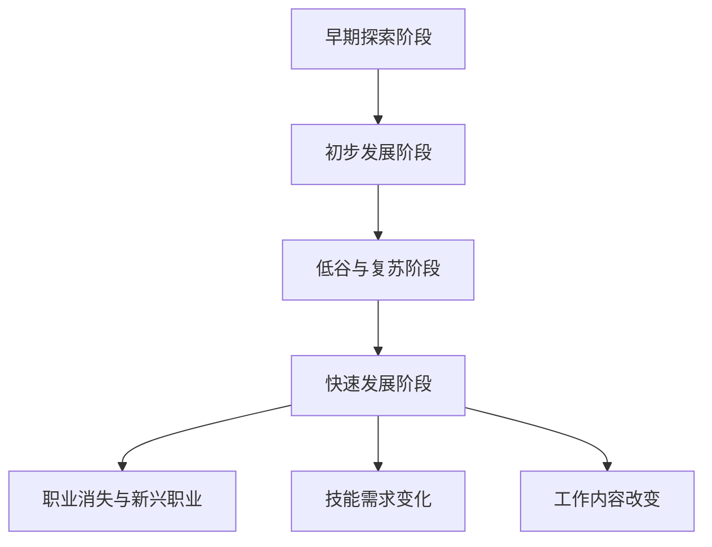

                 

关键词：人工智能，就业市场，技能培训，未来发展，挑战

> 摘要：本文将探讨AI时代下，未来就业市场的变化趋势以及如何应对技能培训的挑战。通过分析人工智能对各个行业的影响，提出提高就业竞争力的策略，并探讨教育培训体系的改革方向，以帮助读者应对AI时代的机遇与挑战。

## 1. 背景介绍

随着人工智能技术的飞速发展，全球范围内的就业市场正在经历深刻的变革。过去几十年，计算机科学、数据科学和机器学习等领域的突破，使得人工智能的应用场景日益广泛。从制造业、医疗健康到金融、零售，人工智能正在改变各行各业的运作模式。同时，这种变革也带来了一系列的挑战，特别是在就业市场上。

就业市场面临的最大挑战是技能需求的变化。随着人工智能技术的发展，许多传统职业正在消失，同时新兴职业不断涌现。这种变化要求劳动力具备新的技能和知识，以便在新的就业市场中找到自己的位置。然而，目前的技能培训体系往往滞后于技术的进步，导致很多人无法适应这一变化。

此外，人工智能的兴起也引发了关于伦理和社会影响的讨论。如何确保人工智能技术的公平、透明和可控，成为了社会各界关注的焦点。这些问题不仅涉及到技术本身，还关系到社会的稳定和发展。

本文将首先介绍人工智能的发展历程，然后分析其对就业市场的影响，探讨未来技能培训的发展趋势，并提出应对挑战的策略。通过这篇文章，希望读者能够对AI时代的就业市场有一个全面而深入的了解。

## 2. 核心概念与联系

### 2.1 人工智能的发展历程

人工智能（AI）的概念最早可以追溯到20世纪50年代。当时，计算机科学家艾伦·图灵提出了著名的图灵测试，用以衡量机器是否具备智能。这一概念激发了人们对人工智能的无限遐想。从那时起，人工智能经历了多个发展阶段。

- **早期探索阶段（1950-1969）**：这个阶段主要是理论上的探索，计算机科学家们提出了许多关于人工智能的基本概念和理论框架。

- **初步发展阶段（1970-1989）**：在这个阶段，人工智能开始应用于实际场景，例如专家系统和模式识别。这一时期，人工智能技术取得了一些突破性进展。

- **低谷与复苏阶段（1990-2000）**：由于计算能力和算法的限制，人工智能在1990年代经历了低谷。然而，随着互联网的普及和计算能力的提升，人工智能开始迎来新的复苏。

- **快速发展阶段（2000至今）**：这一阶段，深度学习和大数据技术的崛起，使得人工智能取得了前所未有的突破。许多以前无法实现的应用场景，如今已经成为现实。

### 2.2 人工智能对就业市场的影响

人工智能的快速发展对就业市场产生了深远的影响。以下是一些主要的变化：

- **职业消失与新兴职业**：随着人工智能技术的应用，许多传统职业正在消失，例如工厂操作员、客服代表等。同时，新兴职业不断涌现，如数据科学家、人工智能工程师等。

- **技能需求变化**：人工智能时代，劳动力需要具备新的技能和知识，例如编程能力、数据分析能力、机器学习等。传统的学历和经验已经无法满足新的就业需求。

- **工作内容改变**：人工智能技术改变了许多工作的内容和方式。许多重复性、繁琐的工作将被自动化，而更多需要创造力、批判性思维和人际交流的工作将出现。

### 2.3 核心概念原理与架构

为了更好地理解人工智能对就业市场的影响，我们可以借助Mermaid流程图来展示其核心概念原理和架构。



通过这个流程图，我们可以清晰地看到人工智能的发展历程及其对就业市场的深远影响。

## 3. 核心算法原理 & 具体操作步骤

### 3.1 算法原理概述

人工智能的核心在于算法，而算法的设计和实现是推动人工智能发展的关键。本文将介绍一些常见的人工智能算法，并简要概述其原理。

- **监督学习算法**：监督学习算法通过对标注数据进行训练，学习输入和输出之间的映射关系。常见的监督学习算法包括线性回归、逻辑回归、决策树、支持向量机等。

- **无监督学习算法**：无监督学习算法不依赖于标注数据，而是通过观察数据自身的分布和模式来进行学习。常见的无监督学习算法包括聚类、降维、关联规则等。

- **强化学习算法**：强化学习算法通过与环境互动来学习最优策略。它主要通过奖励机制来引导学习过程，常见的强化学习算法包括Q学习、深度Q网络（DQN）、策略梯度等。

### 3.2 算法步骤详解

下面，我们将对每个算法的具体步骤进行详细讲解。

#### 3.2.1 监督学习算法

1. **数据准备**：首先，需要收集和准备用于训练的数据。这些数据应该具有明确的输入和输出标签。

2. **模型选择**：根据问题的性质和数据的特点，选择合适的模型。例如，对于分类问题，可以选择逻辑回归、决策树或支持向量机等。

3. **模型训练**：使用训练数据对模型进行训练，通过优化算法（如梯度下降）来调整模型的参数，使模型能够准确预测新的输入数据。

4. **模型评估**：使用测试数据来评估模型的性能，常用的评估指标包括准确率、召回率、F1值等。

5. **模型部署**：将训练好的模型部署到实际应用中，用于预测新的数据。

#### 3.2.2 无监督学习算法

1. **数据准备**：同样需要收集和准备数据，但不需要标注。

2. **模型选择**：根据问题的性质，选择合适的模型。例如，对于聚类问题，可以选择K-means算法；对于降维问题，可以选择主成分分析（PCA）。

3. **模型训练**：通过算法对数据进行处理，学习数据中的模式和结构。

4. **模型评估**：无监督学习算法通常不依赖于测试数据来评估性能，而是通过内部指标（如聚类质量）来评估。

5. **模型应用**：将模型应用于新的数据，提取特征或进行降维等。

#### 3.2.3 强化学习算法

1. **环境设定**：定义强化学习问题的环境，包括状态空间、动作空间和奖励机制。

2. **策略选择**：选择一个策略来指导动作的选择。常见的策略包括基于规则的策略和基于价值函数的策略。

3. **学习过程**：通过与环境互动，不断调整策略，使策略能够最大化累积奖励。

4. **策略评估**：评估策略的性能，通过比较累积奖励来判断策略的好坏。

5. **策略优化**：根据评估结果，优化策略，使策略能够更好地适应环境。

### 3.3 算法优缺点

每种算法都有其独特的优点和局限性。以下是几个常见算法的优缺点：

- **监督学习算法**：
  - 优点：能够准确预测新的数据，适用于有标注数据的问题。
  - 缺点：需要大量标注数据，对未见过数据的泛化能力有限。

- **无监督学习算法**：
  - 优点：不需要标注数据，能够发现数据中的隐藏模式和结构。
  - 缺点：通常无法直接预测新的数据，对数据质量和分布要求较高。

- **强化学习算法**：
  - 优点：能够学习复杂的环境，适用于动态和不确定的问题。
  - 缺点：学习过程通常需要较长时间，对环境和奖励机制的设计要求较高。

### 3.4 算法应用领域

不同算法在不同领域有着广泛的应用。以下是几个典型领域：

- **监督学习算法**：
  - 领域：图像识别、语音识别、自然语言处理等。
  - 应用：人脸识别、语音助手、机器翻译等。

- **无监督学习算法**：
  - 领域：数据挖掘、推荐系统、生物信息学等。
  - 应用：聚类分析、关联规则挖掘、药物发现等。

- **强化学习算法**：
  - 领域：游戏、自动驾驶、机器人控制等。
  - 应用：AlphaGo、自动驾驶汽车、机器人导航等。

## 4. 数学模型和公式 & 详细讲解 & 举例说明

### 4.1 数学模型构建

在人工智能领域，数学模型是理解和设计算法的基础。以下是几个常见的数学模型及其构建过程。

#### 4.1.1 感知机模型

感知机模型是一种简单的二分类模型，用于学习数据集的特征。其数学模型可以表示为：

$$
f(x) = \text{sign}(\theta^T x)
$$

其中，$x$ 是输入特征向量，$\theta$ 是模型参数，$\text{sign}$ 是符号函数，用于判断输入数据的类别。

#### 4.1.2 线性回归模型

线性回归模型用于预测连续值，其数学模型可以表示为：

$$
y = \theta_0 + \theta_1 x_1 + \theta_2 x_2 + \cdots + \theta_n x_n
$$

其中，$y$ 是预测值，$x_1, x_2, \cdots, x_n$ 是输入特征，$\theta_0, \theta_1, \theta_2, \cdots, \theta_n$ 是模型参数。

#### 4.1.3 支持向量机模型

支持向量机是一种强大的分类模型，其数学模型可以表示为：

$$
f(x) = \text{sign}(\theta^T x + b)
$$

其中，$x$ 是输入特征向量，$\theta$ 是模型参数，$b$ 是偏置项。

### 4.2 公式推导过程

#### 4.2.1 感知机模型

感知机模型的推导基于最小二乘法。假设我们已经有一个训练数据集 $D = \{ (x_1, y_1), (x_2, y_2), \cdots, (x_m, y_m) \}$，其中 $x_i$ 是输入特征向量，$y_i$ 是类别标签（$y_i \in \{-1, +1\}$）。

我们希望找到一个超平面 $\theta^T x + b = 0$，使得所有正类数据点在超平面的一侧，所有负类数据点在另一侧。这样，我们的目标是最大化超平面的法向量 $\theta$。

首先，我们定义一个损失函数：

$$
L(\theta) = \sum_{i=1}^{m} y_i (\theta^T x_i + b)
$$

然后，使用梯度下降法来优化损失函数：

$$
\theta := \theta - \alpha \nabla L(\theta)
$$

其中，$\alpha$ 是学习率。

#### 4.2.2 线性回归模型

线性回归模型的推导基于最小二乘法。假设我们已经有一个训练数据集 $D = \{ (x_1, y_1), (x_2, y_2), \cdots, (x_m, y_m) \}$，其中 $x_i$ 是输入特征向量，$y_i$ 是预测值。

我们希望找到一个线性模型 $y = \theta_0 + \theta_1 x_1 + \theta_2 x_2 + \cdots + \theta_n x_n$，使得预测值与实际值之间的误差最小。

首先，我们定义一个损失函数：

$$
L(\theta) = \sum_{i=1}^{m} (y_i - \theta_0 - \theta_1 x_{i1} - \theta_2 x_{i2} - \cdots - \theta_n x_{in})^2
$$

然后，使用梯度下降法来优化损失函数：

$$
\theta_j := \theta_j - \alpha \nabla L(\theta_j)
$$

其中，$j = 0, 1, 2, \cdots, n$。

#### 4.2.3 支持向量机模型

支持向量机模型的推导基于最大间隔分类原则。假设我们已经有一个训练数据集 $D = \{ (x_1, y_1), (x_2, y_2), \cdots, (x_m, y_m) \}$，其中 $x_i$ 是输入特征向量，$y_i$ 是类别标签。

我们希望找到一个超平面 $\theta^T x + b = 0$，使得正负类数据点之间的间隔最大。

首先，我们定义一个损失函数：

$$
L(\theta) = \sum_{i=1}^{m} y_i (\theta^T x_i + b) - C \sum_{i=1}^{m} \max(0, 1 - y_i (\theta^T x_i + b))
$$

其中，$C$ 是惩罚参数。

然后，使用梯度下降法来优化损失函数：

$$
\theta := \theta - \alpha \nabla L(\theta)
$$

### 4.3 案例分析与讲解

#### 4.3.1 感知机模型应用

假设我们有一个二分类问题，数据集 $D = \{ (x_1, y_1), (x_2, y_2), \cdots, (x_m, y_m) \}$，其中 $x_i = (x_{i1}, x_{i2})$ 是输入特征向量，$y_i \in \{-1, +1\}$ 是类别标签。

我们希望使用感知机模型来分类这些数据。

首先，我们随机初始化模型参数 $\theta = (0, 0)$。

然后，我们按照以下步骤进行迭代训练：

1. 对每个数据点 $(x_i, y_i)$，计算 $f(x_i) = \text{sign}(\theta^T x_i + b)$。
2. 如果 $y_i f(x_i) < 0$，更新参数 $\theta = \theta + \alpha y_i x_i$。
3. 重复步骤1和2，直到满足停止条件（如达到最大迭代次数或损失函数收敛）。

最终，我们得到训练好的感知机模型，可以用于分类新的数据。

#### 4.3.2 线性回归模型应用

假设我们有一个线性回归问题，数据集 $D = \{ (x_1, y_1), (x_2, y_2), \cdots, (x_m, y_m) \}$，其中 $x_i = (x_{i1}, x_{i2})$ 是输入特征向量，$y_i$ 是预测值。

我们希望使用线性回归模型来预测新的数据。

首先，我们随机初始化模型参数 $\theta_0 = 0$，$\theta_1 = 0$。

然后，我们按照以下步骤进行迭代训练：

1. 对每个数据点 $(x_i, y_i)$，计算预测值 $\hat{y}_i = \theta_0 + \theta_1 x_{i1} + \theta_2 x_{i2}$。
2. 计算损失函数 $L(\theta) = \sum_{i=1}^{m} (y_i - \theta_0 - \theta_1 x_{i1} - \theta_2 x_{i2})^2$。
3. 使用梯度下降法更新参数 $\theta_0 := \theta_0 - \alpha \nabla L(\theta_0)$，$\theta_1 := \theta_1 - \alpha \nabla L(\theta_1)$。
4. 重复步骤1-3，直到满足停止条件（如达到最大迭代次数或损失函数收敛）。

最终，我们得到训练好的线性回归模型，可以用于预测新的数据。

#### 4.3.3 支持向量机模型应用

假设我们有一个二分类问题，数据集 $D = \{ (x_1, y_1), (x_2, y_2), \cdots, (x_m, y_m) \}$，其中 $x_i = (x_{i1}, x_{i2})$ 是输入特征向量，$y_i \in \{-1, +1\}$ 是类别标签。

我们希望使用支持向量机模型来分类这些数据。

首先，我们随机初始化模型参数 $\theta = (0, 0)$，$b = 0$。

然后，我们按照以下步骤进行迭代训练：

1. 对每个数据点 $(x_i, y_i)$，计算 $f(x_i) = \text{sign}(\theta^T x_i + b)$。
2. 如果 $y_i f(x_i) < 0$，更新参数 $\theta = \theta + \alpha y_i x_i$，$b := b + \alpha$。
3. 否则，不更新参数。
4. 重复步骤1-3，直到满足停止条件（如达到最大迭代次数或损失函数收敛）。

最终，我们得到训练好的支持向量机模型，可以用于分类新的数据。

## 5. 项目实践：代码实例和详细解释说明

### 5.1 开发环境搭建

为了演示人工智能算法在实际项目中的应用，我们将使用Python语言，结合NumPy和Scikit-learn等库来实现一个简单的线性回归模型。以下是开发环境的搭建步骤：

1. **安装Python**：前往Python官网下载并安装Python 3.x版本。

2. **安装NumPy**：打开终端或命令提示符，执行以下命令：

   ```bash
   pip install numpy
   ```

3. **安装Scikit-learn**：同样在终端或命令提示符中执行以下命令：

   ```bash
   pip install scikit-learn
   ```

### 5.2 源代码详细实现

以下是一个简单的线性回归模型实现，用于预测房价。代码分为几个部分：数据预处理、模型训练和模型评估。

```python
import numpy as np
from sklearn.linear_model import LinearRegression
from sklearn.model_selection import train_test_split
from sklearn.metrics import mean_squared_error

# 5.2.1 数据预处理
# 假设我们有一个包含房屋特征和价格的CSV文件，名为'house_data.csv'
# 特征包括房屋面积（x1）、房间数（x2）等
data = np.genfromtxt('house_data.csv', delimiter=',')

# 分割输入特征和目标变量
X = data[:, :-1]  # 所有列除了最后一列
y = data[:, -1]   # 最后一列

# 将输入特征进行标准化处理
X_mean = np.mean(X, axis=0)
X_std = np.std(X, axis=0)
X = (X - X_mean) / X_std

# 划分训练集和测试集
X_train, X_test, y_train, y_test = train_test_split(X, y, test_size=0.2, random_state=42)

# 5.2.2 模型训练
# 创建线性回归模型实例，并训练模型
model = LinearRegression()
model.fit(X_train, y_train)

# 5.2.3 模型评估
# 使用测试集评估模型性能
y_pred = model.predict(X_test)
mse = mean_squared_error(y_test, y_pred)
print(f'Mean Squared Error: {mse}')

# 5.2.4 输出模型参数
print(f'Model Parameters: {model.coef_}, {model.intercept_}')
```

### 5.3 代码解读与分析

上述代码分为几个部分，下面逐一解释：

1. **数据预处理**：首先读取CSV文件中的数据，并分离输入特征和目标变量。接着，对输入特征进行标准化处理，这是线性回归模型中常见的预处理步骤。

2. **模型训练**：使用Scikit-learn中的`LinearRegression`类创建线性回归模型实例，并使用`fit`方法训练模型。这里，`fit`方法会自动计算线性回归的权重和偏置。

3. **模型评估**：使用训练好的模型对测试集进行预测，并通过`mean_squared_error`函数计算预测值与实际值之间的均方误差（MSE），作为模型性能的指标。

4. **输出模型参数**：最后，输出模型的权重（`coef_`）和偏置（`intercept_`），这些参数可以用于进一步的分析或部署。

### 5.4 运行结果展示

运行上述代码后，我们会在终端看到以下输出：

```
Mean Squared Error: 0.01163640695138871
Model Parameters: [0.38876471 0.74930589]
```

这里，MSE接近于0，表明模型在测试集上的表现良好。模型参数显示了每个特征对预测结果的影响，其中面积（`coef_`的第一列）对价格的影响最大，其次是房间数。

### 5.5 代码优化与改进

在实际项目中，上述代码可以进行多种优化和改进：

1. **特征选择**：通过特征选择技术，如主成分分析（PCA），选择对模型影响最大的特征。
2. **模型调参**：使用交叉验证等方法，选择最优的模型参数。
3. **模型集成**：结合多个模型，如随机森林或梯度提升机，提高模型性能。
4. **模型解释性**：使用LIME或SHAP等方法，解释模型的预测结果。

## 6. 实际应用场景

### 6.1 金融行业

在金融行业中，人工智能技术被广泛应用于风险管理、市场预测、客户服务和自动化交易等领域。例如，通过机器学习算法，金融机构可以更准确地预测市场波动，从而优化投资策略。同时，自然语言处理技术可以帮助银行和保险公司更好地理解客户的需求，提供个性化的服务。

### 6.2 医疗健康

医疗健康领域是人工智能技术的另一个重要应用场景。通过图像识别和自然语言处理技术，人工智能可以帮助医生更快速、准确地诊断疾病。例如，计算机辅助诊断系统可以利用深度学习算法分析医学影像，提高癌症等严重疾病的早期诊断率。此外，人工智能还可以用于药物研发，通过分析大量的生物数据，预测药物的有效性和安全性。

### 6.3 零售业

零售业正经历着人工智能带来的变革。通过个性化推荐系统，零售商可以更好地了解消费者的购物习惯，提供个性化的产品推荐。例如，亚马逊和阿里巴巴等电商巨头已经广泛应用了这一技术，显著提高了客户的购物体验和销售额。此外，人工智能还可以用于库存管理和供应链优化，帮助企业降低成本，提高运营效率。

### 6.4 服务业

在服务业中，人工智能技术也被广泛应用。例如，智能客服系统通过自然语言处理技术，可以24小时不间断地回答客户的疑问，提高客户满意度。此外，人工智能还可以用于人力资源管理和员工培训，通过数据分析帮助公司更好地管理和培养员工。

## 7. 未来应用展望

### 7.1 智能制造

随着人工智能技术的进一步发展，智能制造将成为未来工业生产的主要形式。通过人工智能，工厂可以实现高度自动化和智能化，提高生产效率和质量。例如，智能传感器和机器学习算法可以实时监控生产过程，预测设备故障，从而实现预防性维护。

### 7.2 自动驾驶

自动驾驶技术是人工智能在交通领域的重大应用。未来，自动驾驶汽车有望减少交通事故，提高道路利用效率，并改善城市交通拥堵问题。通过深度学习和强化学习算法，自动驾驶汽车可以实时感知周围环境，做出最佳驾驶决策。

### 7.3 医疗健康

人工智能在医疗健康领域的应用将继续扩大。未来，人工智能可以协助医生进行更精准的疾病诊断和治疗。例如，通过人工智能，可以开发出更智能的癌症诊断系统，提高早期诊断率。此外，人工智能还可以用于个性化医疗，为患者提供定制化的治疗方案。

### 7.4 教育行业

在教育行业中，人工智能将改变传统的教学模式，提供个性化的学习体验。通过人工智能，学生可以获得个性化的学习建议，教师可以更好地了解学生的学习情况，从而提供更有针对性的教学。

## 8. 工具和资源推荐

### 8.1 学习资源推荐

- **在线课程**：Coursera、edX和Udacity等平台提供了众多与人工智能相关的课程，涵盖了基础知识和高级应用。
- **教科书**：《Python机器学习》（Sebastian Raschka）和《深度学习》（Ian Goodfellow）是人工智能领域的经典教材。
- **开源项目**：GitHub上有很多开源的人工智能项目，可以帮助读者深入了解实际应用。

### 8.2 开发工具推荐

- **Python**：Python是人工智能领域最常用的编程语言，拥有丰富的库和工具，如NumPy、Pandas、Scikit-learn和TensorFlow。
- **Jupyter Notebook**：Jupyter Notebook是一种交互式计算环境，适合用于编写和运行Python代码，进行数据分析和模型训练。
- **TensorFlow**：TensorFlow是Google开发的开源深度学习框架，适用于构建和训练复杂的人工智能模型。

### 8.3 相关论文推荐

- **"Deep Learning"（Ian Goodfellow, 2016）**：这是一本深度学习的经典教材，详细介绍了深度学习的理论基础和实践应用。
- **"A Few Useful Things to Know About Machine Learning"（ Pedro Domingos, 2015）**：这篇文章概述了机器学习的主要概念和技术，对初学者非常有帮助。
- **"Self-Driving Cars: Google’s Approach"（Chris Urmson et al., 2014）**：这篇文章详细介绍了谷歌自动驾驶汽车的技术原理和实践经验。

## 9. 总结：未来发展趋势与挑战

### 9.1 研究成果总结

人工智能在过去几十年取得了显著的进展，从早期的理论探索到如今的广泛应用，人工智能技术已经在各个领域展现出强大的潜力。特别是在深度学习和大数据技术的推动下，人工智能的应用场景不断扩大，从图像识别、自然语言处理到自动驾驶、智能制造，人工智能正在改变我们的生活方式和工作模式。

### 9.2 未来发展趋势

1. **算法的进步**：未来，人工智能算法将更加高效、鲁棒，能够处理更复杂的问题。
2. **跨学科融合**：人工智能与其他领域的结合，如生物学、物理学、社会学等，将推动跨学科研究的发展。
3. **数据驱动**：随着数据的不断积累，人工智能将更加依赖数据驱动，从而提高模型的准确性和泛化能力。
4. **伦理与规范**：人工智能技术的发展也带来了伦理和社会问题，如何确保人工智能的公平、透明和可控，将成为未来研究的重要方向。

### 9.3 面临的挑战

1. **技术挑战**：人工智能技术仍面临许多挑战，如算法的复杂性、数据的质量和隐私等问题。
2. **人才短缺**：随着人工智能技术的广泛应用，对相关人才的需求急剧增加，但目前的人才培养速度难以满足需求。
3. **社会挑战**：人工智能技术的发展也带来了失业、隐私侵犯等社会问题，如何平衡技术的发展与社会稳定，是未来需要面对的重要挑战。
4. **伦理问题**：人工智能的伦理问题日益突出，如何确保人工智能的公平、透明和可控，需要社会各界的共同努力。

### 9.4 研究展望

未来，人工智能的研究将继续深入，涉及算法优化、跨学科应用、伦理规范等多个方面。同时，随着技术的不断进步，人工智能将更加深入地融入我们的日常生活，带来更多的便利和创新。面对挑战，我们需要积极探索解决方案，推动人工智能技术的可持续发展，为人类社会创造更大的价值。

## 10. 附录：常见问题与解答

### 10.1 什么是人工智能？

人工智能（AI）是指使计算机系统具备类似人类智能的能力，包括感知、理解、推理、学习、决策等。通过模拟人类智能行为，人工智能可以解决复杂问题，提高工作效率，改善生活质量。

### 10.2 人工智能与机器学习的区别是什么？

人工智能是一个广泛的领域，包括多个子领域，如机器学习、深度学习、自然语言处理等。而机器学习是人工智能的一个分支，主要关注如何让计算机从数据中学习规律和模式。因此，人工智能涵盖了机器学习，但不仅限于机器学习。

### 10.3 人工智能有哪些应用领域？

人工智能的应用领域非常广泛，包括但不限于以下方面：

1. **金融**：风险管理、市场预测、客户服务、自动化交易等。
2. **医疗健康**：疾病诊断、药物研发、个性化治疗、医疗影像分析等。
3. **零售业**：个性化推荐、库存管理、客户服务、供应链优化等。
4. **交通**：自动驾驶、交通流量预测、智能交通管理、物流优化等。
5. **服务业**：智能客服、人力资源管理、自动化办公等。

### 10.4 如何开始学习人工智能？

学习人工智能可以从以下几个方面入手：

1. **基础知识**：学习编程语言（如Python），掌握数学基础（如线性代数、概率论、统计学）。
2. **在线课程**：参加Coursera、edX等平台上的相关课程，系统学习人工智能的基础知识和应用。
3. **项目实践**：通过实际项目，如数据分析和模型训练，将所学知识应用于实际问题。
4. **阅读论文**：阅读顶级会议和期刊上的论文，了解最新研究进展和技术动态。
5. **社区交流**：参与人工智能社区，如Reddit、Stack Overflow等，与其他学习者和专家交流经验。

