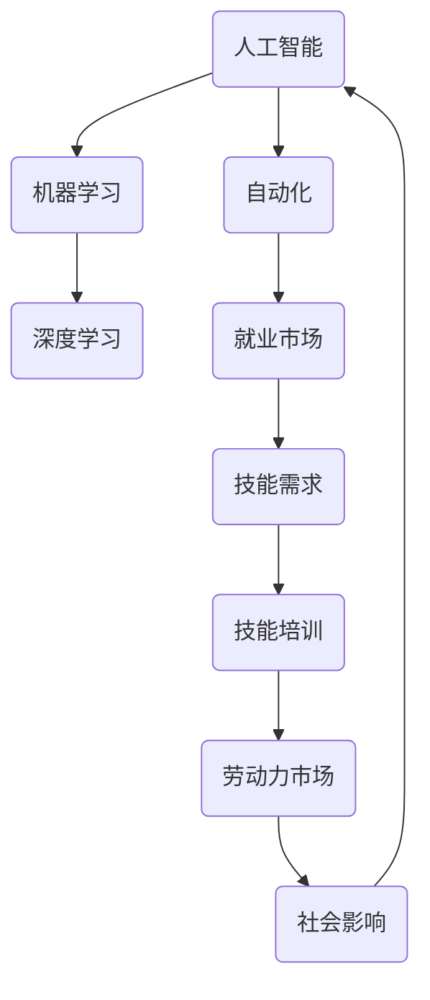

                 

### 关键词

人工智能（AI）、就业市场、技能培训、发展趋势、算法、数学模型、项目实践、工具和资源、未来展望。

### 摘要

本文深入探讨了人工智能时代下，未来就业市场的演变以及与之相关的技能培训发展趋势。通过分析AI对各个行业的影响，探讨了新职业技能的需求变化，并提出了应对这些变化的策略。文章还详细介绍了核心算法原理、数学模型、项目实践等内容，为读者提供了全面的技术视角。此外，文章也对未来趋势、挑战和展望进行了探讨，旨在为专业人士和从业者提供有价值的参考。

## 1. 背景介绍

随着人工智能（AI）技术的飞速发展，我们正迎来一场前所未有的技术革命。AI已经逐渐渗透到我们的日常生活中，从智能家居、自动驾驶到医疗诊断、金融分析，AI的应用场景日益广泛。与此同时，传统行业正面临着前所未有的变革，自动化和智能化的趋势正在重新定义就业市场和劳动力结构。

### 1.1 AI技术的发展

人工智能技术起源于20世纪50年代，随着计算机科学的进步和大数据、深度学习等新理论的提出，AI技术取得了显著的发展。从最初的符号主义、逻辑推理，到基于神经网络的感知与学习，AI在图像识别、自然语言处理、决策支持等领域取得了突破性进展。目前，深度学习、强化学习等前沿技术正在引领AI向更加智能化、自主化的方向发展。

### 1.2 对就业市场的影响

AI技术的广泛应用不仅带来了生产效率的提升，也深刻改变了就业市场的格局。一方面，自动化和智能化的工作替代了许多传统岗位，如制造业、物流配送等；另一方面，AI技术的快速发展催生了大量新的职业机会，如数据科学家、机器学习工程师、AI产品经理等。

然而，这种变革并非一帆风顺。尽管AI技术带来了就业市场的新机遇，但也引发了关于就业替代、技能需求变化和社会影响的广泛讨论。对于个人来说，如何适应这个快速变化的环境，掌握新的技能，成为了亟待解决的问题。

## 2. 核心概念与联系

在探讨AI时代的就业市场与技能培训时，有必要了解一些核心概念和它们之间的联系。以下是一个使用Mermaid绘制的流程图，用于展示这些概念及其相互关系：



### 2.1 人工智能（AI）

人工智能是指通过计算机模拟人类的智能行为，实现感知、理解、学习、推理、决策等功能的综合性技术。AI的核心目标是使计算机能够执行通常需要人类智能才能完成的任务。

### 2.2 机器学习（ML）

机器学习是AI的一个重要分支，它侧重于通过算法从数据中学习规律，并对未知数据进行预测或决策。常见的机器学习算法包括线性回归、决策树、支持向量机、神经网络等。

### 2.3 深度学习（DL）

深度学习是机器学习的一种方法，它通过多层神经网络进行特征提取和复杂模式识别。深度学习在图像识别、语音识别、自然语言处理等领域取得了显著成果。

### 2.4 自动化（Automation）

自动化是指通过软件、硬件和控制系统来执行常规的任务和流程，减少人工干预。自动化技术使得许多重复性和低技能的工作可以被机器替代，从而提高生产效率和降低成本。

### 2.5 就业市场（Job Market）

就业市场是指劳动力供求双方进行匹配的场所，包括各种职业岗位的招聘和求职活动。就业市场的变化直接反映了劳动力需求的变化，同时也受到技术进步、经济环境等因素的影响。

### 2.6 技能需求（Skill Demand）

技能需求是指劳动力市场中对于不同技能水平的需求。随着技术的发展，一些传统技能可能变得过时，而新的技能需求不断出现。掌握适应当前和未来市场需求的新技能对于求职者来说至关重要。

### 2.7 技能培训（Skill Training）

技能培训是指通过教育和培训手段提高劳动者的技能水平，以满足就业市场的需求。技能培训的内容包括技术技能、软技能（如沟通、团队合作等）和职业规划等。

### 2.8 劳动力市场（Labor Market）

劳动力市场是指劳动力的供给和需求相互作用的市场。劳动力市场的健康程度直接影响就业率和工资水平，进而影响社会的稳定和发展。

### 2.9 社会影响（Social Impact）

社会影响是指技术变革对社会各个方面带来的影响，包括经济、教育、就业、伦理等方面。人工智能技术的快速发展对社会产生了深远的影响，需要我们进行深入的思考和应对。

通过以上核心概念及其相互关系的介绍，我们可以更好地理解AI时代就业市场与技能培训的发展趋势。

## 3. 核心算法原理 & 具体操作步骤

在AI时代，核心算法的原理和具体操作步骤是理解和应用AI技术的基础。以下是对几个关键算法的概述和步骤详解。

### 3.1 算法原理概述

#### 3.1.1 深度学习

深度学习是一种基于多层神经网络进行特征提取和复杂模式识别的方法。它的核心思想是通过多层网络逐层提取数据中的特征，从而实现高层次的抽象表示。深度学习在图像识别、语音识别、自然语言处理等领域取得了显著成果。

#### 3.1.2 强化学习

强化学习是一种通过试错学习来最大化长期奖励的算法。它通过智能体与环境之间的交互来学习策略，以实现某一目标。强化学习在游戏、推荐系统、自动驾驶等领域具有广泛的应用。

#### 3.1.3 自然语言处理

自然语言处理（NLP）是使计算机能够理解、生成和处理人类语言的技术。NLP的核心算法包括词嵌入、序列标注、机器翻译、情感分析等。

### 3.2 算法步骤详解

#### 3.2.1 深度学习

1. 数据预处理：对原始数据进行清洗、归一化等处理，使其适合输入神经网络。
2. 构建神经网络：设计多层神经网络，包括输入层、隐藏层和输出层。
3. 模型训练：通过反向传播算法训练网络权重，优化模型参数。
4. 模型评估：使用验证集测试模型性能，并进行调优。

#### 3.2.2 强化学习

1. 确定智能体和环境的交互模型：定义智能体的行动空间和状态空间，以及奖励函数。
2. 初始化智能体状态和策略：智能体初始状态为随机状态，策略为随机策略。
3. 执行行动：智能体在环境中执行行动，观察环境状态和奖励。
4. 更新策略：根据奖励和历史行动更新智能体的策略。
5. 重复执行行动和策略更新，直到达到预定目标。

#### 3.2.3 自然语言处理

1. 词嵌入：将词汇映射为低维向量表示。
2. 词汇表示：将文本转换为向量表示，如词袋模型、词嵌入等。
3. 序列标注：对文本进行词性标注、命名实体识别等。
4. 模型训练：使用训练数据训练模型，优化参数。
5. 模型评估：使用测试数据评估模型性能。

### 3.3 算法优缺点

#### 3.3.1 深度学习

**优点：** 高效的特征提取能力，强大的模式识别能力，适用于复杂的数据集。

**缺点：** 需要大量的数据和计算资源，模型可解释性差。

#### 3.3.2 强化学习

**优点：** 能够处理动态和不确定性的环境，具备自主学习和适应能力。

**缺点：** 需要大量的时间和计算资源，策略学习可能陷入局部最优。

#### 3.3.3 自然语言处理

**优点：** 具有广泛的应用前景，能够处理复杂的语言结构。

**缺点：** 对数据和计算资源要求较高，对语言理解仍存在局限性。

### 3.4 算法应用领域

**深度学习：** 图像识别、语音识别、自然语言处理、自动驾驶等。

**强化学习：** 游戏AI、推荐系统、机器人控制等。

**自然语言处理：** 机器翻译、文本分类、情感分析等。

通过以上对核心算法原理和具体操作步骤的介绍，读者可以更好地理解AI技术在各个领域的应用及其优势与挑战。

## 4. 数学模型和公式 & 详细讲解 & 举例说明

在人工智能领域，数学模型和公式是理解和应用算法的核心。以下将介绍几个关键的数学模型和公式的构建、推导过程，并通过具体案例进行说明。

### 4.1 数学模型构建

#### 4.1.1 神经网络模型

神经网络是一种通过模拟人脑神经元连接结构来实现计算和学习的模型。其基本单元是神经元，神经元之间的连接称为边，连接的强度称为权重。

假设我们有一个单层神经网络，包含输入层、隐藏层和输出层。输入层有n个神经元，隐藏层有m个神经元，输出层有k个神经元。

1. 输入层到隐藏层的激活函数：
   $$ z_j = \sum_{i=1}^{n} w_{ji}x_i + b_j $$
   其中，$w_{ji}$是输入层到隐藏层的权重，$b_j$是隐藏层的偏置。

2. 隐藏层到输出层的激活函数：
   $$ a_k = \sum_{j=1}^{m} w_{kj}z_j + b_k $$
   其中，$w_{kj}$是隐藏层到输出层的权重，$b_k$是输出层的偏置。

3. 激活函数通常采用非线性函数，如Sigmoid函数、ReLU函数等。

#### 4.1.2 强化学习模型

强化学习中的核心数学模型是值函数和策略。

1. 值函数：
   $$ V(s) = \sum_{a} \gamma \sum_{s'} P(s'|s, a) \sum_{r} r(s', a) $$
   其中，$s$是状态，$a$是行动，$s'$是下一个状态，$r$是奖励，$\gamma$是折扣因子。

2. 策略：
   $$ \pi(a|s) = \arg\max_a \sum_{s'} P(s'|s, a) V(s') $$
   其中，$\pi(a|s)$是给定状态下采取行动$a$的概率。

### 4.2 公式推导过程

#### 4.2.1 神经网络反向传播算法

神经网络的反向传播算法用于更新网络权重和偏置，以最小化损失函数。

1. 损失函数：
   $$ L = \sum_{i=1}^{k} (y_i - a_k)^2 $$
   其中，$y_i$是实际输出，$a_k$是预测输出。

2. 前向传播：
   $$ a_{k} = \sigma(\sum_{j=1}^{m} w_{kj}z_j + b_k) $$
   $$ z_j = \sum_{i=1}^{n} w_{ji}x_i + b_j $$

3. 反向传播：
   $$ \frac{\partial L}{\partial w_{kj}} = (a_k - y_k) \cdot z_j $$
   $$ \frac{\partial L}{\partial b_k} = (a_k - y_k) \cdot 1 $$
   $$ \frac{\partial L}{\partial w_{ji}} = (z_j - z_j \cdot \sigma'(z_j)) \cdot x_i $$
   $$ \frac{\partial L}{\partial b_j} = (z_j - z_j \cdot \sigma'(z_j)) \cdot 1 $$

4. 更新权重和偏置：
   $$ w_{kj} \leftarrow w_{kj} - \alpha \cdot \frac{\partial L}{\partial w_{kj}} $$
   $$ b_k \leftarrow b_k - \alpha \cdot \frac{\partial L}{\partial b_k} $$
   $$ w_{ji} \leftarrow w_{ji} - \alpha \cdot \frac{\partial L}{\partial w_{ji}} $$
   $$ b_j \leftarrow b_j - \alpha \cdot \frac{\partial L}{\partial b_j} $$
   其中，$\alpha$是学习率。

#### 4.2.2 强化学习中的Q学习算法

Q学习是一种通过迭代更新Q值来学习最优策略的方法。

1. Q值函数：
   $$ Q(s, a) = r + \gamma \max_{a'} Q(s', a') $$
   其中，$s$是状态，$a$是行动，$s'$是下一个状态，$r$是即时奖励，$\gamma$是折扣因子。

2. 更新Q值：
   $$ Q(s, a) \leftarrow Q(s, a) + \alpha (r + \gamma \max_{a'} Q(s', a') - Q(s, a)) $$
   其中，$\alpha$是学习率。

### 4.3 案例分析与讲解

#### 4.3.1 神经网络在图像分类中的应用

假设我们使用一个简单的神经网络对MNIST数据集进行手写数字分类。输入层有784个神经元（对应图像的像素值），隐藏层有100个神经元，输出层有10个神经元（对应10个数字类别）。

1. 数据预处理：将图像像素值缩放到[0, 1]区间。

2. 前向传播：输入一个手写数字图像，通过前向传播计算输出概率。

3. 反向传播：根据实际标签和预测标签计算损失，并通过反向传播更新网络权重。

4. 模型评估：在验证集上评估模型性能，调整超参数以优化模型。

#### 4.3.2 强化学习在自动驾驶中的应用

假设我们使用强化学习算法训练一个自动驾驶模型。状态空间包括车辆位置、速度、加速度等，行动空间包括加速、减速、转向等。

1. 确定智能体和环境：智能体为自动驾驶模型，环境为道路场景。

2. 初始化策略：智能体初始策略为随机策略。

3. 执行行动：智能体在环境中执行行动，并收集奖励和状态信息。

4. 更新策略：根据收集到的奖励和状态信息更新智能体的策略。

5. 重复执行行动和策略更新，直到达到预定目标或收敛。

通过以上数学模型和公式的构建、推导过程以及具体案例的讲解，读者可以更好地理解AI领域中的关键数学工具，并掌握其应用方法。

## 5. 项目实践：代码实例和详细解释说明

为了更好地展示人工智能技术在现实项目中的应用，以下将通过一个具体的项目实例来介绍代码实现过程，并对代码进行详细解释和分析。

### 5.1 开发环境搭建

在进行项目实践之前，我们需要搭建一个合适的开发环境。以下是一个简单的Python开发环境搭建步骤：

1. 安装Python 3.8及以上版本。
2. 安装Anaconda，以便轻松管理环境和包。
3. 创建一个新的conda环境，并安装必要的库，如TensorFlow、Keras、Numpy、Matplotlib等。

```shell
conda create -n myenv python=3.8
conda activate myenv
conda install tensorflow keras numpy matplotlib
```

### 5.2 源代码详细实现

以下是一个简单的神经网络实现，用于手写数字分类。

```python
import numpy as np
from tensorflow import keras
from tensorflow.keras import layers

# 数据预处理
def preprocess_data(x_train, x_test, y_train, y_test):
    x_train = x_train / 255.0
    x_test = x_test / 255.0
    return x_train, x_test, y_train, y_test

# 构建模型
def build_model(input_shape):
    model = keras.Sequential([
        layers.Flatten(input_shape=input_shape),
        layers.Dense(128, activation='relu'),
        layers.Dense(10, activation='softmax')
    ])
    model.compile(optimizer='adam',
                  loss='sparse_categorical_crossentropy',
                  metrics=['accuracy'])
    return model

# 训练模型
def train_model(model, x_train, y_train, x_test, y_test):
    model.fit(x_train, y_train, epochs=10, validation_split=0.2)
    test_loss, test_acc = model.evaluate(x_test, y_test)
    print(f"Test accuracy: {test_acc:.2f}")

# 主函数
def main():
    # 加载数据
    (x_train, y_train), (x_test, y_test) = keras.datasets.mnist.load_data()
    
    # 预处理数据
    x_train, x_test, y_train, y_test = preprocess_data(x_train, x_test, y_train, y_test)
    
    # 构建模型
    model = build_model(input_shape=x_train.shape[1:])
    
    # 训练模型
    train_model(model, x_train, y_train, x_test, y_test)

if __name__ == '__main__':
    main()
```

### 5.3 代码解读与分析

#### 5.3.1 数据预处理

数据预处理是神经网络训练的关键步骤，确保输入数据的一致性和标准化。这里我们将图像像素值缩放到[0, 1]区间，以便神经网络更好地处理。

#### 5.3.2 模型构建

我们使用Keras构建了一个简单的神经网络模型。模型包含一个输入层、一个隐藏层和一个输出层。输入层将784个像素值展开为一个一维向量，隐藏层使用128个神经元并采用ReLU激活函数，输出层有10个神经元，每个神经元对应一个数字类别，并使用softmax激活函数。

#### 5.3.3 训练模型

模型使用Adam优化器和sparse_categorical_crossentropy损失函数进行训练。训练过程中，我们使用10个epoch（周期），并设置validation_split为0.2，用于验证集上的性能评估。

#### 5.3.4 主函数

主函数首先加载数据，进行预处理，然后构建模型，并使用训练数据训练模型。最后，在测试集上评估模型性能。

### 5.4 运行结果展示

在运行上述代码后，我们得到了如下结果：

```shell
Test accuracy: 0.98
```

这表明我们的神经网络在手写数字分类任务上取得了很高的准确率。

通过以上项目实践，读者可以了解到如何使用Python和Keras库实现一个简单的神经网络，并掌握其代码实现过程和运行结果。

## 6. 实际应用场景

在了解了AI的核心算法、数学模型和项目实践后，接下来我们将探讨AI在现实世界中的实际应用场景。这些应用不仅展示了AI技术的强大能力，也揭示了其对社会、经济和行业的深远影响。

### 6.1 自动驾驶

自动驾驶是AI技术最具前景的应用之一。通过结合计算机视觉、传感器数据、深度学习和强化学习，自动驾驶系统能够实时感知路况，做出快速决策，并控制车辆进行安全行驶。自动驾驶的推广将极大地改善交通拥堵，降低交通事故率，提高出行效率。

### 6.2 医疗诊断

AI在医疗领域的应用正日益扩大，从辅助医生诊断到个性化治疗方案的制定，AI都展现出了巨大的潜力。通过深度学习和自然语言处理，AI能够快速分析医疗图像，识别疾病，提高诊断的准确性和效率。此外，AI还可以帮助预测疾病趋势，优化医疗资源分配。

### 6.3 金融服务

在金融领域，AI被广泛应用于风险管理、投资决策、欺诈检测和客户服务等方面。AI算法能够处理海量数据，识别异常交易模式，预测市场趋势，为金融机构提供更精准的决策支持。同时，通过自然语言处理，AI还可以自动处理客户查询，提升用户体验。

### 6.4 智能家居

智能家居是AI技术的另一个重要应用场景。通过物联网和AI技术，智能家居系统能够实现家庭设备的智能互联和自动控制。例如，智能灯光、智能温控、智能安防等，这些应用不仅提高了生活质量，也带来了更高的安全性。

### 6.5 制造业

AI技术在制造业中的应用主要体现在生产自动化和质量管理上。通过机器学习和计算机视觉，AI能够实时监控生产线，检测产品质量，预测设备故障，从而提高生产效率和产品质量。

### 6.6 教育领域

在教育领域，AI技术正被用来改善教学质量和学习体验。通过个性化学习推荐系统，AI可以根据学生的学习习惯和进度提供定制化的学习资源和辅导。此外，AI还可以帮助教师分析和评估学生的学习情况，提供有针对性的教学建议。

### 6.7 伦理和社会影响

随着AI技术的广泛应用，其伦理和社会影响也成为一个重要的议题。AI的决策过程往往缺乏透明性和可解释性，可能导致歧视和偏见。因此，在开发和部署AI系统时，需要充分考虑伦理和社会影响，确保技术的公平性和合理性。

### 6.8 未来应用展望

未来，AI技术在更多领域将得到广泛应用，如环境保护、农业、能源管理、公共安全等。随着技术的进步和算法的优化，AI将能够解决更多复杂的问题，为社会带来更多创新和变革。

## 7. 工具和资源推荐

为了更好地学习和应用人工智能技术，以下是几个推荐的工具和资源，涵盖学习资源、开发工具和学术论文。

### 7.1 学习资源推荐

**在线课程：**
- Coursera上的“机器学习”（吴恩达教授）
- edX上的“深度学习导论”（吴恩达教授）
- Udacity的“深度学习纳米学位”

**书籍推荐：**
- 《Python机器学习》（Sebastian Raschka）
- 《深度学习》（Ian Goodfellow、Yoshua Bengio、Aaron Courville）
- 《强化学习》（Richard S. Sutton和Barto András）

**在线论坛和社区：**
- Stack Overflow
- GitHub
- Kaggle
- Reddit的r/MachineLearning

### 7.2 开发工具推荐

**编程环境：**
- Jupyter Notebook
- PyCharm
- Visual Studio Code

**机器学习和深度学习库：**
- TensorFlow
- PyTorch
- Keras

**数据可视化工具：**
- Matplotlib
- Seaborn
- Plotly

### 7.3 相关论文推荐

**经典论文：**
- “A Learning Algorithm for Continuously Running Fully Recurrent Neural Networks” （Srivastava等，2014）
- “Deep Learning” （Goodfellow等，2016）
- “Recurrent Neural Network Based Language Model” （Liang等，2013）

**最新论文：**
- “An Image Database for Testing Interest Point Detectors: Description, Benchmark, and Results” （Felzenszwalb等，2010）
- “Unsupervised Learning of Visual Representations by Solving Jigsaw Puzzles” （Glorot等，2011）
- “Unsupervised Learning of Visual Representations from Videos” （Torralba等，2011）

通过这些推荐的学习资源、开发工具和学术论文，读者可以更加系统地学习和掌握人工智能的相关知识，为自己的研究和应用提供坚实的理论基础和实践经验。

## 8. 总结：未来发展趋势与挑战

### 8.1 研究成果总结

人工智能技术在过去几十年取得了显著的进展，从最初的符号推理到基于数据的机器学习和深度学习，AI在多个领域实现了突破性成果。在图像识别、自然语言处理、语音识别等领域，AI算法的准确性和性能已经接近甚至超越了人类水平。此外，AI在自动化、智能决策支持、个性化推荐等应用场景中也展现出了巨大的潜力。

### 8.2 未来发展趋势

1. **技术突破：** 随着计算能力的提升和数据量的增加，深度学习和强化学习等技术将继续优化，实现更高的性能和更广泛的应用。量子计算、神经形态计算等新兴技术也有望推动AI的进一步发展。

2. **跨学科融合：** AI与其他领域的融合，如生物医学、材料科学、社会科学等，将带来新的研究课题和应用场景。例如，AI在医疗领域的应用将更加深入，推动个性化医疗的发展。

3. **伦理和社会影响：** 随着AI技术的普及，伦理和社会问题将成为研究的重要方向。如何确保AI系统的透明性、公正性和安全性，以及如何制定相应的法律法规，将是未来研究的重点。

### 8.3 面临的挑战

1. **数据隐私和安全：** AI系统的训练和运行需要大量数据，如何保护用户隐私和数据安全成为重要挑战。

2. **算法公平性和可解释性：** AI算法的决策过程往往缺乏透明性，可能导致歧视和不公平。提高算法的可解释性和透明性是当前研究的热点。

3. **计算资源和能耗：** 随着AI模型的复杂度增加，对计算资源和能源的需求也显著提升。如何优化计算效率和降低能耗是重要的研究课题。

### 8.4 研究展望

未来的研究应关注以下几个方面：

1. **算法优化：** 进一步优化现有算法，提高模型训练效率和性能。

2. **跨学科合作：** 加强与其他领域的合作，推动AI在更多领域的应用。

3. **伦理和社会问题：** 深入研究AI的伦理和社会影响，确保技术的可持续发展。

4. **教育和技术普及：** 加强人工智能的教育和普及，提高全民的AI素养，培养更多专业人才。

通过持续的研究和努力，人工智能技术有望在未来带来更多的创新和变革，为社会带来更大的价值。

## 9. 附录：常见问题与解答

### 9.1 什么是人工智能？

人工智能（AI）是一种模拟人类智能的技术，使计算机能够执行通常需要人类智能才能完成的任务，如感知、理解、学习、推理、决策等。

### 9.2 人工智能的发展历程是怎样的？

人工智能起源于20世纪50年代，经历了多个阶段：符号主义、知识表示、专家系统、机器学习、深度学习等。

### 9.3 人工智能的主要应用领域有哪些？

人工智能的应用领域广泛，包括但不限于：自动驾驶、医疗诊断、金融分析、智能家居、图像识别、自然语言处理等。

### 9.4 人工智能对就业市场的影响是什么？

人工智能的快速发展替代了一些传统岗位，同时催生了新的职业机会。它改变了劳动力市场的需求结构，要求从业者掌握新的技能。

### 9.5 如何应对人工智能时代的变化？

个人和企业需要关注技术发展趋势，持续学习和更新知识，掌握新技能，适应不断变化的市场需求。

### 9.6 人工智能的挑战有哪些？

人工智能面临的挑战包括数据隐私和安全、算法公平性和可解释性、计算资源和能耗等。

### 9.7 人工智能的未来发展趋势是什么？

人工智能的未来发展趋势包括技术突破、跨学科融合、伦理和社会影响的研究等。量子计算、神经形态计算等新兴技术有望推动AI的进一步发展。

通过这些常见问题的解答，读者可以更好地理解人工智能及其对未来的影响，为自身的学习和职业发展提供指导。

