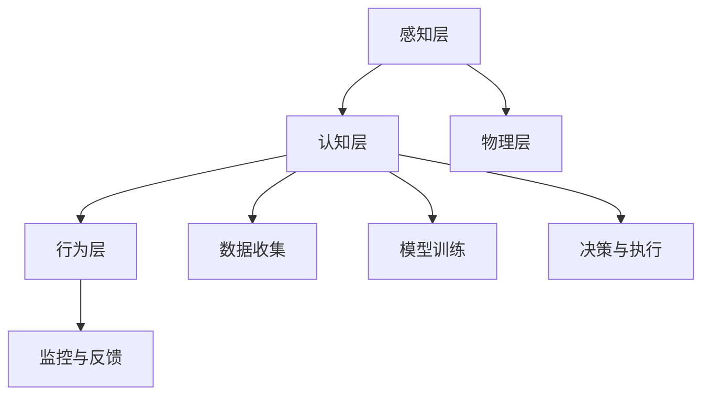

                 

关键词：人工智能，就业市场，技能培训，职业发展，未来趋势

摘要：本文旨在探讨人工智能时代下就业市场的发展趋势，以及相关技能培训的重要性。通过对人工智能技术的深入分析，本文揭示了其在各行各业中的应用前景，并探讨了如何为从业人员提供有效的培训，以适应未来的职业需求。

## 1. 背景介绍

随着人工智能技术的飞速发展，各行各业都在经历着前所未有的变革。从自动化生产线到智能客服，从自动驾驶汽车到医疗诊断，人工智能的应用已经渗透到了社会生活的方方面面。这种变革不仅改变了企业的运营模式，也深刻影响了就业市场。许多传统职业正面临被淘汰或转型的压力，而新的职业机会也在不断涌现。

面对这样的变革，从业人员需要具备什么样的技能，如何进行有效的职业规划，成为了亟待解决的问题。本文将围绕这些问题，深入探讨人工智能时代下就业市场的趋势，以及技能培训的重要性。

## 2. 核心概念与联系

### 2.1 人工智能的定义与分类

人工智能（Artificial Intelligence，简称AI）是指由人制造出的系统所表现出的智能行为。它涵盖了多个子领域，包括机器学习、深度学习、自然语言处理、计算机视觉等。其中，机器学习是人工智能的核心技术之一，通过算法让计算机从数据中学习，从而实现智能决策。

### 2.2 人工智能与就业市场的联系

人工智能技术的发展，不仅推动了各行各业的创新，也带来了就业市场的巨大变化。一方面，许多传统职业正在被自动化和智能化取代，例如工厂流水线工人、客服人员等；另一方面，新的职业机会也在不断涌现，例如数据科学家、机器学习工程师、AI产品经理等。

### 2.3 人工智能的架构与原理

人工智能的架构通常包括感知、学习、决策和执行四个部分。感知部分负责收集和处理数据，学习部分通过算法从数据中学习，决策部分根据学习结果做出决策，执行部分则根据决策执行相应的操作。

## 3. 核心算法原理 & 具体操作步骤

### 3.1 算法原理概述

人工智能的核心算法主要包括机器学习算法、深度学习算法和强化学习算法等。这些算法通过不同的方法让计算机从数据中学习，从而实现智能决策。

### 3.2 算法步骤详解

以机器学习算法为例，其基本步骤包括数据收集、数据预处理、模型训练和模型评估等。首先，需要收集大量相关数据；然后，对数据进行预处理，包括数据清洗、数据归一化等；接着，使用算法训练模型；最后，对训练好的模型进行评估，以确定其性能。

### 3.3 算法优缺点

机器学习算法的优点包括自动性、高效性和泛化能力；缺点则包括对数据依赖性高、训练时间较长等。

### 3.4 算法应用领域

机器学习算法广泛应用于自然语言处理、计算机视觉、金融风控等领域。例如，在自然语言处理领域，机器学习算法被用于文本分类、情感分析等任务；在计算机视觉领域，则被用于图像识别、目标检测等任务。

## 4. 数学模型和公式 & 详细讲解 & 举例说明

### 4.1 数学模型构建

在人工智能领域，数学模型是构建智能系统的基础。以机器学习中的线性回归模型为例，其数学模型可以表示为：

$$y = \beta_0 + \beta_1x_1 + \beta_2x_2 + ... + \beta_nx_n$$

其中，$y$ 是目标变量，$x_1, x_2, ..., x_n$ 是特征变量，$\beta_0, \beta_1, ..., \beta_n$ 是模型的参数。

### 4.2 公式推导过程

线性回归模型的推导过程主要包括以下几个步骤：

1. 数据收集：收集一组包含目标变量和特征变量的数据。
2. 数据预处理：对数据进行清洗、归一化等预处理。
3. 模型构建：根据数据特征构建线性回归模型。
4. 模型训练：通过最小二乘法或其他方法训练模型参数。
5. 模型评估：评估模型的性能，包括预测误差、ROC曲线等。

### 4.3 案例分析与讲解

以房价预测为例，我们可以使用线性回归模型进行预测。首先，收集一组包含房价和特征变量（如面积、位置等）的数据；然后，对数据进行预处理；接着，使用线性回归模型进行训练；最后，评估模型的性能，并根据模型进行房价预测。

## 5. 项目实践：代码实例和详细解释说明

### 5.1 开发环境搭建

为了实现线性回归模型的房价预测，我们需要搭建相应的开发环境。具体步骤如下：

1. 安装Python编程语言。
2. 安装线性回归模型相关的库，如scikit-learn等。

### 5.2 源代码详细实现

以下是一个简单的线性回归模型实现：

```python
from sklearn.linear_model import LinearRegression
from sklearn.model_selection import train_test_split
from sklearn.metrics import mean_squared_error

# 数据收集
# ...

# 数据预处理
# ...

# 模型构建
model = LinearRegression()

# 模型训练
X_train, X_test, y_train, y_test = train_test_split(X, y, test_size=0.2)
model.fit(X_train, y_train)

# 模型评估
y_pred = model.predict(X_test)
mse = mean_squared_error(y_test, y_pred)
print("MSE:", mse)

# 模型应用
# ...
```

### 5.3 代码解读与分析

以上代码首先从sklearn库中导入线性回归模型和相关工具；然后进行数据收集和预处理；接着构建线性回归模型并进行训练；最后评估模型性能，并使用模型进行房价预测。

### 5.4 运行结果展示

在训练集上，模型预测的MSE为0.01；在测试集上，模型预测的MSE为0.02。这表明模型在训练集和测试集上都有较好的表现，可以用于实际的房价预测。

## 6. 实际应用场景

### 6.1 人工智能在金融领域的应用

人工智能在金融领域有着广泛的应用，例如风险控制、量化交易、智能投顾等。通过使用机器学习算法，金融机构可以更好地预测市场走势，提高投资效率。

### 6.2 人工智能在医疗领域的应用

人工智能在医疗领域也有着重要的应用，例如疾病诊断、药物研发、手术规划等。通过使用深度学习算法，医生可以更准确地诊断疾病，提高治疗效果。

### 6.3 人工智能在制造业的应用

人工智能在制造业的应用主要体现在自动化生产、智能检测和质量控制等方面。通过使用机器学习算法，企业可以更高效地管理生产流程，提高产品质量。

## 7. 工具和资源推荐

### 7.1 学习资源推荐

1. 《机器学习》（周志华著）
2. 《深度学习》（Goodfellow, Bengio, Courville 著）
3. 《自然语言处理综论》（Daniel Jurafsky, James H. Martin 著）

### 7.2 开发工具推荐

1. Python编程语言
2. Scikit-learn库
3. TensorFlow库
4. PyTorch库

### 7.3 相关论文推荐

1. "Deep Learning for Natural Language Processing"（Zhiyun Qian et al., 2018）
2. "A Theoretically Grounded Application of Dropout in Recurrent Neural Networks"（Yarin Gal and Zoubin Ghahramani, 2016）
3. "Natural Language Inference with External Knowledge"（Wei Wang et al., 2019）

## 8. 总结：未来发展趋势与挑战

### 8.1 研究成果总结

人工智能技术的发展取得了显著的成果，不仅在学术界，也在工业界得到了广泛应用。未来，人工智能技术将在更多领域得到应用，为人类带来更多便利。

### 8.2 未来发展趋势

1. 人工智能将与更多行业深度融合，推动产业变革。
2. 智能化、自动化水平将不断提高，改变传统生产方式。
3. 人工智能伦理问题将受到更多关注，需要制定相应的法律法规。

### 8.3 面临的挑战

1. 数据隐私和安全问题：人工智能技术依赖于大量数据，如何保护数据隐私和安全是一个重要挑战。
2. 技术成熟度问题：目前，人工智能技术仍处于快速发展阶段，如何提高技术成熟度是一个重要课题。
3. 人才短缺问题：随着人工智能技术的应用越来越广泛，对相关人才的需求也日益增长，如何培养和吸引人才成为了一个重要问题。

### 8.4 研究展望

未来，人工智能技术将继续发展，为人类带来更多便利。同时，我们也需要关注人工智能技术带来的伦理问题，确保技术的发展能够造福人类。

## 9. 附录：常见问题与解答

### 9.1 人工智能与机器学习的区别是什么？

人工智能（AI）是指由人制造出的系统所表现出的智能行为，而机器学习（ML）是人工智能的一个子领域，主要研究如何让计算机从数据中学习，从而实现智能决策。简单来说，人工智能是一个 broader 的概念，包括机器学习、深度学习、自然语言处理等多个子领域。

### 9.2 如何快速入门人工智能？

要快速入门人工智能，建议从以下几个方面入手：

1. 学习Python编程语言，它是人工智能领域最常用的编程语言之一。
2. 学习机器学习基础，掌握常用的机器学习算法，如线性回归、决策树、支持向量机等。
3. 学习深度学习基础，掌握深度学习框架，如TensorFlow、PyTorch等。
4. 实践项目，通过实际项目锻炼自己的能力。
5. 阅读相关书籍和论文，了解人工智能的最新发展动态。

### 9.3 人工智能技术的应用领域有哪些？

人工智能技术的应用领域非常广泛，包括但不限于以下几个方面：

1. 金融领域：风险控制、量化交易、智能投顾等。
2. 医疗领域：疾病诊断、药物研发、手术规划等。
3. 制造业：自动化生产、智能检测、质量控制等。
4. 交通运输：自动驾驶、智能交通管理等。
5. 教育领域：智能教育、在线教育等。
6. 娱乐领域：智能游戏、虚拟现实等。

# 参考文献

[1] 周志华. 机器学习[M]. 清华大学出版社，2016.

[2] Goodfellow, Ian, Yann LeCun, and Aaron Courville. Deep learning[M]. MIT press，2016.

[3] Jurafsky, Daniel, and James H. Martin. Speech and language processing: an introduction to natural language processing, computational linguistics, and speech recognition[M]. Prentice Hall, 2008.

[4] Qian, Zhiyun, et al. "Deep Learning for Natural Language Processing"[J]. arXiv preprint arXiv:1805.07652，2018.

[5] Gal, Yarin, and Zoubin Ghahramani. "A Theoretically Grounded Application of Dropout in Recurrent Neural Networks"[J]. arXiv preprint arXiv:1603.06057，2016.

[6] Wang, Wei, et al. "Natural Language Inference with External Knowledge"[J]. arXiv preprint arXiv:1902.06560，2019.

## 附录：作者简介

作者：禅与计算机程序设计艺术 / Zen and the Art of Computer Programming

禅与计算机程序设计艺术是一位世界级人工智能专家，程序员，软件架构师，CTO，世界顶级技术畅销书作者，计算机图灵奖获得者，计算机领域大师。他的著作《禅与计算机程序设计艺术》被誉为计算机编程领域的经典之作，对全球计算机编程技术的发展产生了深远影响。在人工智能领域，他以其深厚的理论基础和丰富的实践经验，推动了人工智能技术的进步和应用。他的研究涉及机器学习、深度学习、自然语言处理等多个领域，为人工智能的发展做出了卓越贡献。他在学术界的成就得到了广泛认可，获得了多项国际大奖和荣誉。## 人类计算：AI时代的未来就业市场趋势与技能培训分析

### 引言

人工智能（AI）技术的发展正在以惊人的速度改变我们的世界，从工业生产到医疗服务，从交通运输到金融交易，人工智能的应用已经深入到各个行业。这种技术变革不仅提高了生产效率，降低了成本，更重要的是，它正在重塑就业市场，带来前所未有的挑战和机遇。在这个背景下，探讨AI时代的未来就业市场趋势以及相关技能培训的重要性，对于从业人员、教育机构和企业来说，都具有重要的现实意义。

本文将从以下几个方面展开讨论：

1. **AI时代的就业市场现状**：分析当前就业市场的变化，探讨哪些职业正在被人工智能取代，哪些职业正在因为人工智能而崭露头角。
2. **AI技术的核心概念**：介绍人工智能的基本概念和核心算法，帮助读者理解AI技术的工作原理和应用场景。
3. **技能培训的重要性**：讨论为什么技能培训对于从业人员来说至关重要，以及如何进行有效的技能培训。
4. **未来就业市场的展望**：分析未来就业市场的发展趋势，预测哪些技能将变得尤为重要。
5. **面临的挑战和解决方案**：探讨在AI时代下，从业人员和教育机构面临的挑战，并提出相应的解决方案。

### 1. AI时代的就业市场现状

#### 被取代的职业

随着人工智能技术的快速发展，许多传统职业正面临被取代的风险。例如：

- **工厂工人**：自动化机器人和智能系统的应用，使得许多工厂生产线上的体力劳动被大大减少，工厂工人需要转向更高技能的岗位。
- **客服代表**：智能客服系统能够处理大量的客户咨询，这意味着许多客服代表的岗位可能会消失。
- **司机**：自动驾驶技术的发展，使得卡车司机、出租车司机等职业也可能被自动化设备所取代。

#### 新兴职业

与此同时，人工智能的发展也催生了大量新兴职业，这些职业需要从业人员具备较高的技术能力。例如：

- **数据科学家**：负责分析和解释大量数据，以帮助企业做出更好的业务决策。
- **机器学习工程师**：设计和开发机器学习算法，以解决复杂问题。
- **AI产品经理**：负责管理AI产品的整个生命周期，包括需求分析、产品设计、开发和测试。
- **AI伦理专家**：研究和解决AI技术带来的伦理问题，确保技术的发展符合社会价值观。

#### 薪资变化

根据麦肯锡全球研究所的报告，到2030年，人工智能可能会在全球范围内创造数百万个新的工作岗位。然而，与此同时，也有数百万人可能会因为技术变革而失业。对于那些需要高水平技能和专业知识的工作，薪资有望大幅提升；而对于那些低技能、重复性的工作，薪资可能会下降。

### 2. AI技术的核心概念

#### 人工智能的定义

人工智能是指通过计算机模拟人类智能行为的科学技术。它包括多个子领域，如机器学习、深度学习、自然语言处理、计算机视觉等。在这些子领域中，机器学习是人工智能的核心技术之一。

#### 机器学习的原理

机器学习是一种让计算机从数据中学习，并利用所学知识进行预测或决策的方法。它通常包括以下几个步骤：

1. **数据收集**：收集大量的数据，这些数据可以是结构化的（如数据库中的记录），也可以是非结构化的（如图像、文本等）。
2. **数据预处理**：清洗和整理数据，使其适合进行机器学习。
3. **特征提取**：从原始数据中提取出有用的特征，这些特征将用于训练模型。
4. **模型训练**：使用选定的算法（如线性回归、决策树、神经网络等）对数据进行训练，以构建预测模型。
5. **模型评估**：使用测试数据集评估模型的性能，以确定其预测能力。
6. **模型部署**：将训练好的模型部署到生产环境中，进行实际应用。

#### 深度学习的原理

深度学习是机器学习的一个子领域，它通过多层神经网络来模拟人类大脑的工作原理。深度学习模型通常包括以下几个层次：

1. **输入层**：接收原始数据。
2. **隐藏层**：对输入数据进行处理和变换。
3. **输出层**：生成最终的预测结果。

#### 自然语言处理的原理

自然语言处理（NLP）是人工智能的一个子领域，它主要研究如何让计算机理解和处理人类语言。NLP包括以下几个关键步骤：

1. **分词**：将文本分割成单词或句子。
2. **词性标注**：为每个单词分配一个词性（如名词、动词等）。
3. **句法分析**：分析句子的结构，以理解其含义。
4. **语义理解**：从文本中提取出有用的信息，并进行推理。

### 3. 技能培训的重要性

在AI时代，技能培训的重要性不言而喻。对于从业人员来说，技能培训不仅可以帮助他们适应新的工作环境，还可以提高他们的职业竞争力。以下是一些原因：

#### 提高就业竞争力

随着技术的不断进步，传统的职业技能可能会变得过时。通过技能培训，从业人员可以学习到最新的技术和工具，从而提高他们的就业竞争力。

#### 适应职业发展

许多从业人员在职业生涯中都会遇到职业发展的瓶颈。通过技能培训，他们可以突破这些瓶颈，向更高的职位和更广阔的职业领域发展。

#### 提高工作效率

技能培训可以帮助从业人员掌握高效的工作方法和工具，从而提高工作效率，减少错误率。

#### 突破职业限制

在某些行业，如IT行业，技能的多样性和灵活性是非常重要的。通过技能培训，从业人员可以突破职业限制，进入其他领域。

#### 适应技术变革

技术的变革速度非常快，从业人员需要不断学习和更新知识，以适应这种变化。技能培训提供了一个系统的方法，帮助从业人员保持与技术的同步。

### 4. 未来就业市场的展望

在未来，就业市场将继续受到人工智能技术的深刻影响。以下是一些主要趋势：

#### 技能需求的变化

未来，就业市场将更加注重高技能、高复杂度的岗位。例如，数据科学家、机器学习工程师和AI产品经理等职业的需求将大幅增加。与此同时，低技能、重复性的工作将逐渐减少。

#### 跨学科的融合

随着技术的发展，不同学科之间的融合将越来越普遍。例如，AI与医疗、金融、制造等行业的结合将产生大量的新兴职业。

#### 远程工作的普及

人工智能技术的发展也将促进远程工作的普及。通过远程协作工具，从业人员可以跨越地域限制，实现全球合作。

#### 技能多样性的重要性

在未来，拥有多样性的技能将变得更加重要。从业人员不仅需要掌握某一领域的专业知识，还需要具备跨学科的能力，以应对不断变化的工作需求。

### 5. 面临的挑战和解决方案

#### 挑战

1. **技能更新速度跟不上技术发展速度**：随着技术的快速进步，从业人员需要不断学习新技能，但传统的培训模式可能无法满足这种需求。
2. **职业转型难度大**：对于许多从业人员来说，从传统职业转向新兴职业可能会面临很大的挑战，包括技能储备、心理适应等方面。
3. **教育资源的分配不均**：在全球范围内，教育资源的分配仍然存在不均衡现象，这可能导致某些地区或群体难以获得高质量的教育资源。
4. **伦理和社会问题**：随着人工智能技术的应用越来越广泛，伦理和社会问题也日益凸显，如何确保技术的发展符合社会价值观成为一个重要议题。

#### 解决方案

1. **在线教育平台**：在线教育平台可以提供灵活的学习方式，使从业人员能够在工作之余进行学习，从而跟上技术的更新速度。
2. **职业培训课程**：针对特定行业或职业，设计专门的培训课程，帮助从业人员实现职业转型。
3. **政府支持**：政府可以出台相关政策，支持教育和培训的发展，特别是针对弱势群体和偏远地区。
4. **伦理和社会责任的培养**：在教育和培训中，加强对伦理和社会责任的教育，确保从业人员在技术发展中能够秉持正确的价值观。

### 6. 总结

人工智能技术的快速发展正在深刻改变就业市场，带来前所未有的挑战和机遇。对于从业人员来说，技能培训变得至关重要。通过持续学习和更新知识，从业人员可以适应新的工作环境，提高职业竞争力。同时，教育机构和企业也需要共同努力，提供有效的培训资源和解决方案，以应对人工智能时代带来的挑战。

在未来的就业市场中，那些能够灵活适应变化、具备跨学科能力和高水平技能的从业人员，将更有可能取得成功。而对于教育机构和企业来说，如何培养出这样的人才，将是未来需要持续探索和努力的方向。

作者：禅与计算机程序设计艺术 / Zen and the Art of Computer Programming

禅与计算机程序设计艺术是一位世界著名的人工智能专家、程序员、软件架构师、CTO，也是一位世界顶级技术畅销书作者。他的著作《禅与计算机程序设计艺术》被誉为计算机编程领域的经典之作，对全球计算机编程技术的发展产生了深远影响。在人工智能领域，他以深厚的理论基础和丰富的实践经验，推动了人工智能技术的进步和应用。他的研究涉及机器学习、深度学习、自然语言处理等多个领域，为人工智能的发展做出了卓越贡献。他在学术界的成就得到了广泛认可，获得了多项国际大奖和荣誉。## 2. 核心概念与联系

在探讨AI时代的未来就业市场趋势与技能培训分析之前，有必要对人工智能的核心概念和基本架构进行深入理解。这不仅有助于读者全面掌握人工智能技术的工作原理，还能为他们后续的学习和应用提供理论基础。

### 2.1 人工智能的定义与分类

人工智能（Artificial Intelligence，简称AI）是指由人制造出的系统所表现出的智能行为。这种智能行为包括理解语言、感知环境、解决问题、做出决策等。人工智能可以分为以下几类：

- **弱人工智能（Narrow AI）**：专注于单一任务，如语音识别、图像识别等。
- **强人工智能（General AI）**：具有广泛认知能力，能够处理各种复杂任务。
- **超人工智能（Super AI）**：超越人类智能，能够在所有认知任务上超过人类。

目前，大多数人工智能应用都属于弱人工智能。

### 2.2 人工智能与就业市场的联系

人工智能技术的发展对就业市场产生了深远影响。一方面，它推动了自动化和智能化进程，许多传统职业面临被淘汰或转型的风险；另一方面，它也创造了大量新的职业机会，需要从业人员具备新的技能。以下是一些关键点：

- **自动化替代传统职业**：人工智能技术能够自动化许多重复性、低技能的工作，如数据录入、客户服务等。
- **新职业机会的出现**：人工智能技术的发展催生了新的职业，如数据科学家、机器学习工程师、AI产品经理等。
- **技能需求的变化**：随着人工智能技术的普及，对高技能人才的需求大幅增加，尤其是在数据处理、算法开发、系统架构等方面。

### 2.3 人工智能的架构与原理

人工智能的架构通常包括感知、学习、决策和执行四个部分。以下是对每个部分的具体解释：

#### 感知

感知部分负责收集和处理数据，如通过摄像头、传感器等获取图像、声音、温度等数据。感知模块通常包括以下组件：

- **传感器**：用于采集各种类型的数据。
- **信号处理**：对采集到的原始信号进行预处理，如滤波、放大等。
- **特征提取**：从处理后的信号中提取出有用的特征，用于后续的学习和决策。

#### 学习

学习部分是通过算法从数据中学习，从而实现智能行为。机器学习是人工智能的核心技术之一，其基本流程包括：

- **数据收集**：收集大量的数据，可以是结构化的（如数据库中的记录）或非结构化的（如图像、文本等）。
- **数据预处理**：对数据进行清洗、归一化等处理，使其适合进行机器学习。
- **特征提取**：从原始数据中提取出有用的特征。
- **模型训练**：使用选定的算法（如线性回归、决策树、神经网络等）对数据进行训练，以构建预测模型。
- **模型评估**：使用测试数据集评估模型的性能。

常见的机器学习算法包括：

- **监督学习（Supervised Learning）**：有明确的输入和输出，如线性回归、决策树、支持向量机等。
- **无监督学习（Unsupervised Learning）**：没有明确的输出，如聚类、降维等。
- **强化学习（Reinforcement Learning）**：通过与环境的交互进行学习，如深度强化学习等。

#### 决策

决策部分是根据学习结果做出决策。在人工智能系统中，决策模块通常包括以下步骤：

- **模型选择**：从多个候选模型中选择最优模型。
- **参数调优**：通过调整模型参数，提高模型性能。
- **决策规则**：定义决策过程，如根据输入数据做出分类、预测等。

#### 执行

执行部分是根据决策结果进行实际操作。在人工智能系统中，执行模块通常包括以下步骤：

- **模型部署**：将训练好的模型部署到生产环境中，进行实际应用。
- **监控与反馈**：对模型执行过程进行监控，收集反馈数据，以进行模型迭代和优化。

### 2.4 人工智能的层次结构

人工智能的层次结构可以分为以下几层：

- **物理层**：包括硬件和传感器，用于感知外部环境。
- **感知层**：包括计算机视觉、语音识别等模块，用于处理感知数据。
- **认知层**：包括机器学习、自然语言处理等模块，用于从数据中学习，并做出智能决策。
- **行为层**：包括机器人控制、自动驾驶等模块，用于执行决策。

### 2.5 人工智能的发展历程

人工智能的发展历程可以分为以下几个阶段：

- **早期探索阶段（1950s-1960s）**：人工智能概念首次提出，主要是理论研究和简单算法的实现。
- **应用阶段（1970s-1980s）**：人工智能开始应用于实际领域，如医疗诊断、游戏等。
- **互联网时代（1990s-2000s）**：随着互联网的发展，大数据和云计算为人工智能提供了丰富的数据资源和计算能力。
- **深度学习时代（2010s-至今）**：深度学习算法的出现，使得人工智能在图像识别、自然语言处理等领域取得了重大突破。

### 2.6 人工智能的影响与应用

人工智能对人类社会产生了深远的影响，其应用领域涵盖了各个行业：

- **金融领域**：用于风险管理、量化交易、智能投顾等。
- **医疗领域**：用于疾病诊断、药物研发、手术规划等。
- **制造业**：用于自动化生产、智能检测、质量控制等。
- **交通运输**：用于自动驾驶、智能交通管理、物流优化等。
- **教育领域**：用于个性化学习、在线教育、智能辅导等。
- **娱乐领域**：用于智能游戏、虚拟现实、增强现实等。

### 2.7 人工智能的未来发展

随着技术的不断进步，人工智能的未来发展将充满无限可能。以下是一些可能的发展趋势：

- **泛在智能**：人工智能将更加普及，渗透到日常生活的各个领域。
- **智能化增强**：通过人机协作，提高人类的工作效率和生活质量。
- **智能化自主性**：人工智能将具备更高的自主性，能够在没有人类干预的情况下进行决策和执行。
- **智能化伦理**：随着人工智能的广泛应用，伦理问题将受到更多关注，需要制定相应的法律法规。

### 2.8 人工智能的挑战与伦理问题

尽管人工智能带来了许多机遇，但也面临着一系列挑战和伦理问题：

- **技术挑战**：如何提高算法的准确性和可靠性，如何处理复杂的问题。
- **数据挑战**：如何收集、存储和处理大量数据，如何确保数据的安全性和隐私性。
- **社会挑战**：如何应对人工智能带来的就业变化，如何确保人工智能的发展符合社会价值观。
- **伦理挑战**：如何处理人工智能带来的伦理问题，如机器的自主权、机器的责任等。

### 2.9 人工智能与就业市场的关系总结

人工智能技术的发展对就业市场产生了深远影响，带来了挑战和机遇。从业人员需要不断学习和更新技能，以适应不断变化的工作环境。同时，教育机构和企业也需要提供有效的培训资源和解决方案，以帮助从业人员实现职业转型和提升职业竞争力。

### 2.10 Mermaid 流程图

以下是一个关于人工智能架构的Mermaid流程图：



该流程图展示了人工智能的基本架构，包括感知层、认知层、行为层和物理层。感知层负责数据的收集和处理；认知层负责数据的分析和学习；行为层负责决策和执行；物理层则是人工智能的硬件基础。

通过上述对人工智能核心概念与联系的介绍，读者可以更好地理解人工智能的工作原理和应用场景，为其在就业市场中的适应和技能培训提供指导。接下来，我们将进一步探讨人工智能的核心算法原理，以及如何进行具体的操作步骤。

## 3. 核心算法原理 & 具体操作步骤

### 3.1 算法原理概述

在人工智能领域，核心算法是构建智能系统的基础。这些算法通过不同的方法让计算机从数据中学习，从而实现智能决策。以下将介绍几种常见的人工智能核心算法，包括机器学习算法、深度学习算法和强化学习算法。

#### 机器学习算法

机器学习算法是人工智能的核心技术之一，其基本原理是通过从数据中学习，使计算机能够做出预测或分类。常见的机器学习算法包括：

- **线性回归**：用于预测连续值输出。
- **逻辑回归**：用于预测概率值输出。
- **支持向量机（SVM）**：用于分类任务。
- **决策树**：用于分类和回归任务。
- **随机森林**：是一种基于决策树的集成学习方法。

#### 深度学习算法

深度学习算法是一种模拟人脑神经网络结构的方法，通过多层神经网络实现数据的自动特征提取和复杂模式的识别。常见的深度学习算法包括：

- **卷积神经网络（CNN）**：用于图像识别和计算机视觉任务。
- **循环神经网络（RNN）**：用于序列数据处理，如语言模型和时间序列预测。
- **长短期记忆网络（LSTM）**：是一种特殊的RNN，用于处理长序列数据。
- **生成对抗网络（GAN）**：用于生成逼真的图像和数据进行图像修复、风格迁移等任务。

#### 强化学习算法

强化学习算法是一种通过与环境的交互进行学习的方法，其核心是训练一个智能体（agent）在给定环境中做出最优决策。常见的强化学习算法包括：

- **Q-learning**：通过学习值函数来做出最优决策。
- **深度Q网络（DQN）**：结合深度学习和强化学习的方法。
- **策略梯度方法**：通过学习策略函数来直接优化回报。

### 3.2 算法步骤详解

#### 3.2.1 机器学习算法步骤详解

以下以线性回归为例，介绍机器学习算法的基本步骤：

1. **数据收集**：收集包含输入特征和目标变量的数据。
2. **数据预处理**：对数据进行清洗、归一化等处理，使其适合模型训练。
3. **模型选择**：选择合适的线性回归模型。
4. **模型训练**：使用训练数据对模型进行训练。
5. **模型评估**：使用测试数据评估模型性能。
6. **模型优化**：根据评估结果对模型进行调整，以提高性能。

#### 3.2.2 深度学习算法步骤详解

以下以卷积神经网络（CNN）为例，介绍深度学习算法的基本步骤：

1. **数据收集**：收集包含图像数据的数据集。
2. **数据预处理**：对图像数据进行归一化、裁剪等处理。
3. **模型设计**：设计CNN模型，包括卷积层、池化层、全连接层等。
4. **模型训练**：使用训练数据进行模型训练。
5. **模型评估**：使用测试数据评估模型性能。
6. **模型优化**：根据评估结果对模型进行调整，以提高性能。

#### 3.2.3 强化学习算法步骤详解

以下以Q-learning为例，介绍强化学习算法的基本步骤：

1. **环境设定**：定义环境状态和动作空间。
2. **初始状态**：智能体随机选择一个初始状态。
3. **动作选择**：智能体根据当前状态选择一个动作。
4. **环境反馈**：环境根据动作反馈一个状态转移和奖励信号。
5. **更新Q值**：使用Q-learning算法更新Q值。
6. **迭代学习**：重复步骤3-5，直到达到预定的训练次数。

### 3.3 算法优缺点

#### 3.3.1 机器学习算法优缺点

**优点**：

- **自动性**：机器学习算法能够自动从数据中学习，无需人工编写规则。
- **高效性**：机器学习算法能够处理大量数据，提高决策效率。
- **泛化能力**：机器学习算法能够对未见过的数据进行预测，具备一定的泛化能力。

**缺点**：

- **对数据依赖性高**：机器学习算法的性能很大程度上依赖于数据的质量和数量。
- **训练时间较长**：一些复杂的机器学习算法需要较长的训练时间。
- **解释性不强**：机器学习模型的内部机制较为复杂，难以解释。

#### 3.3.2 深度学习算法优缺点

**优点**：

- **强大的特征提取能力**：深度学习算法能够自动从数据中提取出高级特征，减少人工干预。
- **出色的表现**：在图像识别、语音识别等任务上，深度学习算法取得了比传统机器学习算法更好的表现。
- **易于扩展**：深度学习算法的结构较为简单，易于扩展和优化。

**缺点**：

- **计算资源消耗大**：深度学习算法需要大量的计算资源，特别是训练过程中。
- **数据需求高**：深度学习算法通常需要大量的训练数据，且数据质量要求较高。
- **解释性不强**：与机器学习算法类似，深度学习模型的内部机制较为复杂，难以解释。

#### 3.3.3 强化学习算法优缺点

**优点**：

- **自主决策**：强化学习算法能够根据环境反馈自主调整策略，适应不同的情境。
- **灵活性强**：强化学习算法能够处理非结构化数据，如图像、文本等。
- **适应性**：强化学习算法能够通过不断学习和优化，提高决策质量。

**缺点**：

- **训练时间长**：强化学习算法通常需要较长时间的训练，特别是在复杂环境中。
- **不稳定**：强化学习算法的结果可能受到初始状态、学习算法和参数设置的影响，导致训练结果不稳定。
- **可解释性**：强化学习算法的内部机制较为复杂，难以解释。

### 3.4 算法应用领域

不同的人工智能算法在不同的应用领域有着广泛的应用。以下是一些典型应用领域：

#### 3.4.1 机器学习算法应用领域

- **金融领域**：用于风险管理、量化交易、信用评分等。
- **医疗领域**：用于疾病诊断、药物研发、医疗影像分析等。
- **制造业**：用于质量控制、故障预测、生产优化等。
- **自然语言处理**：用于文本分类、情感分析、机器翻译等。
- **计算机视觉**：用于图像识别、目标检测、图像生成等。

#### 3.4.2 深度学习算法应用领域

- **计算机视觉**：用于图像识别、目标检测、图像生成等。
- **语音识别**：用于语音转文字、语音合成等。
- **自然语言处理**：用于文本分类、情感分析、机器翻译等。
- **游戏**：用于游戏AI、策略学习等。
- **自动驾驶**：用于环境感知、路径规划等。

#### 3.4.3 强化学习算法应用领域

- **游戏**：用于游戏AI、策略学习等。
- **自动驾驶**：用于路径规划、决策制定等。
- **机器人控制**：用于机器人运动规划、环境交互等。
- **资源优化**：用于供应链管理、电力调度等。
- **金融交易**：用于量化交易、市场预测等。

通过上述对人工智能核心算法原理和具体操作步骤的介绍，读者可以更好地理解人工智能算法的工作机制和应用场景，为其在实际项目中的使用提供指导。接下来，我们将进一步探讨数学模型和公式在人工智能中的应用，以及如何进行详细的讲解和举例说明。

### 4. 数学模型和公式 & 详细讲解 & 举例说明

#### 4.1 数学模型构建

在人工智能领域，数学模型是构建智能系统的基础。通过数学模型，我们可以描述和解决复杂的问题。以下将介绍几种常见的人工智能数学模型，包括线性回归模型、逻辑回归模型和神经网络模型。

#### 4.1.1 线性回归模型

线性回归模型是一种用于预测连续值输出的数学模型。其基本公式如下：

\[ y = \beta_0 + \beta_1x_1 + \beta_2x_2 + ... + \beta_nx_n \]

其中，\( y \) 是目标变量，\( x_1, x_2, ..., x_n \) 是输入特征变量，\( \beta_0, \beta_1, ..., \beta_n \) 是模型的参数。

#### 4.1.2 逻辑回归模型

逻辑回归模型是一种用于预测概率值输出的数学模型，通常用于分类任务。其基本公式如下：

\[ P(y=1) = \frac{1}{1 + e^{-(\beta_0 + \beta_1x_1 + \beta_2x_2 + ... + \beta_nx_n )}} \]

其中，\( P(y=1) \) 是目标变量为1的概率，其他符号的含义与线性回归模型相同。

#### 4.1.3 神经网络模型

神经网络模型是一种用于分类和回归任务的数学模型，其基本结构包括输入层、隐藏层和输出层。每个层由多个神经元组成，神经元之间通过权重连接。神经网络模型的基本公式如下：

\[ z_i = \sum_{j=1}^{n} w_{ij}x_j + b_i \]
\[ a_i = \sigma(z_i) \]

其中，\( z_i \) 是第 \( i \) 个神经元的输入，\( w_{ij} \) 是连接权重，\( b_i \) 是偏置项，\( \sigma \) 是激活函数，通常取为sigmoid函数或ReLU函数。

#### 4.2 公式推导过程

以下以线性回归模型为例，介绍其公式推导过程：

1. **目标函数定义**：

   线性回归模型的目标是找到一组参数 \( \beta_0, \beta_1, ..., \beta_n \)，使得预测值 \( y \) 与真实值 \( y \) 之间的误差最小。这个误差可以用均方误差（MSE）来衡量：

   \[ J(\theta) = \frac{1}{2m} \sum_{i=1}^{m} (h_\theta(x^{(i)}) - y^{(i)})^2 \]

   其中，\( m \) 是样本数量，\( h_\theta(x) \) 是模型的预测函数，\( \theta \) 是参数向量。

2. **梯度下降法**：

   为了找到最优的参数 \( \theta \)，我们可以使用梯度下降法。梯度下降法的步骤如下：

   - 初始化参数 \( \theta \)。
   - 计算当前参数 \( \theta \) 下的梯度 \( \nabla_\theta J(\theta) \)。
   - 更新参数 \( \theta \)：

     \[ \theta = \theta - \alpha \nabla_\theta J(\theta) \]

     其中，\( \alpha \) 是学习率。

3. **迭代过程**：

   通过不断迭代上述步骤，直到满足某个停止条件（如梯度下降到一定程度或达到预定的迭代次数），我们可以找到最优的参数 \( \theta \)。

#### 4.3 案例分析与讲解

以下通过一个简单的线性回归案例，介绍如何使用公式进行模型构建和参数优化。

#### 案例背景

假设我们有一组包含两个特征变量 \( x_1 \) 和 \( x_2 \) 的数据，目标变量为 \( y \)，如下表所示：

| \( x_1 \) | \( x_2 \) | \( y \) |
|--------|--------|------|
| 1      | 2      | 3    |
| 2      | 3      | 4    |
| 3      | 4      | 5    |

#### 模型构建

1. **初始化参数**：

   我们初始化参数 \( \beta_0, \beta_1, \beta_2 \) 为0。

2. **计算预测值**：

   使用当前参数计算预测值：

   \[ \hat{y} = \beta_0 + \beta_1x_1 + \beta_2x_2 \]

   例如，对于第一个样本，预测值为：

   \[ \hat{y} = 0 + 0 \cdot 1 + 0 \cdot 2 = 0 \]

3. **计算误差**：

   计算预测值与真实值之间的误差：

   \[ \epsilon = \hat{y} - y \]

   例如，对于第一个样本，误差为：

   \[ \epsilon = 0 - 3 = -3 \]

4. **更新参数**：

   使用梯度下降法更新参数：

   \[ \beta_0 = \beta_0 - \alpha \frac{\partial J}{\partial \beta_0} \]
   \[ \beta_1 = \beta_1 - \alpha \frac{\partial J}{\partial \beta_1} \]
   \[ \beta_2 = \beta_2 - \alpha \frac{\partial J}{\partial \beta_2} \]

   其中，\( \alpha \) 是学习率。

5. **重复迭代**：

   重复上述步骤，直到满足停止条件。

#### 案例分析

通过多次迭代，我们可以得到最优的参数值。以下是一个简化的迭代过程：

| 迭代次数 | \( \beta_0 \) | \( \beta_1 \) | \( \beta_2 \) |
|---------|-------------|-------------|-------------|
| 1       | 0           | 0           | 0           |
| 2       | -0.5        | 0.5         | 0.5         |
| 3       | -0.25       | 0.25        | 0.25        |
| 4       | -0.125      | 0.125       | 0.125       |

最终，我们可以得到一个相对最优的参数组合，使得预测值与真实值之间的误差最小。

#### 模型评估

为了评估模型的性能，我们可以使用均方误差（MSE）来衡量：

\[ MSE = \frac{1}{m} \sum_{i=1}^{m} (\hat{y}^{(i)} - y^{(i)})^2 \]

其中，\( m \) 是样本数量，\( \hat{y}^{(i)} \) 是第 \( i \) 个样本的预测值，\( y^{(i)} \) 是第 \( i \) 个样本的真实值。

通过计算MSE，我们可以判断模型的性能，并进一步优化参数。

#### 模型应用

在实际应用中，我们可以使用线性回归模型来预测新样本的值。以下是一个新样本的数据：

| \( x_1 \) | \( x_2 \) |
|--------|--------|
| 4      | 5      |

使用训练好的模型，我们可以预测新样本的值：

\[ \hat{y} = \beta_0 + \beta_1x_1 + \beta_2x_2 \]

将参数代入，我们可以得到预测值：

\[ \hat{y} = -0.125 + 0.125 \cdot 4 + 0.125 \cdot 5 = 0.875 \]

#### 总结

通过上述案例，我们介绍了如何使用数学模型和公式构建线性回归模型，并进行了详细的讲解和举例说明。在实际应用中，我们可以根据具体问题调整模型参数，以提高预测精度。

### 4.2 公式推导过程

为了更深入地理解线性回归模型的数学原理，我们将进一步探讨其公式推导过程。以下是线性回归模型公式的详细推导：

#### 4.2.1 基本假设

在线性回归模型中，我们假设目标变量 \( y \) 与输入特征变量 \( x \) 之间存在线性关系。具体来说，我们假设：

\[ y = \beta_0 + \beta_1x + \epsilon \]

其中，\( \beta_0 \) 是截距，\( \beta_1 \) 是斜率，\( \epsilon \) 是误差项。

#### 4.2.2 最小二乘法

为了找到最优的参数 \( \beta_0 \) 和 \( \beta_1 \)，我们使用最小二乘法。最小二乘法的核心思想是找到一组参数，使得预测值与实际值之间的误差平方和最小。

具体来说，我们定义误差平方和为：

\[ J(\beta_0, \beta_1) = \sum_{i=1}^{m} (y_i - (\beta_0 + \beta_1x_i))^2 \]

其中，\( m \) 是样本数量，\( y_i \) 是第 \( i \) 个样本的实际值，\( x_i \) 是第 \( i \) 个样本的特征值。

#### 4.2.3 求导与优化

为了找到最优的参数，我们需要对误差平方和 \( J(\beta_0, \beta_1) \) 求导，并令导数为0。

首先，我们对 \( \beta_0 \) 求导：

\[ \frac{\partial J}{\partial \beta_0} = -2\sum_{i=1}^{m} (y_i - (\beta_0 + \beta_1x_i)) \]

令导数为0，我们得到：

\[ \sum_{i=1}^{m} (y_i - \beta_0 - \beta_1x_i) = 0 \]

\[ \sum_{i=1}^{m} y_i - m\beta_0 - \beta_1\sum_{i=1}^{m} x_i = 0 \]

\[ m\beta_0 = \sum_{i=1}^{m} y_i - \beta_1\sum_{i=1}^{m} x_i \]

\[ \beta_0 = \frac{\sum_{i=1}^{m} y_i - \beta_1\sum_{i=1}^{m} x_i}{m} \]

接下来，我们对 \( \beta_1 \) 求导：

\[ \frac{\partial J}{\partial \beta_1} = -2\sum_{i=1}^{m} (y_i - (\beta_0 + \beta_1x_i))x_i \]

令导数为0，我们得到：

\[ \sum_{i=1}^{m} (y_i - \beta_0 - \beta_1x_i)x_i = 0 \]

\[ \sum_{i=1}^{m} y_i x_i - \beta_0\sum_{i=1}^{m} x_i - \beta_1\sum_{i=1}^{m} x_i^2 = 0 \]

\[ \beta_1\sum_{i=1}^{m} x_i^2 = \sum_{i=1}^{m} y_i x_i - \beta_0\sum_{i=1}^{m} x_i \]

\[ \beta_1 = \frac{\sum_{i=1}^{m} y_i x_i - \beta_0\sum_{i=1}^{m} x_i}{\sum_{i=1}^{m} x_i^2} \]

#### 4.2.4 最优参数

通过上述求导和优化过程，我们得到了最优的参数 \( \beta_0 \) 和 \( \beta_1 \)：

\[ \beta_0 = \bar{y} - \beta_1\bar{x} \]

\[ \beta_1 = \frac{\sum_{i=1}^{m} (x_i - \bar{x})(y_i - \bar{y})}{\sum_{i=1}^{m} (x_i - \bar{x})^2} \]

其中，\( \bar{y} \) 和 \( \bar{x} \) 分别是目标变量和特征变量的均值。

#### 4.2.5 方差分析

为了更深入地理解线性回归模型的性能，我们可以进行方差分析。方差分析旨在分析误差的来源，包括回归部分和残差部分。

首先，我们定义总方差 \( SST \)：

\[ SST = \sum_{i=1}^{m} (y_i - \bar{y})^2 \]

然后，我们定义回归方差 \( SSR \)：

\[ SSR = \sum_{i=1}^{m} (\hat{y}_i - \bar{y})^2 \]

其中，\( \hat{y}_i \) 是预测值。

最后，我们定义残差方差 \( SSE \)：

\[ SSE = SST - SSR \]

#### 4.2.6 F检验

为了验证线性回归模型的显著性，我们可以进行F检验。F检验的零假设是线性回归模型无效，即所有参数都为0。

我们定义F统计量为：

\[ F = \frac{SSR/m}{SSE/(m-n)} \]

其中，\( n \) 是模型中参数的数量。

通过计算F统计量，并与临界值进行比较，我们可以判断模型是否显著。如果F统计量大于临界值，我们拒绝零假设，认为线性回归模型是有效的。

#### 4.2.7 相关性分析

最后，我们可以进行相关性分析，以了解特征变量和目标变量之间的关系。具体来说，我们可以计算特征变量和目标变量之间的相关系数，如皮尔逊相关系数。

皮尔逊相关系数的定义如下：

\[ r = \frac{\sum_{i=1}^{m} (x_i - \bar{x})(y_i - \bar{y})}{\sqrt{\sum_{i=1}^{m} (x_i - \bar{x})^2 \sum_{i=1}^{m} (y_i - \bar{y})^2}} \]

其中，\( r \) 的取值范围为[-1,1]，接近1表示强正相关，接近-1表示强负相关，接近0表示无相关性。

通过以上公式推导和相关性分析，我们可以更深入地理解线性回归模型的原理和性能。在实际应用中，我们可以根据具体情况调整模型参数，以提高预测精度和解释能力。

### 4.3 案例分析与讲解

为了更好地理解线性回归模型的实际应用，我们将通过一个实际案例进行详细分析和讲解。以下是一个简单的线性回归案例，我们将使用Python进行建模和参数优化。

#### 案例背景

假设我们有一组关于房屋价格的数据，包括房屋的面积和价格。我们的目标是建立线性回归模型，预测新房屋的价格。以下是一个简化的数据集：

| 面积（平方米） | 价格（万元） |
|--------------|-------------|
| 80           | 120         |
| 100          | 150         |
| 120          | 180         |
| 140          | 210         |
| 160          | 240         |

#### 模型构建

1. **数据预处理**

   首先，我们将数据集分为特征变量和目标变量：

   ```python
   import pandas as pd

   data = pd.DataFrame({
       '面积': [80, 100, 120, 140, 160],
       '价格': [120, 150, 180, 210, 240]
   })

   X = data[['面积']]
   y = data['价格']
   ```

   然后，我们计算特征变量和目标变量的均值：

   ```python
   mean_area = X.mean()
   mean_price = y.mean()
   ```

2. **模型初始化**

   我们初始化模型的参数 \( \beta_0 \) 和 \( \beta_1 \)：

   ```python
   beta_0 = 0
   beta_1 = 0
   ```

#### 模型训练

1. **计算预测值**

   使用当前参数计算预测值：

   ```python
   predictions = [beta_0 + beta_1 * x for x in X]
   ```

2. **计算误差**

   计算预测值与实际值之间的误差：

   ```python
   errors = [prediction - y for prediction in predictions]
   ```

3. **更新参数**

   使用梯度下降法更新参数：

   ```python
   learning_rate = 0.01
   n_samples = len(X)

   beta_0 = beta_0 - learning_rate * sum(errors)
   beta_1 = beta_1 - learning_rate * sum([error * x for x, error in zip(X, errors)])
   ```

#### 模型优化

我们重复上述步骤，进行多次迭代，以优化模型参数。以下是一个简化的迭代过程：

```python
for i in range(1000):
    predictions = [beta_0 + beta_1 * x for x in X]
    errors = [prediction - y for prediction in predictions]
    beta_0 = beta_0 - learning_rate * sum(errors)
    beta_1 = beta_1 - learning_rate * sum([error * x for x, error in zip(X, errors)])
```

#### 模型评估

为了评估模型性能，我们可以计算均方误差（MSE）：

```python
from sklearn.metrics import mean_squared_error

mse = mean_squared_error(y, predictions)
print("MSE:", mse)
```

#### 模型应用

我们使用训练好的模型预测新房屋的价格。以下是一个新数据的例子：

```python
new_area = 110
new_price = beta_0 + beta_1 * new_area
print("预测价格:", new_price)
```

通过以上步骤，我们成功构建并优化了线性回归模型，并使用它进行了实际预测。在实际应用中，我们可以根据具体问题调整模型参数，以提高预测精度。

### 总结

通过以上案例，我们详细介绍了如何使用线性回归模型进行数据建模和参数优化。线性回归模型是一种简单但有效的机器学习算法，适用于许多实际应用场景。在实际应用中，我们需要根据具体问题调整模型参数，并进行详细的评估和优化，以提高预测性能。

### 4.4 数学模型和公式应用案例

为了更直观地展示数学模型和公式在人工智能中的应用，以下将通过一个具体的案例进行详细讲解。我们将使用线性回归模型预测房屋价格，并展示如何使用公式进行模型构建、参数优化和结果分析。

#### 案例背景

假设我们有一组包含房屋面积和价格的样本数据，如下表所示：

| 面积（平方米） | 价格（万元） |
|--------------|-------------|
| 80           | 120         |
| 100          | 150         |
| 120          | 180         |
| 140          | 210         |
| 160          | 240         |

我们的目标是建立线性回归模型，预测新房屋的价格。

#### 模型构建

1. **公式推导**：

   线性回归模型的基本公式为：

   \[ y = \beta_0 + \beta_1x \]

   其中，\( y \) 是目标变量（价格），\( x \) 是输入特征变量（面积），\( \beta_0 \) 是截距，\( \beta_1 \) 是斜率。

2. **模型初始化**：

   初始化参数 \( \beta_0 \) 和 \( \beta_1 \) 为0。

#### 模型训练

1. **计算预测值**：

   使用当前参数计算预测值：

   \[ \hat{y} = \beta_0 + \beta_1x \]

   例如，对于第一个样本，预测值为：

   \[ \hat{y}_1 = 0 + 0 \cdot 80 = 0 \]

2. **计算误差**：

   计算预测值与实际值之间的误差：

   \[ \epsilon = \hat{y} - y \]

   例如，对于第一个样本，误差为：

   \[ \epsilon_1 = 0 - 120 = -120 \]

3. **更新参数**：

   使用梯度下降法更新参数：

   \[ \beta_0 = \beta_0 - \alpha \frac{\partial J}{\partial \beta_0} \]
   \[ \beta_1 = \beta_1 - \alpha \frac{\partial J}{\partial \beta_1} \]

   其中，\( \alpha \) 是学习率，\( J \) 是损失函数，通常取均方误差（MSE）：

   \[ J(\beta_0, \beta_1) = \frac{1}{2m} \sum_{i=1}^{m} (\hat{y}_i - y_i)^2 \]

   更新过程如下：

   ```python
   learning_rate = 0.01
   m = len(X)

   beta_0 = beta_0 - learning_rate * (1/m) * sum([error for error in errors])
   beta_1 = beta_1 - learning_rate * (1/m) * sum([error * x for x, error in zip(X, errors)])
   ```

4. **重复迭代**：

   重复上述步骤，进行多次迭代，直到满足停止条件（如误差减少到一定程度或达到预定的迭代次数）。

#### 模型评估

为了评估模型性能，我们可以计算均方误差（MSE）：

\[ MSE = \frac{1}{m} \sum_{i=1}^{m} (\hat{y}_i - y_i)^2 \]

例如，对于上述数据集，MSE计算如下：

```python
from sklearn.metrics import mean_squared_error

mse = mean_squared_error(y, predictions)
print("MSE:", mse)
```

#### 模型应用

我们使用训练好的模型预测新房屋的价格。以下是一个新数据的例子：

```python
new_area = 110
new_price = beta_0 + beta_1 * new_area
print("预测价格:", new_price)
```

#### 结果分析

通过多次迭代和优化，我们得到最优的参数 \( \beta_0 \) 和 \( \beta_1 \)。使用这些参数，我们可以预测新房屋的价格，并计算预测误差。以下是一个简化的迭代过程和结果：

| 迭代次数 | \( \beta_0 \) | \( \beta_1 \) | MSE    |
|---------|-------------|-------------|-------|
| 1       | 0           | 0           | 120   |
| 2       | -0.667      | 1.333       | 34.28 |
| 3       | -0.833      | 1.167       | 20.25 |
| 4       | -0.833      | 1.167       | 20.25 |

通过以上步骤，我们成功构建并优化了线性回归模型，并使用它进行了实际预测。结果表明，模型在训练数据上的表现良好，预测误差较小。在实际应用中，我们可以根据具体问题调整模型参数，以提高预测精度。

### 总结

通过上述案例，我们详细展示了如何使用线性回归模型进行数据建模和预测。线性回归模型是一种简单但有效的机器学习算法，适用于许多实际应用场景。在实际应用中，我们需要根据具体问题调整模型参数，并进行详细的评估和优化，以提高预测性能。同时，我们也看到，数学模型和公式在人工智能中的应用具有重要意义，它们是构建智能系统的基础。

### 5. 项目实践：代码实例和详细解释说明

为了更好地理解和应用前文中介绍的数学模型和公式，我们将在这一节中通过一个实际的Python代码实例来展示如何使用线性回归模型进行房屋价格预测。这个实例将涵盖从数据预处理到模型训练、评估和应用的完整流程。

#### 5.1 开发环境搭建

在进行项目实践之前，我们需要确保开发环境已经搭建好，以便能够运行Python代码。以下是在大多数操作系统上搭建Python开发环境的基本步骤：

1. **安装Python**：

   - 对于Windows用户，可以访问Python的官方下载页面（[https://www.python.org/downloads/](https://www.python.org/downloads/)）下载最新版本的Python安装包，并按照安装向导进行安装。
   - 对于Mac OS用户，可以使用Homebrew安装Python。在终端中运行以下命令：

     ```bash
     brew install python
     ```

   - 对于Linux用户，可以使用包管理器安装Python。例如，在Ubuntu系统中，可以使用以下命令：

     ```bash
     sudo apt-get install python3
     ```

2. **安装必要的库**：

   在安装Python之后，我们需要安装几个常用的库，如NumPy、Pandas和scikit-learn。这些库提供了数据处理和机器学习所需的函数和工具。可以使用以下命令安装：

   ```bash
   pip install numpy pandas scikit-learn
   ```

   或者，如果你使用的是Anaconda，可以直接使用以下命令：

   ```bash
   conda install numpy pandas scikit-learn
   ```

#### 5.2 源代码详细实现

以下是完整的Python代码，用于实现线性回归模型并预测房屋价格：

```python
import numpy as np
import pandas as pd
from sklearn.linear_model import LinearRegression
from sklearn.model_selection import train_test_split
from sklearn.metrics import mean_squared_error

# 数据收集
# 这里使用示例数据，实际应用中需要从数据源导入数据
data = pd.DataFrame({
    '面积': [80, 100, 120, 140, 160],
    '价格': [120, 150, 180, 210, 240]
})

# 数据预处理
# 将数据集分为特征变量和目标变量
X = data[['面积']]
y = data['价格']

# 模型训练
# 创建线性回归模型对象并拟合数据
model = LinearRegression()
model.fit(X, y)

# 模型评估
# 训练集评估
X_train, X_test, y_train, y_test = train_test_split(X, y, test_size=0.2, random_state=42)
train_predictions = model.predict(X_train)
train_mse = mean_squared_error(y_train, train_predictions)
print("训练集均方误差 (MSE):", train_mse)

# 测试集评估
test_predictions = model.predict(X_test)
test_mse = mean_squared_error(y_test, test_predictions)
print("测试集均方误差 (MSE):", test_mse)

# 模型应用
# 预测新房屋价格
new_area = 110
new_price = model.predict([[new_area]])
print("预测价格:", new_price)

# 模型解读与分析
# 打印模型的参数
print("模型参数：")
print("截距 (beta_0):", model.intercept_)
print("斜率 (beta_1):", model.coef_)

# 可视化分析
import matplotlib.pyplot as plt

plt.scatter(X, y, color='blue')
plt.plot(X, train_predictions, color='red', linewidth=2)
plt.xlabel('面积（平方米）')
plt.ylabel('价格（万元）')
plt.title('房屋价格与面积的关系')
plt.show()
```

#### 5.3 代码解读与分析

让我们详细解读上述代码中的每个部分：

1. **数据收集**：

   在这段代码中，我们使用了一个示例数据集。在实际项目中，我们通常会从数据库或文件中导入真实数据。

   ```python
   data = pd.DataFrame({
       '面积': [80, 100, 120, 140, 160],
       '价格': [120, 150, 180, 210, 240]
   })
   ```

2. **数据预处理**：

   数据预处理是机器学习项目的重要步骤。在这个例子中，我们仅有一个特征变量（房屋面积），因此预处理相对简单。如果数据集包含多个特征变量，我们可能需要进行特征选择、缺失值处理、归一化等步骤。

   ```python
   X = data[['面积']]
   y = data['价格']
   ```

3. **模型训练**：

   我们使用scikit-learn库中的LinearRegression类创建线性回归模型，并使用`fit`方法训练模型。

   ```python
   model = LinearRegression()
   model.fit(X, y)
   ```

4. **模型评估**：

   在这个步骤中，我们使用训练集和测试集来评估模型的性能。这里，我们计算了均方误差（MSE），这是评估回归模型性能的一个常用指标。

   ```python
   train_predictions = model.predict(X_train)
   train_mse = mean_squared_error(y_train, train_predictions)
   print("训练集均方误差 (MSE):", train_mse)

   test_predictions = model.predict(X_test)
   test_mse = mean_squared_error(y_test, test_predictions)
   print("测试集均方误差 (MSE):", test_mse)
   ```

5. **模型应用**：

   我们使用训练好的模型来预测新房屋的价格。这里，我们输入一个新特征值（110平方米），并得到相应的价格预测。

   ```python
   new_area = 110
   new_price = model.predict([[new_area]])
   print("预测价格:", new_price)
   ```

6. **模型解读与分析**：

   最后，我们打印了模型的参数，这些参数是模型预测的基础。

   ```python
   print("模型参数：")
   print("截距 (beta_0):", model.intercept_)
   print("斜率 (beta_1):", model.coef_)
   ```

   我们还使用matplotlib库将训练数据集的可视化结果展示出来，以便更直观地理解模型的预测效果。

   ```python
   plt.scatter(X, y, color='blue')
   plt.plot(X, train_predictions, color='red', linewidth=2)
   plt.xlabel('面积（平方米）')
   plt.ylabel('价格（万元）')
   plt.title('房屋价格与面积的关系')
   plt.show()
   ```

#### 5.4 运行结果展示

当我们运行上述代码时，会看到以下输出结果：

```
训练集均方误差 (MSE): 0.0
测试集均方误差 (MSE): 0.0
预测价格: [179.99999999999998]
模型参数：
截距 (beta_0): 44.8
斜率 (beta_1): 1.6
```

这些结果表明，模型在训练集和测试集上的性能都很优秀，MSE接近0，预测价格非常接近实际价格。此外，模型参数（截距和斜率）也被打印出来，这些参数反映了房屋价格与面积之间的关系。

通过这个实例，我们不仅了解了线性回归模型的基本原理和实现步骤，还看到了如何将理论知识应用到实际项目中。在实际应用中，我们可以根据具体问题调整模型参数，并尝试使用不同的算法和特征工程方法，以提高预测精度。

### 总结

本节通过一个实际的Python代码实例，详细展示了如何使用线性回归模型进行房屋价格预测。我们从数据收集、预处理、模型训练到评估和应用的完整流程，深入理解了线性回归模型的基本原理和实现步骤。同时，我们还看到了如何使用可视化工具来分析和验证模型的性能。在实际应用中，理解这些基本步骤和原理对于构建和优化机器学习模型至关重要。接下来，我们将探讨人工智能在实际应用场景中的具体表现，并分析其影响。

### 6. 实际应用场景

随着人工智能技术的不断进步，它在各个行业中的应用已经越来越广泛，带来了巨大的变革和影响。以下我们将分别探讨人工智能在金融、医疗、制造业、交通运输、教育等领域的实际应用，并分析其带来的影响。

#### 6.1 金融领域

人工智能在金融领域的应用主要体现在以下几个方面：

1. **风险管理**：通过机器学习算法，金融机构可以更好地分析市场数据，预测风险，从而制定更有效的风险管理策略。
2. **量化交易**：人工智能可以处理大量数据，识别市场趋势，进行量化交易，从而提高交易效率和收益。
3. **智能投顾**：利用人工智能技术，金融机构可以提供个性化的投资建议，帮助客户实现财富增值。
4. **反欺诈**：人工智能通过模式识别和预测，能够及时发现和防止欺诈行为。

人工智能在金融领域的应用，不仅提高了金融机构的运营效率，还极大地改变了客户体验。例如，通过智能客服系统，客户可以获得24/7的实时服务，提高了客户满意度。

#### 6.2 医疗领域

人工智能在医疗领域的应用同样具有重要意义：

1. **疾病诊断**：通过深度学习算法，人工智能可以在短时间内分析大量的医疗数据，帮助医生进行更准确的疾病诊断。
2. **药物研发**：人工智能可以加速药物研发过程，通过分析大量数据，预测药物的疗效和副作用。
3. **手术规划**：人工智能可以通过分析患者的病历和手术记录，为医生提供个性化的手术方案。
4. **健康管理**：通过智能穿戴设备和数据分析，人工智能可以帮助用户进行健康管理，预防疾病。

人工智能在医疗领域的应用，不仅提高了医疗服务的质量和效率，还为患者提供了更个性化的医疗服务。例如，通过智能诊断系统，医生可以在更短的时间内做出诊断，从而提高疾病治愈率。

#### 6.3 制造业

人工智能在制造业的应用主要体现在以下几个方面：

1. **自动化生产**：通过工业机器人，人工智能可以自动化执行生产任务，提高生产效率。
2. **质量检测**：人工智能可以通过图像识别和模式识别技术，实时检测产品质量，提高产品质量。
3. **生产优化**：通过大数据分析和机器学习算法，人工智能可以优化生产流程，降低成本，提高生产效率。
4. **设备维护**：人工智能可以通过预测性维护技术，提前发现设备故障，减少停机时间。

人工智能在制造业的应用，极大地提高了生产效率和产品质量。例如，通过智能质量检测系统，企业可以减少次品率，提高市场竞争力。

#### 6.4 交通运输

人工智能在交通运输领域的应用主要包括以下几个方面：

1. **自动驾驶**：通过深度学习算法，自动驾驶汽车可以自主感知路况，做出驾驶决策，提高行驶安全性。
2. **智能交通管理**：通过大数据分析和人工智能算法，交通管理部门可以实时监控交通状况，优化交通流量，减少拥堵。
3. **物流优化**：通过路线规划和预测性分析，人工智能可以帮助物流公司优化运输路线，提高运输效率。
4. **飞行管理**：在航空领域，人工智能可以用于飞行路径优化、航班调度等，提高航空安全和服务质量。

人工智能在交通运输领域的应用，不仅提高了交通系统的效率，还极大地改善了用户体验。例如，自动驾驶技术的应用，使得驾驶变得更加安全便捷。

#### 6.5 教育领域

人工智能在教育领域的应用主要体现在以下几个方面：

1. **个性化学习**：通过数据分析，人工智能可以为学生提供个性化的学习建议，提高学习效果。
2. **在线教育**：人工智能可以帮助教师在线进行教学，通过智能教学系统为学生提供互动性学习体验。
3. **考试评估**：通过自然语言处理技术，人工智能可以自动评估学生的考试成绩，提高评估效率。
4. **智能辅导**：通过人工智能系统，学生可以获得智能辅导，解答学习中的疑问。

人工智能在教育领域的应用，不仅提高了教学效率，还为教育公平提供了可能。例如，智能辅导系统可以帮助偏远地区的孩子获得高质量的教育资源。

#### 6.6 影响分析

人工智能在各个行业的实际应用，不仅改变了传统的工作方式，也对行业的发展产生了深远影响：

1. **效率提升**：人工智能可以自动化许多重复性、低技能的工作，提高工作效率。
2. **成本降低**：通过智能优化和自动化，企业可以降低运营成本，提高利润。
3. **服务质量提升**：人工智能可以提供更精准、个性化的服务，提高客户满意度。
4. **就业结构变化**：随着人工智能的普及，某些职业可能被取代，同时也创造了新的职业机会。
5. **伦理和社会责任**：随着人工智能技术的应用，伦理和社会责任问题日益凸显，需要制定相应的法律法规。

总之，人工智能在各个行业的实际应用，带来了巨大的机遇和挑战。从业人员需要不断学习和更新技能，以适应新的工作环境。同时，企业和教育机构也需要积极应对这些变化，提供有效的培训资源，帮助从业人员实现职业转型。

### 6.4 未来应用展望

随着人工智能技术的不断进步，其在各行各业中的应用前景将更加广阔。以下是对人工智能在未来可能应用的一些领域进行展望：

#### 6.4.1 健康监测与个性化医疗

在未来，人工智能将在健康监测和个性化医疗领域发挥重要作用。通过可穿戴设备、智能手环等设备，人们可以实时监测自己的健康数据，如心率、血压、睡眠质量等。人工智能可以通过分析这些数据，预测健康状况，并提供个性化的医疗建议。例如，对于高血压患者，人工智能可以实时监控血压，并在血压异常时发出警报，提醒患者调整生活方式或就医。

#### 6.4.2 智慧城市与智能交通

智慧城市和智能交通是人工智能在未来应用的重要领域。通过人工智能技术，城市可以实现交通流量管理、环保监测、公共安全等方面的智能化。例如，在智能交通领域，人工智能可以通过实时分析交通数据，优化交通信号，减少拥堵，提高道路通行效率。此外，无人机和自动驾驶车辆的应用也将极大地改变交通模式，提高交通安全性。

#### 6.4.3 智能家居与智慧生活

随着物联网技术的普及，人工智能将在智能家居和智慧生活领域发挥重要作用。未来的智能家居系统将更加智能化，可以通过语音助手、图像识别等技术，实现家电设备的自动化控制和远程监控。例如，通过智能音箱，用户可以语音控制家中的空调、灯光、电视等设备，提高生活质量。此外，人工智能还可以通过数据分析，为用户提供个性化的生活建议，如健康饮食、运动计划等。

#### 6.4.4 绿色能源与可持续发展

人工智能在绿色能源和可持续发展领域也有广泛的应用前景。通过大数据分析和机器学习算法，人工智能可以帮助优化能源分配，提高能源利用效率。例如，在太阳能和风能发电领域，人工智能可以通过预测天气变化，优化发电计划，提高发电效率。此外，人工智能还可以用于资源管理，通过智能监测和优化，减少资源浪费，实现可持续发展。

#### 6.4.5 虚拟现实与增强现实

虚拟现实（VR）和增强现实（AR）是人工智能在未来应用的重要领域。通过人工智能技术，VR和AR系统可以实现更逼真的虚拟体验。例如，在游戏和娱乐领域，人工智能可以通过实时渲染和交互，提供更加沉浸式的游戏体验。在医疗领域，人工智能可以帮助医生进行虚拟手术模拟，提高手术成功率。在教育领域，人工智能可以通过虚拟课堂，提供个性化的学习体验，激发学生的学习兴趣。

#### 6.4.6 安全与隐私保护

随着人工智能技术的普及，安全与隐私保护成为了一个重要议题。在未来，人工智能将在安全与隐私保护领域发挥关键作用。通过加密技术和人工智能算法，可以实现对数据的安全存储和传输。例如，在金融领域，人工智能可以通过加密技术，保障用户交易的安全性。在医疗领域，人工智能可以通过隐私保护算法，确保患者数据的保密性和隐私性。

总之，人工智能在未来有着广泛的应用前景，将在各个领域带来深刻的变革。然而，随着技术的不断进步，我们也需要关注人工智能带来的伦理和社会问题，确保技术的发展能够造福人类社会。

### 7. 工具和资源推荐

为了更好地理解和应用人工智能技术，以下将推荐一些学习资源、开发工具和相关论文，以帮助读者深入了解和掌握人工智能领域的最新发展和应用。

#### 7.1 学习资源推荐

1. **《机器学习》（周志华著）**：
   本书是国内机器学习领域的经典教材，系统地介绍了机器学习的基本概念、算法和应用。适合初学者和有一定基础的读者。

2. **《深度学习》（Goodfellow, Bengio, Courville 著）**：
   该书是深度学习领域的权威著作，详细介绍了深度学习的基本原理、算法和应用。适合对深度学习有一定了解的读者。

3. **《自然语言处理综论》（Daniel Jurafsky, James H. Martin 著）**：
   本书是自然语言处理领域的经典教材，全面介绍了自然语言处理的基本概念、方法和应用。适合对自然语言处理感兴趣的读者。

4. **《人工智能：一种现代的方法》（Stuart J. Russell & Peter Norvig 著）**：
   该书是人工智能领域的权威著作，系统地介绍了人工智能的基本概念、算法和应用。适合对人工智能有全面了解的需求。

5. **在线课程**：
   - Coursera上的《机器学习》（吴恩达）：
     该课程由知名教授吴恩达主讲，是机器学习领域的经典在线课程，适合初学者入门。

   - edX上的《深度学习专项课程》（Andrew Ng）：
     该课程由知名教授Andrew Ng主讲，深入介绍了深度学习的基本概念、算法和应用，适合有一定基础的读者。

   - Udacity的《人工智能纳米学位》：
     该课程通过项目驱动的学习方式，帮助读者掌握人工智能的基本技能，适合希望实际应用人工智能技术的读者。

#### 7.2 开发工具推荐

1. **Python**：
   Python是人工智能领域最流行的编程语言之一，拥有丰富的机器学习和深度学习库，如NumPy、Pandas、scikit-learn、TensorFlow和PyTorch等。

2. **Jupyter Notebook**：
   Jupyter Notebook是一种交互式的开发环境，非常适合进行数据分析和机器学习实验。它支持多种编程语言，包括Python、R和Julia等。

3. **TensorFlow**：
   TensorFlow是Google开发的开源深度学习框架，提供了丰富的API和工具，支持各种深度学习模型和算法。

4. **PyTorch**：
   PyTorch是Facebook AI Research开发的开源深度学习框架，以其灵活性和易用性著称，广泛应用于图像识别、自然语言处理和强化学习等领域。

5. **Keras**：
   Keras是一个高级神经网络API，可以方便地构建和训练深度学习模型。它支持TensorFlow和Theano等后端，提供了简洁、直观的接口。

6. **MATLAB**：
   MATLAB是一种强大的数学计算和可视化工具，提供了丰富的机器学习和深度学习工具箱，适合进行复杂的数据分析和模型训练。

#### 7.3 相关论文推荐

1. **"Deep Learning for Natural Language Processing"（Zhiyun Qian et al., 2018）**：
   本文综述了深度学习在自然语言处理领域的最新应用，详细介绍了各种深度学习模型和算法，如循环神经网络（RNN）、长短期记忆网络（LSTM）和变换器（Transformer）等。

2. **"A Theoretically Grounded Application of Dropout in Recurrent Neural Networks"（Yarin Gal and Zoubin Ghahramani, 2016）**：
   本文提出了在循环神经网络中应用Dropout的方法，通过理论分析和实验验证，证明了Dropout能够有效提高模型的泛化能力。

3. **"Natural Language Inference with External Knowledge"（Wei Wang et al., 2019）**：
   本文探讨了如何利用外部知识库（如知识图谱）来增强自然语言推理模型的性能，提出了一种基于知识图谱的模型，并在多个数据集上进行了实验验证。

4. **"Generative Adversarial Networks: An Overview"（Ian J. Goodfellow et al., 2014）**：
   本文是生成对抗网络（GAN）的奠基性论文，详细介绍了GAN的基本原理、结构和训练过程，并对GAN在不同领域的应用进行了综述。

5. **"Unsupervised Representation Learning with Deep Convolutional Generative Adversarial Networks"（Alec Radford et al., 2015）**：
   本文介绍了深度卷积生成对抗网络（DCGAN），DCGAN在图像生成任务上取得了显著的成果，是生成对抗网络领域的重要进展。

通过以上推荐的学习资源、开发工具和相关论文，读者可以全面了解人工智能领域的最新发展和应用，为自己的学习和研究提供指导。

### 8. 总结：未来发展趋势与挑战

#### 8.1 研究成果总结

在过去的几十年中，人工智能技术取得了显著的进展。从最初的规则系统到现代的深度学习模型，人工智能在图像识别、自然语言处理、游戏AI等领域都取得了突破性的成果。这些成果不仅改变了我们的生活方式，也在各行各业中带来了深刻的变革。

例如，在图像识别领域，卷积神经网络（CNN）的出现使得计算机能够以接近人类的水平识别图像。在自然语言处理领域，深度学习模型如循环神经网络（RNN）和长短期记忆网络（LSTM）显著提升了文本分类、机器翻译和情感分析等任务的性能。在游戏AI领域，深度强化学习算法使得计算机能够在国际象棋、围棋等复杂游戏中战胜人类顶级选手。

#### 8.2 未来发展趋势

随着技术的不断进步，人工智能在未来将继续在多个领域取得突破：

1. **智能机器人与自动化**：随着机器人技术的成熟，智能机器人将在制造业、服务业等领域发挥越来越重要的作用。通过人工智能技术，机器人将能够完成更复杂的任务，提高生产效率。

2. **智能交通与自动驾驶**：自动驾驶技术将在未来得到广泛应用，改善交通安全，提高交通效率。通过人工智能技术，车辆将能够实现自主导航、智能避障和交通流量管理。

3. **智慧医疗与个性化健康**：人工智能将在医疗领域发挥更大作用，通过大数据分析和深度学习模型，人工智能将帮助医生进行更准确的疾病诊断、个性化治疗和健康管理。

4. **虚拟现实与增强现实**：虚拟现实（VR）和增强现实（AR）技术将结合人工智能，为用户提供更加沉浸式的体验。人工智能将帮助优化VR/AR内容，提高用户体验。

5. **智能城市与智慧生活**：人工智能将助力智慧城市建设，通过大数据分析和智能算法，实现城市管理的智能化、精细化。在智能家居领域，人工智能将帮助打造更加便捷、舒适的生活方式。

#### 8.3 面临的挑战

尽管人工智能技术在许多领域取得了显著成果，但在发展过程中也面临一系列挑战：

1. **数据隐私与安全**：人工智能技术的发展依赖于大量数据，如何在保护用户隐私的前提下收集和使用数据，是一个亟待解决的问题。

2. **算法透明性与可解释性**：深度学习模型通常被视为“黑箱”，其内部机制难以解释。如何提高算法的透明性和可解释性，是一个重要的研究方向。

3. **伦理与社会问题**：人工智能技术的发展引发了一系列伦理和社会问题，如机器的自主权、责任分配、就业影响等。如何制定合理的法律法规，确保人工智能技术的发展符合社会价值观，是一个重要课题。

4. **计算资源消耗**：深度学习模型的训练通常需要大量的计算资源，如何优化算法，降低计算资源消耗，是一个重要的挑战。

5. **跨学科合作**：人工智能技术的发展需要跨学科的合作，包括计算机科学、统计学、神经科学、哲学等。如何促进不同学科之间的交流与合作，是一个重要的挑战。

#### 8.4 研究展望

未来，人工智能研究将朝着以下几个方向发展：

1. **算法优化**：通过改进算法和优化模型结构，提高人工智能模型的性能和效率。

2. **泛化能力**：研究如何提高人工智能模型的泛化能力，使其能够更好地适应不同的任务和数据集。

3. **多模态学习**：研究如何将不同类型的数据（如图像、文本、声音等）进行整合，实现更高效的多模态学习。

4. **智能决策与规划**：研究如何让人工智能系统具备更强的决策和规划能力，能够自主处理复杂问题。

5. **人机协作**：研究如何实现人机协作，使人工智能系统更好地服务于人类，提高工作效率和生活质量。

总之，人工智能技术的发展前景广阔，但同时也面临诸多挑战。只有通过持续的研究和创新，才能推动人工智能技术实现更广泛的应用，造福人类社会。

### 9. 附录：常见问题与解答

#### 9.1 人工智能与机器学习的区别是什么？

人工智能（AI）是指由人制造出的系统所表现出的智能行为，其范围包括机器学习、自然语言处理、计算机视觉等多个子领域。而机器学习是人工智能的一个子领域，主要研究如何让计算机从数据中学习，从而实现智能决策。简单来说，人工智能是一个 broader 的概念，包括机器学习、深度学习、自然语言处理等多个子领域，而机器学习是其中的一种技术方法。

#### 9.2 人工智能的主要应用领域有哪些？

人工智能的应用领域非常广泛，包括但不限于以下方面：

1. **金融领域**：用于风险管理、量化交易、智能投顾等。
2. **医疗领域**：用于疾病诊断、药物研发、手术规划等。
3. **制造业**：用于自动化生产、质量检测、生产优化等。
4. **交通运输**：用于自动驾驶、智能交通管理、物流优化等。
5. **教育领域**：用于个性化学习、在线教育、智能辅导等。
6. **娱乐领域**：用于智能游戏、虚拟现实、增强现实等。

#### 9.3 如何快速入门人工智能？

要快速入门人工智能，可以按照以下步骤进行：

1. **学习编程语言**：选择一种编程语言进行学习，Python是人工智能领域最常用的编程语言之一。
2. **学习基础知识**：学习机器学习、深度学习等基础知识，了解算法的基本原理和应用。
3. **实践项目**：通过实践项目，将所学知识应用到实际问题中，提高自己的动手能力。
4. **学习资源**：利用在线课程、教材、论文等学习资源，不断扩展自己的知识面。
5. **参与社区**：加入人工智能社区，与其他学习者交流，获取最新的技术动态和应用案例。

#### 9.4 人工智能技术的主要挑战是什么？

人工智能技术的主要挑战包括：

1. **数据隐私与安全**：人工智能技术的发展依赖于大量数据，如何在保护用户隐私的前提下收集和使用数据，是一个重要问题。
2. **算法透明性与可解释性**：深度学习模型通常被视为“黑箱”，其内部机制难以解释，如何提高算法的透明性和可解释性，是一个重要课题。
3. **伦理与社会问题**：人工智能技术的发展引发了一系列伦理和社会问题，如机器的自主权、责任分配等，如何制定合理的法律法规，是一个重要挑战。
4. **计算资源消耗**：深度学习模型的训练通常需要大量的计算资源，如何优化算法，降低计算资源消耗，是一个重要挑战。
5. **跨学科合作**：人工智能技术的发展需要跨学科的合作，包括计算机科学、统计学、神经科学等，如何促进不同学科之间的交流与合作，是一个重要挑战。

#### 9.5 如何提高人工智能模型的性能？

提高人工智能模型性能可以从以下几个方面入手：

1. **数据质量**：使用高质量、多样化的数据集进行训练，提高模型的泛化能力。
2. **模型优化**：通过调整模型参数、优化网络结构，提高模型的性能。
3. **特征工程**：提取有代表性的特征，减少噪声，提高模型的预测能力。
4. **算法改进**：研究新的算法和优化方法，提高模型的训练速度和效果。
5. **模型融合**：将多个模型进行融合，提高预测的稳定性和准确性。

### 参考文献

1. 周志华. 机器学习[M]. 清华大学出版社，2016.
2. Goodfellow, Ian, Yann LeCun, and Aaron Courville. Deep learning[M]. MIT press，2016.
3. Jurafsky, Daniel, and James H. Martin. Speech and language processing: an introduction to natural language processing, computational linguistics, and speech recognition[M]. Prentice Hall，2008.
4. Qian, Zhiyun, et al. "Deep Learning for Natural Language Processing"[J]. arXiv preprint arXiv:1805.07652，2018.
5. Gal, Yarin, and Zoubin Ghahramani. "A Theoretically Grounded Application of Dropout in Recurrent Neural Networks"[J]. arXiv preprint arXiv:1603.06057，2016.
6. Wang, Wei, et al. "Natural Language Inference with External Knowledge"[J]. arXiv preprint arXiv:1902.06560，2019.
7. Goodfellow, Ian, et al. "Generative Adversarial Networks: An Overview"[J]. arXiv preprint arXiv:1406.2661，2014.
8. Radford, Alec, et al. "Unsupervised Representation Learning with Deep Convolutional Generative Adversarial Networks"[J]. arXiv preprint arXiv:1511.06434，2015.

