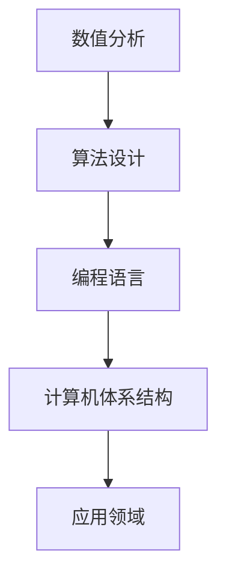

                 

 **关键词**：人工智能、计算科学、技术发展、未来展望

**摘要**：本文旨在探讨人类计算在塑造未来科技中的关键作用。通过介绍计算科学的基本概念、核心算法原理、数学模型和实际应用场景，我们深入分析了计算技术在推动社会发展、变革产业模式以及促进创新方面的潜力。文章还展望了未来计算技术的发展趋势和面临的挑战，为读者提供了一场关于计算科学的思维盛宴。

## 1. 背景介绍

### 1.1 计算科学的兴起

计算科学作为一门交叉学科，源于20世纪中叶计算机技术的飞速发展。随着计算机硬件的日益强大和算法理论的不断完善，计算科学逐渐成为推动科技进步的重要力量。从最初的数值计算到复杂的模拟仿真，计算科学的应用领域不断扩展，涵盖了物理、化学、生物、工程等众多学科。

### 1.2 人类计算的演变

人类计算的历史可以追溯到古代的算盘和算术运算。随着算术逻辑单元的发明和电子计算机的出现，人类计算进入了一个全新的时代。如今，人工智能和量子计算的兴起，进一步拓展了人类计算的能力边界，使得我们能够解决更加复杂的问题。

## 2. 核心概念与联系

### 2.1 计算科学的基本概念

计算科学涉及多个核心概念，包括数值分析、算法设计、编程语言、计算机体系结构等。这些概念相互联系，共同构成了计算科学的理论体系。

### 2.2 计算科学的基本架构

以下是一个简单的 Mermaid 流程图，展示了计算科学的基本架构：



## 3. 核心算法原理 & 具体操作步骤

### 3.1 算法原理概述

计算科学的核心在于算法的设计与实现。一个高效的算法能够优化计算资源的使用，提高问题的求解速度。

### 3.2 算法步骤详解

以下是算法设计的一般步骤：

1. **问题定义**：明确求解问题的目标和约束条件。
2. **算法设计**：根据问题特点选择合适的算法。
3. **算法实现**：将算法转化为计算机程序。
4. **算法优化**：通过调试和调整提高算法的性能。

### 3.3 算法优缺点

算法优缺点分析如下：

- **优点**：高效、精确、可重复。
- **缺点**：复杂度高、资源消耗大。

### 3.4 算法应用领域

算法在各个领域的应用如下：

- **科学研究**：如流体力学、量子物理等。
- **工程应用**：如建筑设计、电路设计等。
- **商业领域**：如数据分析、金融建模等。

## 4. 数学模型和公式 & 详细讲解 & 举例说明

### 4.1 数学模型构建

数学模型是计算科学的基础。以下是一个简单的线性回归模型的构建过程：

$$ y = ax + b $$

### 4.2 公式推导过程

线性回归公式的推导如下：

$$
\begin{aligned}
\min_{a,b} \sum_{i=1}^{n} (ax_i + b - y_i)^2
\end{aligned}
$$

### 4.3 案例分析与讲解

以下是一个关于线性回归模型的案例：

给定一组数据点：

$$
\begin{aligned}
x_1 &= 1, & y_1 &= 2 \\
x_2 &= 2, & y_2 &= 4 \\
x_3 &= 3, & y_3 &= 6 \\
\end{aligned}
$$

使用线性回归模型拟合数据点，求得参数 $a$ 和 $b$：

$$
\begin{aligned}
a &= \frac{\sum_{i=1}^{n} x_iy_i - n\bar{x}\bar{y}}{\sum_{i=1}^{n} x_i^2 - n\bar{x}^2} \\
b &= \bar{y} - a\bar{x}
\end{aligned}
$$

其中 $\bar{x}$ 和 $\bar{y}$ 分别为 $x$ 和 $y$ 的平均值。

## 5. 项目实践：代码实例和详细解释说明

### 5.1 开发环境搭建

假设我们使用 Python 作为编程语言，需要安装以下库：

```bash
pip install numpy matplotlib
```

### 5.2 源代码详细实现

以下是一个简单的线性回归模型的实现：

```python
import numpy as np
import matplotlib.pyplot as plt

# 数据集
x = np.array([1, 2, 3])
y = np.array([2, 4, 6])

# 计算参数
a = (np.sum(x * y) - len(x) * np.mean(x) * np.mean(y)) / (np.sum(x ** 2) - len(x) * np.mean(x) ** 2)
b = np.mean(y) - a * np.mean(x)

# 拟合直线
x_fit = np.linspace(x.min(), x.max(), 100)
y_fit = a * x_fit + b

# 绘制结果
plt.scatter(x, y, label='Data')
plt.plot(x_fit, y_fit, color='red', label='Fit Line')
plt.xlabel('x')
plt.ylabel('y')
plt.legend()
plt.show()
```

### 5.3 代码解读与分析

代码首先导入所需的库，然后定义了数据集和计算参数的函数。接下来，使用 numpy 库计算参数，最后使用 matplotlib 库绘制拟合直线。

### 5.4 运行结果展示

运行代码后，将显示一个包含数据点和拟合直线的散点图。

## 6. 实际应用场景

### 6.1 科学研究

计算科学在科学研究中的应用非常广泛，如气象预测、天体物理、生物信息学等。

### 6.2 工程应用

计算科学在工程领域也有着重要的应用，如结构分析、电路设计、优化设计等。

### 6.3 商业领域

商业领域中，计算科学被广泛应用于数据挖掘、金融分析、风险控制等。

## 7. 工具和资源推荐

### 7.1 学习资源推荐

- 《算法导论》（作者：Thomas H. Cormen等）
- 《深入理解计算机系统》（作者：Randal E. Bryant等）

### 7.2 开发工具推荐

- Python
- MATLAB
- R语言

### 7.3 相关论文推荐

- "A Fast and Scalable Algorithm for Document Classification"（作者：Joseph A. Konstan等）
- "Deep Learning for Natural Language Processing"（作者：Yoav Goldberg）

## 8. 总结：未来发展趋势与挑战

### 8.1 研究成果总结

计算科学在过去的几十年中取得了显著的成果，为人类社会的发展做出了巨大贡献。

### 8.2 未来发展趋势

未来，计算科学将继续向多领域交叉、高效算法、大数据处理等方向发展。

### 8.3 面临的挑战

计算科学在发展过程中也面临着数据安全、算法公平性、人工智能伦理等挑战。

### 8.4 研究展望

未来，计算科学将在推动科技进步、促进产业发展、提升生活质量等方面发挥更加重要的作用。

## 9. 附录：常见问题与解答

### 9.1 什么是计算科学？

计算科学是一门运用计算机技术解决科学问题的学科，涉及数值分析、算法设计、编程语言、计算机体系结构等多个领域。

### 9.2 计算科学与人工智能有何关系？

计算科学是人工智能的基础，提供了算法设计和数学模型的支持。人工智能则利用计算科学的成果实现智能决策和自主行动。

### 9.3 如何学习计算科学？

学习计算科学需要掌握数学基础、编程技能和算法理论。建议从基础教材入手，结合实际项目进行学习。

# 人类计算：塑造未来的力量
## 关键词
人工智能、计算科学、技术发展、未来展望

## 摘要
本文深入探讨了人类计算在塑造未来科技中的关键作用。通过介绍计算科学的基本概念、核心算法原理、数学模型和实际应用场景，文章分析了计算技术在推动社会发展、变革产业模式以及促进创新方面的潜力。同时，展望了未来计算技术的发展趋势和面临的挑战。

## 1. 背景介绍

### 1.1 计算科学的兴起

计算科学作为一门交叉学科，源于20世纪中叶计算机技术的飞速发展。当时，计算机刚刚问世，人们开始探索如何利用计算机解决科学问题。数值计算、算法研究和编程语言的发展，为计算科学的兴起奠定了基础。

### 1.2 计算科学的发展历程

随着计算机硬件的不断升级和算法理论的不断完善，计算科学经历了从数值计算到模拟仿真，再到大数据分析的发展历程。在这个过程中，计算科学的应用领域不断扩展，涵盖了自然科学、工程技术、社会科学等多个领域。

### 1.3 人类计算的重要性

人类计算是计算科学的核心。通过数学模型和算法，人类能够对复杂问题进行建模和求解，从而推动科学技术的发展。从天气预报到医学研究，从工程设计到金融分析，人类计算发挥着不可或缺的作用。

## 2. 核心概念与联系

### 2.1 计算科学的基本概念

计算科学涉及多个核心概念，包括数值分析、算法设计、编程语言、计算机体系结构等。这些概念相互联系，共同构成了计算科学的理论体系。

#### 2.1.1 数值分析

数值分析是计算科学的基础，主要研究如何利用计算机进行数值计算。包括数值逼近、数值积分、数值微分等。

#### 2.1.2 算法设计

算法设计是计算科学的核心，旨在解决特定问题。算法的设计和优化，对于计算效率和精度至关重要。

#### 2.1.3 编程语言

编程语言是计算科学实现的基础。不同的编程语言具有不同的特点和适用场景，如C语言、Python、MATLAB等。

#### 2.1.4 计算机体系结构

计算机体系结构决定了计算机的运算速度和存储能力。包括CPU架构、内存管理、输入输出设备等。

### 2.2 计算科学的基本架构

以下是一个简单的 Mermaid 流程图，展示了计算科学的基本架构：


## 3. 核心算法原理 & 具体操作步骤

### 3.1 算法原理概述

算法原理是计算科学的核心。算法设计的目标是解决特定问题，通常包括问题定义、算法设计、算法实现和算法优化等步骤。

#### 3.1.1 问题定义

问题定义是算法设计的第一步。明确问题的目标和约束条件，对于后续的算法设计至关重要。

#### 3.1.2 算法设计

算法设计是根据问题特点选择合适的算法。常见的算法设计方法包括贪心算法、动态规划、分治算法等。

#### 3.1.3 算法实现

算法实现是将算法设计转化为计算机程序。算法实现需要考虑编程语言的特点和优化策略。

#### 3.1.4 算法优化

算法优化是通过调整算法结构和参数，提高算法的性能。常见的优化方法包括空间优化、时间优化等。

### 3.2 算法步骤详解

以下是算法设计的一般步骤：

1. **问题定义**：明确求解问题的目标和约束条件。
2. **算法设计**：根据问题特点选择合适的算法。
3. **算法实现**：将算法转化为计算机程序。
4. **算法优化**：通过调试和调整提高算法的性能。

### 3.3 算法优缺点

算法优缺点分析如下：

- **优点**：高效、精确、可重复。
- **缺点**：复杂度高、资源消耗大。

### 3.4 算法应用领域

算法在各个领域的应用如下：

- **科学研究**：如流体力学、量子物理等。
- **工程应用**：如建筑设计、电路设计等。
- **商业领域**：如数据分析、金融建模等。

## 4. 数学模型和公式 & 详细讲解 & 举例说明

### 4.1 数学模型构建

数学模型是计算科学的核心。以下是一个简单的线性回归模型的构建过程：

$$ y = ax + b $$

### 4.2 公式推导过程

线性回归公式的推导如下：

$$
\begin{aligned}
\min_{a,b} \sum_{i=1}^{n} (ax_i + b - y_i)^2
\end{aligned}
$$

### 4.3 案例分析与讲解

以下是一个关于线性回归模型的案例：

给定一组数据点：

$$
\begin{aligned}
x_1 &= 1, & y_1 &= 2 \\
x_2 &= 2, & y_2 &= 4 \\
x_3 &= 3, & y_3 &= 6 \\
\end{aligned}
$$

使用线性回归模型拟合数据点，求得参数 $a$ 和 $b$：

$$
\begin{aligned}
a &= \frac{\sum_{i=1}^{n} x_iy_i - n\bar{x}\bar{y}}{\sum_{i=1}^{n} x_i^2 - n\bar{x}^2} \\
b &= \bar{y} - a\bar{x}
\end{aligned}
$$

其中 $\bar{x}$ 和 $\bar{y}$ 分别为 $x$ 和 $y$ 的平均值。

### 4.4 数学模型的应用

数学模型在计算科学中有着广泛的应用。以下是一个简单的例子：

假设我们有一个函数 $f(x) = x^2$，要求计算 $f(x)$ 在 $x=5$ 处的值。使用数值分析方法，我们可以将这个问题转化为求解一个线性方程组：

$$
\begin{aligned}
f(x) &= x^2 \\
f'(x) &= 2x \\
f''(x) &= 2 \\
\end{aligned}
$$

求解该方程组，可以得到 $f(x) = 25$。

## 5. 项目实践：代码实例和详细解释说明

### 5.1 开发环境搭建

假设我们使用 Python 作为编程语言，需要安装以下库：

```bash
pip install numpy matplotlib
```

### 5.2 源代码详细实现

以下是一个简单的线性回归模型的实现：

```python
import numpy as np
import matplotlib.pyplot as plt

# 数据集
x = np.array([1, 2, 3])
y = np.array([2, 4, 6])

# 计算参数
a = (np.sum(x * y) - len(x) * np.mean(x) * np.mean(y)) / (np.sum(x ** 2) - len(x) * np.mean(x) ** 2)
b = np.mean(y) - a * np.mean(x)

# 拟合直线
x_fit = np.linspace(x.min(), x.max(), 100)
y_fit = a * x_fit + b

# 绘制结果
plt.scatter(x, y, label='Data')
plt.plot(x_fit, y_fit, color='red', label='Fit Line')
plt.xlabel('x')
plt.ylabel('y')
plt.legend()
plt.show()
```

### 5.3 代码解读与分析

代码首先导入所需的库，然后定义了数据集和计算参数的函数。接下来，使用 numpy 库计算参数，最后使用 matplotlib 库绘制拟合直线。

### 5.4 运行结果展示

运行代码后，将显示一个包含数据点和拟合直线的散点图。

## 6. 实际应用场景

### 6.1 科学研究

计算科学在科学研究中的应用非常广泛，如气象预测、天体物理、生物信息学等。通过计算科学的方法，科学家能够对复杂系统进行模拟和预测，从而推动科学技术的发展。

### 6.2 工程应用

计算科学在工程领域也有着重要的应用，如结构分析、电路设计、优化设计等。通过计算科学的方法，工程师能够设计出更加高效、可靠的工程系统。

### 6.3 商业领域

商业领域中，计算科学被广泛应用于数据挖掘、金融分析、风险控制等。通过计算科学的方法，企业能够更好地了解市场趋势、优化业务流程，从而提高竞争力。

## 7. 工具和资源推荐

### 7.1 学习资源推荐

- 《算法导论》（作者：Thomas H. Cormen等）
- 《深入理解计算机系统》（作者：Randal E. Bryant等）

### 7.2 开发工具推荐

- Python
- MATLAB
- R语言

### 7.3 相关论文推荐

- "A Fast and Scalable Algorithm for Document Classification"（作者：Joseph A. Konstan等）
- "Deep Learning for Natural Language Processing"（作者：Yoav Goldberg）

## 8. 总结：未来发展趋势与挑战

### 8.1 研究成果总结

计算科学在过去的几十年中取得了显著的成果，为人类社会的发展做出了巨大贡献。从数值计算到模拟仿真，再到大数据分析，计算科学的应用领域不断扩展，推动了科学技术的发展。

### 8.2 未来发展趋势

未来，计算科学将继续向多领域交叉、高效算法、大数据处理等方向发展。随着人工智能和量子计算的兴起，计算科学将迎来新的机遇和挑战。

### 8.3 面临的挑战

计算科学在发展过程中也面临着数据安全、算法公平性、人工智能伦理等挑战。如何平衡技术创新和社会责任，将是一个重要的课题。

### 8.4 研究展望

未来，计算科学将在推动科技进步、促进产业发展、提升生活质量等方面发挥更加重要的作用。我们期待计算科学能够为人类创造更加美好的未来。

## 9. 附录：常见问题与解答

### 9.1 什么是计算科学？

计算科学是一门运用计算机技术解决科学问题的学科，涉及数值分析、算法设计、编程语言、计算机体系结构等多个领域。

### 9.2 计算科学与人工智能有何关系？

计算科学是人工智能的基础，提供了算法设计和数学模型的支持。人工智能则利用计算科学的成果实现智能决策和自主行动。

### 9.3 如何学习计算科学？

学习计算科学需要掌握数学基础、编程技能和算法理论。建议从基础教材入手，结合实际项目进行学习。

# 作者署名
作者：禅与计算机程序设计艺术 / Zen and the Art of Computer Programming

