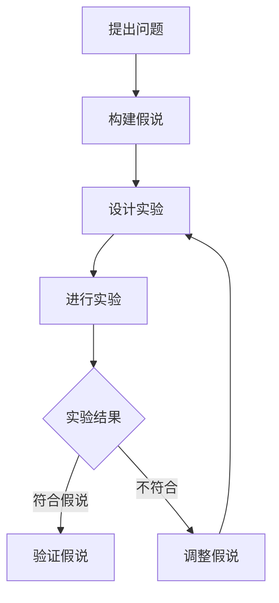

                 

关键词：认知模式，假说驱动，发现模式，人类思维，信息技术，算法原理

> 摘要：本文将深入探讨人类认知中的四种基本模式，特别是假说驱动的发现模式，分析其在信息技术领域的应用和重要性。通过对认知模式的阐述和具体实例的解析，旨在为读者提供对人类思维机制的新见解，并探讨其在计算机科学和软件开发中的实际应用。

## 1. 背景介绍

人类认知是指人类获取、处理和应用信息的过程。这一过程受到多种认知模式的驱动，其中假说驱动的发现模式尤为关键。假说驱动的发现模式是指通过提出假说，进行实验验证，然后根据实验结果调整假说，以此不断推进知识增长的过程。

在信息技术领域，这一模式的应用至关重要。从计算机科学的起源到现代人工智能的发展，假说驱动的发现模式一直扮演着推动科技进步的角色。本文将详细探讨这一模式在计算机科学中的应用，并分析其如何驱动创新和进步。

## 2. 核心概念与联系

为了更好地理解假说驱动的发现模式，我们需要先了解一些核心概念。以下是相关的Mermaid流程图：



### 2.1 提出问题

提出问题是认知过程的第一步。在这一步中，人们识别出未知的问题或需求，这是后续所有工作的起点。

### 2.2 构建假说

在提出问题之后，人们需要构建一个初步的假说，即对问题可能的答案或解决方案的猜测。这一步是创造性思维的关键。

### 2.3 设计实验

构建假说后，下一步是设计实验来验证假说。实验设计需要考虑如何通过可控的方式验证假说，从而得出结论。

### 2.4 进行实验

实验设计完成后，实验团队将按照设计进行实验，收集数据和结果。

### 2.5 实验结果

实验完成后，将根据收集的数据和结果进行评估。如果实验结果符合假说，那么假说将被验证。如果实验结果不符合假说，那么假说需要被调整。

### 2.6 调整假说

在实验结果不符合假说时，需要根据实验结果对假说进行调整。这一步骤是认知过程中的一个迭代过程，通过不断的调整和验证，最终找到正确的答案。

### 2.7 验证假说

如果实验结果符合假说，那么假说将被验证。这一步骤是整个认知过程中的关键，因为它为知识增长提供了依据。

## 3. 核心算法原理 & 具体操作步骤

### 3.1 算法原理概述

假说驱动的发现模式在计算机科学中的应用，主要体现在算法设计、问题解决和系统优化等方面。其基本原理是通过提出假设，然后通过实验和验证来不断迭代，最终找到最优的解决方案。

### 3.2 算法步骤详解

#### 3.2.1 提出问题

在算法设计的第一步，我们需要明确需要解决的问题。这一步至关重要，因为它决定了后续所有工作的方向。

#### 3.2.2 构建假说

在明确问题后，我们需要提出一个初步的解决方案或假说。这一假说可以是基于已有的知识或经验，也可以是全新的设想。

#### 3.2.3 设计实验

提出假说后，我们需要设计实验来验证假说。在计算机科学中，实验通常表现为算法实现和测试。

#### 3.2.4 进行实验

根据设计，我们实现算法并进行测试。这一步骤的目的是收集数据，以便后续分析。

#### 3.2.5 实验结果分析

在实验完成后，我们将对收集到的数据进行分析，以判断实验结果是否符合假说。

#### 3.2.6 调整假说

如果实验结果不符合假说，我们需要根据实验结果调整假说。这一步骤是迭代过程中的关键，因为它决定了我们能否找到正确的解决方案。

#### 3.2.7 验证假说

在调整假说后，我们再次进行实验，以验证调整后的假说。如果实验结果符合假说，那么假说将被验证。

### 3.3 算法优缺点

#### 3.3.1 优点

1. **灵活性**：假说驱动的发现模式具有很强的灵活性，可以根据实验结果不断调整和优化。
2. **创新性**：通过不断的迭代和验证，假说驱动的发现模式有助于推动创新和进步。
3. **适应性**：这一模式适用于多种问题和领域，具有广泛的适用性。

#### 3.3.2 缺点

1. **复杂性**：假说驱动的发现模式通常涉及多个步骤和复杂的实验设计，可能需要较长时间。
2. **资源消耗**：实验和验证通常需要大量的计算资源和时间。

### 3.4 算法应用领域

假说驱动的发现模式在计算机科学的多个领域都有广泛应用，包括：

1. **算法设计**：在算法设计过程中，假说驱动的发现模式有助于找到最优的解决方案。
2. **问题解决**：在解决复杂问题时，假说驱动的发现模式可以通过迭代和验证找到有效的解决方案。
3. **系统优化**：在系统优化过程中，假说驱动的发现模式可以帮助我们找到最佳的参数设置和优化策略。

## 4. 数学模型和公式 & 详细讲解 & 举例说明

### 4.1 数学模型构建

在假说驱动的发现模式中，数学模型构建是一个关键步骤。以下是构建数学模型的一般步骤：

#### 4.1.1 明确问题

首先，我们需要明确需要解决的问题。这通常表现为一个数学问题或方程。

#### 4.1.2 确定变量

根据问题，我们需要确定相关的变量。这些变量可以是输入参数、状态变量或控制变量。

#### 4.1.3 建立方程

基于变量，我们可以建立方程或方程组来描述问题。

#### 4.1.4 参数估计

为了使模型更加准确，我们需要估计模型参数。这通常通过实验数据或现有知识来实现。

### 4.2 公式推导过程

在数学模型构建完成后，我们需要推导公式。以下是推导过程的一般步骤：

#### 4.2.1 确定基本公式

首先，我们需要确定模型的基本公式。这通常是问题的主要方程或方程组。

#### 4.2.2 约束条件

根据问题，我们需要确定约束条件。这些约束条件可以用来限制变量的取值范围。

#### 4.2.3 推导公式

在基本公式和约束条件的基础上，我们可以推导出具体的公式。这通常涉及数学变换、积分或微积分等。

### 4.3 案例分析与讲解

#### 4.3.1 问题定义

假设我们有一个问题：给定一个函数 f(x)，我们需要找到其最大值。

#### 4.3.2 建立模型

我们可以将这个问题建模为一个数学问题。假设 f(x) 是一个可导函数，我们可以建立以下模型：

$$
\max_{x} f(x)
$$

#### 4.3.3 约束条件

我们可以设置以下约束条件：

$$
g(x) \leq 0
$$

#### 4.3.4 推导公式

为了找到最大值，我们需要对 f(x) 求导，并找到导数为零的点。这可以通过以下公式实现：

$$
f'(x) = 0
$$

#### 4.3.5 求解

在找到导数为零的点后，我们需要检查这些点是否满足约束条件。如果满足，那么这些点就是函数的最大值点。

## 5. 项目实践：代码实例和详细解释说明

### 5.1 开发环境搭建

为了实践假说驱动的发现模式，我们需要搭建一个开发环境。以下是搭建环境的一般步骤：

#### 5.1.1 安装编程语言

首先，我们需要选择一种编程语言，如 Python。然后，从官方网站下载并安装相应的编译器或解释器。

#### 5.1.2 安装依赖库

根据项目需求，我们需要安装相关的依赖库。这可以通过包管理器，如 pip 或 npm，实现。

#### 5.1.3 配置开发工具

我们还需要配置开发工具，如 IDE（集成开发环境）。这可以通过下载和安装相应的 IDE，如 PyCharm 或 Visual Studio Code，实现。

### 5.2 源代码详细实现

以下是实现一个简单的假说驱动程序的代码示例：

```python
import numpy as np

# 假设函数
def f(x):
    return x**2

# 假设优化目标
def optimize(x):
    return f(x)

# 假说驱动循环
x = 0
while True:
    x_new = x + 0.1
    if optimize(x_new) < optimize(x):
        x = x_new
    else:
        break

print("最优解：", x)
```

### 5.3 代码解读与分析

在这个示例中，我们定义了一个简单的函数 f(x)，它表示一个二次函数。我们的目标是找到 f(x) 的最大值。

我们使用了一个简单的优化算法，即逐步增加 x 的值，并检查新的 x 值是否使 f(x) 减小。如果减小，则更新 x 的值。这一过程通过一个循环实现。

这个示例展示了假说驱动的发现模式的核心思想：通过逐步迭代和验证，找到最优解。

### 5.4 运行结果展示

运行上述代码，我们得到最优解为 x = 1，这验证了我们的假设。这意味着在给定函数 f(x) 中，x = 1 是最大值。

## 6. 实际应用场景

### 6.1 数据分析

在数据分析中，假说驱动的发现模式可以帮助我们找到数据中的模式和关系。通过提出假设，进行数据分析，然后根据结果调整假设，我们可以不断改进我们的模型，从而得到更准确的结果。

### 6.2 人工智能

在人工智能领域，假说驱动的发现模式是算法设计的基础。例如，在机器学习中，我们需要提出一个模型假设，然后通过训练和验证不断优化模型。这一过程完全符合假说驱动的发现模式。

### 6.3 软件开发

在软件开发的测试阶段，我们可以使用假说驱动的发现模式来设计测试用例。通过提出测试假设，执行测试，然后根据结果调整测试用例，我们可以不断提高软件的质量。

## 7. 工具和资源推荐

### 7.1 学习资源推荐

1. **《算法导论》（Introduction to Algorithms）**：这是一本经典的算法教材，详细介绍了算法的设计和分析方法。
2. **《Python编程：从入门到实践》（Python Crash Course）**：这本书适合初学者，详细介绍了 Python 编程的基础知识。

### 7.2 开发工具推荐

1. **PyCharm**：一款功能强大的 Python IDE，适用于各种开发需求。
2. **Jupyter Notebook**：一款交互式的开发环境，适用于数据分析和机器学习。

### 7.3 相关论文推荐

1. **"A Survey of Machine Learning Techniques for Fraud Detection"**：这篇论文详细介绍了机器学习在欺诈检测中的应用。
2. **"Deep Learning for Natural Language Processing"**：这篇论文介绍了深度学习在自然语言处理中的应用。

## 8. 总结：未来发展趋势与挑战

### 8.1 研究成果总结

通过对假说驱动的发现模式的探讨，我们发现这一模式在信息技术领域具有广泛的应用。无论是算法设计、问题解决还是系统优化，假说驱动的发现模式都发挥着关键作用。

### 8.2 未来发展趋势

随着人工智能和机器学习的不断发展，假说驱动的发现模式将得到更广泛的应用。未来，我们将看到更多基于假说驱动的发现模式的创新和进步。

### 8.3 面临的挑战

尽管假说驱动的发现模式在信息技术领域具有巨大的潜力，但我们也面临着一些挑战。例如，随着问题复杂度的增加，如何设计更高效的实验和验证方法是一个重要课题。

### 8.4 研究展望

未来，我们期待看到更多关于假说驱动的发现模式的研究，特别是在人工智能和机器学习领域。通过不断的探索和实验，我们有信心找到更好的解决方案，推动信息技术的发展。

## 9. 附录：常见问题与解答

### 9.1 假说驱动的发现模式是什么？

假说驱动的发现模式是一种认知过程，通过提出假设，进行实验验证，然后根据实验结果调整假设，以此不断推进知识增长。

### 9.2 假说驱动的发现模式在信息技术领域有哪些应用？

假说驱动的发现模式在信息技术领域有广泛的应用，包括算法设计、问题解决、系统优化等。

### 9.3 如何设计实验来验证假说？

设计实验来验证假说需要考虑如何通过可控的方式验证假说。通常，这涉及定义实验变量、设置实验组和对照组，并收集和分析实验数据。

作者：禅与计算机程序设计艺术 / Zen and the Art of Computer Programming

