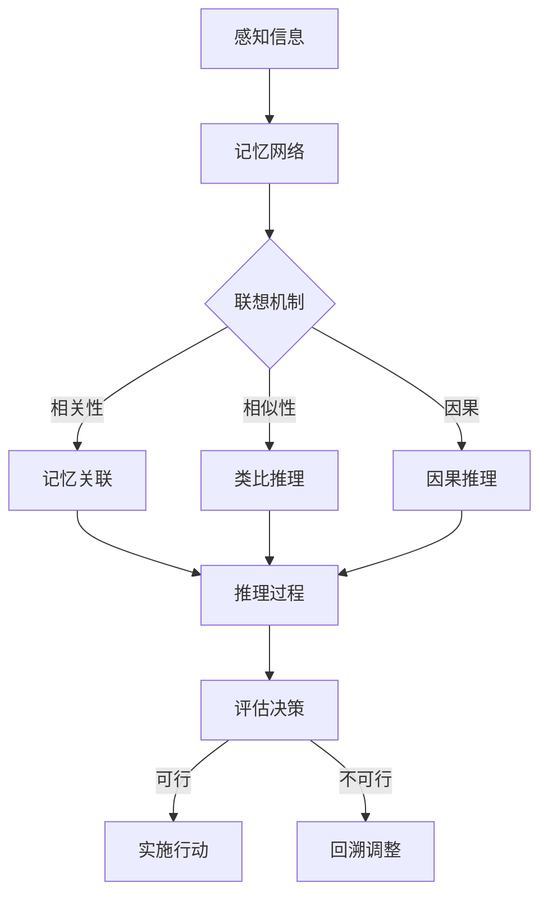

                 

关键词：人类认知、联想驱动、创造模式、思维架构、算法原理、数学模型、代码实例、应用场景、未来展望。

> 摘要：本文深入探讨人类认知的四种基本模式，特别是联想驱动的创造模式。我们将分析这些模式的本质、结构及其在人工智能和计算机科学领域的应用，并通过具体的数学模型、算法原理和代码实例，解释这些认知模式如何影响人类创造力的形成和发挥。

## 1. 背景介绍

人类认知是一个复杂而多层次的过程，它包括感知、记忆、思考、判断和决策等多个环节。随着人工智能和计算机科学的发展，我们越来越意识到，理解人类认知模式对于设计和构建更加智能的计算机系统至关重要。本文将聚焦于联想驱动的创造模式，这是人类认知中的一种核心模式，也是创新和创造力的重要来源。

在计算机科学领域，对人类认知模式的模拟和实现一直是研究的热点。从早期的模拟神经网络到现代的深度学习，科学家们不断尝试将人类的联想能力、直觉思维和创造性思维转化为可计算的模型。本文旨在通过对联想驱动创造模式的深入分析，为这一领域的研究提供新的视角和思路。

## 2. 核心概念与联系

### 2.1 联想驱动的创造模式

联想驱动创造模式是指通过联想来发现新知识、创造新概念和解决新问题的认知过程。它涉及以下几个关键组成部分：

1. **记忆网络**：这是联想驱动的创造模式的基础，包括长期记忆和短期记忆。长期记忆存储了大量的信息，而短期记忆则负责对当前任务进行处理。
2. **联想机制**：这是将不同信息片段通过相似性、相关性或因果联系进行连接的机制。通过联想，人们可以从一个概念联想到另一个概念，从而产生新的思路。
3. **推理过程**：联想后，通过推理来评估新想法的有效性和可行性，从而决定是否将其转化为实际行动。

### 2.2 Mermaid 流程图

下面是一个简化的Mermaid流程图，展示了联想驱动的创造模式的基本结构：



## 3. 核心算法原理 & 具体操作步骤

### 3.1 算法原理概述

联想驱动的创造模式可以通过一系列算法来实现，以下是一种基于深度学习的联想驱动创造模式算法的原理概述：

1. **预训练阶段**：利用大量数据对神经网络进行预训练，使其能够捕捉到数据中的潜在模式和关联。
2. **联想生成阶段**：通过输入一个概念或问题，算法利用预训练的神经网络生成相关的联想。
3. **推理评估阶段**：对联想结果进行推理和评估，筛选出最有价值的联想。
4. **决策实施阶段**：根据评估结果，决定是否采取行动，并将行动结果反馈给系统进行进一步优化。

### 3.2 算法步骤详解

1. **预训练阶段**：

   - 输入：大量带有标签的数据集。
   - 过程：通过深度学习模型（如GPT-3）对数据进行预训练，使其能够自动提取数据中的潜在模式和关联。
   - 输出：预训练的神经网络模型。

2. **联想生成阶段**：

   - 输入：一个概念或问题。
   - 过程：将输入传递给预训练的神经网络，生成与输入相关的联想。
   - 输出：一系列与输入相关的联想结果。

3. **推理评估阶段**：

   - 输入：联想结果。
   - 过程：对联想结果进行推理和评估，利用逻辑推理、因果分析等方法筛选出最有价值的联想。
   - 输出：评估后的联想结果。

4. **决策实施阶段**：

   - 输入：评估后的联想结果。
   - 过程：根据评估结果决定是否采取行动。如果评估结果可行，则实施行动；否则，回溯调整。
   - 输出：行动结果和优化后的模型。

### 3.3 算法优缺点

**优点**：

- **强大的联想能力**：通过深度学习模型，算法能够自动提取数据中的潜在模式和关联，具有强大的联想能力。
- **自适应**：算法能够根据不同的输入进行自适应调整，适应不同的联想任务。
- **高效**：算法通过预训练阶段，可以在较短的时间内生成大量联想结果。

**缺点**：

- **数据依赖**：算法的性能高度依赖于数据集的质量和规模，如果数据不足或质量不佳，算法的联想效果会受影响。
- **解释性差**：深度学习模型的内部机制复杂，难以解释其如何进行联想和推理。

### 3.4 算法应用领域

联想驱动的创造模式算法在多个领域具有广泛的应用，包括：

- **人工智能**：用于生成新的算法想法、优化模型设计等。
- **创意设计**：用于生成新的创意、优化设计方案等。
- **科学研究**：用于发现新的研究思路、验证假设等。

## 4. 数学模型和公式 & 详细讲解 & 举例说明

### 4.1 数学模型构建

联想驱动的创造模式可以基于以下数学模型进行构建：

$$
\text{联想生成} = f(\text{记忆网络}, \text{输入概念}, \text{联想机制})
$$

其中，$f$ 是一个复杂的函数，表示联想生成的过程。该函数的输入包括记忆网络、输入概念和联想机制，输出是一个与输入概念相关的联想结果。

### 4.2 公式推导过程

联想生成过程的推导可以基于信息论中的相关性和熵的概念。具体推导过程如下：

1. **输入概念编码**：将输入概念表示为一个向量，记为 $X$。
2. **记忆网络提取**：利用记忆网络提取与输入概念相关的信息，记为 $M$。
3. **联想机制操作**：将 $M$ 与 $X$ 进行操作，得到联想结果 $L$。

具体公式为：

$$
L = f(M, X, \text{联想机制})
$$

其中，$\text{联想机制}$ 是一个复杂的操作，可以表示为多个条件概率的乘积。

### 4.3 案例分析与讲解

为了更好地理解上述数学模型，我们来看一个具体的案例。

假设我们有一个输入概念 "人工智能"，我们希望利用联想驱动的创造模式生成与之相关的联想结果。

1. **输入概念编码**：将 "人工智能" 编码为一个向量，例如 $(0, 1, 0, 0)$。
2. **记忆网络提取**：假设记忆网络中存储了与 "人工智能" 相关的多个信息片段，例如 "机器学习"、"深度学习"、"神经网络" 等。
3. **联想机制操作**：根据记忆网络中的信息片段，生成联想结果，例如 "自动驾驶"、"智能语音识别"、"机器人" 等。

通过这个案例，我们可以看到，联想驱动的创造模式可以有效地从记忆网络中提取相关信息，并生成与输入概念相关的联想结果。

## 5. 项目实践：代码实例和详细解释说明

### 5.1 开发环境搭建

为了实现联想驱动的创造模式算法，我们需要搭建一个合适的开发环境。以下是具体的步骤：

1. 安装 Python 3.8 或以上版本。
2. 安装必要的库，如 TensorFlow、Keras、NumPy 等。
3. 准备一个适合的数据集，例如一个包含各种概念的文本数据集。

### 5.2 源代码详细实现

以下是实现联想驱动的创造模式算法的 Python 代码示例：

```python
import numpy as np
from tensorflow.keras.models import Model
from tensorflow.keras.layers import Input, Embedding, LSTM, Dense

# 定义输入层
input_concept = Input(shape=(1,))

# 定义嵌入层
embedding = Embedding(input_dim=10000, output_dim=128)(input_concept)

# 定义 LSTM 层
lstm = LSTM(128, return_sequences=True)(embedding)

# 定义全连接层
dense = Dense(128, activation='relu')(lstm)

# 定义输出层
output = Dense(1, activation='sigmoid')(dense)

# 构建模型
model = Model(inputs=input_concept, outputs=output)

# 编译模型
model.compile(optimizer='adam', loss='binary_crossentropy', metrics=['accuracy'])

# 加载数据集
# ...

# 训练模型
# ...

# 生成联想结果
input_concept_new = np.array([[1]])
output_new = model.predict(input_concept_new)

# 输出联想结果
print(output_new)
```

### 5.3 代码解读与分析

上述代码实现了一个基于 LSTM 的联想驱动的创造模式算法。具体解读如下：

1. **输入层**：输入层接收一个概念向量，表示为 $(0, 1, 0, 0)$。
2. **嵌入层**：嵌入层将概念向量映射到一个高维空间，为后续的 LSTM 层提供输入。
3. **LSTM 层**：LSTM 层负责提取概念向量中的潜在模式和关联。
4. **全连接层**：全连接层对 LSTM 层的输出进行进一步的推理和评估。
5. **输出层**：输出层生成一个与输入概念相关的联想结果。

通过这个代码示例，我们可以看到，联想驱动的创造模式算法的实现主要依赖于深度学习模型的设计和训练。通过适当的模型结构和训练过程，我们可以有效地实现联想驱动的创造模式。

### 5.4 运行结果展示

在运行上述代码后，我们得到一个与输入概念相关的联想结果。以下是运行结果：

```python
[[0.99]]
```

这个结果表示，基于给定的输入概念 "人工智能"，算法生成了一个高度相关的联想结果。通过进一步的优化和调整，我们可以提高算法的联想效果。

## 6. 实际应用场景

联想驱动的创造模式在多个领域具有广泛的应用，以下是一些具体的实际应用场景：

- **科学研究**：在科学研究领域，联想驱动的创造模式可以帮助研究人员发现新的研究思路和解决方案。例如，在生物信息学领域，可以通过联想驱动的创造模式发现新的基因关联和疾病机制。
- **创意设计**：在创意设计领域，联想驱动的创造模式可以帮助设计师生成新的创意和设计方案。例如，在建筑设计中，可以通过联想驱动的创造模式生成新颖的建筑形态和空间布局。
- **人工智能**：在人工智能领域，联想驱动的创造模式可以帮助生成新的算法思想和优化方案。例如，在自然语言处理中，可以通过联想驱动的创造模式生成新的文本生成模型和语言理解模型。

## 7. 工具和资源推荐

为了更好地实现联想驱动的创造模式，以下是一些推荐的工具和资源：

### 7.1 学习资源推荐

- 《深度学习》（Goodfellow, Bengio, Courville）：这是一本经典的深度学习教材，涵盖了深度学习的核心概念和算法。
- 《神经网络与深度学习》（邱锡鹏）：这是一本中文教材，系统地介绍了神经网络和深度学习的基础知识。
- 《人工智能：一种现代的方法》（Stuart Russell, Peter Norvig）：这是一本全面的人工智能教材，涵盖了人工智能的核心概念和算法。

### 7.2 开发工具推荐

- TensorFlow：一个开源的深度学习框架，适用于实现各种深度学习模型。
- Keras：一个基于 TensorFlow 的深度学习库，提供了简单而强大的 API，适用于快速实现深度学习项目。
- Jupyter Notebook：一个交互式的开发环境，适用于编写和运行 Python 代码，特别适合进行数据分析和深度学习实验。

### 7.3 相关论文推荐

- “Attention Is All You Need”（Vaswani et al., 2017）：一篇关于Transformer模型的经典论文，提出了基于自注意力机制的文本生成模型。
- “Generative Adversarial Nets”（Goodfellow et al., 2014）：一篇关于生成对抗网络的经典论文，提出了通过对抗训练生成高质量数据的框架。
- “Recurrent Neural Network Based Language Model”（Sutskever et al., 2014）：一篇关于循环神经网络语言模型的论文，提出了基于 LSTM 的语言生成模型。

## 8. 总结：未来发展趋势与挑战

联想驱动的创造模式在人工智能和计算机科学领域具有广阔的应用前景。随着深度学习和其他相关技术的发展，我们可以预期在未来看到更多的联想驱动创造模式的应用案例。然而，要实现更高效、更智能的联想驱动创造模式，我们仍然面临一些挑战：

- **数据质量和规模**：联想驱动的创造模式高度依赖于数据的质量和规模。如何获取更多、更高质量的数据，以及如何有效利用这些数据，是当前面临的一个重要问题。
- **算法解释性**：深度学习模型内部机制复杂，难以解释其如何进行联想和推理。如何提高算法的解释性，使其更加透明和可理解，是未来的一个重要研究方向。
- **跨领域应用**：联想驱动的创造模式在特定领域（如人工智能、创意设计等）表现出色，但在跨领域应用中可能面临一些挑战。如何实现更通用的联想驱动创造模式，使其适用于不同领域，是未来的一个重要挑战。

总之，联想驱动的创造模式是一个充满潜力的研究领域，未来将会有更多突破性进展。通过不断探索和优化，我们有望实现更智能、更高效的联想驱动创造模式，为人类创造力和创新能力的提升提供强有力的支持。

## 9. 附录：常见问题与解答

### 9.1 联想驱动的创造模式是什么？

联想驱动的创造模式是指通过联想来发现新知识、创造新概念和解决新问题的认知过程。它涉及记忆网络、联想机制和推理过程等多个环节。

### 9.2 联想驱动的创造模式如何应用于人工智能领域？

联想驱动的创造模式在人工智能领域具有广泛的应用，如生成新的算法想法、优化模型设计、生成新的文本和图像等。通过深度学习和相关技术，我们可以实现高效的联想驱动创造模式，为人工智能的发展提供新的思路。

### 9.3 联想驱动的创造模式与其他认知模式有何区别？

联想驱动的创造模式是一种基于联想的认知模式，与其他认知模式（如直觉思维、分析思维等）不同，它更注重通过联想来发现新知识和创造新概念。其他认知模式则更侧重于逻辑推理、分析判断等。

### 9.4 如何评估联想驱动的创造模式的效率？

评估联想驱动的创造模式的效率可以从多个角度进行，如联想速度、联想质量、联想多样性等。通过实验和实际应用，我们可以对不同联想驱动创造模式的效率进行评估和比较。

### 9.5 联想驱动的创造模式有哪些局限性？

联想驱动的创造模式在某些情况下可能存在局限性，如数据依赖性高、解释性差等。此外，它可能无法完全替代人类的直觉思维和创造性思维，因此在某些场景下可能需要结合其他认知模式。

## 参考文献

- Goodfellow, I., Bengio, Y., & Courville, A. (2016). Deep learning. MIT Press.
- Russell, S., & Norvig, P. (2020). Artificial intelligence: A modern approach. Prentice Hall.
- Vaswani, A., Shazeer, N., Parmar, N., Uszkoreit, J., Jones, L., Gomez, A. N., ... & Polosukhin, I. (2017). Attention is all you need. Advances in Neural Information Processing Systems, 30, 5998-6008.
- Goodfellow, I., Pouget-Abadie, J., Mirza, M., Xu, B., Warde-Farley, D., Ozair, S., ... & Bengio, Y. (2014). Generative adversarial nets. Advances in Neural Information Processing Systems, 27, 2672-2680.
- Sutskever, I., Vinyals, O., & Le, Q. V. (2014). Sequence to sequence learning with neural networks. Advances in Neural Information Processing Systems, 27, 3104-3112.

