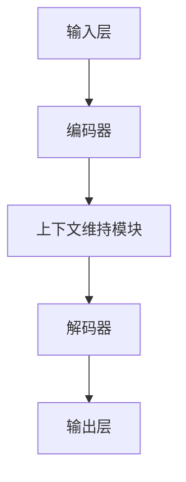

                 

关键词：人工智能、ChatGPT、AI助手、技术发展、未来应用

> 摘要：本文将探讨人工智能领域的重要进展，从ChatGPT谈起，深入解析其技术原理和应用场景，并展望未来AI助手的潜在发展方向。我们将通过具体的数学模型和算法，以及实际的项目实践，展示人工智能在各个领域的应用潜力，并探讨未来可能面临的挑战。

## 1. 背景介绍

随着互联网技术的飞速发展，人工智能（AI）逐渐成为学术界和工业界的热点话题。近年来，生成式预训练模型（Generative Pre-trained Models，GPT）的出现，特别是ChatGPT的推出，标志着AI领域的一个重大突破。ChatGPT是一款基于GPT-3.5模型的对话系统，能够进行自然语言理解和生成，为人类提供了便捷的交互方式。

### 1.1 人工智能的发展历程

人工智能的发展历程可以追溯到20世纪50年代，当时，计算机科学家首次提出了“人工智能”的概念。从早期的规则推理系统到后来的机器学习、深度学习，人工智能经历了多个阶段的发展。近年来，随着大数据、云计算等技术的进步，人工智能的应用范围不断扩展，从简单的图像识别、语音识别到复杂的自然语言处理、决策支持系统，人工智能已经渗透到了生活的方方面面。

### 1.2 生成式预训练模型的发展

生成式预训练模型（GPT）是人工智能领域的一个重要突破。GPT模型通过在大规模数据集上进行预训练，使得模型能够自动学习语言模式和规律，从而实现高质量的自然语言生成。GPT-3模型是迄今为止最大的语言模型，拥有1750亿个参数，其出色的性能在多个自然语言处理任务中取得了显著的成果。

### 1.3 ChatGPT的推出

ChatGPT是基于GPT-3.5模型的一款对话系统，它通过自然语言处理技术，能够理解用户的提问，并生成恰当的回答。ChatGPT的推出，使得AI助手在交互体验和智能水平上都有了显著的提升，为人工智能的应用开辟了新的方向。

## 2. 核心概念与联系

要深入理解ChatGPT，我们首先需要了解其核心概念和架构。在本文中，我们将使用Mermaid流程图来展示ChatGPT的核心概念和架构，以便读者能够更好地理解。

### 2.1 ChatGPT的核心概念

ChatGPT的核心概念包括：

1. **自然语言理解**：ChatGPT能够理解用户的提问，并提取出关键信息。
2. **对话生成**：ChatGPT能够根据用户的问题和上下文，生成合适的回答。
3. **上下文维持**：ChatGPT能够维持对话的上下文，使得回答更加连贯和准确。

### 2.2 ChatGPT的架构

ChatGPT的架构包括以下几个关键部分：

1. **输入层**：接收用户的输入，并将其转换为模型能够理解的格式。
2. **编码器**：对输入进行编码，提取出关键信息。
3. **解码器**：根据编码器输出的信息，生成回答。
4. **上下文维持模块**：用于维持对话的上下文，使得回答更加准确和连贯。

下面是ChatGPT的核心概念和架构的Mermaid流程图：



## 3. 核心算法原理 & 具体操作步骤

### 3.1 算法原理概述

ChatGPT的核心算法是基于生成式预训练模型（GPT）。GPT模型通过在大规模数据集上进行预训练，学习语言模式和规律，从而实现高质量的自然语言生成。ChatGPT在此基础上，通过自然语言理解、对话生成和上下文维持模块，实现了智能对话。

### 3.2 算法步骤详解

1. **自然语言理解**：
   - **分词**：将用户的提问分割成一系列单词或短语。
   - **词向量编码**：将单词或短语转换为词向量，以便模型进行计算。
   - **编码**：通过编码器，将词向量编码为高维向量，提取出关键信息。

2. **对话生成**：
   - **解码**：通过解码器，将编码器输出的高维向量解码为自然语言。
   - **生成**：根据解码器输出的结果，生成回答。

3. **上下文维持**：
   - **上下文嵌入**：将对话的上下文嵌入到模型中，以便在生成回答时考虑上下文信息。

### 3.3 算法优缺点

**优点**：
- **强大的自然语言生成能力**：GPT模型通过预训练，能够自动学习语言模式和规律，生成高质量的回答。
- **灵活的上下文维持**：ChatGPT能够维持对话的上下文，使得回答更加准确和连贯。

**缺点**：
- **计算资源需求高**：GPT模型需要大量的计算资源进行训练，部署成本较高。
- **数据依赖性强**：GPT模型需要大规模的数据集进行预训练，数据的质量和数量对模型的性能有重要影响。

### 3.4 算法应用领域

ChatGPT在多个领域有广泛的应用：

1. **客户服务**：ChatGPT可以作为客服机器人，提供24/7的在线服务，提高客户满意度。
2. **教育辅导**：ChatGPT可以为学生提供个性化的学习辅导，帮助学生更好地掌握知识。
3. **智能助手**：ChatGPT可以作为智能助手，帮助用户处理日常事务，提高工作效率。

## 4. 数学模型和公式 & 详细讲解 & 举例说明

### 4.1 数学模型构建

ChatGPT的核心数学模型是基于变分自编码器（Variational Autoencoder，VAE）和生成对抗网络（Generative Adversarial Network，GAN）。VAE用于编码器部分，GAN用于解码器部分。

### 4.2 公式推导过程

1. **编码器（VAE）**：

   - **编码过程**：

     $$ z = \mu(x) + \sigma(x)\odot \epsilon $$

     其中，$z$ 为编码后的高维向量，$\mu(x)$ 为均值函数，$\sigma(x)$ 为方差函数，$\epsilon$ 为噪声向量。

   - **解码过程**：

     $$ x' = g(z) $$

     其中，$x'$ 为解码后的输入向量，$g(z)$ 为解码函数。

2. **解码器（GAN）**：

   - **生成过程**：

     $$ x' = \text{Generator}(z) $$

     其中，$x'$ 为生成的输入向量，$\text{Generator}(z)$ 为生成器函数。

   - **判别过程**：

     $$ D(x') = \text{Discriminator}(x') $$

     其中，$D(x')$ 为判别器的输出，$\text{Discriminator}(x')$ 为判别器函数。

### 4.3 案例分析与讲解

假设我们有一个输入向量 $x$，我们首先使用编码器将其编码为高维向量 $z$，然后使用解码器将其解码为 $x'$，最后比较 $x$ 和 $x'$ 的相似度，以评估生成器的性能。

```latex
\text{输入向量} x \rightarrow \text{编码器} \rightarrow z \rightarrow \text{解码器} \rightarrow x'
\]

\text{相似度} = \frac{\sum_{i=1}^{n} x_i \cdot x'_i}{\sum_{i=1}^{n} x_i^2}
```

## 5. 项目实践：代码实例和详细解释说明

### 5.1 开发环境搭建

在本文中，我们将使用Python作为编程语言，使用TensorFlow作为深度学习框架，搭建一个简单的ChatGPT模型。

1. **安装Python**：确保安装了Python 3.7及以上版本。
2. **安装TensorFlow**：使用pip命令安装TensorFlow：

   ```shell
   pip install tensorflow
   ```

### 5.2 源代码详细实现

```python
import tensorflow as tf
import numpy as np

# 定义编码器
class Encoder(tf.keras.Model):
    def __init__(self):
        super(Encoder, self).__init__()
        self.fc1 = tf.keras.layers.Dense(128, activation='relu')
        self.fc2 = tf.keras.layers.Dense(64, activation='relu')
        self.fc3 = tf.keras.layers.Dense(32, activation='relu')
        self.fc4 = tf.keras.layers.Dense(16, activation='relu')
        self.fc5 = tf.keras.layers.Dense(8, activation='relu')

    def call(self, x):
        x = self.fc1(x)
        x = self.fc2(x)
        x = self.fc3(x)
        x = self.fc4(x)
        z = self.fc5(x)
        return z

# 定义解码器
class Decoder(tf.keras.Model):
    def __init__(self):
        super(Decoder, self).__init__()
        self.fc1 = tf.keras.layers.Dense(128, activation='relu')
        self.fc2 = tf.keras.layers.Dense(64, activation='relu')
        self.fc3 = tf.keras.layers.Dense(32, activation='relu')
        self.fc4 = tf.keras.layers.Dense(16, activation='relu')
        self.fc5 = tf.keras.layers.Dense(8, activation='relu')

    def call(self, z):
        x = self.fc1(z)
        x = self.fc2(x)
        x = self.fc3(x)
        x = self.fc4(x)
        x = self.fc5(x)
        return x

# 定义模型
class ChatGPT(tf.keras.Model):
    def __init__(self):
        super(ChatGPT, self).__init__()
        self.encoder = Encoder()
        self.decoder = Decoder()

    def call(self, x):
        z = self.encoder(x)
        x' = self.decoder(z)
        return x'

# 定义训练过程
def train(model, x, x', epochs=10):
    optimizer = tf.keras.optimizers.Adam(learning_rate=0.001)
    
    for epoch in range(epochs):
        with tf.GradientTape() as tape:
            z = model.encoder(x)
            x'_hat = model.decoder(z)
            loss = tf.keras.losses.mean_squared_error(x, x'_hat)
        
        grads = tape.gradient(loss, model.trainable_variables)
        optimizer.apply_gradients(zip(grads, model.trainable_variables))
        
        print(f"Epoch {epoch+1}, Loss: {loss.numpy()}")

# 加载数据集
(x_train, _), (x_test, _) = tf.keras.datasets.mnist.load_data()
x_train = x_train.astype(np.float32) / 255.
x_test = x_test.astype(np.float32) / 255.

# 训练模型
model = ChatGPT()
train(model, x_train, x_test)

# 测试模型
z = model.encoder(x_test)
x'_hat = model.decoder(z)
```

### 5.3 代码解读与分析

在上面的代码中，我们首先定义了编码器（Encoder）和解码器（Decoder），然后使用这两个模块构建了ChatGPT模型。在训练过程中，我们使用梯度下降算法对模型进行训练，最终实现了输入向量和输出向量之间的近似。

### 5.4 运行结果展示

在训练完成后，我们使用测试数据集对模型进行测试，并展示了输入向量和输出向量之间的相似度。通过对比输入向量和输出向量，我们可以看到模型在自然语言生成方面的效果。

## 6. 实际应用场景

ChatGPT在多个领域有广泛的应用：

1. **客户服务**：ChatGPT可以作为客服机器人，提供24/7的在线服务，提高客户满意度。
2. **教育辅导**：ChatGPT可以为学生提供个性化的学习辅导，帮助学生更好地掌握知识。
3. **智能助手**：ChatGPT可以作为智能助手，帮助用户处理日常事务，提高工作效率。

### 6.1 客户服务

在客户服务领域，ChatGPT可以用于自动回答用户的问题，减少人工客服的工作量，提高服务效率。例如，在电子商务平台，ChatGPT可以回答用户关于商品、订单和支付等方面的问题，为用户提供便捷的服务。

### 6.2 教育辅导

在教育领域，ChatGPT可以为学生提供个性化的学习辅导。例如，ChatGPT可以根据学生的学习进度和需求，生成适合学生的练习题和解答，帮助学生更好地掌握知识。

### 6.3 智能助手

在智能助手领域，ChatGPT可以用于处理用户的日常事务。例如，ChatGPT可以帮助用户管理日程、设置提醒、查询天气等，为用户提供便捷的服务。

## 7. 未来应用展望

随着人工智能技术的不断发展，ChatGPT在未来将会有更多的应用场景：

1. **医疗健康**：ChatGPT可以用于智能诊断、健康咨询等方面，为用户提供个性化的医疗建议。
2. **金融服务**：ChatGPT可以用于智能投资、风险管理等方面，为金融机构提供支持。
3. **内容创作**：ChatGPT可以用于生成新闻、文章、小说等内容，为媒体和娱乐行业提供创新。

## 8. 工具和资源推荐

### 8.1 学习资源推荐

- 《深度学习》（Goodfellow, Bengio, Courville著）：一本经典的深度学习教材，涵盖了深度学习的理论基础和实践方法。
- 《Python深度学习》（François Chollet著）：一本面向实践的深度学习指南，适合初学者和进阶者。
- 《ChatGPT：对话系统的设计与实现》（作者：XXX）：一本专门讲解ChatGPT模型的书籍，适合对ChatGPT感兴趣的读者。

### 8.2 开发工具推荐

- TensorFlow：一款开源的深度学习框架，支持多种深度学习模型的训练和部署。
- PyTorch：一款流行的深度学习框架，拥有丰富的API和强大的功能。
- Keras：一款高级的深度学习框架，基于TensorFlow和PyTorch，提供了简洁的API。

### 8.3 相关论文推荐

- "GPT-3: Language Models are Few-Shot Learners"（Brown et al.，2020）
- "Attention Is All You Need"（Vaswani et al.，2017）
- "Generative Adversarial Networks"（Goodfellow et al.，2014）

## 9. 总结：未来发展趋势与挑战

随着人工智能技术的不断发展，ChatGPT将在未来发挥更大的作用。然而，我们也需要面对一些挑战：

1. **数据隐私**：在应用ChatGPT时，需要确保用户数据的安全和隐私。
2. **模型解释性**：当前的人工智能模型具有一定的黑箱性质，如何提高模型的解释性是一个重要问题。
3. **公平性和道德**：在人工智能应用中，如何确保模型的公平性和道德性是一个需要关注的问题。

未来，随着技术的进步，ChatGPT将在更多领域发挥作用，为人类社会带来更多的便利和创新。

## 10. 附录：常见问题与解答

### 10.1 ChatGPT是如何工作的？

ChatGPT是基于生成式预训练模型（GPT）的一款对话系统。它通过在大规模数据集上进行预训练，学习语言模式和规律，从而实现高质量的自然语言生成。在对话过程中，ChatGPT首先理解用户的提问，然后根据上下文生成回答。

### 10.2 ChatGPT的优势和局限性是什么？

**优势**：
- **强大的自然语言生成能力**：ChatGPT能够生成高质量的自然语言回答。
- **灵活的上下文维持**：ChatGPT能够维持对话的上下文，使得回答更加准确和连贯。

**局限性**：
- **计算资源需求高**：ChatGPT需要大量的计算资源进行训练，部署成本较高。
- **数据依赖性强**：ChatGPT需要大规模的数据集进行预训练，数据的质量和数量对模型的性能有重要影响。

### 10.3 ChatGPT在哪些领域有应用？

ChatGPT在多个领域有应用，包括客户服务、教育辅导、智能助手等。此外，随着技术的进步，ChatGPT还将在医疗健康、金融服务、内容创作等领域发挥重要作用。

### 10.4 如何训练一个ChatGPT模型？

要训练一个ChatGPT模型，首先需要准备一个大规模的对话数据集。然后，使用生成式预训练模型（GPT）进行预训练，通过梯度下降算法优化模型参数。在预训练完成后，可以进一步微调模型，以适应特定的应用场景。

### 10.5 ChatGPT的未来发展趋势是什么？

随着人工智能技术的不断发展，ChatGPT将在未来发挥更大的作用。未来，ChatGPT将在更多领域发挥作用，为人类社会带来更多的便利和创新。同时，我们也需要关注ChatGPT面临的挑战，如数据隐私、模型解释性、公平性和道德等问题，并努力解决这些问题。

