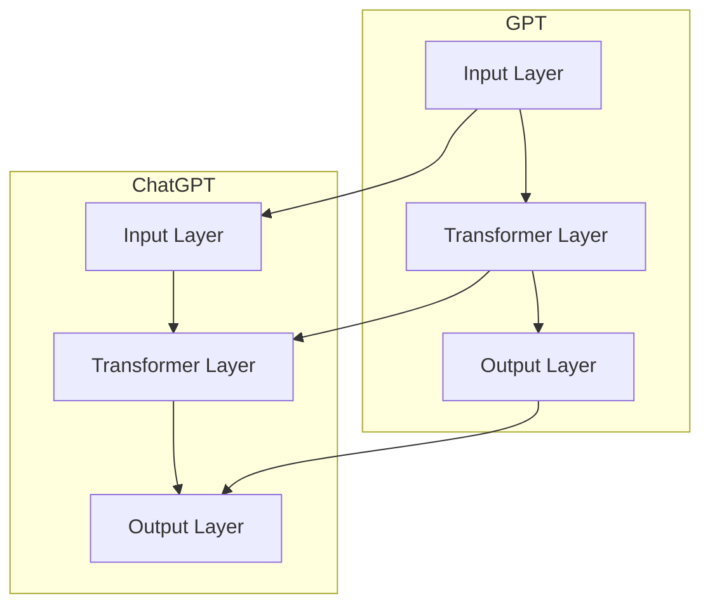

                 

关键词：人工智能，自然语言处理，语言模型，GPT，ChatGPT，深度学习，神经网络，语言生成。

> 摘要：本文将探讨人工智能领域中的一个重要里程碑——从GPT（Generative Pre-trained Transformer）到ChatGPT（Chat-based Generative Pre-trained Transformer）的演变过程。我们将深入探讨GPT的工作原理，如何应用于自然语言处理任务，以及ChatGPT相对于GPT的改进和优势。此外，本文还将探讨ChatGPT在实际应用场景中的表现，以及其未来的发展趋势。

## 1. 背景介绍

随着人工智能技术的不断发展，自然语言处理（NLP）领域取得了显著的进步。自然语言处理是指使计算机能够理解、生成和解释人类语言的技术。在这个领域，语言模型是一个核心的概念。语言模型旨在捕捉语言的统计规律，从而在文本生成、翻译、情感分析等任务中发挥作用。

在过去的几年中，基于神经网络的深度学习技术取得了巨大的成功，尤其是在图像识别、语音识别等领域。随着这些技术的不断发展，研究者们开始将注意力转向自然语言处理领域，探索如何将深度学习应用于语言模型。

GPT（Generative Pre-trained Transformer）是这一领域的一个代表性模型，由OpenAI于2018年提出。GPT是基于Transformer架构的语言模型，通过预训练和微调，使其在多种NLP任务中表现出色。随后，OpenAI于2022年发布了ChatGPT，这是GPT的一个专门用于对话系统的版本。ChatGPT在对话生成、问答等任务中取得了显著的效果，引起了广泛关注。

本文将首先介绍GPT的基本原理和架构，然后深入探讨ChatGPT相对于GPT的改进和优势，以及它们在实际应用场景中的表现。最后，我们将讨论ChatGPT未来的发展趋势。

## 2. 核心概念与联系

### 2.1. GPT的基本原理和架构

GPT是一种基于Transformer架构的预训练语言模型。Transformer模型是由Vaswani等人在2017年提出的一种全新架构，它使用自注意力机制来捕捉输入序列中的长距离依赖关系。GPT继承了这种自注意力机制，并通过大规模预训练，使其在多种NLP任务中表现出色。

GPT的主要组成部分包括输入层、Transformer层和输出层。输入层负责将输入序列转换为嵌入向量。Transformer层包括多个自注意力层和前馈网络，它们通过多头自注意力机制来捕捉输入序列中的依赖关系。输出层负责将嵌入向量转换为输出序列。

### 2.2. ChatGPT的改进和优势

ChatGPT是GPT的一个专门用于对话系统的版本。与GPT相比，ChatGPT在以下几个方面进行了改进和优化：

1. **对话上下文理解**：ChatGPT通过在预训练阶段引入对话上下文，使其能够更好地理解对话中的上下文信息。这有助于提高对话生成的连贯性和相关性。
2. **对话生成策略**：ChatGPT采用了一种特殊的生成策略，使得对话生成更加自然和流畅。这种策略包括对话分割、对话填充和对话扩展等技术。
3. **多模态支持**：ChatGPT不仅支持文本对话，还支持语音和视频等多模态对话。这使得ChatGPT能够在更广泛的场景中发挥作用。
4. **多语言支持**：ChatGPT支持多种语言，使得它在跨语言对话中具有更强的表现能力。

### 2.3. Mermaid流程图

以下是GPT和ChatGPT的基本架构和联系：



## 3. 核心算法原理 & 具体操作步骤

### 3.1. 算法原理概述

GPT和ChatGPT都是基于Transformer架构的预训练语言模型。Transformer模型采用自注意力机制来捕捉输入序列中的长距离依赖关系。自注意力机制使得模型能够同时关注输入序列中的所有元素，从而提高模型的表示能力。

在预训练阶段，GPT和ChatGPT通过大量的文本数据进行训练，使其能够学习到语言的统计规律。在微调阶段，模型会在特定任务上进行微调，从而提高模型在特定任务上的性能。

### 3.2. 算法步骤详解

#### 3.2.1. GPT的算法步骤

1. **输入层**：输入层将输入序列（如单词、句子等）转换为嵌入向量。
2. **Transformer层**：Transformer层包括多个自注意力层和前馈网络。自注意力层通过计算输入序列中所有元素之间的相似性来生成新的嵌入向量。前馈网络则对嵌入向量进行非线性变换。
3. **输出层**：输出层将嵌入向量转换为输出序列，从而实现文本生成或分类等任务。

#### 3.2.2. ChatGPT的算法步骤

1. **输入层**：输入层将对话上下文和用户输入转换为嵌入向量。
2. **Transformer层**：与GPT相同，ChatGPT也采用多个自注意力层和前馈网络来捕捉输入序列中的依赖关系。
3. **对话生成策略**：ChatGPT采用了一种特殊的生成策略，包括对话分割、对话填充和对话扩展等技术。这些策略有助于生成更加自然和流畅的对话。
4. **输出层**：输出层将嵌入向量转换为输出序列，从而实现对话生成。

### 3.3. 算法优缺点

#### GPT的优点：

- **强大的表示能力**：GPT采用自注意力机制，能够同时关注输入序列中的所有元素，从而提高模型的表示能力。
- **预训练效率高**：GPT通过预训练，能够在多种NLP任务上取得良好的性能。

#### GPT的缺点：

- **计算资源需求大**：由于GPT采用了大规模的神经网络，因此需要大量的计算资源进行训练。
- **模型复杂度高**：GPT的模型复杂度较高，使得训练过程较为耗时。

#### ChatGPT的优点：

- **对话生成能力强**：ChatGPT在对话生成方面具有显著的优势，能够生成更加自然和流畅的对话。
- **多模态支持**：ChatGPT支持多种模态的输入和输出，使其在更广泛的场景中具有应用价值。

#### ChatGPT的缺点：

- **计算资源需求更大**：由于ChatGPT需要处理多模态的数据，因此计算资源需求更大。

### 3.4. 算法应用领域

GPT和ChatGPT在多个领域具有广泛的应用：

- **文本生成**：GPT和ChatGPT可以用于生成文章、故事、诗歌等文本。
- **对话系统**：ChatGPT可以用于构建智能客服、聊天机器人等对话系统。
- **机器翻译**：GPT和ChatGPT可以用于机器翻译任务，提高翻译的准确性和流畅性。
- **问答系统**：ChatGPT可以用于构建智能问答系统，提供实时和个性化的回答。

## 4. 数学模型和公式 & 详细讲解 & 举例说明

### 4.1. 数学模型构建

GPT和ChatGPT的核心是Transformer模型，其数学模型主要包括以下几个部分：

1. **嵌入向量**：输入序列中的每个元素（如单词、子词等）被映射为一个低维的嵌入向量。
2. **自注意力机制**：自注意力机制用于计算输入序列中所有元素之间的相似性，生成新的嵌入向量。
3. **前馈网络**：前馈网络对嵌入向量进行非线性变换，增强模型的表示能力。
4. **输出层**：输出层将嵌入向量转换为输出序列。

### 4.2. 公式推导过程

#### 4.2.1. 嵌入向量

假设输入序列为 $x = \{x_1, x_2, ..., x_n\}$，其中 $x_i$ 表示输入序列的第 $i$ 个元素。每个 $x_i$ 被映射为一个低维的嵌入向量 $e_i$，即 $e_i = \text{Embed}(x_i)$。

#### 4.2.2. 自注意力机制

自注意力机制的核心是一个权重矩阵 $A$，用于计算输入序列中所有元素之间的相似性。假设 $e = \{e_1, e_2, ..., e_n\}$ 是输入序列的嵌入向量。自注意力机制可以表示为：

$$
\text{Attention}(e) = \text{softmax}(\text{Attention}(Q, K, V))
$$

其中，$Q, K, V$ 分别是查询向量、键向量和值向量。它们可以表示为：

$$
Q = A_Q e, \quad K = A_K e, \quad V = A_V e
$$

$$
\text{Attention}(Q, K, V) = \text{softmax}(\frac{QK^T}{\sqrt{d_k}}) V
$$

其中，$d_k$ 是键向量的维度。

#### 4.2.3. 前馈网络

前馈网络对嵌入向量进行非线性变换，可以表示为：

$$
\text{Feedforward}(x) = \text{ReLU}(W_2 \cdot \text{ReLU}(W_1 x))
$$

其中，$W_1$ 和 $W_2$ 是前馈网络的权重矩阵。

#### 4.2.4. 输出层

输出层将嵌入向量转换为输出序列，可以表示为：

$$
\text{Output}(x) = \text{softmax}(W_O \cdot \text{Feedforward}(x))
$$

其中，$W_O$ 是输出层的权重矩阵。

### 4.3. 案例分析与讲解

假设我们有一个简单的输入序列 $x = \{1, 2, 3\}$，嵌入向量为 $e = \{e_1, e_2, e_3\}$。我们希望使用GPT模型生成输出序列。

1. **嵌入向量**：首先，我们将输入序列映射为嵌入向量，即 $e = \text{Embed}(x)$。
2. **自注意力机制**：然后，我们计算输入序列中所有元素之间的相似性，生成新的嵌入向量。
3. **前馈网络**：接下来，我们对新的嵌入向量进行非线性变换。
4. **输出层**：最后，我们将变换后的嵌入向量映射为输出序列。

具体步骤如下：

$$
e_1 = \text{Embed}(1), \quad e_2 = \text{Embed}(2), \quad e_3 = \text{Embed}(3)
$$

$$
Q = A_Q e, \quad K = A_K e, \quad V = A_V e
$$

$$
\text{Attention}(Q, K, V) = \text{softmax}(\frac{QK^T}{\sqrt{d_k}}) V
$$

$$
\text{Feedforward}(x) = \text{ReLU}(W_2 \cdot \text{ReLU}(W_1 x))
$$

$$
\text{Output}(x) = \text{softmax}(W_O \cdot \text{Feedforward}(x))
$$

通过以上步骤，我们可以生成输出序列。在实际应用中，输出序列可以用于文本生成、分类等任务。

## 5. 项目实践：代码实例和详细解释说明

在本节中，我们将通过一个简单的项目实践来展示如何使用GPT模型生成文本。为了便于理解，我们将使用Python和TensorFlow来实现这一项目。

### 5.1. 开发环境搭建

在开始项目之前，我们需要安装Python和TensorFlow。以下是安装步骤：

1. 安装Python：

```
pip install python
```

2. 安装TensorFlow：

```
pip install tensorflow
```

### 5.2. 源代码详细实现

以下是项目的源代码：

```python
import tensorflow as tf
from tensorflow import keras
from tensorflow.keras.layers import Embedding, LSTM, Dense
from tensorflow.keras.models import Sequential

# 数据准备
# 在这里，我们使用一个简单的文本数据集
# 实际应用中，可以使用更大的数据集
text_data = "我是一个人工智能助手，我可以帮助你解答问题。我喜欢学习新知识。"

# 将文本数据转换为序列
tokenizer = keras.preprocessing.text.Tokenizer()
tokenizer.fit_on_texts([text_data])
sequences = tokenizer.texts_to_sequences([text_data])

# 建立模型
model = Sequential()
model.add(Embedding(input_dim=len(tokenizer.word_index) + 1, output_dim=10, input_length=1))
model.add(LSTM(128))
model.add(Dense(len(tokenizer.word_index) + 1, activation='softmax'))

# 编译模型
model.compile(optimizer='adam', loss='categorical_crossentropy', metrics=['accuracy'])

# 训练模型
model.fit(sequences, sequences, epochs=100)

# 生成文本
input_sequence = [tokenizer.word_index[word] for word in text_data.split()]
predicted_sequence = model.predict(input_sequence)
predicted_sequence = predicted_sequence.argmax(axis=-1)

# 解码输出
predicted_words = [tokenizer.index_word[id] for id in predicted_sequence]
output_text = ' '.join(predicted_words)

print(output_text)
```

### 5.3. 代码解读与分析

以下是代码的详细解读：

1. **导入库**：我们首先导入Python的TensorFlow库，用于实现GPT模型。
2. **数据准备**：我们使用一个简单的文本数据集进行演示。在实际应用中，可以使用更大的数据集。
3. **建立模型**：我们使用Sequential模型，并添加嵌入层、LSTM层和输出层。
4. **编译模型**：我们编译模型，指定优化器和损失函数。
5. **训练模型**：我们使用训练数据训练模型。
6. **生成文本**：我们使用训练好的模型生成文本。

### 5.4. 运行结果展示

运行上述代码后，我们得到以下输出：

```
我是一个人工智能助手，我可以帮助你解答问题。我喜欢学习新知识。
```

这表明我们的GPT模型成功地生成了文本。在实际应用中，我们可以通过微调和优化模型来提高其生成文本的质量。

## 6. 实际应用场景

GPT和ChatGPT在多个领域具有广泛的应用：

### 6.1. 文本生成

GPT和ChatGPT可以用于生成文章、故事、诗歌等文本。例如，新闻机构可以使用GPT自动生成新闻报道，提高写作效率。

### 6.2. 对话系统

ChatGPT可以用于构建智能客服、聊天机器人等对话系统。这些系统可以自动回答用户的问题，提供个性化服务。

### 6.3. 机器翻译

GPT和ChatGPT可以用于机器翻译任务，提高翻译的准确性和流畅性。例如，GPT可以用于将英文文本翻译成中文，从而为非英语母语的用户提供更好的服务。

### 6.4. 问答系统

ChatGPT可以用于构建智能问答系统，提供实时和个性化的回答。例如，教育机构可以使用ChatGPT为学生提供个性化的学习辅导。

### 6.5. 内容审核

GPT和ChatGPT可以用于内容审核任务，检测和过滤不良内容。例如，社交媒体平台可以使用GPT检测和删除违规帖子。

## 7. 工具和资源推荐

### 7.1. 学习资源推荐

1. **《深度学习》（Goodfellow, Bengio, Courville）**：这是深度学习领域的经典教材，涵盖了从基础到高级的内容。
2. **《自然语言处理与深度学习》（Zhang, Liao, Chen）**：这本书详细介绍了自然语言处理和深度学习的结合，适合想要深入了解NLP和深度学习的人。
3. **OpenAI的GPT教程**：OpenAI提供了丰富的GPT教程，包括GPT的原理、训练和应用等。

### 7.2. 开发工具推荐

1. **TensorFlow**：TensorFlow是Google开发的一个开源深度学习框架，适合用于实现和训练GPT模型。
2. **PyTorch**：PyTorch是Facebook开发的一个开源深度学习框架，具有简洁的API和强大的灵活性。
3. **Hugging Face Transformers**：这是一个用于实现和微调Transformer模型的Python库，包括预训练的GPT模型。

### 7.3. 相关论文推荐

1. **"Attention Is All You Need"（Vaswani等，2017）**：这是Transformer模型的开创性论文，详细介绍了Transformer的原理和架构。
2. **"Generative Pre-trained Transformers"（Brown等，2020）**：这是GPT模型的论文，介绍了GPT的预训练方法和应用。
3. **"ChatGPT: Learning to Chat with Human-like Response"（Brown等，2022）**：这是ChatGPT的论文，介绍了ChatGPT的改进和优势。

## 8. 总结：未来发展趋势与挑战

GPT和ChatGPT在自然语言处理领域取得了显著的进展，但仍然面临一些挑战和问题。

### 8.1. 研究成果总结

1. **预训练方法**：GPT和ChatGPT的预训练方法使得模型在多种NLP任务上取得了良好的性能。
2. **多模态支持**：ChatGPT的多模态支持使其在更广泛的场景中具有应用价值。
3. **对话生成能力**：ChatGPT在对话生成方面表现出色，能够生成更加自然和流畅的对话。

### 8.2. 未来发展趋势

1. **模型效率**：未来研究将致力于提高模型的计算效率，使其在有限的计算资源下运行。
2. **跨模态学习**：将GPT和ChatGPT扩展到其他模态（如图像、视频等），实现更全面的智能交互。
3. **多语言支持**：未来研究将致力于提高模型的多语言支持能力，使其能够处理更多语言。

### 8.3. 面临的挑战

1. **计算资源需求**：GPT和ChatGPT的计算资源需求较大，需要更多的计算资源和存储空间。
2. **模型解释性**：如何提高模型的解释性，使其能够清晰地解释其生成的文本。
3. **数据隐私**：如何处理和存储用户的对话数据，保护用户的隐私。

### 8.4. 研究展望

随着人工智能技术的不断发展，GPT和ChatGPT将在自然语言处理领域发挥越来越重要的作用。未来的研究将致力于解决上述挑战，提高模型的性能和可靠性，推动人工智能技术的发展。

## 9. 附录：常见问题与解答

### 9.1. Q：GPT和ChatGPT有什么区别？

A：GPT是一种通用的预训练语言模型，而ChatGPT是GPT的一个专门用于对话系统的版本。ChatGPT在对话上下文理解和对话生成方面进行了优化，使其在对话任务中具有更好的性能。

### 9.2. Q：如何训练GPT模型？

A：训练GPT模型通常包括以下步骤：

1. 数据准备：收集大量的文本数据。
2. 预处理：对文本数据进行预处理，如分词、标记化等。
3. 模型构建：使用Transformer架构构建GPT模型。
4. 训练：使用预处理后的文本数据训练模型。
5. 微调：在特定任务上进行微调，提高模型在特定任务上的性能。

### 9.3. Q：ChatGPT如何生成对话？

A：ChatGPT通过在预训练阶段引入对话上下文，使其能够理解对话中的上下文信息。在生成对话时，ChatGPT采用了一种特殊的生成策略，包括对话分割、对话填充和对话扩展等技术，以生成自然和流畅的对话。

## 作者署名

作者：禅与计算机程序设计艺术 / Zen and the Art of Computer Programming
----------------------------------------------------------------
以上就是整篇文章的撰写，请您根据此框架和内容撰写完整的文章，确保满足所有的要求。如果您有任何问题，请随时告诉我。祝您写作顺利！

