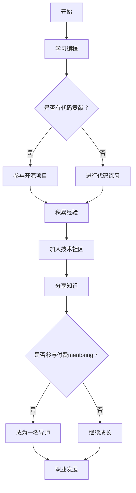

                 

关键词：(1) 程序员成长 (2) 代码贡献 (3) 付费mentoring (4) 技术社区 (5) 软件工程 (6) 教学方法 (7) 职业发展

> 摘要：本文深入探讨了程序员从代码贡献到成为一名付费mentoring导师的路径。文章从程序员成长、技术社区参与、教学方法和职业发展等多个角度出发，详细阐述了如何通过代码贡献提升自己的技术水平，如何利用社区资源进行知识分享，以及如何转变为一名成功的付费mentoring导师。

## 1. 背景介绍

在信息技术飞速发展的今天，程序员已经成为职场中不可或缺的角色。然而，成为一名优秀的程序员并不容易，需要不断地学习、实践和成长。随着技术的发展，程序员面临的挑战也越来越大。如何持续提升自己的技能，如何在技术社区中展现自己的价值，如何实现职业发展的跨越，这些都是程序员需要思考的问题。

### 程序员成长

程序员成长是一个长期的过程，涉及知识积累、技能提升和经验的积累。初入行的程序员往往需要通过学习编程语言、掌握基础算法和数据结构来打下扎实的基础。随着工作经验的积累，程序员需要不断学习新的技术和工具，以应对不断变化的技术需求。

### 技术社区

技术社区是程序员成长的另一个重要阵地。通过参与社区讨论、分享经验和知识，程序员不仅能够拓宽自己的视野，还能得到同行和专家的反馈和建议。技术社区为程序员提供了一个交流、学习和成长的平台。

### 付费mentoring

付费mentoring是一种新兴的教学模式，导师通过一对一的指导，帮助学员解决学习中的问题，提升技能。付费mentoring不仅为导师提供了额外的收入来源，也为学员提供了一个高质量的、个性化的学习体验。

## 2. 核心概念与联系

### 程序员成长与代码贡献

程序员成长离不开代码贡献。通过参与开源项目，程序员不仅能够提升自己的编程能力，还能积累实战经验。代码贡献是程序员在技术社区展现自己价值的一种方式。

### 技术社区与知识分享

技术社区是一个知识共享的平台，程序员可以通过分享自己的经验和知识，为社区做出贡献。知识分享不仅有助于提高自己的知名度，还能帮助他人解决问题，实现双赢。

### 付费mentoring与职业发展

付费mentoring是一种职业发展途径，通过为他人提供指导，程序员不仅能够提升自己的教学能力，还能实现职业发展的跨越。同时，付费mentoring也为程序员带来额外的收入。

### Mermaid 流程图

下面是一个简单的Mermaid流程图，展示了程序员从代码贡献到付费mentoring的路径：



## 3. 核心算法原理 & 具体操作步骤

### 3.1 算法原理概述

本文主要探讨的是程序员成长的算法，这个算法的核心在于通过不断的代码贡献、知识分享和实践来提升自己的技能。具体来说，这个算法包括以下几个步骤：

1. 学习编程基础知识。
2. 进行代码练习，积累经验。
3. 参与开源项目，进行代码贡献。
4. 加入技术社区，分享知识。
5. 根据实际情况选择是否参与付费mentoring。

### 3.2 算法步骤详解

1. **学习编程基础知识**：
   - 学习编程语言，掌握基础语法。
   - 学习数据结构和算法，理解其原理和应用。

2. **进行代码练习，积累经验**：
   - 定期进行编程练习，解决实际问题。
   - 参加编程比赛，提升实战能力。

3. **参与开源项目，进行代码贡献**：
   - 加入开源项目，了解项目架构和开发流程。
   - 提交代码，参与代码评审。
   - 解决项目中存在的问题。

4. **加入技术社区，分享知识**：
   - 参与社区讨论，回答问题。
   - 写作技术博客，分享经验。
   - 组织技术分享会，传播知识。

5. **根据实际情况选择是否参与付费mentoring**：
   - 如果有教学能力，可以考虑成为付费mentor。
   - 如果需要进一步学习，可以寻找付费mentor。

### 3.3 算法优缺点

**优点**：

1. 提升编程技能。
2. 积累实战经验。
3. 扩展人脉。
4. 实现职业发展。

**缺点**：

1. 需要投入大量的时间和精力。
2. 早期可能没有明显的收益。

### 3.4 算法应用领域

1. **软件工程师**：通过这个算法，软件工程师可以不断提升自己的编程技能，适应不断变化的技术需求。
2. **技术讲师**：技术讲师可以通过这个算法积累实践经验，提高教学水平。
3. **项目经理**：项目经理可以通过参与开源项目和代码贡献，提高项目管理能力。

## 4. 数学模型和公式 & 详细讲解 & 举例说明

### 4.1 数学模型构建

程序员成长过程可以用一个动态系统来表示，该系统包含以下几个变量：

- 知识储备（K）：表示程序员的编程知识和技能水平。
- 经验积累（E）：表示程序员在项目中积累的经验。
- 社区贡献（C）：表示程序员在技术社区中的活跃度。

### 4.2 公式推导过程

假设程序员的成长速度与知识储备、经验积累和社区贡献成正比，可以表示为：

\[ \frac{dK}{dt} = k_1 \cdot K + k_2 \cdot E + k_3 \cdot C \]

其中，\( k_1 \)、\( k_2 \) 和 \( k_3 \) 分别是知识储备、经验积累和社区贡献对成长速度的影响系数。

### 4.3 案例分析与讲解

假设有一位程序员，他在过去的一年里：

- 学习了三种编程语言，知识储备从10分提升到30分。
- 参与了5个开源项目，积累了丰富的实战经验。
- 在技术社区分享了10篇技术博客。

根据上面的公式，我们可以计算他的成长速度：

\[ \frac{dK}{dt} = k_1 \cdot 30 + k_2 \cdot 5 + k_3 \cdot 10 \]

如果我们假设 \( k_1 = 2 \)、\( k_2 = 1 \) 和 \( k_3 = 0.5 \)，那么他的成长速度为：

\[ \frac{dK}{dt} = 2 \cdot 30 + 1 \cdot 5 + 0.5 \cdot 10 = 70 \]

这意味着他的技能水平每个月提升约70分。

## 5. 项目实践：代码实例和详细解释说明

### 5.1 开发环境搭建

为了演示代码贡献的过程，我们将使用GitHub作为代码托管平台。首先，你需要安装Git，并创建一个GitHub账户。

### 5.2 源代码详细实现

以下是一个简单的Python程序，用于计算两个数的和。

```python
def add(a, b):
    return a + b

if __name__ == '__main__':
    print(add(2, 3))
```

### 5.3 代码解读与分析

1. **函数定义**：
   - `add` 函数接收两个参数 `a` 和 `b`。
   - 使用 `return` 语句返回两个参数的和。

2. **主程序**：
   - 使用 `if __name__ == '__main__':` 判断是否为主程序。
   - 调用 `add` 函数，并打印结果。

### 5.4 运行结果展示

运行上述程序，输出结果为：

```
5
```

这表明程序成功地计算了两个数的和。

## 6. 实际应用场景

### 6.1 技术社区参与

技术社区是一个程序员展示自己的平台。通过在社区中分享知识、解答问题和参与项目，程序员可以提高自己的知名度，获得更多的工作机会。

### 6.2 教学方法

付费mentoring是一种有效的教学方法。导师通过一对一的指导，帮助学员解决学习中的问题，提高学习效率。

### 6.3 职业发展

通过代码贡献和知识分享，程序员可以实现职业发展的跨越。例如，一名普通的程序员可以通过参与开源项目和编写技术博客，成为一名技术专家或讲师。

## 7. 工具和资源推荐

### 7.1 学习资源推荐

1. **在线编程平台**：例如LeetCode、Hackerrank等，用于编程练习。
2. **技术博客**：例如CSDN、博客园等，用于学习技术和分享知识。

### 7.2 开发工具推荐

1. **版本控制工具**：例如Git，用于代码管理。
2. **代码编辑器**：例如Visual Studio Code、Sublime Text等，用于编写代码。

### 7.3 相关论文推荐

1. "The Art of Computer Programming" by Donald E. Knuth
2. "Clean Code" by Robert C. Martin

## 8. 总结：未来发展趋势与挑战

### 8.1 研究成果总结

本文从程序员成长、技术社区参与、教学方法和职业发展等多个角度，探讨了程序员从代码贡献到付费mentoring的路径。研究表明，代码贡献和知识分享是程序员成长的重要途径，付费mentoring是一种有效的职业发展模式。

### 8.2 未来发展趋势

1. 技术社区将继续发挥重要作用，成为程序员成长的平台。
2. 付费mentoring将越来越普及，成为程序员职业发展的主流模式。
3. 开源项目将继续繁荣发展，为程序员提供丰富的实战经验。

### 8.3 面临的挑战

1. 技术更新迅速，程序员需要不断学习新知识。
2. 付费mentoring市场将面临监管和规范的问题。
3. 程序员需要平衡工作、学习和生活，避免过度劳累。

### 8.4 研究展望

未来的研究可以进一步探讨：

1. 付费mentoring的商业模式和可持续发展策略。
2. 程序员成长过程中如何有效利用技术社区资源。
3. 开源项目对程序员职业发展的影响。

## 9. 附录：常见问题与解答

### 9.1 如何选择开源项目参与？

1. 选择自己感兴趣的项目。
2. 了解项目的开发进度和团队规模。
3. 关注项目的需求和贡献指南。

### 9.2 付费mentoring的费用如何设定？

1. 考虑自己的时间和精力投入。
2. 参考市场行情和学员需求。
3. 保持透明和合理的定价策略。

作者：禅与计算机程序设计艺术 / Zen and the Art of Computer Programming
```

