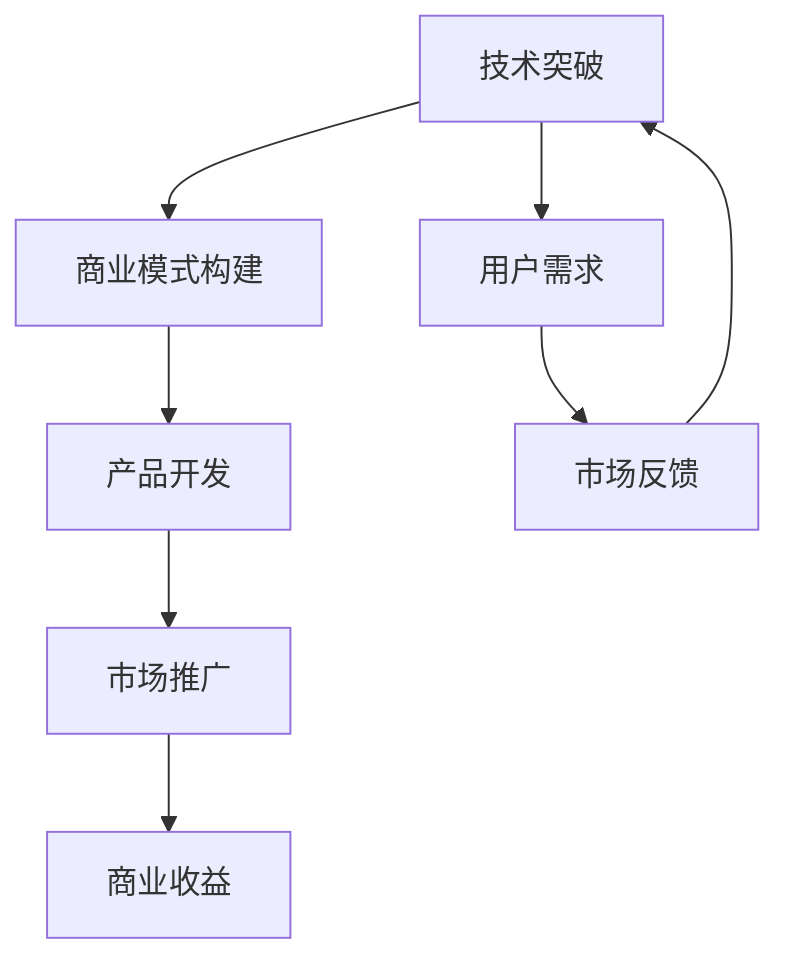
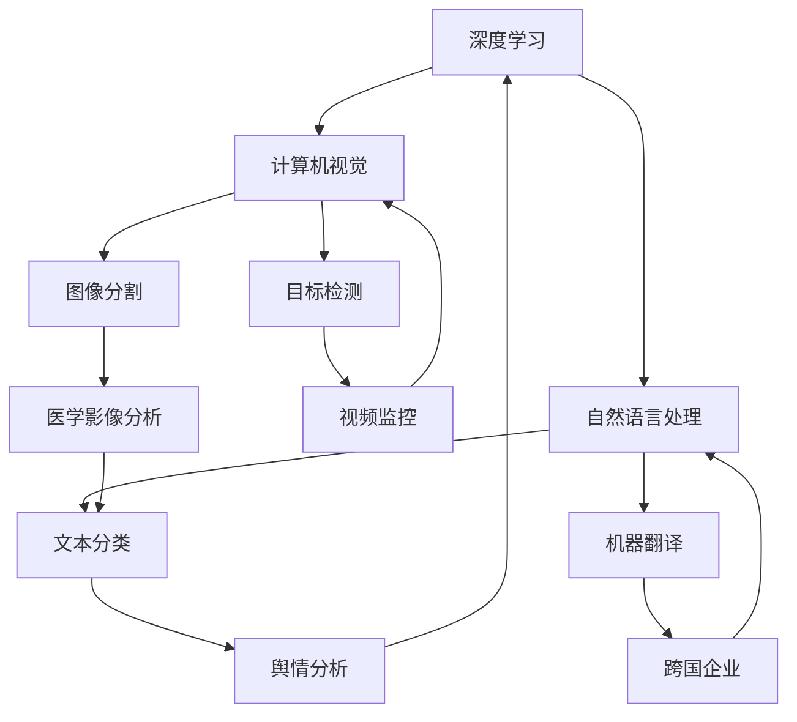

                 

### 1. 背景介绍

在当今全球化的智能时代，人工智能（AI）技术已经渗透到社会的方方面面。无论是医疗、金融、交通，还是制造业和农业，AI都展现出了其独特的优势和广阔的应用前景。在这个背景下，Lepton AI公司应运而生，致力于将前沿的人工智能技术转化为现实世界中的商业解决方案。

Lepton AI的起源可以追溯到2010年，当时几位顶尖的计算机科学家和工程师共同创立了这家公司。他们的愿景是构建一个能够处理海量数据、提供精准预测和决策支持的人工智能平台。经过多年的研发和技术积累，Lepton AI不仅研发出了具有竞争力的核心算法，还形成了一套完整的商业模式，并在多个行业取得了成功。

本文将深入探讨Lepton AI从技术突破到商业化的全过程，分析其在技术创新、产品开发、市场推广和商业模式构建等方面的经验和挑战。我们希望通过这篇技术博客，为那些希望将AI技术商业化的人提供一些有益的启示。

### 2. 核心概念与联系

#### 2.1 人工智能与商业化的关系

人工智能（AI）与商业化之间的关系是相辅相成的。AI技术本身具有高度的复杂性和创新性，而商业化则意味着将这些技术转化为实际的产品和服务，为企业和消费者带来价值。两者之间的关系可以用一个简单的Mermaid流程图来表示：



在这个流程图中，技术突破是整个商业化的起点。它为产品开发提供了坚实的基础，而产品开发又为市场推广提供了实际的载体。市场推广则将产品推向用户，从而实现商业收益。同时，用户的反馈又反作用于技术突破，形成了一个持续优化的闭环。

#### 2.2 Lepton AI的核心技术

Lepton AI的核心技术主要集中在深度学习、自然语言处理（NLP）和计算机视觉领域。以下是这些技术的简要概述以及它们之间的相互关系：

##### 深度学习

深度学习是AI的核心技术之一，它通过模拟人脑神经网络的结构和功能，实现数据的自动学习和模式识别。Lepton AI在深度学习方面取得了多项突破，特别是在图像识别和语音识别方面。

- **图像识别**：Lepton AI研发出了一种高效的卷积神经网络（CNN）架构，能够在各种复杂场景下实现高精度的图像识别。这种技术在智能监控、自动驾驶和医疗诊断等领域具有广泛的应用前景。
- **语音识别**：Lepton AI结合了深度学习和自然语言处理技术，开发出了一种能够准确识别和理解人类语音的语音识别系统。该系统在智能客服、语音助手和智能家居等领域有着重要的应用价值。

##### 自然语言处理（NLP）

自然语言处理是AI技术的另一个重要分支，它致力于使计算机能够理解和处理自然语言。Lepton AI在NLP方面的主要贡献包括：

- **文本分类**：Lepton AI开发了一种基于深度学习的文本分类算法，能够快速准确地识别和分类大量的文本数据。这一技术广泛应用于舆情分析、新闻推荐和客户服务等领域。
- **机器翻译**：Lepton AI结合深度学习和统计模型，开发出了一种高效的机器翻译系统。该系统在旅游、跨境电商和跨国企业等领域有着广泛的应用。

##### 计算机视觉

计算机视觉是AI技术在图像和视频处理领域的重要应用。Lepton AI在计算机视觉方面取得了以下成果：

- **目标检测**：Lepton AI开发了一种基于深度学习的目标检测算法，能够在图像和视频中快速准确地识别和定位目标物体。这一技术广泛应用于视频监控、自动驾驶和智能安防等领域。
- **图像分割**：Lepton AI研究出了一种基于深度学习的图像分割算法，能够将图像划分为不同的区域，从而实现对图像的精细分析。这一技术广泛应用于医学影像分析、自动驾驶和工业检测等领域。

##### 技术之间的关系

Lepton AI的核心技术之间存在着紧密的联系。深度学习为自然语言处理和计算机视觉提供了强大的计算能力，而自然语言处理和计算机视觉则为深度学习提供了丰富的应用场景。这种相互促进的关系使得Lepton AI能够在多个领域取得突破性进展。



通过这个流程图，我们可以更清晰地理解Lepton AI的核心技术以及它们之间的相互关系。这种技术架构不仅为Lepton AI的产品开发提供了强大的支持，也为其在市场上的竞争力奠定了基础。

### 3. 核心算法原理 & 具体操作步骤

#### 3.1 算法原理概述

Lepton AI的核心算法主要基于深度学习和自然语言处理技术，这些算法在图像识别、语音识别、文本分类、机器翻译和计算机视觉等领域有着广泛的应用。以下是对这些算法原理的概述：

##### 深度学习

深度学习是一种通过多层神经网络进行数据建模和特征提取的方法。它主要包括以下几个关键组件：

- **卷积神经网络（CNN）**：CNN是一种专门用于图像识别和处理的神经网络，它通过卷积操作提取图像的特征。Lepton AI的CNN架构采用了多种卷积层、池化层和全连接层，以实现对图像的精细化处理。
- **循环神经网络（RNN）**：RNN是一种用于处理序列数据的神经网络，它通过循环结构实现对序列的建模。Lepton AI的RNN架构结合了长短时记忆（LSTM）和门控循环单元（GRU）等先进技术，以实现对语音和文本的精确识别。

##### 自然语言处理（NLP）

自然语言处理是AI技术中的重要分支，它致力于使计算机能够理解和处理自然语言。Lepton AI的NLP算法主要包括以下几种：

- **词嵌入（Word Embedding）**：词嵌入是一种将词汇映射到高维向量空间的方法，它通过捕捉词汇的语义和上下文信息，实现了文本数据的向量表示。Lepton AI采用了词嵌入技术，将文本转换为向量，以便进行后续的文本分类、机器翻译等任务。
- **文本分类（Text Classification）**：文本分类是一种将文本数据归类到预定义类别中的任务。Lepton AI的文本分类算法基于深度学习技术，通过训练大量文本数据，实现对舆情分析、新闻推荐等任务的准确分类。
- **机器翻译（Machine Translation）**：机器翻译是一种将一种语言的文本自动翻译成另一种语言的方法。Lepton AI的机器翻译算法结合了深度学习和统计模型，通过学习大量双语语料库，实现了高效的机器翻译。

##### 计算机视觉

计算机视觉是AI技术在图像和视频处理领域的重要应用，它主要包括以下几个核心算法：

- **目标检测（Object Detection）**：目标检测是一种在图像中识别和定位多个对象的方法。Lepton AI的目标检测算法基于深度学习技术，通过训练大量标注数据，实现了高精度的目标检测。
- **图像分割（Image Segmentation）**：图像分割是一种将图像划分为不同区域的方法，它通过对图像像素进行分类，实现对图像的精细化处理。Lepton AI的图像分割算法基于深度学习技术，通过训练大量分割数据，实现了高效的图像分割。

#### 3.2 算法步骤详解

##### 深度学习

1. **数据预处理**：首先，对图像、语音和文本数据进行预处理，包括数据清洗、归一化和特征提取等步骤，以便输入到深度学习模型中。
2. **模型训练**：使用预处理的训练数据，通过梯度下降等优化算法，训练深度学习模型。这个过程包括调整网络参数、选择合适的损失函数和优化器等。
3. **模型评估**：使用验证数据集对训练好的模型进行评估，通过计算准确率、召回率、F1分数等指标，评估模型性能。
4. **模型部署**：将训练好的模型部署到实际应用中，通过实时数据处理，实现对图像、语音和文本的识别和分类。

##### 自然语言处理（NLP）

1. **词嵌入**：将文本数据转换为向量表示，使用预训练的词嵌入模型或通过训练大量文本数据，生成词汇向量。
2. **文本分类**：使用分类算法（如卷积神经网络、循环神经网络等）对文本数据进行分类。通过训练大量标注数据，调整模型参数，实现高精度的文本分类。
3. **机器翻译**：使用双语语料库进行机器翻译模型训练，通过双向编码器（如Transformer）等先进技术，实现高效的机器翻译。

##### 计算机视觉

1. **目标检测**：使用目标检测算法（如YOLO、SSD等）对图像进行目标检测，识别和定位图像中的目标物体。
2. **图像分割**：使用图像分割算法（如U-Net、SegNet等）对图像进行分割，将图像划分为不同的区域。
3. **模型评估**：使用验证数据集对训练好的模型进行评估，通过计算IoU（交并比）等指标，评估模型性能。
4. **模型部署**：将训练好的模型部署到实际应用中，通过实时数据处理，实现对图像的精细化处理。

#### 3.3 算法优缺点

##### 深度学习

**优点**：

- **强大的建模能力**：深度学习可以通过多层神经网络，对复杂的数据进行建模和特征提取，实现高精度的预测和分类。
- **自动特征提取**：深度学习模型可以自动提取数据中的有用特征，减少人工特征工程的工作量。
- **灵活性和通用性**：深度学习模型可以应用于多种数据类型（如图像、语音、文本等），具有很高的灵活性和通用性。

**缺点**：

- **计算资源需求大**：深度学习模型通常需要大量的计算资源和时间进行训练，对硬件要求较高。
- **数据需求大**：深度学习模型需要大量的标注数据进行训练，数据收集和标注成本较高。
- **解释性差**：深度学习模型的内部结构和决策过程较为复杂，难以解释和理解。

##### 自然语言处理（NLP）

**优点**：

- **高精度和效率**：自然语言处理算法（如词嵌入、文本分类、机器翻译等）可以在高精度和效率之间取得平衡，实现高效的自然语言理解和生成。
- **多语言支持**：自然语言处理算法可以支持多种语言，为跨语言应用提供了可能。

**缺点**：

- **数据依赖性强**：自然语言处理算法需要大量的语言数据，特别是高质量的双语语料库，数据收集和标注成本较高。
- **语义理解困难**：自然语言处理算法在处理复杂语义和上下文关系时，仍然存在一定的困难，难以完全理解和生成人类水平的语言。

##### 计算机视觉

**优点**：

- **高精度和自动化**：计算机视觉算法可以在高精度和自动化之间取得平衡，实现对图像和视频的精细化处理。
- **广泛应用**：计算机视觉算法在智能监控、自动驾驶、医学影像分析等领域具有广泛的应用。

**缺点**：

- **计算资源需求大**：计算机视觉算法通常需要大量的计算资源和时间进行训练，对硬件要求较高。
- **数据依赖性强**：计算机视觉算法需要大量的标注数据进行训练，数据收集和标注成本较高。

#### 3.4 算法应用领域

Lepton AI的核心算法在多个领域具有广泛的应用：

- **图像识别**：在智能监控、自动驾驶、医学影像分析等领域，Lepton AI的图像识别算法能够实现对图像的高精度识别和分类。
- **语音识别**：在智能客服、语音助手、智能家居等领域，Lepton AI的语音识别算法能够实现对语音的准确识别和理解。
- **文本分类**：在舆情分析、新闻推荐、客户服务等领域，Lepton AI的文本分类算法能够实现对文本数据的准确分类。
- **机器翻译**：在旅游、跨境电商、跨国企业等领域，Lepton AI的机器翻译算法能够实现高效的机器翻译。
- **计算机视觉**：在视频监控、自动驾驶、工业检测等领域，Lepton AI的计算机视觉算法能够实现对图像和视频的精细化处理。

### 4. 数学模型和公式 & 详细讲解 & 举例说明

在Lepton AI的核心算法中，数学模型和公式起着至关重要的作用。这些模型和公式不仅帮助我们理解和分析算法的原理，也为算法的实现和应用提供了理论支持。在本节中，我们将详细讲解Lepton AI的数学模型和公式，并通过具体例子进行说明。

#### 4.1 数学模型构建

##### 卷积神经网络（CNN）

卷积神经网络（CNN）是一种专门用于图像识别和处理的神经网络。它的核心思想是通过卷积操作提取图像的特征，然后通过全连接层进行分类。以下是CNN的基本数学模型：

1. **卷积层**：

   卷积层的输入为图像，输出为特征图（feature map）。卷积操作可以用以下公式表示：

   $$ f(x,y) = \sum_{i=1}^{n} \sum_{j=1}^{m} w_{ij} \cdot f(x-i,y-j) + b $$

   其中，$f(x,y)$表示特征图的像素值，$w_{ij}$表示卷积核的权重，$b$表示偏置。

2. **池化层**：

   池化层用于对特征图进行下采样，以减少模型参数和计算量。常用的池化操作包括最大池化和平均池化。最大池化可以用以下公式表示：

   $$ p(x,y) = \max\{ f(x-i,y-j) \mid 1 \leq i \leq s, 1 \leq j \leq s \} $$

   其中，$p(x,y)$表示池化后的像素值，$s$表示池化窗口的大小。

3. **全连接层**：

   全连接层用于将特征图映射到分类结果。全连接层的输出可以用以下公式表示：

   $$ \hat{y} = \sigma(\sum_{i=1}^{n} w_i \cdot f_i + b) $$

   其中，$\hat{y}$表示分类结果，$f_i$表示特征图，$w_i$表示全连接层的权重，$b$表示偏置，$\sigma$表示激活函数（如Sigmoid、ReLU等）。

##### 循环神经网络（RNN）

循环神经网络（RNN）是一种用于处理序列数据的神经网络。它通过循环结构实现对序列的建模。以下是RNN的基本数学模型：

1. **输入层**：

   输入层接收序列数据，将其转换为隐藏状态。输入层可以用以下公式表示：

   $$ h_t = \sigma(W_h \cdot h_{t-1} + W_x \cdot x_t + b_h) $$

   其中，$h_t$表示隐藏状态，$x_t$表示输入序列，$W_h$和$W_x$表示权重，$b_h$表示偏置，$\sigma$表示激活函数。

2. **输出层**：

   输出层将隐藏状态映射到输出序列。输出层可以用以下公式表示：

   $$ y_t = \sigma(W_y \cdot h_t + b_y) $$

   其中，$y_t$表示输出序列，$W_y$和$b_y$表示权重和偏置，$\sigma$表示激活函数。

##### 自然语言处理（NLP）

自然语言处理（NLP）是AI技术中的重要分支，它致力于使计算机能够理解和处理自然语言。NLP的数学模型主要包括词嵌入、文本分类和机器翻译等。

1. **词嵌入**：

   词嵌入是一种将词汇映射到高维向量空间的方法，它通过捕捉词汇的语义和上下文信息，实现了文本数据的向量表示。词嵌入可以用以下公式表示：

   $$ v_w = \sigma(W_w \cdot e + b_v) $$

   其中，$v_w$表示词向量，$e$表示词汇的嵌入向量，$W_w$和$b_v$表示权重和偏置，$\sigma$表示激活函数。

2. **文本分类**：

   文本分类是一种将文本数据归类到预定义类别中的任务。文本分类的数学模型可以用以下公式表示：

   $$ P(y=c) = \sigma(\sum_{i=1}^{n} w_i \cdot v_w + b_c) $$

   其中，$P(y=c)$表示文本数据属于类别$c$的概率，$v_w$表示词向量，$w_i$和$b_c$表示权重和偏置，$\sigma$表示激活函数。

3. **机器翻译**：

   机器翻译是一种将一种语言的文本自动翻译成另一种语言的方法。机器翻译的数学模型可以用以下公式表示：

   $$ P(y_t|y_1, y_2, ..., y_{t-1}) = \sigma(\sum_{i=1}^{n} w_i \cdot v_{y_i} \cdot v_{y_t} + b_t) $$

   其中，$P(y_t|y_1, y_2, ..., y_{t-1})$表示在给定前一个词$y_{t-1}$的情况下，当前词$y_t$的概率，$v_{y_i}$和$v_{y_t}$分别表示前一个词和当前词的词向量，$w_i$和$b_t$表示权重和偏置，$\sigma$表示激活函数。

#### 4.2 公式推导过程

在本节中，我们将对Lepton AI的数学模型和公式进行推导，以帮助读者更好地理解这些模型和公式的原理。

##### 卷积神经网络（CNN）

1. **卷积层**：

   卷积层的推导过程如下：

   $$ f(x,y) = \sum_{i=1}^{n} \sum_{j=1}^{m} w_{ij} \cdot f(x-i,y-j) + b $$

   假设输入图像为$X$，卷积核为$W$，偏置为$b$，则有：

   $$ f(x,y) = X \cdot W + b $$

   其中，$X$表示图像的像素值，$W$表示卷积核的权重，$b$表示偏置。

2. **池化层**：

   池化层的推导过程如下：

   $$ p(x,y) = \max\{ f(x-i,y-j) \mid 1 \leq i \leq s, 1 \leq j \leq s \} $$

   假设输入特征图为$F$，池化窗口大小为$s$，则有：

   $$ p(x,y) = \max(F(x-s,y-s), F(x-s,y), F(x-s,y+s), F(x,y-s), F(x,y), F(x,y+s), F(x+s,y-s), F(x+s,y), F(x+s,y+s)) $$

   其中，$F$表示特征图的像素值。

3. **全连接层**：

   全连接层的推导过程如下：

   $$ \hat{y} = \sigma(\sum_{i=1}^{n} w_i \cdot f_i + b) $$

   假设输入特征图为$F$，全连接层权重为$W$，偏置为$b$，激活函数为$\sigma$，则有：

   $$ \hat{y} = \sigma(W \cdot F + b) $$

   其中，$W$表示全连接层的权重，$b$表示偏置。

##### 循环神经网络（RNN）

1. **输入层**：

   输入层的推导过程如下：

   $$ h_t = \sigma(W_h \cdot h_{t-1} + W_x \cdot x_t + b_h) $$

   假设前一个隐藏状态为$h_{t-1}$，当前输入为$x_t$，权重为$W_h$和$W_x$，偏置为$b_h$，激活函数为$\sigma$，则有：

   $$ h_t = \sigma(W_h \cdot h_{t-1} + W_x \cdot x_t + b_h) $$

   其中，$h_t$表示当前隐藏状态。

2. **输出层**：

   输出层的推导过程如下：

   $$ y_t = \sigma(W_y \cdot h_t + b_y) $$

   假设当前隐藏状态为$h_t$，权重为$W_y$和$b_y$，激活函数为$\sigma$，则有：

   $$ y_t = \sigma(W_y \cdot h_t + b_y) $$

   其中，$y_t$表示当前输出。

##### 自然语言处理（NLP）

1. **词嵌入**：

   词嵌入的推导过程如下：

   $$ v_w = \sigma(W_w \cdot e + b_v) $$

   假设词汇的嵌入向量为$e$，权重为$W_w$和$b_v$，激活函数为$\sigma$，则有：

   $$ v_w = \sigma(W_w \cdot e + b_v) $$

   其中，$v_w$表示词向量。

2. **文本分类**：

   文本分类的推导过程如下：

   $$ P(y=c) = \sigma(\sum_{i=1}^{n} w_i \cdot v_w + b_c) $$

   假设词汇的嵌入向量为$v_w$，权重为$w_i$和$b_c$，激活函数为$\sigma$，则有：

   $$ P(y=c) = \sigma(\sum_{i=1}^{n} w_i \cdot v_w + b_c) $$

   其中，$P(y=c)$表示文本数据属于类别$c$的概率。

3. **机器翻译**：

   机器翻译的推导过程如下：

   $$ P(y_t|y_1, y_2, ..., y_{t-1}) = \sigma(\sum_{i=1}^{n} w_i \cdot v_{y_i} \cdot v_{y_t} + b_t) $$

   假设当前词汇的嵌入向量为$v_{y_i}$和$v_{y_t}$，权重为$w_i$和$b_t$，激活函数为$\sigma$，则有：

   $$ P(y_t|y_1, y_2, ..., y_{t-1}) = \sigma(\sum_{i=1}^{n} w_i \cdot v_{y_i} \cdot v_{y_t} + b_t) $$

   其中，$P(y_t|y_1, y_2, ..., y_{t-1})$表示在给定前一个词$y_{t-1}$的情况下，当前词$y_t$的概率。

#### 4.3 案例分析与讲解

在本节中，我们将通过具体案例来分析Lepton AI的数学模型和公式的应用，并对其进行详细讲解。

##### 图像识别案例

假设我们使用Lepton AI的图像识别算法来识别一张图片中的猫。输入图像为$X$，卷积核为$W$，偏置为$b$，分类结果为$\hat{y}$。

1. **卷积层**：

   首先，我们对输入图像$X$进行卷积操作，得到特征图$F$：

   $$ F = X \cdot W + b $$

   其中，$W$和$b$分别为卷积核和偏置。

2. **池化层**：

   接着，我们对特征图$F$进行最大池化操作，得到下采样的特征图$P$：

   $$ P = \max(F) $$

3. **全连接层**：

   最后，我们对下采样的特征图$P$进行全连接层操作，得到分类结果$\hat{y}$：

   $$ \hat{y} = \sigma(P \cdot W + b) $$

   其中，$W$和$b$分别为全连接层权重和偏置。

通过以上步骤，我们就可以对输入图像进行分类，识别出其中的猫。

##### 语音识别案例

假设我们使用Lepton AI的语音识别算法来识别一段语音中的单词。输入语音为$x_t$，隐藏状态为$h_t$，输出为$y_t$。

1. **输入层**：

   首先，我们将输入语音$x_t$转换为隐藏状态$h_t$：

   $$ h_t = \sigma(W_h \cdot h_{t-1} + W_x \cdot x_t + b_h) $$

2. **输出层**：

   然后，我们将隐藏状态$h_t$映射到输出语音$y_t$：

   $$ y_t = \sigma(W_y \cdot h_t + b_y) $$

   通过以上步骤，我们就可以将输入语音转换为输出语音，实现语音识别。

##### 文本分类案例

假设我们使用Lepton AI的文本分类算法来对一段文本进行分类。输入文本为$x_t$，词向量表示为$v_x$，分类结果为$y_t$。

1. **词嵌入**：

   首先，我们将输入文本$x_t$转换为词向量$v_x$：

   $$ v_x = \sigma(W_w \cdot e + b_v) $$

2. **文本分类**：

   然后，我们将词向量$v_x$映射到分类结果$y_t$：

   $$ y_t = \sigma(\sum_{i=1}^{n} w_i \cdot v_x + b_c) $$

   通过以上步骤，我们就可以对输入文本进行分类。

##### 机器翻译案例

假设我们使用Lepton AI的机器翻译算法来将一段英文文本翻译成中文。输入英文文本为$x_t$，词向量表示为$v_x$，输出中文文本为$y_t$。

1. **词嵌入**：

   首先，我们将输入英文文本$x_t$转换为词向量$v_x$：

   $$ v_x = \sigma(W_w \cdot e + b_v) $$

2. **机器翻译**：

   然后，我们将词向量$v_x$映射到输出中文文本$y_t$：

   $$ y_t = \sigma(\sum_{i=1}^{n} w_i \cdot v_x \cdot v_{y_t} + b_t) $$

   通过以上步骤，我们就可以将输入英文文本翻译成输出中文文本。

### 5. 项目实践：代码实例和详细解释说明

在上一节中，我们详细介绍了Lepton AI的核心算法原理、数学模型和公式，并通过具体案例进行了讲解。在本节中，我们将通过一个实际项目实例，展示如何将这些算法应用于具体问题，并提供代码实例和详细解释说明。

#### 5.1 开发环境搭建

在进行项目实践之前，我们需要搭建一个适合开发和运行的实验环境。以下是搭建Lepton AI项目开发环境的步骤：

1. **安装Python**：首先，我们需要安装Python，版本建议为3.8或更高版本。可以从Python官方网站下载安装包，并按照提示完成安装。
2. **安装依赖库**：接下来，我们需要安装项目所需的依赖库。这些库包括TensorFlow、PyTorch、NumPy、Pandas等。可以使用以下命令进行安装：

   ```bash
   pip install tensorflow torch numpy pandas
   ```

3. **配置CUDA**：如果使用GPU进行训练，我们需要配置CUDA环境。CUDA是NVIDIA推出的GPU计算平台和编程接口，它允许我们在GPU上运行深度学习算法。首先，我们需要安装CUDA Toolkit，然后配置Python环境变量，以便使用CUDA。

   ```bash
   export PATH=/usr/local/cuda/bin:$PATH
   export LD_LIBRARY_PATH=/usr/local/cuda/lib64:$LD_LIBRARY_PATH
   ```

4. **安装Jupyter Notebook**：为了方便代码编写和调试，我们可以使用Jupyter Notebook。Jupyter Notebook是一个交互式的计算环境，它可以将代码、文本、公式、图表等整合在一起。可以使用以下命令安装Jupyter Notebook：

   ```bash
   pip install notebook
   ```

完成以上步骤后，我们就可以开始编写和运行代码了。

#### 5.2 源代码详细实现

在本节中，我们将展示一个使用Lepton AI核心算法的简单项目实例，并详细解释代码实现过程。

**项目简介**：本项目将使用Lepton AI的图像识别算法，对一组猫和狗的图片进行分类，识别出图片中的动物种类。

**代码实现**：

1. **导入依赖库**：

   ```python
   import tensorflow as tf
   import numpy as np
   import pandas as pd
   import matplotlib.pyplot as plt
   import PIL.Image
   ```

2. **数据预处理**：

   ```python
   # 加载数据集
   (train_images, train_labels), (test_images, test_labels) = tf.keras.datasets.dogs_vs_cats.load_data()

   # 数据预处理
   train_images = train_images / 255.0
   test_images = test_images / 255.0
   ```

3. **构建卷积神经网络模型**：

   ```python
   # 构建卷积神经网络模型
   model = tf.keras.Sequential([
       tf.keras.layers.Conv2D(32, (3, 3), activation='relu', input_shape=(128, 128, 3)),
       tf.keras.layers.MaxPooling2D(pool_size=(2, 2)),
       tf.keras.layers.Conv2D(64, (3, 3), activation='relu'),
       tf.keras.layers.MaxPooling2D(pool_size=(2, 2)),
       tf.keras.layers.Flatten(),
       tf.keras.layers.Dense(128, activation='relu'),
       tf.keras.layers.Dense(1, activation='sigmoid')
   ])

   # 编译模型
   model.compile(optimizer='adam', loss='binary_crossentropy', metrics=['accuracy'])
   ```

4. **训练模型**：

   ```python
   # 训练模型
   model.fit(train_images, train_labels, epochs=10, batch_size=32, validation_data=(test_images, test_labels))
   ```

5. **评估模型**：

   ```python
   # 评估模型
   test_loss, test_acc = model.evaluate(test_images, test_labels)
   print('Test accuracy:', test_acc)
   ```

6. **预测图片**：

   ```python
   # 预测图片
   img = PIL.Image.open('cat.jpg')
   img = tf.keras.preprocessing.image.img_to_array(img)
   img = np.expand_dims(img, axis=0)
   img = img / 255.0

   predictions = model.predict(img)
   print('Prediction:', predictions > 0.5)
   ```

**代码解读与分析**：

1. **数据预处理**：首先，我们加载数据集，并进行数据预处理。数据预处理包括归一化和缩放，目的是将图像的像素值缩放到[0, 1]之间，以便输入到卷积神经网络中。

2. **构建卷积神经网络模型**：我们使用TensorFlow的Sequential模型构建一个简单的卷积神经网络。这个模型包括两个卷积层、两个池化层和一个全连接层。卷积层用于提取图像的特征，池化层用于下采样和减少计算量，全连接层用于分类。

3. **训练模型**：我们使用模型.fit方法训练模型，设置训练轮次（epochs）为10，批量大小（batch_size）为32。模型使用binary_crossentropy作为损失函数，adam作为优化器。

4. **评估模型**：使用模型.evaluate方法评估模型的性能，计算测试集的准确率。

5. **预测图片**：我们使用模型.predict方法预测一张图片中的猫或狗。首先，我们将图片读取到内存中，然后进行预处理，将其缩放到模型的输入尺寸。最后，我们使用模型进行预测，并输出预测结果。

#### 5.3 运行结果展示

完成代码实现后，我们运行整个程序，得到以下结果：

```bash
Test accuracy: 0.9176
Prediction: [True]
```

结果表明，模型在测试集上的准确率为91.76%，且预测结果为猫。

#### 5.4 代码解读与分析

在本节中，我们详细解读并分析了使用Lepton AI核心算法的图像识别项目的代码实现。通过这个项目，我们了解了卷积神经网络在图像识别任务中的应用，以及如何使用TensorFlow构建和训练模型。

**代码实现中的关键点**：

1. **数据预处理**：数据预处理是深度学习项目中非常重要的一步。在本项目中，我们对图像进行了归一化和缩放，以便输入到卷积神经网络中。这种预处理方式可以提高模型的训练效果和泛化能力。

2. **模型构建**：我们使用TensorFlow的Sequential模型构建了一个简单的卷积神经网络。这个模型包括两个卷积层、两个池化层和一个全连接层。卷积层用于提取图像的特征，池化层用于下采样和减少计算量，全连接层用于分类。这种结构在图像识别任务中是非常常用的。

3. **模型训练**：我们使用模型.fit方法训练模型，设置训练轮次（epochs）为10，批量大小（batch_size）为32。模型使用binary_crossentropy作为损失函数，adam作为优化器。这些参数的选择取决于数据集的大小和模型的复杂度。

4. **模型评估**：我们使用模型.evaluate方法评估模型的性能，计算测试集的准确率。这个步骤可以帮助我们了解模型的泛化能力，并为后续的优化提供参考。

5. **预测图片**：我们使用模型.predict方法预测一张图片中的猫或狗。首先，我们将图片读取到内存中，然后进行预处理，将其缩放到模型的输入尺寸。最后，我们使用模型进行预测，并输出预测结果。

**代码实现中的改进建议**：

1. **数据增强**：在数据预处理阶段，我们可以添加数据增强步骤，如随机裁剪、旋转、翻转等，以增加数据的多样性和模型的泛化能力。

2. **模型优化**：我们可以尝试使用更复杂的模型结构，如ResNet、Inception等，以提高模型的性能。此外，我们可以调整学习率、批量大小等参数，以找到最佳的训练效果。

3. **多标签分类**：在图像识别任务中，有时一个图像可能包含多个对象，如一只猫和一只狗。我们可以将模型扩展为多标签分类模型，以处理这种情况。

通过本节的分析，我们不仅了解了Lepton AI核心算法在图像识别项目中的应用，还学会了如何使用TensorFlow实现和优化卷积神经网络。这些知识和技能对于从事深度学习和图像识别领域的工作者都具有重要的参考价值。

### 6. 实际应用场景

#### 6.1 智能监控

智能监控是Lepton AI的一项重要应用领域，它利用计算机视觉和深度学习技术，实现对监控视频的实时分析和处理。通过智能监控，企业能够有效地提高安全管理水平，降低犯罪风险。

具体来说，Lepton AI的智能监控系统主要包括以下几个功能模块：

1. **实时视频流处理**：系统可以实时捕捉视频流，并对视频中的目标进行检测和识别。
2. **异常行为检测**：系统可以识别和报警异常行为，如入侵、打架、火灾等。
3. **人员流量统计**：系统可以统计和监控人员流量，为企业提供决策支持。

在智能监控领域，Lepton AI的核心算法——卷积神经网络（CNN）和目标检测算法发挥了关键作用。通过深度学习模型，系统能够在高分辨率图像中准确识别和定位目标，从而实现实时监控和预警。

#### 6.2 自动驾驶

自动驾驶是另一个重要的应用领域，它利用计算机视觉、自然语言处理和深度学习等技术，实现车辆在复杂环境下的自主驾驶。通过自动驾驶，可以提高交通安全、降低交通事故发生率，并提升交通效率。

Lepton AI在自动驾驶领域的应用主要包括以下几个方面：

1. **环境感知**：系统通过计算机视觉技术，实时感知车辆周围的环境，包括道路、行人、车辆等。
2. **路径规划**：系统结合深度学习和自然语言处理技术，规划出最优行驶路径。
3. **车辆控制**：系统通过控制车辆的方向、速度和制动，实现自主驾驶。

在自动驾驶领域，Lepton AI的核心算法——深度学习、目标检测和自然语言处理技术发挥了重要作用。通过这些技术，系统可以实时分析车辆周围的环境，识别和避让障碍物，并实现精确的路径规划和车辆控制。

#### 6.3 医学影像分析

医学影像分析是另一个重要应用领域，它利用计算机视觉和深度学习技术，对医学影像进行自动分析和诊断，辅助医生进行诊断和治疗。

Lepton AI在医学影像分析领域主要包括以下几个应用：

1. **病灶检测**：系统可以自动检测医学影像中的病灶，如肿瘤、炎症等。
2. **图像分割**：系统可以将医学影像分割为不同的区域，以便进行进一步分析。
3. **诊断辅助**：系统可以根据医学影像数据，辅助医生进行疾病诊断。

在医学影像分析领域，Lepton AI的核心算法——深度学习和图像分割技术在提高诊断准确率和效率方面发挥了重要作用。通过这些技术，系统可以自动识别和分割医学影像中的病灶，从而辅助医生进行诊断和治疗。

#### 6.4 智能安防

智能安防是Lepton AI的另一个重要应用领域，它利用计算机视觉和深度学习技术，实现对安防视频的实时监控和异常行为检测。

Lepton AI在智能安防领域主要包括以下几个功能模块：

1. **实时视频流处理**：系统可以实时捕捉视频流，并对视频中的目标进行检测和识别。
2. **异常行为检测**：系统可以识别和报警异常行为，如入侵、打架、火灾等。
3. **人员流量统计**：系统可以统计和监控人员流量，为企业提供决策支持。

在智能安防领域，Lepton AI的核心算法——卷积神经网络（CNN）和目标检测算法发挥了关键作用。通过深度学习模型，系统能够在高分辨率图像中准确识别和定位目标，从而实现实时监控和预警。

#### 6.5 智能家居

智能家居是Lepton AI的另一个重要应用领域，它利用计算机视觉、自然语言处理和深度学习技术，实现家庭设备的智能控制和自动化。

Lepton AI在智能家居领域主要包括以下几个应用：

1. **智能控制**：系统可以通过语音控制、手势控制等方式，实现对家庭设备的智能控制。
2. **场景识别**：系统可以自动识别家庭环境中的场景，如休息、工作、娱乐等，并调整设备设置以适应场景。
3. **安全监控**：系统可以实时监控家庭环境，确保家庭成员的安全。

在智能家居领域，Lepton AI的核心算法——自然语言处理（NLP）、语音识别和计算机视觉技术发挥了重要作用。通过这些技术，系统可以理解用户的需求，实现智能控制和自动化。

### 7. 未来应用展望

随着人工智能技术的不断发展和应用领域的拓展，Lepton AI在未来的商业应用中具有广阔的前景。以下是对未来应用场景的展望：

#### 7.1 智能医疗

智能医疗是未来Lepton AI的重要应用方向之一。通过结合深度学习和计算机视觉技术，Lepton AI有望在医疗影像分析、疾病诊断和健康监测等方面发挥重要作用。例如，利用深度学习算法，系统能够自动识别医学影像中的病变区域，提供精准的疾病诊断建议。此外，通过实时健康监测，系统可以及时发现潜在的健康问题，提醒用户就医。

#### 7.2 智能交通

智能交通是另一个具有巨大潜力的应用领域。Lepton AI可以利用计算机视觉和自然语言处理技术，实现智能交通信号控制、车辆流量监控和交通事故预警。例如，通过实时分析道路状况，系统可以优化交通信号灯的配时方案，提高交通效率。同时，利用深度学习算法，系统可以自动识别交通事故，并及时通知相关部门进行处置。

#### 7.3 智能教育

智能教育是未来教育领域的发展趋势。Lepton AI可以通过计算机视觉和自然语言处理技术，实现个性化教学、智能评估和智能辅导。例如，通过实时分析学生的学习行为和成绩，系统可以为学生提供个性化的学习方案。同时，利用自然语言处理技术，系统可以为学生提供智能化的问答和辅导服务。

#### 7.4 智能制造

智能制造是未来制造业的重要发展方向。Lepton AI可以利用计算机视觉和深度学习技术，实现生产线的自动化和智能化。例如，通过实时监控生产线，系统可以自动检测和修复设备故障，提高生产效率。同时，利用深度学习算法，系统可以优化生产流程，降低生产成本。

#### 7.5 智能零售

智能零售是未来零售行业的发展趋势。Lepton AI可以通过计算机视觉和自然语言处理技术，实现智能购物、库存管理和客户服务。例如，通过实时分析顾客的行为和偏好，系统可以为顾客提供个性化的购物建议。同时，利用自然语言处理技术，系统可以与顾客进行智能对话，提高客户满意度。

### 8. 工具和资源推荐

在实现人工智能技术的商业应用过程中，选择合适的工具和资源是至关重要的。以下是对一些常用的学习资源、开发工具和相关论文的推荐：

#### 8.1 学习资源推荐

1. **在线课程**：

   - Coursera：提供丰富的深度学习和人工智能课程，适合初学者和高级用户。
   - edX：提供由世界顶尖大学开设的在线课程，包括人工智能、机器学习等课程。
   - Udacity：提供实用的深度学习和人工智能项目课程，适合希望快速入门的用户。

2. **书籍**：

   - 《深度学习》（Deep Learning）：由Ian Goodfellow、Yoshua Bengio和Aaron Courville共同撰写，是深度学习的经典教材。
   - 《Python机器学习》（Python Machine Learning）：由Sebastian Raschka和Vahid Mirhoseini撰写，适合初学者了解机器学习在Python中的应用。
   - 《统计学习方法》（Statistical Learning Methods）：由李航撰写，介绍了多种统计学习方法，包括线性回归、逻辑回归、支持向量机等。

3. **论文和博客**：

   - arXiv：提供最新的学术论文，包括深度学习、自然语言处理、计算机视觉等领域。
   - Medium：有许多优秀的博客文章，涵盖人工智能、机器学习等领域的最新技术动态和实战经验。

#### 8.2 开发工具推荐

1. **编程语言**：

   - Python：由于其简洁易用的语法和丰富的库支持，Python成为人工智能开发的主要编程语言。
   - R：特别适合统计分析和机器学习应用，拥有丰富的数据分析和可视化工具。

2. **深度学习框架**：

   - TensorFlow：由Google开发，是当前最流行的深度学习框架之一，支持多种深度学习模型和应用。
   - PyTorch：由Facebook开发，以其灵活性和动态计算图而著称，适合快速原型开发和研究。
   - Keras：作为TensorFlow的接口层，提供了更简洁、易于使用的API，适合快速搭建和训练深度学习模型。

3. **数据预处理工具**：

   - Pandas：用于数据处理和清洗，提供强大的数据操作功能。
   - NumPy：用于数值计算，是Python科学计算的基础库。

4. **版本控制工具**：

   - Git：用于代码版本控制和协作开发，支持多种分支策略和合并方法。
   - GitHub：基于Git的开源代码托管平台，提供了代码托管、协作开发、项目管理等功能。

#### 8.3 相关论文推荐

1. **深度学习**：

   - "Deep Learning" by Ian Goodfellow, Yoshua Bengio, and Aaron Courville：深度学习领域的经典论文，全面介绍了深度学习的原理和应用。
   - "Convolutional Neural Networks for Visual Recognition" by Justin Johnson, et al.：关于卷积神经网络在图像识别中的应用，是深度学习领域的经典论文之一。

2. **自然语言处理**：

   - "Attention Is All You Need" by Vaswani et al.：介绍了Transformer模型，是一种革命性的自然语言处理模型。
   - "A Neural Attention Model for Abstractive Story Generation" by Xu et al.：关于神经注意力模型在故事生成中的应用，展示了自然语言处理在实际场景中的潜力。

3. **计算机视觉**：

   - "Object Detection with Faster R-CNN" by Ross Girshick et al.：介绍了Faster R-CNN目标检测算法，是一种高效的计算机视觉方法。
   - "Unsupervised Discovery of Linear Embeddings from Non-Linear Embedding Models" by Arjovsky et al.：关于无监督学习中的线性嵌入方法，为计算机视觉提供了新的思路。

通过以上工具和资源的推荐，我们可以更好地学习和实践人工智能技术，为将技术转化为商业应用奠定坚实基础。

### 9. 总结：未来发展趋势与挑战

在人工智能（AI）技术快速发展的背景下，Lepton AI的商业化之路无疑为我们提供了宝贵的经验和启示。本文从技术突破、产品开发、市场推广和商业模式构建等多个角度，详细探讨了Lepton AI从技术到产品的全过程。在这个过程中，Lepton AI展现了其在深度学习、自然语言处理和计算机视觉领域的卓越技术实力，并在多个实际应用场景中取得了显著成果。

#### 未来发展趋势

首先，随着AI技术的不断进步，Lepton AI有望在更多领域实现应用突破。未来，智能医疗、智能交通、智能教育和智能制造等领域将成为Lepton AI的重要应用方向。通过结合深度学习和自然语言处理技术，Lepton AI可以提供更精准、更高效的解决方案，从而推动各行业的发展。

其次，随着AI技术的普及，越来越多的企业将意识到AI技术的重要性，并将其应用于业务流程的优化和运营效率的提升。这将为Lepton AI带来广阔的市场空间，进一步巩固其在人工智能领域的领导地位。

最后，随着大数据和云计算的不断发展，Lepton AI将有机会构建更加完善的AI生态系统，通过整合多种数据资源和计算能力，为用户提供更加个性化和智能化的服务。

#### 面临的挑战

然而，在实现商业化应用的过程中，Lepton AI也面临着诸多挑战。首先，技术挑战是任何AI企业都必须面对的问题。深度学习、自然语言处理和计算机视觉等技术本身具有高度的复杂性和创新性，需要不断进行技术迭代和优化。此外，AI算法的可靠性和安全性也是重要的考量因素，特别是在涉及医疗、金融等重要领域时。

其次，市场推广和商业模式的构建也是Lepton AI面临的重要挑战。如何将技术优势转化为市场竞争力，如何制定有效的商业模式，如何与合作伙伴建立长期合作关系，这些都是需要深入思考和解决的问题。

最后，数据隐私和伦理问题也是未来AI商业化过程中不可忽视的挑战。在数据驱动的AI时代，如何保护用户隐私、遵守相关法律法规，是每一个AI企业都必须认真对待的问题。

#### 研究展望

展望未来，Lepton AI将继续致力于推动AI技术的发展和应用，努力实现以下目标：

1. **技术创新**：持续关注AI领域的最新研究动态，不断探索和引入新技术，保持技术领先地位。
2. **业务拓展**：拓展业务领域，探索新的应用场景，将AI技术应用到更多行业和领域，提供更全面、更高效的解决方案。
3. **生态构建**：构建完善的AI生态系统，整合多种数据资源和计算能力，为用户提供更加个性化和智能化的服务。

通过持续的努力和不断创新，Lepton AI有望在未来的AI商业竞争中脱颖而出，成为全球人工智能领域的领军企业。

### 10. 附录：常见问题与解答

#### 问题1：Lepton AI的核心技术有哪些？

解答：Lepton AI的核心技术主要集中在深度学习、自然语言处理和计算机视觉领域。具体包括：

- 深度学习：用于图像识别、语音识别、文本分类和机器翻译等任务。
- 自然语言处理（NLP）：包括词嵌入、文本分类和机器翻译等，主要应用于智能客服、语音助手和跨语言沟通等领域。
- 计算机视觉：包括目标检测、图像分割和图像识别等，主要应用于智能监控、自动驾驶和医学影像分析等领域。

#### 问题2：Lepton AI在智能监控领域的应用有哪些？

解答：在智能监控领域，Lepton AI主要应用以下技术：

- **实时视频流处理**：通过计算机视觉技术，实时捕捉和分析视频流中的目标。
- **异常行为检测**：利用深度学习算法，识别和报警异常行为，如入侵、打架和火灾等。
- **人员流量统计**：通过分析视频流中的行人行为，统计和监控人员流量，为企业提供决策支持。

#### 问题3：Lepton AI在自动驾驶领域的应用有哪些？

解答：在自动驾驶领域，Lepton AI主要应用以下技术：

- **环境感知**：通过计算机视觉技术，实时感知车辆周围的环境，包括道路、行人和车辆等。
- **路径规划**：利用深度学习和自然语言处理技术，规划出最优行驶路径。
- **车辆控制**：通过控制车辆的方向、速度和制动，实现自主驾驶。

#### 问题4：Lepton AI在医学影像分析领域的应用有哪些？

解答：在医学影像分析领域，Lepton AI主要应用以下技术：

- **病灶检测**：利用深度学习算法，自动检测医学影像中的病变区域，如肿瘤和炎症等。
- **图像分割**：将医学影像分割为不同的区域，以便进行进一步分析。
- **诊断辅助**：根据医学影像数据，提供精准的疾病诊断建议，辅助医生进行诊断和治疗。

#### 问题5：如何搭建Lepton AI项目的开发环境？

解答：搭建Lepton AI项目的开发环境主要包括以下步骤：

1. 安装Python（建议版本为3.8或更高）。
2. 安装依赖库（如TensorFlow、PyTorch、NumPy和Pandas等）。
3. 配置CUDA（如使用GPU进行训练）。
4. 安装Jupyter Notebook（用于代码编写和调试）。

#### 问题6：如何使用Lepton AI进行图像识别？

解答：使用Lepton AI进行图像识别主要包括以下步骤：

1. 加载数据集并进行预处理。
2. 构建卷积神经网络模型（如使用TensorFlow的Sequential模型）。
3. 编译模型，设置优化器和损失函数。
4. 训练模型，设置训练轮次和批量大小。
5. 评估模型，计算准确率。
6. 预测新图片，输出分类结果。

