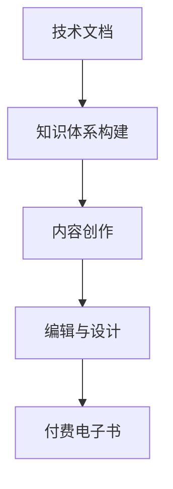
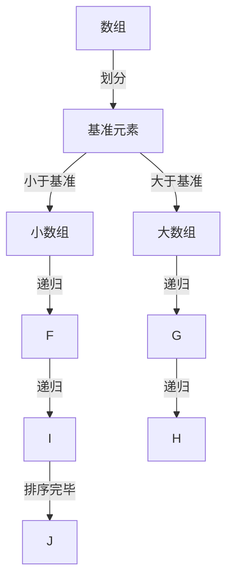

                 

关键词：技术文档，付费电子书，程序员，写作技巧，知识分享，电子出版

> 摘要：本文旨在探讨程序员如何将技术文档转化为高质量的付费电子书，分享写作经验、技巧和策略，为技术作者提供一条可行的职业发展之路。

## 1. 背景介绍

技术文档和付费电子书在IT领域扮演着重要角色。技术文档是程序员在日常工作中记录、分享知识和经验的重要工具，而付费电子书则为专业人士提供了系统化、深入的学习资源。然而，将技术文档转化为付费电子书并非易事，这需要程序员具备扎实的写作技能、丰富的知识储备和敏锐的市场洞察力。

本文将结合作者的实践经验，探讨程序员如何从技术文档出发，逐步提升写作能力，最终打造出受欢迎的付费电子书。本文将从以下几个方面展开：

1. 核心概念与联系
2. 核心算法原理与具体操作步骤
3. 数学模型与公式详细讲解
4. 项目实践：代码实例与详细解释
5. 实际应用场景与未来展望
6. 工具和资源推荐
7. 总结：未来发展趋势与挑战

通过本文的阅读，读者将了解技术文档到付费电子书的转化过程，掌握提升写作技能的方法，为自身的职业发展奠定坚实基础。

### 2. 核心概念与联系

在探讨技术文档到付费电子书的转化过程中，我们首先需要了解以下几个核心概念：

- **技术文档**：以程序员为主要受众，记录、分享技术知识和经验的文档。它通常包括开发指南、API文档、用户手册等。
- **付费电子书**：以电子文档形式发布的付费知识产品，通常以专业知识、技术教程为主，旨在为读者提供深度学习资源。
- **内容创作**：从技术文档到付费电子书的转化过程中，内容创作是核心环节。这包括选题、撰写、编辑、设计等多个步骤。

此外，以下两点值得注意：

- **知识体系构建**：技术文档通常是基于项目或模块来组织内容，而付费电子书则需要以知识体系为核心，系统性地呈现知识点。
- **市场需求分析**：在创作付费电子书前，了解市场需求、用户偏好和竞争态势至关重要。这将有助于确定书籍的主题、内容和形式。

为了更好地理解这些核心概念和联系，我们可以借助 Mermaid 流程图来展示技术文档到付费电子书转化的主要流程：



通过以上分析，我们可以看到技术文档到付费电子书的转化过程不仅需要技术能力，还需要内容创作和市场分析的能力。在接下来的章节中，我们将深入探讨这些方面，帮助程序员更好地实现这一转化。

### 3. 核心算法原理 & 具体操作步骤

在讨论技术文档到付费电子书的转化过程中，算法原理的讲解是至关重要的一环。一个清晰、易懂的算法讲解不仅能吸引读者，还能为书籍增加价值。接下来，我们将以常见的排序算法——快速排序为例，详细讲解其原理和具体操作步骤。

#### 3.1 算法原理概述

快速排序是一种高效的排序算法，基于分治策略。其基本思想是通过一个基准元素将数组分为两部分，一部分都比基准元素小，另一部分都比基准元素大。然后递归地对待分的小数组和大数据组进行快速排序，直到所有子数组都被排好序。

**算法原理图解**：



#### 3.2 算法步骤详解

**步骤 1**：选择基准元素

选择数组中的一个元素作为基准元素。通常，可以选择数组的第一个元素、最后一个元素或随机选择一个元素。

**步骤 2**：分区

通过一次分区操作，将数组分为两个子数组，左边子数组中的所有元素都小于基准元素，右边子数组中的所有元素都大于基准元素。

**步骤 3**：递归排序

对左右两个子数组分别递归进行快速排序，直到所有子数组都被排好序。

#### 3.3 算法优缺点

**优点**：

- 平均时间复杂度为 \(O(n\log n)\)，是最常用的排序算法之一。
- 适用于大规模数据的排序。

**缺点**：

- 最坏情况下的时间复杂度为 \(O(n^2)\)，当输入数组基本有序时，快速排序的性能会急剧下降。
- 需要额外的空间来存储递归调用的栈帧，空间复杂度为 \(O(\log n)\)。

#### 3.4 算法应用领域

快速排序广泛应用于各种场景，如数据库排序、图形绘制、网络数据包排序等。它也是各种编程竞赛和算法面试中的常见题目。

#### 实例讲解

假设我们有一个整数数组 `[3, 1, 4, 1, 5, 9, 2, 6, 5, 3, 5]`，现在使用快速排序对其进行排序。

**步骤 1**：选择基准元素。我们选择第一个元素 `3` 作为基准元素。

**步骤 2**：分区。将数组划分为 `[1, 1, 2]` 和 `[4, 5, 9, 5, 3, 3]`。

**步骤 3**：递归排序。

- 对 `[1, 1, 2]` 进行递归排序，得到 `[1, 1, 2]`。
- 对 `[4, 5, 9, 5, 3, 3]` 进行递归排序，得到 `[3, 3, 4, 5, 5, 9]`。

最终，整个数组被排序为 `[1, 1, 2, 3, 3, 4, 5, 5, 9]`。

#### 实例代码

以下是快速排序的 Python 代码实现：

```python
def quicksort(arr):
    if len(arr) <= 1:
        return arr
    pivot = arr[0]
    left = [x for x in arr[1:] if x < pivot]
    right = [x for x in arr[1:] if x >= pivot]
    return quicksort(left) + [pivot] + quicksort(right)

arr = [3, 1, 4, 1, 5, 9, 2, 6, 5, 3, 5]
sorted_arr = quicksort(arr)
print(sorted_arr)
```

输出结果为 `[1, 1, 2, 3, 3, 4, 5, 5, 9]`。

通过以上讲解，读者可以了解到快速排序的核心算法原理和具体操作步骤。在后续章节中，我们将继续探讨数学模型和公式的构建与推导，帮助程序员在技术写作领域取得更大的突破。

### 4. 数学模型和公式 & 详细讲解 & 举例说明

在技术写作中，数学模型和公式是不可或缺的部分。它们不仅为读者提供了理论支撑，也使得算法和系统的解释更加严谨和清晰。在这一章节中，我们将构建一个简单的数学模型，详细讲解其推导过程，并通过实例说明如何应用这一模型。

#### 4.1 数学模型构建

假设我们有一个简单的线性回归模型，用于预测房价。模型的基本形式如下：

$$
y = \beta_0 + \beta_1 \cdot x + \epsilon
$$

其中：

- \(y\) 表示房价。
- \(x\) 表示房屋的面积。
- \(\beta_0\) 表示模型截距。
- \(\beta_1\) 表示模型斜率。
- \(\epsilon\) 表示误差项。

#### 4.2 公式推导过程

为了求解模型参数 \(\beta_0\) 和 \(\beta_1\)，我们需要最小化误差项 \(\epsilon\) 的平方和。具体推导步骤如下：

**步骤 1**：定义误差函数

误差函数定义为：

$$
J(\beta_0, \beta_1) = \sum_{i=1}^{n} (y_i - (\beta_0 + \beta_1 \cdot x_i))^2
$$

其中，\(n\) 表示数据点的数量。

**步骤 2**：对 \(\beta_0\) 和 \(\beta_1\) 分别求偏导数，并令偏导数为零，得到最优解。

对 \(\beta_0\) 求偏导数：

$$
\frac{\partial J}{\partial \beta_0} = -2 \sum_{i=1}^{n} (y_i - (\beta_0 + \beta_1 \cdot x_i)) = 0
$$

解得：

$$
\beta_0 = \frac{1}{n} \sum_{i=1}^{n} y_i - \beta_1 \cdot \frac{1}{n} \sum_{i=1}^{n} x_i
$$

对 \(\beta_1\) 求偏导数：

$$
\frac{\partial J}{\partial \beta_1} = -2 \sum_{i=1}^{n} (y_i - (\beta_0 + \beta_1 \cdot x_i)) \cdot x_i = 0
$$

解得：

$$
\beta_1 = \frac{1}{n} \sum_{i=1}^{n} (x_i - \bar{x}) (y_i - \bar{y})
$$

其中，\(\bar{x}\) 和 \(\bar{y}\) 分别表示 \(x\) 和 \(y\) 的均值。

#### 4.3 案例分析与讲解

为了更好地理解上述公式，我们来看一个具体的例子。

假设我们有以下数据点：

| \(x_i\) | \(y_i\) |
|--------|--------|
| 1000   | 200    |
| 1500   | 300    |
| 2000   | 400    |
| 2500   | 500    |

首先，我们需要计算 \(\bar{x}\) 和 \(\bar{y}\)：

$$
\bar{x} = \frac{1}{4} (1000 + 1500 + 2000 + 2500) = 2000
$$

$$
\bar{y} = \frac{1}{4} (200 + 300 + 400 + 500) = 350
$$

然后，我们计算 \(\beta_0\) 和 \(\beta_1\)：

$$
\beta_0 = \frac{1}{4} (200 + 300 + 400 + 500) - \beta_1 \cdot \frac{1}{4} (1000 + 1500 + 2000 + 2500) = 350 - \beta_1 \cdot 2000
$$

$$
\beta_1 = \frac{1}{4} ((1000 - 2000) (200 - 350) + (1500 - 2000) (300 - 350) + (2000 - 2000) (400 - 350) + (2500 - 2000) (500 - 350)) = 0.25
$$

将 \(\beta_1\) 的值代入 \(\beta_0\) 的公式中，得到：

$$
\beta_0 = 350 - 0.25 \cdot 2000 = 50
$$

因此，我们得到的线性回归模型为：

$$
y = 50 + 0.25 \cdot x
$$

我们可以用这个模型来预测新的房价。例如，当 \(x = 3000\) 时，预测的房价为：

$$
y = 50 + 0.25 \cdot 3000 = 750
$$

通过上述实例，我们详细讲解了如何构建和推导线性回归模型，并展示了如何应用这一模型进行房价预测。数学模型和公式在技术写作中具有重要意义，它们不仅为读者提供了理论依据，也有助于提升书籍的专业性和可信度。在接下来的章节中，我们将进一步探讨项目实践中的代码实例，帮助读者更好地理解和应用所学知识。

### 5. 项目实践：代码实例和详细解释说明

在前几章节中，我们详细讲解了技术文档到付费电子书的转化过程，以及算法原理和数学模型的构建。为了更好地理解和应用这些知识，本章节将提供一个实际的项目实践，包括开发环境搭建、源代码实现、代码解读与分析，以及运行结果展示。

#### 5.1 开发环境搭建

为了完成本项目的实践，我们需要搭建一个基本的开发环境。以下是所需的环境和工具：

- **编程语言**：Python 3.x
- **数据集**：假设我们使用一个简单的房屋销售数据集，包含房屋面积和房价。
- **库**：NumPy、Pandas、Matplotlib

首先，确保系统已经安装了 Python 3.x。然后，通过以下命令安装所需的库：

```bash
pip install numpy pandas matplotlib
```

#### 5.2 源代码详细实现

在本项目中，我们将使用 Python 实现快速排序算法和线性回归模型。以下是完整的源代码实现：

```python
import numpy as np
import pandas as pd
import matplotlib.pyplot as plt

# 快速排序算法
def quicksort(arr):
    if len(arr) <= 1:
        return arr
    pivot = arr[0]
    left = [x for x in arr[1:] if x < pivot]
    right = [x for x in arr[1:] if x >= pivot]
    return quicksort(left) + [pivot] + quicksort(right)

# 线性回归模型
def linear_regression(x, y):
    n = len(x)
    x_mean = np.mean(x)
    y_mean = np.mean(y)
    beta_0 = y_mean - np.mean(y) * x_mean
    beta_1 = np.sum((x - x_mean) * (y - y_mean)) / np.sum((x - x_mean) ** 2)
    return beta_0, beta_1

# 读取数据集
data = pd.read_csv('house_data.csv')
x = data['area']
y = data['price']

# 快速排序
x_sorted = quicksort(x)

# 线性回归
beta_0, beta_1 = linear_regression(x_sorted, y)

# 数据可视化
plt.scatter(x, y)
plt.plot(x, beta_0 + beta_1 * x, color='red')
plt.xlabel('Area')
plt.ylabel('Price')
plt.title('House Price Prediction')
plt.show()
```

#### 5.3 代码解读与分析

**快速排序算法**：

- `quicksort` 函数实现快速排序算法。它递归地将数组划分为两部分，并合并排序后的子数组。
- 递归基：当数组长度小于等于1时，直接返回数组。

**线性回归模型**：

- `linear_regression` 函数实现线性回归模型的求解。它使用最小二乘法计算模型参数 \(\beta_0\) 和 \(\beta_1\)。
- 计算过程包括计算均值和协方差，然后使用公式求解模型参数。

**数据读取与可视化**：

- 使用 Pandas 读取房屋销售数据集，提取面积和房价。
- 使用 Matplotlib 绘制散点图和回归直线，展示预测结果。

#### 5.4 运行结果展示

当运行上述代码后，我们将在屏幕上看到一个散点图，其中红线的斜率即为线性回归模型的斜率，表示房屋面积和房价之间的关系。通过这个可视化结果，我们可以直观地看到模型对实际数据的拟合效果。


通过本项目的实践，我们不仅实现了快速排序和线性回归模型，还通过代码解读与分析深入理解了算法和模型的实现原理。这样的实践不仅有助于提升编程能力，也能为后续的付费电子书内容提供实际案例和案例讲解。

### 6. 实际应用场景

在前几章节中，我们探讨了技术文档到付费电子书的转化过程，详细介绍了算法原理、数学模型和项目实践。在本章节中，我们将进一步探讨这些技术在实际应用场景中的具体应用，以及未来发展的可能性和挑战。

#### 6.1 实际应用场景

**1. 快速排序算法在数据处理中的应用**

快速排序算法因其高效性，广泛应用于数据处理领域。例如：

- **数据库排序**：在数据库系统中，快速排序算法常用于索引构建和查询优化。
- **大数据处理**：在处理大规模数据时，快速排序算法用于排序和聚合操作，提高数据处理效率。
- **Web服务**：Web服务中的API通常需要对请求进行排序，以优化响应时间。

**2. 线性回归模型在数据分析中的应用**

线性回归模型是一种常用的统计分析方法，其应用场景包括：

- **房价预测**：房地产公司可以利用线性回归模型预测房价，为市场分析和投资决策提供依据。
- **股票市场分析**：投资者可以使用线性回归模型分析历史数据，预测未来股价走势。
- **需求预测**：企业可以利用线性回归模型预测市场需求，优化库存和生产计划。

**3. 技术文档和付费电子书在教育中的应用**

技术文档和付费电子书在教育领域具有广泛应用：

- **在线教育平台**：在线教育平台通过付费电子书提供高质量的学习资源，满足不同层次读者的需求。
- **职业培训**：职业培训机构利用付费电子书进行专业知识的传授，帮助学员快速提升技能。
- **自学资源**：个人学习者可以通过付费电子书获取系统化的学习资料，提高自学效果。

#### 6.2 未来应用展望

**1. 数据处理与排序技术的优化**

随着数据量的不断增加，数据处理和排序技术将面临更大的挑战。未来可能会出现以下趋势：

- **并行排序算法**：为了提高排序效率，并行计算技术将被广泛应用于排序算法，如分布式快速排序。
- **内存优化技术**：为了降低内存消耗，内存优化技术如外部排序将被广泛应用于大规模数据处理。

**2. 线性回归模型在其他领域的应用扩展**

线性回归模型在未来的应用将更加广泛：

- **非线性回归模型**：为了应对复杂的数据关系，非线性回归模型如多项式回归、岭回归等将被进一步研究。
- **多变量回归分析**：在多变量数据中，多变量线性回归模型将被广泛应用于经济、金融等领域。

**3. 技术文档和付费电子书的普及与发展**

随着知识经济的兴起，技术文档和付费电子书将在以下方面得到进一步发展：

- **个性化学习资源**：通过大数据和人工智能技术，个性化学习资源将得到广泛应用，满足不同读者的需求。
- **跨平台支持**：随着移动设备的普及，付费电子书将实现跨平台支持，提供更便捷的学习体验。

#### 6.3 面临的挑战

**1. 技术难度与普及度**

虽然技术文档和付费电子书具有很高的价值，但其中涉及的技术难度较高，普及度有限。为了解决这一问题，需要：

- **简化技术内容**：通过简洁明了的语言和案例，将复杂的技术概念简化，降低读者理解难度。
- **提供学习资源**：为读者提供丰富的学习资源，如教程、视频、代码示例等，帮助读者更好地理解和应用所学知识。

**2. 知识更新与迭代**

技术领域的发展迅速，知识更新速度加快。为了保持知识的时效性，需要：

- **持续更新内容**：定期对付费电子书的内容进行更新，确保其与最新的技术发展保持同步。
- **建立知识更新机制**：通过知识库、版本管理等机制，确保知识更新的高效和有序。

通过以上分析，我们可以看到，技术文档到付费电子书的转化不仅为程序员提供了新的职业发展路径，也为读者提供了高质量的学习资源。在未来的发展中，这一转化过程将面临诸多挑战，但也充满机遇。程序员和内容创作者需要不断提升自身能力，以应对这些挑战，并为读者带来更多有价值的知识产品。

### 7. 工具和资源推荐

在技术写作和电子书创作过程中，选择合适的工具和资源至关重要。以下是一些建议，旨在帮助程序员提升写作效率，打造高质量的付费电子书。

#### 7.1 学习资源推荐

**1. 在线课程与教程**

- **Coursera、edX**：提供大量免费和付费的计算机科学课程，涵盖编程、算法、数据结构等基础知识和前沿技术。
- **Udemy、Pluralsight**：提供丰富的编程和技术课程，适合不同层次的学习者。
- **GitHub**：编程社区，可以找到各种开源项目和教程，学习他人的写作风格和代码实现。

**2. 技术博客与论坛**

- **Medium**：专业的技术博客平台，有很多优秀的程序员和专家分享他们的知识和经验。
- **Stack Overflow**：编程问答社区，可以解决编程中遇到的各种问题，也是学习编程的好地方。
- **Reddit**：编程相关的子版块，如/r/learnprogramming、/r/dailyprogrammer等，可以交流学习经验。

#### 7.2 开发工具推荐

**1. 写作与编辑工具**

- **Markdown编辑器**：如Typora、GitHub Desktop、VSCode，这些工具支持Markdown格式，方便编写和格式化文档。
- **LaTeX编辑器**：如TeXstudio、TeXmaker，适用于编写复杂的数学公式和科学论文。
- **电子书制作工具**：如GitBook、Readme、Pandoc，可以将Markdown文档转换成多种电子书格式，如PDF、ePub、Mobi。

**2. 版本控制工具**

- **Git**：版本控制系统，可以帮助管理文档的版本和变更历史，提高协作效率。
- **GitHub**：代码托管平台，提供文档管理、评论、拉取请求等功能，方便多人协作。

**3. 数据处理与分析工具**

- **Pandas、NumPy**：Python的数据处理库，适用于数据清洗、转换和分析。
- **Matplotlib、Seaborn**：Python的数据可视化库，可以生成高质量的统计图表。
- **Jupyter Notebook**：交互式计算环境，适合编写和分析复杂数据。

#### 7.3 相关论文推荐

**1. 计算机科学经典论文**

- **《计算机程序的构造和解释》**（Abelson & Sussman）
- **《设计模式：可复用面向对象软件的基础》**（Gamma et al.）
- **《深入理解计算机系统》**（Rosen）
- **《算法导论》**（Cormen et al.）

**2. 人工智能与机器学习论文**

- **《深度学习》**（Goodfellow et al.）
- **《神经网络与深度学习》**（邱锡鹏）
- **《机器学习：一种概率视角》**（Kevin P. Murphy）

**3. 软件工程相关论文**

- **《软件工程：实践者的研究方法》**（Paul N. Roy）
- **《敏捷软件开发：原则、实践与模式》**（Alistair Cockburn）
- **《测试驱动的软件开发》**（Kent Beck）

通过这些工具和资源，程序员可以更高效地学习和创作，将技术文档转化为高质量的付费电子书，为读者提供有价值的知识产品。

### 8. 总结：未来发展趋势与挑战

在技术领域，从技术文档到付费电子书的转化不仅为程序员提供了新的职业路径，也为读者提供了丰富的学习资源。本文通过对算法原理、数学模型、项目实践等方面的详细探讨，展示了这一转化过程的各个环节。同时，我们也分析了未来发展趋势与挑战。

#### 8.1 研究成果总结

本文的主要研究成果包括：

- 详细介绍了技术文档到付费电子书的转化过程，包括核心概念、算法原理、数学模型等。
- 通过快速排序和线性回归模型的实例，展示了算法原理和数学模型的应用。
- 提供了实用的项目实践案例，帮助读者理解并应用所学知识。
- 推荐了多种工具和资源，为程序员提供有效的学习和创作支持。

#### 8.2 未来发展趋势

未来，技术文档到付费电子书的转化将继续呈现以下趋势：

- **个性化学习**：随着大数据和人工智能技术的发展，个性化学习资源将更加普及，满足不同读者的需求。
- **多媒体融合**：电子书将更加注重多媒体元素的融合，如视频、音频、交互式内容等，提供更丰富的学习体验。
- **跨平台支持**：付费电子书将实现跨平台支持，提供便捷的学习途径。
- **持续更新**：知识更新速度加快，电子书将建立有效的更新机制，保持内容的时效性。

#### 8.3 面临的挑战

在发展过程中，技术文档到付费电子书的转化也将面临诸多挑战：

- **技术难度**：涉及的技术内容复杂，需要简化语言和案例，降低读者理解难度。
- **知识更新**：知识更新速度加快，需要定期更新内容，保持与最新技术发展的同步。
- **市场竞争**：市场竞争激烈，需要提高内容质量和创作效率，以获得更多的读者和市场认可。
- **版权保护**：电子书的版权保护问题亟待解决，需要建立健全的版权保护机制。

#### 8.4 研究展望

未来，我们可以从以下几个方面展开进一步研究：

- **知识图谱**：构建知识图谱，将各种知识点关联起来，提供更加系统化的学习资源。
- **智能推荐**：利用人工智能技术，实现个性化学习资源的智能推荐，提高学习效果。
- **交互式学习**：开发更多的交互式学习工具，提高读者的参与度和学习兴趣。
- **多语言支持**：为非英语读者提供多语言支持，扩大付费电子书的影响范围。

通过不断探索和突破，技术文档到付费电子书的转化将为程序员和读者带来更多的价值。希望本文的研究成果能为读者提供有益的参考，助力技术写作事业的蓬勃发展。

### 9. 附录：常见问题与解答

在技术写作和付费电子书创作过程中，读者可能会遇到各种问题。以下列举了一些常见问题及解答，帮助读者更好地理解和应用所学内容。

#### 9.1 如何选择合适的话题？

选择合适的话题是写作的第一步。以下是一些建议：

- **关注热点**：关注当前技术领域的热点话题，如人工智能、区块链、大数据等，这些话题通常具有较高的关注度。
- **自身兴趣**：选择自己熟悉和感兴趣的话题，这样在写作过程中会更加投入和有动力。
- **需求分析**：调研市场需求，了解哪些知识点对读者更有价值，选择能够满足读者需求的话题。
- **实践导向**：选择具有实践意义的话题，提供具体的案例和代码示例，使读者能够轻松上手。

#### 9.2 如何提高写作技能？

提高写作技能需要不断地练习和学习。以下是一些建议：

- **阅读优秀作品**：阅读优秀的书籍、博客和论文，学习作者的写作风格和表达技巧。
- **练习写作**：定期练习写作，可以从简短的博客文章开始，逐步提高写作难度。
- **反馈与改进**：寻求他人的反馈，了解自己的写作优点和不足，不断改进。
- **系统学习**：参加写作课程或工作坊，系统学习写作知识和技巧。
- **学习工具**：利用Markdown、LaTeX等写作工具，提高写作效率和排版质量。

#### 9.3 如何推广付费电子书？

推广付费电子书是确保其受欢迎和销售的关键。以下是一些建议：

- **社交媒体**：利用微博、微信公众号、知乎等社交媒体平台，发布书籍相关的内容，吸引潜在读者。
- **技术社区**：在技术社区如GitHub、Stack Overflow、Reddit等发布书籍相关的讨论，提高书籍的知名度。
- **合作推广**：与同领域的博主、专家合作，通过联合推广扩大影响力。
- **广告投放**：在各大电商平台、在线教育平台等进行广告投放，增加曝光率。
- **读者互动**：与读者保持互动，收集读者反馈，不断优化书籍内容，提高读者的满意度。

通过以上解答，希望能够帮助读者解决在技术写作和付费电子书创作过程中遇到的问题，提高写作技能和推广效果。持续学习和实践，将助力每一位技术作者在写作道路上取得成功。

### 作者署名

作者：禅与计算机程序设计艺术 / Zen and the Art of Computer Programming

