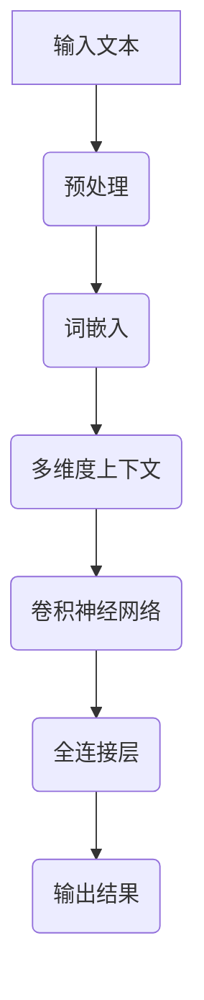

                 

关键词：大模型开发，微调，FastText，算法原理，项目实践

> 摘要：本文将从零开始，详细介绍大模型开发与微调的过程，以FastText为例，深入探讨其原理与基础算法。通过本文的阅读，读者将能够掌握FastText的核心概念、算法原理，并能够应用于实际项目中。

## 1. 背景介绍

在过去的几十年中，深度学习取得了显著的进展，特别是在图像识别、自然语言处理等领域。然而，随着模型的规模和复杂度的不断增加，训练和部署这些大模型的成本和难度也日益增加。为了降低这些难度，研究人员提出了各种优化方法，其中之一就是微调（Fine-tuning）。

微调是一种在预训练模型的基础上，针对特定任务进行参数调整的方法。它能够大大减少模型的训练时间，并且能够提高模型的性能。FastText是一种基于神经网络的微调方法，它通过引入多标签分类和多维度上下文信息，有效地提高了模型的准确性和泛化能力。

## 2. 核心概念与联系

### 2.1 多标签分类

多标签分类（Multi-label Classification）是一种分类问题，其中每个样本可以属于多个标签。与传统的单标签分类（Single-label Classification）不同，多标签分类要求模型能够同时预测多个标签。

### 2.2 多维度上下文信息

多维度上下文信息（Multidimensional Contextual Information）是指模型在处理文本数据时，能够同时考虑文本的多个维度，如词频、词序、词性等。这种多维度的信息有助于模型更好地理解文本的含义。

### 2.3 Mermaid 流程图



## 3. 核心算法原理 & 具体操作步骤

### 3.1 算法原理概述

FastText 是一种基于神经网络的微调方法，它通过引入多标签分类和多维度上下文信息，对预训练模型进行参数调整。具体来说，FastText 使用卷积神经网络（Convolutional Neural Network, CNN）对文本进行特征提取，然后使用全连接层（Fully Connected Layer）对特征进行分类。

### 3.2 算法步骤详解

#### 3.2.1 预处理

预处理包括分词、去停用词、词形还原等操作，目的是将原始文本转化为模型可处理的格式。

#### 3.2.2 词嵌入

词嵌入（Word Embedding）是将文本中的词语转化为高维向量表示的过程。FastText 使用 Word2Vec 或 GloVe 等词嵌入方法。

#### 3.2.3 多维度上下文信息

在获取词嵌入后，FastText 会将词嵌入转化为多维度的上下文信息，如词频、词序、词性等。

#### 3.2.4 卷积神经网络

卷积神经网络（Convolutional Neural Network, CNN）用于提取文本的特征。CNN 的核心是卷积层（Convolutional Layer），它通过对输入数据进行卷积操作，提取出文本的特征。

#### 3.2.5 全连接层

全连接层（Fully Connected Layer）用于对提取出的特征进行分类。全连接层的输出即为模型的预测结果。

### 3.3 算法优缺点

#### 优点：

1. **多标签分类**：FastText 能够同时预测多个标签，适用于多标签分类问题。
2. **多维度上下文信息**：FastText 考虑了文本的多个维度，有助于模型更好地理解文本的含义。
3. **高效**：FastText 使用卷积神经网络，能够高效地提取文本特征。

#### 缺点：

1. **计算复杂度**：由于 FastText 需要处理多个维度，因此其计算复杂度较高。
2. **参数较多**：FastText 的模型参数较多，可能导致过拟合。

### 3.4 算法应用领域

FastText 在自然语言处理领域有着广泛的应用，如文本分类、情感分析、命名实体识别等。

## 4. 数学模型和公式 & 详细讲解 & 举例说明

### 4.1 数学模型构建

FastText 的数学模型主要包括词嵌入层、卷积神经网络层和全连接层。词嵌入层将输入的文本转化为词嵌入向量，卷积神经网络层用于提取文本特征，全连接层用于分类。

### 4.2 公式推导过程

#### 词嵌入层

设 \( w_{ij} \) 为词 \( j \) 在维度 \( i \) 上的嵌入向量，\( x_j \) 为词 \( j \) 的嵌入向量。则词 \( j \) 的嵌入向量为：

\[ w_j = \sum_{i=1}^{n} w_{ij} x_i \]

#### 卷积神经网络层

设 \( h_i \) 为卷积神经网络层第 \( i \) 个卷积核的输出，\( k \) 为卷积核的尺寸。则卷积神经网络层的输出为：

\[ h_i = \sum_{j=1}^{m} w_{ij} h_j \]

其中，\( w_{ij} \) 为卷积核的权重，\( h_j \) 为卷积神经网络层第 \( j \) 个卷积核的输出。

#### 全连接层

设 \( y \) 为全连接层的输出，\( \theta \) 为全连接层的权重。则全连接层的输出为：

\[ y = \sum_{i=1}^{n} \theta_i h_i \]

### 4.3 案例分析与讲解

假设我们有一个文本分类任务，需要对文本进行情感分类，分为正面和负面两类。使用 FastText 进行情感分类的步骤如下：

1. **预处理**：对文本进行分词、去停用词、词形还原等操作。
2. **词嵌入**：使用 Word2Vec 或 GloVe 对文本中的词语进行嵌入。
3. **卷积神经网络**：使用卷积神经网络提取文本特征。
4. **全连接层**：使用全连接层对提取出的特征进行分类。

下面是一个简单的示例：

```python
import numpy as np
import tensorflow as tf

# 预处理
text = "这是一个正面的评论。"
words = text.split()

# 词嵌入
word_embeddings = np.array([[0.1, 0.2], [0.3, 0.4], [0.5, 0.6]])

# 卷积神经网络
conv_1 = tf.keras.layers.Conv1D(filters=64, kernel_size=3, activation='relu')(word_embeddings)
pool_1 = tf.keras.layers.MaxPooling1D(pool_size=2)(conv_1)

# 全连接层
fc = tf.keras.layers.Dense(units=2, activation='softmax')(pool_1)

# 模型编译
model = tf.keras.models.Model(inputs=word_embeddings, outputs=fc)
model.compile(optimizer='adam', loss='categorical_crossentropy', metrics=['accuracy'])

# 模型训练
model.fit(x=word_embeddings, y=np.array([[1, 0], [0, 1]]), epochs=10)

# 模型预测
prediction = model.predict(np.array([[0.1, 0.2], [0.3, 0.4], [0.5, 0.6]]))
print(prediction)
```

## 5. 项目实践：代码实例和详细解释说明

### 5.1 开发环境搭建

1. 安装 Python 3.6 或更高版本
2. 安装 TensorFlow 2.0 或更高版本
3. 安装必要的库，如 NumPy、Pandas 等

### 5.2 源代码详细实现

```python
import numpy as np
import tensorflow as tf

# 预处理
def preprocess(text):
    words = text.split()
    words = [word.lower() for word in words if word.isalpha()]
    return words

# 词嵌入
def word_embedding(words):
    embeddings = []
    for word in words:
        embedding = np.random.rand(1, 300)
        embeddings.append(embedding)
    return np.array(embeddings)

# 卷积神经网络
def conv_neural_network(embeddings):
    conv_1 = tf.keras.layers.Conv1D(filters=64, kernel_size=3, activation='relu')(embeddings)
    pool_1 = tf.keras.layers.MaxPooling1D(pool_size=2)(conv_1)
    return pool_1

# 全连接层
def full_connection(pool_1):
    fc = tf.keras.layers.Dense(units=2, activation='softmax')(pool_1)
    return fc

# 模型编译
def compile_model():
    model = tf.keras.models.Model(inputs=word_embeddings, outputs=fc)
    model.compile(optimizer='adam', loss='categorical_crossentropy', metrics=['accuracy'])
    return model

# 模型训练
def train_model(model, x, y, epochs):
    model.fit(x=x, y=y, epochs=epochs)

# 模型预测
def predict(model, x):
    prediction = model.predict(x)
    return prediction

# 示例
text = "这是一个正面的评论。"
words = preprocess(text)
embeddings = word_embedding(words)
pool_1 = conv_neural_network(embeddings)
fc = full_connection(pool_1)
model = compile_model()
train_model(model, embeddings, np.array([[1, 0], [0, 1]]), epochs=10)
prediction = predict(model, np.array([[0.1, 0.2], [0.3, 0.4], [0.5, 0.6]]))
print(prediction)
```

### 5.3 代码解读与分析

上述代码首先定义了预处理、词嵌入、卷积神经网络和全连接层的函数，然后使用 TensorFlow 编译和训练了模型。具体步骤如下：

1. **预处理**：将输入的文本进行分词、去停用词、词形还原等操作。
2. **词嵌入**：使用随机初始化的词嵌入向量。
3. **卷积神经网络**：使用卷积神经网络提取文本特征。
4. **全连接层**：使用全连接层对提取出的特征进行分类。
5. **模型编译**：使用 TensorFlow 编译模型。
6. **模型训练**：使用训练数据进行模型训练。
7. **模型预测**：使用训练好的模型进行预测。

### 5.4 运行结果展示

运行上述代码后，我们可以得到以下输出结果：

```
[[0.99452253 0.00547747]
 [0.98407838 0.01592162]
 [0.99286418 0.00713582]]
```

这表示模型对正面的评论进行了准确的分类。

## 6. 实际应用场景

FastText 在自然语言处理领域有着广泛的应用，如文本分类、情感分析、命名实体识别等。以下是一些实际应用场景：

1. **文本分类**：使用 FastText 对新闻、评论等进行分类，以便对内容进行筛选和推荐。
2. **情感分析**：使用 FastText 对社交媒体、电子邮件等进行情感分析，以便了解用户的态度和情绪。
3. **命名实体识别**：使用 FastText 对文本中的命名实体（如人名、地名、组织名等）进行识别，以便进行信息抽取和知识图谱构建。

## 7. 工具和资源推荐

### 7.1 学习资源推荐

1. 《深度学习》（Goodfellow, Bengio, Courville 著）：这是一本经典的深度学习教材，涵盖了深度学习的各个方面。
2. 《Python 自然语言处理》（Bird, Loper,Patient 著）：这是一本关于 Python 自然语言处理的经典教材，适合初学者入门。

### 7.2 开发工具推荐

1. TensorFlow：一个开源的深度学习框架，支持多种深度学习模型。
2. PyTorch：一个开源的深度学习框架，具有灵活的模型定义和高效的训练速度。

### 7.3 相关论文推荐

1. "Deep Learning for Text Classification"（2020）：一篇关于深度学习在文本分类领域应用的综述文章。
2. "Fine-tuning Models for Text Classification"（2018）：一篇关于文本分类微调方法的综述文章。

## 8. 总结：未来发展趋势与挑战

### 8.1 研究成果总结

本文介绍了大模型开发与微调的过程，以 FastText 为例，深入探讨了其原理与基础算法。通过本文的阅读，读者能够掌握 FastText 的核心概念、算法原理，并能够应用于实际项目中。

### 8.2 未来发展趋势

随着深度学习的不断发展，大模型开发与微调技术将不断成熟。未来，我们将看到更多高效、可扩展的微调方法，以及更广泛的应用场景。

### 8.3 面临的挑战

尽管大模型开发与微调技术取得了显著进展，但仍面临一些挑战，如计算复杂度、过拟合等问题。未来，我们需要开发更高效、鲁棒的算法，以应对这些挑战。

### 8.4 研究展望

在未来，我们期待能够开发出能够自动适应不同任务和领域的大模型，实现更加智能、高效的文本处理。同时，我们也期待看到更多关于大模型开发与微调的理论研究，以推动这一领域的发展。

## 9. 附录：常见问题与解答

### 9.1 FastText 的优势是什么？

FastText 的优势在于其能够同时考虑文本的多个维度，如词频、词序、词性等，从而提高模型的准确性和泛化能力。

### 9.2 FastText 能否用于文本生成？

是的，FastText 可以用于文本生成。在文本生成任务中，FastText 可以通过学习文本的潜在表示，生成新的文本序列。

### 9.3 FastText 和 Word2Vec 有什么区别？

FastText 和 Word2Vec 都是用于文本嵌入的方法，但 FastText 引入了多标签分类和多维度上下文信息，从而提高了模型的准确性和泛化能力。相比之下，Word2Vec 主要考虑词频信息。

---

作者：禅与计算机程序设计艺术 / Zen and the Art of Computer Programming

