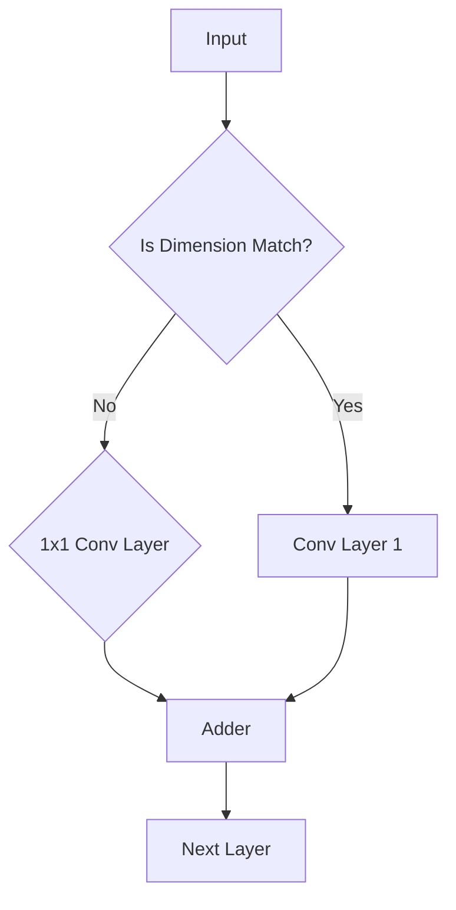

                 

关键词：ResNet、残差模块、神经网络、深度学习、模型微调、大规模模型开发、图像识别

摘要：本文旨在为读者提供一份深入且详尽的指南，介绍如何从零开始进行大规模模型的开发与微调，特别是以ResNet残差模块为例。通过本文，读者将了解ResNet的概念、结构、实现方法及其在深度学习中的应用，并学会如何通过代码实例来实现一个基本的ResNet模型。

## 1. 背景介绍

随着深度学习技术的快速发展，神经网络模型在图像识别、语音识别、自然语言处理等领域取得了显著成果。然而，传统的神经网络在训练深度较大的模型时遇到了梯度消失和梯度爆炸的问题，这限制了模型深度和性能的提升。为了解决这个问题，残差网络（ResNet）应运而生。

ResNet是由微软研究院研究员He等人于2015年提出的一种具有革命性的深度神经网络架构。ResNet通过引入残差模块，成功解决了梯度消失问题，使得模型可以训练得更深，同时也提高了模型的准确率。此后，ResNet成为了深度学习领域的一个重要研究方向，被广泛应用于各种实际应用中。

## 2. 核心概念与联系

### 2.1 残差模块的定义

残差模块是ResNet的核心组成部分，它由两部分组成：残差块和跳跃连接。

**残差块**：残差块是一个含有两个卷积层的神经网络层，它旨在引入非线性变换，同时保留输入特征的信息。

**跳跃连接**：跳跃连接是一种跨越某些层直接将输入特征传递到输出的连接方式，它使得网络可以学习到更复杂的特征表示。

### 2.2 残差模块的结构

一个标准的残差模块由两个卷积层组成，这两个卷积层的输出通过一个加法器相加，然后传递给下一层。如果输入和输出特征维度不同，则会在加法器之前添加一个1x1的卷积层来匹配维度。

下面是残差模块的Mermaid流程图：



## 3. 核心算法原理 & 具体操作步骤

### 3.1 算法原理概述

ResNet的核心思想是通过残差模块学习到残差映射，即输入和输出之间的差异。这种方法可以使得网络学习到更深的层次，同时避免了梯度消失问题。

### 3.2 算法步骤详解

1. **输入特征**：输入图像特征。
2. **第一层卷积**：对输入特征进行卷积操作，得到特征图。
3. **第二层卷积**：对特征图进行卷积操作，得到新的特征图。
4. **跳跃连接**：如果输入和输出特征维度不同，则通过1x1卷积层匹配维度。
5. **加法操作**：将输入特征和卷积后的特征图相加。
6. **激活函数**：对加法后的特征图应用激活函数（如ReLU）。
7. **传递到下一层**：将激活后的特征图传递给下一层残差模块。

### 3.3 算法优缺点

**优点**：
- **解决梯度消失问题**：通过跳跃连接解决了深层网络训练中的梯度消失问题。
- **提高模型性能**：通过引入残差模块，使得模型可以训练得更深，提高了模型性能。

**缺点**：
- **参数量大**：由于模型深度增加，参数量也随之增加，导致计算量和存储需求增大。

### 3.4 算法应用领域

ResNet被广泛应用于计算机视觉领域，如图像分类、目标检测、人脸识别等。此外，ResNet也在自然语言处理和语音识别等领域取得了良好的效果。

## 4. 数学模型和公式 & 详细讲解 & 举例说明

### 4.1 数学模型构建

假设输入特征矩阵为\( X \)，第一层卷积核为\( W_1 \)，第二层卷积核为\( W_2 \)，则残差模块的输出可以表示为：

$$
F(X) = X + f(W_2 \circ (W_1 \circ X)),
$$

其中，\( \circ \)表示卷积操作，\( f \)为ReLU激活函数。

### 4.2 公式推导过程

为了推导残差模块的输出，我们首先需要对输入特征进行卷积操作。假设输入特征矩阵为\( X \)（尺寸为\( m \times n \)），第一层卷积核为\( W_1 \)（尺寸为\( p \times q \)），则卷积后的特征图可以表示为：

$$
X_1 = W_1 \circ X.
$$

接下来，对\( X_1 \)进行第二层卷积操作，得到：

$$
X_2 = W_2 \circ X_1.
$$

为了实现跳跃连接，我们需要确保输入特征和卷积后特征图的维度相同。如果不同，我们可以通过1x1卷积层进行维度转换：

$$
X_2' = W_3 \circ X_1,
$$

其中，\( W_3 \)为1x1卷积核。

最后，我们将输入特征和卷积后的特征图相加，并应用ReLU激活函数：

$$
F(X) = X + f(X_2'),
$$

其中，\( f \)为ReLU激活函数。

### 4.3 案例分析与讲解

假设输入特征矩阵为\( X \)（尺寸为\( 32 \times 32 \)），第一层卷积核为\( W_1 \)（尺寸为\( 3 \times 3 \)），第二层卷积核为\( W_2 \)（尺寸为\( 3 \times 3 \)），1x1卷积核为\( W_3 \)（尺寸为\( 1 \times 1 \)）。

1. **第一层卷积**：输入特征\( X \)经过第一层卷积操作得到特征图\( X_1 \)。

2. **第二层卷积**：对特征图\( X_1 \)进行第二层卷积操作得到特征图\( X_2 \)。

3. **维度匹配**：由于输入特征和卷积后特征图的维度不同，我们需要通过1x1卷积层进行维度匹配，得到特征图\( X_2' \)。

4. **加法操作**：将输入特征和特征图\( X_2' \)相加。

5. **激活函数**：对加法后的特征图应用ReLU激活函数。

6. **输出**：将激活后的特征图传递给下一层残差模块。

通过这个案例，我们可以看到如何通过数学模型和公式实现一个基本的ResNet残差模块。

## 5. 项目实践：代码实例和详细解释说明

### 5.1 开发环境搭建

在本节中，我们将介绍如何搭建一个适合开发ResNet模型的环境。我们选择使用Python作为编程语言，TensorFlow作为深度学习框架。

1. 安装Python：

```bash
pip install python==3.8
```

2. 安装TensorFlow：

```bash
pip install tensorflow==2.6
```

### 5.2 源代码详细实现

以下是一个简单的ResNet模型的实现代码：

```python
import tensorflow as tf
from tensorflow.keras.layers import Conv2D, BatchNormalization, Activation, Add, Input

def resblock(x, filters, kernel_size=3, strides=(1, 1)):
    # 第一层卷积
    x1 = Conv2D(filters, kernel_size, strides=strides, padding='same')(x)
    x1 = BatchNormalization()(x1)
    x1 = Activation('relu')(x1)

    # 第二层卷积
    x2 = Conv2D(filters, kernel_size, padding='same')(x1)
    x2 = BatchNormalization()(x2)

    # 跳跃连接
    if strides != (1, 1) or x.shape[-1] != filters:
        x = Conv2D(filters, kernel_size=1, strides=strides, padding='same')(x)
        x = BatchNormalization()(x)

    # 加法操作
    x = Add()([x, x2])

    # 激活函数
    x = Activation('relu')(x)
    return x

# 输入层
inputs = Input(shape=(32, 32, 3))

# 第一层残差块
x = resblock(inputs, 64)

# 第二层残差块
x = resblock(x, 64)

# 输出层
outputs = Conv2D(10, kernel_size=1, padding='same')(x)

# 构建模型
model = tf.keras.Model(inputs=inputs, outputs=outputs)

# 编译模型
model.compile(optimizer='adam', loss='categorical_crossentropy', metrics=['accuracy'])

# 打印模型结构
model.summary()
```

### 5.3 代码解读与分析

1. **导入库**：我们首先导入所需的库，包括TensorFlow。

2. **定义残差块**：`resblock`函数定义了一个残差块，它包含两个卷积层、批量归一化、ReLU激活函数和加法操作。

3. **输入层**：定义输入层，形状为\( 32 \times 32 \times 3 \)。

4. **第一层残差块**：调用`resblock`函数定义第一层残差块，输入特征为输入层，卷积核数量为64。

5. **第二层残差块**：同理，定义第二层残差块。

6. **输出层**：定义输出层，使用一个卷积层，卷积核数量为10，用于分类。

7. **构建模型**：使用`Model`类构建模型，并指定输入和输出层。

8. **编译模型**：编译模型，指定优化器、损失函数和评价指标。

9. **打印模型结构**：使用`summary`方法打印模型结构。

### 5.4 运行结果展示

为了展示模型的运行结果，我们可以使用一个简单的数据集进行训练和测试。

```python
# 加载数据集
(x_train, y_train), (x_test, y_test) = tf.keras.datasets.cifar10.load_data()

# 归一化数据集
x_train = x_train.astype('float32') / 255.0
x_test = x_test.astype('float32') / 255.0

# 将标签转换为one-hot编码
y_train = tf.keras.utils.to_categorical(y_train, 10)
y_test = tf.keras.utils.to_categorical(y_test, 10)

# 训练模型
model.fit(x_train, y_train, batch_size=64, epochs=100, validation_data=(x_test, y_test))

# 评估模型
loss, accuracy = model.evaluate(x_test, y_test)
print(f'Test loss: {loss}, Test accuracy: {accuracy}')
```

通过训练和测试，我们可以得到模型的损失和准确率。

## 6. 实际应用场景

### 6.1 图像分类

图像分类是ResNet最广泛的应用场景之一。通过使用ResNet模型，我们可以对图像进行分类，从而实现图像识别。

### 6.2 目标检测

ResNet也被广泛应用于目标检测任务，如YOLO、SSD等模型。通过结合ResNet的深度和特征提取能力，这些目标检测模型能够更准确地检测和识别图像中的目标。

### 6.3 人脸识别

在人脸识别领域，ResNet被用来提取人脸特征，从而实现人脸识别。通过使用深度残差网络，人脸识别模型可以更准确地识别人脸。

## 7. 未来应用展望

随着深度学习技术的不断发展，ResNet模型的应用领域将不断扩展。未来，我们可以预见ResNet在更多领域，如自动驾驶、医疗诊断、自然语言处理等，都将发挥重要作用。

## 8. 总结：未来发展趋势与挑战

### 8.1 研究成果总结

自ResNet提出以来，深度学习领域取得了显著成果。ResNet模型通过引入残差模块，成功解决了梯度消失问题，使得模型可以训练得更深，提高了模型性能。此外，ResNet在计算机视觉、自然语言处理等领域取得了广泛应用，为深度学习技术的发展做出了重要贡献。

### 8.2 未来发展趋势

未来，深度学习技术将继续发展，特别是在以下几个方面：

- **模型压缩**：如何有效地压缩ResNet模型，减少计算量和存储需求，提高模型部署的实用性。
- **自适应学习**：如何实现自适应学习，使得模型能够根据不同任务和数据自动调整其结构。
- **多模态学习**：如何结合多种模态（如图像、文本、语音）进行深度学习，实现更广泛的应用。

### 8.3 面临的挑战

尽管ResNet取得了显著成果，但深度学习技术仍然面临一些挑战：

- **计算资源限制**：深度学习模型通常需要大量计算资源和时间进行训练，如何优化模型结构和算法，提高训练效率。
- **数据隐私和安全**：如何保护用户数据隐私，确保深度学习模型的安全性和可靠性。
- **模型解释性**：如何提高深度学习模型的解释性，使其更加透明和可信。

### 8.4 研究展望

未来，深度学习技术将在更多领域发挥重要作用，如自动驾驶、智能医疗、自然语言处理等。通过不断创新和优化，我们有望解决深度学习面临的挑战，推动深度学习技术的进一步发展。

## 9. 附录：常见问题与解答

### 9.1 如何解决梯度消失问题？

梯度消失问题是由于深层网络中的梯度逐渐减小，导致模型难以训练。为了解决这个问题，可以采用以下方法：

- **批量归一化**：通过批量归一化，可以稳定网络训练过程，减少梯度消失现象。
- **残差连接**：通过引入残差连接，可以使得梯度直接传递到浅层，缓解梯度消失问题。
- **自适应学习率**：通过自适应学习率，可以根据训练过程自动调整学习率，避免梯度消失。

### 9.2 如何优化ResNet模型？

为了优化ResNet模型，可以尝试以下方法：

- **数据增强**：通过数据增强，可以增加模型的泛化能力，提高模型性能。
- **权重初始化**：选择合适的权重初始化方法，可以加快模型收敛速度，提高模型性能。
- **正则化**：通过添加正则化项，可以防止模型过拟合，提高模型泛化能力。

### 9.3 ResNet模型的局限性是什么？

ResNet模型虽然具有很好的性能，但仍然存在一些局限性：

- **计算资源消耗**：深层网络模型需要大量的计算资源和存储空间。
- **训练时间较长**：深层网络模型训练时间较长，可能不适合实时应用。
- **过拟合风险**：如果数据集较小，深层网络模型可能出现过拟合现象。

### 9.4 如何改进ResNet模型？

为了改进ResNet模型，可以尝试以下方法：

- **网络结构优化**：通过调整网络结构，如增加或减少残差块、调整卷积层参数等，可以改进模型性能。
- **多任务学习**：通过多任务学习，可以使得模型同时学习多个任务，提高模型泛化能力。
- **迁移学习**：通过迁移学习，可以利用预训练模型，减少模型训练时间，提高模型性能。

### 9.5 ResNet模型在自然语言处理领域有何应用？

在自然语言处理领域，ResNet模型可以应用于以下任务：

- **文本分类**：通过使用ResNet模型，可以对文本进行分类，实现文本分类任务。
- **情感分析**：通过使用ResNet模型，可以分析文本中的情感倾向，实现情感分析任务。
- **命名实体识别**：通过使用ResNet模型，可以识别文本中的命名实体，实现命名实体识别任务。

### 9.6 如何评估ResNet模型性能？

为了评估ResNet模型性能，可以采用以下指标：

- **准确率**：准确率是评估分类模型性能的重要指标，表示模型预测正确的样本数与总样本数的比例。
- **召回率**：召回率是评估分类模型性能的重要指标，表示模型预测正确的正样本数与实际正样本数的比例。
- **F1分数**：F1分数是准确率和召回率的加权平均，用于综合评估分类模型性能。
- **混淆矩阵**：混淆矩阵可以详细展示模型预测结果，帮助分析模型性能。

### 9.7 如何调整ResNet模型超参数？

为了调整ResNet模型超参数，可以尝试以下方法：

- **网格搜索**：通过网格搜索，可以系统地遍历超参数空间，找到最优超参数。
- **贝叶斯优化**：通过贝叶斯优化，可以基于先验知识和历史数据，自动调整超参数，找到最优超参数。
- **随机搜索**：通过随机搜索，可以随机选择超参数，并通过多次实验，找到最优超参数。

### 9.8 如何防止ResNet模型过拟合？

为了防止ResNet模型过拟合，可以采用以下方法：

- **数据增强**：通过数据增强，可以增加模型的泛化能力，减少过拟合现象。
- **正则化**：通过添加正则化项，可以防止模型过拟合，提高模型泛化能力。
- **交叉验证**：通过交叉验证，可以评估模型在不同数据集上的性能，避免过拟合。

### 9.9 如何提高ResNet模型训练效率？

为了提高ResNet模型训练效率，可以采用以下方法：

- **并行计算**：通过并行计算，可以加快模型训练速度，提高训练效率。
- **批量归一化**：通过批量归一化，可以加速模型训练，提高训练效率。
- **自适应学习率**：通过自适应学习率，可以根据训练过程自动调整学习率，加快模型收敛速度。

### 9.10 如何部署ResNet模型？

为了部署ResNet模型，可以采用以下方法：

- **模型导出**：通过将模型导出为ONNX、TFLite等格式，可以实现跨平台部署。
- **硬件加速**：通过使用GPU、TPU等硬件加速，可以加快模型推理速度，提高部署效率。
- **微服务架构**：通过使用微服务架构，可以将模型部署到云端或边缘设备，实现高效部署。
----------------------------------------------------------------

### 作者署名

作者：禅与计算机程序设计艺术 / Zen and the Art of Computer Programming

