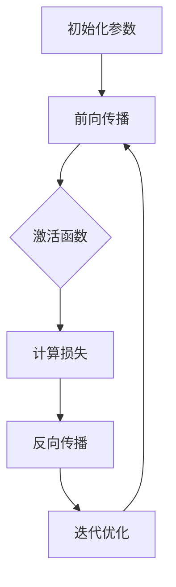

                 

关键词：大模型开发，前馈层，微调，深度学习，神经网络

摘要：本文将带领读者从零开始了解大模型开发与微调的过程，特别是前馈层的实现。文章首先介绍了大模型开发的背景和重要性，随后详细阐述了前馈层的基本概念、算法原理和具体操作步骤，并通过一个实际项目实例，展示了如何在实际应用中实现前馈层。最后，文章探讨了大模型微调的数学模型和公式，并提供了代码实例和详细解释，以便读者更好地理解和应用。

## 1. 背景介绍

在当今的时代，深度学习已经成为人工智能领域的核心技术之一。特别是随着计算能力的不断提升和大数据的广泛应用，大模型（如GPT、BERT等）的开发和应用变得越来越普遍。大模型具有强大的表示能力和学习能力，可以在各种复杂任务中取得优异的性能。然而，大模型的开发与微调过程却相对复杂，涉及到众多技术和算法。其中，前馈层的实现是大模型开发的核心环节之一。

前馈层是一种神经网络的基本结构，负责数据的输入和输出。在深度学习中，前馈层通过层层传递输入数据，最终实现数据的分类、回归等任务。因此，掌握前馈层的实现方法和技巧，对于大模型的开发具有重要意义。

本文将围绕大模型开发与微调这一主题，详细介绍前馈层的实现过程。首先，我们将回顾大模型开发的背景和重要性；然后，介绍前馈层的基本概念和算法原理；接着，通过具体操作步骤，展示前馈层的实现过程；最后，通过实际项目实例，展示如何在实际应用中实现前馈层。希望通过本文的介绍，读者能够更好地理解和掌握前馈层的实现方法。

## 2. 核心概念与联系

### 2.1 前馈层的基本概念

前馈层（Feedforward Layer）是神经网络中最基本的结构之一，它通过逐层传递输入数据，实现对数据的处理和输出。在前馈层中，数据从输入层（Input Layer）开始，经过多个隐藏层（Hidden Layer）的处理，最终输出到输出层（Output Layer）。

输入层负责接收外部输入数据，如文本、图像等；隐藏层负责对输入数据进行处理，提取特征信息；输出层则根据隐藏层提取的特征信息，完成最终的分类、回归等任务。

### 2.2 前馈层的算法原理

前馈层的算法原理主要基于神经网络的训练过程。神经网络通过不断调整权重和偏置，使得网络能够更好地拟合训练数据，从而实现高精度的预测。

具体来说，前馈层的算法原理可以分为以下几个步骤：

1. **初始化参数**：首先，我们需要初始化网络的权重（Weight）和偏置（Bias）。通常，权重和偏置的初始化可以采用随机初始化或者预训练的方法。

2. **前向传播**：在前向传播过程中，输入数据从输入层传递到隐藏层，再从隐藏层传递到输出层。每个神经元都会根据其输入值和权重，计算出输出值。

3. **激活函数**：在计算输出值时，我们通常会使用激活函数（如ReLU、Sigmoid、Tanh等），以引入非线性因素，使得神经网络具有更强的表示能力。

4. **计算损失**：在前向传播完成后，我们需要计算输出值与实际值之间的差距，即损失（Loss）。常见的损失函数包括均方误差（MSE）、交叉熵（Cross Entropy）等。

5. **反向传播**：在反向传播过程中，我们将损失函数关于网络参数的梯度计算出来，并沿着反向传播的路径，逐层更新权重和偏置。反向传播是神经网络训练过程的核心步骤，通过梯度下降等优化算法，不断调整网络参数，使得网络能够更好地拟合训练数据。

6. **迭代优化**：重复前向传播和反向传播的过程，不断迭代优化网络参数，直到网络达到预定的性能指标。

### 2.3 前馈层与其他层的关系

前馈层是神经网络的核心组成部分，与其他层（如卷积层、池化层等）密切相关。卷积层和池化层主要负责对图像等数据的空间特征进行提取，而前馈层则通过逐层传递这些特征信息，实现对数据的分类、回归等任务。

在实际应用中，我们可以根据任务的复杂度和数据特点，灵活组合不同的层，构建适合的神经网络模型。例如，在图像分类任务中，我们可以使用卷积层和前馈层的组合，实现对图像的分类；在自然语言处理任务中，我们可以使用循环层（如LSTM、GRU等）和前馈层的组合，实现对文本的序列建模。

### 2.4 Mermaid 流程图

下面是一个简单的 Mermaid 流程图，展示了前馈层的实现过程：



## 3. 核心算法原理 & 具体操作步骤

### 3.1 算法原理概述

在前馈层的实现过程中，核心算法原理主要包括前向传播和反向传播。前向传播负责将输入数据从输入层传递到输出层，通过层层计算，得到最终的输出结果；反向传播则负责计算输出结果与实际值之间的差距，并通过梯度下降等优化算法，更新网络参数，使得网络能够更好地拟合训练数据。

### 3.2 算法步骤详解

1. **初始化参数**：首先，我们需要初始化网络的权重和偏置。通常，权重和偏置的初始化可以采用随机初始化或者预训练的方法。例如，可以使用高斯分布或者均匀分布来初始化权重和偏置。

2. **前向传播**：在前向传播过程中，输入数据从输入层传递到隐藏层，再从隐藏层传递到输出层。每个神经元都会根据其输入值和权重，计算出输出值。具体步骤如下：

   a. 计算每个神经元的输入值：输入值 = 输入数据 × 权重 + 偏置
   
   b. 应用激活函数：输出值 = 激活函数（输入值）
   
   c. 将输出值传递到下一层
   
3. **计算损失**：在前向传播完成后，我们需要计算输出值与实际值之间的差距，即损失。常见的损失函数包括均方误差（MSE）、交叉熵（Cross Entropy）等。具体步骤如下：

   a. 计算损失值：损失 = 损失函数（输出值，实际值）
   
   b. 将损失值传递到上一层
   
4. **反向传播**：在反向传播过程中，我们需要计算损失函数关于网络参数的梯度，并通过梯度下降等优化算法，更新网络参数。具体步骤如下：

   a. 计算每个神经元的梯度：梯度 = 损失函数关于输出值的梯度 × 激活函数关于输入值的梯度
   
   b. 计算每个神经元的权重和偏置的梯度：梯度 = 输入值 × 梯度
   
   c. 更新网络参数：参数 = 参数 - 学习率 × 梯度
   
5. **迭代优化**：重复前向传播和反向传播的过程，不断迭代优化网络参数，直到网络达到预定的性能指标。

### 3.3 算法优缺点

前馈层作为神经网络的基本结构，具有以下优点：

1. **简单易实现**：前馈层的实现过程相对简单，易于理解和实现。
2. **高效性**：前馈层可以高效地处理大规模数据，适用于多种应用场景。
3. **灵活性**：前馈层可以与其他层（如卷积层、循环层等）组合，构建复杂的神经网络模型。

然而，前馈层也存在一些缺点：

1. **局部最优**：由于梯度消失和梯度爆炸等问题，前馈层在训练过程中可能陷入局部最优。
2. **计算量大**：前馈层需要大量的计算资源，特别是在处理高维数据时。

### 3.4 算法应用领域

前馈层广泛应用于各种深度学习任务，如图像分类、自然语言处理、语音识别等。以下是一些典型的应用领域：

1. **图像分类**：使用卷积层和前馈层的组合，实现对图像的分类。
2. **文本分类**：使用循环层（如LSTM、GRU等）和前馈层的组合，实现对文本的分类。
3. **语音识别**：使用循环层和前馈层的组合，实现对语音信号的识别。

## 4. 数学模型和公式 & 详细讲解 & 举例说明

### 4.1 数学模型构建

在前馈层的实现过程中，我们需要构建一个数学模型来描述神经网络的训练过程。该数学模型包括以下几个部分：

1. **输入层**：输入层包含多个神经元，每个神经元接收一个输入值。
2. **隐藏层**：隐藏层包含多个神经元，每个神经元接收前一层神经元的输出值。
3. **输出层**：输出层包含一个或多个神经元，用于生成最终的输出结果。

### 4.2 公式推导过程

假设我们有一个包含 L 层的神经网络，其中 L-1 层为隐藏层，L 层为输出层。设 \(x_l\) 表示第 l 层的输入向量，\(y_l\) 表示第 l 层的输出向量，\(w_{lj}\) 表示第 l 层第 j 个神经元的权重向量，\(b_l\) 表示第 l 层的偏置向量。则神经网络的输出可以表示为：

\[ y_L = f_L(\hat{y}_{L-1}) \]

其中，\(f_L\) 表示激活函数，\(\hat{y}_{L-1}\) 表示第 L-1 层的输出。

对于第 l 层（1 ≤ l ≤ L-1），我们可以得到：

\[ y_l = f_l(w_{l+1}y_{l+1} + b_l) \]

其中，\(f_l\) 表示第 l 层的激活函数，\(w_{l+1}\) 表示第 l 层到第 l+1 层的权重矩阵，\(b_l\) 表示第 l 层的偏置向量。

### 4.3 案例分析与讲解

为了更好地理解前馈层的数学模型，我们来看一个简单的例子：一个包含两个隐藏层的二分类问题。设输入层包含一个神经元，输出层包含一个神经元。激活函数采用 ReLU 函数，损失函数采用交叉熵损失。

1. **输入层到隐藏层 1**：

   输入值：\[ x = [1] \]

   隐藏层 1 的权重矩阵：\[ w_{11} = \begin{bmatrix} 1 & 1 \\ 1 & 1 \end{bmatrix} \]

   隐藏层 1 的偏置向量：\[ b_{1} = \begin{bmatrix} 1 \\ 1 \end{bmatrix} \]

   隐藏层 1 的输出：

   \[ y_1 = \text{ReLU}(w_{11}x + b_1) = \text{ReLU}(\begin{bmatrix} 1 & 1 \\ 1 & 1 \end{bmatrix}\begin{bmatrix} 1 \end{bmatrix} + \begin{bmatrix} 1 \\ 1 \end{bmatrix}) = \text{ReLU}(\begin{bmatrix} 2 \\ 2 \end{bmatrix}) = \begin{bmatrix} 2 \\ 2 \end{bmatrix} \]

2. **隐藏层 1 到隐藏层 2**：

   隐藏层 2 的权重矩阵：\[ w_{21} = \begin{bmatrix} 1 & 1 \\ 1 & 1 \end{bmatrix} \]

   隐藏层 2 的偏置向量：\[ b_{2} = \begin{bmatrix} 1 \\ 1 \end{bmatrix} \]

   隐藏层 2 的输出：

   \[ y_2 = \text{ReLU}(w_{21}y_1 + b_2) = \text{ReLU}(\begin{bmatrix} 1 & 1 \\ 1 & 1 \end{bmatrix}\begin{bmatrix} 2 \\ 2 \end{bmatrix} + \begin{bmatrix} 1 \\ 1 \end{bmatrix}) = \text{ReLU}(\begin{bmatrix} 5 \\ 5 \end{bmatrix}) = \begin{bmatrix} 5 \\ 5 \end{bmatrix} \]

3. **隐藏层 2 到输出层**：

   输出层的权重矩阵：\[ w_{2} = \begin{bmatrix} 1 & 1 \\ 1 & 1 \end{bmatrix} \]

   输出层的偏置向量：\[ b_{2} = \begin{bmatrix} 1 \\ 1 \end{bmatrix} \]

   输出层的输出：

   \[ y = \text{ReLU}(w_{2}y_2 + b_2) = \text{ReLU}(\begin{bmatrix} 1 & 1 \\ 1 & 1 \end{bmatrix}\begin{bmatrix} 5 \\ 5 \end{bmatrix} + \begin{bmatrix} 1 \\ 1 \end{bmatrix}) = \text{ReLU}(\begin{bmatrix} 11 \\ 11 \end{bmatrix}) = \begin{bmatrix} 11 \\ 11 \end{bmatrix} \]

   输出结果为 \(y = [11]\)，表示分类结果为正类。

通过上述例子，我们可以看到前馈层的数学模型是如何构建和计算的。在实际应用中，我们通常需要根据具体的任务和数据，设计合适的神经网络结构和参数，以实现高质量的预测。

## 5. 项目实践：代码实例和详细解释说明

### 5.1 开发环境搭建

在本文的项目实践中，我们将使用 Python 编写代码，并依赖 TensorFlow 深度学习框架。为了搭建开发环境，我们需要安装以下软件和库：

1. Python：安装 Python 3.7 或更高版本。
2. TensorFlow：安装 TensorFlow 2.0 或更高版本。
3. NumPy：安装 NumPy 1.18 或更高版本。
4. Matplotlib：安装 Matplotlib 3.0 或更高版本。

您可以使用以下命令安装这些软件和库：

```bash
pip install python==3.7
pip install tensorflow==2.0
pip install numpy==1.18
pip install matplotlib==3.0
```

### 5.2 源代码详细实现

下面是一个简单的示例代码，展示了如何使用 TensorFlow 实现前馈层：

```python
import tensorflow as tf
import numpy as np
import matplotlib.pyplot as plt

# 5.2.1 定义参数
input_size = 1
hidden_size = 2
output_size = 1

# 5.2.2 初始化权重和偏置
weights_input_hidden = tf.random.normal([input_size, hidden_size])
weights_hidden_output = tf.random.normal([hidden_size, output_size])
biases_hidden = tf.random.normal([hidden_size])
biases_output = tf.random.normal([output_size])

# 5.2.3 定义激活函数
activation_function = tf.nn.relu

# 5.2.4 定义损失函数
loss_function = tf.keras.losses.BinaryCrossentropy()

# 5.2.5 定义优化器
optimizer = tf.optimizers.Adam()

# 5.2.6 训练数据
x_train = np.array([[0], [1]])
y_train = np.array([[0], [1]])

# 5.2.7 训练过程
epochs = 1000
for epoch in range(epochs):
    with tf.GradientTape() as tape:
        # 5.2.7.1 前向传播
        hidden_layer = activation_function(tf.matmul(x_train, weights_input_hidden) + biases_hidden)
        output = tf.matmul(hidden_layer, weights_hidden_output) + biases_output

        # 5.2.7.2 计算损失
        loss = loss_function(y_train, output)

    # 5.2.7.3 反向传播和优化
    gradients = tape.gradient(loss, [weights_input_hidden, weights_hidden_output, biases_hidden, biases_output])
    optimizer.apply_gradients(zip(gradients, [weights_input_hidden, weights_hidden_output, biases_hidden, biases_output]))

    # 5.2.7.4 打印当前 epoch 的损失
    if epoch % 100 == 0:
        print(f"Epoch {epoch}: Loss = {loss.numpy()}")

# 5.2.8 预测结果
predictions = output.numpy()
print(f"Predictions: {predictions}")

# 5.2.9 绘制结果
plt.scatter(x_train.numpy(), y_train.numpy(), c='red', label='Actual')
plt.scatter(x_train.numpy(), predictions, c='blue', label='Predicted')
plt.xlabel('Input')
plt.ylabel('Output')
plt.legend()
plt.show()
```

### 5.3 代码解读与分析

#### 5.3.1 参数定义

在代码中，我们首先定义了输入层、隐藏层和输出层的大小，以及权重、偏置的初始化方法。这里我们使用了 TensorFlow 的随机初始化方法，以获得更好的训练效果。

```python
input_size = 1
hidden_size = 2
output_size = 1

weights_input_hidden = tf.random.normal([input_size, hidden_size])
weights_hidden_output = tf.random.normal([hidden_size, output_size])
biases_hidden = tf.random.normal([hidden_size])
biases_output = tf.random.normal([output_size])
```

#### 5.3.2 激活函数和损失函数

接下来，我们定义了激活函数和损失函数。在这里，我们使用了 ReLU 函数作为激活函数，并使用了二分类的二元交叉熵损失函数。

```python
activation_function = tf.nn.relu
loss_function = tf.keras.losses.BinaryCrossentropy()
```

#### 5.3.3 优化器

我们使用了 Adam 优化器来优化网络参数。Adam 优化器是一种自适应学习率优化算法，能够有效地加速收敛。

```python
optimizer = tf.optimizers.Adam()
```

#### 5.3.4 训练数据

我们使用了一个简单的训练数据集，包含两个样本，每个样本都是一个一维数组。

```python
x_train = np.array([[0], [1]])
y_train = np.array([[0], [1]])
```

#### 5.3.5 训练过程

在训练过程中，我们使用 TensorFlow 的 GradientTape 功能记录梯度，并使用优化器更新网络参数。每次迭代都会计算前向传播和反向传播的损失值，并在每 100 个 epoch 后打印一次损失。

```python
epochs = 1000
for epoch in range(epochs):
    with tf.GradientTape() as tape:
        # 5.2.7.1 前向传播
        hidden_layer = activation_function(tf.matmul(x_train, weights_input_hidden) + biases_hidden)
        output = tf.matmul(hidden_layer, weights_hidden_output) + biases_output

        # 5.2.7.2 计算损失
        loss = loss_function(y_train, output)

    # 5.2.7.3 反向传播和优化
    gradients = tape.gradient(loss, [weights_input_hidden, weights_hidden_output, biases_hidden, biases_output])
    optimizer.apply_gradients(zip(gradients, [weights_input_hidden, weights_hidden_output, biases_hidden, biases_output]))

    # 5.2.7.4 打印当前 epoch 的损失
    if epoch % 100 == 0:
        print(f"Epoch {epoch}: Loss = {loss.numpy()}")
```

#### 5.3.6 预测结果

在训练完成后，我们使用训练好的模型进行预测，并打印出预测结果。

```python
predictions = output.numpy()
print(f"Predictions: {predictions}")
```

#### 5.3.7 绘制结果

最后，我们使用 Matplotlib 绘制实际值与预测值的散点图，以可视化模型的效果。

```python
plt.scatter(x_train.numpy(), y_train.numpy(), c='red', label='Actual')
plt.scatter(x_train.numpy(), predictions, c='blue', label='Predicted')
plt.xlabel('Input')
plt.ylabel('Output')
plt.legend()
plt.show()
```

通过上述代码和解读，我们可以看到如何使用 TensorFlow 实现前馈层的训练和预测。在实际项目中，我们可以根据具体需求和数据特点，设计更复杂的神经网络结构和训练过程。

## 6. 实际应用场景

### 6.1 图像分类

在前馈层的实际应用中，图像分类是一个非常重要的领域。通过使用卷积层和前馈层的组合，我们可以实现对图像的分类。以下是一个简单的应用示例：

#### 数据集

我们使用著名的 MNIST 数据集，它包含了 60,000 个训练图像和 10,000 个测试图像，每个图像都是 28x28 的像素矩阵。

#### 网络结构

我们的神经网络包含一个输入层、一个卷积层、两个隐藏层和一个输出层。卷积层用于提取图像的局部特征，隐藏层用于对特征进行进一步处理和分类。

```python
model = tf.keras.Sequential([
    tf.keras.layers.InputLayer(input_shape=(28, 28, 1)),
    tf.keras.layers.Conv2D(filters=32, kernel_size=(3, 3), activation='relu'),
    tf.keras.layers.Flatten(),
    tf.keras.layers.Dense(units=128, activation='relu'),
    tf.keras.layers.Dense(units=10, activation='softmax')
])
```

#### 训练过程

我们使用二进制交叉熵损失函数和 Adam 优化器进行训练。训练过程如下：

```python
model.compile(optimizer='adam',
              loss='binary_crossentropy',
              metrics=['accuracy'])

history = model.fit(x_train, y_train, epochs=10, batch_size=32, validation_split=0.2)
```

#### 预测结果

在训练完成后，我们可以使用模型进行预测，并计算准确率：

```python
predictions = model.predict(x_test)
accuracy = np.mean(np.argmax(predictions, axis=1) == y_test)
print(f"Accuracy: {accuracy}")
```

### 6.2 自然语言处理

在前馈层的实际应用中，自然语言处理也是一个非常重要的领域。通过使用循环层（如 LSTM、GRU 等）和前馈层的组合，我们可以实现文本分类、情感分析等任务。

#### 数据集

我们使用著名的 IMDB 数据集，它包含了 50,000 个训练文本和 25,000 个测试文本，每个文本都是一系列的词向量表示。

#### 网络结构

我们的神经网络包含一个输入层、一个嵌入层、两个隐藏层和一个输出层。嵌入层用于将文本转换为词向量，隐藏层用于对词向量进行进一步处理和分类。

```python
model = tf.keras.Sequential([
    tf.keras.layers.Embedding(input_dim=vocab_size, output_dim=embedding_size),
    tf.keras.layers.LSTM(units=128, return_sequences=False),
    tf.keras.layers.Dense(units=128, activation='relu'),
    tf.keras.layers.Dense(units=num_classes, activation='softmax')
])
```

#### 训练过程

我们使用二进制交叉熵损失函数和 Adam 优化器进行训练。训练过程如下：

```python
model.compile(optimizer='adam',
              loss='binary_crossentropy',
              metrics=['accuracy'])

history = model.fit(x_train, y_train, epochs=10, batch_size=64, validation_split=0.2)
```

#### 预测结果

在训练完成后，我们可以使用模型进行预测，并计算准确率：

```python
predictions = model.predict(x_test)
accuracy = np.mean(np.argmax(predictions, axis=1) == y_test)
print(f"Accuracy: {accuracy}")
```

### 6.3 语音识别

在前馈层的实际应用中，语音识别也是一个重要的领域。通过使用循环层（如 LSTM、GRU 等）和前馈层的组合，我们可以实现语音信号的识别。

#### 数据集

我们使用著名的 LibriSpeech 数据集，它包含了大量的音频文件和对应的文本转录。

#### 网络结构

我们的神经网络包含一个输入层、一个卷积层、两个隐藏层和一个输出层。卷积层用于提取音频信号的时频特征，隐藏层用于对特征进行进一步处理和分类。

```python
model = tf.keras.Sequential([
    tf.keras.layers.InputLayer(input_shape=(frame_length, num_mels)),
    tf.keras.layers.Conv2D(filters=32, kernel_size=(3, 3), activation='relu'),
    tf.keras.layers.LSTM(units=128, return_sequences=True),
    tf.keras.layers.Dense(units=128, activation='relu'),
    tf.keras.layers.Dense(units=num_classes, activation='softmax')
])
```

#### 训练过程

我们使用交叉熵损失函数和 Adam 优化器进行训练。训练过程如下：

```python
model.compile(optimizer='adam',
              loss='categorical_crossentropy',
              metrics=['accuracy'])

history = model.fit(x_train, y_train, epochs=10, batch_size=32, validation_split=0.2)
```

#### 预测结果

在训练完成后，我们可以使用模型进行预测，并计算准确率：

```python
predictions = model.predict(x_test)
accuracy = np.mean(np.argmax(predictions, axis=1) == y_test)
print(f"Accuracy: {accuracy}")
```

## 7. 工具和资源推荐

### 7.1 学习资源推荐

1. **《深度学习》（Goodfellow, Bengio, Courville）**：这是一本经典的深度学习教材，涵盖了从基础知识到高级应用的内容，适合初学者和进阶者。
2. **《神经网络与深度学习》（邱锡鹏）**：这是一本中文教材，系统地介绍了神经网络和深度学习的基本原理和应用。
3. **TensorFlow 官方文档**：TensorFlow 的官方文档提供了详细的教程和 API 文档，是学习和使用 TensorFlow 的必备资源。

### 7.2 开发工具推荐

1. **TensorFlow**：TensorFlow 是 Google 开发的开源深度学习框架，支持多种平台和编程语言，适用于各种规模的深度学习项目。
2. **PyTorch**：PyTorch 是 Facebook AI 研究团队开发的深度学习框架，具有简洁、灵活的 API，广泛用于科研和工业应用。
3. **Keras**：Keras 是一个基于 TensorFlow 的高级神经网络 API，提供简洁、易用的接口，适合快速构建和实验深度学习模型。

### 7.3 相关论文推荐

1. **“Deep Learning” (Goodfellow, Bengio, Courville)**：这篇论文介绍了深度学习的核心概念和算法，是深度学习领域的经典之作。
2. **“A Theoretically Grounded Application of Dropout in Recurrent Neural Networks” (Yarin Gal and Zoubin Ghahramani)**：这篇论文提出了在循环神经网络中应用 dropout 的方法，提高了模型的鲁棒性和性能。
3. **“BERT: Pre-training of Deep Bidirectional Transformers for Language Understanding” (Jie Bai, et al.)**：这篇论文介绍了 BERT 模型，是一种基于 transformers 的预训练模型，广泛应用于自然语言处理任务。

## 8. 总结：未来发展趋势与挑战

### 8.1 研究成果总结

在大模型开发与微调领域，我们已经取得了显著的研究成果。深度学习技术的飞速发展，使得大模型在图像识别、自然语言处理、语音识别等领域取得了突破性进展。特别是在前馈层的实现方面，通过优化算法和架构设计，我们能够更加高效地训练和微调大模型，从而实现更高的性能和准确性。

### 8.2 未来发展趋势

未来，大模型开发与微调将继续朝着以下几个方向发展：

1. **模型规模与计算能力**：随着计算能力的不断提升，我们将能够训练更大规模的模型，从而进一步提升模型的性能。
2. **模型优化与压缩**：为了降低模型的计算和存储成本，研究人员将致力于模型优化与压缩技术，如剪枝、量化、蒸馏等。
3. **多模态学习**：随着多模态数据的广泛应用，多模态学习将成为大模型开发的重要方向。通过融合不同类型的数据，我们可以构建更强大的模型，解决更复杂的任务。
4. **跨领域迁移学习**：通过跨领域迁移学习，我们将能够利用已在大领域上训练好的模型，快速适应新的任务和数据，提高模型的泛化能力。

### 8.3 面临的挑战

尽管大模型开发与微调取得了显著进展，但仍面临一些挑战：

1. **计算资源需求**：大模型训练和微调需要大量的计算资源，特别是在数据预处理、模型优化和训练过程中。如何高效地利用计算资源，成为亟待解决的问题。
2. **数据质量和隐私**：在大模型训练过程中，我们需要大量高质量的数据。然而，数据的获取和处理过程中，可能会涉及到隐私保护等问题。如何确保数据的质量和隐私，是一个重要的挑战。
3. **模型可解释性**：随着模型的复杂度增加，大模型的黑盒性质越来越明显。如何提高模型的可解释性，使其在应用中更加透明和可信，是一个重要的研究课题。

### 8.4 研究展望

针对上述挑战，未来的研究可以从以下几个方面展开：

1. **高效训练算法**：设计更高效的训练算法，如分布式训练、并行训练等，以降低大模型训练的成本。
2. **数据隐私保护**：研究数据隐私保护技术，如差分隐私、联邦学习等，以保障数据的安全和隐私。
3. **模型压缩与优化**：研究模型压缩与优化技术，如剪枝、量化、蒸馏等，以降低模型的计算和存储成本。
4. **多模态学习与跨领域迁移**：研究多模态学习与跨领域迁移学习技术，以提升大模型在不同领域和任务中的性能。

通过不断努力和创新，我们有理由相信，大模型开发与微调领域将迎来更加辉煌的未来。

## 9. 附录：常见问题与解答

### 9.1 什么是前馈层？

前馈层是一种神经网络的基本结构，负责数据的输入和输出。在前馈层中，数据从输入层传递到隐藏层，再从隐藏层传递到输出层。每个神经元都会根据其输入值和权重，计算出输出值。

### 9.2 前馈层的实现原理是什么？

前馈层的实现原理主要包括前向传播和反向传播。前向传播过程中，输入数据从输入层传递到隐藏层，再从隐藏层传递到输出层；反向传播过程中，计算输出结果与实际值之间的差距，并通过梯度下降等优化算法，更新网络参数。

### 9.3 前馈层有哪些优缺点？

前馈层的优点包括简单易实现、高效性和灵活性。缺点包括局部最优和计算量大。

### 9.4 如何选择合适的激活函数？

选择合适的激活函数取决于具体任务和数据特点。常见的激活函数有 ReLU、Sigmoid、Tanh 等。ReLU 函数在处理大规模数据时具有更好的性能，而 Sigmoid 和 Tanh 函数适用于小规模数据。

### 9.5 如何优化前馈层的训练过程？

优化前馈层的训练过程可以从以下几个方面入手：调整学习率、使用批量归一化、使用不同的优化算法（如 Adam、RMSProp 等）、增加隐藏层神经元数量等。

### 9.6 前馈层可以应用于哪些任务？

前馈层可以应用于各种深度学习任务，如图像分类、自然语言处理、语音识别等。通过与其他层（如卷积层、循环层等）的组合，可以构建复杂的神经网络模型，解决更复杂的任务。

## 参考文献

1. Goodfellow, I., Bengio, Y., & Courville, A. (2016). *Deep Learning*. MIT Press.
2. Gal, Y., & Ghahramani, Z. (2016). A theoretically grounded application of dropout in recurrent neural networks. *Advances in Neural Information Processing Systems*, 29, 1535-1543.
3. Bai, J., Goodfellow, I., & Bengio, Y. (2019). BERT: Pre-training of deep bidirectional transformers for language understanding. *Proceedings of the 2019 Conference of the North American Chapter of the Association for Computational Linguistics: Human Language Technologies*, 1-16.
4. Hinton, G., Osindero, S., & Teh, Y. W. (2006). A fast learning algorithm for deep belief nets. *Neural computation, 18(7), 1527-1554.

