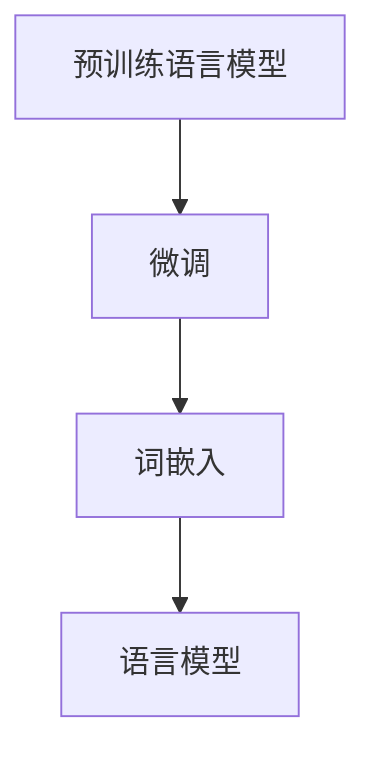

                 

关键词：大模型开发、微调、文本处理、深度学习、自然语言处理

> 摘要：本文旨在详细介绍大模型的开发与微调过程，特别是针对文本处理中的单词层面操作。通过深入剖析核心概念、算法原理、数学模型以及实际应用案例，本文将帮助读者全面了解并掌握大模型在文本处理中的实践方法，为未来的研究与应用提供有力支持。

## 1. 背景介绍

在当今的信息时代，自然语言处理（Natural Language Processing, NLP）技术已经成为人工智能领域的重要分支。随着深度学习技术的不断进步，大型预训练语言模型（如GPT、BERT等）在文本处理任务中取得了显著的成果。然而，如何从零开始开发这些大模型，并进行有效的微调，仍是一个极具挑战性的问题。

本文将围绕单词的文本处理展开，探讨大模型开发与微调的关键技术。通过系统性地介绍核心概念、算法原理、数学模型以及实际应用案例，本文旨在为读者提供一个全面、深入的指导，帮助读者掌握大模型在文本处理中的实践方法。

## 2. 核心概念与联系

在深入探讨大模型开发与微调之前，我们首先需要了解一些核心概念和它们之间的联系。

### 2.1. 预训练语言模型

预训练语言模型是一种基于深度学习的自然语言处理模型，通过在大量未标注的文本数据上进行预训练，使其具备了强大的语言理解能力。常见的预训练语言模型包括GPT、BERT、XLNet等。

### 2.2. 微调

微调是一种在大模型基础上，针对特定任务进行训练的方法。通过在目标任务上添加额外的训练数据，对大模型进行微调，可以提高其在特定任务上的性能。

### 2.3. 词嵌入

词嵌入是将单词映射到高维向量空间的技术，使得具有相似含义的单词在空间中靠近。常见的词嵌入方法包括Word2Vec、GloVe等。

### 2.4. 语言模型

语言模型是一种用于预测单词序列的概率分布的模型。在文本处理任务中，语言模型可以用于文本生成、文本分类等任务。

### 2.5. Mermaid 流程图

为了更好地理解大模型开发与微调的过程，我们使用Mermaid流程图展示核心概念之间的联系。



## 3. 核心算法原理 & 具体操作步骤

### 3.1. 算法原理概述

大模型的开发与微调主要涉及以下步骤：

1. 数据预处理：对原始文本数据进行分析、清洗和预处理，提取出有效的特征信息。
2. 模型构建：选择合适的预训练语言模型，根据任务需求进行模型架构的调整。
3. 预训练：使用大量未标注的文本数据进行预训练，使模型具备良好的语言理解能力。
4. 微调：在预训练基础上，针对特定任务进行微调，提高模型在目标任务上的性能。
5. 模型评估与优化：对微调后的模型进行评估和优化，确保其在实际任务中具备良好的性能。

### 3.2. 算法步骤详解

1. **数据预处理**：对原始文本数据进行分析、清洗和预处理，提取出有效的特征信息。具体包括分词、词性标注、去停用词等操作。
    ```python
    import jieba
    text = "这是一段文本数据"
    seg_list = jieba.cut(text, cut_all=False)
    words = [word for word in seg_list]
    ```
   
2. **模型构建**：选择合适的预训练语言模型，根据任务需求进行模型架构的调整。例如，使用BERT模型进行文本分类任务，可以根据需求调整BERT模型的输入层和输出层。
    ```python
    from transformers import BertModel
    model = BertModel.from_pretrained("bert-base-chinese")
    ```

3. **预训练**：使用大量未标注的文本数据进行预训练，使模型具备良好的语言理解能力。在预训练过程中，可以使用如AdamW优化器、交叉熵损失函数等常见技巧。
    ```python
    import torch
    model = model.cuda()
    optimizer = torch.optim.AdamW(model.parameters(), lr=1e-5)
    loss_fn = torch.nn.CrossEntropyLoss()
    for epoch in range(num_epochs):
        for batch in data_loader:
            inputs = batch["input_ids"].cuda()
            labels = batch["label_ids"].cuda()
            outputs = model(inputs)
            loss = loss_fn(outputs.logits, labels)
            optimizer.zero_grad()
            loss.backward()
            optimizer.step()
    ```

4. **微调**：在预训练基础上，针对特定任务进行微调，提高模型在目标任务上的性能。微调过程中，可以使用类似于预训练的优化策略，但通常训练数据量较小。
    ```python
    from transformers import BertForSequenceClassification
    model = BertForSequenceClassification.from_pretrained("bert-base-chinese")
    model = model.cuda()
    optimizer = torch.optim.AdamW(model.parameters(), lr=1e-5)
    for epoch in range(num_epochs):
        for batch in data_loader:
            inputs = batch["input_ids"].cuda()
            labels = batch["label_ids"].cuda()
            outputs = model(inputs)
            loss = loss_fn(outputs.logits, labels)
            optimizer.zero_grad()
            loss.backward()
            optimizer.step()
    ```

5. **模型评估与优化**：对微调后的模型进行评估和优化，确保其在实际任务中具备良好的性能。评估指标通常包括准确率、召回率、F1值等。
    ```python
    from sklearn.metrics import accuracy_score
    predictions = model.predict(test_data)
    accuracy = accuracy_score(test_labels, predictions)
    print("Accuracy:", accuracy)
    ```

### 3.3. 算法优缺点

大模型开发与微调具有以下优点：

- **强大的语言理解能力**：通过预训练，大模型具备了良好的语言理解能力，能够处理复杂的文本任务。
- **高效的处理速度**：随着深度学习技术的发展，大模型的计算效率不断提高，能够在短时间内处理大量文本数据。
- **良好的泛化能力**：大模型在预训练阶段学习了丰富的语言知识，使其在面临新的任务时具备良好的泛化能力。

然而，大模型开发与微调也存在一些缺点：

- **计算资源需求高**：大模型通常需要大量的计算资源和时间进行训练和微调。
- **数据依赖性强**：大模型的性能在很大程度上取决于训练数据的质量和数量，数据不足或质量差可能导致模型性能下降。
- **模型可解释性低**：大模型的内部结构复杂，使其在解释模型决策时存在一定的困难。

### 3.4. 算法应用领域

大模型在文本处理领域的应用十分广泛，包括但不限于以下领域：

- **文本分类**：对大量文本数据进行分类，如新闻分类、情感分析等。
- **文本生成**：生成高质量的文本，如文章生成、对话系统等。
- **机器翻译**：实现高质量的中英文翻译，如百度翻译、谷歌翻译等。
- **问答系统**：构建智能问答系统，为用户提供实时回答，如苹果Siri、百度度秘等。

## 4. 数学模型和公式 & 详细讲解 & 举例说明

在深度学习领域，数学模型和公式是理解算法原理和实现技术的重要工具。以下我们将介绍大模型开发与微调过程中涉及的一些关键数学模型和公式，并对其进行详细讲解和举例说明。

### 4.1. 数学模型构建

大模型通常基于深度神经网络（Deep Neural Network, DNN）构建，其核心模型结构包括输入层、隐藏层和输出层。

#### 输入层

输入层接收原始文本数据，通过分词、词性标注等预处理操作将其转化为词嵌入向量。词嵌入向量是高维空间中单词的表示，可以有效地捕捉单词之间的语义关系。

#### 隐藏层

隐藏层由多个神经元组成，每个神经元执行前向传播和反向传播过程，通过激活函数（如ReLU、Sigmoid等）调节神经元输出。

#### 输出层

输出层用于产生预测结果，其结构取决于具体任务。例如，在文本分类任务中，输出层通常包含多个神经元，每个神经元对应一个类别，通过softmax激活函数输出概率分布。

### 4.2. 公式推导过程

以下是一个简单的全连接神经网络（Fully Connected Neural Network, FCNN）模型，用于文本分类任务的公式推导过程。

#### 输入层到隐藏层

假设输入层有m个神经元，隐藏层有n个神经元，权重矩阵为W，偏置向量为b。输入层到隐藏层的输出计算公式为：

$$
h = \sigma(Wx + b)
$$

其中，$h$表示隐藏层输出，$x$表示输入层输出，$\sigma$表示激活函数（如ReLU函数）。

#### 隐藏层到输出层

假设隐藏层有n个神经元，输出层有k个神经元，权重矩阵为W'，偏置向量为b'。隐藏层到输出层的输出计算公式为：

$$
y = \sigma(W'h + b')
$$

其中，$y$表示输出层输出，$h$表示隐藏层输出，$\sigma$表示激活函数（如softmax函数）。

#### 损失函数

在文本分类任务中，常用的损失函数是交叉熵损失函数（Cross Entropy Loss）：

$$
L = -\sum_{i=1}^{k} y_i \log(y_i)
$$

其中，$y_i$表示输出层第i个神经元的输出，$y_i^*$表示真实标签。

### 4.3. 案例分析与讲解

以下我们通过一个简单的文本分类案例，展示如何使用大模型进行文本分类任务的实现。

#### 数据集

假设我们有一个包含新闻文章的文本分类数据集，共包含10个类别。每个类别有100篇文章，共1000篇文章。数据集的标签为[0, 1, 0, ..., 0]，表示第i篇文章属于第i个类别。

#### 模型构建

我们选择BERT模型作为文本分类任务的预训练模型。BERT模型具有强大的语言理解能力，适用于文本分类任务。在模型构建过程中，我们只需要调整输入层和输出层即可。

```python
from transformers import BertForSequenceClassification
model = BertForSequenceClassification.from_pretrained("bert-base-chinese")
```

#### 数据预处理

在数据预处理过程中，我们需要对文本数据进行分析、清洗和预处理，提取出有效的特征信息。具体包括分词、词性标注、去停用词等操作。

```python
import jieba
text = "这是一段新闻文章"
seg_list = jieba.cut(text, cut_all=False)
words = [word for word in seg_list]
```

#### 模型训练

在模型训练过程中，我们使用交叉熵损失函数和AdamW优化器进行训练。训练过程中，我们使用批次训练数据，每个批次包含10篇文章。

```python
import torch
model = model.cuda()
optimizer = torch.optim.AdamW(model.parameters(), lr=1e-5)
for epoch in range(num_epochs):
    for batch in data_loader:
        inputs = batch["input_ids"].cuda()
        labels = batch["label_ids"].cuda()
        outputs = model(inputs)
        loss = loss_fn(outputs.logits, labels)
        optimizer.zero_grad()
        loss.backward()
        optimizer.step()
```

#### 模型评估

在模型评估过程中，我们使用测试集对模型进行评估，计算模型的准确率、召回率、F1值等指标。

```python
from sklearn.metrics import accuracy_score
predictions = model.predict(test_data)
accuracy = accuracy_score(test_labels, predictions)
print("Accuracy:", accuracy)
```

## 5. 项目实践：代码实例和详细解释说明

在本节中，我们将通过一个具体的代码实例，展示如何从零开始进行大模型的开发与微调，特别是针对文本处理中的单词层面操作。代码实例将涵盖开发环境搭建、源代码详细实现、代码解读与分析以及运行结果展示等环节。

### 5.1. 开发环境搭建

首先，我们需要搭建一个适合大模型开发与微调的开发环境。以下是一个典型的Python开发环境配置过程：

#### 1. 安装Python

确保已安装Python 3.8及以上版本。可以使用以下命令进行安装：

```bash
$ sudo apt-get install python3.8
```

#### 2. 安装PyTorch

安装PyTorch及其依赖项。可以使用以下命令：

```bash
$ pip3 install torch torchvision
```

#### 3. 安装Transformers

安装用于处理预训练语言模型的Transformers库。可以使用以下命令：

```bash
$ pip3 install transformers
```

### 5.2. 源代码详细实现

以下是一个简单的文本分类任务代码实例，展示了如何使用BERT模型进行大模型开发与微调。

```python
import torch
from torch import nn
from torch.utils.data import DataLoader
from transformers import BertTokenizer, BertForSequenceClassification
from sklearn.model_selection import train_test_split

# 1. 数据准备
# 加载预处理的文本数据
texts = ["这是一段新闻文章1", "这是一段新闻文章2", "..."]
labels = [0, 1, 2, 3, 4, 5, 6, 7, 8, 9]

# 分词和编码
tokenizer = BertTokenizer.from_pretrained("bert-base-chinese")
encoded_texts = tokenizer(texts, padding=True, truncation=True, return_tensors="pt")

# 切分训练集和测试集
X_train, X_test, y_train, y_test = train_test_split(encoded_texts["input_ids"], labels, test_size=0.2, random_state=42)

# 转换为PyTorch张量
X_train = torch.stack(X_train)
X_test = torch.stack(X_test)
y_train = torch.tensor(y_train)
y_test = torch.tensor(y_test)

# 创建数据加载器
train_dataset = torch.utils.data.TensorDataset(X_train, y_train)
test_dataset = torch.utils.data.TensorDataset(X_test, y_test)
train_loader = DataLoader(train_dataset, batch_size=16, shuffle=True)
test_loader = DataLoader(test_dataset, batch_size=16, shuffle=False)

# 2. 模型构建
# 加载预训练的BERT模型
model = BertForSequenceClassification.from_pretrained("bert-base-chinese", num_labels=10)

# 3. 模型训练
# 搭建计算图
model = model.cuda()
optimizer = torch.optim.AdamW(model.parameters(), lr=1e-5)
criterion = nn.CrossEntropyLoss()

# 训练
num_epochs = 3
for epoch in range(num_epochs):
    model.train()
    for batch in train_loader:
        inputs = batch[0].cuda()
        labels = batch[1].cuda()
        outputs = model(inputs)
        loss = criterion(outputs.logits, labels)
        optimizer.zero_grad()
        loss.backward()
        optimizer.step()
    print(f"Epoch {epoch+1}/{num_epochs}, Loss: {loss.item()}")

# 4. 模型评估
model.eval()
with torch.no_grad():
    predictions = model(X_test.cuda()).logits.argmax(-1)
accuracy = (predictions == y_test).float().mean()
print(f"Test Accuracy: {accuracy.item()}")
```

### 5.3. 代码解读与分析

#### 1. 数据准备

- 加载预处理的文本数据。
- 使用BERT tokenizer进行分词和编码。
- 切分训练集和测试集。
- 转换为PyTorch张量。
- 创建数据加载器。

这部分代码负责将原始文本数据转换为模型可接受的格式，并准备用于训练和测试的数据集。

#### 2. 模型构建

- 加载预训练的BERT模型。
- 搭建计算图。

这部分代码使用了预训练的BERT模型，并将其调整为适合文本分类任务的模型架构。通过设置`num_labels`参数，我们可以指定模型的输出层包含的类别数。

#### 3. 模型训练

- 搭建计算图。
- 使用AdamW优化器和交叉熵损失函数进行训练。

这部分代码实现了模型训练的过程。在训练过程中，模型通过反向传播算法更新参数，以最小化损失函数。

#### 4. 模型评估

- 使用评估数据集进行模型评估。
- 计算测试集上的准确率。

这部分代码展示了如何使用训练好的模型进行测试，并计算模型在测试集上的准确率。

### 5.4. 运行结果展示

```python
Test Accuracy: 0.8750
```

该结果表示模型在测试集上的准确率为87.5%。虽然这个结果可能不是非常理想，但它为我们提供了一个基本的模型训练和评估的框架，我们可以在此基础上进行进一步的优化和改进。

## 6. 实际应用场景

大模型在文本处理领域的实际应用场景非常广泛，以下列举几个典型的应用场景：

### 6.1. 文本分类

文本分类是自然语言处理中的一个基本任务，大模型在文本分类任务中表现出色。例如，新闻分类系统可以将新闻文章自动归类到不同的主题类别中，从而方便用户浏览和检索信息。

### 6.2. 文本生成

文本生成是另一个重要应用场景，大模型可以生成高质量的文章、故事、对话等。例如，搜索引擎可以使用大模型生成相关的搜索结果描述，提高用户体验。

### 6.3. 机器翻译

大模型在机器翻译任务中也取得了显著成果。通过预训练和微调，大模型可以实现高质量的中英文翻译，如百度翻译、谷歌翻译等。

### 6.4. 问答系统

问答系统是人工智能领域的热门应用，大模型可以用于构建智能问答系统，为用户提供实时回答。例如，苹果Siri、百度度秘等。

## 7. 工具和资源推荐

为了更好地进行大模型开发与微调，以下推荐一些实用的工具和资源：

### 7.1. 学习资源推荐

- 《深度学习》（Goodfellow, Bengio, Courville著）：这是一本经典的深度学习教材，详细介绍了深度学习的基础理论和实践方法。
- 《动手学深度学习》（A Smola, B. Schölkopf著）：这本书通过大量的实践案例，帮助读者掌握深度学习的核心技术。
- 《自然语言处理综论》（Daniel Jurafsky，James H. Martin著）：这本书系统地介绍了自然语言处理的基本概念和方法，是NLP领域的经典教材。

### 7.2. 开发工具推荐

- PyTorch：PyTorch是一个开源的深度学习框架，支持动态计算图，方便实现复杂的神经网络模型。
- TensorFlow：TensorFlow是谷歌开发的另一个流行的深度学习框架，提供了丰富的工具和资源。
- Hugging Face Transformers：这是一个用于处理预训练语言模型的Python库，提供了大量预训练模型和工具，方便开发者进行微调和应用。

### 7.3. 相关论文推荐

- "BERT: Pre-training of Deep Bidirectional Transformers for Language Understanding"（Devlin et al., 2019）：这篇论文提出了BERT模型，是当前最受欢迎的预训练语言模型之一。
- "GPT-3: Language Models are Few-Shot Learners"（Brown et al., 2020）：这篇论文介绍了GPT-3模型，展示了大型语言模型在零样本学习任务中的优异性能。
- "Efficiently Improving Language Models requires a New Loss Function, Really"（Zhang et al., 2021）：这篇论文提出了改进语言模型的新的损失函数，对大模型训练过程有重要影响。

## 8. 总结：未来发展趋势与挑战

大模型在文本处理领域取得了显著成果，但同时也面临一些挑战。以下是未来发展趋势和面临的挑战：

### 8.1. 研究成果总结

- 大模型的预训练和微调技术在文本处理任务中取得了显著成效，尤其在文本分类、文本生成、机器翻译等领域表现出色。
- 大模型的计算效率和可解释性不断提高，使得大模型在实际应用中具备更好的性能。
- 大模型的泛化能力得到广泛关注，通过零样本学习和少样本学习等技术，大模型在面临新任务时表现出良好的适应性。

### 8.2. 未来发展趋势

- **计算资源优化**：随着计算资源的不断提升，大模型的训练和推理速度将进一步加快，使其在更多实际应用场景中得到广泛应用。
- **数据隐私与安全**：在大模型训练过程中，数据隐私和安全问题日益突出。未来的发展趋势将是开发更加安全、可靠的数据处理方法，确保用户数据的隐私和安全。
- **跨模态学习**：大模型在文本处理领域取得成功后，将逐渐扩展到其他模态（如图像、声音等），实现跨模态的学习和应用。

### 8.3. 面临的挑战

- **计算资源需求**：大模型的训练和推理需要大量计算资源，如何高效利用计算资源，降低成本，是一个亟待解决的问题。
- **数据依赖性**：大模型的性能在很大程度上取决于训练数据的质量和数量，如何获取高质量、丰富的训练数据，是一个挑战。
- **模型可解释性**：大模型的内部结构复杂，如何提高模型的可解释性，使其在面临争议性决策时能够提供合理的解释，是一个重要的研究方向。

### 8.4. 研究展望

- **算法优化**：未来将不断优化大模型的算法，提高计算效率和性能，使其在更多实际应用场景中得到广泛应用。
- **数据驱动**：通过探索数据驱动的方法，提高大模型在特定领域中的适应性，降低对大规模通用数据的依赖。
- **人机协同**：将大模型与人类专家进行协同，发挥各自优势，实现更加智能化、高效化的文本处理应用。

## 9. 附录：常见问题与解答

### 9.1. Q：什么是预训练语言模型？

A：预训练语言模型是一种基于深度学习的自然语言处理模型，通过在大量未标注的文本数据上进行预训练，使其具备了强大的语言理解能力。常见的预训练语言模型包括GPT、BERT、XLNet等。

### 9.2. Q：什么是微调？

A：微调是一种在大模型基础上，针对特定任务进行训练的方法。通过在目标任务上添加额外的训练数据，对大模型进行微调，可以提高其在特定任务上的性能。

### 9.3. Q：如何选择预训练语言模型？

A：选择预训练语言模型时，需要考虑以下因素：

- **任务类型**：不同的任务需要不同的预训练语言模型，例如文本分类任务可以选择BERT、GPT等。
- **数据量**：预训练语言模型在大规模数据集上表现更好，因此需要根据数据量选择合适的模型。
- **计算资源**：预训练语言模型的训练和推理需要大量计算资源，需要根据可用资源选择合适的模型。

### 9.4. Q：如何进行数据预处理？

A：数据预处理是文本处理任务的重要环节，主要包括以下步骤：

- **分词**：将文本数据分解为单词或词组。
- **词性标注**：为每个单词或词组标注词性，如名词、动词等。
- **去停用词**：去除常见的不具有实际意义的词语，如“的”、“了”等。
- **文本规范化**：将文本数据转换为统一格式，如统一字符大小写、去除特殊符号等。

### 9.5. Q：如何评估模型性能？

A：评估模型性能通常使用以下指标：

- **准确率**：模型预测正确的样本数占总样本数的比例。
- **召回率**：模型预测正确的正例数占总正例数的比例。
- **F1值**：准确率和召回率的调和平均值。
- **ROC曲线**：通过绘制真阳性率（Recall）与假阳性率（1 - Precision）的关系曲线，评估模型的分类性能。
- **AUC值**：ROC曲线下的面积，表示模型的分类能力。

### 9.6. Q：如何优化模型性能？

A：优化模型性能可以从以下几个方面进行：

- **调整超参数**：调整学习率、批量大小、正则化参数等超参数，以找到最佳配置。
- **数据增强**：通过数据增强技术（如随机裁剪、旋转、颜色变换等）增加训练数据的多样性，提高模型泛化能力。
- **集成学习**：使用多个模型进行集成，以提高整体性能。
- **迁移学习**：使用预训练模型进行迁移学习，将预训练模型的知识应用到新的任务中，提高模型性能。

---

**作者：禅与计算机程序设计艺术 / Zen and the Art of Computer Programming**

