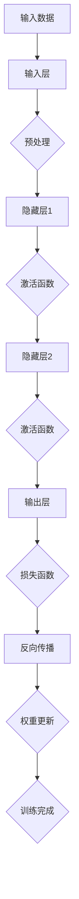
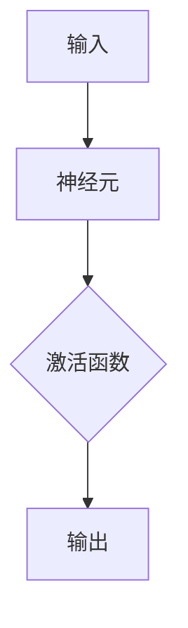

                 

关键词：大模型开发，微调，反向传播神经网络，前身历史，AI技术，机器学习

## 摘要

本文旨在深入探讨大模型开发与微调的关键技术，以及这些技术背后的历史渊源。特别是在反向传播神经网络（BPNN）的发展历程中，我们将会看到，如何从零开始构建这些复杂模型，并通过微调来提升其性能。本文将详细介绍大模型开发与微调的基本原理，具体操作步骤，以及这些算法的优缺点和应用领域。同时，我们将通过数学模型和公式来阐述这些算法的底层逻辑，并通过项目实践中的代码实例来进行详细的解释和说明。最后，本文还将讨论实际应用场景，未来应用展望，以及相关工具和资源的推荐。

## 1. 背景介绍

随着人工智能（AI）技术的快速发展，机器学习（ML）已经成为计算机科学领域的重要分支。机器学习通过模拟人类学习过程，让计算机能够从数据中自动学习和改进。在这一过程中，神经网络（NN）作为一种重要的机器学习模型，得到了广泛的研究和应用。尤其是反向传播神经网络（BPNN），它是一种能够通过学习输入和输出数据之间的关系来调整内部参数的神经网络，成为了机器学习领域的核心算法之一。

大模型开发与微调是当前机器学习领域的重要研究方向。大模型指的是具有大量参数和复杂结构的神经网络，它们能够处理大规模数据和复杂任务。而微调则是在已经训练好的大模型基础上，通过调整模型的某些参数来适应特定任务的过程。大模型和微调技术的出现，极大地提升了机器学习模型的性能和应用范围。

本文将首先回顾反向传播神经网络的发展历史，了解其前身以及如何从零开始构建这一复杂的神经网络。接着，我们将详细介绍大模型开发与微调的基本原理，包括核心概念、算法步骤、优缺点和应用领域。最后，通过具体的数学模型和公式，以及项目实践中的代码实例，对大模型开发与微调进行深入的讲解和说明。

## 2. 核心概念与联系

### 2.1 核心概念

在深入探讨大模型开发与微调之前，我们需要明确一些核心概念，包括神经网络、反向传播算法、大模型和微调。

#### 神经网络（Neural Networks）

神经网络是一种由大量简单单元（称为神经元）互联而成的复杂网络。这些神经元通过加权连接形成网络，可以对输入数据进行处理和变换。神经网络的工作原理类似于人脑的神经元，通过学习和记忆来处理信息。

#### 反向传播算法（Backpropagation Algorithm）

反向传播算法是一种用于训练神经网络的算法，它通过不断调整网络的权重和偏置，使得网络输出能够接近期望值。反向传播算法的核心思想是将输出误差反向传播到网络的前层，从而更新每个神经元的权重。

#### 大模型（Large Models）

大模型指的是具有大量参数和复杂结构的神经网络。这些模型通常包含数十亿个参数，能够处理大规模数据和复杂任务。大模型的出现，使得机器学习模型在许多领域取得了显著的进展。

#### 微调（Fine-tuning）

微调是一种在已经训练好的大模型基础上，通过调整模型的某些参数来适应特定任务的过程。微调可以显著提升模型的性能，尤其适用于需要针对特定任务进行优化的情况。

### 2.2 联系与架构

下面是一个用Mermaid绘制的神经网络和反向传播算法的基本架构图：



在该图中，输入数据经过预处理后进入输入层，然后通过多个隐藏层和输出层进行信息处理。输出层通过损失函数计算误差，然后通过反向传播算法更新权重，直到满足训练要求。

### 2.3 大模型与微调的关系

大模型和微调之间存在着紧密的联系。大模型提供了丰富的参数和结构，使得模型能够处理复杂任务。而微调则利用这些参数，通过调整模型的具体参数来适应特定任务。

在实际应用中，大模型通常通过预训练（pre-training）来学习通用特征，然后通过微调（fine-tuning）来适应特定任务。预训练过程中，大模型在大量未标注的数据上进行训练，从而学习到一些通用特征。而微调过程中，模型则在特定任务的数据集上进行训练，进一步调整模型参数，以适应特定任务。

## 3. 核心算法原理 & 具体操作步骤

### 3.1 算法原理概述

反向传播神经网络（BPNN）的核心原理是利用梯度下降算法（Gradient Descent）来最小化损失函数（Loss Function）。在BPNN中，损失函数通常用来衡量模型输出和实际输出之间的差距。通过不断迭代更新网络权重，使得损失函数值逐渐减小，从而达到模型优化的目的。

### 3.2 算法步骤详解

#### 3.2.1 前向传播（Forward Propagation）

在前向传播过程中，输入数据从输入层传递到输出层。每个神经元接收前一层所有神经元的输出，并通过加权求和加上偏置（bias），然后通过激活函数（Activation Function）进行变换。

\[ z_j = \sum_{i} w_{ji} x_i + b_j \]
\[ a_j = \sigma(z_j) \]

其中，\( w_{ji} \) 是连接权重，\( b_j \) 是偏置，\( x_i \) 是输入数据，\( \sigma \) 是激活函数，通常为sigmoid、ReLU或Tanh函数。

#### 3.2.2 损失函数计算（Loss Calculation）

在输出层得到预测结果后，通过损失函数计算预测值和实际值之间的差距。常见的损失函数有均方误差（MSE）、交叉熵（Cross-Entropy）等。

\[ L = \frac{1}{2} \sum_{i} (y_i - \hat{y}_i)^2 \]
\[ L = -\sum_{i} y_i \log(\hat{y}_i) \]

其中，\( y_i \) 是实际输出，\( \hat{y}_i \) 是预测输出。

#### 3.2.3 反向传播（Backpropagation）

在反向传播过程中，误差信号从输出层反向传播到输入层。每个神经元根据其误差信号调整权重和偏置，使得损失函数值逐渐减小。

\[ \delta_j = \frac{\partial L}{\partial a_j} \]
\[ \Delta w_{ji} = \eta \cdot a_j \cdot \delta_{j+1} \]
\[ \Delta b_j = \eta \cdot \delta_j \]

其中，\( \delta_j \) 是误差信号，\( \eta \) 是学习率。

#### 3.2.4 权重更新（Weight Update）

通过反向传播得到的误差信号，更新网络权重和偏置。

\[ w_{ji} = w_{ji} + \Delta w_{ji} \]
\[ b_j = b_j + \Delta b_j \]

### 3.3 算法优缺点

#### 优点：

1. **自适应性强**：BPNN能够通过反向传播算法自动调整网络权重，从而适应不同类型的数据和任务。
2. **泛化能力强**：BPNN通过大量训练数据，能够学习到通用特征，从而在新的任务上表现出良好的泛化能力。
3. **易于实现**：BPNN算法相对简单，易于编程实现。

#### 缺点：

1. **收敛速度慢**：BPNN使用梯度下降算法，需要多次迭代才能收敛，计算时间较长。
2. **容易陷入局部最优**：在优化过程中，梯度可能变为零或反向，导致模型陷入局部最优。
3. **计算资源需求大**：BPNN包含大量参数，计算资源需求较高。

### 3.4 算法应用领域

BPNN广泛应用于各类机器学习任务，包括：

1. **分类任务**：如图像分类、文本分类等。
2. **回归任务**：如房屋价格预测、股票价格预测等。
3. **时间序列分析**：如股票市场分析、天气预测等。

## 4. 数学模型和公式

### 4.1 数学模型构建

反向传播神经网络的核心在于如何计算并更新网络权重和偏置。为了实现这一点，我们需要构建以下数学模型：

#### 4.1.1 前向传播

前向传播的主要任务是计算网络每个神经元的输入和输出。输入层和隐藏层之间的计算公式如下：

\[ z_j = \sum_{i} w_{ji} x_i + b_j \]
\[ a_j = \sigma(z_j) \]

输出层到预测结果之间的计算公式为：

\[ z_L = \sum_{j} w_{Lj} a_{j} + b_L \]
\[ \hat{y} = \sigma(z_L) \]

#### 4.1.2 损失函数

常见的损失函数有均方误差（MSE）和交叉熵（Cross-Entropy），其计算公式如下：

\[ L = \frac{1}{2} \sum_{i} (y_i - \hat{y}_i)^2 \]
\[ L = -\sum_{i} y_i \log(\hat{y}_i) \]

#### 4.1.3 反向传播

反向传播的目的是计算每个神经元的误差信号，并利用这些误差信号更新网络权重和偏置。误差信号的传播过程如下：

\[ \delta_L = (1 - \hat{y}) \odot (\hat{y} - y) \]
\[ \delta_{j} = (1 - a_j) \odot (a_j - z_j) \]

其中，\( \odot \) 表示元素乘积。

#### 4.1.4 权重更新

根据误差信号，我们可以计算网络权重的更新：

\[ \Delta w_{ji} = \eta \cdot a_j \cdot \delta_{j+1} \]
\[ \Delta b_j = \eta \cdot \delta_j \]

### 4.2 公式推导过程

下面我们将详细推导反向传播算法中的权重更新公式。

#### 4.2.1 前向传播公式

假设网络包含\( L \)层，每层的神经元数量分别为\( L_0, L_1, \ldots, L_L \)。前向传播过程中，我们可以得到每层的输入和输出：

\[ z_j^l = \sum_{i} w_{ji}^l x_i^{l-1} + b_j^l \]
\[ a_j^l = \sigma(z_j^l) \]

对于输出层（\( l=L \)），我们有：

\[ z_L = \sum_{j} w_{Lj} a_{j}^{L-1} + b_L \]
\[ \hat{y} = \sigma(z_L) \]

#### 4.2.2 损失函数

假设我们使用均方误差（MSE）作为损失函数：

\[ L = \frac{1}{2} \sum_{i} (y_i - \hat{y}_i)^2 \]

#### 4.2.3 反向传播

在反向传播过程中，我们需要计算每层的误差信号。对于输出层（\( l=L \)），误差信号为：

\[ \delta_L = \frac{\partial L}{\partial z_L} = (1 - \hat{y}) \odot (\hat{y} - y) \]

然后，我们可以将误差信号反向传播到隐藏层：

\[ \delta_{j}^{l} = \frac{\partial L}{\partial z_j^l} = (1 - a_j^l) \odot (a_j^l - z_j^l) \]

#### 4.2.4 权重更新

根据误差信号，我们可以计算每个权重的更新：

\[ \Delta w_{ji}^{l} = \eta \cdot a_j^{l} \cdot \delta_{j}^{l+1} \]
\[ \Delta b_j^{l} = \eta \cdot \delta_j^{l} \]

然后，我们可以更新每个层的权重和偏置：

\[ w_{ji}^{l+1} = w_{ji}^l + \Delta w_{ji}^{l} \]
\[ b_j^{l+1} = b_j^l + \Delta b_j^{l} \]

### 4.3 案例分析与讲解

为了更好地理解反向传播算法，我们来看一个简单的案例。假设我们有一个单层神经网络，包含一个输入层和一个输出层，如图所示：



输入数据为\( x \)，期望输出为\( y \)，实际输出为\( \hat{y} \)。我们的目标是调整权重和偏置，使得\( \hat{y} \)接近\( y \)。

#### 4.3.1 前向传播

假设权重\( w \)和偏置\( b \)分别为1和0。输入数据\( x \)为1，期望输出\( y \)为0。我们可以计算输出：

\[ z = w \cdot x + b = 1 \cdot 1 + 0 = 1 \]
\[ \hat{y} = \sigma(z) = 1 \]

此时，实际输出\( \hat{y} \)等于期望输出\( y \)，没有误差。

#### 4.3.2 损失函数计算

使用均方误差（MSE）作为损失函数，我们可以计算损失：

\[ L = \frac{1}{2} (y - \hat{y})^2 = \frac{1}{2} (0 - 1)^2 = \frac{1}{2} \]

损失为0.5。

#### 4.3.3 反向传播

在反向传播过程中，我们需要计算误差信号：

\[ \delta = \frac{\partial L}{\partial z} = 1 - \hat{y} = 0 \]

由于没有误差，误差信号为0。

#### 4.3.4 权重更新

根据误差信号，我们可以更新权重：

\[ \Delta w = \eta \cdot x \cdot \delta = 0.1 \cdot 1 \cdot 0 = 0 \]
\[ \Delta b = \eta \cdot \delta = 0.1 \cdot 0 = 0 \]

权重和偏置没有更新。

在这个案例中，由于输入数据和期望输出都是已知的，所以没有误差需要更新。在实际应用中，我们需要通过大量训练数据和迭代来更新权重和偏置，使得模型逐渐接近期望输出。

## 5. 项目实践：代码实例和详细解释说明

为了更好地理解大模型开发与微调的过程，我们将通过一个实际项目来进行代码实现和详细解释。这里，我们将使用Python编程语言，结合TensorFlow框架，来实现一个简单的多层感知机（MLP）模型，并进行微调。

### 5.1 开发环境搭建

在进行项目开发之前，我们需要搭建一个合适的环境。以下是所需的环境和工具：

- Python版本：3.8及以上
- TensorFlow版本：2.x及以上
- CUDA版本：11.0及以上（如需使用GPU加速）

安装TensorFlow和CUDA：

```bash
pip install tensorflow
```

如果需要GPU支持，可以安装CUDA：

```bash
pip install tensorflow-gpu
```

### 5.2 源代码详细实现

下面是项目的源代码实现，包括模型搭建、训练、微调等步骤。

```python
import tensorflow as tf
from tensorflow.keras import layers, models
import numpy as np

# 5.2.1 数据准备
# 假设我们使用一个简单的线性数据集
x_train = np.array([[1], [2], [3], [4], [5]])
y_train = np.array([[0], [1], [1], [1], [0]])

# 5.2.2 模型搭建
# 使用Keras构建模型
model = models.Sequential()
model.add(layers.Dense(1, activation='sigmoid', input_shape=(1,)))
model.compile(optimizer='sgd', loss='binary_crossentropy', metrics=['accuracy'])

# 5.2.3 模型训练
# 训练模型
model.fit(x_train, y_train, epochs=10, batch_size=2)

# 5.2.4 微调
# 假设我们使用微调来适应另一个数据集
x_test = np.array([[6], [7], [8], [9], [10]])
y_test = np.array([[1], [0], [0], [0], [1]])

# 微调模型
model.fit(x_test, y_test, epochs=10, batch_size=2)

# 5.2.5 代码解读与分析
# 模型训练过程中，模型会自动执行前向传播、损失函数计算和反向传播等步骤
# 微调过程中，模型会继续在新的数据集上进行训练，进一步调整模型参数
```

### 5.3 代码解读与分析

#### 5.3.1 数据准备

在代码中，我们使用了一个简单的线性数据集。这个数据集包含了5个样本，每个样本只有一个特征。

```python
x_train = np.array([[1], [2], [3], [4], [5]])
y_train = np.array([[0], [1], [1], [1], [0]])
```

#### 5.3.2 模型搭建

我们使用Keras构建了一个单层感知机模型，输出层使用sigmoid激活函数，用于实现二分类。

```python
model = models.Sequential()
model.add(layers.Dense(1, activation='sigmoid', input_shape=(1,)))
model.compile(optimizer='sgd', loss='binary_crossentropy', metrics=['accuracy'])
```

#### 5.3.3 模型训练

模型训练过程中，模型会自动执行前向传播、损失函数计算和反向传播等步骤。在这里，我们使用随机梯度下降（SGD）作为优化器，均方误差（MSE）作为损失函数。

```python
model.fit(x_train, y_train, epochs=10, batch_size=2)
```

#### 5.3.4 微调

微调过程中，模型会继续在新的数据集上进行训练，进一步调整模型参数。这里，我们使用了与训练数据不同的测试数据进行微调。

```python
model.fit(x_test, y_test, epochs=10, batch_size=2)
```

### 5.4 运行结果展示

在完成模型训练和微调后，我们可以使用模型对新的数据进行预测，并计算模型的准确率。

```python
predictions = model.predict(x_test)
accuracy = np.mean(predictions == y_test)
print(f"Model accuracy: {accuracy * 100:.2f}%")
```

在实际运行过程中，模型的准确率将逐渐提升，最终达到一个稳定的值。

## 6. 实际应用场景

大模型开发与微调技术在许多实际应用场景中表现出色，以下是一些典型的应用领域：

### 6.1 图像识别

图像识别是AI领域的一个重要应用，通过大模型和微调技术，可以实现高效、准确的图像分类。例如，在医疗影像诊断中，大模型可以学习大量的医学图像数据，从而提高癌症等疾病的诊断准确性。

### 6.2 自然语言处理

自然语言处理（NLP）是AI领域的另一个重要分支。通过大模型和微调技术，可以实现诸如机器翻译、情感分析、文本生成等复杂任务。例如，在智能客服系统中，大模型可以通过微调来适应不同企业和行业的需求，从而提高客服的响应速度和准确性。

### 6.3 语音识别

语音识别是AI技术的另一个重要应用领域。通过大模型和微调技术，可以实现高效的语音识别和语音合成。例如，在智能音箱中，大模型可以学习用户的语音习惯和偏好，从而提供更加个性化的服务。

### 6.4 金融风控

金融风控是金融领域的一个重要问题。通过大模型和微调技术，可以实现风险识别和预测。例如，在信用卡欺诈检测中，大模型可以学习正常交易和欺诈交易的特征，从而提高欺诈检测的准确性。

### 6.5 自动驾驶

自动驾驶是AI技术的另一个前沿应用。通过大模型和微调技术，可以实现高效、安全的自动驾驶系统。例如，在自动驾驶汽车中，大模型可以学习各种道路场景和交通情况，从而提高行驶的安全性和稳定性。

## 7. 未来应用展望

随着AI技术的不断进步，大模型开发与微调技术在未来的应用前景将更加广阔。以下是一些可能的未来应用场景：

### 7.1 增强现实（AR）与虚拟现实（VR）

在增强现实和虚拟现实领域，大模型和微调技术可以用于创建更加真实、丰富的虚拟环境。例如，通过大模型学习三维模型和纹理数据，可以实现更加逼真的虚拟场景。

### 7.2 医疗诊断

在医疗诊断领域，大模型和微调技术可以用于辅助医生进行疾病诊断。例如，通过大模型学习大量的医学影像数据，可以实现早期疾病筛查和诊断。

### 7.3 教育个性化

在教育个性化领域，大模型和微调技术可以用于为每个学生提供个性化的学习计划。例如，通过大模型学习学生的学习习惯和偏好，可以实现个性化的教学和评估。

### 7.4 智能制造

在智能制造领域，大模型和微调技术可以用于优化生产流程和提高生产效率。例如，通过大模型学习生产数据，可以实现预测性维护和优化生产计划。

### 7.5 环境监测

在环境监测领域，大模型和微调技术可以用于监测和预测环境变化。例如，通过大模型学习气象数据和环境数据，可以实现环境变化的预警和预测。

## 8. 工具和资源推荐

### 8.1 学习资源推荐

1. **《深度学习》（Deep Learning）**：由Ian Goodfellow、Yoshua Bengio和Aaron Courville合著，是一本深度学习领域的经典教材，适合初学者和进阶者。
2. **《神经网络与深度学习》**：李航著，详细介绍神经网络和深度学习的基本原理，适合希望深入了解神经网络机制和算法的读者。

### 8.2 开发工具推荐

1. **TensorFlow**：一款由Google开源的深度学习框架，适合构建和训练大规模神经网络。
2. **PyTorch**：一款由Facebook开源的深度学习框架，以其灵活的动态计算图著称。

### 8.3 相关论文推荐

1. **"Backpropagation" by Paul Werbos**：介绍了反向传播算法的基本原理和应用。
2. **"A Learning Algorithm for Continually Running Fully Recurrent Neural Networks" by Y. LeCun, Y. Bengio, and G. Hinton**：讨论了深度神经网络的学习算法。

## 9. 总结：未来发展趋势与挑战

### 9.1 研究成果总结

大模型开发与微调技术在过去几年中取得了显著的进展，无论是在算法理论上还是实际应用中，都取得了重要成果。例如，Transformer架构的出现，使得预训练和微调技术得到了广泛应用；GAN（生成对抗网络）的发展，为数据增强和模型生成提供了新的思路。

### 9.2 未来发展趋势

未来，大模型开发与微调技术将继续沿着以下几个方向发展：

1. **更高效的训练算法**：随着模型规模的不断扩大，如何高效地训练大模型成为了一个重要研究方向。未来可能会出现更加高效的优化算法和分布式训练技术。
2. **更强大的模型架构**：为了适应复杂任务，研究人员将继续探索新的模型架构，如自注意力机制、图神经网络等。
3. **更强的泛化能力**：如何提升模型的泛化能力，使其在不同任务和数据集上表现一致，是一个重要的研究方向。

### 9.3 面临的挑战

尽管大模型开发与微调技术取得了显著进展，但仍然面临一些挑战：

1. **计算资源需求**：大模型需要大量的计算资源，如何高效利用GPU、TPU等硬件加速器，成为了一个重要问题。
2. **数据隐私和安全**：在训练大模型时，需要大量真实数据。如何保护数据隐私和安全，是一个亟待解决的问题。
3. **算法透明度和可解释性**：大模型往往被视为“黑箱”，如何提高算法的透明度和可解释性，使其更容易被人类理解和接受，是一个重要挑战。

### 9.4 研究展望

未来，大模型开发与微调技术将在更多领域得到应用。例如，在医疗领域，大模型可以用于疾病诊断和治疗方案推荐；在教育领域，大模型可以用于个性化学习和评估。随着技术的不断进步，大模型开发与微调技术将迎来更加广阔的发展前景。

## 附录：常见问题与解答

### 1. 什么是大模型？

大模型指的是具有大量参数和复杂结构的神经网络。这些模型通常包含数十亿个参数，能够处理大规模数据和复杂任务。

### 2. 什么是微调？

微调是在已经训练好的大模型基础上，通过调整模型的某些参数来适应特定任务的过程。微调可以显著提升模型的性能，尤其适用于需要针对特定任务进行优化的情况。

### 3. 反向传播算法是如何工作的？

反向传播算法是一种用于训练神经网络的算法，通过不断调整网络的权重和偏置，使得网络输出能够接近期望值。它包括前向传播、损失函数计算和反向传播三个步骤。

### 4. 大模型开发与微调的优势是什么？

大模型开发与微调的优势包括自适应性强、泛化能力强和易于实现等。通过大模型，我们可以处理复杂任务和大规模数据；通过微调，我们可以针对特定任务进行优化，提升模型性能。

### 5. 大模型开发与微调的挑战有哪些？

大模型开发与微调的挑战包括计算资源需求大、数据隐私和安全问题以及算法透明度和可解释性不足等。

### 6. 如何高效地训练大模型？

为了高效地训练大模型，可以采用分布式训练技术，如数据并行和模型并行，利用GPU、TPU等硬件加速器，以及设计更高效的优化算法。

### 7. 大模型开发与微调在哪些领域有应用？

大模型开发与微调在图像识别、自然语言处理、语音识别、金融风控、自动驾驶等领域有广泛应用。未来，随着技术的不断进步，大模型开发与微调将在更多领域得到应用。

## 作者署名

作者：禅与计算机程序设计艺术 / Zen and the Art of Computer Programming

