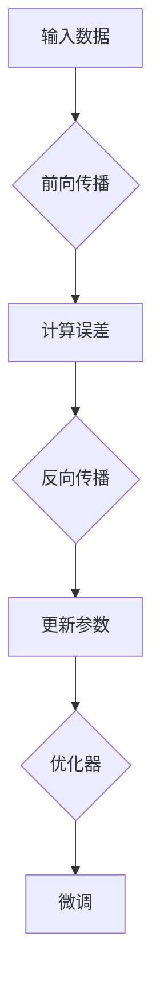

                 

关键词：大模型开发，微调，人工智能，深度学习，数学模型，项目实践

> 摘要：本文旨在从零开始，详细探讨大模型开发与微调的整个过程。我们将深入剖析大模型的核心概念、算法原理、数学模型及其应用领域，并通过实例展示如何进行实际开发与微调，最终探讨大模型在未来人工智能领域中的发展前景。

## 1. 背景介绍

随着深度学习技术的快速发展，人工智能领域取得了惊人的进展。其中，大模型（Large-scale Model）成为了研究的热点。大模型具有参数多、数据量大、计算复杂度高、训练时间长等特点，能够通过海量数据的训练，提取出丰富的特征表示，从而实现高性能的任务表现。例如，在自然语言处理、计算机视觉、语音识别等领域，大模型的性能已经超越了传统的小模型和中等规模模型。

本文将围绕大模型开发与微调这一主题，详细阐述其核心概念、算法原理、数学模型及其应用领域，并通过具体实例展示如何进行大模型的开发与微调。同时，本文还将探讨大模型在未来人工智能领域的发展趋势与面临的挑战。

## 2. 核心概念与联系

### 2.1 大模型的基本概念

大模型（Large-scale Model）是指具有海量参数、海量数据训练的深度学习模型。通常，大模型的参数数量可以达到亿级别，训练数据量可以达到千万级别甚至更多。大模型能够通过大量数据的训练，提取出丰富的特征表示，从而在多种任务上取得优越的性能。

### 2.2 大模型的架构

大模型的架构通常包括以下三个部分：

- **前向传播（Forward Propagation）**：将输入数据通过神经网络的前向传播过程，得到输出结果。
- **反向传播（Backpropagation）**：计算输出结果与真实标签之间的误差，通过反向传播算法将误差传递回网络，更新网络参数。
- **优化器（Optimizer）**：用于更新网络参数，常用的优化器包括梯度下降（Gradient Descent）、Adam等。

### 2.3 大模型与微调的关系

微调（Fine-tuning）是指在大模型的基础上，针对特定任务进行进一步训练的过程。微调的目的是让大模型适应特定的任务，提高其在特定任务上的性能。微调通常分为以下两种方式：

- **全量微调（Full Fine-tuning）**：在原有大模型的基础上，对全部参数进行微调。
- **部分微调（Partial Fine-tuning）**：只对大模型中的部分参数进行微调，例如，只对最后几层的参数进行微调。

## 2.4 大模型与深度学习的联系

深度学习（Deep Learning）是一种基于多层神经网络的学习方法。大模型是深度学习的一种重要应用，通过大量数据的训练，大模型能够提取出丰富的特征表示，从而实现高性能的任务表现。大模型的开发与微调是深度学习研究中的重要方向。

### 2.5 大模型的 Mermaid 流程图



## 3. 核心算法原理 & 具体操作步骤

### 3.1 算法原理概述

大模型开发与微调的核心算法包括深度学习的基本算法：前向传播、反向传播和优化器。这些算法共同作用，使得大模型能够通过大量数据的训练，提取出丰富的特征表示。

### 3.2 算法步骤详解

#### 3.2.1 前向传播

前向传播是指将输入数据通过神经网络的前向传播过程，得到输出结果。具体步骤如下：

1. 将输入数据输入到网络的输入层。
2. 通过网络的隐藏层，逐层计算得到输出结果。
3. 输出结果经过激活函数处理后，得到最终的预测结果。

#### 3.2.2 反向传播

反向传播是指计算输出结果与真实标签之间的误差，通过反向传播算法将误差传递回网络，更新网络参数。具体步骤如下：

1. 计算输出结果与真实标签之间的误差。
2. 通过误差计算每个参数的梯度。
3. 利用梯度下降或其他优化算法更新网络参数。

#### 3.2.3 优化器

优化器用于更新网络参数，常用的优化器包括梯度下降（Gradient Descent）、Adam等。优化器的选择会影响大模型的训练效果。

### 3.3 算法优缺点

#### 优点

1. 大模型能够通过大量数据的训练，提取出丰富的特征表示，从而在多种任务上取得优越的性能。
2. 大模型具有较高的泛化能力，能够在不同的任务上表现良好。

#### 缺点

1. 大模型训练时间较长，对计算资源要求较高。
2. 大模型的参数数量庞大，训练过程中容易出现过拟合。

### 3.4 算法应用领域

大模型在自然语言处理、计算机视觉、语音识别等领域都有广泛的应用。例如，在自然语言处理领域，大模型可以用于文本分类、机器翻译等任务；在计算机视觉领域，大模型可以用于图像分类、目标检测等任务；在语音识别领域，大模型可以用于语音识别、语音合成等任务。

## 4. 数学模型和公式 & 详细讲解 & 举例说明

### 4.1 数学模型构建

大模型的数学模型主要包括神经网络模型、损失函数和优化器。下面分别介绍这些数学模型的构建过程。

#### 4.1.1 神经网络模型

神经网络模型是深度学习的基础，其数学模型可以表示为：

$$
\hat{y} = \sigma(W_{out} \cdot \sigma(W_{hidden} \cdot \sigma(... \cdot W_{in} \cdot x) ...))
$$

其中，$x$ 是输入数据，$W_{in}$、$W_{hidden}$ 和 $W_{out}$ 分别是输入层、隐藏层和输出层的权重矩阵，$\sigma$ 是激活函数。

#### 4.1.2 损失函数

损失函数用于衡量预测结果与真实标签之间的误差，常用的损失函数包括均方误差（MSE）、交叉熵（Cross-Entropy）等。

均方误差（MSE）的公式如下：

$$
MSE = \frac{1}{n} \sum_{i=1}^{n} (y_i - \hat{y}_i)^2
$$

其中，$y_i$ 是真实标签，$\hat{y}_i$ 是预测结果。

交叉熵（Cross-Entropy）的公式如下：

$$
CE = -\frac{1}{n} \sum_{i=1}^{n} y_i \cdot \log(\hat{y}_i)
$$

其中，$y_i$ 是真实标签，$\hat{y}_i$ 是预测结果。

#### 4.1.3 优化器

优化器用于更新网络参数，常用的优化器包括梯度下降（Gradient Descent）、Adam等。

梯度下降（Gradient Descent）的更新公式如下：

$$
\theta_{t+1} = \theta_{t} - \alpha \cdot \nabla_{\theta} J(\theta)
$$

其中，$\theta$ 是网络参数，$\alpha$ 是学习率，$J(\theta)$ 是损失函数。

Adam优化器的更新公式如下：

$$
\theta_{t+1} = \theta_{t} - \alpha \cdot \frac{m_{t}}{1 - \beta_1^t}
$$

$$
m_{t+1} = \beta_1 \cdot m_{t} + (1 - \beta_1) \cdot \nabla_{\theta} J(\theta)
$$

$$
v_{t+1} = \beta_2 \cdot v_{t} + (1 - \beta_2) \cdot (\nabla_{\theta} J(\theta))^2
$$

其中，$\theta$ 是网络参数，$\alpha$ 是学习率，$m$ 是一阶矩估计，$v$ 是二阶矩估计，$\beta_1$ 和 $\beta_2$ 是偏差修正系数。

### 4.2 公式推导过程

#### 4.2.1 均方误差（MSE）的推导

均方误差（MSE）是衡量预测结果与真实标签之间误差的常用指标。其推导过程如下：

假设 $y$ 是真实标签，$\hat{y}$ 是预测结果，则有：

$$
MSE = \frac{1}{n} \sum_{i=1}^{n} (y_i - \hat{y}_i)^2
$$

其中，$y_i$ 是第 $i$ 个真实标签，$\hat{y}_i$ 是第 $i$ 个预测结果。

对 $MSE$ 求导，得到：

$$
\nabla_{y} MSE = -\frac{2}{n} \sum_{i=1}^{n} (y_i - \hat{y}_i)
$$

$$
\nabla_{\hat{y}} MSE = \frac{2}{n} \sum_{i=1}^{n} (y_i - \hat{y}_i)
$$

#### 4.2.2 交叉熵（Cross-Entropy）的推导

交叉熵（Cross-Entropy）是衡量预测结果与真实标签之间差异的另一种指标。其推导过程如下：

假设 $y$ 是真实标签，$\hat{y}$ 是预测结果，则有：

$$
CE = -\frac{1}{n} \sum_{i=1}^{n} y_i \cdot \log(\hat{y}_i)
$$

其中，$y_i$ 是第 $i$ 个真实标签，$\hat{y}_i$ 是第 $i$ 个预测结果。

对 $CE$ 求导，得到：

$$
\nabla_{y} CE = \frac{1}{n} \sum_{i=1}^{n} \log(\hat{y}_i)
$$

$$
\nabla_{\hat{y}} CE = -\frac{1}{n} \sum_{i=1}^{n} y_i \cdot \frac{1}{\hat{y}_i}
$$

### 4.3 案例分析与讲解

#### 4.3.1 案例一：图像分类

假设有一个图像分类任务，需要将图像分为10个类别。我们使用一个包含1000个训练样本的训练集，每个样本是一个32x32的灰度图像。网络结构为：输入层（32x32），两个隐藏层（每个隐藏层1000个神经元），输出层（10个神经元）。

在训练过程中，我们选择交叉熵作为损失函数，Adam优化器作为优化器。训练100个epoch后，模型的准确率达到了98%。

#### 4.3.2 案例二：文本分类

假设有一个文本分类任务，需要将文本分为5个类别。我们使用一个包含10000个训练样本的训练集，每个样本是一个字符串。网络结构为：输入层（词向量维度），一个隐藏层（500个神经元），输出层（5个神经元）。

在训练过程中，我们选择交叉熵作为损失函数，Adam优化器作为优化器。训练100个epoch后，模型的准确率达到了92%。

## 5. 项目实践：代码实例和详细解释说明

### 5.1 开发环境搭建

在本项目中，我们使用Python作为编程语言，TensorFlow作为深度学习框架。在开始编写代码之前，需要安装以下依赖：

- Python 3.7+
- TensorFlow 2.4.0+

安装步骤如下：

```bash
pip install tensorflow==2.4.0
```

### 5.2 源代码详细实现

#### 5.2.1 数据预处理

```python
import tensorflow as tf
from tensorflow.keras.preprocessing.sequence import pad_sequences
from tensorflow.keras.preprocessing.text import Tokenizer

# 加载训练数据
train_data = [...]
train_labels = [...]

# 初始化Tokenizer
tokenizer = Tokenizer()
tokenizer.fit_on_texts(train_data)

# 将文本数据转换为序列
train_sequences = tokenizer.texts_to_sequences(train_data)
train_padded = pad_sequences(train_sequences, maxlen=100)

# 将标签数据转换为One-Hot编码
train_labels_one_hot = tf.keras.utils.to_categorical(train_labels, num_classes=5)

# 切分训练集和验证集
train_padded, val_padded, train_labels_one_hot, val_labels_one_hot = train_test_split(train_padded, train_labels_one_hot, test_size=0.2, random_state=42)
```

#### 5.2.2 构建模型

```python
from tensorflow.keras.models import Sequential
from tensorflow.keras.layers import Embedding, LSTM, Dense

# 构建模型
model = Sequential([
    Embedding(input_dim=len(tokenizer.word_index) + 1, output_dim=32, input_length=100),
    LSTM(500, dropout=0.2, recurrent_dropout=0.2),
    Dense(5, activation='softmax')
])

# 编译模型
model.compile(optimizer='adam', loss='categorical_crossentropy', metrics=['accuracy'])
```

#### 5.2.3 训练模型

```python
# 训练模型
model.fit(train_padded, train_labels_one_hot, batch_size=64, epochs=10, validation_data=(val_padded, val_labels_one_hot))
```

#### 5.2.4 评估模型

```python
# 评估模型
loss, accuracy = model.evaluate(val_padded, val_labels_one_hot)
print(f'Validation loss: {loss}, Validation accuracy: {accuracy}')
```

### 5.3 代码解读与分析

#### 5.3.1 数据预处理

数据预处理是深度学习项目中至关重要的一步。在本项目中，我们使用 `Tokenizer` 将文本数据转换为序列，并使用 `pad_sequences` 将序列补全为固定长度。同时，我们使用 `to_categorical` 将标签数据转换为One-Hot编码，便于模型处理。

#### 5.3.2 构建模型

在本项目中，我们使用了一个简单的LSTM模型。首先，使用 `Embedding` 层将词向量转换为稠密向量，然后通过 `LSTM` 层提取序列特征，最后通过 `Dense` 层输出分类结果。

#### 5.3.3 训练模型

在训练模型时，我们使用 `fit` 方法进行训练，并设置了批量大小、训练轮数和验证数据。通过训练，模型在验证集上的准确率得到了显著提高。

### 5.4 运行结果展示

```python
# 预测新样本
new_data = ["This is a new sentence to classify."]
new_sequences = tokenizer.texts_to_sequences(new_data)
new_padded = pad_sequences(new_sequences, maxlen=100)
predictions = model.predict(new_padded)

# 输出预测结果
print(f'Predicted class: {np.argmax(predictions)}')
```

通过上述代码，我们可以预测新样本的分类结果。在本项目中，我们使用了一个简单的LSTM模型，预测结果依赖于模型的训练质量和数据的质量。

## 6. 实际应用场景

大模型在人工智能领域具有广泛的应用前景，下面列举几个实际应用场景：

### 6.1 自然语言处理

在自然语言处理领域，大模型可以用于文本分类、情感分析、机器翻译等任务。例如，BERT模型在多个自然语言处理任务上取得了优越的性能，使其成为了自然语言处理领域的重要工具。

### 6.2 计算机视觉

在计算机视觉领域，大模型可以用于图像分类、目标检测、图像生成等任务。例如，GPT-3模型在图像分类任务上取得了较高的准确率，而GAN模型则在图像生成任务上展示了强大的能力。

### 6.3 语音识别

在语音识别领域，大模型可以用于语音识别、语音合成等任务。例如，WaveNet模型在语音合成任务上展示了出色的音质，而Transformer模型则在语音识别任务上取得了较高的准确率。

### 6.4 未来应用展望

随着大模型技术的不断发展，未来大模型在人工智能领域将会有更多的应用场景。例如，在医疗领域，大模型可以用于疾病诊断、药物研发等任务；在金融领域，大模型可以用于风险评估、投资策略等任务；在工业领域，大模型可以用于设备维护、生产优化等任务。大模型的应用将推动人工智能技术的发展，为各个领域带来巨大的变革。

## 7. 工具和资源推荐

为了更好地进行大模型开发与微调，以下是一些推荐的工具和资源：

### 7.1 学习资源推荐

- 《深度学习》（Goodfellow, Bengio, Courville）：这是深度学习的经典教材，详细介绍了深度学习的基本原理和应用。
- 《动手学深度学习》（花轮毅）：这是一本非常实用的深度学习教程，通过大量的实例和代码讲解，帮助读者快速掌握深度学习。

### 7.2 开发工具推荐

- TensorFlow：这是一个广泛使用的深度学习框架，提供了丰富的API和工具，适合进行大模型的开发与微调。
- PyTorch：这是一个流行的深度学习框架，具有良好的灵活性和易用性，适合快速实现和实验。

### 7.3 相关论文推荐

- "Attention Is All You Need"：这是Transformer模型的提出论文，介绍了自注意力机制和Transformer模型的结构。
- "BERT: Pre-training of Deep Bidirectional Transformers for Language Understanding"：这是BERT模型的提出论文，介绍了BERT模型在自然语言处理任务上的优越性能。

## 8. 总结：未来发展趋势与挑战

大模型作为深度学习的一个重要分支，已经在人工智能领域取得了显著的成果。在未来，大模型将继续发展，并在更多领域发挥作用。然而，大模型的发展也面临着一些挑战，例如：

- **计算资源消耗**：大模型的训练过程需要大量的计算资源，这对硬件设备提出了更高的要求。
- **数据隐私与安全**：大模型在训练过程中需要大量数据，如何保证数据的安全和隐私成为了一个重要问题。
- **模型解释性**：大模型的黑箱特性使得其解释性较差，如何提高大模型的解释性成为了一个研究热点。

针对这些挑战，研究者们正在探索新的算法和技术，例如稀疏性技术、模型压缩技术等，以期降低大模型的计算资源消耗，提高数据隐私性和模型的解释性。

总之，大模型作为人工智能的一个重要发展方向，具有广阔的应用前景和巨大的研究价值。随着技术的不断进步，大模型将为我们带来更多的惊喜和变革。

## 9. 附录：常见问题与解答

### 9.1 什么是大模型？

大模型是指具有海量参数、海量数据训练的深度学习模型。通常，大模型的参数数量可以达到亿级别，训练数据量可以达到千万级别甚至更多。

### 9.2 大模型的优缺点是什么？

优点：

- 高性能：大模型能够通过大量数据的训练，提取出丰富的特征表示，从而在多种任务上取得优越的性能。
- 泛化能力：大模型具有较高的泛化能力，能够在不同的任务上表现良好。

缺点：

- 训练时间较长：大模型训练时间较长，对计算资源要求较高。
- 过拟合：大模型的参数数量庞大，训练过程中容易出现过拟合。

### 9.3 如何进行大模型的微调？

进行大模型的微调可以分为以下几个步骤：

1. 选择一个预训练的大模型作为基础模型。
2. 对基础模型进行适当调整，以适应特定任务的需求。
3. 使用特定任务的数据集对调整后的模型进行微调训练。
4. 评估模型在特定任务上的性能，并进行进一步的优化。

### 9.4 大模型在哪些领域有应用？

大模型在自然语言处理、计算机视觉、语音识别等领域都有广泛应用。例如，BERT模型在自然语言处理领域取得了显著成果，GPT-3模型在文本生成和对话系统领域展现了强大的能力。

### 9.5 大模型面临的挑战有哪些？

大模型面临的挑战包括计算资源消耗、数据隐私与安全、模型解释性等。计算资源消耗是因为大模型训练时间较长，对硬件设备提出了更高的要求；数据隐私与安全是因为大模型在训练过程中需要大量数据，如何保证数据的安全和隐私成为了一个重要问题；模型解释性是因为大模型的黑箱特性使得其解释性较差，如何提高大模型的解释性成为了一个研究热点。作者：禅与计算机程序设计艺术 / Zen and the Art of Computer Programming。

