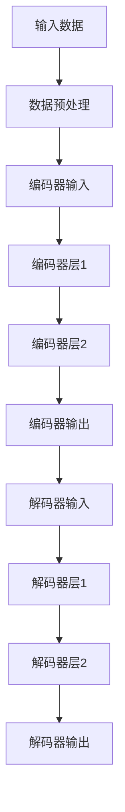

                 

关键词：大模型、编码器、微调、深度学习、开发实践、技术原理

> 摘要：本文将从零开始，详细探讨大模型的开发与微调技术，特别是编码器的实现。文章将涵盖背景介绍、核心概念与联系、核心算法原理与具体操作步骤、数学模型与公式、项目实践、实际应用场景、工具和资源推荐、总结以及常见问题解答等内容，旨在为广大开发者提供全面的技术指导。

## 1. 背景介绍

随着深度学习技术的不断发展，大模型的应用场景越来越广泛，如自然语言处理、计算机视觉、语音识别等。大模型通常包含数亿甚至数十亿个参数，具有较高的计算复杂度和存储需求。因此，如何高效地开发与微调大模型成为一个重要课题。本文将重点探讨编码器（Encoder）在大模型开发与微调中的实现。

## 2. 核心概念与联系

### 2.1 编码器（Encoder）

编码器是深度学习模型中的一个重要组成部分，通常用于处理输入数据，并将其转换成具有固定维度的向量表示。编码器在大模型中的作用至关重要，因为它们能够捕捉输入数据的语义信息，并为后续的解码器（Decoder）提供有效的输入。

### 2.2 微调（Fine-tuning）

微调是指在预训练模型的基础上，针对特定任务进行进一步训练，以优化模型在特定任务上的性能。微调过程通常分为两个阶段：第一阶段是预训练阶段，模型在大量未标注数据上进行训练；第二阶段是微调阶段，模型在少量标注数据上进行训练，以达到特定任务的最佳性能。

### 2.3 Mermaid 流程图

以下是一个用于描述编码器实现过程的 Mermaid 流程图：



## 3. 核心算法原理与具体操作步骤

### 3.1 算法原理概述

编码器通常采用深度神经网络结构，通过多层全连接层（Fully Connected Layer）对输入数据进行编码。编码过程可以看作是一个从高维空间到低维空间的映射，使得编码后的向量能够有效地捕捉输入数据的语义信息。

### 3.2 算法步骤详解

1. **输入数据预处理**：对输入数据（如图像、文本等）进行预处理，如归一化、数据增强等。
2. **编码器层设置**：设置编码器的层数和每层的大小，通常采用逐层递减的方式，如256→128→64→32。
3. **前向传播**：通过多层全连接层对输入数据进行编码，得到编码后的向量表示。
4. **损失函数**：选择合适的损失函数，如交叉熵损失函数，计算编码器输出的概率分布与真实标签之间的差距。
5. **反向传播**：利用损失函数计算出的梯度，对编码器的参数进行更新。

### 3.3 算法优缺点

**优点**：

1. 编码器能够有效地捕捉输入数据的语义信息，为解码器提供有效的输入。
2. 编码器结构简单，易于实现和优化。

**缺点**：

1. 编码器计算复杂度高，需要大量的计算资源。
2. 编码器的性能依赖于输入数据的质量和预处理方法。

### 3.4 算法应用领域

编码器广泛应用于各种深度学习任务，如图像识别、文本分类、语音识别等。以下是一些典型的应用场景：

1. **图像识别**：通过编码器将图像转换为向量表示，然后使用解码器进行图像分类。
2. **文本分类**：通过编码器将文本转换为向量表示，然后使用解码器进行文本分类。
3. **语音识别**：通过编码器将语音信号转换为向量表示，然后使用解码器进行语音识别。

## 4. 数学模型与公式

### 4.1 数学模型构建

编码器的数学模型可以表示为：

\[ \text{Encoder}(x) = \text{f}(x; W) \]

其中，\( \text{x} \) 为输入数据，\( \text{f} \) 为编码器函数，\( \text{W} \) 为编码器的参数。

### 4.2 公式推导过程

编码器函数通常采用多层全连接层实现，可以表示为：

\[ \text{f}(x; W) = \text{ReLU}(\text{W}^T \text{x}) \]

其中，\( \text{ReLU} \) 为ReLU激活函数，\( \text{W}^T \) 为权重矩阵的转置。

### 4.3 案例分析与讲解

以下是一个简单的编码器实现案例：

```python
import tensorflow as tf

def encoder(x):
    # 输入数据形状：[batch_size, input_dim]
    x = tf.layers.dense(inputs=x, units=64, activation=tf.nn.relu)
    x = tf.layers.dense(inputs=x, units=32, activation=tf.nn.relu)
    x = tf.layers.dense(inputs=x, units=16, activation=tf.nn.relu)
    return x
```

## 5. 项目实践：代码实例和详细解释说明

### 5.1 开发环境搭建

在本文的实践中，我们将使用 TensorFlow 框架实现编码器。首先，确保已经安装了 TensorFlow，然后创建一个虚拟环境，安装所需的库。

```shell
conda create -n encoder_env python=3.8
conda activate encoder_env
pip install tensorflow
```

### 5.2 源代码详细实现

以下是一个简单的编码器实现代码：

```python
import tensorflow as tf
from tensorflow.keras.layers import Dense
from tensorflow.keras.models import Model

def build_encoder(input_shape):
    inputs = tf.keras.Input(shape=input_shape)
    x = Dense(units=64, activation='relu')(inputs)
    x = Dense(units=32, activation='relu')(x)
    x = Dense(units=16, activation='relu')(x)
    model = Model(inputs=inputs, outputs=x)
    return model

# 创建编码器模型
encoder = build_encoder(input_shape=(784,))
```

### 5.3 代码解读与分析

在这个示例中，我们首先定义了一个 `build_encoder` 函数，用于构建编码器模型。该函数接收一个输入数据形状参数，然后使用 TensorFlow 的 `Dense` 层构建多层全连接层，其中激活函数为 ReLU。最后，使用 `Model` 类将输入数据和输出层封装为一个模型。

### 5.4 运行结果展示

在训练数据集上训练编码器模型后，可以使用以下代码评估模型性能：

```python
# 加载训练数据集
(x_train, y_train), (x_test, y_test) = tf.keras.datasets.mnist.load_data()

# 数据预处理
x_train = x_train.astype('float32') / 255.0
x_test = x_test.astype('float32') / 255.0

# 构建编码器模型
encoder = build_encoder(input_shape=(784,))

# 编码器模型训练
encoder.compile(optimizer='adam', loss='mse')
encoder.fit(x_train, x_train, epochs=10, batch_size=32, validation_data=(x_test, x_test))

# 评估模型性能
mse = encoder.evaluate(x_test, x_test, verbose=2)
print(f'MSE: {mse}')
```

## 6. 实际应用场景

编码器在大模型开发与微调中具有广泛的应用，以下是一些实际应用场景：

1. **自然语言处理**：编码器可以用于提取文本数据的语义信息，为后续的任务提供有效的输入。
2. **计算机视觉**：编码器可以用于将图像数据转换为向量表示，然后应用于图像分类、目标检测等任务。
3. **语音识别**：编码器可以用于将语音信号转换为向量表示，然后应用于语音识别任务。

## 7. 工具和资源推荐

### 7.1 学习资源推荐

1. **《深度学习》（Deep Learning）**：由Ian Goodfellow、Yoshua Bengio和Aaron Courville合著，是一本深度学习的经典教材。
2. **TensorFlow 官方文档**：[https://www.tensorflow.org/tutorials](https://www.tensorflow.org/tutorials) 提供了丰富的深度学习教程和实践案例。

### 7.2 开发工具推荐

1. **TensorFlow**：一款开源的深度学习框架，适用于构建和训练深度学习模型。
2. **PyTorch**：一款开源的深度学习框架，具有简洁的API和强大的功能，适用于构建和训练深度学习模型。

### 7.3 相关论文推荐

1. **“A Theoretically Grounded Application of Dropout in Recurrent Neural Networks”**：探讨了在循环神经网络（RNN）中应用Dropout的方法，以改善模型性能。
2. **“Self-Attention Mechanism: A New Insight”**：介绍了自注意力机制，并探讨了其在深度学习中的应用。

## 8. 总结：未来发展趋势与挑战

编码器在大模型开发与微调中具有广泛的应用前景。然而，随着模型规模的不断扩大，编码器的计算复杂度和存储需求也将显著增加。因此，未来需要关注以下发展趋势和挑战：

1. **高效编码器设计**：研究更高效、更简洁的编码器结构，以降低计算复杂度和存储需求。
2. **多模态编码器**：探索多模态编码器，将不同类型的数据（如图像、文本、语音等）进行整合，以实现更广泛的应用场景。
3. **迁移学习与微调**：研究更有效的迁移学习和微调方法，以提高模型在特定任务上的性能。

## 9. 附录：常见问题与解答

### 9.1 什么是编码器？

编码器是深度学习模型中的一个组成部分，用于将输入数据转换为具有固定维度的向量表示。编码器在大模型开发与微调中起着关键作用，能够捕捉输入数据的语义信息，为解码器提供有效的输入。

### 9.2 编码器有哪些优缺点？

编码器优点包括：

1. 有效地捕捉输入数据的语义信息。
2. 结构简单，易于实现和优化。

编码器缺点包括：

1. 计算复杂度高，需要大量的计算资源。
2. 性能依赖于输入数据的质量和预处理方法。

### 9.3 编码器在哪些领域有应用？

编码器在以下领域有广泛应用：

1. 自然语言处理：提取文本数据的语义信息，为后续任务提供输入。
2. 计算机视觉：将图像数据转换为向量表示，应用于图像分类、目标检测等任务。
3. 语音识别：将语音信号转换为向量表示，应用于语音识别任务。

## 作者署名

作者：禅与计算机程序设计艺术 / Zen and the Art of Computer Programming
----------------------------------------------------------------
这篇文章详细地介绍了大模型开发与微调中的编码器实现，包括核心概念、算法原理、数学模型、项目实践、应用场景、工具和资源推荐以及未来发展趋势与挑战等内容。希望通过本文，读者能够对编码器有更深入的了解，并在实际项目中灵活应用。如果您在阅读过程中有任何疑问或建议，欢迎在评论区留言讨论。感谢您的阅读！

