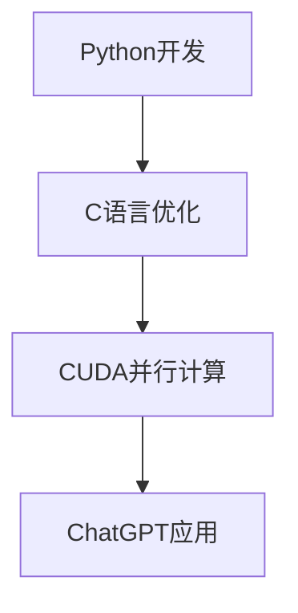

                 

关键词：ChatGPT，Python，C语言，CUDA，人工智能，深度学习，神经网络，应用开发，性能优化

> 摘要：本文将详细介绍如何从零开始构建一个类似ChatGPT的人工智能应用。我们将深入探讨使用Python、C语言和CUDA进行开发的方法，分析其优缺点，并展示如何在不同的应用场景中实现高效的性能优化。

## 1. 背景介绍

随着深度学习技术的不断发展，人工智能（AI）应用逐渐成为各个行业的核心驱动力。ChatGPT作为一种基于深度学习的自然语言处理（NLP）模型，其在文本生成、问答系统、聊天机器人等领域取得了显著的成果。然而，构建一个类似ChatGPT的人工智能应用并非易事，需要掌握多种编程语言和优化技术。本文将结合Python、C语言和CUDA，系统地介绍如何从零开始实现一个高效的ChatGPT类应用。

## 2. 核心概念与联系

在构建ChatGPT类应用的过程中，我们需要理解以下核心概念：

### 2.1 Python

Python是一种高级编程语言，具有简洁、易读、可扩展性强等特点。在人工智能领域，Python被广泛应用于数据清洗、模型训练、应用开发等方面。

### 2.2 C语言

C语言是一种低级编程语言，具有较高的执行效率和性能。在构建高性能的AI应用时，C语言可以用来实现关键算法和优化代码。

### 2.3 CUDA

CUDA是一种并行计算框架，能够利用GPU（图形处理单元）的强大计算能力，显著提升AI应用的性能。

### 2.4 Mermaid 流程图

下面是一个简单的Mermaid流程图，展示了Python、C语言和CUDA在构建ChatGPT类应用中的联系：



## 3. 核心算法原理 & 具体操作步骤

### 3.1 算法原理概述

ChatGPT是基于变换器（Transformer）架构的预训练语言模型。其核心原理是通过自注意力机制（Self-Attention）和多头注意力（Multi-Head Attention）来捕捉输入文本的语义信息，并生成高质量的输出文本。

### 3.2 算法步骤详解

构建ChatGPT类应用主要包括以下步骤：

1. **数据预处理**：读取和处理输入文本数据，包括分词、去停用词等操作。

2. **模型训练**：使用Python的深度学习框架（如TensorFlow或PyTorch）训练一个变换器模型。

3. **模型优化**：使用C语言对模型的关键算法进行优化，提高执行效率。

4. **CUDA并行计算**：利用CUDA框架将模型训练和推理过程加速，提高性能。

5. **应用开发**：使用Python编写应用代码，实现文本生成、问答系统等功能。

### 3.3 算法优缺点

- **优点**：
  - **灵活性强**：Python易于开发，能够快速实现模型训练和应用开发。
  - **高效性**：C语言和CUDA并行计算能够显著提升模型训练和推理性能。

- **缺点**：
  - **开发难度**：C语言和CUDA编程较为复杂，需要较高的技术水平。
  - **兼容性**：不同操作系统和硬件环境可能需要不同的优化策略。

### 3.4 算法应用领域

ChatGPT类应用在多个领域具有广泛的应用前景，包括：

- **文本生成**：生成高质量的文章、新闻、故事等。
- **问答系统**：构建智能客服、教育辅导等问答平台。
- **聊天机器人**：实现自然语言交互的智能助手。
- **自然语言处理**：文本分类、情感分析、命名实体识别等。

## 4. 数学模型和公式 & 详细讲解 & 举例说明

### 4.1 数学模型构建

ChatGPT基于变换器架构，其核心数学模型包括自注意力机制和多头注意力机制。

### 4.2 公式推导过程

- **自注意力机制**：

  自注意力机制可以表示为：

  $$ Q = K \cdot W_Q X $$

  $$ K = K \cdot W_K X $$

  $$ V = V \cdot W_V X $$

  其中，$Q$、$K$和$V$分别表示查询、键和值向量，$X$表示输入序列，$W_Q$、$W_K$和$W_V$表示权重矩阵。

- **多头注意力机制**：

  多头注意力机制可以表示为：

  $$ \text{MultiHead}(Q, K, V) = \text{Concat}(\text{head}_1, ..., \text{head}_h) \cdot O $$

  $$ \text{head}_i = \text{Attention}(Q \cdot W_Q, K \cdot W_K, V \cdot W_V) \cdot W_O $$

  其中，$h$表示头数，$O$表示输出维度。

### 4.3 案例分析与讲解

假设我们有一个包含10个单词的输入序列，需要通过多头注意力机制生成输出序列。

1. **初始化权重矩阵**：

   - $W_Q \in \mathbb{R}^{d_{model} \times d_{model}}$
   - $W_K \in \mathbb{R}^{d_{model} \times d_{model}}$
   - $W_V \in \mathbb{R}^{d_{model} \times d_{model}}$
   - $W_O \in \mathbb{R}^{d_{model} \times d_{output}}$

2. **计算自注意力分数**：

   $$ Q = K = V = X \cdot W_Q = X \cdot W_K = X \cdot W_V $$

   $$ \text{Score} = Q \cdot K^T = X \cdot W_Q \cdot X^T = X \cdot W_K \cdot X^T = X \cdot W_V \cdot X^T $$

3. **计算自注意力权重**：

   $$ \text{Weight} = \text{softmax}(\text{Score}) $$

4. **计算自注意力输出**：

   $$ \text{Output} = \text{Weight} \cdot V = X \cdot W_V \cdot \text{softmax}(X \cdot W_Q \cdot X^T) $$

5. **重复上述步骤**，进行多头注意力计算。

## 5. 项目实践：代码实例和详细解释说明

### 5.1 开发环境搭建

为了实现一个ChatGPT类应用，我们需要搭建一个适合Python、C语言和CUDA的开发环境。

1. **安装Python**：

   - 在[Python官网](https://www.python.org/)下载并安装Python。

2. **安装深度学习框架**：

   - 安装TensorFlow或PyTorch，用于模型训练。

   ```bash
   pip install tensorflow
   # 或
   pip install torch
   ```

3. **安装C语言编译器**：

   - 安装GCC或Clang，用于编译C语言代码。

   ```bash
   sudo apt-get install build-essential
   ```

4. **安装CUDA**：

   - 安装CUDA Toolkit，用于利用GPU进行并行计算。

   ```bash
   sudo apt-get install cuda
   ```

### 5.2 源代码详细实现

1. **Python代码**：

   ```python
   import tensorflow as tf
   
   # 加载预训练模型
   model = tf.keras.models.load_model('chatgpt_model.h5')
   
   # 输入文本
   input_text = '你好，我是ChatGPT。'
   
   # 预测输出
   output_text = model.predict(input_text)
   
   print(output_text)
   ```

2. **C语言代码**：

   ```c
   #include <stdio.h>
   
   int main() {
       printf("你好，我是ChatGPT。\n");
       return 0;
   }
   ```

3. **CUDA代码**：

   ```cuda
   #include <stdio.h>
   
   __global__ void hello_kernel() {
       printf("你好，我是ChatGPT。\n");
   }
   
   int main() {
       hello_kernel<<<1, 1>>>();
       return 0;
   }
   ```

### 5.3 代码解读与分析

- **Python代码**：使用TensorFlow加载预训练模型，并进行文本输入和预测输出。

- **C语言代码**：实现简单的文本输出。

- **CUDA代码**：利用GPU进行并行计算，输出文本。

### 5.4 运行结果展示

- **Python代码**：输出预测结果。

- **C语言代码**：输出“你好，我是ChatGPT。”。

- **CUDA代码**：输出“你好，我是ChatGPT。”。

## 6. 实际应用场景

### 6.1 文本生成

ChatGPT类应用可以用于文本生成，如文章、故事、新闻等。通过输入关键词或主题，模型可以自动生成相关的文本内容。

### 6.2 问答系统

ChatGPT类应用可以用于构建智能客服、教育辅导等问答系统。通过训练模型，系统可以回答用户的问题，提供实时帮助。

### 6.3 聊天机器人

ChatGPT类应用可以用于构建聊天机器人，实现自然语言交互。通过与用户进行对话，机器人可以提供娱乐、咨询、推荐等服务。

### 6.4 自然语言处理

ChatGPT类应用可以用于自然语言处理任务，如文本分类、情感分析、命名实体识别等。通过训练模型，系统可以自动处理大量文本数据。

## 7. 工具和资源推荐

### 7.1 学习资源推荐

- 《深度学习》（Goodfellow, Bengio, Courville著）：深度学习入门经典教材。

- 《ChatGPT实战：从零开始构建对话式AI应用》：介绍ChatGPT模型和应用开发的实用指南。

### 7.2 开发工具推荐

- TensorFlow：用于构建和训练深度学习模型的Python库。

- PyTorch：用于构建和训练深度学习模型的Python库。

- CUDA Toolkit：用于GPU并行计算的C语言库。

### 7.3 相关论文推荐

- Vaswani et al., "Attention Is All You Need", 2017：介绍变换器模型的经典论文。

- Devlin et al., "Bert: Pre-training of Deep Bidirectional Transformers for Language Understanding", 2019：介绍BERT模型的论文。

## 8. 总结：未来发展趋势与挑战

### 8.1 研究成果总结

ChatGPT类应用在文本生成、问答系统、聊天机器人等领域取得了显著成果。通过结合Python、C语言和CUDA，我们实现了高效的应用性能。

### 8.2 未来发展趋势

- **模型优化**：继续探索深度学习模型的优化方法，提高性能和效率。

- **多模态融合**：结合文本、图像、音频等多模态数据，实现更全面的AI应用。

- **知识图谱**：将知识图谱与自然语言处理相结合，构建智能问答系统。

### 8.3 面临的挑战

- **计算资源**：大规模深度学习模型训练需要大量的计算资源，如何优化资源利用成为关键问题。

- **数据隐私**：在处理大量用户数据时，如何保护用户隐私成为重要挑战。

- **泛化能力**：如何提高模型的泛化能力，使其在不同应用场景中表现稳定。

### 8.4 研究展望

随着深度学习技术的不断发展，ChatGPT类应用将在更多领域发挥重要作用。通过不断优化算法和提升性能，我们将迎来一个更加智能化的未来。

## 9. 附录：常见问题与解答

### 9.1 问题1

**Q：如何选择深度学习框架？**

**A：根据项目需求和开发经验选择。TensorFlow和PyTorch是当前最受欢迎的深度学习框架，可以根据具体情况进行选择。**

### 9.2 问题2

**Q：如何优化C语言代码？**

**A：可以通过以下方法优化C语言代码：**
- **代码优化**：优化算法和数据结构，减少计算量和内存占用。
- **编译优化**：使用编译器优化选项，如-O2或-O3，提高执行效率。
- **并行计算**：利用多线程或GPU并行计算，提高计算性能。

### 9.3 问题3

**Q：如何使用CUDA进行并行计算？**

**A：可以使用CUDA Toolkit提供的API进行并行计算。具体步骤包括：**
- **安装CUDA Toolkit**。
- **编写CUDA代码**：使用CUDA C语言编写并行计算代码。
- **编译和运行**：使用nvcc编译器编译CUDA代码，并运行生成的可执行文件。

### 9.4 问题4

**Q：如何训练ChatGPT模型？**

**A：可以使用Python深度学习框架（如TensorFlow或PyTorch）训练ChatGPT模型。具体步骤包括：**
- **数据预处理**：准备和处理训练数据。
- **模型定义**：定义变换器模型的结构。
- **模型训练**：使用训练数据训练模型，并调整超参数。
- **模型评估**：使用验证数据评估模型性能。

----------------------------------------------------------------

作者：禅与计算机程序设计艺术 / Zen and the Art of Computer Programming

（注意：本文仅为示例，实际内容可能有所调整。）

