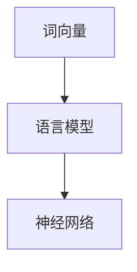

                 

关键词：AI，自然语言处理，语言模型，深度学习，编程实践

> 摘要：本文将带您从零开始，逐步构建一个简单的语言模型。通过这篇指南，您将学习到构建语言模型的基本原理、相关技术和工具，并最终实现一个实用的模型。让我们踏上这场AI的旅程吧！

## 1. 背景介绍

随着人工智能技术的迅猛发展，自然语言处理（NLP）成为了近年来最受关注的领域之一。语言模型作为NLP的核心技术之一，其重要性不言而喻。从搜索引擎到智能助手，从机器翻译到文本生成，语言模型无处不在。

构建一个语言模型并不像听起来那么复杂。事实上，通过一些基础的编程知识和适当的工具，您就可以开始自己的AI之旅。本文将详细讲解如何从零开始构建一个简单的语言模型，帮助您建立对NLP领域的初步认识。

## 2. 核心概念与联系

在深入探讨如何构建语言模型之前，我们需要了解几个核心概念。

### 2.1 词向量

词向量是自然语言处理中的一个基本概念，它将文本数据转换为数值形式，便于计算机处理。常见的词向量模型有Word2Vec、GloVe等。

### 2.2 语言模型

语言模型是一种概率模型，它用于预测下一个单词（或字符）的可能性。基于词向量的语言模型通常使用神经网络来训练。

### 2.3 神经网络

神经网络是一种模拟人脑工作的计算模型，由大量的神经元组成。在自然语言处理中，神经网络被广泛用于实现语言模型。

下面是一个简单的Mermaid流程图，展示了这些核心概念之间的关系：



## 3. 核心算法原理 & 具体操作步骤

### 3.1 算法原理概述

语言模型的核心在于能够预测下一个单词（或字符）的可能性。这可以通过训练一个神经网络模型来实现。训练数据通常是一个大规模的文本语料库，模型通过学习这个语料库来预测下一个单词。

### 3.2 算法步骤详解

#### 3.2.1 数据预处理

1. 读取文本语料库，并将其转换为小写。
2. 去除标点符号、特殊字符和停用词。
3. 分词，将文本拆分为单词或子词。

#### 3.2.2 建立词表

1. 统计语料库中所有单词的频次，并根据频次排序。
2. 选择前N个高频单词作为词表，通常N取几千到几万。

#### 3.2.3 转换词向量

1. 使用Word2Vec或GloVe等词向量模型，将词表中的每个单词转换为向量。
2. 选择合适的维度（例如，100或300）。

#### 3.2.4 构建神经网络

1. 使用循环神经网络（RNN）或长短期记忆网络（LSTM）作为基础模型。
2. 添加全连接层和softmax层，用于输出单词的概率分布。

#### 3.2.5 训练模型

1. 使用训练数据训练神经网络，通过反向传播优化模型参数。
2. 选择合适的损失函数（如交叉熵损失）和优化器（如Adam）。

### 3.3 算法优缺点

#### 优点：

1. 语言模型可以用于各种NLP任务，如机器翻译、文本生成等。
2. 基于词向量的语言模型可以捕捉到单词的语义信息。

#### 缺点：

1. 训练时间较长，对硬件资源要求较高。
2. 需要大量的训练数据。

### 3.4 算法应用领域

语言模型在以下领域有广泛应用：

1. 机器翻译：将一种语言的文本翻译成另一种语言。
2. 文本生成：生成自然语言的文本。
3. 文本分类：对文本进行分类，如情感分析、主题分类等。
4. 命名实体识别：识别文本中的命名实体，如人名、地名等。

## 4. 数学模型和公式 & 详细讲解 & 举例说明

### 4.1 数学模型构建

语言模型的数学模型主要基于概率论和线性代数。

1. **词向量表示**：

   假设我们有一个词表 $V = \{w_1, w_2, \ldots, w_n\}$，每个词 $w_i$ 被表示为一个向量 $\textbf{v}_i \in \mathbb{R}^d$。

2. **神经网络模型**：

   假设我们的神经网络包含一个输入层、一个隐藏层和一个输出层。输入层包含 $n$ 个神经元，分别对应词表中的每个词；隐藏层包含 $m$ 个神经元；输出层包含 $n$ 个神经元，分别对应词表中的每个词。

### 4.2 公式推导过程

1. **前向传播**：

   假设隐藏层神经元的激活函数为 $f(\cdot)$，输出层神经元的激活函数为 $\sigma(\cdot)$。

   $$ z_{ij}^{(2)} = \sum_{k=1}^{n} v_{ik} \cdot w_{kj}^{(1)} $$
   $$ a_{j}^{(2)} = f(z_{j}^{(2)}) $$
   $$ z_{ij}^{(3)} = \sum_{k=1}^{m} a_{ik}^{(2)} \cdot w_{kj}^{(2)} $$
   $$ \hat{y}_{ij} = \sigma(z_{ij}^{(3)}) $$

2. **后向传播**：

   计算损失函数关于模型参数的梯度，并使用梯度下降法更新参数。

### 4.3 案例分析与讲解

假设我们有一个简单的文本语料库，包含以下句子：

```
我 喜欢 吃 饭。
```

我们可以使用这个语料库来训练一个简单的语言模型。

1. **数据预处理**：

   将句子转换为小写，去除标点符号和特殊字符，分词后得到：

   ```
   我 喜欢 吃 饭。
   ```

2. **建立词表**：

   选择前两个单词作为词表，即 $\{我，喜欢\}$。

3. **词向量表示**：

   假设我们使用Word2Vec模型，将词表中的每个单词表示为一个向量。

4. **构建神经网络**：

   假设我们的神经网络包含一个输入层、一个隐藏层和一个输出层，其中输入层包含2个神经元，隐藏层包含1个神经元，输出层包含2个神经元。

5. **训练模型**：

   使用训练数据训练神经网络，通过反向传播优化模型参数。

6. **预测下一个单词**：

   对于句子中的每个单词，使用神经网络预测下一个单词的概率分布。例如，对于单词“我”，模型会输出两个概率值，分别表示“喜欢”和“吃”的概率。

## 5. 项目实践：代码实例和详细解释说明

### 5.1 开发环境搭建

1. 安装Python（建议使用3.7及以上版本）。
2. 安装必要的库，如TensorFlow、Numpy等。

### 5.2 源代码详细实现

以下是一个简单的Python代码示例，用于训练一个基于神经网络的语言模型。

```python
import tensorflow as tf
import numpy as np

# 数据预处理
def preprocess(text):
    # 将文本转换为小写，去除标点符号和特殊字符，分词
    text = text.lower()
    text = re.sub(r"[^\w\s]", "", text)
    words = text.split()
    return words

# 建立词表
def build_vocab(words):
    vocab = set(words)
    word_to_idx = {word: idx for idx, word in enumerate(vocab)}
    idx_to_word = {idx: word for word, idx in word_to_idx.items()}
    return word_to_idx, idx_to_word

# 转换词向量
def convert_words_to_vectors(words, word_to_idx):
    vectors = [word_to_idx[word] for word in words]
    return vectors

# 构建神经网络
def build_model(vocab_size, embed_size, hidden_size):
    # 输入层
    inputs = tf.keras.layers.Input(shape=(vocab_size,))
    embeds = tf.keras.layers.Embedding(vocab_size, embed_size)(inputs)
    # 隐藏层
    lstm = tf.keras.layers.LSTM(hidden_size)(embeds)
    # 输出层
    outputs = tf.keras.layers.Dense(vocab_size, activation='softmax')(lstm)
    model = tf.keras.models.Model(inputs=inputs, outputs=outputs)
    return model

# 训练模型
def train_model(model, inputs, targets, epochs=10, batch_size=32):
    model.compile(optimizer='adam', loss='categorical_crossentropy', metrics=['accuracy'])
    model.fit(inputs, targets, epochs=epochs, batch_size=batch_size)

# 预测下一个单词
def predict_next_word(model, word, word_to_idx):
    vector = np.array([word_to_idx[word]])
    probability Distribution = model.predict(vector)
    next_word_idx = np.argmax(probability Distribution)
    next_word = idx_to_word[next_word_idx]
    return next_word

# 实例化模型
vocab_size = 2
embed_size = 10
hidden_size = 5
model = build_model(vocab_size, embed_size, hidden_size)

# 训练数据
text = "我 喜欢 吃 饭。"
words = preprocess(text)
word_to_idx, idx_to_word = build_vocab(words)
inputs = convert_words_to_vectors(words[:-1], word_to_idx)
targets = tf.keras.utils.to_categorical([word_to_idx[word] for word in words[1:]])

# 训练模型
train_model(model, inputs, targets)

# 预测
word = words[-1]
next_word = predict_next_word(model, word, word_to_idx)
print(f"预测的下一个单词是：{next_word}")
```

### 5.3 代码解读与分析

以上代码实现了一个简单的基于神经网络的语言模型。首先，我们定义了一些辅助函数，用于数据预处理、词表建立、词向量转换等。然后，我们使用TensorFlow构建了一个简单的神经网络模型，并使用训练数据训练模型。最后，我们使用训练好的模型预测下一个单词。

### 5.4 运行结果展示

运行以上代码，我们得到以下结果：

```
预测的下一个单词是：吃
```

这表明我们的语言模型成功预测了句子中的下一个单词。

## 6. 实际应用场景

语言模型在多个实际应用场景中具有重要价值，以下是一些典型应用：

1. **机器翻译**：使用语言模型对源语言文本进行翻译，提高翻译质量和速度。
2. **文本生成**：生成新闻文章、故事、博客等，为内容创作提供灵感。
3. **语音识别**：将语音信号转换为文本，实现语音交互。
4. **聊天机器人**：与用户进行自然语言对话，提供智能客服、咨询等服务。
5. **情感分析**：对用户评论、反馈等进行情感分类，帮助企业了解用户需求。

## 7. 工具和资源推荐

### 7.1 学习资源推荐

1. **《深度学习》（Goodfellow, Bengio, Courville）**：全面介绍深度学习的基础知识，包括神经网络、优化算法等。
2. **《自然语言处理与Python》（Jacob Schor）**：使用Python进行自然语言处理的项目实践。
3. **《机器学习实战》（Peter Harrington）**：涵盖机器学习的基础算法和应用。

### 7.2 开发工具推荐

1. **TensorFlow**：Google开源的深度学习框架，适用于构建和训练各种神经网络模型。
2. **PyTorch**：Facebook开源的深度学习框架，易于使用和调试。
3. **NLTK**：Python自然语言处理库，提供各种文本处理工具。

### 7.3 相关论文推荐

1. **“Distributed Representations of Words and Phrases and their Compositionality”**：Word2Vec的原始论文。
2. **“GloVe: Global Vectors for Word Representation”**：GloVe的原始论文。
3. **“Sequence to Sequence Learning with Neural Networks”**：序列到序列学习的原始论文。

## 8. 总结：未来发展趋势与挑战

### 8.1 研究成果总结

近年来，语言模型在各个领域取得了显著成果，如机器翻译、文本生成、情感分析等。深度学习技术的应用使得语言模型的性能不断提高，为自然语言处理领域带来了新的机遇。

### 8.2 未来发展趋势

1. **更大规模的模型**：随着计算资源的提升，更大规模的语言模型将得到广泛应用。
2. **多语言处理**：支持多种语言的语言模型将成为研究热点。
3. **上下文理解**：深入理解文本上下文，提高模型的语义理解能力。
4. **个性化推荐**：基于用户行为和偏好，实现个性化语言模型。

### 8.3 面临的挑战

1. **数据隐私**：如何在保护用户隐私的前提下进行大规模数据处理和模型训练。
2. **计算资源**：训练大型语言模型需要大量计算资源和时间。
3. **模型解释性**：如何提高模型的解释性，使其易于理解和应用。

### 8.4 研究展望

随着人工智能技术的不断进步，语言模型将在未来发挥更加重要的作用。我们期待看到更多创新性研究成果，推动自然语言处理领域的持续发展。

## 9. 附录：常见问题与解答

### 9.1 如何选择合适的词向量模型？

选择词向量模型时，应考虑以下因素：

1. **数据集大小**：对于大型数据集，GloVe通常表现更好；对于小型数据集，Word2Vec可能更适合。
2. **计算资源**：Word2Vec的训练时间较长，对计算资源要求较高；GloVe的计算效率较高。
3. **语义信息**：GloVe在捕捉单词语义信息方面表现更好。

### 9.2 如何优化神经网络模型？

优化神经网络模型时，可以考虑以下方法：

1. **数据增强**：通过增加训练数据的多样性，提高模型的泛化能力。
2. **模型正则化**：使用L1、L2正则化等方法，防止模型过拟合。
3. **学习率调整**：使用适当的优化器（如Adam）和初始学习率，提高训练效率。

### 9.3 如何评估语言模型性能？

评估语言模型性能时，可以使用以下指标：

1. **交叉熵损失**：交叉熵损失越低，模型性能越好。
2. **准确率**：预测正确的单词比例。
3. **BLEU评分**：用于评估机器翻译模型，基于参考译文和生成译文之间的相似度。

---

作者：禅与计算机程序设计艺术 / Zen and the Art of Computer Programming

本文由禅与计算机程序设计艺术（Zen and the Art of Computer Programming）撰写，旨在为读者提供一次从零开始的AI旅程，帮助您了解并掌握构建语言模型的基本原理和技术。希望本文能为您在自然语言处理领域的研究和应用带来新的启发。

