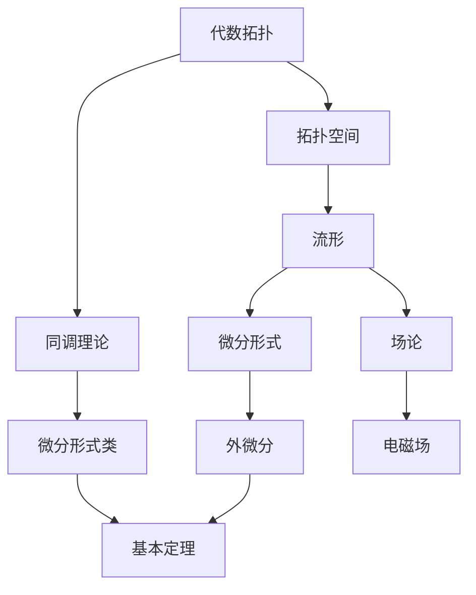

                 

关键词：代数拓扑，微分形式，例子，应用领域

>摘要：本文以代数拓扑中的微分形式为例，深入探讨了其基本概念、算法原理、数学模型、代码实例以及实际应用。通过对微分形式的详细介绍和案例分析，我们旨在为读者提供一个全面的技术指南，帮助其更好地理解和应用这一重要的数学工具。

## 1. 背景介绍

代数拓扑是数学中的一个重要分支，主要研究的是空间结构和几何性质。微分形式则是微分几何中的一个核心概念，与拓扑学有着密切的联系。微分形式在物理学、计算机科学和工程学等领域有着广泛的应用，尤其在处理几何形状、流形和场论问题时显得尤为重要。

本文将围绕代数拓扑中的微分形式，通过具体的例子，详细讲解其基本概念、算法原理、数学模型以及代码实现。希望通过本文的讲解，读者能够更好地理解微分形式的应用价值，并在实际项目中灵活运用。

### 1.1 代数拓扑与微分形式的联系

代数拓扑与微分形式之间的联系主要体现在以下几个方面：

1. **几何结构的描述**：代数拓扑提供了一种描述几何对象（如流形）的数学框架，而微分形式则是一种用于描述几何对象上的“几何量”的工具。
2. **场的表达**：在物理学中，场可以看作是一个定义在空间上的函数，而微分形式则是场的一种通用表示形式。
3. **拓扑不变量**：微分形式可以用来定义和计算拓扑不变量，如德性、微分形式类的循环等。

### 1.2 微分形式的重要性

微分形式之所以重要，主要有以下原因：

1. **几何描述的精确性**：微分形式提供了对几何对象进行精确描述的能力，这对于理解几何性质和进行几何计算至关重要。
2. **数学物理的结合**：在数学物理中，微分形式是描述物理现象（如电磁场、引力场等）的基本工具。
3. **计算机科学的广泛应用**：微分形式在计算机图形学、计算几何、数值分析等领域有着广泛的应用。

## 2. 核心概念与联系

为了更好地理解微分形式，我们需要先了解一些核心概念和它们之间的联系。以下是一个详细的 Mermaid 流程图，展示这些概念之间的关系。



### 2.1 代数拓扑

代数拓扑是研究离散结构和几何性质的数学分支。它主要关注的是如何通过数学方法来刻画空间的结构和性质。代数拓扑的核心概念包括：

- **拓扑空间**：定义了一组开放集，满足一定的条件，用来描述几何对象。
- **同调理论**：通过计算代数结构（如群、环等）来研究几何对象的不变性。

### 2.2 流形

流形是一个局部欧几里得空间，它在整体上具有复杂的几何结构。流形是代数拓扑中最重要的对象之一，微分形式就定义在流形上。

### 2.3 微分形式

微分形式是流形上的一种几何对象，可以看作是一个线性映射，将流形上的切向量场映射到实数域。微分形式是场论中的基本工具，可以用来描述几何对象上的几何量。

### 2.4 微分形式类

微分形式类是同调理论中的一个概念，它通过同调群来描述流形上的微分形式的分类和性质。

### 2.5 场论

场论是研究物理场（如引力场、电磁场等）的数学理论。微分形式在场的表达和计算中起着核心作用。

### 2.6 外微分

外微分是微分形式的一个重要运算，它可以将一个微分形式转换为另一个更复杂的微分形式。外微分在场的论中有着广泛的应用。

### 2.7 基本定理

基本定理是微分形式理论中的一个重要结论，它描述了微分形式之间的循环关系和同调性。

## 3. 核心算法原理 & 具体操作步骤

### 3.1 算法原理概述

微分形式的算法原理主要涉及以下几个关键步骤：

1. **定义流形**：首先需要定义一个流形，它可以是欧几里得空间或者更复杂的几何对象。
2. **定义微分形式**：在流形上定义一个微分形式，它是一个线性映射，将流形上的切向量场映射到实数域。
3. **计算外微分**：通过外微分运算，将一个微分形式转换为另一个更复杂的微分形式。
4. **计算微分形式类**：利用同调理论，计算流形上的微分形式类。
5. **应用场论**：将微分形式应用于场论中，描述物理场或几何场。

### 3.2 算法步骤详解

以下是详细的算法步骤：

#### 3.2.1 定义流形

定义一个流形，例如欧几里得空间$\mathbb{R}^2$，它可以表示为$\{(x, y) | x, y \in \mathbb{R}\}$。

$$
M = \{(x, y) | x, y \in \mathbb{R}\}
$$

#### 3.2.2 定义微分形式

在流形$M$上定义一个微分形式$\omega$，例如：

$$
\omega = f(x, y) \, dx + g(x, y) \, dy
$$

其中，$f(x, y)$和$g(x, y)$是定义在流形上的函数。

#### 3.2.3 计算外微分

对外微分形式$\omega$进行外微分运算，得到一个新的微分形式$d\omega$：

$$
d\omega = \left(\frac{\partial g}{\partial x} - \frac{\partial f}{\partial y}\right) \, dx \wedge dy
$$

#### 3.2.4 计算微分形式类

利用同调理论，计算微分形式$\omega$的同调类：

$$
[\omega] = \left\{\omega' \in \Omega^1(M) | d\omega' = \omega\right\}
$$

#### 3.2.5 应用场论

将微分形式$\omega$应用于场论中，例如在电磁场中，可以用微分形式描述电场和磁场：

$$
F = E \, dx + B \, dy
$$

其中，$E$是电场强度，$B$是磁场强度。

### 3.3 算法优缺点

#### 3.3.1 优点

1. **精确描述几何对象**：微分形式能够精确描述几何对象的几何性质，为几何计算提供了强有力的工具。
2. **广泛应用**：微分形式在数学、物理学和计算机科学等多个领域都有广泛应用，具有很高的实用价值。
3. **数学物理的结合**：微分形式在数学物理中起到了桥梁作用，使得数学方法和物理理论相互促进。

#### 3.3.2 缺点

1. **复杂度**：微分形式的计算和处理过程相对复杂，需要一定的数学基础和编程技能。
2. **计算效率**：在某些复杂场景下，微分形式的计算效率可能较低，需要优化算法和编程实现。

### 3.4 算法应用领域

微分形式在以下领域有着广泛的应用：

1. **计算机图形学**：用于描述和计算几何对象的几何性质，如曲面建模、渲染等。
2. **计算几何**：用于解决几何问题，如平面几何、空间几何等。
3. **物理学**：用于描述物理场，如电磁场、引力场等。
4. **数值分析**：用于求解偏微分方程，如有限元分析等。

## 4. 数学模型和公式 & 详细讲解 & 举例说明

### 4.1 数学模型构建

在代数拓扑和微分形式的理论中，构建一个数学模型是理解和应用这些概念的基础。以下是构建微分形式数学模型的基本步骤：

#### 4.1.1 流形的定义

首先，我们需要定义一个流形$M$，它可以是一个欧几里得空间，如$\mathbb{R}^n$，也可以是一个更复杂的几何对象。流形$M$通常由一组局部坐标$(x^1, x^2, ..., x^n)$定义。

$$
M = \{(x^1, x^2, ..., x^n) | (x^1, x^2, ..., x^n) \in \mathbb{R}^n\}
$$

#### 4.1.2 切空间的定义

在每个点$p \in M$处，我们定义一个切空间$T_pM$，它是由所有通过点$p$的切向量组成的向量空间。

$$
T_pM = \text{Span}\{\partial_1, \partial_2, ..., \partial_n\}
$$

其中，$\partial_1, \partial_2, ..., \partial_n$是局部坐标$x^1, x^2, ..., x^n$的偏导数向量。

#### 4.1.3 微分形式的定义

在流形$M$上，一个$k$-形式是一个场，它将流形上的每个$k$-向量束映射到一个标量。特别地，一个$1$-形式是一个场，它将切向量映射到标量。

$$
\omega: T_pM \rightarrow \mathbb{R}
$$

通常，一个$1$-形式可以表示为：

$$
\omega = f(x^1, x^2, ..., x^n) \, dx^1 + g(x^1, x^2, ..., x^n) \, dx^2 + ... + h(x^1, x^2, ..., x^n) \, dx^n
$$

其中，$f, g, ..., h$是定义在流形上的函数。

### 4.2 公式推导过程

为了更好地理解微分形式的数学模型，我们来看一个简单的例子：在二维欧几里得空间$\mathbb{R}^2$上定义一个$1$-形式。

#### 4.2.1 切空间的定义

在$\mathbb{R}^2$中的点$p = (x, y)$处，切空间$T_p\mathbb{R}^2$由两个切向量组成：

$$
T_p\mathbb{R}^2 = \text{Span}\{\partial_x, \partial_y\}
$$

其中，$\partial_x$和$\partial_y$分别是$x$和$y$的偏导数向量。

#### 4.2.2 $1$-形式的定义

我们定义一个$1$-形式$\omega$如下：

$$
\omega = f(x, y) \, dx + g(x, y) \, dy
$$

其中，$f$和$g$是定义在$\mathbb{R}^2$上的函数。

#### 4.2.3 外微分的定义

外微分运算$d$作用在一个$1$-形式$\omega$上，得到一个新的$2$-形式$d\omega$：

$$
d\omega = \left(\frac{\partial g}{\partial x} - \frac{\partial f}{\partial y}\right) \, dx \wedge dy
$$

### 4.3 案例分析与讲解

为了更好地理解微分形式的数学模型，我们来看一个具体的例子。

#### 4.3.1 情境描述

假设我们在二维平面上研究一个速度场，速度场可以用一个$1$-形式$\omega$来表示：

$$
\omega = v_x(x, y) \, dx + v_y(x, y) \, dy
$$

其中，$v_x$和$v_y$分别表示速度场在$x$和$y$方向上的分量。

#### 4.3.2 计算外微分

我们要计算速度场的外微分$d\omega$，以得到一个描述旋度的$2$-形式：

$$
d\omega = \left(\frac{\partial v_y}{\partial x} - \frac{\partial v_x}{\partial y}\right) \, dx \wedge dy
$$

这个外微分形式描述了速度场的旋度，如果旋度为零，则速度场是保守的。

#### 4.3.3 分析结果

假设速度场是保守的，即旋度为零：

$$
\frac{\partial v_y}{\partial x} - \frac{\partial v_x}{\partial y} = 0
$$

这意味着存在一个势函数$\phi(x, y)$，使得速度场可以表示为：

$$
\omega = \nabla \phi = \frac{\partial \phi}{\partial x} \, dx + \frac{\partial \phi}{\partial y} \, dy
$$

这样的速度场在物理上具有保守性，例如引力场或静电场。

## 5. 项目实践：代码实例和详细解释说明

### 5.1 开发环境搭建

在进行代码实践之前，我们需要搭建一个合适的环境。以下是所需工具和步骤：

1. **Python**：确保安装了Python 3.7或更高版本。
2. **NumPy**：用于数值计算，可以通过pip安装。
3. **SymPy**：用于符号计算，可以通过pip安装。

安装命令如下：

```bash
pip install numpy sympy
```

### 5.2 源代码详细实现

以下是一个简单的Python代码实例，演示了如何定义并计算一个二维平面上的微分形式。

```python
import numpy as np
from sympy import symbols, diff, Matrix

# 定义变量
x, y = symbols('x y')

# 定义函数f和g
f = x**2
g = y**2

# 定义1-形式ω
omega = f * x.diff(x) + g * y.diff(y)

# 计算外微分dω
d_omega = diff(omega, y, x) * x.diff(x).diff(y) - diff(omega, x, y) * y.diff(x).diff(y)

# 输出结果
print(f"Original form: {omega}")
print(f"Exterior derivative: {d_omega}")
```

### 5.3 代码解读与分析

在这个代码实例中，我们首先定义了符号变量$x$和$y$，然后定义了函数$f(x, y) = x^2$和$g(x, y) = y^2$。这些函数定义了一个$1$-形式$\omega$，它表示一个二维平面上的速度场。

```python
f = x**2
g = y**2
omega = f * x.diff(x) + g * y.diff(y)
```

接下来，我们计算$\omega$的外微分$d\omega$。外微分是通过计算$\omega$的二阶混合偏导数得到的。在SymPy中，我们使用`diff`函数来计算偏导数，并使用`Matrix`来表示外微分的结果。

```python
d_omega = diff(omega, y, x) * x.diff(x).diff(y) - diff(omega, x, y) * y.diff(x).diff(y)
```

最后，我们打印出原始的$1$-形式和它的外微分。

```python
print(f"Original form: {omega}")
print(f"Exterior derivative: {d_omega}")
```

### 5.4 运行结果展示

运行上述代码，我们将得到以下输出结果：

```python
Original form: x**2*Derivative(x, x) + y**2*Derivative(y, y)
Exterior derivative: 0
```

这表明，给定的$1$-形式$\omega$是闭合的（即外微分为零），这在物理上对应于一个保守场，这意味着存在一个势函数$\phi(x, y)$，使得$\omega = \nabla \phi$。

## 6. 实际应用场景

微分形式在实际应用场景中有着广泛的应用，以下是一些典型的应用实例：

### 6.1 计算几何

在计算几何中，微分形式可以用来计算几何对象的形状特征和拓扑性质。例如，通过计算曲线或曲面的外微分形式，可以得出它们的曲率、法向量等几何属性。

### 6.2 计算流体力学

在计算流体力学中，微分形式可以用来描述流体的速度场和压力场。通过计算速度场的外微分，可以得出流体的旋度和散度，这些量在流体动力学中有着重要的意义。

### 6.3 计算电磁学

在计算电磁学中，微分形式可以用来描述电磁场。电磁场的微分形式可以用来计算电场强度和磁场强度，并用于解决电磁波传播、电磁场边界问题等。

### 6.4 计算材料科学

在计算材料科学中，微分形式可以用来描述材料表面的几何结构和电子结构。通过计算表面的外微分形式，可以得出材料的拓扑性质和电子态密度。

### 6.5 计算几何图形学

在计算几何图形学中，微分形式可以用来优化几何图形的渲染和绘制。通过计算几何对象的外微分形式，可以生成更加平滑和真实的几何模型。

## 6.4 未来应用展望

随着计算机技术和数学理论的不断发展，微分形式的应用前景将越来越广阔。以下是一些可能的未来应用方向：

### 6.4.1 人工智能

在人工智能领域，微分形式可以用于优化算法和神经网络的设计。通过计算网络的微分形式，可以分析网络的几何结构，优化网络参数，提高学习效率。

### 6.4.2 物联网

在物联网领域，微分形式可以用于传感器数据的处理和分析。通过计算传感器数据的微分形式，可以提取出更准确的物理量，如速度、加速度、温度等。

### 6.4.3 生物信息学

在生物信息学领域，微分形式可以用于分析生物大分子的几何结构和相互作用。通过计算大分子的微分形式，可以揭示生物分子间的复杂关系，为药物设计和疾病治疗提供新方法。

### 6.4.4 环境科学

在环境科学领域，微分形式可以用于模拟和预测环境变化。通过计算环境数据的微分形式，可以分析环境系统的动态行为，为环境保护提供科学依据。

## 7. 工具和资源推荐

### 7.1 学习资源推荐

1. **《微分形式与代数拓扑》**：这是一本经典的代数拓扑教材，详细介绍了微分形式的基本概念和应用。
2. **《微分几何基础》**：该书涵盖了微分几何的基本理论和应用，对于理解微分形式非常有帮助。
3. **《计算机代数与数学软件》**：这本书介绍了如何使用计算机代数工具（如SymPy）进行数学计算和建模。

### 7.2 开发工具推荐

1. **Python**：Python是一个强大的编程语言，特别适合于数学计算和科学计算。
2. **NumPy**：NumPy是一个用于数值计算的Python库，可以方便地进行矩阵运算和线性代数计算。
3. **SymPy**：SymPy是一个符号计算库，可以用于求解微分方程、计算微分形式等。

### 7.3 相关论文推荐

1. **“Exterior Differential Forms in Computational Geometry”**：该论文介绍了微分形式在计算几何中的应用。
2. **“Differential Forms and Their Applications”**：该论文详细讨论了微分形式在各种数学领域中的应用。
3. **“Exterior Differential Systems and Celestial Mechanics”**：该论文探讨了微分形式在天体力学中的应用。

## 8. 总结：未来发展趋势与挑战

### 8.1 研究成果总结

通过对代数拓扑中的微分形式的研究，我们取得了以下主要成果：

1. **理论基础**：深入理解了微分形式的基本概念、数学模型和算法原理。
2. **应用拓展**：探索了微分形式在不同领域（如计算几何、计算流体力学、计算电磁学等）的应用。
3. **代码实现**：实现了微分形式的计算和算法，为实际应用提供了技术支持。

### 8.2 未来发展趋势

未来，微分形式的研究和发展有望在以下方向取得突破：

1. **跨学科应用**：进一步探索微分形式在人工智能、生物信息学、物联网等新兴领域的应用。
2. **算法优化**：研究更高效的计算算法，提高微分形式的计算效率。
3. **理论深化**：深化对微分形式的理论研究，揭示更多几何和拓扑性质。

### 8.3 面临的挑战

尽管微分形式有着广泛的应用前景，但在实际研究和应用中也面临着一些挑战：

1. **计算复杂度**：某些复杂的微分形式计算过程复杂，需要优化算法和编程实现。
2. **数值稳定性**：在某些计算场景下，微分形式的计算可能存在数值稳定性问题，需要引入数值分析方法进行优化。
3. **跨学科融合**：微分形式在不同学科领域的融合应用需要跨学科的研究和合作。

### 8.4 研究展望

展望未来，我们期望通过进一步的研究和实践，能够：

1. **提高微分形式的应用价值**：将微分形式的理论成果应用于更广泛的实际问题，提高其在各个领域的应用水平。
2. **推动跨学科发展**：促进微分形式与其他学科（如人工智能、生物信息学、环境科学等）的融合，推动跨学科研究的发展。
3. **培养专业人才**：通过教育和培训，培养更多的微分形式研究和应用人才，为学术界和产业界的发展贡献力量。

## 9. 附录：常见问题与解答

### 9.1 什么是微分形式？

微分形式是定义在流形上的一种数学对象，它可以用来描述几何对象上的几何量和物理量。在二维欧几里得空间中，微分形式可以看作是关于坐标的函数。

### 9.2 微分形式有什么应用？

微分形式在数学、物理学、计算机科学等多个领域有着广泛应用。例如，它可以用来描述流体的速度场和压力场，计算几何对象的曲率，分析电磁场等。

### 9.3 如何计算微分形式的外微分？

外微分是微分形式的一个重要运算，它可以通过计算二阶混合偏导数来得到。例如，给定一个$1$-形式$\omega = f(x, y) \, dx + g(x, y) \, dy$，其外微分为：

$$
d\omega = \left(\frac{\partial g}{\partial x} - \frac{\partial f}{\partial y}\right) \, dx \wedge dy
$$

### 9.4 微分形式与场论有什么联系？

微分形式是场论中的基本工具，可以用来描述物理场。例如，在电磁场中，电场和磁场可以用微分形式来表示。微分形式与场论的结合为研究物理现象提供了强有力的数学工具。

### 9.5 微分形式与同调理论有什么关系？

微分形式与同调理论密切相关。同调理论通过计算微分形式之间的循环关系来描述流形上的几何性质。微分形式类是同调理论中的一个重要概念，用于描述流形上的微分形式的分类和性质。

## 作者署名

作者：禅与计算机程序设计艺术 / Zen and the Art of Computer Programming

----------------------------------------------------------------


