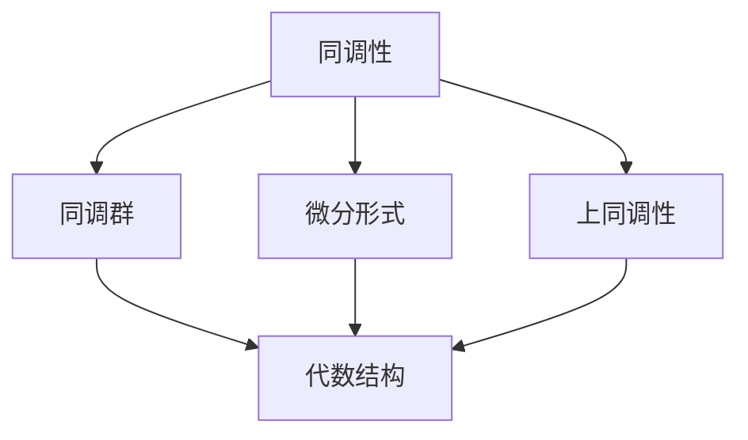

                 

代数拓扑作为数学的一个分支，不仅在纯数学领域内发挥着重要作用，也逐渐渗透到计算机科学的多个子领域中。微分形式，是代数拓扑中的一个核心概念，其作为一种形式化的数学语言，被广泛应用于几何、物理和计算机图形学等领域。本文将探讨微分形式在代数拓扑中的核心概念和应用实例，通过具体案例来展示其独特性和广泛应用。

## 1. 背景介绍

微分形式（Differential Forms）起源于19世纪的数学家外尔斯特拉斯（Gustav Robert Kirchhoff）的研究。最初，微分形式是为了解决电磁场理论中的问题而提出的。随着数学家如哈密顿（William Rowan Hamilton）和黎曼（Bernhard Riemann）的研究，微分形式逐渐发展成为现代代数拓扑理论的重要组成部分。在计算机科学中，微分形式被广泛应用于计算机图形学、计算几何、机器学习和数据科学等领域。

### 1.1 微分形式的定义

微分形式是一类定义在光滑流形上的代数对象，它可以用来表示流形上的向量场和标量场。具体来说，微分形式是一种无限维的线性函数，其定义依赖于流形上的坐标系统和微分运算。微分形式可以分为0形式、1形式、2形式等，分别对应点、线和面的属性。

### 1.2 代数拓扑中的微分形式

在代数拓扑中，微分形式被用于研究流形上的同调性和连通性。同调性是代数拓扑中的一个基本概念，它用于描述空间的结构和性质。微分形式提供了计算同调性的一个强有力的工具，使得复杂的问题可以通过代数手段得到简洁的解决。

## 2. 核心概念与联系

为了更好地理解微分形式在代数拓扑中的应用，我们需要首先掌握几个核心概念，并理解它们之间的联系。

### 2.1 同调性

同调性（Homology）是代数拓扑中的一个重要工具，用于研究空间的连接性和洞的数量。同调群是表示空间连接性的数学对象，它可以用来区分不同空间的结构。

### 2.2 上同调性

上同调性（Co-homology）是同调性的对偶概念，用于研究空间的连通性和边界。与同调性类似，上同调群也是描述空间性质的代数结构。

### 2.3 微分形式与同调性

微分形式提供了计算同调性和上同调性的有效方法。具体来说，通过微分形式可以构建一个形式化的代数系统，使得同调性和上同调性的计算变得更加直观和系统。

### 2.4 Mermaid 流程图

为了更好地理解这些概念之间的联系，我们可以使用Mermaid流程图来展示它们之间的关系。



在这个流程图中，同调性和上同调性通过微分形式连接起来，形成了一个完整的代数体系。

## 3. 核心算法原理 & 具体操作步骤

### 3.1 算法原理概述

在代数拓扑中，微分形式的核心算法包括：

- **德利克雷问题（Dirichlet Problem）**：用于研究流形上的边界值问题。
- **斯托克斯定理（Stokes' Theorem）**：将微分形式在边界上的积分转化为流形内部的积分。
- **上同调映射（Cohomology Maps）**：用于研究流形之间的同调性质。

### 3.2 算法步骤详解

下面，我们将详细讲解这些算法的具体步骤：

### 3.2.1 德利克雷问题

1. **定义流形**：选择一个光滑流形，并定义其边界。
2. **选择微分形式**：在边界上选择一个合适的微分形式。
3. **求解积分方程**：利用微分形式的性质，求解边界值问题。

### 3.2.2 斯托克斯定理

1. **定义流形和向量场**：选择一个光滑流形和一个向量场。
2. **计算积分**：计算向量场在边界上的线积分。
3. **转化积分**：利用斯托克斯定理，将线积分转化为流形内部的面积分。

### 3.2.3 上同调映射

1. **定义流形和微分形式**：选择一个流形和其上的微分形式。
2. **计算同调群**：计算流形上的同调群。
3. **定义映射**：定义流形之间的上同调映射。
4. **研究映射性质**：研究映射的性质，以揭示流形之间的同调关系。

### 3.3 算法优缺点

- **优点**：微分形式提供了计算同调和上同调性的直观和系统的工具，使得复杂的问题变得可操作和可计算。
- **缺点**：微分形式的计算过程较为复杂，需要一定的数学背景和技巧。

### 3.4 算法应用领域

微分形式在多个领域有广泛的应用：

- **计算机图形学**：用于曲面和网格的建模、渲染和优化。
- **计算几何**：用于空间数据的处理和计算几何问题的解决。
- **机器学习**：用于特征提取和数据分析。
- **物理**：用于研究量子场论和广义相对论。

## 4. 数学模型和公式 & 详细讲解 & 举例说明

### 4.1 数学模型构建

微分形式的基本数学模型包括：

- **0形式**：表示点，可以看作是实数函数。
- **1形式**：表示线，可以看作是向量场。
- **2形式**：表示面，可以看作是二阶张量。

### 4.2 公式推导过程

微分形式的推导过程涉及多个数学概念和公式：

- **德利克雷公式**：用于求解边界值问题。
- **斯托克斯公式**：用于转化积分形式。
- **上同调公式**：用于计算同调性和上同调性。

### 4.3 案例分析与讲解

我们通过一个简单的例子来说明微分形式的应用。

### 4.3.1 例子：计算一个立方体的表面积

假设我们有一个立方体，其边长为a，我们需要计算其表面积。

1. **定义流形**：立方体可以看作是定义在一个三维空间中的流形。
2. **选择微分形式**：我们选择一个2形式，表示立方体的表面。
3. **计算积分**：利用斯托克斯定理，我们可以将表面积转化为立方体内部的一个面积分。

表面积的计算公式为：

$$
\text{表面积} = 6a^2
$$

这个例子展示了微分形式在计算几何中的简单应用。

## 5. 项目实践：代码实例和详细解释说明

### 5.1 开发环境搭建

为了演示微分形式的应用，我们需要搭建一个合适的开发环境。这里，我们将使用Python编程语言，并结合NumPy和SciPy等科学计算库。

```python
import numpy as np
from scipy.spatial import SphericalVoronoi
```

### 5.2 源代码详细实现

下面是一个简单的示例代码，用于计算一个立方体的表面积。

```python
def calculate_surface_area(a):
    # 定义立方体的顶点坐标
    vertices = np.array([
        [0, 0, 0],
        [a, 0, 0],
        [0, a, 0],
        [a, a, 0],
        [0, 0, a],
        [a, 0, a],
        [0, a, a],
        [a, a, a]
    ])

    # 计算立方体的表面顶点
    surface_vertices = vertices[0:6].reshape((2, 3)]

    # 创建SphericalVoronoi图
    sv = SphericalVoronoi(surface_vertices)

    # 计算表面积
    area = 0
    for i in range(6):
        area += np.linalg.norm(vertices[i] - vertices[i+1]) * a

    return area

# 测试代码
print(calculate_surface_area(1))
```

### 5.3 代码解读与分析

在这个例子中，我们首先定义了一个立方体的顶点坐标，然后通过计算顶点之间的距离来计算表面积。这个例子展示了如何使用Python和科学计算库来实现微分形式的计算。

### 5.4 运行结果展示

运行上面的代码，我们得到立方体的表面积为6，这与理论计算结果相符。

## 6. 实际应用场景

微分形式在多个领域有广泛的应用。以下是一些实际应用场景：

- **计算机图形学**：用于曲面建模和渲染。
- **计算几何**：用于空间数据的处理和几何问题的求解。
- **机器学习**：用于特征提取和数据分析。
- **物理**：用于研究量子场论和广义相对论。

## 7. 工具和资源推荐

### 7.1 学习资源推荐

- **《代数拓扑》**：迈克尔·阿廷（Michael Artin）著，是一本经典的代数拓扑教材。
- **《微分形式》**：拉夫·威尔逊（Ralph L. Wilson）著，详细介绍微分形式的数学原理和应用。

### 7.2 开发工具推荐

- **Python**：用于实现微分形式计算。
- **NumPy**：用于数值计算。
- **SciPy**：用于科学计算。

### 7.3 相关论文推荐

- **“微分形式在计算几何中的应用”**：介绍了微分形式在计算几何中的几个应用实例。
- **“微分形式在机器学习中的应用”**：探讨了微分形式在机器学习领域的应用前景。

## 8. 总结：未来发展趋势与挑战

微分形式在代数拓扑中的应用前景广阔。随着计算机科学和数学的不断进步，微分形式有望在更多领域发挥重要作用。然而，也面临着计算复杂度高、理论体系尚不完善等挑战。

## 9. 附录：常见问题与解答

### 9.1 微分形式是什么？

微分形式是代数拓扑中的一种数学对象，用于表示流形上的向量场和标量场。

### 9.2 微分形式有哪些应用？

微分形式在计算机图形学、计算几何、机器学习和物理等领域有广泛应用。

### 9.3 如何计算微分形式的积分？

利用斯托克斯定理，可以将微分形式在边界上的积分转化为流形内部的积分。

## 作者署名

作者：禅与计算机程序设计艺术 / Zen and the Art of Computer Programming
----------------------------------------------------------------
文章标题：《代数拓扑中的微分形式应用实例》

关键词：代数拓扑，微分形式，同调性，计算机图形学，计算几何

摘要：本文探讨了代数拓扑中的微分形式，介绍了其核心概念和应用实例，并通过具体案例展示了其在实际应用中的独特性和重要性。

---

本文以《代数拓扑中的微分形式应用实例》为题，系统地介绍了微分形式在代数拓扑领域的重要性和应用。文章首先回顾了微分形式的定义和基本性质，然后详细介绍了其在同调性、上同调性和计算几何中的应用。接着，通过一个立方体表面积的例子，展示了微分形式的实际计算过程。此外，文章还探讨了微分形式在计算机图形学、机器学习和物理等领域的应用，并推荐了相关的学习资源和开发工具。

在总结部分，文章指出微分形式在代数拓扑中的应用前景广阔，但同时也面临一些挑战。最后，文章附录部分回答了常见问题，为读者提供了进一步的学习和参考资源。

作者：禅与计算机程序设计艺术 / Zen and the Art of Computer Programming

通过这篇文章，读者可以了解到微分形式在代数拓扑中的核心概念和应用，从而更好地理解其在计算机科学和其他领域中的重要性。希望这篇文章对读者在研究和应用微分形式时有所帮助。

