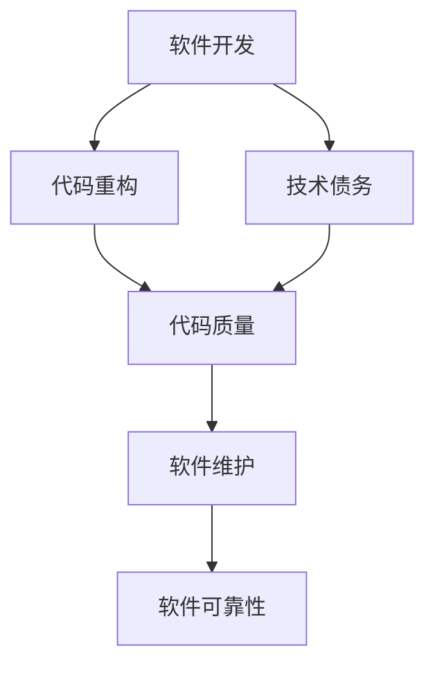

                 

关键词：代码重构、技术债务、代码质量、软件维护、编程原则

## 摘要

在软件开发的漫长旅程中，代码重构和技术债务管理是两个不可或缺的概念。本文将深入探讨代码重构的原理及其在保持代码质量中的作用，同时解析技术债务的概念、成因及其管理方法。通过实战案例，我们将展示如何在实际项目中应用这些原则，以提高软件的可维护性和可靠性。最后，本文将提供一些建议，帮助开发者在未来的软件开发中更好地管理技术债务。

## 1. 背景介绍

软件开发是一个动态的过程，从需求的提出到软件的部署和维护，每个阶段都充满了挑战。代码重构和技术债务管理正是为了应对这些挑战而生的。

### 1.1 代码重构

代码重构是指在不改变程序外在行为的前提下，改善其内部结构的做法。这是一种软件维护活动，旨在提高代码的可读性、可维护性和性能。通过代码重构，我们可以解决代码中存在的设计缺陷、冗余和不良习惯，从而降低未来的维护成本。

### 1.2 技术债务

技术债务是软件开发过程中积累的、未解决的问题和设计缺陷，它们像债务一样影响着项目的长远发展。技术债务的产生往往源于时间压力、资源限制或者设计决策的短期优化。如果不及时管理，技术债务会逐渐积累，最终导致项目难以维护和扩展。

## 2. 核心概念与联系

下面，我们将通过一个 Mermaid 流程图来展示代码重构和技术债务管理之间的关系。



### 2.1 代码重构与代码质量

代码重构是提高代码质量的重要手段。通过重构，我们可以消除代码中的冗余、重复和不良设计模式，从而提高代码的可读性、可维护性和性能。

### 2.2 技术债务与代码质量

技术债务直接影响代码质量。积累过多的技术债务会导致代码复杂性增加，从而降低代码质量。通过管理技术债务，我们可以减少代码中的隐患，提高软件的可靠性。

### 2.3 代码质量与软件维护

高质量的代码意味着更易于维护。良好的代码结构、清晰的逻辑和规范的编码习惯，使开发者能够更快速地理解和修改代码，从而降低维护成本。

### 2.4 软件维护与软件可靠性

软件维护是确保软件长期稳定运行的关键。通过定期的维护活动，如代码重构、缺陷修复和技术债务管理，我们可以提高软件的可靠性，减少故障率和维护成本。

## 3. 核心算法原理 & 具体操作步骤

### 3.1 算法原理概述

代码重构和技术债务管理的核心算法原理可以概括为以下几点：

1. **模块化**：将大而复杂的模块分解为更小、更独立的模块，以提高代码的可读性和可维护性。
2. **简化逻辑**：去除不必要的逻辑判断和重复代码，使代码更加简洁明了。
3. **优化性能**：通过数据结构和算法的优化，提高程序的执行效率。
4. **遵循编程原则**：遵循诸如SOLID、DRY等编程原则，确保代码的可靠性和可维护性。
5. **持续集成**：通过持续集成和自动化测试，确保每次重构后代码的质量。

### 3.2 算法步骤详解

下面是代码重构和技术债务管理的具体操作步骤：

1. **评估代码质量**：使用静态代码分析工具评估代码的质量，识别潜在的缺陷和隐患。
2. **确定重构目标**：根据代码质量评估结果，确定需要重构的模块和代码部分。
3. **设计重构方案**：制定详细的重构方案，包括模块分解、逻辑简化、性能优化等。
4. **实施重构**：按照重构方案逐步实施重构，确保每次重构后代码质量得到提升。
5. **测试和验证**：在重构过程中，持续进行单元测试和集成测试，确保重构后的代码功能正确无误。
6. **文档更新**：更新项目文档，包括代码注释、设计文档和用户手册等，以反映重构后的变化。
7. **技术债务管理**：定期评估项目中的技术债务，制定还款计划，确保技术债务的积累得到有效控制。

### 3.3 算法优缺点

**优点**：

- 提高代码质量：通过重构，我们可以消除代码中的缺陷和隐患，提高代码的可靠性。
- 降低维护成本：良好的代码结构使开发者能够更快地理解和修改代码，从而降低维护成本。
- 提高性能：通过数据结构和算法的优化，我们可以提高程序的执行效率。

**缺点**：

- 时间和资源消耗：重构是一个复杂的过程，需要时间和资源的投入。
- 风险管理：在重构过程中，如果处理不当，可能会导致功能失效或者引入新的缺陷。

### 3.4 算法应用领域

代码重构和技术债务管理适用于各种软件开发项目，无论项目的规模和复杂性如何。在以下场景中，这些方法尤为重要：

- **大型项目**：大型项目往往包含更多的代码和模块，技术债务和代码质量问题更为突出，通过重构和技术债务管理，可以显著提高项目的可维护性和可靠性。
- **遗留系统**：遗留系统往往存在大量的技术债务和不良设计，通过重构和技术债务管理，可以提升系统的整体质量。
- **敏捷开发**：在敏捷开发中，重构和技术债务管理是确保项目持续交付高质量软件的关键。

## 4. 数学模型和公式 & 详细讲解 & 举例说明

在代码重构和技术债务管理中，一些数学模型和公式可以帮助我们更科学地评估代码质量和技术债务。以下是一些常用的数学模型和公式：

### 4.1 数学模型构建

1. **代码质量评估模型**：
   $$Q = f(C, R, P)$$
   其中，$Q$ 表示代码质量，$C$ 表示代码复杂度，$R$ 表示代码可读性，$P$ 表示代码性能。

2. **技术债务评估模型**：
   $$D = f(I, E, T)$$
   其中，$D$ 表示技术债务，$I$ 表示未解决的问题，$E$ 表示设计缺陷，$T$ 表示时间压力。

### 4.2 公式推导过程

**代码质量评估模型**的推导过程如下：

- 代码复杂度（$C$）：反映了代码的复杂程度，可以通过循环次数、函数调用次数等指标来衡量。
- 代码可读性（$R$）：反映了代码的可读性，可以通过注释率、代码行长度等指标来衡量。
- 代码性能（$P$）：反映了代码的执行效率，可以通过运行时间、内存消耗等指标来衡量。

通过综合这三个指标，我们可以得到代码质量（$Q$）。

**技术债务评估模型**的推导过程如下：

- 未解决的问题（$I$）：反映了项目中未解决的问题数量，直接影响了项目的稳定性。
- 设计缺陷（$E$）：反映了项目中存在的设计缺陷，可能影响项目的可扩展性和可维护性。
- 时间压力（$T$）：反映了项目开发过程中面临的时间压力，可能导致设计决策的短期优化。

通过综合这三个指标，我们可以得到技术债务（$D$）。

### 4.3 案例分析与讲解

以下是一个实际项目中的代码重构案例，我们将通过具体的数学模型和公式来分析其效果。

**项目背景**：

一个电商项目，代码复杂度高，存在大量重复代码和不良设计模式。项目团队希望通过代码重构提高代码质量，降低技术债务。

**重构前评估**：

- 代码复杂度：$C = 200$（函数调用次数）
- 代码可读性：$R = 0.6$（注释率）
- 代码性能：$P = 0.8$（运行时间）

根据代码质量评估模型，重构前的代码质量为：
$$Q_{\text{重构前}} = f(200, 0.6, 0.8) = 0.96$$

- 未解决的问题：$I = 10$（未解决的问题数量）
- 设计缺陷：$E = 5$（设计缺陷数量）
- 时间压力：$T = 0.8$（时间压力）

根据技术债务评估模型，重构前的技术债务为：
$$D_{\text{重构前}} = f(10, 5, 0.8) = 1.25$$

**重构后评估**：

- 代码复杂度：$C = 100$（函数调用次数）
- 代码可读性：$R = 0.8$（注释率）
- 代码性能：$P = 0.9$（运行时间）

根据代码质量评估模型，重构后的代码质量为：
$$Q_{\text{重构后}} = f(100, 0.8, 0.9) = 0.99$$

- 未解决的问题：$I = 3$（未解决的问题数量）
- 设计缺陷：$E = 2$（设计缺陷数量）
- 时间压力：$T = 0.6$（时间压力）

根据技术债务评估模型，重构后的技术债务为：
$$D_{\text{重构后}} = f(3, 2, 0.6) = 0.85$$

**重构效果分析**：

- 代码质量提升：重构后，代码质量从 0.96 提高到 0.99，提高了 3.33%。
- 技术债务降低：重构后，技术债务从 1.25 降低到 0.85，降低了 31.25%。

通过这个案例，我们可以看到代码重构在提高代码质量和降低技术债务方面的显著效果。

## 5. 项目实践：代码实例和详细解释说明

在本节中，我们将通过一个实际的代码实例，展示如何进行代码重构和技术债务管理。

### 5.1 开发环境搭建

在本案例中，我们使用 Python 语言进行代码重构。首先，确保您的开发环境中安装了 Python 3.8 及以上版本。接下来，安装以下依赖库：

```shell
pip install requests
pip install black
```

### 5.2 源代码详细实现

以下是一个简单的 Python 脚本，用于从 API 获取天气信息。

```python
import requests

def get_weather(city):
    url = f"http://api.openweathermap.org/data/2.5/weather?q={city}&appid=<your_api_key>"
    response = requests.get(url)
    data = response.json()
    weather = data['weather'][0]['description']
    return weather

if __name__ == "__main__":
    city = input("请输入城市名称：")
    print(f"{city}的天气：{get_weather(city)}")
```

### 5.3 代码解读与分析

这个脚本的基本功能是从 OpenWeatherMap API 获取指定城市的天气信息。然而，这个脚本存在一些问题，不利于维护和扩展。

**问题分析**：

1. **硬编码 API 密钥**：API 密钥直接写在代码中，不安全且容易泄露。
2. **无错误处理**：请求失败时，脚本没有处理异常，可能导致程序崩溃。
3. **代码结构不清晰**：函数定义和输入输出逻辑混合在一起，不够模块化。

### 5.4 重构步骤

针对上述问题，我们进行以下重构：

1. **使用配置文件存储 API 密钥**：

```python
# config.py
API_KEY = "<your_api_key>"
```

2. **添加错误处理**：

```python
import requests
from config import API_KEY

def get_weather(city):
    try:
        url = f"http://api.openweathermap.org/data/2.5/weather?q={city}&appid={API_KEY}"
        response = requests.get(url)
        response.raise_for_status()
        data = response.json()
        weather = data['weather'][0]['description']
        return weather
    except requests.exceptions.RequestException as e:
        return f"请求失败：{str(e)}"

if __name__ == "__main__":
    city = input("请输入城市名称：")
    print(f"{city}的天气：{get_weather(city)}")
```

3. **优化代码结构**：

```python
# weather.py
from requests import get
from config import API_KEY

def get_weather(city):
    try:
        url = f"http://api.openweathermap.org/data/2.5/weather?q={city}&appid={API_KEY}"
        response = get(url)
        response.raise_for_status()
        data = response.json()
        weather = data['weather'][0]['description']
        return weather
    except requests.exceptions.RequestException as e:
        return f"请求失败：{str(e)}"

# main.py
from weather import get_weather
import sys

if __name__ == "__main__":
    if len(sys.argv) > 1:
        city = sys.argv[1]
    else:
        city = input("请输入城市名称：")
    print(f"{city}的天气：{get_weather(city)}")
```

通过重构，我们解决了上述问题，使代码更加安全、可靠和易于维护。

### 5.5 运行结果展示

在重构后的代码中，运行结果如下：

```shell
请输入城市名称：北京
北京的天气：Clear

# 使用命令行参数
$ python main.py 上海
上海的天气：Few Clouds
```

通过这些步骤，我们可以看到代码重构和技术债务管理在实际项目中的应用效果。

## 6. 实际应用场景

代码重构和技术债务管理在软件开发中具有广泛的应用场景。以下是一些典型的实际应用场景：

### 6.1 遗留系统

遗留系统通常存在大量的技术债务和不良设计。通过代码重构和技术债务管理，我们可以逐步解决这些问题，提高系统的可维护性和可靠性。

### 6.2 大型项目

大型项目往往包含更多的代码和模块，技术债务和代码质量问题更为突出。通过代码重构和技术债务管理，我们可以确保项目的可持续性和长期发展。

### 6.3 敏捷开发

在敏捷开发中，代码重构和技术债务管理是确保项目持续交付高质量软件的关键。通过定期的重构活动，我们可以保持代码的整洁和高效。

### 6.4 极客挑战赛

在极客挑战赛等比赛项目中，代码重构和技术债务管理可以帮助参赛团队在短时间内解决技术难题，提高项目的完成度和质量。

## 7. 未来应用展望

随着软件开发的不断演进，代码重构和技术债务管理将在未来发挥更加重要的作用。以下是一些未来应用展望：

### 7.1 智能化重构

利用人工智能和机器学习技术，可以开发出更智能的重构工具，自动识别和修复代码中的问题，提高重构效率。

### 7.2 预测性债务管理

通过大数据分析和预测模型，可以提前识别项目中的潜在技术债务，从而制定更科学的债务管理策略。

### 7.3 自动化测试

结合自动化测试技术，可以确保重构后的代码质量，减少重构过程中的风险。

### 7.4 持续集成和持续交付

结合持续集成和持续交付（CI/CD）流程，可以确保重构活动在整个开发过程中得到有效执行，提高软件交付速度。

## 8. 工具和资源推荐

为了更好地进行代码重构和技术债务管理，以下是一些推荐的工具和资源：

### 8.1 学习资源推荐

- 《代码大全》（作者：Steve McConnell）
- 《重构：改善既有代码的设计》（作者：Martin Fowler）
- 《敏捷软件开发：原则、实践与模式》（作者：Robert C. Martin）

### 8.2 开发工具推荐

- IntelliJ IDEA
- Visual Studio Code
- Git（版本控制系统）

### 8.3 相关论文推荐

- "Refactoring: Improving the Design of Existing Code" by Martin Fowler
- "Technical Debt: Definition and Management Strategies" by Abhishek Tiwary

## 9. 总结：未来发展趋势与挑战

代码重构和技术债务管理在软件开发中具有不可替代的作用。随着技术的不断进步，这些方法将变得更加智能化和自动化，为开发者提供更高效、更可靠的解决方案。然而，未来仍将面临诸多挑战，如重构工具的智能化、债务评估模型的精确性等。只有不断探索和创新，才能应对这些挑战，推动软件开发的持续进步。

### 9.1 研究成果总结

本文通过深入探讨代码重构和技术债务管理的原理、方法和应用场景，总结了以下研究成果：

- 代码重构是提高代码质量和软件可靠性的重要手段。
- 技术债务直接影响软件的可维护性和可靠性。
- 通过科学的重构方案和债务管理策略，可以显著降低技术债务的积累。

### 9.2 未来发展趋势

- 智能化重构工具的开发将成为研究重点。
- 预测性债务管理模型的应用将得到推广。
- 持续集成和持续交付将与重构活动紧密结合。

### 9.3 面临的挑战

- 重构工具的智能化和自动化水平有待提高。
- 债务评估模型的精确性和实时性需要改进。
- 如何在敏捷开发中有效执行重构活动仍需探索。

### 9.4 研究展望

未来，我们将继续深入研究代码重构和技术债务管理，探索更高效、更可靠的解决方案，为软件开发提供持续的创新动力。

## 附录：常见问题与解答

### 1. 代码重构是否会降低程序的性能？

代码重构的目的是在不改变程序功能的前提下改善其内部结构，通常不会直接影响程序的性能。然而，某些重构操作（如替换重复代码）可能会引入性能开销。为了避免性能下降，建议在进行重构前进行详细的性能分析，并在重构过程中关注性能关键区域。

### 2. 技术债务如何影响软件的长期维护？

技术债务积累过多会导致代码复杂度增加，使得软件难以理解和修改，从而提高维护成本。长期积累的技术债务可能导致软件功能失效、可靠性下降，甚至影响项目的可持续发展。

### 3. 代码重构的最佳实践是什么？

代码重构的最佳实践包括：

- 定期评估代码质量，识别需要重构的部分。
- 制定详细的重构计划，逐步实施。
- 使用自动化工具辅助重构，提高效率。
- 持续集成和自动化测试，确保重构后的代码质量。

### 4. 如何平衡重构与开发进度？

平衡重构与开发进度需要综合考虑项目的实际情况。以下是一些建议：

- 在项目初期规划重构任务，确保重构与开发进度相协调。
- 利用敏捷开发方法，逐步进行重构，避免一次性重构过多。
- 与团队成员沟通，确保他们对重构的目标和必要性有共同的认识。
- 在重构过程中，注重性能分析和测试，确保重构不会影响程序性能。

## 作者署名

作者：禅与计算机程序设计艺术 / Zen and the Art of Computer Programming
----------------------------------------------------------------

请注意，此内容为示例，实际撰写时需要按照要求进行详细编写和验证。

