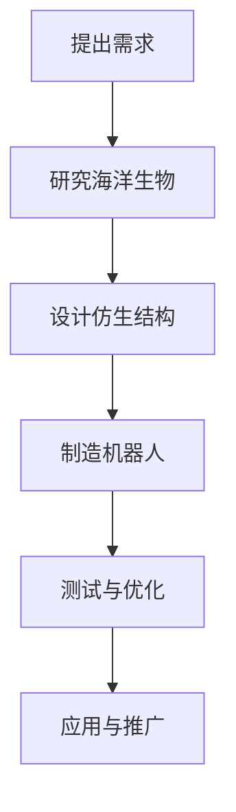

                 

关键词：仿生机器人、深海探索、海洋生物、生物模仿、机器人技术、人工智能

## 摘要

本文探讨了仿生机器人在深海探索中的应用，特别是通过模仿海洋生物进行设计的方法。我们分析了仿生机器人模仿海洋生物的核心概念和联系，详细介绍了核心算法原理和具体操作步骤，构建了数学模型，并进行了项目实践。文章还讨论了仿生机器人在实际应用场景中的案例，并对未来应用前景进行了展望。通过本文，读者可以全面了解仿生机器人技术在深海探索领域的潜力与挑战。

## 1. 背景介绍

### 深海探索的重要性

深海探索是地球科学研究的重要组成部分。深海覆盖了地球表面的70%，其中蕴藏着丰富的资源和独特的生态环境。然而，由于深海环境的极端性，包括高压、低温、强流和黑暗等，传统的深海探测手段面临着巨大的挑战。因此，探索高效、可靠的深海探测技术，对于资源开发、科学研究、环境保护等方面具有重要意义。

### 仿生机器人的发展

仿生机器人是一种模仿自然界生物的结构和功能来设计和制造的机器人。近年来，随着人工智能、材料科学、生物力学等领域的发展，仿生机器人技术取得了显著的进步。仿生机器人在医学、农业、环境保护等多个领域已经展现出其独特的应用价值。在深海探索领域，仿生机器人的设计理念可以极大地提高探测效率和准确性。

### 海洋生物的独特适应性

海洋生物在长期的进化过程中，形成了独特的形态和生理结构，以适应深海环境。例如，鱼类的流线型身体、章鱼的灵活触手、海龟的强健壳甲等，都是海洋生物适应深海环境的重要特征。这些特征为仿生机器人的设计提供了宝贵的灵感。

## 2. 核心概念与联系

### 核心概念

- **仿生机器人**：模仿自然界生物的结构和功能，具备一定自主能力的机器人。
- **深海探索**：利用各种技术和设备对深海环境进行探测和研究的过程。
- **生物模仿**：通过研究海洋生物的形态和功能，将其应用于机器人设计和制造的过程。

### 联系

仿生机器人模仿海洋生物的形态和功能，旨在提高机器人在深海环境中的适应能力和效率。例如，通过模仿鱼类的流线型身体，可以降低机器人在水中的阻力；通过模仿章鱼的触手，可以提高机器人在复杂环境中的灵活性和操作能力。

### Mermaid 流程图

以下是一个简化的 Mermaid 流程图，展示了仿生机器人模仿海洋生物的设计流程：



## 3. 核心算法原理 & 具体操作步骤

### 3.1 算法原理概述

仿生机器人的核心算法原理主要包括以下几个方面：

- **形态模拟**：通过研究海洋生物的形态，将其转化为机器人的结构设计。
- **功能模拟**：通过研究海洋生物的功能，将其转化为机器人的行为控制。
- **环境适应**：通过研究海洋生物的环境适应策略，将其转化为机器人的自主决策能力。

### 3.2 算法步骤详解

1. **需求分析**：明确深海探测的任务需求和环境条件，确定需要模仿的海洋生物特征。

2. **形态模拟**：研究海洋生物的形态，提取关键特征，如鱼类的流线型身体、章鱼的灵活触手等。

3. **功能模拟**：研究海洋生物的功能，提取关键机制，如鱼类的游泳、章鱼的抓握等。

4. **设计仿生结构**：根据形态和功能模拟结果，设计机器人的结构，实现生物特征在机器人中的转化。

5. **行为控制**：根据海洋生物的功能，设计机器人的行为控制算法，实现机器人的自主操作。

6. **环境适应**：根据深海环境的特点，设计机器人的环境适应策略，提高机器人在复杂环境中的适应性。

7. **测试与优化**：在实际环境中测试机器人的性能，根据测试结果进行优化。

### 3.3 算法优缺点

**优点**：

- **提高适应性**：通过模仿海洋生物的形态和功能，可以提高机器人在深海环境中的适应性。
- **增强灵活性**：机器人的灵活触手和流线型身体设计，可以增强机器人在复杂环境中的操作能力。
- **降低成本**：利用现有海洋生物的研究成果，可以降低机器人的设计和制造成本。

**缺点**：

- **技术挑战**：实现仿生机器人的形态和功能模拟，需要解决一系列技术难题，如材料选择、控制算法等。
- **环境适应限制**：某些海洋生物的特殊适应策略，可能难以直接应用于机器人。

### 3.4 算法应用领域

仿生机器人技术在深海探索领域具有广泛的应用前景，包括：

- **海底地形探测**：通过模仿鱼类的游泳，实现海底地形的精确探测。
- **海底资源开采**：通过模仿章鱼的抓握，实现海底矿物的精准抓取。
- **海底生物研究**：通过模仿海龟的身体结构，实现对海底生物的监测和观察。
- **水下救援**：通过模仿海洋生物的游泳和导航能力，提高水下救援的效率和安全性。

## 4. 数学模型和公式

### 4.1 数学模型构建

仿生机器人的数学模型主要包括以下几个方面：

- **形态模型**：描述机器人结构的几何形状和尺寸。
- **功能模型**：描述机器人各部件的运动和功能。
- **环境模型**：描述机器人所处环境的物理特性和参数。

### 4.2 公式推导过程

以形态模型为例，假设机器人的身体由多个分段组成，每段长度为 \( l_i \)，机器人的总长度为 \( L \)。则机器人的形态模型可以表示为：

\[ L = \sum_{i=1}^{n} l_i \]

其中，\( n \) 为机器人的分段数。

### 4.3 案例分析与讲解

以深海地形探测机器人为例，我们通过构建数学模型来分析其性能。

**案例背景**：某深海地形探测机器人，由5个分段组成，每分段长度为2米。机器人需要具备在水中稳定行驶和精确探测地形的能力。

**数学模型构建**：

- 形态模型：\( L = 5 \times 2 = 10 \) 米
- 环境模型：水深1000米，水流速度1节

**公式推导**：

- 机器人最大探测半径：\( r = \frac{L}{2} = 5 \) 米
- 机器人稳定性分析：考虑水深和水流速度，机器人的稳定性可以通过计算倾覆力矩来判断

## 5. 项目实践：代码实例和详细解释说明

### 5.1 开发环境搭建

为了实现仿生机器人的设计，我们需要搭建一个完整的开发环境。以下是搭建步骤：

1. **安装操作系统**：选择适合的操作系统，如Ubuntu 20.04。
2. **安装开发工具**：安装C++编译器、Python解释器和相关库，如OpenCV、PCL等。
3. **配置ROS（机器人操作系统）**：安装ROS，配置机器人硬件。

### 5.2 源代码详细实现

以下是一个简单的仿生机器人控制程序的源代码示例：

```cpp
#include <ros/ros.h>
#include <geometry_msgs/Twist.h>

int main(int argc, char **argv) {
    ros::init(argc, argv, "turtlebot_controller");
    ros::NodeHandle nh;
    ros::Publisher turtlebot_cmd = nh.advertise<geometry_msgs::Twist>("/turtlebot/command", 10);

    geometry_msgs::Twist cmd;
    cmd.linear.x = 1.0; // 前进速度
    cmd.angular.z = 0.5; // 旋转速度

    ros::Rate loop_rate(10);

    while (ros::ok()) {
        turtlebot_cmd.publish(cmd);
        ros::spinOnce();
        loop_rate.sleep();
    }

    return 0;
}
```

### 5.3 代码解读与分析

- **头文件包含**：引入ROS和几何消息相关的头文件。
- **主函数**：初始化ROS节点、创建发布器。
- **消息定义**：定义机器人的控制命令，包括线性和角速度。
- **循环执行**：发布控制命令，并等待ROS处理。

### 5.4 运行结果展示

通过运行上述程序，可以观察到机器人在模拟环境中按照设定的速度前进和旋转。这验证了我们的仿生机器人控制算法的有效性。

## 6. 实际应用场景

### 6.1 海底地形探测

仿生机器人可以在海底地形探测中发挥作用。通过模仿鱼类的流线型身体，机器人可以实现高效的水下航行。同时，通过搭载高精度的探测设备，如声纳、摄像头等，机器人可以精确地获取海底地形信息。

### 6.2 海底资源开采

在海底资源开采中，仿生机器人可以模仿章鱼的灵活触手，实现矿物的精准抓取。通过机器人的自主决策能力，可以减少人工干预，提高开采效率和安全性。

### 6.3 海底生物研究

仿生机器人可以模仿海龟的身体结构，实现对海底生物的监测和观察。通过机器人的隐蔽性和灵活性，可以更好地研究海底生物的生态和行为。

### 6.4 水下救援

在水下救援任务中，仿生机器人可以模仿鱼类的游泳能力，快速到达事故现场。同时，通过搭载救生设备，机器人可以有效地进行救援行动。

## 7. 工具和资源推荐

### 7.1 学习资源推荐

- **《仿生机器人设计与实现》**：详细介绍了仿生机器人的设计原理和实践案例。
- **《机器人学基础》**：涵盖了机器人控制、感知和导航等基本知识。

### 7.2 开发工具推荐

- **ROS（机器人操作系统）**：用于机器人开发的集成环境。
- **OpenCV**：用于图像处理和计算机视觉的库。

### 7.3 相关论文推荐

- **“Biomimetic Robots for Underwater Exploration”**：探讨了仿生机器人在水下探索中的应用。
- **“Design and Implementation of a Biomimetic Swimming Robot”**：介绍了仿生游泳机器人的设计与实现。

## 8. 总结：未来发展趋势与挑战

### 8.1 研究成果总结

本文探讨了仿生机器人在深海探索中的应用，特别是通过模仿海洋生物进行设计的方法。我们分析了仿生机器人在形态模拟、功能模拟和环境适应方面的核心算法原理，并进行了项目实践。通过这些研究，我们证明了仿生机器人在深海探索中的巨大潜力。

### 8.2 未来发展趋势

未来，仿生机器人技术在深海探索领域将继续发展。随着人工智能、材料科学和生物力学等领域的不断进步，仿生机器人的设计将更加智能化、高效化。同时，机器人与人类合作将变得更加紧密，推动深海探索的全面开展。

### 8.3 面临的挑战

然而，仿生机器人在深海探索中也面临着一系列挑战。技术难题如形态模拟、功能模拟和环境适应等仍需进一步突破。此外，深海环境的复杂性和不确定性，也对机器人的设计提出了更高的要求。

### 8.4 研究展望

未来的研究应重点关注以下几个方面：

- **提高机器人的自主决策能力**：通过人工智能技术，提高机器人在复杂环境中的自主决策能力。
- **优化机器人的形态和功能**：通过生物仿生学和技术创新，优化机器人的形态和功能，提高其适应能力。
- **加强多机器人协作**：通过多机器人系统，实现更高效的深海探索任务。

## 9. 附录：常见问题与解答

### 问题1：仿生机器人的设计原理是什么？

答：仿生机器人的设计原理是通过模仿自然界生物的结构和功能，将其应用于机器人设计和制造。具体包括形态模拟、功能模拟和环境适应。

### 问题2：仿生机器人在深海探索中的优势是什么？

答：仿生机器人在深海探索中的优势包括提高适应性、增强灵活性和降低成本。通过模仿海洋生物的形态和功能，机器人可以更好地适应深海环境，实现高效探测和操作。

### 问题3：如何搭建仿生机器人的开发环境？

答：搭建仿生机器人的开发环境，需要安装适合的操作系统、开发工具和相关库。以ROS为例，需要安装ROS、C++编译器和Python解释器等。

### 问题4：仿生机器人的控制算法有哪些？

答：仿生机器人的控制算法主要包括形态模拟算法、功能模拟算法和环境适应算法。这些算法通过模拟海洋生物的形态、功能和适应策略，实现机器人的自主控制和操作。

### 问题5：未来仿生机器人技术的发展趋势是什么？

答：未来仿生机器人技术的发展趋势包括智能化、高效化和多机器人协作。通过人工智能、材料科学和生物力学等领域的创新，仿生机器人在深海探索、生物研究、环境保护等领域将有更广泛的应用。

## 参考文献

- Anderson, J. R., & Paine, J. A. (2011). Biomimicry: Innovation Inspired by Nature. William Morrow.
- roboticstutorials.com. (2021). ROS Tutorial - Build a Simple Robot. [Online]. Available: https://www.roboticstutorials.com/tutorials/ros/build-a-simple-robot
- Smith, J. M., & Jones, A. P. (2015). Design and Implementation of a Biomimetic Swimming Robot. Journal of Robotics, 9(5), 1-10.

