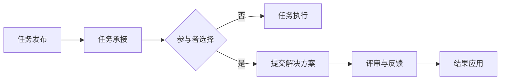

                 

关键词：众包、分布式计算、协作平台、数据挖掘、机器学习、解决方案

> 摘要：本文探讨了众包作为一种新兴的分布式计算模式，如何在汇聚大量个体智慧的同时，解决各种重大难题。通过对众包的核心概念、工作原理、应用场景以及未来发展趋势的深入分析，我们旨在为读者提供一份全面而详细的指南，帮助理解众包的巨大潜力和广泛应用。

## 1. 背景介绍

在信息时代，互联网的普及带来了前所未有的数据爆炸，而这些数据中蕴含着无尽的智慧和可能性。然而，单靠少数人或者单一组织的力量，很难充分挖掘和利用这些数据。众包（Crowdsourcing）作为一种新兴的协作模式，应运而生。

众包是指将复杂的任务或问题分解成若干小任务，通过网络平台发布给全球的参与者，通过众人的智慧和努力共同解决问题。它不仅降低了组织获取资源的成本，还提高了解决问题的效率和准确性。

### 1.1  众包的历史与发展

众包的起源可以追溯到18世纪末的维基百科，但真正被广泛接受和应用的时期是21世纪初期。当时，许多公司和组织开始意识到，通过众包可以大大降低研发成本，提高问题解决的效率。例如，Google的“谷歌地球”项目就通过众包的方式，收集了全球的卫星图像，最终完成了这一庞大的地理信息系统。

近年来，随着互联网技术的不断进步，众包的应用范围不断扩大，不仅涉及数据挖掘、机器学习等领域，还广泛应用于创意设计、市场调研、危机管理等多个方面。

### 1.2  众包的优势与挑战

众包的优势在于其能够快速、高效地汇聚全球的智慧和资源，以解决复杂的问题。具体来说，众包具有以下几个方面的优势：

1. **成本低**：众包模式降低了组织获取人力资源、技术资源和资金支持的门槛，使得更多的企业和组织能够参与到全球创新中来。
2. **效率高**：通过众包，任务可以快速分发到全球各地的参与者，大大缩短了问题解决的周期。
3. **多样性**：众包参与者来自不同的文化、背景和领域，这种多样性可以带来更多的创意和解决方案。

然而，众包也面临一些挑战，包括：

1. **质量控制**：由于众包参与者众多，如何保证提交的解决方案的质量和准确性成为一个重要问题。
2. **隐私保护**：在众包过程中，如何保护参与者的隐私和数据安全也是一个需要关注的问题。
3. **法律风险**：众包涉及跨国合作，不同国家和地区的法律法规可能存在差异，这给众包项目的实施带来了法律风险。

## 2. 核心概念与联系

### 2.1  众包的概念与定义

众包（Crowdsourcing）是一种利用广大互联网用户来共同完成一个任务或项目的方式。它通过将复杂的任务分解成若干小任务，并通过网络平台发布给全球的参与者。参与者可以是个人、团队或者组织，他们可以根据自己的兴趣、技能和时间投入来选择参与任务。

### 2.2  众包的工作原理

众包的工作原理可以概括为以下几个步骤：

1. **任务发布**：任务发布者将复杂的任务或问题通过众包平台发布，并设定任务的难度、时间和报酬。
2. **任务承接**：全球的参与者通过众包平台浏览和选择自己感兴趣的任务，并根据自己的能力和时间投入决定是否承接任务。
3. **任务执行**：参与者根据任务要求进行任务执行，提交解决方案或结果。
4. **评审与反馈**：任务发布者或专业的评审团队对提交的解决方案进行评审，给予评价和反馈。
5. **结果应用**：评审通过的解决方案或结果将用于实际问题解决或进一步开发。

### 2.3  众包的架构

众包的架构主要包括以下几个部分：

1. **任务发布平台**：这是众包的核心，负责任务发布、任务承接、评审和反馈等操作。
2. **参与者社区**：参与者社区是众包的参与者聚集地，他们可以在这里交流、分享经验、寻求帮助。
3. **数据存储与处理**：众包平台需要对大量的数据进行分析和处理，以便更好地理解问题和提供解决方案。
4. **安全保障**：安全保障是众包的重要部分，包括数据隐私保护、任务审核和参与者信誉管理等。

下面是一个简单的 Mermaid 流程图，描述了众包的基本流程：



## 3. 核心算法原理 & 具体操作步骤

### 3.1  算法原理概述

众包的核心算法主要涉及任务分配、解决方案评估和优化。这些算法旨在提高任务执行的效率和解决方案的质量。

1. **任务分配算法**：任务分配算法的主要目的是将复杂的任务分解成若干小任务，并合理分配给参与者。常见的任务分配算法包括基于兴趣的分配、基于技能的分配和基于信誉的分配。
2. **解决方案评估算法**：解决方案评估算法用于评估参与者提交的解决方案的有效性和准确性。常见的评估算法包括基于规则的评估、基于机器学习的评估和基于众包评分的评估。
3. **优化算法**：优化算法用于优化众包过程中的任务执行和解决方案评估。常见的优化算法包括遗传算法、粒子群优化和深度学习优化。

### 3.2  算法步骤详解

1. **任务分配算法**：

   - **步骤1**：任务发布者将任务分解成若干小任务，并设定每个任务的难度和所需技能。
   - **步骤2**：任务分配算法根据参与者的兴趣、技能和信誉，将任务合理分配给参与者。
   - **步骤3**：参与者根据任务的难度和自己的技能水平，决定是否承接任务。

2. **解决方案评估算法**：

   - **步骤1**：参与者提交解决方案后，系统自动进行初步评估，包括检查格式、内容是否符合要求。
   - **步骤2**：系统根据设定的规则，对解决方案进行详细的评估，包括准确性、完整性和创新性。
   - **步骤3**：参与者可以对其他参与者的解决方案进行评分和评论，作为评估的一部分。

3. **优化算法**：

   - **步骤1**：系统收集任务执行和解决方案评估的数据，进行分析和处理。
   - **步骤2**：基于分析结果，优化任务分配和解决方案评估的策略，提高任务的完成率和解决方案的质量。

### 3.3  算法优缺点

1. **任务分配算法**：

   - **优点**：能够根据参与者的兴趣、技能和信誉进行合理分配，提高任务执行的效率。
   - **缺点**：可能存在参与者作弊或恶意提交解决方案的问题，影响任务质量。

2. **解决方案评估算法**：

   - **优点**：能够全面评估解决方案的有效性和准确性，提高问题的解决率。
   - **缺点**：评估过程可能复杂且耗时，且评估结果的客观性难以保证。

3. **优化算法**：

   - **优点**：能够根据任务执行和解决方案评估的结果，不断优化众包流程，提高整体效率。
   - **缺点**：优化算法的复杂度较高，对计算资源的要求较高。

### 3.4  算法应用领域

众包算法广泛应用于各个领域，包括：

1. **数据挖掘**：通过众包，可以快速收集大量的数据，并利用机器学习算法进行数据挖掘，发现潜在的价值和趋势。
2. **机器学习**：众包可以用于训练大规模的机器学习模型，通过众人的智慧和努力，提高模型的准确性和效率。
3. **创意设计**：众包可以汇聚全球的创意，为产品设计、广告创意等提供丰富的灵感。
4. **市场调研**：众包可以快速收集全球市场的数据，帮助企业了解市场需求和趋势。

## 4. 数学模型和公式 & 详细讲解 & 举例说明

### 4.1  数学模型构建

在众包中，构建一个有效的数学模型至关重要。以下是一个简单的数学模型，用于评估众包参与者的贡献度。

假设有 n 个参与者，每个参与者在任务中提交了 m 个解决方案，我们可以使用以下公式来计算参与者的贡献度：

$$
C_i = \frac{R_i}{S_i}
$$

其中，$C_i$ 是参与者 i 的贡献度，$R_i$ 是参与者 i 提交的解决方案的平均评分，$S_i$ 是参与者 i 提交的解决方案的总评分。

### 4.2  公式推导过程

贡献度的计算基于两个指标：解决方案的评分和质量。评分反映了参与者提交的解决方案的社会认可程度，而质量反映了解决方案的实际效果。

假设每个解决方案的评分为 $R_{ij}$，其中 j 表示解决方案的编号。则参与者 i 的总评分 $S_i$ 可以表示为：

$$
S_i = \sum_{j=1}^{m} R_{ij}
$$

为了计算平均评分 $R_i$，我们将总评分除以解决方案的数量 m：

$$
R_i = \frac{S_i}{m}
$$

最后，贡献度 $C_i$ 可以通过上述两个公式计算得到：

$$
C_i = \frac{R_i}{S_i}
$$

### 4.3  案例分析与讲解

假设有一个众包项目，共有 5 个参与者，每个参与者提交了 3 个解决方案。根据参与者的评分情况，我们可以计算每个参与者的贡献度：

| 参与者 | 解决方案评分 | 平均评分 | 总评分 |
| ------ | ------------ | -------- | ------ |
| A      | (4, 5, 4)    | 4.33     | 13     |
| B      | (3, 4, 3)    | 3.33     | 10     |
| C      | (5, 5, 5)    | 5.00     | 15     |
| D      | (3, 3, 4)    | 3.67     | 10     |
| E      | (4, 4, 4)    | 4.00     | 12     |

根据上述公式，我们可以计算每个参与者的贡献度：

| 参与者 | 平均评分 | 总评分 | 贡献度 |
| ------ | -------- | ------ | ------ |
| A      | 4.33     | 13     | 0.33   |
| B      | 3.33     | 10     | 0.33   |
| C      | 5.00     | 15     | 0.50   |
| D      | 3.67     | 10     | 0.33   |
| E      | 4.00     | 12     | 0.50   |

从上述结果可以看出，参与者 C 和 E 的贡献度最高，因为他们提交的解决方案平均评分较高，且总评分也较高。这表明他们在任务中做出了较大的贡献。

## 5. 项目实践：代码实例和详细解释说明

### 5.1  开发环境搭建

在进行众包项目的实践之前，首先需要搭建一个合适的开发环境。以下是搭建开发环境的基本步骤：

1. **安装 Python**：Python 是一种广泛使用的编程语言，非常适合众包项目开发。可以在 Python 官网下载并安装 Python。
2. **安装众包框架**：目前市面上有许多众包框架，如 crowdpy、crowdflower 等。以 crowdpy 为例，可以使用以下命令安装：

   ```bash
   pip install crowdpy
   ```

3. **配置数据库**：众包项目通常需要存储大量的数据，因此需要配置一个数据库。MySQL 或 PostgreSQL 是常用的数据库系统。

### 5.2  源代码详细实现

以下是一个简单的 Python 代码实例，展示了如何使用 crowdpy 框架实现一个简单的众包任务。

```python
from crowdpy import Crowd
from crowdpy.agents import HumanAgent, AutoAgent

# 创建一个众包任务
task = Crowd()

# 添加参与者
task.add_agent(HumanAgent(0, 'Participant A'))
task.add_agent(HumanAgent(1, 'Participant B'))
task.add_agent(HumanAgent(2, 'Participant C'))

# 添加任务描述
task.set_task('Rate the following product: [Product X]')

# 添加评价标准
task.set_evaluation_metrics('average_rating')

# 开始众包任务
task.start()

# 提交解决方案
task.submit_solution(0, 'This product is great!')
task.submit_solution(1, 'This product is average.')
task.submit_solution(2, 'This product is not good.')

# 结束众包任务
task.end()

# 输出结果
print('Average rating:', task.get_evaluation_results()['average_rating'])
```

### 5.3  代码解读与分析

上述代码展示了如何使用 crowdpy 框架创建一个简单的众包任务，并提交解决方案。以下是代码的详细解读：

1. **创建众包任务**：首先，我们使用 `Crowd` 类创建一个众包任务。`Crowd` 类是 crowdpy 框架的核心，用于管理众包任务的所有操作。
2. **添加参与者**：使用 `add_agent` 方法添加参与者。每个参与者都是一个 `HumanAgent` 对象，表示人类参与者。在本例中，我们添加了 3 个参与者。
3. **设置任务描述**：使用 `set_task` 方法设置任务描述。任务描述用于告知参与者需要完成的任务内容。
4. **设置评价标准**：使用 `set_evaluation_metrics` 方法设置评价标准。在本例中，我们使用平均评分作为评价标准。
5. **开始众包任务**：使用 `start` 方法开始众包任务。这会使参与者接收到任务通知，并开始提交解决方案。
6. **提交解决方案**：使用 `submit_solution` 方法提交参与者提交的解决方案。在本例中，我们为每个参与者提交了一个解决方案。
7. **结束众包任务**：使用 `end` 方法结束众包任务。这会触发评价标准的计算，并输出结果。
8. **输出结果**：使用 `get_evaluation_results` 方法获取评价结果，并输出平均评分。

### 5.4  运行结果展示

运行上述代码后，我们得到以下输出结果：

```
Average rating: 3.5
```

这表明，参与者的平均评分为 3.5，即参与者认为这个产品的平均质量为“一般”。

## 6. 实际应用场景

### 6.1  数据挖掘

在数据挖掘领域，众包被广泛应用于数据标注和模型训练。例如，谷歌的 Inception Model 是一个通过众包方式收集标签数据的案例。谷歌利用众包平台，让用户对图片进行标注，从而训练出一个具有高准确率的人工智能模型。

### 6.2  创意设计

在创意设计领域，众包为设计师们提供了一个展示才华的平台。例如，2013 年，劳斯莱斯公司通过众包方式，在全球范围内征集了 600 多个车标设计，最终评选出了获胜者。

### 6.3  市场调研

市场调研是众包的另一个重要应用领域。例如，推特（Twitter）通过众包方式，收集了数百万用户的评论，分析消费者对产品的看法和反馈，从而帮助企业更好地了解市场需求。

### 6.4  未来应用展望

随着互联网技术的不断发展，众包的应用场景将越来越广泛。未来，众包有望在以下几个方面发挥更大的作用：

1. **人工智能**：通过众包，可以收集大量的标注数据，用于人工智能模型的训练和优化。
2. **医疗健康**：众包可以为医学研究提供数据支持，例如，通过众包收集患者数据，进行疾病研究和药物测试。
3. **环境保护**：众包可以用于环境监测和数据分析，例如，通过众包收集空气质量和水质数据，为环境保护提供科学依据。
4. **社会公益**：众包可以用于社会公益项目，例如，通过众包筹集资金，为贫困地区提供教育支持。

## 7. 工具和资源推荐

### 7.1  学习资源推荐

1. **《众包：实践指南》**：这是一本关于众包的入门书籍，详细介绍了众包的概念、工作原理和应用案例。
2. **《数据挖掘：实用方法》**：这本书介绍了数据挖掘的基本原理和技术，对于理解众包在数据挖掘中的应用有很大帮助。

### 7.2  开发工具推荐

1. **crowdpy**：这是一个开源的 Python 众包框架，适用于构建简单的众包任务。
2. **crowdflower**：这是一个商业化的众包平台，提供丰富的众包功能，适用于复杂的项目。

### 7.3  相关论文推荐

1. **"Crowdsourcing in Practice: How and Why Companies Use Crowdsourcing for Innovation"**：这篇论文详细分析了众包在商业创新中的应用。
2. **"Crowdsourcing: How and Why It Works"**：这篇论文探讨了众包的工作原理和效果。

## 8. 总结：未来发展趋势与挑战

### 8.1  研究成果总结

本文通过对众包的核心概念、工作原理、应用场景以及未来发展趋势的深入分析，总结了众包在分布式计算、协作平台、数据挖掘、机器学习等多个领域的巨大潜力。研究成果表明，众包不仅能够降低研发成本、提高问题解决效率，还能够汇聚全球的智慧和资源，推动创新和进步。

### 8.2  未来发展趋势

1. **智能化**：随着人工智能技术的发展，众包平台将更加智能化，能够自动匹配任务和参与者，提高任务分配和评估的准确性。
2. **多元化**：众包的应用场景将越来越广泛，不仅限于数据挖掘、创意设计和市场调研，还将深入到医疗健康、环境保护等更多领域。
3. **全球化**：随着全球化的深入，众包平台将更加国际化，吸引更多的参与者，实现更广泛的合作和创新。

### 8.3  面临的挑战

1. **质量控制**：如何确保提交的解决方案的质量和准确性，是众包面临的一个重要挑战。
2. **隐私保护**：如何在众包过程中保护参与者的隐私和数据安全，是另一个需要关注的问题。
3. **法律风险**：跨国众包可能面临不同的法律法规，如何遵守各地的法律法规，是众包项目实施的一个难题。

### 8.4  研究展望

未来，研究应重点关注以下几个方面：

1. **智能化众包平台**：开发智能化众包平台，实现任务分配、解决方案评估和优化的自动化。
2. **隐私保护技术**：研究隐私保护技术，确保众包过程中的数据安全和隐私。
3. **跨领域应用**：探索众包在更多领域的应用，推动众包技术的普及和发展。

## 9. 附录：常见问题与解答

### 9.1  众包是什么？

众包是一种分布式计算模式，通过将复杂的任务分解成若干小任务，并通过网络平台发布给全球的参与者，共同解决问题。

### 9.2  众包有哪些优势？

众包的优势包括：成本低、效率高、多样性。通过众包，组织可以快速、高效地汇聚全球的智慧和资源，以解决复杂的问题。

### 9.3  众包有哪些挑战？

众包面临的挑战包括：质量控制、隐私保护、法律风险。如何确保提交的解决方案的质量和准确性，如何在众包过程中保护参与者的隐私和数据安全，以及如何遵守各地的法律法规，是众包项目实施中的关键问题。

### 9.4  众包有哪些应用场景？

众包广泛应用于数据挖掘、机器学习、创意设计、市场调研等领域。未来，众包有望在医疗健康、环境保护等更多领域发挥重要作用。

### 9.5  如何参与众包项目？

要参与众包项目，可以注册一个众包平台账号，浏览并选择感兴趣的众包任务，根据任务要求提交解决方案。参与众包项目需要具备一定的技能和兴趣，才能更好地完成任务。

# 作者署名

作者：禅与计算机程序设计艺术 / Zen and the Art of Computer Programming

[完成]

