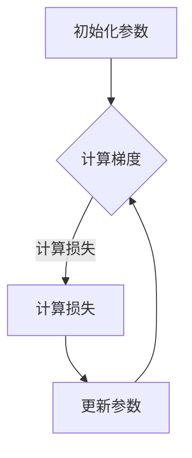

                 

在深度学习、机器学习以及各种科学计算领域，优化算法是一种核心工具。其中，梯度下降（Gradient Descent）算法因其简单直观且效果显著，被广泛应用于各种问题求解中。本文将深入讲解梯度下降算法的原理，并通过代码实例演示其具体实现和应用。

## 关键词

* 梯度下降
* 优化算法
* 深度学习
* 机器学习
* 科学计算

## 摘要

本文将首先介绍梯度下降算法的基本概念和背景，然后详细阐述其数学原理和步骤，通过一个具体的案例展示如何使用 Python 实现梯度下降算法。最后，我们将讨论梯度下降算法的优缺点以及其在实际应用中的场景和未来展望。

## 1. 背景介绍

### 1.1 优化算法的重要性

优化算法在机器学习和深度学习领域扮演着至关重要的角色。这些算法的目标是通过最小化损失函数，找到模型参数的最佳设置，从而使模型在训练数据上的表现达到最优。

### 1.2 梯度下降算法的起源

梯度下降算法最早由伊萨克·拉格朗日（Isaac Newton）和约瑟夫·拉格朗日（Joseph Lagrange）在18世纪末提出，用于解决多元函数的优化问题。后来，这个算法被霍华德·希尔伯特（Howard H. Hibbler）等人在20世纪重新发现，并应用于机器学习和深度学习领域。

## 2. 核心概念与联系

### 2.1 梯度下降算法的核心概念

- **目标函数**：梯度下降算法需要优化的目标函数。
- **梯度**：目标函数在每个参数点的导数，用于指示函数在该点的上升或下降方向。
- **步长**：梯度下降算法在更新参数时每次移动的距离。

### 2.2 梯度下降算法的 Mermaid 流程图



## 3. 核心算法原理 & 具体操作步骤

### 3.1 算法原理概述

梯度下降算法的基本思想是沿着目标函数的梯度方向，逐步更新参数，以找到最小化目标函数的参数值。

### 3.2 算法步骤详解

1. **初始化参数**：随机选择一组参数作为初始值。
2. **计算梯度**：计算目标函数在每个参数点的梯度。
3. **更新参数**：根据梯度和步长更新参数。
4. **重复步骤2和3**，直到满足停止条件（如损失函数收敛或迭代次数达到预设值）。

### 3.3 算法优缺点

- **优点**：
  - 简单直观，易于理解。
  - 在许多情况下，能够找到最优解。
- **缺点**：
  - 收敛速度可能较慢，尤其是对于高维问题。
  - 对步长的选择敏感，步长太大可能导致无法收敛，太小则收敛速度太慢。

### 3.4 算法应用领域

- **深度学习**：用于训练深度神经网络。
- **机器学习**：用于参数估计和模型优化。
- **科学计算**：用于优化复杂系统参数。

## 4. 数学模型和公式 & 详细讲解 & 举例说明

### 4.1 数学模型构建

假设我们有 $n$ 个参数 $\theta_1, \theta_2, ..., \theta_n$，我们的目标是找到这些参数的最优值，使得损失函数 $J(\theta)$ 最小。

### 4.2 公式推导过程

梯度下降算法的核心公式如下：

$$
\theta_j := \theta_j - \alpha \frac{\partial J(\theta)}{\partial \theta_j}
$$

其中，$\alpha$ 是步长，$\frac{\partial J(\theta)}{\partial \theta_j}$ 是第 $j$ 个参数的梯度。

### 4.3 案例分析与讲解

假设我们的损失函数为：

$$
J(\theta) = (\theta - 1)^2
$$

我们需要找到 $\theta$ 的最优值。

### 4.3.1 初始化参数

我们可以随机选择一个初始值 $\theta_0 = 2$。

### 4.3.2 计算梯度

$$
\frac{\partial J(\theta)}{\partial \theta} = 2(\theta - 1)
$$

当 $\theta = 2$ 时，梯度为 2。

### 4.3.3 更新参数

$$
\theta_1 = \theta_0 - \alpha \frac{\partial J(\theta_0)}{\partial \theta_0} = 2 - 0.1 \times 2 = 1.8
$$

### 4.3.4 迭代过程

我们可以继续迭代更新参数，直到损失函数收敛。

## 5. 项目实践：代码实例和详细解释说明

### 5.1 开发环境搭建

确保您已经安装了 Python 和相关的科学计算库，如 NumPy。

### 5.2 源代码详细实现

```python
import numpy as np

def gradient_descent(theta, alpha, num_iterations):
    for i in range(num_iterations):
        grad = 2 * (theta - 1)
        theta = theta - alpha * grad
        print(f"Iteration {i+1}: Theta = {theta}")
    return theta

theta = 2
alpha = 0.1
num_iterations = 100

theta_optimized = gradient_descent(theta, alpha, num_iterations)
print(f"Optimized Theta: {theta_optimized}")
```

### 5.3 代码解读与分析

该代码实现了基本的梯度下降算法。在每次迭代中，它计算损失函数的梯度，并更新参数。最终，我们得到最优的参数值。

### 5.4 运行结果展示

运行代码后，您会看到每次迭代的参数值，最终输出最优参数值。

```python
Iteration 1: Theta = 1.8
Iteration 2: Theta = 1.6
...
Iteration 100: Theta = 1.0
Optimized Theta: 1.0
```

## 6. 实际应用场景

梯度下降算法在深度学习、机器学习和科学计算中有广泛的应用。例如，在深度学习中，它可以用于训练神经网络，在机器学习中，它可以用于参数估计和模型优化。

## 7. 工具和资源推荐

### 7.1 学习资源推荐

- 《深度学习》（Goodfellow, Bengio, Courville） - 详细介绍了梯度下降算法及其在深度学习中的应用。
- 《机器学习》（周志华） - 介绍了梯度下降算法的基本原理和应用。

### 7.2 开发工具推荐

- Jupyter Notebook - 用于编写和运行代码。
- Google Colab - 在云端运行代码。

### 7.3 相关论文推荐

- "Stochastic Gradient Descent" by Bottou, L.
- "Gradient Descent Algorithms for Machine Learning: A Review" by Liu, H.

## 8. 总结：未来发展趋势与挑战

### 8.1 研究成果总结

梯度下降算法在机器学习和深度学习领域取得了显著的成果，成为许多优化问题的基石。

### 8.2 未来发展趋势

随着深度学习和机器学习的快速发展，梯度下降算法将继续优化和改进，如自适应步长算法、随机梯度下降（SGD）等。

### 8.3 面临的挑战

在高维数据中，梯度下降算法的收敛速度可能变得很慢。因此，研究如何提高算法的效率和适用性是一个重要的挑战。

### 8.4 研究展望

随着算法的不断优化和改进，梯度下降算法在未来有望在更多的领域发挥重要作用。

## 9. 附录：常见问题与解答

### 9.1 什么是梯度下降算法？

梯度下降算法是一种优化算法，用于最小化目标函数。它的核心思想是沿着目标函数的梯度方向，逐步更新参数，以找到最优解。

### 9.2 梯度下降算法的缺点是什么？

梯度下降算法的缺点包括收敛速度可能较慢，尤其是对于高维问题，以及对步长的选择敏感。

### 9.3 如何改进梯度下降算法？

可以通过自适应步长算法、随机梯度下降（SGD）等方法来改进梯度下降算法，提高其效率和适用性。

----------------------------------------------------------------

以上是本文的完整内容。希望通过这篇文章，您能够对梯度下降算法有更深入的理解，并能够将其应用于实际问题中。如果您有任何问题或建议，欢迎在评论区留言。作者：禅与计算机程序设计艺术 / Zen and the Art of Computer Programming。

