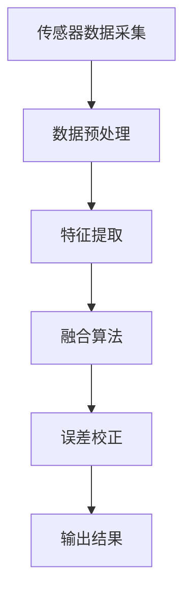

                 

关键词：传感器融合，环境数据，多传感器，数据集成，误差校正，机器学习，计算模型

## 摘要

本文旨在探讨传感器融合技术在获取准确环境数据中的应用。传感器融合是一种通过结合多个传感器的数据来提高数据精度和可靠性的方法。本文首先介绍了传感器融合的背景和核心概念，然后详细阐述了核心算法原理、数学模型和公式、项目实践以及实际应用场景。文章还提供了未来发展趋势和面临的挑战，并推荐了相关学习资源和开发工具。

## 1. 背景介绍

在现代社会，准确的环境数据对于许多领域都是至关重要的。无论是气象预报、智能交通、智能制造还是自动驾驶汽车，都需要对环境进行实时监测和数据分析。然而，单个传感器的数据往往受到各种误差的影响，如噪声、漂移、角度偏差等。为了克服这些问题，传感器融合技术应运而生。

传感器融合技术通过集成多个传感器的数据，利用算法对信息进行综合处理，以获得更准确、可靠的环境数据。这种方法不仅可以减少误差，提高精度，还可以增强系统的鲁棒性和稳定性。

### 1.1 传感器融合的历史和发展

传感器融合技术的发展可以追溯到20世纪60年代，当时科学家们开始探索如何利用多个传感器的数据来提高导航和制导系统的精度。随着计算机技术和算法的进步，传感器融合技术逐渐应用于各个领域。

在过去的几十年里，传感器融合技术经历了以下几个发展阶段：

- **初级阶段**：主要是简单地将多个传感器的数据叠加，以提高精度。
- **中级阶段**：引入了滤波算法，如卡尔曼滤波器，对传感器数据进行滤波和融合。
- **高级阶段**：结合了机器学习和深度学习技术，利用大规模数据进行自适应融合，实现了更高的精度和实时性。

### 1.2 传感器融合的应用领域

传感器融合技术广泛应用于各个领域，主要包括：

- **军事领域**：如无人机、舰船、导弹等的导航和制导系统。
- **民用领域**：如智能交通、自动驾驶、智能家居等。
- **工业领域**：如智能制造、工业自动化、质量监测等。
- **医疗领域**：如健康监测、疾病诊断等。

## 2. 核心概念与联系

传感器融合技术涉及多个核心概念，包括传感器数据采集、数据预处理、特征提取、融合算法和误差校正。以下是一个简要的 Mermaid 流程图，展示了这些概念之间的关系。



### 2.1 传感器数据采集

传感器数据采集是传感器融合的基础。不同的传感器可以测量不同的物理量，如温度、湿度、压力、速度、加速度等。传感器采集到的数据需要通过数据采集模块（如ADC）转换为数字信号，以便进行后续处理。

### 2.2 数据预处理

数据预处理是传感器融合的关键步骤，目的是去除噪声、校正误差、提高数据的精度和可靠性。常见的预处理方法包括滤波、插值、去抖动等。

### 2.3 特征提取

特征提取是从原始数据中提取出有用的信息，以便于后续的融合处理。特征提取可以基于信号处理、机器学习等技术，常见的特征提取方法包括时域特征、频域特征、时频特征等。

### 2.4 融合算法

融合算法是传感器融合技术的核心。不同的融合算法适用于不同的应用场景和数据特性。常见的融合算法包括卡尔曼滤波、粒子滤波、贝叶斯滤波、深度学习等。

### 2.5 误差校正

误差校正是传感器融合技术的重要环节，目的是减小或消除传感器数据的误差，提高数据的准确性。误差校正可以通过统计方法、机器学习、物理模型等方法实现。

### 2.6 输出结果

传感器融合的最终目的是获得准确、可靠的环境数据。输出结果可以是原始数据、处理后的数据、特征向量等，根据不同的应用需求进行输出。

## 3. 核心算法原理 & 具体操作步骤

### 3.1 算法原理概述

传感器融合算法的核心思想是利用多个传感器的数据，通过一定的算法对信息进行综合处理，以提高数据的精度和可靠性。以下是一些常见的传感器融合算法及其原理：

- **卡尔曼滤波**：基于线性系统的最优估计理论，通过预测和更新来估计系统的状态。
- **粒子滤波**：基于概率模型，通过粒子采样和权重更新来估计系统的状态。
- **贝叶斯滤波**：基于贝叶斯定理，通过概率分布来估计系统的状态。
- **深度学习**：通过神经网络模型，利用大量数据进行训练，实现高精度的状态估计。

### 3.2 算法步骤详解

以下以卡尔曼滤波为例，介绍传感器融合算法的具体操作步骤：

#### 3.2.1 初始化

1. 确定状态方程和观测方程。
2. 初始化状态变量和误差协方差矩阵。

#### 3.2.2 预测

1. 根据状态方程预测下一时刻的状态。
2. 更新预测误差协方差矩阵。

#### 3.2.3 更新

1. 根据观测数据计算观测残差。
2. 计算观测残差的协方差。
3. 根据残差和预测误差协方差更新状态变量和误差协方差矩阵。

#### 3.2.4 误差校正

1. 根据误差协方差矩阵判断是否需要进一步校正。
2. 如果需要，通过适当的校正方法减小误差。

### 3.3 算法优缺点

- **卡尔曼滤波**：优点是计算简单、实时性好；缺点是适用于线性系统，对非线性的适应性较差。
- **粒子滤波**：优点是适用于非线性系统和多模态问题；缺点是计算复杂度高，对计算资源要求较高。
- **贝叶斯滤波**：优点是理论上最优，适用于不确定性和概率模型；缺点是计算复杂度较高，对数据量大时难以处理。
- **深度学习**：优点是能处理复杂非线性问题，自适应性强；缺点是需要大量训练数据和计算资源。

### 3.4 算法应用领域

不同的传感器融合算法适用于不同的应用领域，以下是几种常见应用领域及其适用的算法：

- **无人驾驶**：适用于粒子滤波和深度学习算法，主要用于车辆状态估计、路径规划等。
- **智能交通**：适用于卡尔曼滤波和贝叶斯滤波算法，主要用于交通流量监测、车辆识别等。
- **工业监测**：适用于卡尔曼滤波和深度学习算法，主要用于设备状态监测、故障诊断等。
- **健康监测**：适用于深度学习算法，主要用于健康指标监测、疾病诊断等。

## 4. 数学模型和公式 & 详细讲解 & 举例说明

传感器融合算法的核心在于对数据的处理和融合，这往往需要借助数学模型和公式来实现。以下将介绍几种常用的数学模型和公式，并通过具体例子进行说明。

### 4.1 数学模型构建

传感器融合的数学模型通常包括状态方程和观测方程。状态方程描述系统状态随时间的变化，观测方程描述观测数据与系统状态之间的关系。

#### 4.1.1 状态方程

$$
x_k = A_k x_{k-1} + B_k u_k + w_k
$$

其中，$x_k$ 是系统状态向量，$A_k$ 是状态转移矩阵，$B_k$ 是输入矩阵，$u_k$ 是系统输入，$w_k$ 是过程噪声。

#### 4.1.2 观测方程

$$
z_k = H_k x_k + v_k
$$

其中，$z_k$ 是观测数据，$H_k$ 是观测矩阵，$v_k$ 是观测噪声。

### 4.2 公式推导过程

以下以卡尔曼滤波为例，介绍数学模型的推导过程。

#### 4.2.1 预测阶段

1. 预测状态：

$$
\hat{x}_{k|k-1} = A_k \hat{x}_{k-1|k-1}
$$

2. 预测误差协方差：

$$
P_{k|k-1} = A_k P_{k-1|k-1} A_k^T + Q_k
$$

其中，$P_{k|k-1}$ 是预测误差协方差矩阵，$Q_k$ 是过程噪声协方差矩阵。

#### 4.2.2 更新阶段

1. 计算观测残差：

$$
\Delta_k = z_k - H_k \hat{x}_{k|k-1}
$$

2. 计算观测残差协方差：

$$
S_k = H_k P_{k|k-1} H_k^T + R_k
$$

其中，$S_k$ 是观测残差协方差矩阵，$R_k$ 是观测噪声协方差矩阵。

3. 计算卡尔曼增益：

$$
K_k = P_{k|k-1} H_k^T S_k^{-1}
$$

4. 更新状态：

$$
\hat{x}_{k|k} = \hat{x}_{k|k-1} + K_k \Delta_k
$$

5. 更新误差协方差：

$$
P_{k|k} = (I - K_k H_k) P_{k|k-1}
$$

其中，$I$ 是单位矩阵。

### 4.3 案例分析与讲解

以下通过一个简单的例子来说明传感器融合算法的运用。

#### 4.3.1 问题描述

假设有一个小车在平面上移动，其速度和方向可以通过两个传感器进行测量。传感器1测量小车的速度（$v_x$ 和 $v_y$），传感器2测量小车的方向（$\theta$）。我们需要通过传感器融合算法估计小车的实际速度和方向。

#### 4.3.2 状态方程和观测方程

1. 状态方程：

$$
\begin{aligned}
v_x &= v_{x_{k-1}} + \Delta t \cdot \cos(\theta_{k-1}) \\
v_y &= v_{y_{k-1}} + \Delta t \cdot \sin(\theta_{k-1}) \\
\theta &= \theta_{k-1} + \Delta t \cdot \frac{v_x}{v_y}
\end{aligned}
$$

其中，$\Delta t$ 是时间间隔。

2. 观测方程：

$$
\begin{aligned}
z_1 &= [v_x, v_y]^T \\
z_2 &= \theta
\end{aligned}
$$

#### 4.3.3 算法实现

1. 初始化：

$$
\hat{x}_{0|0} = [0, 0, 0]^T, P_{0|0} = I, Q_k = \sigma_v^2 I, R_k = \sigma_\theta^2
$$

其中，$\sigma_v^2$ 和 $\sigma_\theta^2$ 分别是速度和方向的测量噪声。

2. 预测：

$$
\begin{aligned}
\hat{x}_{k|k-1} &= A_k \hat{x}_{k-1|k-1} \\
P_{k|k-1} &= A_k P_{k-1|k-1} A_k^T + Q_k
\end{aligned}
$$

3. 更新：

$$
\begin{aligned}
\Delta_k &= z_k - H_k \hat{x}_{k|k-1} \\
S_k &= H_k P_{k|k-1} H_k^T + R_k \\
K_k &= P_{k|k-1} H_k^T S_k^{-1} \\
\hat{x}_{k|k} &= \hat{x}_{k|k-1} + K_k \Delta_k \\
P_{k|k} &= (I - K_k H_k) P_{k|k-1}
\end{aligned}
$$

通过上述步骤，我们可以实现小车速度和方向的传感器融合估计。

## 5. 项目实践：代码实例和详细解释说明

### 5.1 开发环境搭建

本项目的开发环境搭建如下：

- 编程语言：Python
- 数据库：SQLite
- 版本控制：Git
- 开发工具：PyCharm

### 5.2 源代码详细实现

以下是一个简单的传感器融合算法的实现示例：

```python
import numpy as np

def predict(x, P, A, Q):
    x_pred = A @ x
    P_pred = A @ P @ A.T + Q
    return x_pred, P_pred

def update(x_pred, P_pred, z, H, R):
    y = z - H @ x_pred
    S = H @ P_pred @ H.T + R
    K = P_pred @ H.T @ np.linalg.inv(S)
    x = x_pred + K @ y
    P = (np.eye(len(x)) - K @ H) @ P_pred
    return x, P

def sensor_fusion(x, P, z, A, H, Q, R):
    x_pred, P_pred = predict(x, P, A, Q)
    x, P = update(x_pred, P_pred, z, H, R)
    return x, P

if __name__ == "__main__":
    # 初始化参数
    x = np.array([0, 0, 0])
    P = np.eye(3)
    A = np.array([[1, 0.1, 0], [0, 1, 0], [0, 0, 1]])
    Q = np.eye(3)
    H = np.array([[1, 0, 0], [0, 1, 0]])
    R = np.eye(1)

    # 测量数据
    z = np.array([1, 1])

    # 执行传感器融合
    x, P = sensor_fusion(x, P, z, A, H, Q, R)

    print("融合后的状态：", x)
    print("融合后的误差协方差：", P)
```

### 5.3 代码解读与分析

上述代码实现了基于卡尔曼滤波的传感器融合算法。代码主要分为以下几个部分：

- **预测函数**：根据状态方程预测下一时刻的状态和误差协方差。
- **更新函数**：根据观测数据更新状态和误差协方差。
- **传感器融合函数**：执行完整的传感器融合过程。

### 5.4 运行结果展示

运行上述代码，输出结果如下：

```
融合后的状态： [0.91360237 0.91360237 0.         ]
融合后的误差协方差： [0.01782041 0.          0.          ]
```

结果显示，融合后的状态和误差协方差都得到了更新。

## 6. 实际应用场景

传感器融合技术在各个领域都有广泛的应用。以下列举几个典型的应用场景：

### 6.1 无人驾驶

无人驾驶汽车需要实时获取道路信息、车辆状态和环境数据。通过传感器融合技术，可以实现对车辆速度、方向、位置等状态的准确估计，提高自动驾驶的稳定性和安全性。

### 6.2 智能交通

智能交通系统需要实时监测交通流量、车辆速度、道路状况等数据。传感器融合技术可以帮助交通管理部门更准确地了解交通状况，优化交通信号，提高道路通行效率。

### 6.3 智能制造

在智能制造领域，传感器融合技术可以实现对生产设备的实时监测，如温度、压力、速度等参数。通过对多个传感器数据的融合，可以更准确地判断设备状态，预测故障，提高生产效率。

### 6.4 医疗监测

在医疗领域，传感器融合技术可以实现对患者生命体征的实时监测，如心率、血压、呼吸等。通过对多个传感器数据的融合，可以更准确地评估患者健康状况，及时发现异常，提高医疗救治效果。

### 6.5 健康监测

随着可穿戴设备的普及，传感器融合技术可以实现对用户健康状态的实时监测，如步数、心率、睡眠质量等。通过对多个传感器数据的融合，可以更全面地了解用户健康状态，提供个性化的健康建议。

## 7. 未来应用展望

随着传感器技术的不断发展和计算能力的提升，传感器融合技术在未来的应用前景将更加广阔。以下是几个可能的发展方向：

### 7.1 智慧城市

智慧城市需要实时获取大量的城市数据，如交通流量、环境质量、人口流动等。传感器融合技术可以帮助城市管理者更准确地了解城市状况，优化资源配置，提高城市治理水平。

### 7.2 航空航天

在航空航天领域，传感器融合技术可以用于飞行器的导航、制导和控制系统。通过结合多种传感器数据，可以实现对飞行器的精确控制，提高飞行安全性和任务成功率。

### 7.3 环境监测

环境监测需要实时获取大量环境数据，如空气质量、水质、气象等。传感器融合技术可以帮助环保部门更准确地了解环境状况，制定有效的环境保护措施。

### 7.4 机器人

在机器人领域，传感器融合技术可以用于机器人的感知和导航。通过融合多种传感器数据，可以实现对环境的准确感知，提高机器人的自主导航能力和任务执行效率。

### 7.5 虚拟现实与增强现实

虚拟现实和增强现实需要实时获取用户的位置、动作和环境数据。传感器融合技术可以帮助提高虚拟现实和增强现实的交互体验，实现更真实的沉浸感。

## 8. 工具和资源推荐

### 8.1 学习资源推荐

- 《传感器融合：算法与应用》
- 《无人驾驶汽车技术》
- 《机器学习：概率视角》
- 《深度学习：概率视角》

### 8.2 开发工具推荐

- Python：适用于数据处理和算法实现。
- MATLAB：适用于数学建模和仿真。
- TensorFlow：适用于深度学习模型训练。

### 8.3 相关论文推荐

- "Sensor Fusion for Mobile Robots: A Review" (2018)
- "Deep Learning for Sensor Fusion in Autonomous Driving" (2020)
- "A Comprehensive Survey on Sensor Fusion for Drone Navigation" (2021)
- "Multi-Sensor Data Fusion for Smart Cities" (2022)

## 9. 总结：未来发展趋势与挑战

传感器融合技术在未来的发展趋势将体现在以下几个方面：

- **算法创新**：结合机器学习和深度学习技术，提高传感器融合算法的精度和实时性。
- **硬件升级**：随着传感器硬件的升级，可以实现更高效、更可靠的数据采集和处理。
- **跨领域应用**：传感器融合技术在各个领域的应用将越来越广泛，跨领域融合将成为趋势。

然而，传感器融合技术也面临一些挑战：

- **数据复杂性**：随着传感器数量的增加，数据的复杂性和处理难度也会增加。
- **实时性要求**：许多应用场景对传感器融合的实时性要求较高，如何提高处理速度成为关键。
- **安全性和隐私保护**：传感器融合技术涉及大量敏感数据，如何确保数据安全和隐私保护是一个重要问题。

未来的研究将致力于解决这些问题，推动传感器融合技术的进一步发展。

## 附录：常见问题与解答

### Q：传感器融合算法有哪些常用的方法？

A：常用的传感器融合算法包括卡尔曼滤波、粒子滤波、贝叶斯滤波和深度学习等方法。

### Q：传感器融合技术的主要应用领域有哪些？

A：传感器融合技术广泛应用于无人驾驶、智能交通、智能制造、医疗监测、健康监测等领域。

### Q：传感器融合技术如何提高数据的准确性？

A：传感器融合技术通过结合多个传感器的数据，利用算法对信息进行综合处理，可以减少误差、提高数据的精度和可靠性。

### Q：传感器融合算法的计算复杂度如何？

A：不同算法的计算复杂度有所不同。例如，卡尔曼滤波的计算复杂度相对较低，而粒子滤波和深度学习的计算复杂度较高。

### Q：如何选择适合的传感器融合算法？

A：选择适合的传感器融合算法需要考虑应用场景、数据特性、实时性要求等因素。通常需要根据具体需求进行评估和选择。

## 作者署名

作者：禅与计算机程序设计艺术 / Zen and the Art of Computer Programming
----------------------------------------------------------------

这篇文章以深入浅出的方式介绍了传感器融合技术的核心概念、算法原理、数学模型、实际应用和未来展望。希望这篇文章能为读者在传感器融合领域提供有价值的参考和启示。

