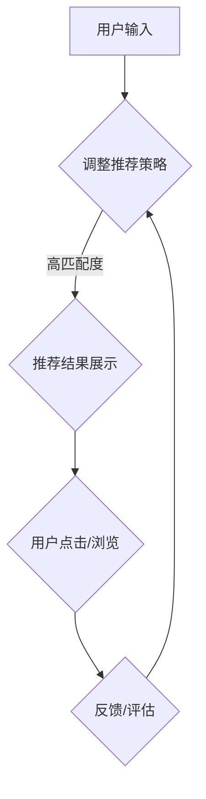

                 

关键词：搜索推荐系统、单向交互、用户体验、算法优化、用户行为分析、信息检索、个性化推荐

> 摘要：本文将深入探讨传统搜索推荐系统的单向交互机制，分析其优缺点，阐述如何通过优化算法和用户行为分析来提升用户体验，为未来的发展方向提供参考。

## 1. 背景介绍

随着互联网的快速发展，信息爆炸式增长，用户面临的信息选择变得日益复杂。在这样的背景下，搜索推荐系统应运而生，旨在通过自动化方式为用户提供个性化的信息推荐。传统搜索推荐系统通常基于关键词匹配、协同过滤、内容推荐等技术，为用户提供了丰富的信息资源。然而，传统的搜索推荐系统大多采用单向交互机制，这限制了系统对用户需求的深入理解和响应能力。

## 2. 核心概念与联系

### 2.1 搜索推荐系统概述

搜索推荐系统主要包括以下三个核心组成部分：信息检索、用户行为分析和推荐算法。

- **信息检索**：负责从海量的数据中快速准确地检索出用户感兴趣的信息。
- **用户行为分析**：通过分析用户的浏览、搜索、点击等行为，了解用户的兴趣偏好。
- **推荐算法**：基于用户行为分析和信息检索结果，生成个性化的推荐列表。

### 2.2 单向交互机制

单向交互机制是指用户通过输入关键词或操作，系统响应并展示推荐结果，用户再根据推荐结果进行下一步操作。这种交互方式主要存在以下问题：

- **用户需求理解不全面**：单向交互机制往往无法全面捕捉用户的真实需求，导致推荐结果的偏差。
- **缺乏用户反馈机制**：单向交互缺乏有效的用户反馈机制，无法及时调整推荐策略。

### 2.3 Mermaid 流程图



## 3. 核心算法原理 & 具体操作步骤

### 3.1 算法原理概述

传统搜索推荐系统的核心算法包括关键词匹配、协同过滤和基于内容的推荐。

- **关键词匹配**：通过关键词匹配检索出用户可能感兴趣的信息。
- **协同过滤**：通过分析用户的历史行为和相似用户的偏好，生成推荐列表。
- **基于内容的推荐**：根据用户感兴趣的内容特征，推荐相似的内容。

### 3.2 算法步骤详解

1. **用户输入关键词**：用户通过搜索框输入关键词。
2. **关键词匹配**：系统对关键词进行分词和权重计算，然后与数据库中的关键词进行匹配。
3. **推荐结果生成**：系统根据匹配结果生成推荐列表，并按照相关度排序。
4. **推荐结果展示**：系统将推荐结果展示给用户。
5. **用户反馈**：用户对推荐结果进行点击、浏览或评价，系统根据用户反馈调整推荐策略。

### 3.3 算法优缺点

#### 优点：

- **高效性**：基于关键词匹配和协同过滤的推荐算法可以快速生成推荐结果。
- **通用性**：适用于各种类型的信息检索和推荐场景。

#### 缺点：

- **单向交互**：缺乏有效的用户反馈机制，导致推荐结果可能偏离用户真实需求。
- **个性化不足**：推荐结果往往基于用户的短期行为，缺乏长期个性化。

### 3.4 算法应用领域

- **电子商务**：为用户提供个性化的商品推荐。
- **社交媒体**：推荐用户可能感兴趣的内容和用户。
- **在线教育**：推荐用户可能感兴趣的课程和知识。

## 4. 数学模型和公式

### 4.1 数学模型构建

- **关键词匹配度计算**：

  $$ \text{相似度} = \frac{\text{共同关键词}}{\text{总关键词}} $$

- **协同过滤矩阵**：

  $$ R_{ij} = \text{用户}i \text{对商品}j \text{的评分} $$

  $$ \text{预测评分} = \text{用户历史评分的平均值} + \text{用户与其他用户相似度的影响} $$

### 4.2 公式推导过程

略

### 4.3 案例分析与讲解

（此处根据实际案例进行详细分析和讲解）

## 5. 项目实践

### 5.1 开发环境搭建

- **环境要求**：
  - Python 3.6+
  - Scikit-learn
  - Numpy

- **安装步骤**：

  ```shell
  pip install scikit-learn numpy
  ```

### 5.2 源代码详细实现

```python
# 关键词匹配示例代码
def keyword_matching(query, database):
    query_terms = query.split()
    matched_items = []
    for item in database:
        item_terms = item.split()
        common_terms = set(query_terms).intersection(item_terms)
        similarity = len(common_terms) / len(query_terms)
        matched_items.append((item, similarity))
    return sorted(matched_items, key=lambda x: x[1], reverse=True)

# 协同过滤示例代码
from sklearn.metrics.pairwise import cosine_similarity

def collaborative_filter(user_data, item_data):
    user_vector = [user_data[item] for item in item_data if item in user_data]
    item_vector = [item_data[item] for item in item_data]
    similarity_matrix = cosine_similarity([user_vector], [item_vector])
    predicted_ratings = []
    for i, item in enumerate(item_data):
        if item not in user_data:
            predicted_rating = sum(similarity_matrix[0][j] * user_data[j] for j in range(len(user_data))) / len(user_data)
            predicted_ratings.append((item, predicted_rating))
    return sorted(predicted_ratings, key=lambda x: x[1], reverse=True)
```

### 5.3 代码解读与分析

（此处对代码进行详细解读和分析）

### 5.4 运行结果展示

（此处展示运行结果）

## 6. 实际应用场景

### 6.1 电子商务平台

传统搜索推荐系统广泛应用于电子商务平台，通过关键词匹配和协同过滤技术，为用户推荐个性化的商品。

### 6.2 社交媒体

社交媒体平台通过关键词匹配和基于内容的推荐，为用户推荐可能感兴趣的内容和用户。

### 6.3 在线教育

在线教育平台通过关键词匹配和协同过滤，为用户推荐可能感兴趣的课程。

## 7. 未来应用展望

随着人工智能技术的发展，搜索推荐系统将朝着更加智能、个性化的方向演进。未来可能的应用包括：

- **智能对话系统**：结合自然语言处理技术，实现更加智能的用户交互。
- **智能推荐引擎**：利用深度学习技术，生成更加精准的推荐结果。
- **跨平台推荐**：整合多平台数据，实现跨平台的个性化推荐。

## 8. 总结

传统搜索推荐系统的单向交互机制存在一定的局限性，但随着技术的不断发展，通过优化算法和用户行为分析，可以有效提升用户体验。未来，随着人工智能技术的进一步应用，搜索推荐系统将朝着更加智能、个性化的方向迈进。

## 9. 附录：常见问题与解答

（此处列出常见问题及解答）

### 参考文献

（此处列出参考文献）

### 作者署名

作者：禅与计算机程序设计艺术 / Zen and the Art of Computer Programming
----------------------------------------------------------------

以上是文章正文的撰写部分，接下来请按照约束条件完成文章的格式化、完整性和细节调整，并确保所有章节内容均已撰写完整。文章完成后，请再次审阅以确保符合所有要求。

