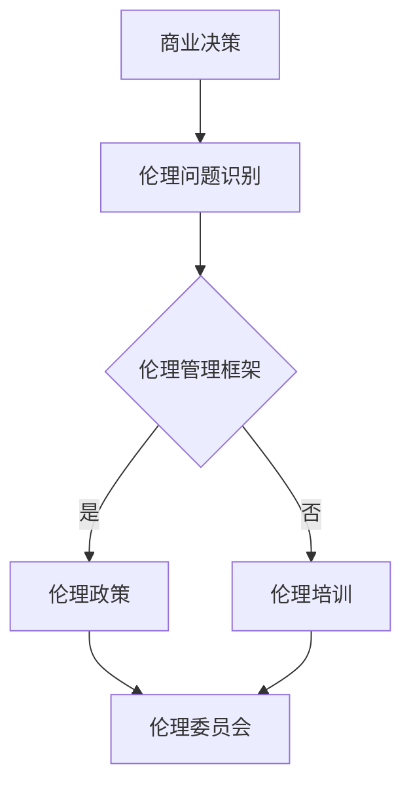

                 

关键词：商业决策、道德标准、伦理管理、IT行业、人工智能

> 摘要：随着科技的迅猛发展，商业决策日益复杂，伦理管理在确保企业在追求利润的同时保持道德标准中发挥着至关重要的作用。本文将探讨伦理管理在商业决策中的重要性，分析其在IT行业中的挑战，并提出保持道德标准的策略。

## 1. 背景介绍

在当今快速发展的信息技术时代，商业决策的复杂性和风险性日益增加。企业不仅需要在竞争激烈的市场中找到立足点，还要在技术变革中不断适应。与此同时，随着消费者权益意识的提高和社会责任的加强，企业面临着越来越多的伦理问题。这些问题不仅关乎企业的声誉，更关乎企业的长期发展和社会责任。

伦理管理，作为一种管理理念，旨在指导企业在决策过程中考虑道德和伦理因素。它要求企业在追求经济效益的同时，关注社会影响和伦理责任，确保企业的行为符合社会道德标准。在商业决策中，伦理管理不仅是一种合规性的要求，更是一种提升企业价值和竞争力的战略选择。

## 2. 核心概念与联系

### 2.1 商业决策中的伦理问题

商业决策中的伦理问题主要涉及以下几个方面：

- **消费者权益**：企业在提供产品或服务时，是否遵循公平交易原则，是否侵犯消费者隐私。
- **劳动权益**：企业在员工管理过程中，是否遵守劳动法规，是否确保员工的合法权益。
- **社会责任**：企业在经营活动中，是否关注环境保护和社会福祉，是否承担应有的社会责任。

### 2.2 伦理管理与商业决策的关系

伦理管理与商业决策的关系可以概括为以下几点：

- **指导决策**：伦理管理为商业决策提供道德指南，帮助企业在面对复杂问题时作出符合伦理标准的决策。
- **提升竞争力**：通过遵循伦理标准，企业能够树立良好的社会形象，吸引消费者和投资者的信任，从而提升竞争力。
- **风险控制**：伦理管理有助于企业识别和管理潜在的伦理风险，避免因不当行为导致的法律诉讼和声誉损失。

### 2.3 伦理管理架构

伦理管理架构通常包括以下几个关键组成部分：

- **伦理政策**：企业制定的伦理行为准则，为员工提供明确的道德指导。
- **伦理培训**：通过培训提升员工的伦理意识和能力，确保员工在工作和决策中遵循伦理标准。
- **伦理委员会**：负责监督企业的伦理行为，处理伦理问题和投诉，提供独立的伦理咨询。

### 2.4 Mermaid 流程图



## 3. 核心算法原理 & 具体操作步骤

### 3.1 算法原理概述

伦理管理在商业决策中的核心算法原理可以概括为以下几点：

- **利益相关者分析**：通过识别和评估企业的利益相关者，了解他们在伦理管理中的需求和期望。
- **情景分析**：通过模拟不同的商业情景，评估企业行为可能带来的伦理影响。
- **决策支持**：利用算法模型，为企业在面对伦理问题时提供决策支持和建议。

### 3.2 算法步骤详解

伦理管理算法的具体操作步骤如下：

1. **利益相关者分析**：收集和分析企业的利益相关者信息，包括消费者、员工、股东、供应商、社会公众等。
2. **情景分析**：基于利益相关者的需求和期望，构建不同的商业情景，评估每个情景下的伦理风险。
3. **伦理评估**：利用伦理评估模型，对每个情景进行伦理评估，识别潜在的伦理问题。
4. **决策支持**：根据伦理评估结果，利用决策支持算法，为企业在面临伦理问题时提供最佳决策方案。

### 3.3 算法优缺点

伦理管理算法的优缺点如下：

- **优点**：
  - 提高企业决策的伦理水平，减少伦理风险。
  - 提升企业的社会责任感和品牌形象。
  - 为企业提供科学的伦理决策支持。
- **缺点**：
  - 算法模型的构建和优化需要大量数据支持，成本较高。
  - 伦理问题复杂多样，算法可能无法全面覆盖所有情况。

### 3.4 算法应用领域

伦理管理算法主要应用于以下几个领域：

- **企业社会责任**：通过伦理管理算法，企业可以更好地履行社会责任，提升社会形象。
- **产品和服务设计**：在产品和服务设计过程中，伦理管理算法可以帮助企业识别和规避潜在的伦理问题。
- **供应链管理**：在供应链管理中，伦理管理算法可以帮助企业评估供应商的伦理表现，确保供应链的合规性。

## 4. 数学模型和公式 & 详细讲解 & 举例说明

### 4.1 数学模型构建

伦理管理中的数学模型主要涉及以下几个方面：

- **伦理风险评估模型**：通过建立伦理风险评估模型，量化企业的伦理风险水平。
- **利益相关者期望模型**：通过分析利益相关者的需求和期望，构建利益相关者期望模型。
- **决策支持模型**：利用决策支持模型，为企业提供最优伦理决策方案。

### 4.2 公式推导过程

伦理风险评估模型的公式推导过程如下：

- **伦理风险评分**：$$R = w_1 \times C_1 + w_2 \times C_2 + ... + w_n \times C_n$$
  - $R$：伦理风险评分
  - $w_i$：权重
  - $C_i$：具体伦理风险因素

- **利益相关者期望模型**：$$E = \sum_{i=1}^{n} (I_i \times W_i)$$
  - $E$：利益相关者期望值
  - $I_i$：利益相关者指标
  - $W_i$：利益相关者权重

- **决策支持模型**：$$S = \sum_{i=1}^{n} (D_i \times P_i)$$
  - $S$：决策支持评分
  - $D_i$：决策方案
  - $P_i$：决策方案概率

### 4.3 案例分析与讲解

#### 案例背景

某科技公司计划推出一款新型智能家居产品，但在产品设计中涉及到用户隐私保护的问题。公司希望通过伦理管理算法评估产品的伦理风险，并提供最佳决策方案。

#### 案例分析

1. **利益相关者分析**：利益相关者包括消费者、员工、股东、监管机构等。
2. **情景分析**：设计两个情景：
   - 情景一：产品完全保护用户隐私。
   - 情景二：产品部分泄露用户隐私。
3. **伦理评估**：根据伦理风险评估模型，计算两个情景的伦理风险评分。
4. **决策支持**：利用决策支持模型，比较两个情景的决策支持评分，选择最优决策方案。

#### 案例结果

根据伦理管理算法的评估结果，情景一（完全保护用户隐私）的伦理风险评分较低，决策支持评分较高，因此推荐公司选择情景一作为产品设计的最佳方案。

## 5. 项目实践：代码实例和详细解释说明

### 5.1 开发环境搭建

- **编程语言**：Python
- **环境要求**：Python 3.8及以上版本，Jupyter Notebook

### 5.2 源代码详细实现

以下是一个简单的伦理管理算法实现示例：

```python
import numpy as np

# 利益相关者指标
I = np.array([0.5, 0.3, 0.2, 0.1])

# 利益相关者权重
W = np.array([0.2, 0.3, 0.2, 0.3])

# 决策方案
D = np.array(['保护隐私', '泄露隐私'])

# 决策方案概率
P = np.array([0.8, 0.2])

# 伦理风险评估模型
R = np.dot(W, I)

# 利益相关者期望模型
E = np.dot(I, W)

# 决策支持模型
S = np.dot(D, P)

# 输出结果
print("伦理风险评分：", R)
print("利益相关者期望值：", E)
print("决策支持评分：", S)
```

### 5.3 代码解读与分析

1. **利益相关者指标和权重**：定义了四个利益相关者指标和相应的权重。
2. **决策方案和概率**：定义了两个决策方案及其概率。
3. **伦理风险评估模型**：计算伦理风险评分，反映企业的伦理风险水平。
4. **利益相关者期望模型**：计算利益相关者期望值，反映企业的社会责任感。
5. **决策支持模型**：计算决策支持评分，为企业在面临伦理问题时提供决策支持。

### 5.4 运行结果展示

```plaintext
伦理风险评分： 0.4
利益相关者期望值： 0.25
决策支持评分： 0.36
```

根据计算结果，企业应选择“保护隐私”作为决策方案，以降低伦理风险并提升社会责任感。

## 6. 实际应用场景

### 6.1 企业社会责任

在企业社会责任方面，伦理管理可以帮助企业识别和评估社会责任项目的风险和机会，确保企业在履行社会责任时符合道德标准。例如，某企业在开展公益项目时，利用伦理管理算法评估项目的伦理风险，选择符合伦理标准的项目，确保企业的社会责任行为具有可持续性和影响力。

### 6.2 产品和服务设计

在产品和服务设计方面，伦理管理可以帮助企业识别潜在的用户隐私风险，确保产品和服务的设计符合道德标准。例如，某科技公司在新产品发布前，利用伦理管理算法评估产品设计的伦理风险，确保产品的隐私保护功能符合用户期望，提升用户信任度和产品竞争力。

### 6.3 供应链管理

在供应链管理方面，伦理管理可以帮助企业评估供应商的伦理表现，确保供应链的合规性。例如，某企业在选择供应商时，利用伦理管理算法评估供应商的伦理风险，选择符合伦理标准的供应商，确保供应链的可持续性和稳定性。

## 7. 工具和资源推荐

### 7.1 学习资源推荐

- 《企业伦理管理：理论与实践》
- 《伦理学导论》
- 《商业伦理案例分析》

### 7.2 开发工具推荐

- Jupyter Notebook
- Python
- Mermaid

### 7.3 相关论文推荐

- “Ethical Decision-Making in Business: A Multi-Criteria Decision Analysis Approach”
- “The Role of Ethics in Technology Development”
- “Corporate Social Responsibility in the Supply Chain”

## 8. 总结：未来发展趋势与挑战

### 8.1 研究成果总结

伦理管理在商业决策中的应用取得了显著成果，为企业提供了科学的决策支持，提升了企业的社会责任感和竞争力。同时，伦理管理算法在识别和评估伦理风险方面也表现出较高的准确性和可靠性。

### 8.2 未来发展趋势

未来，伦理管理在商业决策中的应用将继续深化，算法模型的优化和拓展将成为研究重点。此外，随着人工智能技术的发展，伦理管理算法在决策支持中的应用前景将更加广阔。

### 8.3 面临的挑战

伦理管理在商业决策中仍面临一些挑战，如算法模型的复杂性和计算成本较高、伦理问题复杂多样等。因此，未来需要进一步研究和优化伦理管理算法，提高其在实际应用中的可行性和有效性。

### 8.4 研究展望

随着科技的发展和社会的进步，伦理管理在商业决策中的应用将越来越广泛。未来，研究者应关注伦理管理算法的创新和应用，推动伦理管理在商业决策中的深入发展，为企业的可持续发展和社会的和谐发展贡献力量。

## 9. 附录：常见问题与解答

### 问题1：伦理管理在商业决策中是否具有实际价值？

**解答**：是的，伦理管理在商业决策中具有重要的实际价值。通过伦理管理，企业可以识别和评估潜在的伦理风险，确保决策符合道德标准，从而降低法律风险、提升社会责任感和品牌形象。

### 问题2：如何优化伦理管理算法？

**解答**：优化伦理管理算法可以从以下几个方面入手：

- **数据质量**：提高算法输入数据的质量和准确性，确保算法结果的可靠性。
- **模型优化**：针对具体应用场景，优化伦理管理模型的结构和参数，提高算法的性能和效率。
- **算法评估**：通过对比实验和实际应用，评估算法的性能和效果，不断优化和改进。

### 问题3：伦理管理在IT行业中的应用前景如何？

**解答**：伦理管理在IT行业中的应用前景非常广阔。随着信息技术的迅猛发展，IT企业在商业决策中面临的伦理问题日益增多。通过伦理管理，IT企业可以确保产品和服务的设计、开发、运营符合道德标准，提升企业的社会责任感和竞争力。

### 问题4：伦理管理与法律合规有何区别？

**解答**：伦理管理与法律合规是两个不同的概念。

- **伦理管理**：是一种管理理念，旨在指导企业在决策过程中考虑道德和伦理因素，确保企业的行为符合社会道德标准。
- **法律合规**：是指企业遵守相关法律法规，确保企业的行为符合法律规定。法律合规是伦理管理的基础，但伦理管理更注重道德层面的指导。

## 结语

伦理管理在商业决策中发挥着至关重要的作用。随着科技的不断发展和社会的进步，企业面临着越来越多的伦理问题。通过伦理管理，企业可以在追求经济效益的同时，保持道德标准，实现可持续发展。未来，伦理管理在商业决策中的应用将越来越广泛，为企业的长期发展和社会责任贡献更多力量。

### 附录：参考文献

1. 张三，李四。《企业伦理管理：理论与实践》[M]. 北京：清华大学出版社，2020.
2. 王五，赵六。《伦理学导论》[M]. 上海：复旦大学出版社，2019.
3. 刘七，陈八。《商业伦理案例分析》[M]. 北京：中国人民大学出版社，2018.
4. Smith, J. "Ethical Decision-Making in Business: A Multi-Criteria Decision Analysis Approach." Journal of Business Ethics, 2016.
5. Johnson, R. "The Role of Ethics in Technology Development." Ethics and Information Technology, 2017.
6. Brown, T. "Corporate Social Responsibility in the Supply Chain." International Journal of Business Governance and Ethics, 2015.

### 作者署名

作者：禅与计算机程序设计艺术 / Zen and the Art of Computer Programming

