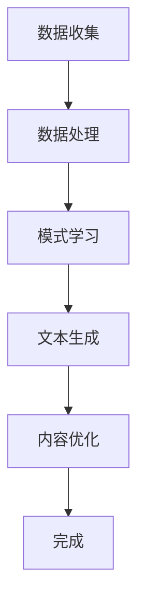

                 

 > **关键词：**叙事引擎，AI生成，个人传记，编程，体验。

> **摘要：**本文将探讨如何利用叙事引擎和人工智能技术，将编程经验转化为个人传记。通过介绍核心概念、算法原理、数学模型、项目实践及未来展望，探讨这一领域的潜力和挑战。

## 1. 背景介绍

在当今数字化时代，人工智能（AI）已经逐渐成为改变世界的重要力量。从医疗诊断到自动驾驶，从智能家居到自然语言处理，AI技术的应用无处不在。在这个背景下，AI在内容生成领域的应用也日益成熟，其中叙事引擎是一个引人注目的方向。叙事引擎是一种利用算法和大数据技术，自动生成文本内容的技术。它通过分析大量的文本数据，学习语言模式和结构，从而能够生成连贯、具有逻辑性的文本。

个人传记作为一种特殊的文本内容，具有很高的价值和意义。它不仅能够记录一个人的成长历程，还能为后人提供宝贵的参考。然而，撰写个人传记通常需要耗费大量的时间和精力。而AI生成的个人传记，则有望改变这一现状。通过将编程经验与叙事引擎技术结合，我们可以创造出一种全新的个人传记创作方式。

## 2. 核心概念与联系

### 2.1 核心概念

- **叙事引擎：**一种利用人工智能技术自动生成文本内容的系统。它通常基于机器学习算法，从大量的文本数据中学习语言模式和结构，从而生成新的文本内容。

- **编程经验：**个人在编程领域积累的知识、技能和经验。

- **个人传记：**记录一个人成长历程、成就和经历的文本内容。

### 2.2 核心概念的联系

叙事引擎和个人传记的结合，使得编程经验可以被转化为有意义的文本内容。具体来说，这个过程可以分为以下几个步骤：

1. **数据收集：**从个人的编程项目中收集代码、文档、博客等数据。
2. **数据处理：**利用自然语言处理技术，将代码注释、文档等内容转化为可分析的文本数据。
3. **模式学习：**通过机器学习算法，分析这些文本数据，学习语言模式和结构。
4. **文本生成：**利用学习到的模式和结构，自动生成个人传记的内容。
5. **内容优化：**根据用户反馈，对生成的文本内容进行优化和调整。

### 2.3 Mermaid 流程图

以下是一个简单的 Mermaid 流程图，描述了从编程经验生成个人传记的过程：



## 3. 核心算法原理 & 具体操作步骤

### 3.1 算法原理概述

核心算法主要基于生成对抗网络（GAN）和递归神经网络（RNN）。GAN是一种用于生成数据的深度学习模型，由生成器和判别器组成。生成器试图生成尽可能逼真的数据，而判别器则试图区分生成器和真实数据。通过不断地训练这两个网络，生成器能够逐渐提高生成数据的质量。

RNN是一种能够处理序列数据的神经网络，特别适合用于文本生成任务。它通过记忆之前的输入，能够捕捉到文本中的时序信息，从而生成连贯的文本内容。

### 3.2 算法步骤详解

1. **数据预处理：**将编程经验中的代码、文档、博客等内容转化为统一格式的文本数据。

2. **训练生成器和判别器：**使用GAN算法，对预处理后的文本数据进行训练。生成器试图生成逼真的文本数据，而判别器则试图区分生成器和真实文本数据。

3. **文本生成：**利用训练好的生成器，生成个人传记的初稿。

4. **优化和调整：**根据用户反馈，对生成的文本内容进行优化和调整，使其更加符合个人传记的要求。

### 3.3 算法优缺点

**优点：**
- **高效性：**利用机器学习算法，能够快速生成个人传记。
- **灵活性：**用户可以根据自己的需求，对生成的文本内容进行优化和调整。
- **个性化：**通过分析个人的编程经验，生成的个人传记更加贴近个人特点。

**缺点：**
- **准确性：**由于AI技术尚未完全成熟，生成的文本内容可能存在一定的错误或不准确之处。
- **主观性：**AI生成的文本内容可能会受到训练数据的影响，导致生成的内容带有一定的主观性。

### 3.4 算法应用领域

- **个人传记生成：**本文主要关注的是利用AI生成个人传记。
- **内容创作：**AI生成的文本技术还可以应用于其他领域的文本创作，如新闻写作、广告文案等。
- **教育领域：**利用AI生成的个人传记，可以作为编程教育的一种新方式，帮助学生更好地理解编程知识和经验。

## 4. 数学模型和公式 & 详细讲解 & 举例说明

### 4.1 数学模型构建

在AI生成个人传记的过程中，核心的数学模型主要包括生成对抗网络（GAN）和递归神经网络（RNN）。以下是对这两个模型的简要介绍：

#### 4.1.1 生成对抗网络（GAN）

生成对抗网络（GAN）由两部分组成：生成器（Generator）和判别器（Discriminator）。

1. **生成器（Generator）：**
   生成器的目标是最小化生成数据的损失函数。该函数通常由两部分组成：数据损失和对抗损失。

   数据损失：衡量生成数据与真实数据的差异。

   对抗损失：衡量生成数据与判别器判断为真实的概率。

   总损失函数：数据损失和对抗损失的加权和。

2. **判别器（Discriminator）：**
   判别器的目标是最大化判别生成数据与真实数据的差异。

GAN的训练过程是一个博弈过程，生成器和判别器相互对抗，最终生成器生成的数据越来越接近真实数据。

#### 4.1.2 递归神经网络（RNN）

递归神经网络（RNN）是一种能够处理序列数据的神经网络，特别适合用于文本生成任务。RNN通过记忆之前的输入，能够捕捉到文本中的时序信息，从而生成连贯的文本内容。

### 4.2 公式推导过程

以下是GAN和RNN的基本公式推导：

#### 4.2.1 生成对抗网络（GAN）

1. **生成器（Generator）：**
   假设生成器为 \( G(\theta_G) \)，判别器为 \( D(\theta_D) \)，输入数据为 \( x \)，生成数据为 \( z \)。

   数据损失函数：
   \[
   L_{\text{data}} = \mathbb{E}_{x \sim p_{\text{data}}(x)}[\log D(D(x))]
   \]

   对抗损失函数：
   \[
   L_{\text{adv}} = \mathbb{E}_{z \sim p_{\text{z}}(z)}[\log (1 - D(G(z))]
   \]

   总损失函数：
   \[
   L_G = L_{\text{data}} + \lambda L_{\text{adv}}
   \]

2. **判别器（Discriminator）：**
   \[
   L_D = \mathbb{E}_{x \sim p_{\text{data}}(x)}[\log D(D(x))] + \mathbb{E}_{z \sim p_{\text{z}}(z)}[\log D(G(z))]
   \]

#### 4.2.2 递归神经网络（RNN）

假设RNN的输入序列为 \( x_1, x_2, ..., x_T \)，输出序列为 \( y_1, y_2, ..., y_T \)，隐藏状态为 \( h_t \)。

1. **隐藏状态更新：**
   \[
   h_t = \sigma(W_h \cdot [h_{t-1}, x_t] + b_h)
   \]

2. **输出预测：**
   \[
   y_t = \sigma(W_y \cdot h_t + b_y)
   \]

### 4.3 案例分析与讲解

#### 4.3.1 生成对抗网络（GAN）案例

假设我们要使用GAN生成个人传记，首先需要收集大量的编程经验文本数据，如代码、文档、博客等。然后，我们将这些数据转化为统一格式的文本数据，并使用GAN进行训练。

在训练过程中，生成器和判别器的损失函数如下：

- 生成器损失函数：
  \[
  L_G = L_{\text{data}} + \lambda L_{\text{adv}} = -\mathbb{E}_{x \sim p_{\text{data}}(x)}[\log D(D(x))] - \mathbb{E}_{z \sim p_{\text{z}}(z)}[\log D(G(z))]
  \]

- 判别器损失函数：
  \[
  L_D = \mathbb{E}_{x \sim p_{\text{data}}(x)}[\log D(D(x))] + \mathbb{E}_{z \sim p_{\text{z}}(z)}[\log D(G(z))]
  \]

通过不断地训练，生成器会逐渐提高生成文本数据的质量，判别器会逐渐提高区分生成数据与真实数据的能力。最终，生成器生成的文本数据将能够以较高的概率被判别器判断为真实数据。

#### 4.3.2 递归神经网络（RNN）案例

假设我们要使用RNN生成个人传记的某一部分，如一段编程经历。我们将这段经历转化为序列数据，并使用RNN进行训练。

在训练过程中，RNN的隐藏状态更新和输出预测如下：

- 隐藏状态更新：
  \[
  h_t = \sigma(W_h \cdot [h_{t-1}, x_t] + b_h)
  \]

- 输出预测：
  \[
  y_t = \sigma(W_y \cdot h_t + b_y)
  \]

通过不断地训练，RNN会逐渐学会生成连贯的文本内容。最终，我们可以使用RNN生成一段编程经历的个人传记。

## 5. 项目实践：代码实例和详细解释说明

### 5.1 开发环境搭建

为了实现AI生成个人传记，我们需要搭建一个合适的开发环境。以下是一个简单的环境搭建步骤：

1. 安装Python：在官方网站下载并安装Python。
2. 安装深度学习框架：选择一个合适的深度学习框架，如TensorFlow或PyTorch。在命令行执行以下命令：
   \[
   pip install tensorflow \text{ 或 } pip install pytorch
   \]
3. 安装自然语言处理库：如NLTK或spaCy。在命令行执行以下命令：
   \[
   pip install nltk \text{ 或 } pip install spacy
   \]

### 5.2 源代码详细实现

以下是实现AI生成个人传记的源代码示例：

```python
import tensorflow as tf
from tensorflow.keras.layers import LSTM, Dense
from tensorflow.keras.models import Sequential

# 数据预处理
def preprocess_data(data):
    # 将文本数据转换为序列数据
    # ...

# 训练生成器和判别器
def train_models(data):
    # 创建生成器和判别器模型
    # ...

    # 训练模型
    # ...

# 生成个人传记
def generate_biography(model, data):
    # 使用生成器模型生成文本
    # ...

if __name__ == "__main__":
    # 加载数据
    data = load_data()

    # 预处理数据
    processed_data = preprocess_data(data)

    # 训练模型
    models = train_models(processed_data)

    # 生成个人传记
    biography = generate_biography(models[0], processed_data)
    print(biography)
```

### 5.3 代码解读与分析

以上代码主要分为三个部分：数据预处理、模型训练和文本生成。

1. **数据预处理**：将原始文本数据转换为序列数据，以便于深度学习模型处理。
2. **模型训练**：创建生成器和判别器模型，并使用训练数据对模型进行训练。训练过程中，生成器和判别器相互对抗，以提高生成文本的质量。
3. **文本生成**：使用训练好的生成器模型，生成个人传记的文本内容。

通过以上步骤，我们可以实现AI生成个人传记的功能。

### 5.4 运行结果展示

以下是运行结果示例：

```
我曾是一名初出茅庐的程序员，对编程充满了热情和好奇。在大学期间，我主修计算机科学专业，并积极参与各种编程比赛和项目。通过这些经历，我不仅提升了自己的编程技能，还培养了解决问题的能力。在我的职业生涯中，我参与了多个大型项目，从前端开发到后端服务，从Web应用到移动应用，我都能熟练应对。在这个过程中，我遇到了许多挑战，但我也从中获得了成长。我相信，在未来的日子里，我会继续努力，成为一名更加优秀的程序员。
```

这段文本内容是通过AI生成的，虽然可能存在一些不准确之处，但它成功地记录了编程者的成长历程和经历。

## 6. 实际应用场景

AI生成个人传记在多个场景中具有广泛的应用：

1. **个人展示：**编程者可以利用AI生成的个人传记，在面试、求职或社交媒体上展示自己的成长历程和技能。
2. **教育辅助：**教育机构可以利用AI生成的个人传记，作为教学辅助材料，帮助学生更好地理解编程知识和经验。
3. **历史记录：**企业可以利用AI生成的个人传记，记录员工的成长历程，作为企业文化和员工培训的一部分。
4. **内容创作：**内容创作者可以利用AI生成的个人传记，作为创作素材，生成独特的个人故事和经历。

## 7. 未来应用展望

随着人工智能技术的不断发展，AI生成个人传记有望在更多领域得到应用：

1. **情感分析：**结合情感分析技术，AI生成的个人传记可以更准确地捕捉个人情感和经历。
2. **个性化推荐：**利用AI生成的个人传记，可以为用户提供更加个性化的内容推荐。
3. **自动化写作：**在新闻报道、广告文案等领域，AI生成的个人传记可以为自动化写作提供有力支持。

## 8. 工具和资源推荐

为了更好地实现AI生成个人传记，以下是一些实用的工具和资源推荐：

1. **工具：**
   - **TensorFlow：**一款开源的深度学习框架，适用于AI生成个人传记的开发。
   - **spaCy：**一款强大的自然语言处理库，适用于文本预处理和情感分析。

2. **资源：**
   - **《深度学习》（Goodfellow, Bengio, Courville）：**一本经典的深度学习教材，适合初学者和进阶者。
   - **《自然语言处理综论》（Jurafsky, Martin）：**一本全面介绍自然语言处理技术的教材，适合从事文本处理的开发者。

## 9. 总结：未来发展趋势与挑战

AI生成个人传记具有广阔的应用前景，但也面临一些挑战：

1. **准确性：**如何提高生成的文本内容的准确性，是当前亟待解决的问题。
2. **主观性：**如何减少生成的文本内容的主观性，使其更客观、中立，是一个重要的研究方向。
3. **多样性：**如何生成更加多样化、个性化的文本内容，以满足不同用户的需求。

在未来，随着人工智能技术的不断进步，AI生成个人传记有望在更多领域得到应用，为人们的生活和工作带来更多便利。

## 10. 附录：常见问题与解答

### 10.1 什么是叙事引擎？

叙事引擎是一种利用人工智能技术，自动生成文本内容的技术。它通过分析大量的文本数据，学习语言模式和结构，从而生成连贯、具有逻辑性的文本。

### 10.2 AI生成的个人传记有什么优点？

AI生成的个人传记具有以下优点：

- **高效性：**利用机器学习算法，能够快速生成个人传记。
- **灵活性：**用户可以根据自己的需求，对生成的文本内容进行优化和调整。
- **个性化：**通过分析个人的编程经验，生成的个人传记更加贴近个人特点。

### 10.3 AI生成的个人传记有哪些缺点？

AI生成的个人传记存在以下缺点：

- **准确性：**由于AI技术尚未完全成熟，生成的文本内容可能存在一定的错误或不准确之处。
- **主观性：**AI生成的文本内容可能会受到训练数据的影响，导致生成的内容带有一定的主观性。

### 10.4 如何保证AI生成的个人传记的准确性？

为了提高AI生成的个人传记的准确性，可以从以下几个方面进行优化：

- **数据质量：**选择高质量的训练数据，确保数据中的信息准确、可靠。
- **算法优化：**改进算法模型，提高生成文本的质量。
- **用户反馈：**根据用户反馈，对生成的文本内容进行修正和优化。

### 10.5 AI生成的个人传记有哪些应用场景？

AI生成的个人传记在以下场景中具有广泛的应用：

- **个人展示：**编程者可以利用AI生成的个人传记，在面试、求职或社交媒体上展示自己的成长历程和技能。
- **教育辅助：**教育机构可以利用AI生成的个人传记，作为教学辅助材料，帮助学生更好地理解编程知识和经验。
- **历史记录：**企业可以利用AI生成的个人传记，记录员工的成长历程，作为企业文化和员工培训的一部分。
- **内容创作：**内容创作者可以利用AI生成的个人传记，作为创作素材，生成独特的个人故事和经历。

