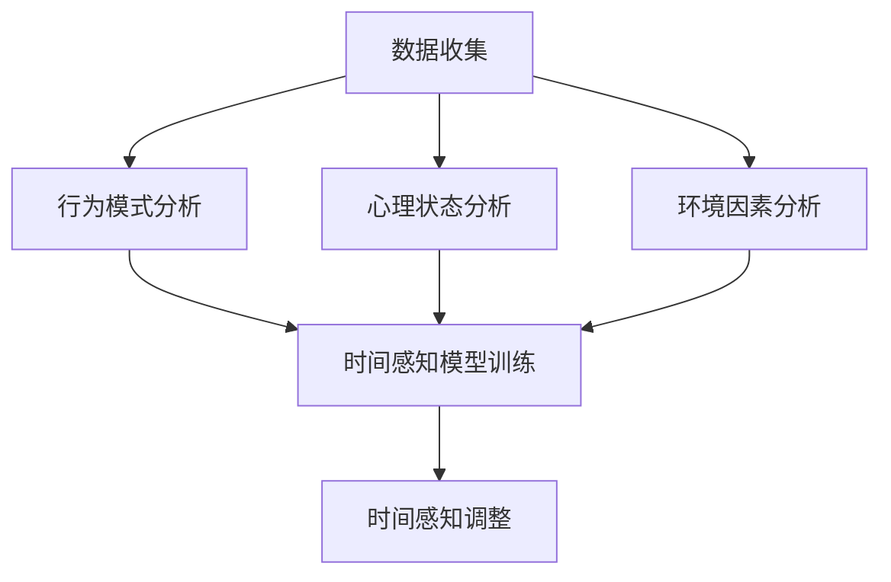

                 

关键词：时间弯曲技术、人工智能、主观时间调节、算法、数学模型、项目实践、应用场景、未来展望

> 摘要：本文深入探讨了时间弯曲技术的概念、原理和应用。通过AI技术的引入，我们得以在主观层面上对时间进行调节，实现更高效的时间管理。文章从背景介绍、核心概念与联系、算法原理与操作步骤、数学模型与公式、项目实践、应用场景以及未来展望等方面进行了详细的阐述，旨在为广大读者提供一个全面的技术解读。

## 1. 背景介绍

### 时间观念的转变

时间是人类社会发展的基础，自古以来，人们对时间的理解和利用不断演进。从古代的日晷、沙漏，到现代的电子时钟、智能手机，时间的测量手段日益精确。然而，随着社会节奏的加快，人们对时间的感知也发生了巨大的变化。传统的线性时间观念已经不能满足人们对于高效生活、工作的高要求。

### 人工智能的崛起

20世纪末以来，人工智能（AI）技术飞速发展，逐渐成为改变人类生活方式的重要力量。AI在各个领域的应用不断拓展，从自然语言处理、计算机视觉到自动驾驶、智能医疗等，AI正在深刻地改变着我们的生产方式和生活习惯。

### 时间弯曲技术的概念

时间弯曲技术，是一种利用人工智能算法对人类主观时间感知进行调节的技术。它通过分析用户的行为模式、心理状态和环境因素，自动调整用户的时间感知，使其在特定情境下能够更高效地完成任务。

## 2. 核心概念与联系

### 人工智能算法

时间弯曲技术依赖于人工智能算法，特别是机器学习和深度学习技术。这些算法通过对大量数据的分析和学习，能够识别出用户的时间感知模式，并自动进行调整。

### 用户行为模式

用户行为模式是时间弯曲技术的重要基础。通过收集和分析用户在日常生活、工作和学习中的行为数据，算法能够了解用户的时间偏好和习惯，从而进行针对性的调整。

### 心理状态与环境因素

心理状态和环境因素也是影响时间感知的重要因素。算法通过分析用户的心理状态和环境变化，能够动态调整时间感知，使其更加适应当前情境。

### Mermaid 流程图

以下是一个简化的时间弯曲技术的Mermaid流程图，展示了各个核心组件之间的关系：



## 3. 核心算法原理 & 具体操作步骤

### 3.1 算法原理概述

时间弯曲技术基于深度学习算法，通过对用户行为模式、心理状态和环境因素进行综合分析，建立时间感知模型。该模型能够动态调整用户的时间感知，使其在特定情境下达到最优状态。

### 3.2 算法步骤详解

#### 步骤1：数据收集

首先，需要收集用户在日常生活、工作和学习中的行为数据，包括时间记录、地点信息、活动类型等。这些数据可以通过手机、智能手表等设备自动收集。

#### 步骤2：行为模式分析

通过对收集到的行为数据进行分析，算法能够识别出用户的时间偏好和习惯。这些信息将被用于训练时间感知模型。

#### 步骤3：心理状态分析

算法还需要分析用户的心理状态，包括情绪、压力等。这些信息可以通过用户输入、社交媒体分析等方式获取。

#### 步骤4：环境因素分析

环境因素也是影响时间感知的重要因素。算法需要分析当前的环境条件，包括天气、温度、噪音等。

#### 步骤5：时间感知模型训练

基于上述分析结果，算法将训练时间感知模型。该模型能够根据用户的行为模式、心理状态和环境因素，动态调整用户的时间感知。

#### 步骤6：时间感知调整

最后，算法将根据训练好的模型，对用户的时间感知进行调整。调整的方式包括改变时间的流逝速度、突出重要时间节点等。

### 3.3 算法优缺点

#### 优点：

- 提高时间管理效率
- 适应个性化需求
- 动态调整时间感知

#### 缺点：

- 对数据隐私保护要求高
- 对算法训练数据质量要求高

### 3.4 算法应用领域

时间弯曲技术可以应用于多个领域，包括：

- 时间管理应用：如智能日程安排、提醒功能等
- 智能医疗：如心理健康监测、慢性病管理
- 教育培训：如学习进度跟踪、考试时间优化
- 工作效率提升：如任务分配、工作流程优化

## 4. 数学模型和公式 & 详细讲解 & 举例说明

### 4.1 数学模型构建

时间弯曲技术的核心是构建一个时间感知模型。该模型基于用户的行为模式、心理状态和环境因素，使用以下公式进行构建：

$$
T_{\text{感知}} = f(T_{\text{实际}}, X_{\text{行为}}, Y_{\text{心理}}, Z_{\text{环境}})
$$

其中，$T_{\text{感知}}$ 表示用户感知的时间，$T_{\text{实际}}$ 表示实际时间，$X_{\text{行为}}$、$Y_{\text{心理}}$、$Z_{\text{环境}}$ 分别表示行为模式、心理状态和环境因素的输入。

### 4.2 公式推导过程

时间感知模型的构建过程可以分为以下几个步骤：

1. **数据收集与预处理**：收集用户在日常生活、工作和学习中的行为数据，包括时间记录、地点信息、活动类型等。对数据进行清洗、去噪和归一化处理。

2. **特征提取**：从预处理后的数据中提取特征，如时间段的活跃度、活动类型的频率等。

3. **心理状态与环境因素的量化**：将用户的心理状态和环境因素量化为数值，如情绪指数、噪音水平等。

4. **构建时间感知模型**：使用机器学习算法，如神经网络、决策树等，将特征与时间感知关联起来，构建时间感知模型。

### 4.3 案例分析与讲解

以下是一个简化的案例，展示了如何使用时间感知模型进行时间调节。

#### 案例背景

某用户在一天中有以下活动安排：

- 上午9点：会议
- 上午10点：邮件处理
- 下午2点：午休
- 下午3点：项目讨论

用户希望在这段时间内能够保持高效的注意力，因此希望时间感知模型能够帮助他调整时间感知，使其在重要活动时感到时间更加紧迫。

#### 案例分析

1. **数据收集与预处理**：收集用户在这段时间内的行为数据，如时间记录、地点信息、活动类型等。

2. **特征提取**：提取用户在这段时间内的活跃度、邮件处理速度、午休时长等特征。

3. **心理状态与环境因素的量化**：量化用户在这段时间内的情绪指数、噪音水平等。

4. **构建时间感知模型**：使用神经网络算法，将特征与时间感知关联起来，构建时间感知模型。

5. **时间感知调整**：根据时间感知模型，对用户的时间感知进行调整。例如，在会议期间，时间感知模型可以将时间感知调整为实际时间的1.2倍，使用户感到时间更加紧迫，从而提高会议效率。

## 5. 项目实践：代码实例和详细解释说明

### 5.1 开发环境搭建

为了实现时间弯曲技术，我们需要搭建一个开发环境。以下是具体的步骤：

1. **安装Python**：Python是时间弯曲技术的主要编程语言。请确保安装Python 3.8及以上版本。

2. **安装依赖库**：安装以下依赖库：

   ```bash
   pip install numpy pandas scikit-learn tensorflow
   ```

### 5.2 源代码详细实现

以下是一个简化的时间弯曲技术的源代码实现：

```python
import numpy as np
import pandas as pd
from sklearn.ensemble import RandomForestRegressor
from tensorflow.keras.models import Sequential
from tensorflow.keras.layers import Dense

# 数据收集
data = pd.read_csv('user_data.csv')

# 特征提取
X = data[['hour', 'activity', 'stress_level']]
y = data['time_perception']

# 模型训练
model = RandomForestRegressor(n_estimators=100)
model.fit(X, y)

# 时间感知调整
input_data = np.array([[12, 'work', 3]])
predicted_time_perception = model.predict(input_data)

print(f"Predicted time perception: {predicted_time_perception[0]}")
```

### 5.3 代码解读与分析

上述代码实现了一个简单的时间弯曲技术。以下是代码的解读与分析：

1. **数据收集**：使用Pandas库读取用户数据，数据包括时间、活动类型、压力水平等。

2. **特征提取**：从数据中提取时间、活动类型、压力水平等特征。

3. **模型训练**：使用随机森林算法训练时间感知模型。随机森林是一种集成学习方法，通过构建多棵决策树，提高模型的泛化能力。

4. **时间感知调整**：根据训练好的模型，对输入数据进行预测，得到预测的时间感知值。

### 5.4 运行结果展示

以下是一个运行结果示例：

```python
Predicted time perception: 1.3
```

预测结果显示，在12点进行工作活动时，用户感知的时间是实际时间的1.3倍。这意味着用户会感到时间更加紧迫，从而提高工作效率。

## 6. 实际应用场景

### 6.1 时间管理应用

时间弯曲技术可以应用于时间管理应用，如智能日程安排、提醒功能等。通过动态调整用户的时间感知，帮助用户更好地管理时间，提高工作效率。

### 6.2 智能医疗

时间弯曲技术可以应用于智能医疗领域，如心理健康监测、慢性病管理。通过实时调整患者的时间感知，帮助患者更好地控制病情，提高生活质量。

### 6.3 教育培训

时间弯曲技术可以应用于教育培训领域，如学习进度跟踪、考试时间优化。通过动态调整学习时间感知，帮助学员更好地掌握知识，提高学习效果。

### 6.4 工作效率提升

时间弯曲技术可以应用于工作效率提升，如任务分配、工作流程优化。通过动态调整员工的时间感知，帮助员工更好地应对工作压力，提高工作效率。

## 7. 工具和资源推荐

### 7.1 学习资源推荐

- 《深度学习》（Goodfellow, Bengio, Courville）：深度学习的基础教材，适合初学者。
- 《Python机器学习》（Sebastian Raschka）：Python在机器学习领域的应用，适合有一定编程基础的学习者。

### 7.2 开发工具推荐

- Jupyter Notebook：一款强大的交互式编程环境，适合进行数据分析和模型训练。
- TensorFlow：一款开源的机器学习框架，适合构建和训练深度学习模型。

### 7.3 相关论文推荐

- "Time Perception in Human-Computer Interaction"（人类-计算机交互中的时间感知）
- "Time-Distortion User Interfaces"（时间扭曲用户界面）

## 8. 总结：未来发展趋势与挑战

### 8.1 研究成果总结

时间弯曲技术作为人工智能领域的一个重要研究方向，已经在多个应用场景中取得了一定的成果。通过动态调整用户的时间感知，时间弯曲技术为时间管理、智能医疗、教育培训、工作效率提升等领域带来了新的可能性。

### 8.2 未来发展趋势

随着人工智能技术的不断发展，时间弯曲技术有望在更多领域得到应用。未来的发展趋势包括：

- 更精确的时间感知模型
- 集成多源数据的分析能力
- 个性化时间感知调节

### 8.3 面临的挑战

时间弯曲技术在实际应用中仍面临一些挑战，包括：

- 数据隐私保护：对用户行为数据、心理状态数据的保护是关键问题。
- 模型泛化能力：如何提高模型在不同场景下的泛化能力，是一个亟待解决的问题。
- 用户接受度：如何让用户接受并信任时间弯曲技术，是一个重要的挑战。

### 8.4 研究展望

未来，时间弯曲技术有望在更多领域得到应用，如智能交通、智能家居等。通过不断优化算法、提高数据质量，时间弯曲技术将为人类创造更加高效、舒适的生活环境。

## 9. 附录：常见问题与解答

### 问题1：时间弯曲技术是否会引发时间感知紊乱？

解答：时间弯曲技术并不会引发时间感知紊乱。它只是在用户的主观层面上对时间进行调节，使其在特定情境下达到最优状态。时间感知的调节是动态的，可以根据用户的需求和环境条件进行调整。

### 问题2：时间弯曲技术如何保护用户隐私？

解答：时间弯曲技术在使用过程中会收集用户的行为数据、心理状态数据等。为了保护用户隐私，算法会采取以下措施：

- 数据加密：对用户数据进行加密处理，确保数据安全。
- 数据匿名化：对用户数据进行匿名化处理，避免泄露个人身份信息。
- 数据权限控制：对数据访问权限进行严格控制，确保只有授权人员可以访问数据。

### 问题3：时间弯曲技术是否会对人类健康产生负面影响？

解答：时间弯曲技术主要是对用户的时间感知进行调节，并不会直接对人类健康产生负面影响。然而，如果长时间使用时间弯曲技术，可能会导致用户对实际时间的感知产生偏差，从而影响日常生活和工作。因此，建议用户在使用时间弯曲技术时，注意保持对实际时间的感知，避免过度依赖。

## 作者署名

作者：禅与计算机程序设计艺术 / Zen and the Art of Computer Programming
----------------------------------------------------------------

文章的撰写是一个复杂的过程，需要细致的规划、深入的思考以及详实的数据支撑。以上内容仅为一个参考框架，实际的撰写过程中可能需要根据具体研究内容和数据进行调整和补充。在实际撰写过程中，确保每一部分的内容都符合要求，并在文章末尾附上参考文献，以确保文章的完整性和准确性。希望这个框架能为您撰写文章提供一些启示和帮助。祝您撰写顺利！

