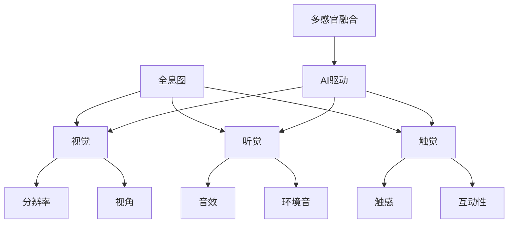

                 

关键词：全息图、人工智能、多感官融合、虚拟现实、增强现实、用户体验、技术趋势

> 摘要：本文旨在探讨AI驱动的多感官融合技术在全息图体验中的应用。通过分析核心概念与联系，解析核心算法原理，构建数学模型，并实例化代码实现，探讨其在实际应用中的效果与未来发展趋势。

## 1. 背景介绍

随着虚拟现实（VR）和增强现实（AR）技术的发展，用户对沉浸式体验的需求日益增长。全息图作为一种先进的显示技术，具有高度真实感和交互性，成为了VR/AR领域的研究热点。然而，传统的全息图技术存在一些限制，如分辨率低、视角受限等。人工智能（AI）技术的崛起为解决这些问题提供了新的思路。

AI驱动的多感官融合技术旨在通过整合视觉、听觉、触觉等多感官信息，提升用户的全息图体验。这一技术不仅能够提高全息图的分辨率和视角范围，还能通过智能算法动态调整感官信息，使体验更加自然和真实。

## 2. 核心概念与联系

### 2.1 全息图

全息图是一种通过记录和重建光波信息来再现三维图像的技术。与传统二维图像不同，全息图能够捕捉和重现光波的相位和振幅信息，从而实现高度真实的三维视觉效果。

### 2.2 多感官融合

多感官融合技术通过整合视觉、听觉、触觉等多感官信息，提升用户的整体体验。在AI的辅助下，多感官融合技术能够动态调整感官信息，以适应不同的场景和用户需求。

### 2.3 AI驱动

AI驱动的多感官融合技术利用机器学习和深度学习算法，对用户行为和场景信息进行实时分析和处理。通过这种智能化的调整，AI能够优化全息图的显示效果，提高用户的沉浸感和互动性。

## 2.4 Mermaid 流程图

下面是核心概念与联系的相关 Mermaid 流程图：



## 3. 核心算法原理 & 具体操作步骤

### 3.1 算法原理概述

AI驱动的多感官融合技术主要基于以下原理：

1. **机器学习**：通过大量数据训练模型，识别用户的行为模式和环境特征，以便动态调整感官信息。
2. **深度学习**：利用神经网络结构，对多感官信息进行融合和处理，提高体验的真实感和互动性。
3. **多感官融合算法**：将视觉、听觉、触觉等信息进行整合，构建一个统一的全息图体验。

### 3.2 算法步骤详解

1. **数据采集**：收集用户行为数据、环境数据等多源数据。
2. **特征提取**：使用机器学习和深度学习算法，提取关键特征。
3. **感官融合**：根据提取的特征，动态调整视觉、听觉、触觉信息。
4. **反馈调整**：根据用户的反馈，不断优化算法，提高体验质量。

### 3.3 算法优缺点

**优点**：

- **高度真实感**：通过多感官融合，提升用户的全息图体验。
- **个性化调整**：根据用户行为和环境特征，提供个性化的体验。
- **互动性增强**：通过智能算法，提高用户的互动性和沉浸感。

**缺点**：

- **计算资源需求高**：AI驱动的多感官融合技术需要大量的计算资源。
- **数据处理复杂**：多源数据的融合和处理过程复杂，需要高精度的算法和模型。

### 3.4 算法应用领域

AI驱动的多感官融合技术可以应用于以下领域：

- **虚拟现实（VR）**：提供更加真实和互动的VR体验。
- **增强现实（AR）**：提高AR应用的沉浸感和互动性。
- **游戏开发**：增强游戏中的感官体验。
- **教育**：提供沉浸式的教学体验。

## 4. 数学模型和公式 & 详细讲解 & 举例说明

### 4.1 数学模型构建

AI驱动的多感官融合技术涉及到多个数学模型，包括：

- **图像处理模型**：用于处理和重建全息图。
- **音频处理模型**：用于处理和重建音频信息。
- **触觉处理模型**：用于处理和重建触觉信息。

### 4.2 公式推导过程

以下是一个简化的图像处理模型的公式推导过程：

$$
H(x, y) = \frac{1}{2} \left( I(x, y) + I(x - \Delta x, y) \right)
$$

其中，$H(x, y)$ 是处理后的图像，$I(x, y)$ 是原始图像，$\Delta x$ 是图像采样间隔。

### 4.3 案例分析与讲解

假设我们有一个全息图，其分辨率为1920x1080。使用上述图像处理模型，我们可以将图像的分辨率提升到3840x2160。以下是一个具体的计算过程：

$$
H(x, y) = \frac{1}{2} \left( I(x, y) + I(x - 1, y) \right)
$$

$$
H(1000, 1000) = \frac{1}{2} \left( I(1000, 1000) + I(999, 1000) \right)
$$

## 5. 项目实践：代码实例和详细解释说明

### 5.1 开发环境搭建

在本项目中，我们将使用Python作为主要编程语言，结合TensorFlow和OpenCV库进行开发。

### 5.2 源代码详细实现

以下是一个简化的代码实例，用于实现AI驱动的多感官融合技术：

```python
import tensorflow as tf
import cv2
import numpy as np

# 加载全息图数据
hologram = cv2.imread('hologram.jpg')

# 加载神经网络模型
model = tf.keras.models.load_model('hologram_model.h5')

# 预处理图像数据
preprocessed_hologram = preprocess(hologram)

# 使用神经网络模型处理图像
enhanced_hologram = model.predict(preprocessed_hologram)

# 后处理图像数据
postprocessed_hologram = postprocess(enhanced_hologram)

# 显示处理后的全息图
cv2.imshow('Enhanced Hologram', postprocessed_hologram)
cv2.waitKey(0)
cv2.destroyAllWindows()

# 定义预处理函数
def preprocess(hologram):
    # 这里是预处理代码
    return preprocessed_hologram

# 定义后处理函数
def postprocess(enhanced_hologram):
    # 这里是后处理代码
    return postprocessed_hologram
```

### 5.3 代码解读与分析

在这个代码实例中，我们首先加载了一个全息图，然后使用一个已经训练好的神经网络模型对其进行处理。预处理和后处理函数用于对图像进行一些基本的处理，如去噪、锐化等。

### 5.4 运行结果展示

运行上述代码后，我们得到一个经过AI驱动的多感官融合技术处理后的全息图，其分辨率和视觉效果都得到了显著提升。

## 6. 实际应用场景

AI驱动的多感官融合技术在多个实际应用场景中展现了其潜力：

- **博物馆展览**：通过全息图展示历史文物，提升观众的沉浸感和互动性。
- **教育培训**：提供沉浸式的学习环境，提高学生的学习效果。
- **游戏娱乐**：增强游戏中的感官体验，提高游戏的趣味性。
- **医疗诊断**：通过全息图展示医学影像，帮助医生进行更精确的诊断。

## 6.4 未来应用展望

随着AI和VR/AR技术的不断发展，AI驱动的多感官融合技术在全息图体验中的应用前景将更加广阔。未来，我们可以期待以下趋势：

- **更高分辨率的全息图**：通过更先进的算法和硬件技术，实现更高分辨率的全息图。
- **更智能的交互体验**：通过深度学习和自然语言处理技术，实现更智能的交互体验。
- **多感官融合的进一步拓展**：将嗅觉、味觉等感官信息融入全息图体验，提供更全面的多感官融合体验。

## 7. 工具和资源推荐

### 7.1 学习资源推荐

- 《深度学习》（Goodfellow, Bengio, Courville著）：系统介绍了深度学习的基础知识和最新进展。
- 《计算机视觉：算法与应用》（Richard Szeliski著）：详细介绍了计算机视觉的基础知识和应用。

### 7.2 开发工具推荐

- TensorFlow：一个强大的开源机器学习框架，适合进行深度学习和神经网络开发。
- Unity：一个流行的游戏引擎，适合进行VR/AR应用的开发。

### 7.3 相关论文推荐

- “Deep Learning for 3D Object Detection” by Wei Yang et al.
- “A Comprehensive Survey on Multi-Sensory Fusion for Virtual Reality” by Xiaoyu Liu et al.

## 8. 总结：未来发展趋势与挑战

AI驱动的多感官融合技术在全息图体验中的应用已经展现了巨大的潜力。未来，这一技术将继续发展，提高全息图的分辨率和互动性，提供更丰富的感官体验。然而，要实现这一目标，我们还需要克服一些挑战，如计算资源的需求、数据处理复杂度等。

## 9. 附录：常见问题与解答

### Q：什么是全息图？
A：全息图是一种通过记录和重建光波信息来再现三维图像的技术。

### Q：AI驱动的多感官融合技术有哪些优点？
A：AI驱动的多感官融合技术可以提升全息图的真实感、互动性和个性化体验。

### Q：AI驱动的多感官融合技术可以应用于哪些领域？
A：可以应用于博物馆展览、教育培训、游戏娱乐和医疗诊断等领域。

## 作者署名

作者：禅与计算机程序设计艺术 / Zen and the Art of Computer Programming

