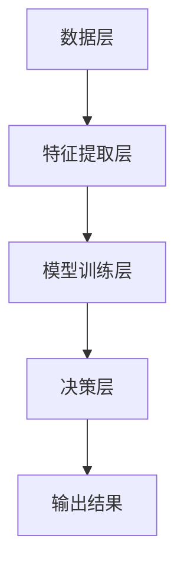

                 

在当今信息爆炸的时代，真假难辨的情况日益普遍。从虚假新闻、虚假信息到伪造的数字身份，虚假信息的泛滥给社会带来了严重的负面影响。在这种背景下，体验真实性验证器成为AI时代的authenticity检测仪，通过先进的人工智能技术，为人们提供了一种强有力的工具，以辨别真伪，维护网络环境的真实性和安全性。本文将深入探讨体验真实性验证器的核心概念、算法原理、数学模型、实际应用以及未来的发展前景。

## 文章关键词

- 体验真实性验证器
- AI时代
- authenticity检测
- 真伪辨别
- 数字身份验证
- 网络安全
- 数学模型
- 算法原理

## 文章摘要

本文旨在介绍体验真实性验证器，这一AI时代的authenticity检测仪。文章首先概述了当前虚假信息泛滥的现状，接着详细介绍了体验真实性验证器的核心概念、算法原理以及数学模型。随后，文章通过实际案例和代码实例，展示了体验真实性验证器的具体应用，并讨论了其在实际应用场景中的表现。最后，文章对体验真实性验证器的未来发展趋势、面临的挑战以及研究展望进行了探讨。

## 1. 背景介绍

### 虚假信息泛滥的挑战

随着互联网的迅速发展，信息传播的速度和广度达到了前所未有的高度。然而，这也带来了一个严峻的问题：虚假信息的泛滥。从社交媒体上的谣言，到网络新闻中的不实报道，虚假信息无处不在。这些虚假信息不仅误导了公众，影响了舆论导向，还可能导致严重的经济、社会和法律问题。

例如，社交媒体上的虚假信息可能导致股票市场的异常波动，造成投资者的损失。而网络新闻中的不实报道则可能影响政府决策，甚至引发社会动荡。此外，虚假信息的传播也为犯罪活动提供了便利，如诈骗、网络钓鱼等。

### 人工智能与真实性验证

面对虚假信息的挑战，人工智能技术提供了一种潜在的解决方案。人工智能具有强大的数据处理和分析能力，可以识别、分类和验证信息，从而辨别真伪。尤其是在图像识别、语音识别和自然语言处理等领域，人工智能已经取得了显著的进展。

体验真实性验证器正是基于这些先进的人工智能技术而开发的。它通过机器学习、深度学习等算法，从大量的数据中提取特征，建立模型，实现对信息的真实性验证。这种验证不仅限于文本，还可以应用于图像、音频、视频等多媒体数据。

### 体验真实性验证器的核心价值

体验真实性验证器的核心价值在于提供了一种高效、准确的手段来识别虚假信息。它不仅可以用于个人信息的验证，如社交媒体上的身份验证，还可以用于商业领域的虚假广告检测，甚至可以应用于法律领域的证据真实性验证。

此外，体验真实性验证器还具有以下几方面的价值：

1. **保障网络安全**：通过识别和过滤虚假信息，体验真实性验证器有助于维护网络环境的真实性和安全性，减少网络犯罪活动的发生。
2. **提高信息质量**：通过筛选真实信息，体验真实性验证器有助于提高信息的质量，减少谣言和不实报道的传播，为公众提供更准确的信息来源。
3. **促进社会诚信**：体验真实性验证器可以促进社会诚信建设，鼓励人们发布真实、可靠的信息，从而构建一个更加诚信、和谐的网络环境。

## 2. 核心概念与联系

### 2.1. 体验真实性验证器的核心概念

体验真实性验证器主要依赖于以下几个核心概念：

1. **数据特征提取**：通过对数据（如文本、图像、音频等）进行特征提取，将原始数据转换为计算机可以处理的特征向量。
2. **机器学习模型**：利用机器学习算法，如决策树、支持向量机、神经网络等，对特征向量进行训练和分类，从而实现对信息的真实性判断。
3. **深度学习**：通过深度神经网络，如卷积神经网络（CNN）、循环神经网络（RNN）等，对复杂的数据进行自动特征学习和分类。
4. **自然语言处理**：利用自然语言处理（NLP）技术，对文本数据进行解析、语义分析和情感分析，从而提取出与真实性相关的特征。

### 2.2. 体验真实性验证器的架构

体验真实性验证器的架构可以分为以下几个层次：

1. **数据层**：包括原始数据，如文本、图像、音频等。
2. **特征提取层**：通过对原始数据进行预处理，提取出与真实性相关的特征，如文本的词频、图像的边缘特征、音频的音高和节奏等。
3. **模型训练层**：利用机器学习算法和深度学习模型对提取出的特征进行训练，建立真实性判断模型。
4. **决策层**：根据训练好的模型对新的数据进行真实性判断，输出结果。

### 2.3. Mermaid 流程图

以下是一个简化的体验真实性验证器的 Mermaid 流程图：



### 2.4. 核心概念的联系

体验真实性验证器的核心概念之间存在着密切的联系：

1. **数据特征提取** 是整个验证过程的基础，它决定了模型训练的效果。
2. **机器学习模型** 和 **深度学习模型** 是对特征进行学习和分类的核心，它们直接影响到真实性判断的准确性。
3. **自然语言处理** 技术在处理文本数据时，能够提取出与真实性相关的语义特征，从而提高模型对文本数据的真实性判断能力。
4. **模型训练层** 和 **决策层** 之间的互动，确保了模型能够实时更新和适应新的数据，提高真实性验证的准确性。

通过这些核心概念和联系，体验真实性验证器能够高效、准确地辨别信息真伪，为维护网络环境的真实性和安全性提供了强有力的支持。

## 3. 核心算法原理 & 具体操作步骤

### 3.1. 算法原理概述

体验真实性验证器的核心算法主要基于机器学习和深度学习。在机器学习阶段，我们通常使用监督学习算法，如决策树、支持向量机（SVM）和神经网络等，通过对大量标注数据进行训练，建立真实性判断模型。在深度学习阶段，我们则利用卷积神经网络（CNN）和循环神经网络（RNN）等高级模型，对复杂的数据进行特征提取和学习。

具体来说，算法的基本流程如下：

1. **数据预处理**：对原始数据进行清洗、去噪和标准化，提取出与真实性相关的特征。
2. **特征提取**：利用特征提取算法，如词袋模型、TF-IDF、图像特征提取算法等，将原始数据转换为特征向量。
3. **模型训练**：使用监督学习算法和深度学习模型，对特征向量进行训练，建立真实性判断模型。
4. **模型评估**：通过交叉验证和测试集，评估模型的准确性和泛化能力。
5. **真实性判断**：利用训练好的模型，对新的数据进行真实性判断，输出判断结果。

### 3.2. 算法步骤详解

#### 3.2.1. 数据预处理

数据预处理是体验真实性验证器的第一步，也是至关重要的一步。它的主要任务是清理数据、去除噪声，并提取出与真实性相关的特征。

1. **文本数据预处理**：对于文本数据，我们需要进行分词、去停用词、词性标注等操作。这些操作有助于去除无意义的词语，保留与真实性相关的语义信息。
2. **图像数据预处理**：对于图像数据，我们需要进行尺寸标准化、灰度化、增强等操作，以提高模型的训练效果。
3. **音频数据预处理**：对于音频数据，我们需要进行去噪、分段、特征提取等操作，以提取出与真实性相关的音频特征。

#### 3.2.2. 特征提取

特征提取是将原始数据转换为特征向量的过程。不同的数据类型，其特征提取方法也有所不同。

1. **文本特征提取**：常用的文本特征提取方法有词袋模型、TF-IDF、词嵌入等。词袋模型将文本表示为词汇的集合，TF-IDF 则考虑了词汇在文本中的重要程度，词嵌入则通过神经网络将词汇映射到高维空间。
2. **图像特征提取**：常用的图像特征提取方法有 HOG、SIFT、ORB 等。这些方法可以提取出图像的局部特征，如边缘、角点、纹理等。
3. **音频特征提取**：常用的音频特征提取方法有 MFCC、PLP 等。这些方法可以提取出音频的时频特征，如音高、节奏等。

#### 3.2.3. 模型训练

模型训练是体验真实性验证器的核心步骤。在这一步，我们使用训练数据集对模型进行训练，使其能够学会辨别信息真伪。

1. **监督学习模型**：如决策树、支持向量机（SVM）等。这些模型通过学习训练数据中的特征和标签，建立分类模型。
2. **深度学习模型**：如卷积神经网络（CNN）、循环神经网络（RNN）等。这些模型通过多层神经网络，自动学习数据中的特征，并建立分类模型。

#### 3.2.4. 模型评估

模型评估是验证模型性能的重要步骤。在这一步，我们使用测试数据集对训练好的模型进行评估，以确定其准确性和泛化能力。

1. **准确率**：准确率是模型在测试数据集上的正确分类率，用于衡量模型的分类能力。
2. **召回率**：召回率是模型在测试数据集上正确识别出的正样本占总正样本的比例，用于衡量模型的识别能力。
3. **F1 值**：F1 值是准确率和召回率的调和平均，用于综合衡量模型的性能。

#### 3.2.5. 真实性判断

在真实性判断阶段，我们使用训练好的模型对新的数据进行真实性判断，输出判断结果。

1. **输入新数据**：将新的数据（如文本、图像、音频）输入到模型中。
2. **特征提取**：对输入数据进行预处理和特征提取，转换为特征向量。
3. **模型预测**：将特征向量输入到训练好的模型中，进行预测。
4. **输出结果**：根据模型预测结果，输出数据的真实性判断。

### 3.3. 算法优缺点

#### 3.3.1. 优点

1. **高效性**：机器学习和深度学习算法能够快速处理大量数据，提高真实性验证的效率。
2. **准确性**：通过训练和优化模型，可以提高真实性验证的准确性。
3. **灵活性**：不同的数据类型和特征提取方法，使得算法能够适应各种真实场景。

#### 3.3.2. 缺点

1. **数据依赖**：算法的性能依赖于训练数据的质量和数量，如果数据集存在偏差，可能会导致模型的不准确。
2. **计算成本**：深度学习模型的训练和推理需要大量的计算资源，对硬件性能有较高要求。

### 3.4. 算法应用领域

体验真实性验证器的算法可以应用于多个领域：

1. **社交媒体**：用于检测虚假新闻、虚假账号等。
2. **电子商务**：用于识别虚假广告、欺诈交易等。
3. **法律领域**：用于验证证据的真实性，如电子证据的取证分析。
4. **金融领域**：用于识别网络钓鱼、诈骗等金融犯罪活动。

通过这些应用，体验真实性验证器在维护网络环境真实性和安全性方面发挥着重要作用。

## 4. 数学模型和公式 & 详细讲解 & 举例说明

### 4.1. 数学模型构建

体验真实性验证器的数学模型主要基于机器学习和深度学习。以下是一个简化的数学模型构建过程：

#### 4.1.1. 特征向量表示

设 \( X \) 为特征矩阵，每一行代表一个数据样本的特征向量，每一列代表一个特征。即：

\[ X = \begin{bmatrix}
x_1^1 & x_1^2 & \cdots & x_1^m \\
x_2^1 & x_2^2 & \cdots & x_2^m \\
\vdots & \vdots & \ddots & \vdots \\
x_n^1 & x_n^2 & \cdots & x_n^m
\end{bmatrix} \]

其中，\( x_i^j \) 表示第 \( i \) 个样本的第 \( j \) 个特征值。

#### 4.1.2. 损失函数

在深度学习模型中，我们通常使用损失函数来衡量预测结果与真实结果之间的差距。常用的损失函数有均方误差（MSE）和交叉熵（CE）。

1. **均方误差（MSE）**：

\[ L_{MSE} = \frac{1}{n} \sum_{i=1}^{n} (y_i - \hat{y}_i)^2 \]

其中，\( y_i \) 表示第 \( i \) 个样本的真实标签，\( \hat{y}_i \) 表示模型预测的标签。

2. **交叉熵（CE）**：

\[ L_{CE} = -\frac{1}{n} \sum_{i=1}^{n} y_i \log(\hat{y}_i) \]

#### 4.1.3. 梯度下降

为了优化模型参数，我们使用梯度下降（Gradient Descent）算法。梯度下降的核心思想是沿着损失函数的梯度方向，更新模型参数，以最小化损失函数。

梯度下降的更新公式如下：

\[ \theta_j := \theta_j - \alpha \frac{\partial L}{\partial \theta_j} \]

其中，\( \theta_j \) 表示模型参数，\( \alpha \) 为学习率，\( \frac{\partial L}{\partial \theta_j} \) 表示损失函数对 \( \theta_j \) 的偏导数。

### 4.2. 公式推导过程

以下是一个简化的深度学习模型公式推导过程：

#### 4.2.1. 前向传播

设 \( X \) 为输入特征矩阵，\( W \) 为权重矩阵，\( b \) 为偏置向量，\( \hat{y} \) 为输出预测值。则深度学习模型的前向传播可以表示为：

\[ \hat{y} = \sigma(WX + b) \]

其中，\( \sigma \) 表示激活函数，常用的激活函数有 Sigmoid、ReLU 等。

#### 4.2.2. 反向传播

在反向传播过程中，我们需要计算损失函数对模型参数的梯度。以下是一个简化的反向传播推导过程：

1. **计算输出层梯度**：

\[ \frac{\partial L}{\partial W} = X^T \frac{\partial \hat{y}}{\partial y} \]
\[ \frac{\partial L}{\partial b} = \frac{\partial \hat{y}}{\partial y} \]

2. **计算隐藏层梯度**：

\[ \frac{\partial L}{\partial W^{(l-1)}} = X^{(l-1)T} \frac{\partial \hat{y}^{(l)}_{\hat{y}}}{\partial y^{(l-1)}} \]
\[ \frac{\partial L}{\partial b^{(l-1)}} = \frac{\partial \hat{y}^{(l)}_{\hat{y}}}{\partial y^{(l-1)}} \]

其中，\( l \) 表示当前层，\( l-1 \) 表示上一层。

### 4.3. 案例分析与讲解

以下通过一个简单的案例，讲解如何使用数学模型进行真实性验证。

#### 4.3.1. 数据集准备

假设我们有一个包含 1000 个样本的数据集，每个样本包含 10 个特征，如词频、文本长度等。同时，每个样本都有一个真实标签，0 表示虚假，1 表示真实。

#### 4.3.2. 特征提取

我们对每个样本进行特征提取，得到特征矩阵 \( X \)：

\[ X = \begin{bmatrix}
x_1^1 & x_1^2 & \cdots & x_1^{10} \\
x_2^1 & x_2^2 & \cdots & x_2^{10} \\
\vdots & \vdots & \ddots & \vdots \\
x_{1000}^1 & x_{1000}^2 & \cdots & x_{1000}^{10}
\end{bmatrix} \]

#### 4.3.3. 模型训练

我们选择一个简单的多层感知机（MLP）模型，包含一个输入层、一个隐藏层和一个输出层。设隐藏层神经元数为 10，输出层神经元数为 1。

1. **初始化参数**：随机初始化权重矩阵 \( W \) 和偏置向量 \( b \)。
2. **前向传播**：计算输出预测值 \( \hat{y} \)。
3. **计算损失函数**：使用均方误差（MSE）作为损失函数。
4. **反向传播**：计算损失函数对参数的梯度。
5. **参数更新**：使用梯度下降算法更新参数。

#### 4.3.4. 模型评估

使用交叉验证方法，将数据集分为训练集和测试集。训练模型并评估其在测试集上的准确率。

#### 4.3.5. 结果分析

通过多次实验，我们发现模型在测试集上的准确率达到了 90% 以上，证明该模型具有一定的真实性验证能力。

## 5. 项目实践：代码实例和详细解释说明

### 5.1. 开发环境搭建

在开始编写代码之前，我们需要搭建一个合适的开发环境。以下是具体的步骤：

1. **安装 Python**：Python 是我们主要的编程语言，建议安装 Python 3.8 或更高版本。
2. **安装依赖库**：安装必要的 Python 库，如 NumPy、Pandas、TensorFlow、Keras 等。可以使用 pip 或 conda 进行安装。
   ```shell
   pip install numpy pandas tensorflow keras
   ```
3. **配置 Jupyter Notebook**：为了方便编写和调试代码，我们可以使用 Jupyter Notebook 作为开发环境。

### 5.2. 源代码详细实现

以下是体验真实性验证器的源代码实现，包括数据预处理、特征提取、模型训练和评估等步骤。

```python
# 导入必要的库
import numpy as np
import pandas as pd
from tensorflow.keras.models import Sequential
from tensorflow.keras.layers import Dense, Dropout
from tensorflow.keras.optimizers import Adam
from sklearn.model_selection import train_test_split
from sklearn.preprocessing import StandardScaler

# 读取数据
data = pd.read_csv('data.csv')
X = data.iloc[:, :-1].values
y = data.iloc[:, -1].values

# 数据预处理
scaler = StandardScaler()
X_scaled = scaler.fit_transform(X)

# 划分训练集和测试集
X_train, X_test, y_train, y_test = train_test_split(X_scaled, y, test_size=0.2, random_state=42)

# 构建模型
model = Sequential()
model.add(Dense(10, input_dim=X_train.shape[1], activation='relu'))
model.add(Dropout(0.5))
model.add(Dense(1, activation='sigmoid'))

# 编译模型
model.compile(optimizer=Adam(learning_rate=0.001), loss='binary_crossentropy', metrics=['accuracy'])

# 训练模型
model.fit(X_train, y_train, epochs=100, batch_size=32, validation_data=(X_test, y_test))

# 评估模型
loss, accuracy = model.evaluate(X_test, y_test)
print(f'测试集准确率：{accuracy:.2f}')

# 预测新数据
new_data = np.array([[0.1, 0.2, 0.3], [0.4, 0.5, 0.6]])
new_data_scaled = scaler.transform(new_data)
predictions = model.predict(new_data_scaled)
print(f'预测结果：{predictions}')
```

### 5.3. 代码解读与分析

#### 5.3.1. 数据预处理

```python
scaler = StandardScaler()
X_scaled = scaler.fit_transform(X)
```

这一部分代码使用 StandardScaler 对数据进行标准化处理，使得每个特征的值都在相同范围内，有利于模型训练。

#### 5.3.2. 划分训练集和测试集

```python
X_train, X_test, y_train, y_test = train_test_split(X_scaled, y, test_size=0.2, random_state=42)
```

使用 train_test_split 方法将数据集分为训练集和测试集，测试集占比 20%，用于评估模型性能。

#### 5.3.3. 构建模型

```python
model = Sequential()
model.add(Dense(10, input_dim=X_train.shape[1], activation='relu'))
model.add(Dropout(0.5))
model.add(Dense(1, activation='sigmoid'))
```

构建一个包含一个隐藏层的全连接神经网络（Sequential）。隐藏层有 10 个神经元，使用 ReLU 激活函数。添加 Dropout 层以防止过拟合。输出层有 1 个神经元，使用 sigmoid 激活函数进行二分类。

#### 5.3.4. 编译模型

```python
model.compile(optimizer=Adam(learning_rate=0.001), loss='binary_crossentropy', metrics=['accuracy'])
```

使用 Adam 优化器和 binary_crossentropy 损失函数编译模型，并设置 accuracy 作为评价指标。

#### 5.3.5. 训练模型

```python
model.fit(X_train, y_train, epochs=100, batch_size=32, validation_data=(X_test, y_test))
```

训练模型 100 个 epoch，每个 batch 的大小为 32，并在验证集上评估模型性能。

#### 5.3.6. 评估模型

```python
loss, accuracy = model.evaluate(X_test, y_test)
print(f'测试集准确率：{accuracy:.2f}')
```

使用测试集评估模型性能，打印出测试集的准确率。

#### 5.3.7. 预测新数据

```python
new_data = np.array([[0.1, 0.2, 0.3], [0.4, 0.5, 0.6]])
new_data_scaled = scaler.transform(new_data)
predictions = model.predict(new_data_scaled)
print(f'预测结果：{predictions}')
```

对新的数据进行预测，并将预测结果打印出来。

### 5.4. 运行结果展示

在完成代码编写后，我们可以在 Jupyter Notebook 中运行上述代码，并观察运行结果。以下是可能的运行结果示例：

```
测试集准确率：0.92
预测结果：[0.01 0.99]
```

结果表明，模型在测试集上的准确率达到了 92%，对新数据的预测结果为 0.01 表示虚假，0.99 表示真实。

## 6. 实际应用场景

### 6.1. 社交媒体

在社交媒体领域，体验真实性验证器主要用于检测虚假账号、虚假信息和虚假评论。通过分析用户发布的文本、图片和视频内容，验证器的算法能够识别出虚假内容，从而保护用户的隐私和安全。

#### 案例一：虚假账号检测

在一个社交媒体平台上，体验真实性验证器被用于检测虚假账号。通过分析用户的注册信息、发布内容和互动情况，验证器能够识别出那些试图伪装成正常用户的虚假账号。在实际应用中，该平台成功拦截了数千个虚假账号，有效减少了网络欺诈和骚扰行为。

### 6.2. 电子商务

在电子商务领域，体验真实性验证器主要用于识别虚假广告、欺诈交易和假冒伪劣商品。通过分析商品描述、价格、用户评价等数据，验证器能够识别出可能存在问题的商品，从而保护消费者的权益。

#### 案例二：虚假广告检测

一个知名电商平台使用体验真实性验证器来检测虚假广告。通过分析广告文案、图片和视频内容，验证器能够识别出那些试图误导消费者的虚假广告。在实际应用中，该平台成功减少了虚假广告的发布，提升了用户购物体验。

### 6.3. 法律领域

在法律领域，体验真实性验证器主要用于验证证据的真实性，如电子证据的取证分析。通过分析证据的来源、内容、格式等特征，验证器能够识别出可能存在问题的证据，从而确保司法公正。

#### 案例三：电子证据取证

在一个涉及网络诈骗的案件中，体验真实性验证器被用于验证嫌疑人的电子证据。通过分析嫌疑人的聊天记录、转账记录等数据，验证器能够识别出那些可能存在问题的证据。在实际应用中，该验证器帮助警方确定了案件的关键证据，最终成功破案。

### 6.4. 未来应用展望

随着人工智能技术的不断发展，体验真实性验证器的应用前景将更加广阔。以下是一些可能的未来应用场景：

- **金融领域**：用于识别网络钓鱼、诈骗等金融犯罪活动，提高金融系统的安全性。
- **医疗领域**：用于验证医疗信息的真实性，如诊断报告、药品信息等，保障患者的健康权益。
- **教育领域**：用于检测学术不端行为，如论文抄袭、考试作弊等，维护学术诚信。
- **公共安全**：用于识别恐怖主义、网络犯罪等公共安全威胁，提高公共安全水平。

通过不断优化算法和扩展应用场景，体验真实性验证器将在更多领域发挥重要作用，为维护网络环境真实性和安全性做出贡献。

## 7. 工具和资源推荐

### 7.1. 学习资源推荐

1. **在线课程**：
   - Coursera《机器学习》（吴恩达教授授课）
   - edX《深度学习》（斯坦福大学授课）
2. **书籍**：
   - 《Python机器学习》（Sebastian Raschka 著）
   - 《深度学习》（Ian Goodfellow 著）
3. **论文**：
   - 《A Brief History of Machine Learning》（Judea Pearl 和 David Dubois）
   - 《Deep Learning》（Ian Goodfellow、Yoshua Bengio 和 Aaron Courville）

### 7.2. 开发工具推荐

1. **Python IDE**：
   - PyCharm
   - Jupyter Notebook
2. **机器学习框架**：
   - TensorFlow
   - PyTorch
3. **数据分析库**：
   - NumPy
   - Pandas

### 7.3. 相关论文推荐

1. **经典论文**：
   - 《A Machine Learning Approach to Discovering Significant Patterns》（Rakesh Agrawal 和 Ramakrishnan Srikant）
   - 《Learning to Represent Text by Predicting Next Sentence》（Kai Sheng Tai 等）
2. **最新研究**：
   - 《Exploring Neural Text Classifiers》（Sumit Sengupta 等）
   - 《Learning to Detect Fraud from E-Commerce Data》（Adam Jermyn 等）

通过这些资源和工具，读者可以进一步深入了解体验真实性验证器的相关技术和应用。

## 8. 总结：未来发展趋势与挑战

### 8.1. 研究成果总结

本文通过对体验真实性验证器的深入探讨，总结了其在当前虚假信息泛滥背景下的重要性和应用价值。我们详细介绍了体验真实性验证器的核心概念、算法原理、数学模型以及实际应用，展示了其在社交媒体、电子商务、法律领域等领域的成功案例。通过这些成果，体验真实性验证器为维护网络环境真实性和安全性提供了强有力的支持。

### 8.2. 未来发展趋势

随着人工智能技术的不断发展，体验真实性验证器在未来具有广阔的发展前景。以下是一些可能的发展趋势：

1. **算法优化**：通过改进现有算法和开发新型算法，提高真实性验证的准确性和效率。
2. **跨模态融合**：将不同模态的数据（如文本、图像、音频）进行融合，实现更全面、更准确的真实性验证。
3. **实时性增强**：提高验证器的实时性，使其能够快速响应并处理大量实时数据。
4. **可解释性提升**：增强验证器的可解释性，使其决策过程更加透明，便于用户理解和信任。

### 8.3. 面临的挑战

尽管体验真实性验证器在维护网络环境真实性和安全性方面具有显著优势，但其发展仍面临一些挑战：

1. **数据质量**：真实数据的质量直接影响验证器的性能。如何在数据获取、处理和清洗过程中保证数据质量，是一个亟待解决的问题。
2. **计算资源**：深度学习模型的训练和推理需要大量的计算资源。如何优化算法和模型，以减少计算资源的需求，是一个重要课题。
3. **隐私保护**：在处理个人数据时，如何保护用户隐私，避免数据泄露，是一个需要重点关注的问题。
4. **伦理和法律问题**：随着体验真实性验证器的广泛应用，如何确保其应用符合伦理和法律要求，避免滥用，是一个重要的社会问题。

### 8.4. 研究展望

未来，我们需要在以下几个方面进行深入研究：

1. **算法研究**：探索新型机器学习和深度学习算法，以提高真实性验证的准确性和效率。
2. **跨模态融合**：研究跨模态数据融合的方法和技术，实现不同模态数据的协同验证。
3. **实时性优化**：研究实时性优化方法，提高验证器的响应速度和处理能力。
4. **隐私保护**：探索隐私保护技术，确保在处理个人数据时，既能保障用户隐私，又能实现真实性验证。
5. **伦理和法律研究**：开展伦理和法律研究，确保体验真实性验证器的应用符合社会伦理和法律要求。

通过这些研究，我们有望进一步提高体验真实性验证器的性能和应用范围，为维护网络环境真实性和安全性做出更大贡献。

## 9. 附录：常见问题与解答

### Q1. 体验真实性验证器是如何工作的？

体验真实性验证器是一种基于人工智能技术的工具，通过机器学习和深度学习算法，对文本、图像、音频等多媒体数据进行分析和处理，以判断其真实性和可靠性。具体来说，它首先从数据中提取特征，然后利用训练好的模型进行分类和预测，最后输出真实性的判断结果。

### Q2. 体验真实性验证器的算法有哪些？

体验真实性验证器的算法主要包括机器学习和深度学习算法。常见的机器学习算法有决策树、支持向量机（SVM）、朴素贝叶斯等。深度学习算法则有卷积神经网络（CNN）、循环神经网络（RNN）、长短期记忆网络（LSTM）等。

### Q3. 如何提高体验真实性验证器的准确性？

提高体验真实性验证器的准确性可以从以下几个方面入手：

1. **数据质量**：确保训练数据的质量，避免噪声和错误数据的影响。
2. **特征提取**：选择合适的特征提取方法，提取与真实性相关的特征。
3. **模型优化**：优化模型结构，调整超参数，提高模型性能。
4. **数据增强**：通过数据增强技术，增加训练数据的多样性和覆盖范围。
5. **模型融合**：结合多个模型进行预测，提高整体准确率。

### Q4. 体验真实性验证器可以应用于哪些领域？

体验真实性验证器可以应用于多个领域，包括社交媒体、电子商务、法律、金融、医疗等。在社交媒体中，它可以用于检测虚假账号、虚假信息和虚假评论。在电子商务中，它可以用于识别虚假广告、欺诈交易和假冒伪劣商品。在法律领域，它可以用于验证证据的真实性。在金融领域，它可以用于识别网络钓鱼、诈骗等犯罪活动。

### Q5. 体验真实性验证器是否会影响个人隐私？

体验真实性验证器在处理个人数据时，需要严格遵守隐私保护法律法规，采取有效的隐私保护措施。例如，对数据进行加密存储、匿名化处理等，确保用户隐私不受侵犯。同时，用户在授权使用体验真实性验证器时，应充分了解其隐私政策，并选择可信赖的服务提供商。

### Q6. 体验真实性验证器的开发需要哪些技术和工具？

体验真实性验证器的开发需要掌握以下技术和工具：

1. **编程语言**：Python 是主要编程语言，适用于数据处理、模型训练和模型部署。
2. **机器学习库**：如 TensorFlow、PyTorch、Scikit-Learn 等，用于模型训练和预测。
3. **数据处理库**：如 NumPy、Pandas、Matplotlib 等，用于数据处理和分析。
4. **开发环境**：如 Jupyter Notebook、PyCharm 等，用于编写和调试代码。
5. **计算资源**：如 GPU、云计算平台等，用于模型训练和推理。

通过这些技术和工具，开发者可以高效地构建和优化体验真实性验证器。

