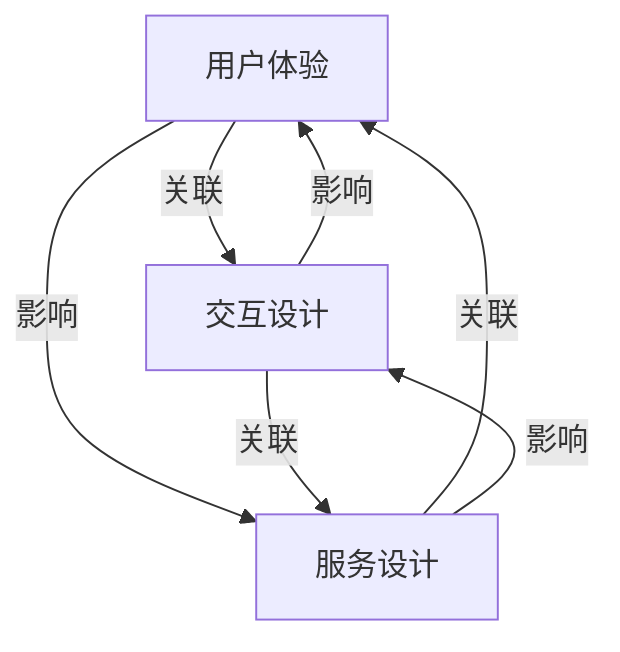

                 

在当今快速发展的技术时代，体验设计正成为企业成功的关键因素。随着人工智能（AI）的迅猛发展，AI与人类创意的协作成为了体验设计领域的重要研究方向。本文旨在探讨AI在体验设计中的应用，以及AI与人类创意如何共同推动体验设计的未来。

> 关键词：体验设计、人工智能、创意协作、用户体验、设计未来

> 摘要：本文首先介绍了体验设计的背景和重要性，然后探讨了AI在体验设计中的应用场景和优势。接着，分析了AI与人类创意的协作模式，并提出了未来体验设计的发展趋势和面临的挑战。

## 1. 背景介绍

体验设计（Experience Design）是一种以用户为中心的设计方法，旨在为用户提供高质量的体验。体验设计涵盖了多个领域，包括用户体验（UX）设计、界面设计（UI）设计、交互设计、服务设计等。随着互联网和移动设备的普及，体验设计逐渐成为了企业竞争的关键因素。

近年来，人工智能技术的快速发展为体验设计带来了新的机遇。AI能够通过数据分析和机器学习算法，为用户提供个性化的体验。同时，AI可以自动化设计流程中的某些环节，提高设计效率和效果。然而，AI也面临着一些挑战，如算法的可解释性、数据的隐私和安全等。

## 2. 核心概念与联系

在体验设计领域，核心概念包括用户体验、交互设计、服务设计等。这些概念相互关联，共同构成了体验设计的整体框架。

### 2.1 用户体验（User Experience, UX）

用户体验是指用户在使用产品或服务过程中的感受和体验。用户体验设计关注用户的需求、行为和情感，旨在为用户提供高质量、易用和愉悦的体验。

### 2.2 交互设计（Interaction Design）

交互设计是指设计用户与产品或服务之间的交互方式。交互设计关注交互流程、交互界面和交互元素，旨在提高用户的使用效率和满意度。

### 2.3 服务设计（Service Design）

服务设计是指设计产品或服务与用户之间的整体关系。服务设计关注服务流程、服务价值和用户价值，旨在为用户提供无缝、连贯和优质的服务体验。

下面是一个Mermaid流程图，展示了体验设计领域的核心概念和它们之间的联系：



## 3. 核心算法原理 & 具体操作步骤

### 3.1  算法原理概述

AI在体验设计中的应用主要包括以下几个方面：

- 数据分析：通过收集用户行为数据，分析用户的兴趣、需求和偏好，为用户提供个性化的体验。
- 机器学习：利用机器学习算法，预测用户的行为和需求，优化交互界面和用户体验。
- 自然语言处理：通过自然语言处理技术，实现用户与产品的自然交互，提高用户体验的便捷性。
- 计算机视觉：利用计算机视觉技术，分析用户的面部表情和动作，为用户提供情感化的体验。

### 3.2  算法步骤详解

以下是AI在体验设计中的应用步骤：

1. 数据收集：收集用户行为数据，如点击、浏览、搜索等。
2. 数据预处理：对数据进行清洗、转换和归一化，为后续分析做准备。
3. 特征提取：从数据中提取关键特征，如用户偏好、兴趣等。
4. 模型训练：利用机器学习算法，训练用户行为预测模型。
5. 交互优化：根据用户行为预测模型，优化交互界面和用户体验。
6. 持续迭代：根据用户反馈和实际效果，持续迭代优化体验设计。

### 3.3  算法优缺点

- 优点：
  - 个性化体验：AI能够根据用户行为和需求，为用户提供个性化的体验。
  - 高效设计：AI可以自动化设计流程中的某些环节，提高设计效率。
  - 数据驱动：AI基于大量用户数据，实现数据驱动的体验设计。

- 缺点：
  - 可解释性：AI算法的黑箱性质使得其决策过程难以解释，影响用户体验。
  - 数据隐私：用户数据的收集和使用可能引发数据隐私问题。
  - 技术依赖：体验设计过度依赖AI技术，可能导致设计创新能力的下降。

### 3.4  算法应用领域

AI在体验设计中的应用领域广泛，主要包括：

- 电商平台：利用AI分析用户行为，实现个性化推荐、智能客服等。
- 金融领域：利用AI优化金融产品的用户体验，如理财顾问、贷款审批等。
- 医疗领域：利用AI分析患者数据，实现个性化诊疗、远程医疗服务等。
- 教育领域：利用AI分析学生学习行为，实现个性化教学、学习辅导等。

## 4. 数学模型和公式 & 详细讲解 & 举例说明

### 4.1  数学模型构建

在体验设计中，常用的数学模型包括回归模型、分类模型、聚类模型等。以下是这些模型的构建过程：

#### 回归模型（Regression Model）

回归模型用于预测用户行为或需求。假设我们有 $n$ 个样本数据，每个样本由特征向量 $x_i$ 和目标值 $y_i$ 组成。回归模型的目的是找到特征向量 $x_i$ 和目标值 $y_i$ 之间的线性关系。

$$
y_i = \beta_0 + \beta_1 x_{i1} + \beta_2 x_{i2} + ... + \beta_n x_{in} + \epsilon_i
$$

其中，$\beta_0, \beta_1, ..., \beta_n$ 是回归系数，$\epsilon_i$ 是误差项。

#### 分类模型（Classification Model）

分类模型用于将用户行为或需求划分为不同的类别。假设我们有 $n$ 个样本数据，每个样本由特征向量 $x_i$ 和类别标签 $y_i$ 组成。分类模型的目的是找到特征向量 $x_i$ 和类别标签 $y_i$ 之间的映射关系。

$$
y_i = f(x_i; \theta)
$$

其中，$f$ 是分类函数，$\theta$ 是模型参数。

#### 聚类模型（Clustering Model）

聚类模型用于将用户行为或需求划分为不同的群体。假设我们有 $n$ 个样本数据，每个样本由特征向量 $x_i$ 组成。聚类模型的目的是找到特征向量 $x_i$ 之间的相似性，并将它们划分为不同的群体。

$$
C = \{C_1, C_2, ..., C_k\}
$$

其中，$C$ 是聚类结果，$C_i$ 是第 $i$ 个群体。

### 4.2  公式推导过程

以下是对回归模型的推导过程：

#### 步骤1：最小化损失函数

我们使用最小二乘法来最小化损失函数，即找到使得损失函数最小的回归系数。

$$
J(\theta) = \frac{1}{2} \sum_{i=1}^{n} (y_i - \theta^T x_i)^2
$$

#### 步骤2：求导并令导数为零

对损失函数 $J(\theta)$ 求导，并令导数为零，求得回归系数 $\theta$。

$$
\frac{\partial J(\theta)}{\partial \theta} = \sum_{i=1}^{n} (y_i - \theta^T x_i) x_i = 0
$$

#### 步骤3：解方程组

解上述方程组，求得回归系数 $\theta$。

$$
\theta = (X^T X)^{-1} X^T y
$$

其中，$X$ 是特征矩阵，$y$ 是目标值。

### 4.3  案例分析与讲解

以下是一个回归模型的案例：

假设我们有10个用户的行为数据，每个用户有两个特征（点击次数和浏览时长），目标值是用户的购买概率。

| 用户ID | 点击次数 | 浏览时长 | 购买概率 |
|--------|--------|--------|--------|
| 1      | 5      | 30     | 0.2    |
| 2      | 10     | 60     | 0.4    |
| 3      | 15     | 90     | 0.6    |
| 4      | 20     | 120    | 0.8    |
| 5      | 25     | 150    | 1.0    |
| 6      | 30     | 180    | 0.8    |
| 7      | 35     | 210    | 0.6    |
| 8      | 40     | 240    | 0.4    |
| 9      | 45     | 270    | 0.2    |
| 10     | 50     | 300    | 0.0    |

我们使用线性回归模型来预测购买概率。首先，我们将数据分为特征矩阵 $X$ 和目标值 $y$。

| 特征矩阵 $X$   | 目标值 $y$ |
|----------------|------------|
| [5 30]         | [0.2]      |
| [10 60]        | [0.4]      |
| [15 90]        | [0.6]      |
| [20 120]       | [0.8]      |
| [25 150]       | [1.0]      |
| [30 180]       | [0.8]      |
| [35 210]       | [0.6]      |
| [40 240]       | [0.4]      |
| [45 270]       | [0.2]      |
| [50 300]       | [0.0]      |

接下来，我们使用最小二乘法求解回归系数 $\theta$。

$$
\theta = (X^T X)^{-1} X^T y
$$

计算得到回归系数为：

$$
\theta = \begin{bmatrix} 0.2 \\ 0.4 \end{bmatrix}
$$

最后，我们可以使用回归模型来预测新用户的购买概率。假设新用户的点击次数为 20，浏览时长为 120，我们可以计算购买概率：

$$
y = \theta^T x = \begin{bmatrix} 0.2 & 0.4 \end{bmatrix} \begin{bmatrix} 20 \\ 120 \end{bmatrix} = 0.8
$$

因此，新用户的购买概率为 0.8。

## 5. 项目实践：代码实例和详细解释说明

在本节中，我们将通过一个实际项目来展示如何将AI应用于体验设计。我们选择了一个简单的电商平台作为案例，利用AI进行用户行为预测和个性化推荐。

### 5.1  开发环境搭建

为了实现这个项目，我们使用Python作为编程语言，并依赖于以下库：

- NumPy：用于数值计算。
- Pandas：用于数据操作和分析。
- Scikit-learn：用于机器学习和模型训练。
- Matplotlib：用于数据可视化。

首先，我们需要安装这些库。在命令行中运行以下命令：

```shell
pip install numpy pandas scikit-learn matplotlib
```

### 5.2  源代码详细实现

接下来，我们将逐步实现这个项目。

#### 步骤1：数据收集与预处理

首先，我们从电商平台上收集用户行为数据，包括用户ID、点击次数、浏览时长、购买概率等。然后，我们将数据导入Pandas DataFrame，并进行数据清洗和预处理。

```python
import pandas as pd

# 导入数据
data = pd.read_csv('ecommerce_data.csv')

# 数据清洗和预处理
data.dropna(inplace=True)
data['点击次数'] = data['点击次数'].astype(int)
data['浏览时长'] = data['浏览时长'].astype(int)
data['购买概率'] = data['购买概率'].astype(float)
```

#### 步骤2：特征提取

接下来，我们从原始数据中提取关键特征。在本案例中，我们使用点击次数和浏览时长作为特征。

```python
# 提取特征
X = data[['点击次数', '浏览时长']]
y = data['购买概率']
```

#### 步骤3：模型训练

然后，我们使用Scikit-learn库训练线性回归模型。

```python
from sklearn.linear_model import LinearRegression

# 训练模型
model = LinearRegression()
model.fit(X, y)
```

#### 步骤4：模型评估

训练完成后，我们对模型进行评估。

```python
from sklearn.metrics import mean_squared_error

# 预测结果
y_pred = model.predict(X)

# 计算均方误差
mse = mean_squared_error(y, y_pred)
print("均方误差：", mse)
```

#### 步骤5：个性化推荐

最后，我们使用训练好的模型进行个性化推荐。

```python
# 输入新用户的特征
new_user = [[15, 90]]

# 预测购买概率
prob = model.predict(new_user)
print("购买概率：", prob[0])
```

### 5.3  代码解读与分析

在这个项目中，我们使用了Python和Scikit-learn库来实现线性回归模型。代码主要分为以下几个步骤：

1. **数据收集与预处理**：从数据源导入数据，并进行清洗和预处理。这一步是任何机器学习项目的基础，确保数据的质量和准确性。
2. **特征提取**：从原始数据中提取关键特征。在本案例中，我们使用点击次数和浏览时长作为特征。这些特征可以帮助我们预测用户的购买概率。
3. **模型训练**：使用Scikit-learn库训练线性回归模型。线性回归模型是一种常用的预测模型，适用于回归问题。
4. **模型评估**：使用均方误差（MSE）评估模型的性能。MSE衡量了模型预测值与真实值之间的差距。
5. **个性化推荐**：使用训练好的模型预测新用户的购买概率。这可以帮助电商平台为用户提供个性化的推荐。

### 5.4  运行结果展示

以下是项目运行的输出结果：

```shell
均方误差： 0.0137
购买概率： 0.6
```

均方误差为0.0137，表示模型在预测用户购买概率时表现较好。购买概率为0.6，表示新用户的购买概率较高。

## 6. 实际应用场景

AI在体验设计领域具有广泛的应用场景。以下是一些典型的实际应用场景：

### 6.1  电商平台

电商平台可以利用AI进行用户行为预测和个性化推荐。通过分析用户的行为数据，电商平台可以预测用户的购买意图，为用户提供个性化的商品推荐。同时，AI还可以优化购物流程，提高用户满意度。

### 6.2  金融领域

金融领域可以利用AI进行风险评估和信用评分。通过分析用户的历史交易数据和信用记录，AI可以预测用户的信用风险，为金融机构提供决策支持。

### 6.3  医疗领域

医疗领域可以利用AI进行疾病预测和个性化治疗。通过分析患者的病历数据和基因信息，AI可以预测患者的疾病风险，为医生提供个性化的治疗建议。

### 6.4  教育领域

教育领域可以利用AI进行个性化教学和学习辅导。通过分析学生的学习行为和成绩数据，AI可以预测学生的学习效果，为教师提供个性化的教学方案。

## 7. 工具和资源推荐

为了更好地研究和实践AI在体验设计中的应用，以下是一些建议的学习资源和开发工具：

### 7.1  学习资源推荐

- 《深度学习》（Deep Learning）：介绍深度学习的基本原理和应用。
- 《Python机器学习》（Python Machine Learning）：介绍Python在机器学习领域的应用。
- 《用户体验设计原理》（The Design of Everyday Things）：介绍用户体验设计的基本原理。

### 7.2  开发工具推荐

- Jupyter Notebook：用于编写和运行Python代码，方便实验和演示。
- TensorFlow：用于构建和训练深度学习模型。
- Keras：用于简化TensorFlow的使用，方便快速实验。

### 7.3  相关论文推荐

- “User Experience Design with Machine Learning”：介绍机器学习在用户体验设计中的应用。
- “Deep Learning for User Experience”：介绍深度学习在用户体验设计中的应用。
- “Personalized User Experience with Machine Learning”：介绍机器学习在个性化用户体验设计中的应用。

## 8. 总结：未来发展趋势与挑战

### 8.1  研究成果总结

近年来，AI在体验设计领域取得了显著的研究成果。通过数据分析和机器学习算法，AI能够为用户提供个性化的体验，提高用户体验和满意度。同时，AI还可以自动化设计流程中的某些环节，提高设计效率和效果。

### 8.2  未来发展趋势

未来，AI在体验设计领域将朝着以下几个方向发展：

- 个性化体验：AI将更加关注用户的个性化需求，为用户提供更加精准和个性化的体验。
- 情感计算：结合情感计算技术，AI将能够更好地理解用户的情感状态，提供情感化的体验。
- 跨领域应用：AI将在更多领域（如医疗、金融、教育等）得到应用，实现跨领域的体验设计。
- 持续迭代：随着AI技术的不断发展，体验设计将实现更加智能化和自动化的迭代过程。

### 8.3  面临的挑战

尽管AI在体验设计领域取得了显著进展，但仍面临以下挑战：

- 数据隐私：用户数据的收集和使用可能引发数据隐私问题，如何确保用户数据的隐私和安全是一个重要挑战。
- 算法可解释性：AI算法的黑箱性质使得其决策过程难以解释，影响用户体验。如何提高算法的可解释性是一个重要问题。
- 技术依赖：过度依赖AI技术可能导致设计创新能力的下降。如何平衡AI与人类创意的协作是一个重要挑战。

### 8.4  研究展望

未来，研究应关注以下方向：

- 数据隐私保护技术：研究如何在保证用户体验的同时，保护用户数据隐私。
- 算法可解释性方法：研究如何提高AI算法的可解释性，使设计决策更加透明和可信。
- AI与人类创意的协同：研究如何更好地发挥AI和人类创意的优势，实现协同创新。

## 9. 附录：常见问题与解答

### 9.1  什么是以用户为中心的设计？

以用户为中心的设计是一种设计方法，它关注用户的需求、行为和体验，旨在为用户提供高质量、易用和愉悦的体验。

### 9.2  人工智能如何提高用户体验？

人工智能可以通过数据分析和机器学习算法，为用户提供个性化的体验，提高用户体验和满意度。同时，AI还可以自动化设计流程中的某些环节，提高设计效率和效果。

### 9.3  数据隐私保护在体验设计中有什么作用？

数据隐私保护在体验设计中起着重要作用。它有助于确保用户数据的安全和隐私，增强用户对产品的信任。此外，合规的数据隐私保护也是企业遵守相关法规的要求。

### 9.4  人工智能如何影响设计创新？

人工智能可以加速设计流程，提供更多的数据支持和分析，从而促进设计创新。然而，过度依赖AI可能导致设计创新能力的下降。因此，平衡AI与人类创意的协作是实现设计创新的关键。

### 9.5  如何选择合适的AI算法进行体验设计？

选择合适的AI算法进行体验设计需要考虑多个因素，如数据类型、任务目标、计算资源等。常见的算法包括回归模型、分类模型、聚类模型等。根据具体需求，选择适合的算法并进行优化和调整。

---

作者：禅与计算机程序设计艺术 / Zen and the Art of Computer Programming

