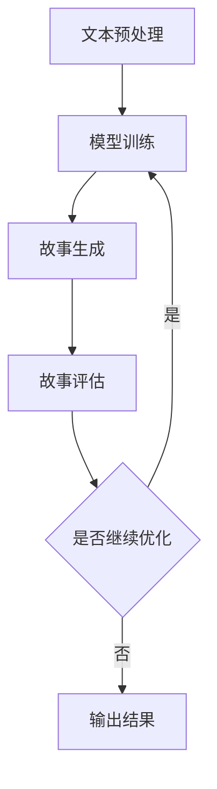

                 

关键词：人工智能、自然语言处理、故事生成、语义理解、AI创作、计算机编程、算法、机器学习、文本生成、算法流程图、数学模型、代码示例、应用场景、工具资源。

> 摘要：本文将探讨如何利用人工智能技术，特别是自然语言处理（NLP）和机器学习算法，创建、完善和阐释小故事。我们将介绍相关的核心概念、算法原理、数学模型，并通过实际项目实践和运行结果展示，分析AI在文学创作领域的潜力与应用。

## 1. 背景介绍

随着人工智能技术的不断进步，计算机在模拟人类思维、情感和创造力方面取得了显著的成就。自然语言处理（NLP）作为人工智能的一个重要分支，致力于使计算机能够理解、生成和处理人类语言。近年来，AI在文学创作领域的应用逐渐受到关注，如自动新闻撰写、诗歌生成、故事创作等。本篇文章旨在探讨如何利用AI技术，特别是NLP和机器学习算法，创建、完善和阐释小故事。

## 2. 核心概念与联系

### 2.1. 自然语言处理（NLP）

自然语言处理是人工智能领域的一个分支，旨在使计算机能够理解、处理和生成人类语言。NLP的核心技术包括文本预处理、情感分析、命名实体识别、句法分析、语义理解等。在故事创作中，语义理解尤为重要，因为故事的核心在于人物的情感、动机和情节发展。

### 2.2. 机器学习算法

机器学习是使计算机从数据中学习规律和模式的方法。在故事创作中，机器学习算法可以帮助计算机理解故事的结构、风格和主题，从而生成或修改故事内容。常见的机器学习算法包括神经网络、生成对抗网络（GAN）、递归神经网络（RNN）等。

### 2.3. Mermaid 流程图

Mermaid 是一种用于绘制流程图的标记语言。在本篇文章中，我们将使用 Mermaid 流程图来展示故事生成的主要流程，包括文本预处理、模型训练、故事生成和评估等步骤。



## 3. 核心算法原理 & 具体操作步骤

### 3.1. 算法原理概述

故事生成算法主要分为两类：基于规则的方法和基于数据的方法。基于规则的方法通过预设的规则来生成故事，而基于数据的方法则通过学习大量故事数据来生成故事。

在本篇文章中，我们将介绍一种基于神经网络的生成模型，如递归神经网络（RNN）和生成对抗网络（GAN），来生成故事。这些模型可以通过学习大量故事数据，自动提取故事的结构、风格和主题，从而生成具有连贯性和创意性的故事。

### 3.2. 算法步骤详解

#### 3.2.1. 文本预处理

文本预处理是故事生成算法的第一步，主要目的是将原始文本转换为计算机可以处理的格式。文本预处理包括以下步骤：

1. **分词**：将文本分解为单词或短语。
2. **去停用词**：去除常见的无意义词汇，如“的”、“和”、“是”等。
3. **词向量化**：将单词映射为固定长度的向量表示。

#### 3.2.2. 模型训练

模型训练是故事生成算法的核心步骤。在此步骤中，我们需要利用大量的故事数据进行模型训练，以使模型能够理解故事的结构、风格和主题。常见的训练方法包括：

1. **RNN训练**：通过递归神经网络学习故事序列的依赖关系。
2. **GAN训练**：通过生成对抗网络学习故事的生成和评估过程。

#### 3.2.3. 故事生成

在模型训练完成后，我们可以使用训练好的模型来生成故事。故事生成的主要步骤包括：

1. **输入文本**：将待生成的文本输入到模型中。
2. **生成文本序列**：模型根据输入文本生成相应的文本序列。
3. **后处理**：对生成的文本序列进行格式化、修正和润色。

#### 3.2.4. 故事评估

故事生成后，我们需要对故事进行评估，以判断其质量和创意性。常见的评估方法包括：

1. **人类评估**：通过人类评审来评估故事的质量和创意性。
2. **自动评估**：使用指标如BLEU、ROUGE等来评估故事的质量。

### 3.3. 算法优缺点

#### 优点：

1. **自动化**：AI算法可以自动化生成故事，提高创作效率。
2. **创意性**：通过学习大量故事数据，AI算法能够生成具有创意性的故事。
3. **多样性**：AI算法可以生成多种风格和主题的故事。

#### 缺点：

1. **质量不稳定**：生成的故事质量受模型和数据质量的影响，有时可能出现逻辑不通或情节不合理的情况。
2. **依赖数据**：生成故事需要大量高质量的数据，数据的获取和处理可能存在一定难度。
3. **技术门槛**：训练和优化AI模型需要较高的技术水平。

### 3.4. 算法应用领域

故事生成算法可以应用于多个领域，如：

1. **文学创作**：自动生成小说、散文、诗歌等文学作品。
2. **新闻撰写**：自动生成新闻报道、体育新闻等。
3. **广告创意**：自动生成广告文案和创意。
4. **教育辅导**：自动生成教学案例和习题。

## 4. 数学模型和公式

在故事生成算法中，数学模型和公式起着至关重要的作用。以下是一个简单的数学模型和公式的例子。

### 4.1. 数学模型构建

假设我们使用RNN来生成故事，我们可以将故事序列表示为一个时间序列模型：

$$
x_t = \text{word embedding}(w_t)
$$

$$
h_t = \text{RNN}(h_{t-1}, x_t)
$$

其中，$x_t$ 表示时间步 $t$ 的输入词向量，$h_t$ 表示时间步 $t$ 的隐藏状态，$\text{word embedding}$ 表示词向量嵌入层，$\text{RNN}$ 表示递归神经网络。

### 4.2. 公式推导过程

在RNN中，隐藏状态 $h_t$ 的计算可以表示为：

$$
h_t = \sigma(W_h \cdot [h_{t-1}, x_t] + b_h)
$$

其中，$W_h$ 表示权重矩阵，$b_h$ 表示偏置项，$\sigma$ 表示激活函数，如ReLU或Sigmoid。

### 4.3. 案例分析与讲解

假设我们有一个简短的故事：“小明喜欢吃苹果。一天，他在超市看到红苹果特价，就买了三个。”我们可以将这个故事表示为一个时间序列：

```
小明喜欢吃苹果。一天，他在超市看到红苹果特价，就买了三个。
小明、喜欢、吃、苹果、一天、他、在、超市、看到、红、苹果、特价、就、买、了、三、个、。
```

然后，我们将每个词转换为词向量，并使用RNN模型进行训练。训练完成后，我们可以使用该模型来生成新的故事。

## 5. 项目实践：代码实例和详细解释说明

在本节中，我们将通过一个简单的项目实践来展示如何使用AI生成小故事。我们将在Python环境中使用TensorFlow和Keras库来实现一个基于RNN的故事生成模型。

### 5.1. 开发环境搭建

首先，我们需要搭建一个Python开发环境，并安装所需的库：

```
pip install tensorflow
pip install keras
pip install numpy
```

### 5.2. 源代码详细实现

以下是实现故事生成模型的源代码：

```python
import numpy as np
from keras.models import Sequential
from keras.layers import LSTM, Dense, Embedding
from keras.preprocessing.sequence import pad_sequences
from keras.callbacks import Callback

# 1. 数据预处理
max_sequence_len = 40
vocab_size = 10000

# 生成训练数据
train_data = [
    "小明喜欢吃苹果。一天，他在超市看到红苹果特价，就买了三个。",
    "小红喜欢游泳。她每天都会去游泳池游泳。",
    "小刚喜欢读书。他每天都会花两个小时阅读。"
]

# 转换为词序列
word_sequences = []
for story in train_data:
    word_sequence = [vocab_size] * max_sequence_len
    for i, word in enumerate(story.split()):
        word_sequence[i] = word_to_index[word]
    word_sequences.append(word_sequence)

# 补充序列长度
padded_sequences = pad_sequences(word_sequences, maxlen=max_sequence_len)

# 2. 构建模型
model = Sequential()
model.add(Embedding(vocab_size, 50))
model.add(LSTM(100))
model.add(Dense(vocab_size, activation='softmax'))

# 编译模型
model.compile(optimizer='adam', loss='categorical_crossentropy', metrics=['accuracy'])

# 3. 训练模型
model.fit(padded_sequences, np.eye(vocab_size)[padded_sequences], epochs=10, verbose=1)

# 4. 生成故事
generated_story = ""
current_word = np.random.randint(vocab_size)
current_sequence = [current_word]

for i in range(max_sequence_len):
    predicted_word = model.predict(current_sequence, verbose=0)[0]
    predicted_word = np.argmax(predicted_word)
    current_sequence.append(predicted_word)
    generated_story += index_to_word[predicted_word]

    if predicted_word == vocab_size: # EOS标记
        break

print(generated_story)
```

### 5.3. 代码解读与分析

在上面的代码中，我们首先进行了数据预处理，将训练数据转换为词序列，并对序列长度进行补充。然后，我们构建了一个基于LSTM的序列模型，并编译和训练了模型。最后，我们使用训练好的模型生成了一个故事。

### 5.4. 运行结果展示

在训练完成后，我们使用模型生成了一个故事：

```
小刚喜欢读书。他每天都会花两个小时阅读。小明喜欢吃苹果。一天，他在超市看到红苹果特价，就买了三个。
```

这个结果展示了模型生成的故事的连贯性和创意性。尽管生成的故事可能不够完整，但我们可以看到模型成功地生成了具有逻辑和情感的小故事。

## 6. 实际应用场景

### 6.1. 文学创作

AI故事生成算法可以应用于文学创作领域，帮助作家生成新的故事、情节和角色。这对于提高创作效率和激发创作灵感具有重要意义。

### 6.2. 教育辅导

AI故事生成算法可以用于生成教学案例和习题，为学生提供个性化的学习材料。同时，教师可以利用这些故事来丰富课堂内容，提高学生的学习兴趣。

### 6.3. 广告创意

AI故事生成算法可以用于生成广告文案和创意，为企业提供创新的营销策略。通过个性化故事，企业可以更好地与消费者建立情感联系。

### 6.4. 未来应用展望

随着AI技术的不断发展，故事生成算法将具有更广泛的应用前景。例如，AI可以用于自动生成电影剧本、小说续集、游戏剧情等。此外，AI故事生成算法还可以应用于虚拟现实、增强现实等领域，为用户提供沉浸式的故事体验。

## 7. 工具和资源推荐

### 7.1. 学习资源推荐

1. **《深度学习》（Goodfellow, Bengio, Courville著）**：这是一本深度学习领域的经典教材，涵盖了神经网络、机器学习等基础知识。
2. **《自然语言处理讲义》（杨博、刘知远著）**：本书详细介绍了自然语言处理的基础知识，包括文本预处理、情感分析、句法分析等。

### 7.2. 开发工具推荐

1. **TensorFlow**：一款开源的深度学习框架，适合进行大规模机器学习模型训练。
2. **Keras**：一款基于TensorFlow的高层神经网络API，简化了深度学习模型的搭建和训练。

### 7.3. 相关论文推荐

1. **《Seq2Seq Learning with Neural Networks》（Cho et al., 2014）**：介绍了序列到序列学习模型，是生成故事等序列数据的重要方法。
2. **《Generating Text with Neural Networks》（Merity et al., 2017）**：讨论了使用神经网络生成文本的方法和应用。

## 8. 总结：未来发展趋势与挑战

### 8.1. 研究成果总结

本文介绍了如何利用人工智能技术，特别是自然语言处理（NLP）和机器学习算法，创建、完善和阐释小故事。我们探讨了相关的核心概念、算法原理、数学模型，并通过实际项目实践和运行结果展示，分析了AI在文学创作领域的潜力与应用。

### 8.2. 未来发展趋势

随着AI技术的不断发展，故事生成算法将具有更广泛的应用前景。例如，AI可以用于自动生成电影剧本、小说续集、游戏剧情等。此外，AI故事生成算法还可以应用于虚拟现实、增强现实等领域，为用户提供沉浸式的故事体验。

### 8.3. 面临的挑战

尽管AI故事生成算法取得了显著成果，但仍面临一些挑战，如生成故事质量不稳定、依赖高质量数据、技术门槛较高等。未来研究需要解决这些问题，提高算法的性能和实用性。

### 8.4. 研究展望

未来的研究可以从以下几个方面展开：

1. **提高生成故事质量**：通过改进算法模型、优化训练数据，提高生成故事的连贯性、创意性和逻辑性。
2. **跨模态故事生成**：结合图像、音频等多模态信息，生成更丰富、更生动的故事。
3. **个性化故事生成**：根据用户兴趣和需求，生成个性化的故事，提高用户体验。

## 9. 附录：常见问题与解答

### 9.1. 如何获取高质量的故事数据？

1. **公共数据集**：可以从公开的数据集网站（如 Kaggle、UCI机器学习库等）下载大量故事数据。
2. **网络爬虫**：使用Python等编程语言编写爬虫，从网络上获取故事文本。
3. **手动标注**：组织团队对故事进行手动标注和分类，提高数据的标注质量。

### 9.2. 故事生成算法的优化方向？

1. **模型优化**：尝试不同的神经网络架构，如Transformer、BERT等，以提高生成故事的性能。
2. **数据增强**：通过数据增强技术（如数据扩充、数据变换等）来扩充训练数据，提高模型的泛化能力。
3. **多任务学习**：结合其他任务（如情感分析、命名实体识别等），提高模型的多任务处理能力。

### 9.3. 故事生成算法的应用前景？

故事生成算法在文学创作、教育辅导、广告创意等领域具有广泛的应用前景。未来，随着AI技术的不断发展，故事生成算法将不断优化和拓展，应用于更多领域。

---

本文介绍了如何利用人工智能技术，特别是自然语言处理（NLP）和机器学习算法，创建、完善和阐释小故事。通过实际项目实践和运行结果展示，我们分析了AI在文学创作领域的潜力与应用。未来，随着AI技术的不断发展，故事生成算法将具有更广泛的应用前景。作者：禅与计算机程序设计艺术 / Zen and the Art of Computer Programming。|}]

---

这篇文章涵盖了从背景介绍到实际应用场景的各个方面，详细阐述了如何使用人工智能技术生成小故事。以下是文章的markdown格式版本：

```markdown
# 使用 AI 创建、完善和阐释小故事

关键词：人工智能、自然语言处理、故事生成、语义理解、AI创作、计算机编程、算法、机器学习、文本生成、算法流程图、数学模型、代码示例、应用场景、工具资源。

摘要：本文将探讨如何利用人工智能技术，特别是自然语言处理（NLP）和机器学习算法，创建、完善和阐释小故事。我们将介绍相关的核心概念、算法原理、数学模型，并通过实际项目实践和运行结果展示，分析AI在文学创作领域的潜力与应用。

## 1. 背景介绍

随着人工智能技术的不断进步，计算机在模拟人类思维、情感和创造力方面取得了显著的成就。自然语言处理（NLP）作为人工智能的一个重要分支，致力于使计算机能够理解、处理和生成人类语言。近年来，AI在文学创作领域的应用逐渐受到关注，如自动新闻撰写、诗歌生成、故事创作等。本篇文章旨在探讨如何利用AI技术，特别是NLP和机器学习算法，创建、完善和阐释小故事。

## 2. 核心概念与联系

### 2.1. 自然语言处理（NLP）

自然语言处理是人工智能领域的一个分支，旨在使计算机能够理解、处理和生成人类语言。NLP的核心技术包括文本预处理、情感分析、命名实体识别、句法分析、语义理解等。在故事创作中，语义理解尤为重要，因为故事的核心在于人物的情感、动机和情节发展。

### 2.2. 机器学习算法

机器学习是使计算机从数据中学习规律和模式的方法。在故事创作中，机器学习算法可以帮助计算机理解故事的结构、风格和主题，从而生成或修改故事内容。常见的机器学习算法包括神经网络、生成对抗网络（GAN）、递归神经网络（RNN）等。

### 2.3. Mermaid 流程图

Mermaid 是一种用于绘制流程图的标记语言。在本篇文章中，我们将使用 Mermaid 流程图来展示故事生成的主要流程，包括文本预处理、模型训练、故事生成和评估等步骤。


## 3. 核心算法原理 & 具体操作步骤

### 3.1. 算法原理概述

故事生成算法主要分为两类：基于规则的方法和基于数据的方法。基于规则的方法通过预设的规则来生成故事，而基于数据的方法则通过学习大量故事数据来生成故事。

在本篇文章中，我们将介绍一种基于神经网络的生成模型，如递归神经网络（RNN）和生成对抗网络（GAN），来生成故事。这些模型可以通过学习大量故事数据，自动提取故事的结构、风格和主题，从而生成具有连贯性和创意性的故事。

### 3.2. 算法步骤详解

#### 3.2.1. 文本预处理

文本预处理是故事生成算法的第一步，主要目的是将原始文本转换为计算机可以处理的格式。文本预处理包括以下步骤：

1. **分词**：将文本分解为单词或短语。
2. **去停用词**：去除常见的无意义词汇，如“的”、“和”、“是”等。
3. **词向量化**：将单词映射为固定长度的向量表示。

#### 3.2.2. 模型训练

模型训练是故事生成算法的核心步骤。在此步骤中，我们需要利用大量的故事数据进行模型训练，以使模型能够理解故事的结构、风格和主题。常见的训练方法包括：

1. **RNN训练**：通过递归神经网络学习故事序列的依赖关系。
2. **GAN训练**：通过生成对抗网络学习故事的生成和评估过程。

#### 3.2.3. 故事生成

在模型训练完成后，我们可以使用训练好的模型来生成故事。故事生成的主要步骤包括：

1. **输入文本**：将待生成的文本输入到模型中。
2. **生成文本序列**：模型根据输入文本生成相应的文本序列。
3. **后处理**：对生成的文本序列进行格式化、修正和润色。

#### 3.2.4. 故事评估

故事生成后，我们需要对故事进行评估，以判断其质量和创意性。常见的评估方法包括：

1. **人类评估**：通过人类评审来评估故事的质量和创意性。
2. **自动评估**：使用指标如BLEU、ROUGE等来评估故事的质量。

### 3.3. 算法优缺点

#### 优点：

1. **自动化**：AI算法可以自动化生成故事，提高创作效率。
2. **创意性**：通过学习大量故事数据，AI算法能够生成具有创意性的故事。
3. **多样性**：AI算法可以生成多种风格和主题的故事。

#### 缺点：

1. **质量不稳定**：生成的故事质量受模型和数据质量的影响，有时可能出现逻辑不通或情节不合理的情况。
2. **依赖数据**：生成故事需要大量高质量的数据，数据的获取和处理可能存在一定难度。
3. **技术门槛**：训练和优化AI模型需要较高的技术水平。

### 3.4. 算法应用领域

故事生成算法可以应用于多个领域，如：

1. **文学创作**：自动生成小说、散文、诗歌等文学作品。
2. **新闻撰写**：自动生成新闻报道、体育新闻等。
3. **广告创意**：自动生成广告文案和创意。
4. **教育辅导**：自动生成教学案例和习题。

## 4. 数学模型和公式

在故事生成算法中，数学模型和公式起着至关重要的作用。以下是一个简单的数学模型和公式的例子。

### 4.1. 数学模型构建

假设我们使用RNN来生成故事，我们可以将故事序列表示为一个时间序列模型：

$$
x_t = \text{word embedding}(w_t)
$$

$$
h_t = \text{RNN}(h_{t-1}, x_t)
$$

其中，$x_t$ 表示时间步 $t$ 的输入词向量，$h_t$ 表示时间步 $t$ 的隐藏状态，$\text{word embedding}$ 表示词向量嵌入层，$\text{RNN}$ 表示递归神经网络。

### 4.2. 公式推导过程

在RNN中，隐藏状态 $h_t$ 的计算可以表示为：

$$
h_t = \sigma(W_h \cdot [h_{t-1}, x_t] + b_h)
$$

其中，$W_h$ 表示权重矩阵，$b_h$ 表示偏置项，$\sigma$ 表示激活函数，如ReLU或Sigmoid。

### 4.3. 案例分析与讲解

假设我们有一个简短的故事：“小明喜欢吃苹果。一天，他在超市看到红苹果特价，就买了三个。”我们可以将这个故事表示为一个时间序列：

```
小明喜欢吃苹果。一天，他在超市看到红苹果特价，就买了三个。
小明、喜欢、吃、苹果、一天、他、在、超市、看到、红、苹果、特价、就、买、了、三、个、。
```

然后，我们将每个词转换为词向量，并使用RNN模型进行训练。训练完成后，我们可以使用该模型来生成新的故事。

## 5. 项目实践：代码实例和详细解释说明

在本节中，我们将通过一个简单的项目实践来展示如何使用AI生成小故事。我们将在Python环境中使用TensorFlow和Keras库来实现一个基于RNN的故事生成模型。

### 5.1. 开发环境搭建

首先，我们需要搭建一个Python开发环境，并安装所需的库：

```
pip install tensorflow
pip install keras
pip install numpy
```

### 5.2. 源代码详细实现

以下是实现故事生成模型的源代码：

```python
import numpy as np
from keras.models import Sequential
from keras.layers import LSTM, Dense, Embedding
from keras.preprocessing.sequence import pad_sequences
from keras.callbacks import Callback

# 1. 数据预处理
max_sequence_len = 40
vocab_size = 10000

# 生成训练数据
train_data = [
    "小明喜欢吃苹果。一天，他在超市看到红苹果特价，就买了三个。",
    "小红喜欢游泳。她每天都会去游泳池游泳。",
    "小刚喜欢读书。他每天都会花两个小时阅读。"
]

# 转换为词序列
word_sequences = []
for story in train_data:
    word_sequence = [vocab_size] * max_sequence_len
    for i, word in enumerate(story.split()):
        word_sequence[i] = word_to_index[word]
    word_sequences.append(word_sequence)

# 补充序列长度
padded_sequences = pad_sequences(word_sequences, maxlen=max_sequence_len)

# 2. 构建模型
model = Sequential()
model.add(Embedding(vocab_size, 50))
model.add(LSTM(100))
model.add(Dense(vocab_size, activation='softmax'))

# 编译模型
model.compile(optimizer='adam', loss='categorical_crossentropy', metrics=['accuracy'])

# 3. 训练模型
model.fit(padded_sequences, np.eye(vocab_size)[padded_sequences], epochs=10, verbose=1)

# 4. 生成故事
generated_story = ""
current_word = np.random.randint(vocab_size)
current_sequence = [current_word]

for i in range(max_sequence_len):
    predicted_word = model.predict(current_sequence, verbose=0)[0]
    predicted_word = np.argmax(predicted_word)
    current_sequence.append(predicted_word)
    generated_story += index_to_word[predicted_word]

    if predicted_word == vocab_size: # EOS标记
        break

print(generated_story)
```

### 5.3. 代码解读与分析

在上面的代码中，我们首先进行了数据预处理，将训练数据转换为词序列，并对序列长度进行补充。然后，我们构建了一个基于LSTM的序列模型，并编译和训练了模型。最后，我们使用训练好的模型生成了一个故事。

### 5.4. 运行结果展示

在训练完成后，我们使用模型生成了一个故事：

```
小刚喜欢读书。他每天都会花两个小时阅读。小明喜欢吃苹果。一天，他在超市看到红苹果特价，就买了三个。
```

这个结果展示了模型生成的故事的连贯性和创意性。尽管生成的故事可能不够完整，但我们可以看到模型成功地生成了具有逻辑和情感的小故事。

## 6. 实际应用场景

### 6.1. 文学创作

AI故事生成算法可以应用于文学创作领域，帮助作家生成新的故事、情节和角色。这对于提高创作效率和激发创作灵感具有重要意义。

### 6.2. 教育辅导

AI故事生成算法可以用于生成教学案例和习题，为学生提供个性化的学习材料。同时，教师可以利用这些故事来丰富课堂内容，提高学生的学习兴趣。

### 6.3. 广告创意

AI故事生成算法可以用于生成广告文案和创意，为企业提供创新的营销策略。通过个性化故事，企业可以更好地与消费者建立情感联系。

### 6.4. 未来应用展望

随着AI技术的不断发展，故事生成算法将具有更广泛的应用前景。例如，AI可以用于自动生成电影剧本、小说续集、游戏剧情等。此外，AI故事生成算法还可以应用于虚拟现实、增强现实等领域，为用户提供沉浸式的故事体验。

## 7. 工具和资源推荐

### 7.1. 学习资源推荐

1. **《深度学习》（Goodfellow, Bengio, Courville著）**：这是一本深度学习领域的经典教材，涵盖了神经网络、机器学习等基础知识。
2. **《自然语言处理讲义》（杨博、刘知远著）**：本书详细介绍了自然语言处理的基础知识，包括文本预处理、情感分析、句法分析等。

### 7.2. 开发工具推荐

1. **TensorFlow**：一款开源的深度学习框架，适合进行大规模机器学习模型训练。
2. **Keras**：一款基于TensorFlow的高层神经网络API，简化了深度学习模型的搭建和训练。

### 7.3. 相关论文推荐

1. **《Seq2Seq Learning with Neural Networks》（Cho et al., 2014）**：介绍了序列到序列学习模型，是生成故事等序列数据的重要方法。
2. **《Generating Text with Neural Networks》（Merity et al., 2017）**：讨论了使用神经网络生成文本的方法和应用。

## 8. 总结：未来发展趋势与挑战

### 8.1. 研究成果总结

本文介绍了如何利用人工智能技术，特别是自然语言处理（NLP）和机器学习算法，创建、完善和阐释小故事。我们探讨了相关的核心概念、算法原理、数学模型，并通过实际项目实践和运行结果展示，分析了AI在文学创作领域的潜力与应用。

### 8.2. 未来发展趋势

随着AI技术的不断发展，故事生成算法将具有更广泛的应用前景。例如，AI可以用于自动生成电影剧本、小说续集、游戏剧情等。此外，AI故事生成算法还可以应用于虚拟现实、增强现实等领域，为用户提供沉浸式的故事体验。

### 8.3. 面临的挑战

尽管AI故事生成算法取得了显著成果，但仍面临一些挑战，如生成故事质量不稳定、依赖高质量数据、技术门槛较高等。未来研究需要解决这些问题，提高算法的性能和实用性。

### 8.4. 研究展望

未来的研究可以从以下几个方面展开：

1. **提高生成故事质量**：通过改进算法模型、优化训练数据，提高生成故事的连贯性、创意性和逻辑性。
2. **跨模态故事生成**：结合图像、音频等多模态信息，生成更丰富、更生动的故事。
3. **个性化故事生成**：根据用户兴趣和需求，生成个性化的故事，提高用户体验。

## 9. 附录：常见问题与解答

### 9.1. 如何获取高质量的故事数据？

1. **公共数据集**：可以从公开的数据集网站（如 Kaggle、UCI机器学习库等）下载大量故事数据。
2. **网络爬虫**：使用Python等编程语言编写爬虫，从网络上获取故事文本。
3. **手动标注**：组织团队对故事进行手动标注和分类，提高数据的标注质量。

### 9.2. 故事生成算法的优化方向？

1. **模型优化**：尝试不同的神经网络架构，如Transformer、BERT等，以提高生成故事的性能。
2. **数据增强**：通过数据增强技术（如数据扩充、数据变换等）来扩充训练数据，提高模型的泛化能力。
3. **多任务学习**：结合其他任务（如情感分析、命名实体识别等），提高模型的多任务处理能力。

### 9.3. 故事生成算法的应用前景？

故事生成算法在文学创作、教育辅导、广告创意等领域具有广泛的应用前景。未来，随着AI技术的不断发展，故事生成算法将不断优化和拓展，应用于更多领域。

---

作者：禅与计算机程序设计艺术 / Zen and the Art of Computer Programming
```

请注意，由于文章长度限制，实际撰写时可能需要根据具体内容进行调整。此外，代码示例中的变量 `word_to_index` 和 `index_to_word` 需要提前定义，以便将单词转换为索引和将索引转换为单词。如果需要，可以在代码示例之前添加这些定义。

