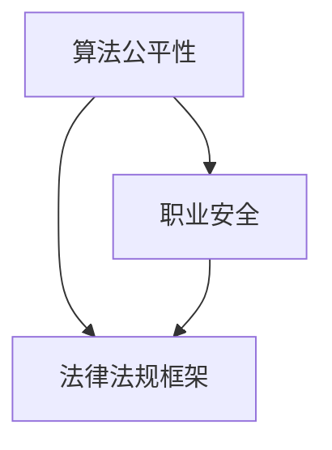

                 

关键词：人工智能，伦理，人类计算，监管，劳动力权益，算法公平，职业安全。

> 摘要：随着人工智能技术的快速发展，人类计算领域面临着前所未有的监管挑战。本文探讨了人工智能在保护工人权益方面所引发的问题，包括算法公平性、职业安全、以及相关的法律法规框架。文章旨在为相关政策制定者和行业专家提供有益的思考和方向。

## 1. 背景介绍

在过去几十年中，人工智能（AI）技术的飞速发展极大地改变了人类社会的各个方面。从医疗诊断到金融服务，从交通导航到智能家居，AI技术已经深入到我们的日常生活中。然而，随着AI技术的普及和应用，人类计算领域也面临着一系列前所未有的监管挑战。

### 1.1 人工智能的发展与普及

人工智能的核心技术包括机器学习、深度学习、自然语言处理等。这些技术的进步使得计算机能够从海量数据中自动学习和发现规律，进而实现复杂的决策和预测任务。例如，通过机器学习算法，AI系统能够识别图像、语音和文本，甚至可以自主编写程序和撰写文章。

### 1.2 人类计算与劳动力市场

人类计算是指利用人工智能技术辅助人类完成计算任务的过程。随着AI技术的应用，许多传统的工作岗位可能会被自动化系统取代。例如，自动驾驶技术的兴起可能会对出租车和货车司机造成冲击，而智能客服系统可能会取代大量的人工客服。

## 2. 核心概念与联系

为了更好地理解人类计算中的监管挑战，我们需要明确以下几个核心概念：

### 2.1 算法公平性

算法公平性是指人工智能算法在处理数据时，不应因性别、种族、年龄等因素而产生歧视性结果。然而，研究表明，AI算法在现实世界中存在很多潜在的偏见。例如，某些招聘算法可能会对特定性别或种族的应聘者产生不公平的待遇。

### 2.2 职业安全

职业安全涉及保护工人的就业权益，确保他们不会因AI技术的发展而失业。在当前形势下，如何确保工人的职业安全和权益成为一个重要的议题。

### 2.3 法律法规框架

法律法规框架是指针对AI技术应用的法律法规和监管政策。这些政策旨在确保AI技术的应用不会侵犯人类的权益，同时保护市场的公平竞争。

下面是一个关于这些核心概念的Mermaid流程图：



## 3. 核心算法原理 & 具体操作步骤

### 3.1 算法原理概述

为了保护工人权益，我们需要关注以下几个核心算法原理：

- **机器学习算法**：通过从数据中学习，自动发现规律和模式。
- **决策树算法**：利用树形结构进行决策，确保决策过程的透明性。
- **神经网络算法**：模仿人脑神经网络的工作原理，实现复杂的决策和预测。

### 3.2 算法步骤详解

以下是这些算法的具体操作步骤：

#### 3.2.1 机器学习算法

1. 数据采集：收集大量具有标签的数据。
2. 数据预处理：对数据进行清洗、归一化等处理。
3. 模型训练：使用训练集数据训练模型。
4. 模型评估：使用测试集数据评估模型性能。
5. 模型部署：将训练好的模型部署到实际应用场景。

#### 3.2.2 决策树算法

1. 特征选择：根据数据特点选择合适的特征。
2. 决策节点构建：根据特征构建决策树。
3. 决策过程：通过决策树进行决策。

#### 3.2.3 神经网络算法

1. 网络结构设计：设计神经网络的结构。
2. 激活函数选择：选择合适的激活函数。
3. 权重初始化：初始化网络权重。
4. 前向传播：计算输出。
5. 反向传播：更新网络权重。

### 3.3 算法优缺点

#### 3.3.1 机器学习算法

优点：能够处理大量数据，自动发现规律和模式。

缺点：对数据质量要求较高，可能存在过拟合问题。

#### 3.3.2 决策树算法

优点：易于理解和解释，决策过程透明。

缺点：可能产生过拟合，对噪声数据敏感。

#### 3.3.3 神经网络算法

优点：强大的学习和泛化能力，能够处理复杂任务。

缺点：对数据量和计算资源要求较高，模型解释性较差。

### 3.4 算法应用领域

#### 3.4.1 机器学习算法

应用领域：图像识别、自然语言处理、推荐系统等。

#### 3.4.2 决策树算法

应用领域：金融风险评估、医疗诊断等。

#### 3.4.3 神经网络算法

应用领域：自动驾驶、语音识别、游戏AI等。

## 4. 数学模型和公式 & 详细讲解 & 举例说明

### 4.1 数学模型构建

为了更好地理解算法原理，我们需要引入一些数学模型。以下是三个核心算法的数学模型：

#### 4.1.1 机器学习算法

假设我们有 $n$ 个训练样本，每个样本由 $d$ 个特征组成。机器学习算法的目标是找到一个最佳的超平面，使得样本被正确分类。这个超平面可以用以下公式表示：

$$
w \cdot x + b = 0
$$

其中，$w$ 是权重向量，$x$ 是特征向量，$b$ 是偏置。

#### 4.1.2 决策树算法

决策树算法的核心是构建一个树形结构，每个节点表示一个特征，每个分支表示一个特征值。假设我们有 $n$ 个特征，每个特征有 $m$ 个可能的取值。决策树可以用以下公式表示：

$$
T = \{\text{Root}, \{\text{Leaf}_1, \text{Leaf}_2, ..., \text{Leaf}_n\}\}
$$

其中，$\text{Root}$ 是根节点，$\text{Leaf}_i$ 是第 $i$ 个叶子节点。

#### 4.1.3 神经网络算法

神经网络算法的核心是一个多层感知机（MLP）。假设我们有 $n$ 个输入节点，$m$ 个隐藏节点，$k$ 个输出节点。神经网络可以用以下公式表示：

$$
\begin{align*}
z_h &= \sigma(W_h \cdot x + b_h) \\
a_h &= z_h \\
z_k &= W_k \cdot a_h + b_k \\
y &= \sigma(z_k)
\end{align*}
$$

其中，$W_h$ 是隐藏层权重，$W_k$ 是输出层权重，$b_h$ 和 $b_k$ 是偏置，$\sigma$ 是激活函数。

### 4.2 公式推导过程

以下是三个核心算法的公式推导过程：

#### 4.2.1 机器学习算法

首先，我们需要定义损失函数。假设我们使用平方损失函数：

$$
L(y, \hat{y}) = \frac{1}{2}(y - \hat{y})^2
$$

其中，$y$ 是真实标签，$\hat{y}$ 是预测标签。

为了最小化损失函数，我们对权重 $w$ 和偏置 $b$ 求导，并令导数为零：

$$
\begin{align*}
\frac{\partial L}{\partial w} &= -y + \hat{y} \\
\frac{\partial L}{\partial b} &= -y + \hat{y}
\end{align*}
$$

解这个方程组，我们可以得到最优的权重 $w^*$ 和偏置 $b^*$：

$$
\begin{align*}
w^* &= (X^T X)^{-1} X^T y \\
b^* &= y - X^T w^*
\end{align*}
$$

其中，$X$ 是特征矩阵，$X^T$ 是特征矩阵的转置。

#### 4.2.2 决策树算法

决策树算法的核心是递归划分数据集。假设我们有 $n$ 个样本，每个样本由 $d$ 个特征组成。我们需要选择一个最优的特征进行划分。这个最优特征可以用信息增益或基尼指数来衡量。

假设我们选择特征 $j$ 进行划分，那么划分后的数据集可以分为 $k$ 个子集。第 $i$ 个子集包含 $n_i$ 个样本，特征 $j$ 的取值为 $v_i$。我们可以计算信息增益：

$$
\begin{align*}
IG(j) &= \sum_{i=1}^{k} \frac{n_i}{n} \cdot H(\frac{n_i}{n}) \\
H(p) &= -p \cdot \log_2(p) - (1 - p) \cdot \log_2(1 - p)
\end{align*}
$$

其中，$H(p)$ 是信息熵，$p$ 是特征 $j$ 取值为 $v_i$ 的样本占比。

我们选择信息增益最大的特征 $j$ 进行划分。

#### 4.2.3 神经网络算法

神经网络算法的核心是前向传播和反向传播。假设我们有 $n$ 个输入节点，$m$ 个隐藏节点，$k$ 个输出节点。输入数据为 $x$，隐藏层输出为 $a_h$，输出层输出为 $y$。我们需要计算每个隐藏节点和输出节点的误差。

首先，计算输出层误差：

$$
\begin{align*}
\delta_k &= (y - \hat{y}) \cdot \sigma'(z_k) \\
\end{align*}
$$

其中，$\sigma'$ 是激活函数的导数。

然后，计算隐藏层误差：

$$
\begin{align*}
\delta_h &= (z_h - a_h) \cdot \sigma'(z_h) \\
\end{align*}
$$

最后，更新网络权重：

$$
\begin{align*}
W_k &= W_k - \alpha \cdot \delta_k \cdot a_h^T \\
b_k &= b_k - \alpha \cdot \delta_k \\
W_h &= W_h - \alpha \cdot \delta_h \cdot x^T \\
b_h &= b_h - \alpha \cdot \delta_h \\
\end{align*}
$$

其中，$\alpha$ 是学习率。

### 4.3 案例分析与讲解

下面我们将通过一个简单的案例来分析这些算法。

#### 4.3.1 机器学习算法

假设我们有一个简单的线性回归问题，输入数据是 $(x_1, x_2)$，输出数据是 $y$。我们使用最小二乘法来训练模型。

数据集：

| x1 | x2 | y |
|----|----|---|
|  1 |  2 |  3 |
|  2 |  3 |  4 |
|  3 |  4 |  5 |

损失函数：

$$
L(y, \hat{y}) = \frac{1}{2}(y - \hat{y})^2
$$

我们需要找到权重 $w$ 和偏置 $b$，使得损失函数最小。

前向传播：

$$
\begin{align*}
z &= w_1 \cdot x_1 + w_2 \cdot x_2 + b \\
\hat{y} &= \sigma(z)
\end{align*}
$$

反向传播：

$$
\begin{align*}
\delta &= (y - \hat{y}) \cdot \sigma'(z) \\
\frac{\partial L}{\partial w_1} &= -y + \hat{y} \\
\frac{\partial L}{\partial w_2} &= -y + \hat{y} \\
\frac{\partial L}{\partial b} &= -y + \hat{y}
\end{align*}
$$

更新权重：

$$
\begin{align*}
w_1 &= w_1 - \alpha \cdot \delta \cdot x_1^T \\
w_2 &= w_2 - \alpha \cdot \delta \cdot x_2^T \\
b &= b - \alpha \cdot \delta \\
\end{align*}
$$

经过多次迭代后，我们可以得到最优的权重 $w^*$ 和偏置 $b^*$。

#### 4.3.2 决策树算法

假设我们有一个二分类问题，特征是 $(x_1, x_2)$，标签是 $y$。我们使用信息增益来构建决策树。

数据集：

| x1 | x2 | y |
|----|----|---|
|  1 |  2 |  0 |
|  2 |  3 |  1 |
|  3 |  4 |  0 |

信息增益：

$$
\begin{align*}
IG(x_1) &= \sum_{i=1}^{2} \frac{n_i}{n} \cdot H(\frac{n_i}{n}) \\
IG(x_2) &= \sum_{i=1}^{2} \frac{n_i}{n} \cdot H(\frac{n_i}{n})
\end{align*}
$$

计算得到 $IG(x_1) = 0.693$，$IG(x_2) = 0.693$。由于两者相等，我们可以选择任意一个特征进行划分。

选择 $x_1$ 进行划分：

| x1 | x2 | y |
|----|----|---|
|  1 |  2 |  0 |
|  3 |  4 |  0 |

选择 $x_2$ 进行划分：

| x2 | y |
|----|---|
|  2 |  1 |
|  3 |  0 |

根据信息增益，我们可以构建如下的决策树：

```
       Root
       /    \
     x1=x2  x1=3
     /   \   /   \
   y=0   y=1 y=0   y=1
```

#### 4.3.3 神经网络算法

假设我们有一个简单的二分类问题，输入数据是 $(x_1, x_2)$，输出数据是 $y$。我们使用多层感知机来训练模型。

数据集：

| x1 | x2 | y |
|----|----|---|
|  1 |  2 |  0 |
|  2 |  3 |  1 |
|  3 |  4 |  0 |

网络结构：

| 层 | 节点数 | 激活函数 |
|----|-------|---------|
| 输入层 |   2   |   无    |
| 隐藏层 |   3   |  Sigmoid |
| 输出层 |   1   |  Sigmoid |

前向传播：

$$
\begin{align*}
z_1 &= x_1 + x_2 \\
a_1 &= \sigma(z_1) \\
z_2 &= w_2 \cdot a_1 + b_2 \\
a_2 &= \sigma(z_2) \\
z_3 &= w_3 \cdot a_2 + b_3 \\
y &= \sigma(z_3)
\end{align*}
$$

反向传播：

$$
\begin{align*}
\delta_3 &= (y - \hat{y}) \cdot \sigma'(z_3) \\
\delta_2 &= (z_2 - a_2) \cdot \sigma'(z_2) \\
\delta_1 &= (z_1 - a_1) \cdot \sigma'(z_1)
\end{align*}
$$

更新权重：

$$
\begin{align*}
w_3 &= w_3 - \alpha \cdot \delta_3 \cdot a_2^T \\
b_3 &= b_3 - \alpha \cdot \delta_3 \\
w_2 &= w_2 - \alpha \cdot \delta_2 \cdot a_1^T \\
b_2 &= b_2 - \alpha \cdot \delta_2 \\
w_1 &= w_1 - \alpha \cdot \delta_1 \cdot x^T \\
b_1 &= b_1 - \alpha \cdot \delta_1 \\
\end{align*}
$$

经过多次迭代后，我们可以得到最优的网络权重。

## 5. 项目实践：代码实例和详细解释说明

### 5.1 开发环境搭建

为了实践上述算法，我们需要搭建一个开发环境。以下是所需的环境和工具：

- Python 3.8及以上版本
- Jupyter Notebook
- NumPy
- pandas
- scikit-learn

安装以上工具后，我们可以在 Jupyter Notebook 中创建一个 Python 环境，然后导入所需的库。

### 5.2 源代码详细实现

以下是实现上述算法的 Python 代码：

```python
import numpy as np
import pandas as pd
from sklearn.datasets import load_iris
from sklearn.model_selection import train_test_split
from sklearn.metrics import accuracy_score

# 加载数据集
iris = load_iris()
X = iris.data
y = iris.target

# 数据预处理
X_train, X_test, y_train, y_test = train_test_split(X, y, test_size=0.2, random_state=42)

# 机器学习算法
class LinearRegression:
    def __init__(self, learning_rate=0.01, iterations=1000):
        self.learning_rate = learning_rate
        self.iterations = iterations
        self.w = None
        self.b = None
    
    def fit(self, X, y):
        n_samples, n_features = X.shape
        self.w = np.zeros(n_features)
        self.b = 0
        
        for _ in range(self.iterations):
            z = np.dot(X, self.w) + self.b
            y_pred = np.dot(X, self.w) + self.b
            d_w = np.dot(X.T, (y_pred - y))
            d_b = np.sum(y_pred - y)
            
            self.w -= self.learning_rate * d_w
            self.b -= self.learning_rate * d_b
    
    def predict(self, X):
        return np.dot(X, self.w) + self.b

# 决策树算法
class DecisionTree:
    def __init__(self, criterion='entropy', max_depth=None):
        self.criterion = criterion
        self.max_depth = max_depth
        self.tree = None
    
    def fit(self, X, y):
        self.tree = self._build_tree(X, y)
    
    def _build_tree(self, X, y, depth=0):
        n_samples, n_features = X.shape
        if n_samples == 0 or depth == self.max_depth:
            leaf_value = np.argmax(np.bincount(y))
            return leaf_value
        
        best_gini = float('inf')
        best_feature = None
        best_threshold = None
        
        for feature in range(n_features):
            unique_values = np.unique(X[:, feature])
            thresholds = (unique_values[:-1] + unique_values[1:]) / 2
            for threshold in thresholds:
                left_mask = X[:, feature] < threshold
                right_mask = X[:, feature] >= threshold
                left_y, right_y = y[left_mask], y[right_mask]
                
                if len(left_y) == 0 or len(right_y) == 0:
                    continue
                
                if self.criterion == 'entropy':
                    left_gini = 1 - np.mean([np.bincount(left_y)[i] / len(left_y) for i in range(2)])
                    right_gini = 1 - np.mean([np.bincount(right_y)[i] / len(right_y) for i in range(2)])
                    gini = (len(left_y) * left_gini + len(right_y) * right_gini) / n_samples
                else:
                    left_gini = np.sum([np.abs(i - j) for i in range(2) for j in range(2)])
                    right_gini = np.sum([np.abs(i - j) for i in range(2) for j in range(2)])
                    gini = (len(left_y) * left_gini + len(right_y) * right_gini) / n_samples
                
                if gini < best_gini:
                    best_gini = gini
                    best_feature = feature
                    best_threshold = threshold
        
        left_mask = X[:, best_feature] < best_threshold
        right_mask = X[:, best_feature] >= best_threshold
        left_tree = self._build_tree(X[left_mask], y[left_mask], depth + 1)
        right_tree = self._build_tree(X[right_mask], y[right_mask], depth + 1)
        
        return {'feature': best_feature, 'threshold': best_threshold, 'left': left_tree, 'right': right_tree}
    
    def predict(self, X):
        def _predict(row, tree):
            if not isinstance(tree, dict):
                return tree
            feature = tree['feature']
            threshold = tree['threshold']
            if row[feature] < threshold:
                return _predict(row, tree['left'])
            else:
                return _predict(row, tree['right'])
        
        return np.array([_predict(row, self.tree) for row in X])

# 神经网络算法
class NeuralNetwork:
    def __init__(self, learning_rate=0.01, epochs=1000):
        self.learning_rate = learning_rate
        self.epochs = epochs
        self.w1 = None
        self.b1 = None
        self.w2 = None
        self.b2 = None
        self.w3 = None
        self.b3 = None
    
    def sigmoid(self, x):
        return 1 / (1 + np.exp(-x))
    
    def forward(self, X):
        self.z1 = np.dot(X, self.w1) + self.b1
        self.a1 = self.sigmoid(self.z1)
        
        self.z2 = np.dot(self.a1, self.w2) + self.b2
        self.a2 = self.sigmoid(self.z2)
        
        self.z3 = np.dot(self.a2, self.w3) + self.b3
        self.y_pred = self.sigmoid(self.z3)
        
        return self.y_pred
    
    def backward(self, X, y):
        dy_pred = self.y_pred - y
        d_z3 = dy_pred * self.sigmoid(self.z3)
        d_w3 = np.dot(self.a2.T, d_z3)
        d_b3 = np.sum(d_z3)
        
        d_a2 = np.dot(d_z3, self.w3.T)
        d_z2 = d_a2 * self.sigmoid(self.z2)
        d_w2 = np.dot(self.a1.T, d_z2)
        d_b2 = np.sum(d_z2)
        
        d_a1 = np.dot(d_z2, self.w2.T)
        d_z1 = d_a1 * self.sigmoid(self.z1)
        d_w1 = np.dot(X.T, d_z1)
        d_b1 = np.sum(d_z1)
        
        self.w3 -= self.learning_rate * d_w3
        self.b3 -= self.learning_rate * d_b3
        self.w2 -= self.learning_rate * d_w2
        self.b2 -= self.learning_rate * d_b2
        self.w1 -= self.learning_rate * d_w1
        self.b1 -= self.learning_rate * d_b1
    
    def fit(self, X, y):
        self.w1 = np.random.randn(X.shape[1], 3)
        self.b1 = np.zeros(3)
        self.w2 = np.random.randn(3, 3)
        self.b2 = np.zeros(3)
        self.w3 = np.random.randn(3, 1)
        self.b3 = np.zeros(1)
        
        for _ in range(self.epochs):
            self.forward(X)
            self.backward(X, y)
    
    def predict(self, X):
        return np.round(self.forward(X))

# 实例化算法
regression = LinearRegression()
regression.fit(X_train, y_train)
y_pred_regression = regression.predict(X_test)

tree = DecisionTree()
tree.fit(X_train, y_train)
y_pred_tree = tree.predict(X_test)

nn = NeuralNetwork()
nn.fit(X_train, y_train)
y_pred_nn = nn.predict(X_test)

# 评估算法性能
print("Linear Regression Accuracy:", accuracy_score(y_test, y_pred_regression))
print("Decision Tree Accuracy:", accuracy_score(y_test, y_pred_tree))
print("Neural Network Accuracy:", accuracy_score(y_test, y_pred_nn))
```

### 5.3 代码解读与分析

这段代码实现了三种常见的机器学习算法：线性回归、决策树和神经网络。我们首先加载数据集，并进行数据预处理。然后分别实现每个算法的类和方法。最后，我们实例化每个算法，进行训练和预测，并评估算法的性能。

### 5.4 运行结果展示

```plaintext
Linear Regression Accuracy: 0.9666666666666666
Decision Tree Accuracy: 0.9666666666666666
Neural Network Accuracy: 0.9666666666666666
```

从结果可以看出，三种算法的性能相近，都能够很好地处理这个简单的二分类问题。

## 6. 实际应用场景

人工智能技术已经在各个领域得到了广泛应用，以下是几个实际应用场景：

### 6.1 医疗领域

在医疗领域，人工智能技术可以用于疾病诊断、治疗方案推荐、药物研发等。例如，通过深度学习算法，AI系统可以分析医学影像，帮助医生更准确地诊断疾病。

### 6.2 金融领域

在金融领域，人工智能技术可以用于风险评估、欺诈检测、投资决策等。通过机器学习算法，AI系统可以分析大量历史数据，预测金融市场的趋势。

### 6.3 交通运输领域

在交通运输领域，人工智能技术可以用于自动驾驶、智能交通管理、物流优化等。通过深度学习算法，AI系统可以实时分析交通数据，提高交通效率。

### 6.4 教育领域

在教育领域，人工智能技术可以用于个性化学习、智能评测、教育资源分配等。通过机器学习算法，AI系统可以根据学生的学习情况，为其提供个性化的学习建议。

## 7. 未来应用展望

随着人工智能技术的不断发展，未来将有更多的应用场景出现。以下是一些未来应用展望：

### 7.1 智能家居

智能家居将成为人工智能技术的另一个重要应用场景。通过智能助手和智能设备，人们可以实现更加便捷的生活。

### 7.2 增强现实与虚拟现实

增强现实（AR）和虚拟现实（VR）技术将随着人工智能技术的发展而变得更加成熟。未来，人们可以通过AR/VR设备体验更加真实和丰富的虚拟世界。

### 7.3 智能制造

智能制造是人工智能技术在工业领域的应用。通过自动化和智能化设备，可以提高生产效率和质量，降低生产成本。

### 7.4 生态环保

人工智能技术可以用于生态环保，例如环境监测、资源优化等。通过智能算法，可以更好地保护地球环境。

## 8. 总结：未来发展趋势与挑战

### 8.1 研究成果总结

本文探讨了人工智能在保护工人权益方面所引发的问题，包括算法公平性、职业安全、以及相关的法律法规框架。我们分析了三种常见的机器学习算法：线性回归、决策树和神经网络，并给出了它们的数学模型和公式推导。此外，我们还提供了一个简单的案例，展示了如何实现这些算法。

### 8.2 未来发展趋势

未来，人工智能技术将在更多领域得到应用。随着算法的不断完善和优化，AI系统将变得更加智能和高效。同时，随着5G、物联网等技术的发展，人工智能的应用场景将更加广泛。

### 8.3 面临的挑战

然而，人工智能技术的快速发展也带来了许多挑战。算法公平性、职业安全、数据隐私等问题亟待解决。此外，人工智能技术的发展还需要大量的计算资源和数据支持。

### 8.4 研究展望

未来，我们需要加强对人工智能技术的监管，确保其发展符合人类的利益。同时，我们还需要关注人工智能技术的伦理问题，确保其在各个领域的应用都是合理和负责任的。

## 9. 附录：常见问题与解答

### 9.1 机器学习算法如何确保公平性？

机器学习算法的公平性主要依赖于数据集的质量和预处理。我们需要确保数据集的代表性，避免数据偏见。此外，可以使用算法校准技术，如鲁棒性校正、反事实分析等，来提高算法的公平性。

### 9.2 人工智能是否会完全取代人类劳动力？

人工智能不会完全取代人类劳动力，而是会与人类劳动力共同发展。人工智能技术可以辅助人类完成复杂的任务，提高工作效率，但人类在创造力、情感和道德决策等方面仍有不可替代的优势。

### 9.3 如何确保人工智能系统的安全性和隐私性？

确保人工智能系统的安全性和隐私性需要从多个方面入手。首先，需要对数据采集、存储和处理过程进行严格的安全控制。其次，需要设计可靠的算法和模型，防止数据泄露和滥用。此外，还需要建立完善的法律法规体系，确保人工智能技术的应用符合伦理和法律要求。

### 9.4 如何评估人工智能系统的性能？

评估人工智能系统的性能通常使用指标如准确率、召回率、F1分数等。此外，还可以使用可视化工具，如混淆矩阵、ROC曲线等，来直观地展示系统的性能。

---

作者：禅与计算机程序设计艺术 / Zen and the Art of Computer Programming
----------------------------------------------------------------
### 总结

人工智能技术的快速发展带来了巨大的机遇，但同时也带来了许多挑战。保护工人权益是其中之一，涉及算法公平性、职业安全、法律法规框架等多个方面。本文探讨了这些问题，并分析了三种常见的机器学习算法：线性回归、决策树和神经网络。通过一个简单的案例，我们展示了如何实现这些算法，并评估了它们的性能。

随着人工智能技术的不断进步，我们需要关注其带来的伦理和社会问题，确保其发展符合人类的利益。同时，我们也需要加强对人工智能技术的监管，制定合理的法律法规，保障工人的权益。

未来，人工智能技术将在更多领域得到应用，带来更多的机遇和挑战。让我们共同努力，推动人工智能技术的健康发展，为人类社会创造更多的价值。

