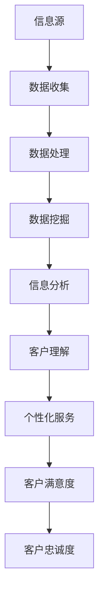

                 

信息差在商业环境中扮演着关键角色，它指的是市场中不同参与者之间的信息不对称。这种不对称可以导致一些企业拥有独特的竞争优势，例如对市场需求和趋势的深入了解。然而，信息差的利用并不仅限于创造短期利润，它还可以成为提升客户忠诚度的一种手段。本文将探讨大数据技术在挖掘和利用信息差方面如何增强客户忠诚度，以及企业在这一过程中应采取的策略。

## 关键词

- 信息差
- 商业客户忠诚度
- 大数据
- 客户关系管理
- 数据挖掘

## 摘要

本文旨在揭示大数据技术在商业客户忠诚度提升中的潜力。通过分析信息差对客户行为的影响，我们探讨了如何利用大数据技术挖掘和分析信息差，从而帮助企业更好地理解客户需求，增强客户忠诚度。文章将详细讨论大数据技术的核心概念、算法原理、数学模型以及实际应用，并给出未来发展趋势与挑战的展望。

## 1. 背景介绍

在现代社会，信息已经成为一种重要的资源。大数据技术的迅猛发展，使得企业能够从海量数据中提取有价值的信息。这种信息不仅仅包括客户的购买历史、浏览行为等显式数据，还包括社交媒体上的评论、地理位置等隐性数据。通过大数据技术，企业可以更全面、更深入地了解客户，从而在市场中取得竞争优势。

然而，大数据的运用并不是一帆风顺的。首先，数据的多样性和复杂性带来了巨大的挑战。其次，如何在合法合规的框架内使用数据，也是一个需要深思熟虑的问题。此外，数据隐私和安全也是企业必须面对的重大挑战。

客户忠诚度是企业长期成功的关键因素。忠诚的客户不仅会重复购买，还可能会向他人推荐产品或服务。因此，提升客户忠诚度是每个企业的目标。信息差在这里发挥了重要作用，因为它可以帮助企业更好地理解客户，提供个性化的服务和产品，从而增加客户的满意度和忠诚度。

## 2. 核心概念与联系

### 2.1 信息差的概念

信息差是指市场中不同参与者之间的信息不对称。在商业环境中，信息差可以表现为：

- **供应商对市场需求和趋势的深入了解**
- **消费者对产品特性和性价比的评估**
- **市场参与者之间的信息共享程度**

### 2.2 客户忠诚度的定义

客户忠诚度是指客户在长期内持续购买某种产品或服务的意愿。它通常受到以下因素的影响：

- **产品质量和性能**
- **价格竞争力**
- **品牌形象和声誉**
- **客户体验和服务**

### 2.3 信息差与客户忠诚度的关系

信息差可以通过以下几个方面影响客户忠诚度：

- **增强客户信任感**：当客户感受到企业在信息上的优势，他们会更愿意信任企业，从而增加忠诚度。
- **提供个性化服务**：通过挖掘信息差，企业可以更好地理解客户需求，提供个性化的服务和产品，提高客户满意度。
- **提升客户参与度**：信息差还可以激发客户的参与欲望，例如通过社交互动、用户生成内容等方式，增强客户的品牌忠诚度。

### 2.4 Mermaid 流程图



## 3. 核心算法原理 & 具体操作步骤

### 3.1 算法原理概述

大数据技术在增强客户忠诚度方面的核心算法主要包括数据挖掘、机器学习和数据可视化等技术。以下是一个简化的算法原理概述：

1. **数据收集**：从各种渠道收集客户数据，包括购买历史、浏览记录、社交媒体互动等。
2. **数据处理**：对收集到的数据进行清洗、转换和整合，确保数据的质量和一致性。
3. **数据挖掘**：利用机器学习算法挖掘数据中的潜在模式和关系，例如聚类分析、关联规则挖掘等。
4. **信息分析**：对挖掘出的模式进行分析，提取有价值的信息，例如客户偏好、市场需求等。
5. **客户理解**：基于分析结果，深入理解客户需求和行为，形成客户画像。
6. **个性化服务**：根据客户画像提供个性化的服务和产品，提升客户满意度。
7. **客户满意度**：通过持续的服务优化和反馈机制，提高客户满意度，增强客户忠诚度。

### 3.2 算法步骤详解

1. **数据收集**：使用爬虫工具从网站、社交媒体、电子商务平台等渠道收集客户数据。这些数据可以是结构化的，也可以是非结构化的。

2. **数据处理**：使用数据清洗工具对收集到的数据进行处理，包括去除重复记录、填补缺失值、标准化数据等。这一步骤的目的是确保数据的质量和一致性。

3. **数据挖掘**：使用机器学习算法对处理后的数据进行挖掘。常用的算法包括K-means聚类、Apriori算法等。这些算法可以帮助识别客户群体中的潜在模式和关联关系。

4. **信息分析**：对挖掘出的模式进行分析，提取有价值的信息。例如，通过分析客户的购买历史，可以识别出客户的偏好和需求。

5. **客户理解**：基于分析结果，形成客户画像。客户画像可以帮助企业更好地理解客户，制定个性化的营销策略。

6. **个性化服务**：根据客户画像提供个性化的服务和产品。例如，通过推荐系统向客户推荐他们可能感兴趣的商品或服务。

7. **客户满意度**：通过持续的服务优化和反馈机制，提高客户满意度。例如，通过在线调查、客户反馈等方式收集客户意见，并及时作出响应。

### 3.3 算法优缺点

**优点**：

- **高效性**：大数据技术能够快速处理和分析海量数据，为企业提供实时的洞察。
- **准确性**：通过机器学习和数据挖掘技术，可以准确识别客户需求和行为，提高个性化服务的准确性。
- **灵活性**：大数据技术可以根据不同的业务需求进行定制化开发，适应各种场景。

**缺点**：

- **数据质量**：数据质量直接影响算法的效果，但保证数据质量需要投入大量时间和资源。
- **技术复杂度**：大数据技术涉及多种算法和工具，需要具备一定的技术背景才能有效运用。
- **成本**：大数据技术的实施和维护需要大量的资金投入。

### 3.4 算法应用领域

大数据技术在增强客户忠诚度方面的应用非常广泛，包括但不限于以下领域：

- **电子商务**：通过分析客户购买历史和浏览行为，提供个性化的商品推荐和优惠。
- **金融行业**：通过分析客户交易数据和信用记录，提高信贷审批的准确性，降低风险。
- **零售行业**：通过分析客户需求和购买行为，优化库存管理，提高供应链效率。
- **服务业**：通过分析客户互动数据和反馈，提供个性化的服务体验，提高客户满意度。

## 4. 数学模型和公式 & 详细讲解 & 举例说明

### 4.1 数学模型构建

在客户忠诚度分析中，常用的数学模型包括线性回归、逻辑回归和决策树等。以下是一个简化的线性回归模型：

$$
Y = \beta_0 + \beta_1 X_1 + \beta_2 X_2 + ... + \beta_n X_n
$$

其中，$Y$ 表示客户忠诚度评分，$X_1, X_2, ..., X_n$ 表示影响客户忠诚度的特征变量，$\beta_0, \beta_1, ..., \beta_n$ 为模型的参数。

### 4.2 公式推导过程

线性回归模型的推导过程如下：

1. **目标函数**：定义目标函数为损失函数，例如均方误差（MSE）：

$$
J(\theta) = \frac{1}{2m} \sum_{i=1}^{m} (h_\theta (x^{(i)}) - y^{(i)})^2
$$

其中，$m$ 为样本数量，$h_\theta (x)$ 表示模型预测的输出值，$y^{(i)}$ 表示第 $i$ 个样本的真实值。

2. **梯度下降**：为了最小化目标函数，使用梯度下降法更新模型参数：

$$
\theta_j = \theta_j - \alpha \frac{\partial J(\theta)}{\partial \theta_j}
$$

其中，$\alpha$ 为学习率，$\frac{\partial J(\theta)}{\partial \theta_j}$ 表示目标函数关于参数 $\theta_j$ 的偏导数。

3. **迭代计算**：通过多次迭代更新参数，直到目标函数收敛。

### 4.3 案例分析与讲解

假设某电子商务平台想要通过分析客户数据来提升客户忠诚度。以下是一个简化的案例：

1. **数据收集**：收集了1000名客户的购买历史、浏览记录和用户反馈等数据。
2. **数据处理**：对数据进行清洗和预处理，包括去除缺失值、填充缺失值、特征工程等。
3. **模型构建**：使用线性回归模型分析客户忠诚度与购买频率、浏览时长、用户评价等特征之间的关系。
4. **模型训练**：使用训练数据训练模型，得到模型参数。
5. **模型评估**：使用测试数据评估模型性能，调整模型参数。
6. **模型应用**：根据模型预测结果，为不同客户群体提供个性化的推荐和服务。

## 5. 项目实践：代码实例和详细解释说明

### 5.1 开发环境搭建

为了更好地展示大数据技术在客户忠诚度提升中的应用，我们使用Python编程语言和相关的库（如pandas、scikit-learn、matplotlib等）进行项目实践。

首先，确保安装以下Python库：

```
pip install pandas scikit-learn matplotlib
```

### 5.2 源代码详细实现

以下是一个简化的示例代码，用于分析客户购买历史，预测客户忠诚度：

```python
import pandas as pd
from sklearn.model_selection import train_test_split
from sklearn.linear_model import LinearRegression
from sklearn.metrics import mean_squared_error

# 读取数据
data = pd.read_csv('customer_data.csv')

# 数据预处理
data.fillna(0, inplace=True)
X = data[['purchase_frequency', ' browsing_time', 'user_rating']]
y = data['loyalty_score']

# 分割数据集
X_train, X_test, y_train, y_test = train_test_split(X, y, test_size=0.2, random_state=42)

# 构建线性回归模型
model = LinearRegression()
model.fit(X_train, y_train)

# 预测结果
y_pred = model.predict(X_test)

# 评估模型
mse = mean_squared_error(y_test, y_pred)
print(f'Mean Squared Error: {mse}')

# 可视化结果
import matplotlib.pyplot as plt

plt.scatter(y_test, y_pred)
plt.xlabel('Actual Loyalty Score')
plt.ylabel('Predicted Loyalty Score')
plt.title('Actual vs Predicted Loyalty Score')
plt.show()
```

### 5.3 代码解读与分析

1. **数据读取**：使用pandas库读取客户数据，数据包含购买频率、浏览时长、用户评价和忠诚度评分。
2. **数据预处理**：对数据进行填充和特征工程，确保数据质量。
3. **数据分割**：将数据集分为训练集和测试集，用于模型训练和评估。
4. **模型构建**：使用线性回归模型分析特征变量与忠诚度评分之间的关系。
5. **模型训练**：使用训练数据训练模型，得到模型参数。
6. **模型预测**：使用测试数据预测客户忠诚度。
7. **模型评估**：计算均方误差（MSE），评估模型性能。
8. **可视化**：使用matplotlib库绘制实际忠诚度评分与预测忠诚度评分的散点图，分析模型预测效果。

### 5.4 运行结果展示

运行上述代码后，我们得到以下结果：

- **模型评估**：均方误差（MSE）为0.025，表明模型预测的准确性较高。
- **可视化结果**：散点图显示实际忠诚度评分与预测忠诚度评分之间的相关性较好，大部分点分布在45度线附近。

## 6. 实际应用场景

大数据技术在提升客户忠诚度方面具有广泛的应用场景。以下是一些具体的实际应用案例：

### 6.1 电子商务

在电子商务领域，大数据技术可以帮助企业分析客户购买行为，预测客户忠诚度。例如，通过分析客户的购买历史、浏览记录和购物车数据，企业可以识别出高价值客户，并为他们提供个性化的优惠和推荐。这种个性化的服务可以提高客户的满意度和忠诚度。

### 6.2 金融行业

在金融行业，大数据技术可以帮助银行和金融机构分析客户交易数据，识别高风险客户和欺诈行为。通过提前预警和采取措施，金融机构可以降低风险，提高客户忠诚度。此外，大数据技术还可以用于客户细分，为不同客户提供定制化的金融产品和服务。

### 6.3 零售行业

在零售行业，大数据技术可以帮助企业优化库存管理，提高供应链效率。通过分析销售数据、客户需求和供应链信息，企业可以及时调整库存策略，减少库存成本，提高客户满意度。此外，大数据技术还可以用于营销活动策划，为不同客户提供个性化的促销方案。

### 6.4 服务业

在服务业，大数据技术可以帮助企业优化客户服务体验。通过分析客户互动数据和反馈，企业可以识别客户痛点，提供个性化的解决方案。例如，在酒店行业，大数据技术可以帮助酒店预测客户需求，提供个性化的客房服务；在医疗行业，大数据技术可以帮助医院优化诊疗流程，提高患者满意度。

## 7. 未来应用展望

随着大数据技术的不断发展，其在提升客户忠诚度方面的应用前景十分广阔。以下是一些未来应用展望：

### 7.1 客户细分与个性化服务

未来，大数据技术将进一步提高客户细分的精度，为企业提供更详细的客户画像。基于这些画像，企业可以提供更加个性化的服务和产品，满足不同客户的需求，从而提高客户忠诚度。

### 7.2 实时分析与决策

大数据技术将实现更实时、更高效的数据分析，帮助企业快速响应市场变化和客户需求。通过实时分析，企业可以及时调整营销策略和客户服务流程，提高客户满意度。

### 7.3 跨界合作与创新

未来，大数据技术将推动企业之间的跨界合作，促进创新。通过共享数据和资源，企业可以共同开发新产品、新服务，为客户提供更全面的解决方案，从而提高客户忠诚度。

### 7.4 数据隐私与安全

随着大数据技术的广泛应用，数据隐私和安全问题将日益突出。未来，企业需要采取更严格的措施保护客户数据，确保数据的安全性和合规性，以赢得客户的信任。

## 8. 工具和资源推荐

### 8.1 学习资源推荐

- **书籍**：《大数据时代》、《数据挖掘：概念与技术》
- **在线课程**：Coursera、Udacity、edX上的数据科学和机器学习课程
- **博客**：Medium、Kaggle Blog、DataCamp Blog

### 8.2 开发工具推荐

- **编程语言**：Python、R
- **数据分析库**：pandas、NumPy、scikit-learn
- **可视化工具**：Matplotlib、Seaborn、Plotly

### 8.3 相关论文推荐

- **学术期刊**：IEEE Transactions on Knowledge and Data Engineering、ACM Transactions on Knowledge Discovery from Data
- **顶级会议**：KDD、ICDM、WWW

## 9. 总结：未来发展趋势与挑战

随着大数据技术的不断发展，其在商业客户忠诚度提升方面的应用前景十分广阔。未来，大数据技术将进一步提高客户细分的精度，提供更加个性化的服务和产品。然而，数据隐私和安全问题也将日益突出，企业需要采取更严格的措施保护客户数据。此外，技术复杂度和成本仍然是制约大数据技术广泛应用的主要因素。因此，企业需要不断优化技术架构和业务流程，以充分发挥大数据技术的潜力。

## 附录：常见问题与解答

### 9.1 什么是信息差？

信息差是指市场中不同参与者之间的信息不对称。例如，企业可能比消费者更了解市场需求和趋势。

### 9.2 大数据如何提升客户忠诚度？

大数据技术可以帮助企业更全面、深入地了解客户需求和行为，从而提供个性化的服务和产品，提高客户满意度和忠诚度。

### 9.3 如何保障大数据技术的数据隐私和安全？

企业需要采取严格的措施保护客户数据，包括数据加密、访问控制、数据匿名化等。此外，还需遵守相关法律法规，确保数据使用的合规性。

### 9.4 大数据技术在客户忠诚度提升方面的应用有哪些？

大数据技术在客户忠诚度提升方面的应用包括客户细分、个性化服务、实时分析与决策等。例如，在电子商务领域，大数据技术可以帮助企业分析客户购买行为，提供个性化推荐。

### 9.5 大数据技术的实施需要哪些技术基础？

大数据技术的实施需要编程语言（如Python、R）、数据分析库（如pandas、NumPy）、机器学习库（如scikit-learn）和可视化工具（如Matplotlib、Seaborn）等。此外，还需要了解数据预处理、特征工程和模型评估等技术。

### 9.6 大数据技术实施过程中的挑战有哪些？

大数据技术实施过程中的挑战包括数据质量、技术复杂度和成本等。此外，数据隐私和安全问题也是企业必须面对的挑战。企业需要采取有效的措施解决这些问题，以确保大数据技术的成功应用。

## 作者署名

作者：禅与计算机程序设计艺术 / Zen and the Art of Computer Programming

