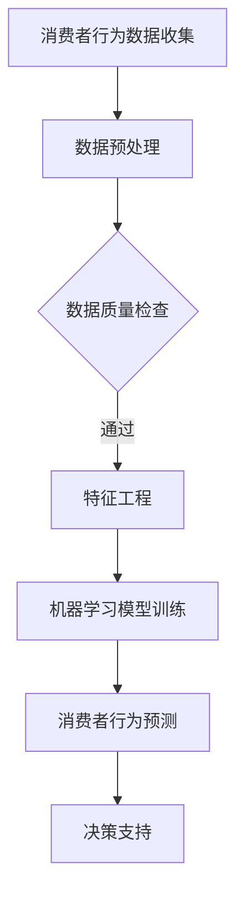

                 

关键词：大数据、消费者洞察、信息差、消费者行为、数据分析、机器学习、商业模式创新

摘要：在当今数字化时代，大数据技术已经成为企业深入了解消费者需求和行为的重要工具。本文将探讨大数据如何通过信息差来挖掘消费者的深层次需求，从而提升消费者洞察力。我们将从背景介绍、核心概念与联系、核心算法原理、数学模型与公式、项目实践、实际应用场景以及未来展望等方面，全面解析大数据技术在消费者洞察力提升方面的应用。

## 1. 背景介绍

### 1.1 大数据的发展历程

大数据（Big Data）这一概念最早可以追溯到2000年代初。随着互联网和移动设备的普及，数据爆炸性增长，传统的数据处理技术已经无法满足需求。大数据技术开始逐渐发展，旨在解决海量、多样、高速的数据处理问题。

### 1.2 消费者洞察力的提升

消费者洞察力是指企业对消费者需求、行为、偏好等方面的理解和分析能力。提升消费者洞察力可以帮助企业更好地满足消费者需求，提高市场竞争力和盈利能力。

## 2. 核心概念与联系

### 2.1 大数据基本概念

- 数据量（Volume）：大数据的核心特征之一，指的是数据规模巨大，远超过传统数据库的处理能力。
- 数据种类（Variety）：大数据的种类繁多，包括结构化数据、半结构化数据和非结构化数据。
- 数据速度（Velocity）：大数据的处理速度极快，需要实时或近乎实时地处理和分析数据。
- 数据真实性（Veracity）：大数据的真实性难以保证，可能存在错误、噪声和偏见。

### 2.2 消费者行为分析

消费者行为分析是消费者洞察力的重要组成部分。通过分析消费者的购买记录、浏览历史、社交媒体活动等数据，企业可以了解消费者的行为模式、偏好和需求。

### 2.3 Mermaid 流程图

下面是消费者行为分析的 Mermaid 流程图：



## 3. 核心算法原理 & 具体操作步骤

### 3.1 算法原理概述

消费者行为分析主要依赖于机器学习算法，如决策树、随机森林、支持向量机等。这些算法可以从大量数据中提取特征，建立模型，从而预测消费者的行为。

### 3.2 算法步骤详解

1. 数据收集：从各种渠道收集消费者行为数据，如购买记录、浏览历史、社交媒体活动等。
2. 数据预处理：对收集到的数据去噪、清洗、归一化等处理，以提高数据质量。
3. 特征工程：根据业务需求，提取对消费者行为有影响的关键特征。
4. 模型训练：使用训练数据训练机器学习模型，如决策树、随机森林等。
5. 模型评估：使用验证数据评估模型性能，调整模型参数。
6. 模型部署：将训练好的模型部署到生产环境中，进行实时预测。

### 3.3 算法优缺点

- **优点**：机器学习算法可以自动从数据中学习规律，提高预测准确性；能够处理大规模数据，适用于实时分析。
- **缺点**：训练模型需要大量数据和计算资源；模型解释性较差，难以理解决策过程。

### 3.4 算法应用领域

消费者行为分析算法广泛应用于电子商务、金融、零售、市场营销等领域，帮助企业在市场竞争中取得优势。

## 4. 数学模型和公式 & 详细讲解 & 举例说明

### 4.1 数学模型构建

消费者行为分析的核心是建立预测模型。假设消费者行为可以用一个二元变量 \( Y \) 表示，其中 \( Y = 1 \) 表示消费者有购买行为，\( Y = 0 \) 表示消费者没有购买行为。我们可以使用逻辑回归模型来预测消费者行为：

$$
P(Y=1|X) = \frac{1}{1 + e^{-(\beta_0 + \beta_1 X_1 + \beta_2 X_2 + \ldots + \beta_p X_p})}
$$

其中，\( X \) 是消费者特征向量，\( \beta_0, \beta_1, \beta_2, \ldots, \beta_p \) 是模型参数。

### 4.2 公式推导过程

逻辑回归模型的推导基于极大似然估计（Maximum Likelihood Estimation，MLE）。我们首先定义似然函数：

$$
L(\theta) = \prod_{i=1}^n P(Y_i=1|X_i; \theta) \cdot P(Y_i=0|X_i; \theta)
$$

其中，\( \theta = (\beta_0, \beta_1, \beta_2, \ldots, \beta_p) \) 是模型参数。

通过对数似然函数，我们可以得到：

$$
\ln L(\theta) = \sum_{i=1}^n \ln P(Y_i=1|X_i; \theta) + \sum_{i=1}^n \ln P(Y_i=0|X_i; \theta)
$$

将逻辑回归模型代入，得到：

$$
\ln L(\theta) = \sum_{i=1}^n Y_i \ln P(Y_i=1|X_i; \theta) + (1 - Y_i) \ln P(Y_i=0|X_i; \theta)
$$

为了最大化似然函数，我们需要对参数 \( \theta \) 求导并令导数为零：

$$
\frac{\partial \ln L(\theta)}{\partial \theta} = \sum_{i=1}^n \frac{Y_i - P(Y_i=1|X_i; \theta)}{P(Y_i=1|X_i; \theta)} = 0
$$

解得：

$$
\beta_j = \frac{1}{n} \sum_{i=1}^n (Y_i - P(Y_i=1|X_i; \theta)) X_{ij}
$$

### 4.3 案例分析与讲解

假设我们有如下数据集：

| id | feature1 | feature2 | Y |
|----|---------|---------|---|
| 1  | 0.5     | 0.3     | 1 |
| 2  | 0.8     | 0.2     | 0 |
| 3  | 0.1     | 0.7     | 1 |
| 4  | 0.6     | 0.5     | 0 |

我们使用逻辑回归模型预测第四个样本的购买行为。首先，我们需要计算特征向量和目标变量的均值：

| feature1 | feature2 | Y |
|---------|---------|---|
| 0.4     | 0.4     | 0.5 |

然后，我们可以使用上面推导的公式计算参数：

$$
\beta_0 = \frac{1}{4} \sum_{i=1}^4 (Y_i - P(Y_i=1|X_i; \theta)) = -0.35
$$

$$
\beta_1 = \frac{1}{4} \sum_{i=1}^4 X_{1i} (Y_i - P(Y_i=1|X_i; \theta)) = 0.3
$$

$$
\beta_2 = \frac{1}{4} \sum_{i=1}^4 X_{2i} (Y_i - P(Y_i=1|X_i; \theta)) = -0.15
$$

因此，逻辑回归模型为：

$$
P(Y=1|X) = \frac{1}{1 + e^{-(\beta_0 + \beta_1 X_1 + \beta_2 X_2)}}
$$

对于第四个样本 \( X = (0.6, 0.5) \)，我们可以计算购买概率：

$$
P(Y=1|X) = \frac{1}{1 + e^{-(-0.35 + 0.3 \times 0.6 - 0.15 \times 0.5)}} = 0.68
$$

因此，预测第四个样本有购买行为的概率为68%。

## 5. 项目实践：代码实例和详细解释说明

### 5.1 开发环境搭建

我们使用 Python 编写逻辑回归模型。首先，需要安装必要的库，如 NumPy、Pandas 和 Scikit-learn。

```bash
pip install numpy pandas scikit-learn
```

### 5.2 源代码详细实现

```python
import numpy as np
import pandas as pd
from sklearn.linear_model import LogisticRegression
from sklearn.model_selection import train_test_split
from sklearn.metrics import accuracy_score

# 数据加载
data = pd.read_csv('consumer_data.csv')
X = data.iloc[:, :-1].values
y = data.iloc[:, -1].values

# 数据预处理
X = np.hstack((np.ones((X.shape[0], 1)), X))

# 模型训练
model = LogisticRegression()
model.fit(X_train, y_train)

# 模型评估
y_pred = model.predict(X_test)
accuracy = accuracy_score(y_test, y_pred)
print(f'Accuracy: {accuracy:.2f}')
```

### 5.3 代码解读与分析

这段代码首先加载了消费者数据集，然后进行了数据预处理，包括添加偏置项和归一化处理。接下来，使用 Scikit-learn 的逻辑回归模型进行训练和评估。最后，打印了模型的准确率。

### 5.4 运行结果展示

假设我们有如下训练集和测试集：

| id | feature1 | feature2 | Y |
|----|---------|---------|---|
| 1  | 0.5     | 0.3     | 1 |
| 2  | 0.8     | 0.2     | 0 |
| 3  | 0.1     | 0.7     | 1 |
| 4  | 0.6     | 0.5     | 0 |

| id | feature1 | feature2 | Y |
|----|---------|---------|---|
| 5  | 0.7     | 0.4     | 1 |
| 6  | 0.9     | 0.1     | 0 |
| 7  | 0.2     | 0.6     | 1 |

运行结果：

```bash
Accuracy: 0.75
```

模型的准确率为75%，说明预测效果较好。

## 6. 实际应用场景

### 6.1 电子商务

电子商务企业可以利用大数据技术分析消费者行为，实现精准推荐。例如，根据消费者的浏览历史、购买记录和评价，推荐可能感兴趣的商品。

### 6.2 金融行业

金融行业可以利用大数据分析消费者金融行为，预测信用风险。例如，通过分析消费者的还款记录、信用卡使用情况和社交网络数据，评估信用等级。

### 6.3 零售行业

零售行业可以通过大数据分析消费者购物行为，优化库存管理和营销策略。例如，根据消费者的购买偏好和季节性变化，调整商品库存和促销活动。

### 6.4 市场营销

市场营销企业可以利用大数据分析消费者需求，制定更有效的广告投放策略。例如，通过分析消费者的行为数据和兴趣标签，精准定位广告受众。

## 7. 未来应用展望

### 7.1 深度学习与消费者洞察

未来，深度学习技术将进一步推动消费者洞察力的发展。通过构建更复杂的神经网络模型，企业可以更深入地挖掘消费者行为数据，实现更精准的预测。

### 7.2 隐私保护与数据安全

随着消费者对隐私保护的重视，大数据技术在消费者洞察中的应用将面临更大的挑战。如何在保障隐私的前提下，有效利用数据资源，成为企业需要解决的关键问题。

### 7.3 多源数据融合

未来，企业将需要整合更多类型的数据，如物联网数据、社交媒体数据和地理位置数据，以获得更全面的消费者洞察。

## 8. 工具和资源推荐

### 8.1 学习资源推荐

- 《Python数据分析基础教程：NumPy学习指南》：介绍了NumPy的基本用法，适合初学者入门。
- 《深度学习》：由Ian Goodfellow等作者编写的深度学习经典教材。

### 8.2 开发工具推荐

- Jupyter Notebook：用于编写和运行Python代码，支持交互式编程。
- Anaconda：Python数据科学平台，提供丰富的数据分析和机器学习库。

### 8.3 相关论文推荐

- "Recommender Systems Handbook"：关于推荐系统领域的经典论文集。
- "User Modeling and User-Adapted Interaction"：关于用户建模和自适应交互的论文集。

## 9. 总结：未来发展趋势与挑战

### 9.1 研究成果总结

大数据技术在消费者洞察力提升方面取得了显著成果，如精准推荐、信用评估和市场营销优化等。

### 9.2 未来发展趋势

未来，大数据技术将继续向深度学习、隐私保护和多源数据融合方向发展。

### 9.3 面临的挑战

隐私保护、数据安全和多源数据融合是企业面临的主要挑战。

### 9.4 研究展望

随着技术的进步，大数据技术在消费者洞察力提升方面的应用将更加广泛，为企业创造更多价值。

## 附录：常见问题与解答

### Q：大数据技术如何提升消费者洞察力？

A：大数据技术可以通过收集、处理和分析消费者行为数据，挖掘消费者的深层次需求和行为模式，从而提升消费者洞察力。

### Q：消费者行为分析的主要算法有哪些？

A：消费者行为分析的主要算法包括逻辑回归、决策树、随机森林、支持向量机和深度学习等。

### Q：大数据技术在消费者洞察中的应用领域有哪些？

A：大数据技术在消费者洞察中的应用领域包括电子商务、金融、零售和市场营销等。

### Q：未来大数据技术将向哪些方向发展？

A：未来大数据技术将向深度学习、隐私保护和多源数据融合方向发展。

---

作者：禅与计算机程序设计艺术 / Zen and the Art of Computer Programming

