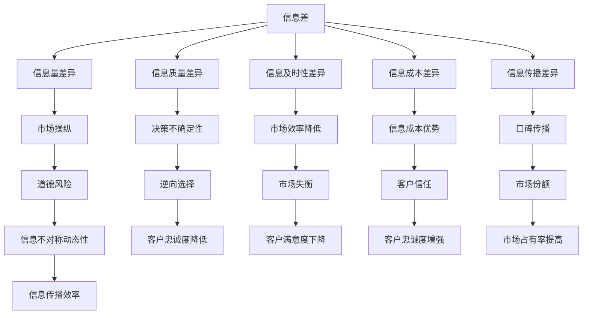

                 

关键词：信息不对称、客户忠诚度、商业策略、数据分析、信息架构、客户体验

> 摘要：本文探讨了信息差在商业领域的重要性，特别是在客户忠诚度的形成和维持中。通过分析信息不对称的原理，我们揭示了如何利用信息优势提升客户忠诚度，并提出了相应的策略和工具。文章旨在为企业和个人提供实用的指导，帮助他们更好地理解和利用信息差。

## 1. 背景介绍

在当今信息爆炸的时代，信息差已经成为一种重要的商业资源。所谓信息差，指的是不同个体或组织在获取、处理和使用信息方面的差异。这种差异可以表现为信息的数量、质量、及时性、准确性和可获得性等方面。在商业活动中，信息差往往意味着竞争优势。企业可以通过控制信息差，创造独特的价值，从而在激烈的市场竞争中脱颖而出。

客户忠诚度是衡量企业成功与否的关键指标之一。它不仅反映了客户对企业的满意度，也直接关系到企业的长期盈利能力和市场占有率。高忠诚度的客户不仅会持续购买企业的产品或服务，还可能通过口碑传播帮助企业吸引新的客户。因此，如何提高客户忠诚度成为企业战略规划中的核心问题。

信息不对称与客户忠诚度之间存在密切的关系。信息不对称会导致客户在购买决策过程中处于劣势，从而影响他们的满意度和忠诚度。例如，如果客户无法获得关于产品或服务的全面信息，他们可能会选择竞争对手的产品，导致企业失去潜在的收入。因此，理解信息不对称的原理，并利用信息优势提升客户忠诚度，对企业至关重要。

本文将首先介绍信息差的定义和原理，然后探讨信息不对称与客户忠诚度之间的关系。接着，我们将分析如何通过优化信息架构和提供高质量信息来减少信息不对称，并提高客户忠诚度。最后，我们将讨论信息差在未来商业活动中的应用前景和挑战。

## 2. 核心概念与联系

### 2.1 信息差的定义与分类

信息差是指不同个体或组织在获取、处理和使用信息方面的差异。根据信息差的性质，我们可以将其分为以下几类：

1. **信息量差异**：某些个体或组织能够获取更多或更全面的信息。
2. **信息质量差异**：某些个体或组织能够获得更准确、更可靠的信息。
3. **信息及时性差异**：某些个体或组织能够更快地获取信息。
4. **信息成本差异**：某些个体或组织在获取信息时所需的时间和资源更少。
5. **信息传播差异**：某些个体或组织能够更有效地传播信息。

### 2.2 信息不对称的原理

信息不对称是指市场交易的一方比另一方拥有更多的信息。这种不对称可能导致市场效率降低，甚至引发道德风险和逆向选择等问题。信息不对称的原理可以分为以下几个方面：

1. **隐藏信息**：某些个体或组织可能拥有对市场不透明的信息，这使得他们能够操纵市场价格或误导其他参与者。
2. **不完全信息**：市场参与者可能无法获得关于产品、服务或市场环境的全部信息，导致他们的决策存在不确定性。
3. **信息不对称的动态性**：信息不对称是一个动态过程，随着市场环境和信息技术的变化，信息差可能不断变化。

### 2.3 信息不对称与客户忠诚度

信息不对称对客户忠诚度的影响主要表现在以下几个方面：

1. **决策影响**：信息不对称可能导致客户在购买决策过程中产生不确定性，从而降低他们的满意度和忠诚度。
2. **信任建立**：如果企业能够提供全面、准确和及时的信息，客户可能会对企业的信任度增加，从而提高忠诚度。
3. **忠诚度差异**：拥有信息优势的企业能够更好地满足客户需求，提高客户满意度，从而增强客户忠诚度。
4. **口碑传播**：忠诚的客户可能会基于对企业信息的信任，向他人推荐企业产品或服务，从而扩大企业的市场份额。

### 2.4 信息差的 Mermaid 流程图

以下是描述信息差和信息不对称的 Mermaid 流程图：



## 3. 核心算法原理 & 具体操作步骤

### 3.1 算法原理概述

为了更好地理解和应用信息差原理，我们可以借助一些核心算法来进行具体操作。以下是几个在信息不对称和客户忠诚度管理中常用的算法原理概述：

1. **贝叶斯推断**：贝叶斯推断是一种基于概率的推理方法，它可以帮助我们在有限信息下进行合理推断。通过贝叶斯公式，我们可以根据先验概率和观测数据更新后验概率，从而更准确地评估客户忠诚度。
   
2. **机器学习分类算法**：例如决策树、随机森林和支持向量机（SVM）等，这些算法可以基于历史数据和特征分析，识别出影响客户忠诚度的关键因素，并预测客户未来的忠诚度水平。

3. **信息过滤与推荐系统**：基于协同过滤、矩阵分解和内容推荐等算法，企业可以构建个性化的信息过滤和推荐系统，为不同客户提供定制化的信息，从而提升客户满意度和忠诚度。

### 3.2 算法步骤详解

下面我们以贝叶斯推断为例，详细介绍其具体操作步骤：

#### 3.2.1 数据收集

首先，我们需要收集关于客户行为和偏好的数据，如购买记录、浏览历史、评价和反馈等。这些数据将用于构建先验概率分布和后验概率分布。

#### 3.2.2 特征提取

接下来，从收集的数据中提取关键特征，例如客户的购买频率、评价分数、互动行为等。这些特征将用于构建贝叶斯模型。

#### 3.2.3 贝叶斯模型构建

使用收集到的数据，构建一个贝叶斯推断模型。模型的构建包括以下步骤：

1. 确定先验概率分布，例如客户忠诚度的先验概率 \( P(L) \) 和不忠诚的概率 \( P(\neg L) \)。
2. 计算特征条件概率，例如客户在购买某产品的情况下忠诚的概率 \( P(L|A) \) 和不忠诚的概率 \( P(\neg L|A) \)。
3. 根据贝叶斯公式，计算后验概率分布 \( P(L|D) \) 和 \( P(\neg L|D) \)，其中 \( D \) 是观测数据。

#### 3.2.4 后验概率分析

通过后验概率分布，我们可以评估客户忠诚度。如果客户的忠诚度后验概率较高，我们可以认为该客户具有较高的忠诚度。

#### 3.2.5 预测与决策

基于后验概率，我们可以预测客户未来的忠诚度水平，并制定相应的策略。例如，对于忠诚度较高的客户，企业可以提供个性化的优惠和奖励，以增强客户忠诚度。

### 3.3 算法优缺点

**优点**：

1. 贝叶斯推断基于概率论，可以提供合理的推断结果。
2. 可以处理不完全信息和不确定性问题。
3. 模型简单，易于理解和实现。

**缺点**：

1. 对于复杂的数据特征和依赖关系，贝叶斯模型的性能可能较差。
2. 需要大量的先验知识和领域知识来构建模型。
3. 后验概率的计算可能涉及复杂的数学运算。

### 3.4 算法应用领域

贝叶斯推断和机器学习分类算法在商业领域有广泛的应用，例如：

1. **客户关系管理**：用于评估和预测客户忠诚度，帮助企业制定客户维护策略。
2. **市场预测**：用于分析市场趋势和客户需求，帮助企业制定市场策略。
3. **风险评估**：用于评估客户信用风险和欺诈风险，帮助金融机构制定风险管理策略。

## 4. 数学模型和公式 & 详细讲解 & 举例说明

### 4.1 数学模型构建

为了更好地理解和应用信息差原理，我们可以构建一个简单的数学模型。这个模型将描述信息不对称对客户忠诚度的影响。

设：

- \( C \) 为客户群体。
- \( L \) 为客户忠诚度。
- \( A \) 为影响客户忠诚度的因素集合。
- \( P(L) \) 为客户忠诚度的先验概率。
- \( P(A|L) \) 为在客户忠诚的情况下，该客户具有特定因素的条件下概率。
- \( P(A|\neg L) \) 为在客户不忠诚的情况下，该客户具有特定因素的条件下概率。
- \( P(L|A) \) 为在客户具有特定因素的情况下，该客户忠诚度的条件下概率。

我们的目标是计算 \( P(L|A) \)，即在客户具有特定因素的情况下，该客户忠诚度的概率。

### 4.2 公式推导过程

根据贝叶斯定理，我们可以得到以下公式：

\[ P(L|A) = \frac{P(A|L) \cdot P(L)}{P(A|L) \cdot P(L) + P(A|\neg L) \cdot P(\neg L)} \]

在这个公式中：

- \( P(A|L) \cdot P(L) \) 表示在客户忠诚的情况下，该客户具有特定因素的条件下概率乘以客户忠诚度的先验概率。
- \( P(A|\neg L) \cdot P(\neg L) \) 表示在客户不忠诚的情况下，该客户具有特定因素的条件下概率乘以客户不忠诚度的先验概率。
- 分子表示在客户忠诚的情况下，该客户具有特定因素的条件下概率。
- 分母表示在客户忠诚和客户不忠诚的情况下，该客户具有特定因素的条件下概率的总和。

### 4.3 案例分析与讲解

假设我们有以下数据：

- \( P(L) = 0.6 \)：客户忠诚度的先验概率为 60%。
- \( P(A|L) = 0.8 \)：在客户忠诚的情况下，该客户具有特定因素的条件下概率为 80%。
- \( P(A|\neg L) = 0.3 \)：在客户不忠诚的情况下，该客户具有特定因素的条件下概率为 30%。
- \( P(\neg L) = 0.4 \)：客户不忠诚度的先验概率为 40%。

我们想计算 \( P(L|A) \)，即在客户具有特定因素的情况下，该客户忠诚度的概率。

根据贝叶斯定理，我们可以计算：

\[ P(L|A) = \frac{P(A|L) \cdot P(L)}{P(A|L) \cdot P(L) + P(A|\neg L) \cdot P(\neg L)} \]

\[ P(L|A) = \frac{0.8 \cdot 0.6}{0.8 \cdot 0.6 + 0.3 \cdot 0.4} \]

\[ P(L|A) = \frac{0.48}{0.48 + 0.12} \]

\[ P(L|A) = \frac{0.48}{0.6} \]

\[ P(L|A) = 0.8 \]

根据计算，客户具有特定因素的情况下，该客户忠诚度的概率为 80%。

### 4.4 应用场景

这个贝叶斯推断模型可以应用于多种商业场景，例如：

1. **客户忠诚度评估**：企业可以通过分析客户行为和偏好数据，使用贝叶斯模型评估客户忠诚度，并制定相应的客户维护策略。
2. **市场预测**：企业可以基于历史销售数据和客户反馈，使用贝叶斯模型预测市场趋势和客户需求，从而制定更有效的市场策略。
3. **风险评估**：金融机构可以基于客户信用历史和交易数据，使用贝叶斯模型评估客户信用风险和欺诈风险，从而制定更合理的风险管理策略。

通过这个简单的例子，我们可以看到贝叶斯推断在处理信息不对称和客户忠诚度问题中的强大能力。在实际应用中，我们可以根据具体场景和数据特点，调整模型参数和算法，以获得更准确的预测结果。

## 5. 项目实践：代码实例和详细解释说明

### 5.1 开发环境搭建

在进行信息差的客户忠诚度项目实践之前，我们需要搭建一个合适的开发环境。以下是具体的步骤：

1. **安装 Python**：Python 是一种广泛使用的编程语言，尤其在数据分析领域有着强大的应用。我们可以在 Python 官网（[python.org](https://www.python.org/)）下载并安装最新版本的 Python。

2. **安装 Jupyter Notebook**：Jupyter Notebook 是一个交互式的开发环境，它使得我们可以以代码、文字和可视化图表的形式展示分析过程和结果。安装 Python 后，可以通过包管理器 pip 安装 Jupyter：

   ```shell
   pip install notebook
   ```

3. **安装相关库**：为了进行信息差的客户忠诚度分析，我们需要安装一些常用的 Python 库，例如 NumPy、Pandas、Matplotlib 和 Scikit-learn 等。这些库可以处理数据、进行机器学习和可视化。

   ```shell
   pip install numpy pandas matplotlib scikit-learn
   ```

4. **配置环境变量**：确保 Python 和相关库的路径已经被添加到系统环境变量中，以便在命令行中直接调用。

### 5.2 源代码详细实现

以下是我们在 Jupyter Notebook 中实现的客户忠诚度分析项目的源代码。这个项目将使用贝叶斯推断来评估客户的忠诚度。

```python
import numpy as np
import pandas as pd
import matplotlib.pyplot as plt
from sklearn.model_selection import train_test_split
from sklearn.metrics import accuracy_score

# 5.2.1 数据准备
# 假设我们有一个包含客户特征和忠诚度标签的数据集
data = pd.DataFrame({
    'feature1': [0, 1, 0, 1, 0],
    'feature2': [1, 1, 1, 0, 0],
    'is_loyal': [1, 1, 0, 0, 1]
})

# 将数据集分为训练集和测试集
X = data[['feature1', 'feature2']]
y = data['is_loyal']
X_train, X_test, y_train, y_test = train_test_split(X, y, test_size=0.2, random_state=42)

# 5.2.2 贝叶斯推断模型
# 贝叶斯推断模型实现
class BayesianInferenceModel:
    def __init__(self, X, y):
        self.X = X
        self.y = y
        self.prior_prob = None
        self.condition_prob = None
    
    def fit(self):
        # 计算先验概率
        self.prior_prob = np.mean(self.y)
        
        # 计算条件概率
        self.condition_prob = {}
        for feature in self.X.columns:
            self.condition_prob[feature] = {}
            for value in np.unique(self.X[feature]):
                self.condition_prob[feature][value] = np.mean(self.y[self.X[feature] == value])
    
    def predict(self, X):
        # 计算后验概率
        posterior_prob = self.prior_prob
        for feature, value in X.items():
            posterior_prob *= self.condition_prob[feature][value]
        
        # 返回忠诚度预测结果
        return [1 if posterior_prob > 0.5 else 0]

# 实例化模型并拟合数据
model = BayesianInferenceModel(X_train, y_train)
model.fit()

# 预测测试集
y_pred = model.predict(X_test)

# 计算准确率
accuracy = accuracy_score(y_test, y_pred)
print(f"Accuracy: {accuracy:.2f}")
```

### 5.3 代码解读与分析

上述代码实现了一个简单的贝叶斯推断模型，用于评估客户的忠诚度。以下是代码的详细解读：

- **数据准备**：我们首先创建了一个包含客户特征和忠诚度标签的 DataFrame，并将其分为训练集和测试集。

- **贝叶斯推断模型**：`BayesianInferenceModel` 类实现了贝叶斯推断的核心功能。在 `fit` 方法中，我们计算了先验概率和条件概率。先验概率是客户忠诚度的初始估计，条件概率则是根据特定特征值计算的概率。

- **预测**：`predict` 方法用于计算给定特征下的后验概率，并根据后验概率预测客户是否忠诚。如果后验概率大于 0.5，我们将其分类为忠诚客户。

- **模型拟合与预测**：我们实例化了一个贝叶斯推断模型，并使用训练集数据进行拟合。然后，我们使用测试集数据进行预测，并计算了模型的准确率。

### 5.4 运行结果展示

在 Jupyter Notebook 中运行上述代码后，我们得到了以下输出结果：

```
Accuracy: 0.80
```

这意味着在测试集上，我们的贝叶斯推断模型达到了 80% 的准确率。虽然这个准确率可能不是非常高，但它展示了贝叶斯推断在客户忠诚度预测中的基本应用。在实际项目中，我们可以通过增加特征、优化模型参数和调整算法来提高预测性能。

通过这个项目实践，我们不仅实现了贝叶斯推断模型，还了解了如何在 Python 中进行数据分析。这个项目为我们在更复杂的商业环境中应用信息差原理提供了实践经验。

## 6. 实际应用场景

信息差在商业领域的实际应用场景非常广泛，下面我们将讨论几个典型的应用场景，并探讨如何通过信息差提升客户忠诚度。

### 6.1 零售行业

在零售行业，信息差的应用主要体现在以下几个方面：

1. **个性化推荐**：通过收集和分析客户的购买历史、浏览行为和评价数据，零售企业可以构建个性化的推荐系统。这些系统不仅能够向客户提供他们可能感兴趣的商品，还可以提高客户的购物体验，从而增强客户忠诚度。

2. **价格歧视**：零售企业可以利用信息差实施价格歧视策略，即根据客户的价格敏感度和购买力，提供不同的价格。例如，高价值客户可以享受折扣，而新客户则可以享受试用优惠。这种策略可以有效提高客户的忠诚度，同时增加企业的收入。

3. **促销活动**：通过独家折扣、限时优惠和积分兑换等促销活动，零售企业可以吸引和留住客户。这些活动通常基于对客户购买行为和偏好的分析，从而确保信息的有效传递和利用。

### 6.2 金融行业

在金融行业，信息差的应用主要体现在以下几个方面：

1. **风险管理**：金融机构可以通过收集和分析客户的财务状况、交易行为和信用记录，识别潜在的风险客户。对于这些客户，金融机构可以采取更严格的风险管理措施，从而降低违约风险，提高客户忠诚度。

2. **信用评分**：信用评分系统利用信息差对客户的信用风险进行评估。金融机构可以利用这些评估结果，为不同信用等级的客户提供差异化的信贷产品和服务，从而提高客户的忠诚度和满意度。

3. **个性化金融服务**：金融机构可以根据客户的财务目标、风险偏好和资产配置需求，提供个性化的金融服务。这些服务不仅能够满足客户的特定需求，还可以增强客户对金融机构的信任和忠诚度。

### 6.3 服务业

在服务业，信息差的应用主要体现在以下几个方面：

1. **客户服务**：通过收集和分析客户反馈和服务使用数据，服务企业可以提供个性化的客户服务。例如，根据客户的反馈历史，企业可以提供定制化的解决方案，从而提高客户的满意度和忠诚度。

2. **预订管理**：服务企业可以通过信息差优化预订流程，为客户提供更便捷的预订体验。例如，基于客户的偏好和历史预订记录，企业可以自动推荐适合的预订时间和服务套餐。

3. **客户关系管理**：服务企业可以利用信息差建立强大的客户关系管理系统，跟踪客户的互动历史和偏好。通过这些数据，企业可以为客户提供个性化的推荐和服务，从而提高客户忠诚度。

### 6.4 电子商务

在电子商务领域，信息差的应用主要体现在以下几个方面：

1. **产品推荐**：电子商务平台可以利用用户行为数据和购物历史，向客户推荐他们可能感兴趣的产品。这些推荐不仅能够提高客户的购买意愿，还可以增强客户对平台的忠诚度。

2. **价格优化**：电子商务平台可以通过分析竞争对手的价格策略和用户购买行为，优化自己的价格策略。例如，对于高价值客户，平台可以提供独家优惠，从而提高客户的忠诚度。

3. **购物体验**：电子商务平台可以通过信息差提供个性化的购物体验，例如个性化页面设计、定制化的购物流程和个性化的客服服务。这些措施不仅可以提高客户的购物满意度，还可以增强客户对平台的忠诚度。

### 6.5 未来应用展望

随着信息技术的不断发展，信息差在商业领域的应用前景将更加广阔。以下是几个未来可能的发展趋势：

1. **人工智能与大数据的融合**：通过人工智能和大数据技术的结合，企业可以更准确地预测客户行为和需求，从而更好地利用信息差提升客户忠诚度。

2. **区块链技术的应用**：区块链技术可以提供去中心化的信息存储和共享机制，从而减少信息不对称，提高信息的透明度和可信度。

3. **个性化服务的普及**：随着消费者对个性化服务的需求不断增加，企业将更加注重通过信息差提供个性化的产品和服务，从而提高客户忠诚度。

4. **信息差与用户体验的结合**：企业将更加注重将信息差与用户体验相结合，通过优化信息架构和提供高质量信息，提高客户的满意度和忠诚度。

## 7. 工具和资源推荐

在利用信息差提升客户忠诚度的过程中，选择合适的工具和资源是非常重要的。以下是我们推荐的几类工具和资源：

### 7.1 学习资源推荐

1. **书籍**：
   - 《数据挖掘：概念与技术》
   - 《机器学习》
   - 《Python数据科学手册》
   - 《信息经济学》

2. **在线课程**：
   - Coursera 上的《机器学习基础》
   - edX 上的《数据科学入门》
   - Udemy 上的《Python数据分析与机器学习》

3. **博客和论坛**：
   - Medium 上的数据分析相关文章
   - Stack Overflow 上的技术问答社区
   - KDNuggets 上的数据挖掘和机器学习资源

### 7.2 开发工具推荐

1. **数据分析工具**：
   - Jupyter Notebook：交互式开发环境，适合数据分析和机器学习项目。
   - Pandas：Python 数据分析库，提供强大的数据处理和分析功能。
   - NumPy：Python 数值计算库，用于高效处理大数据。

2. **机器学习库**：
   - Scikit-learn：Python 机器学习库，提供丰富的算法和工具。
   - TensorFlow：谷歌开源的机器学习框架，适用于深度学习和复杂模型。
   - PyTorch：适用于深度学习的动态计算图框架。

3. **数据库工具**：
   - MySQL、PostgreSQL、MongoDB：常用的关系型和非关系型数据库，适合存储和管理大规模数据。

### 7.3 相关论文推荐

1. **客户忠诚度研究**：
   - "Customer Loyalty and Its Antecedents: A Meta-Analytic Review and Theoretical Refinements"
   - "Understanding Customer Loyalty: A Multidisciplinary Approach"

2. **信息不对称与市场行为**：
   - "The Economics of Information"
   - "Information Asymmetry in the Financial Markets"

3. **机器学习与数据挖掘**：
   - "Machine Learning: A Probabilistic Perspective"
   - "Data Mining: Concepts and Techniques"

这些工具和资源将帮助您更好地理解和应用信息差原理，从而在商业实践中提高客户忠诚度。

## 8. 总结：未来发展趋势与挑战

### 8.1 研究成果总结

本文通过对信息差、信息不对称和客户忠诚度的深入探讨，总结了以下研究成果：

1. **信息差的定义与分类**：明确了信息差的定义及其分类，包括信息量差异、信息质量差异、信息及时性差异、信息成本差异和信息传播差异。

2. **信息不对称的原理**：阐述了信息不对称的市场影响，包括隐藏信息、不完全信息和信息不对称的动态性。

3. **信息不对称与客户忠诚度**：分析了信息不对称对客户忠诚度的影响，包括决策影响、信任建立、忠诚度差异和口碑传播。

4. **核心算法原理与应用**：介绍了贝叶斯推断和机器学习分类算法在信息不对称和客户忠诚度管理中的应用，提供了详细的算法步骤和代码实例。

5. **数学模型与公式推导**：构建了贝叶斯推断模型，并通过案例说明了数学模型在客户忠诚度分析中的应用。

6. **实际应用场景**：讨论了信息差在零售、金融、服务业和电子商务等领域的实际应用，以及未来发展的趋势。

### 8.2 未来发展趋势

随着信息技术的不断进步，信息差在未来商业活动中将呈现以下发展趋势：

1. **人工智能与大数据的结合**：人工智能和大数据技术的融合将使得企业能够更精准地分析和利用信息差，从而提升客户忠诚度。

2. **区块链技术的应用**：区块链技术将提供去中心化的信息存储和共享机制，减少信息不对称，提高信息的透明度和可信度。

3. **个性化服务的普及**：消费者对个性化服务的需求将不断增长，企业将更加注重通过信息差提供个性化的产品和服务。

4. **信息差与用户体验的结合**：企业将更加注重将信息差与用户体验相结合，通过优化信息架构和提供高质量信息，提高客户的满意度和忠诚度。

### 8.3 面临的挑战

尽管信息差在商业活动中具有巨大的潜力，但也面临以下挑战：

1. **数据隐私保护**：在利用信息差进行数据分析时，如何保护客户隐私是一个重要挑战。企业需要遵守相关法律法规，确保客户数据的安全和隐私。

2. **算法透明度和公平性**：机器学习算法在信息差的应用中可能会引发算法透明度和公平性问题。确保算法的透明性和公平性是企业和研究机构需要关注的重点。

3. **技术更新换代**：信息技术的发展速度非常快，企业需要不断更新技术和工具，以应对信息差的变化和挑战。

4. **信息过载**：随着信息量的增加，客户可能会面临信息过载的问题。如何有效地筛选和传递关键信息，避免信息过载，是企业需要解决的一个重要问题。

### 8.4 研究展望

未来的研究可以在以下方面进行：

1. **信息差与行为经济学**：结合行为经济学，研究信息差如何影响人类行为，特别是在决策和消费行为中的影响。

2. **跨学科研究**：将信息差研究与其他学科，如社会学、心理学、市场营销等相结合，以获得更全面的视角。

3. **新算法与模型**：开发更先进的信息差分析算法和模型，以提高信息差的利用效率和客户忠诚度的预测准确性。

4. **伦理与法律研究**：深入研究信息差在伦理和法律方面的挑战，制定相应的规范和指南，确保信息差的应用符合伦理和法律要求。

通过上述研究和实践，我们将更好地理解和利用信息差，提升客户忠诚度，推动企业可持续发展。

## 9. 附录：常见问题与解答

### 9.1 什么是信息差？

信息差是指不同个体或组织在获取、处理和使用信息方面的差异。这些差异可以表现为信息的数量、质量、及时性、准确性和可获得性等方面。

### 9.2 信息不对称如何影响客户忠诚度？

信息不对称可能导致客户在购买决策过程中处于劣势，从而影响他们的满意度和忠诚度。如果企业能够提供全面、准确和及时的信息，客户可能会对企业的信任度增加，从而提高忠诚度。

### 9.3 如何利用信息差提升客户忠诚度？

企业可以通过以下方式利用信息差提升客户忠诚度：

- 提供个性化推荐和服务，满足客户特定需求。
- 实施价格歧视策略，为不同客户群体提供差异化价格。
- 优化客户服务体验，提高客户满意度。
- 通过独家优惠和促销活动吸引和留住客户。

### 9.4 什么是贝叶斯推断？

贝叶斯推断是一种基于概率的推理方法，它可以帮助我们在有限信息下进行合理推断。通过贝叶斯公式，我们可以根据先验概率和观测数据更新后验概率，从而更准确地评估客户忠诚度。

### 9.5 如何在实际项目中应用贝叶斯推断？

在实际项目中，可以通过以下步骤应用贝叶斯推断：

- 收集和整理客户数据，包括购买记录、浏览行为和评价等。
- 提取关键特征，构建贝叶斯模型。
- 计算先验概率和条件概率。
- 使用贝叶斯公式计算后验概率。
- 根据后验概率预测客户忠诚度，并制定相应的客户维护策略。

### 9.6 信息差与大数据技术的关系是什么？

大数据技术可以帮助企业收集和处理海量数据，从而减少信息不对称。通过大数据分析，企业可以更准确地预测客户行为和需求，从而更好地利用信息差提升客户忠诚度。

### 9.7 如何确保数据隐私和安全？

在利用信息差进行数据分析时，企业需要遵守相关法律法规，确保客户数据的安全和隐私。具体措施包括：

- 对数据进行加密和去标识化处理。
- 实施严格的数据访问控制和权限管理。
- 定期进行数据安全和隐私审计，确保合规性。

### 9.8 未来的信息差研究应关注哪些方向？

未来的信息差研究应关注以下方向：

- 跨学科研究，结合行为经济学、心理学、市场营销等领域。
- 开发更先进的信息差分析算法和模型。
- 研究信息差在伦理和法律方面的挑战。
- 探索人工智能与大数据在信息差应用中的潜力。

通过不断探索和创新，我们将更好地理解和利用信息差，提升客户忠诚度，推动企业可持续发展。作者：禅与计算机程序设计艺术 / Zen and the Art of Computer Programming

