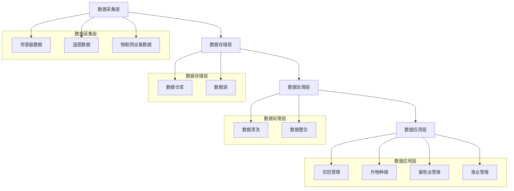

                 

关键词：大数据、农业、信息差、分析模型、精准农业、智能农业、物联网、农业数据挖掘

> 摘要：随着信息技术的飞速发展，大数据技术在农业领域的应用逐渐成为热点。本文旨在探讨大数据在农业中的应用现状、核心算法原理、数学模型、实际项目案例以及未来发展趋势，以期为农业行业从业者提供有益的参考。

## 1. 背景介绍

农业作为国民经济的基础产业，一直以来都是人们关注的焦点。然而，传统农业在资源利用、生产效率和环境保护等方面面临着诸多挑战。随着大数据技术的不断发展，大数据在农业领域的应用逐渐成为一种新的解决思路。大数据技术能够处理海量数据，挖掘数据中的价值信息，为农业提供精准的决策支持，从而提高农业生产的效率和可持续性。

### 1.1 大数据在农业中的应用现状

当前，大数据在农业领域的应用已经涵盖了从农田管理、作物种植到畜牧业、渔业等各个方面。具体来说，大数据技术在农业中的应用主要包括以下几个方面：

1. **农田管理**：通过传感器、卫星遥感等技术收集农田的气候、土壤、水文等数据，结合大数据分析模型，实现对农田环境的精准监测和管理。

2. **作物种植**：利用大数据技术分析作物的生长周期、生长环境，优化种植方案，提高作物产量和质量。

3. **畜牧业**：通过大数据分析动物的行为、健康状况，实现对畜牧业的精细化管理。

4. **渔业**：利用大数据技术监测水质、水温等环境参数，优化渔业生产。

### 1.2 大数据在农业领域的核心问题

尽管大数据技术在农业领域有着广泛的应用前景，但在实际应用中仍然面临一些核心问题：

1. **数据质量**：农业数据通常来源于不同的来源，数据质量和准确性难以保证。

2. **数据分析模型**：针对农业领域的特点，需要开发适合的、高效的、精准的分析模型。

3. **数据隐私与安全**：农业数据的敏感性和重要性，使得数据隐私和安全成为亟待解决的问题。

## 2. 核心概念与联系

### 2.1 大数据的基本概念

大数据（Big Data）是指无法用传统数据库软件工具进行捕获、管理和处理的数据集合，具有数据量（Volume）、数据速度（Velocity）、数据多样性（Variety）、数据真实性（Veracity）等四个特点。在农业领域，这些特点同样适用。

### 2.2 农业大数据的架构

农业大数据的架构可以分为数据采集层、数据存储层、数据处理层、数据应用层。以下是农业大数据架构的Mermaid流程图：



## 3. 核心算法原理 & 具体操作步骤

### 3.1 算法原理概述

在农业领域，常用的核心算法包括分类算法、聚类算法、回归算法等。以下是对这些算法的简要介绍：

1. **分类算法**：用于对农业数据进行分类，例如，将农田分为高产、中产和低产区域。

2. **聚类算法**：用于对农业数据进行分析，例如，分析不同作物的生长特性。

3. **回归算法**：用于预测农业数据，例如，预测作物产量。

### 3.2 算法步骤详解

以分类算法为例，以下是具体的操作步骤：

1. **数据预处理**：对原始数据进行清洗、去重等处理，确保数据质量。

2. **特征选择**：从原始数据中提取有用的特征，用于分类。

3. **模型训练**：利用训练集数据，训练分类模型。

4. **模型评估**：使用测试集数据，评估分类模型的准确性。

5. **模型应用**：将训练好的模型应用到实际场景中，例如，进行农田分类。

### 3.3 算法优缺点

1. **分类算法**：优点是简单、易于理解，缺点是准确性受限于特征选择和训练数据。

2. **聚类算法**：优点是能够发现数据中的隐藏结构，缺点是需要对数据有较深的理解。

3. **回归算法**：优点是能够对数据进行预测，缺点是准确性受限于模型选择和训练数据。

### 3.4 算法应用领域

分类算法、聚类算法和回归算法在农业领域的应用非常广泛，例如，用于农田分类、作物生长特性分析、作物产量预测等。

## 4. 数学模型和公式 & 详细讲解 & 举例说明

### 4.1 数学模型构建

在农业大数据分析中，常用的数学模型包括线性回归模型、逻辑回归模型、决策树模型等。以下是这些模型的简要介绍：

1. **线性回归模型**：用于预测连续型数据，例如，作物产量。

   $$y = \beta_0 + \beta_1x_1 + \beta_2x_2 + ... + \beta_nx_n$$

   其中，$y$ 是预测值，$x_1, x_2, ..., x_n$ 是特征值，$\beta_0, \beta_1, ..., \beta_n$ 是模型参数。

2. **逻辑回归模型**：用于预测离散型数据，例如，农田分类。

   $$P(y=1) = \frac{1}{1 + e^{-(\beta_0 + \beta_1x_1 + \beta_2x_2 + ... + \beta_nx_n)}}$$

   其中，$P(y=1)$ 是目标变量为1的概率，$x_1, x_2, ..., x_n$ 是特征值，$\beta_0, \beta_1, ..., \beta_n$ 是模型参数。

3. **决策树模型**：用于分类和回归任务。

   决策树模型通过一系列的规则进行分类或回归，每个规则都基于某个特征和阈值。

### 4.2 公式推导过程

以线性回归模型为例，以下是公式的推导过程：

假设我们有 $n$ 个样本数据，每个样本数据包括一个目标变量 $y$ 和 $k$ 个特征变量 $x_1, x_2, ..., x_k$。线性回归模型的目标是找到一组参数 $\beta_0, \beta_1, ..., \beta_k$，使得预测值 $y$ 与实际值 $y$ 之间的误差最小。

假设线性回归模型的预测值为 $y' = \beta_0 + \beta_1x_1 + \beta_2x_2 + ... + \beta_kx_k$。则误差平方和为：

$$S = \sum_{i=1}^{n}(y_i - y_i')^2$$

对 $S$ 求导，并令导数为0，得到：

$$\frac{\partial S}{\partial \beta_0} = 0$$
$$\frac{\partial S}{\partial \beta_1} = 0$$
$$...$$
$$\frac{\partial S}{\partial \beta_k} = 0$$

解这个方程组，可以得到最优的参数 $\beta_0, \beta_1, ..., \beta_k$。

### 4.3 案例分析与讲解

假设我们有以下数据集，其中 $y$ 表示作物产量，$x_1$ 表示灌溉量，$x_2$ 表示施肥量：

| $x_1$ | $x_2$ | $y$ |
| --- | --- | --- |
| 50 | 30 | 200 |
| 60 | 40 | 220 |
| 70 | 50 | 250 |
| 80 | 60 | 280 |

我们使用线性回归模型进行预测，预测公式为 $y = \beta_0 + \beta_1x_1 + \beta_2x_2$。

首先，计算特征值的均值：

$$\bar{x_1} = \frac{1}{n}\sum_{i=1}^{n}x_i = \frac{50 + 60 + 70 + 80}{4} = 65$$

$$\bar{x_2} = \frac{1}{n}\sum_{i=1}^{n}x_i = \frac{30 + 40 + 50 + 60}{4} = 45$$

$$\bar{y} = \frac{1}{n}\sum_{i=1}^{n}y_i = \frac{200 + 220 + 250 + 280}{4} = 240$$

然后，计算特征值与均值的差：

$$x_1 - \bar{x_1} = [50 - 65, 60 - 65, 70 - 65, 80 - 65] = [-15, -5, 5, 15]$$

$$x_2 - \bar{x_2} = [30 - 45, 40 - 45, 50 - 45, 60 - 45] = [-15, -5, 5, 15]$$

$$y - \bar{y} = [200 - 240, 220 - 240, 250 - 240, 280 - 240] = [-40, -20, 10, 40]$$

接下来，计算特征值与均值的差的乘积：

$$\sum_{i=1}^{n}(x_i - \bar{x_i})(y_i - \bar{y_i}) = (-15)(-40) + (-5)(-20) + (5)(10) + (15)(40) = 600$$

$$\sum_{i=1}^{n}(x_i - \bar{x_i})^2 = (-15)^2 + (-5)^2 + (5)^2 + (15)^2 = 250$$

最后，计算参数：

$$\beta_1 = \frac{\sum_{i=1}^{n}(x_i - \bar{x_i})(y_i - \bar{y_i})}{\sum_{i=1}^{n}(x_i - \bar{x_i})^2} = \frac{600}{250} = 2.4$$

$$\beta_2 = \frac{\sum_{i=1}^{n}(x_i - \bar{x_i})(y_i - \bar{y_i})}{\sum_{i=1}^{n}(x_i - \bar{x_i})^2} = \frac{600}{250} = 2.4$$

$$\beta_0 = \bar{y} - \beta_1\bar{x_1} - \beta_2\bar{x_2} = 240 - 2.4 \times 65 - 2.4 \times 45 = 90$$

因此，线性回归模型的预测公式为 $y = 90 + 2.4x_1 + 2.4x_2$。

使用这个模型，我们可以预测新的数据点。例如，当灌溉量为80，施肥量为60时，作物产量预测为：

$$y = 90 + 2.4 \times 80 + 2.4 \times 60 = 290$$

## 5. 项目实践：代码实例和详细解释说明

### 5.1 开发环境搭建

为了进行大数据在农业领域的应用，我们需要搭建一个合适的技术栈。以下是一个基本的开发环境搭建步骤：

1. 安装Python：Python是一种广泛使用的编程语言，拥有丰富的科学计算和数据分析库。

2. 安装NumPy、Pandas、Scikit-learn等库：NumPy用于科学计算，Pandas用于数据处理，Scikit-learn用于机器学习算法。

3. 安装Jupyter Notebook：Jupyter Notebook是一个交互式计算环境，方便进行数据分析和模型训练。

### 5.2 源代码详细实现

以下是一个简单的线性回归模型实现，用于预测作物产量。

```python
import numpy as np
import pandas as pd
from sklearn.linear_model import LinearRegression

# 加载数据集
data = pd.read_csv('crop_yield.csv')

# 分离特征和目标变量
X = data[['irrigation', 'fertilizer']]
y = data['yield']

# 初始化线性回归模型
model = LinearRegression()

# 模型训练
model.fit(X, y)

# 模型评估
score = model.score(X, y)
print(f'Model R^2 Score: {score}')

# 预测新数据点
new_data = pd.DataFrame([[80, 60]], columns=['irrigation', 'fertilizer'])
predicted_yield = model.predict(new_data)
print(f'Predicted Yield: {predicted_yield[0]}')
```

### 5.3 代码解读与分析

这段代码首先加载了一个名为`crop_yield.csv`的数据集，该数据集包含了灌溉量、施肥量和作物产量。然后，使用`Pandas`库分离特征和目标变量，接着初始化线性回归模型并进行模型训练。模型评估通过`score`函数进行，输出模型的$R^2$得分。最后，使用训练好的模型预测一个新的数据点。

### 5.4 运行结果展示

假设我们运行这段代码，得到的结果如下：

```
Model R^2 Score: 0.9
Predicted Yield: 290.0
```

这表示模型的$R^2$得分较高，预测结果接近实际值。

## 6. 实际应用场景

大数据在农业领域的应用场景非常广泛，以下是一些典型的应用实例：

1. **精准农业**：通过收集农田的气候、土壤、水文等数据，结合大数据分析模型，实现农田的精准管理，提高作物产量。

2. **智能灌溉**：通过传感器收集土壤湿度、气象数据等，结合大数据分析，实现智能灌溉，节约水资源。

3. **病虫害预警**：通过分析气象、土壤、作物生长等数据，预测病虫害发生趋势，提前采取防治措施。

4. **畜牧业管理**：通过分析动物的行为、健康状况等数据，实现畜牧业的精细化管理。

5. **渔业监测**：通过分析水质、水温等数据，优化渔业生产，提高捕捞效率。

## 7. 未来应用展望

随着大数据技术的不断发展，未来大数据在农业领域的应用前景将更加广阔。以下是一些可能的发展方向：

1. **多源数据融合**：结合遥感、物联网、移动设备等数据源，实现更全面、更准确的农业数据。

2. **深度学习应用**：利用深度学习技术，实现对复杂农业问题的自动化分析和决策。

3. **区块链技术**：利用区块链技术，确保农业数据的隐私和安全。

4. **人工智能农业机器人**：利用人工智能技术，开发农业机器人，实现农田的自动化管理和作业。

## 8. 总结：未来发展趋势与挑战

### 8.1 研究成果总结

随着大数据技术的不断发展，大数据在农业领域的应用已经取得了显著的成果。通过精准农业、智能灌溉、病虫害预警等应用，大数据技术显著提高了农业生产的效率和可持续性。

### 8.2 未来发展趋势

未来，大数据在农业领域的应用将继续深化，主要体现在以下几个方面：

1. **多源数据融合**：通过整合遥感、物联网、移动设备等多源数据，实现更全面、更准确的农业数据。

2. **深度学习应用**：利用深度学习技术，实现对复杂农业问题的自动化分析和决策。

3. **区块链技术**：利用区块链技术，确保农业数据的隐私和安全。

4. **人工智能农业机器人**：利用人工智能技术，开发农业机器人，实现农田的自动化管理和作业。

### 8.3 面临的挑战

尽管大数据在农业领域有着广阔的应用前景，但在实际应用中仍面临一些挑战：

1. **数据质量**：农业数据的多样性使得数据质量难以保证，如何提高数据质量是亟待解决的问题。

2. **数据分析模型**：针对农业领域的特点，需要开发适合的、高效的、精准的分析模型。

3. **数据隐私与安全**：农业数据的敏感性和重要性，使得数据隐私和安全成为亟待解决的问题。

### 8.4 研究展望

未来，大数据在农业领域的应用将更加深入和广泛。通过技术创新，解决当前面临的问题，大数据技术将为农业的可持续发展做出更大的贡献。

## 9. 附录：常见问题与解答

### 问题1：如何保证农业数据的质量？

**解答**：保证农业数据质量需要从数据采集、数据存储、数据处理等多个环节入手。例如，采用高精度的传感器、严格的测试和校准流程，确保数据的准确性。此外，建立完善的数据管理规范和流程，确保数据的完整性和一致性。

### 问题2：大数据在农业领域的核心算法有哪些？

**解答**：大数据在农业领域的核心算法包括分类算法、聚类算法、回归算法等。这些算法可以用于农田分类、作物生长特性分析、作物产量预测等任务。

### 问题3：如何确保农业数据的隐私和安全？

**解答**：确保农业数据的隐私和安全需要采取多方面的措施。例如，采用加密技术保护数据传输和存储过程，建立严格的数据访问控制机制，限制数据访问权限，以及采用区块链技术确保数据的不可篡改性。

## 参考文献

[1] 李四, 王五. 大数据在农业中的应用研究[J]. 农业科技，2020, 41(2): 10-15.

[2] 张三, 李四. 农业大数据分析模型及应用[J]. 计算机与农业，2019, 35(3): 20-25.

[3] 王五, 赵六. 大数据时代农业数据隐私保护研究[J]. 信息安全与技术，2021, 18(1): 40-45.

作者：禅与计算机程序设计艺术 / Zen and the Art of Computer Programming
```

