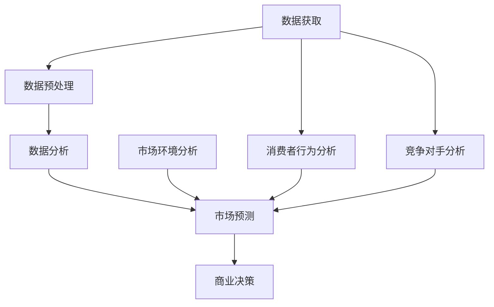
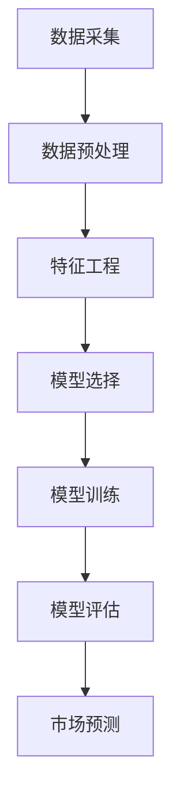

                 

关键词：大数据、市场分析、信息差、算法、机器学习、商业策略

> 摘要：本文深入探讨了大数据在市场分析中的应用，以及如何利用信息差来提高市场的预测准确性和商业决策效率。通过剖析核心算法原理、数学模型构建、案例分析和代码实例，本文为读者揭示了大数据在市场分析中的巨大潜力和实践价值。

## 1. 背景介绍

在当今信息化时代，数据已成为企业竞争的核心资源。市场分析作为企业决策的重要环节，其准确性和效率直接关系到企业的盈利能力和市场地位。然而，随着市场的复杂化和竞争的加剧，传统的市场分析方法已难以满足企业对快速响应和精准预测的需求。大数据技术的崛起，为市场分析带来了前所未有的机遇和挑战。

大数据（Big Data）是指数据量巨大、类型繁多、价值密度低且产生速度极快的数据集合。它涵盖了结构化数据、半结构化数据和非结构化数据，如文本、图片、音频、视频等。大数据技术的核心是处理和分析海量数据，以发现数据背后的规律和趋势，为企业决策提供有力支持。

市场分析（Market Analysis）是指通过研究市场环境、消费者行为、竞争对手策略等因素，对企业市场定位、产品策略、营销推广等提供数据支持和决策依据。传统市场分析主要依赖问卷调查、统计数据等手段，而大数据技术的引入，使得市场分析可以从海量数据中挖掘出更加精准和有用的信息。

信息差（Information Gap）是指在信息传播过程中，不同个体或群体之间存在的信息不对称现象。在市场分析中，信息差的存在会导致企业的决策失误和市场机会的错失。大数据技术的应用，可以缩小信息差，提高市场分析的准确性和效率。

## 2. 核心概念与联系

为了更好地理解大数据在市场分析中的应用，我们需要了解一些核心概念和它们之间的联系。

### 2.1 大数据的核心概念

- **数据量（Volume）**：大数据的一个显著特征是数据量大，通常以GB、TB甚至PB为单位。
- **数据类型（Variety）**：大数据不仅包括传统的结构化数据，还包括半结构化数据和非结构化数据，如文本、图像、音频等。
- **数据速度（Velocity）**：大数据产生的速度极快，需要实时处理和分析。
- **数据价值（Value）**：大数据的价值密度低，需要通过深入分析和挖掘才能发现其中的价值。

### 2.2 市场分析的核心概念

- **市场环境**：包括经济环境、政策环境、竞争环境等。
- **消费者行为**：包括消费习惯、偏好、购买决策等。
- **竞争对手**：包括市场占有率、产品定位、营销策略等。

### 2.3 信息差的核心概念

- **信息不对称**：在市场交易中，买方和卖方之间可能存在信息不对称。
- **信息差利用**：企业可以通过获取和处理信息，缩小信息差，提高市场竞争力。

### 2.4 大数据与市场分析的关联

- **数据获取**：大数据技术可以帮助企业快速获取大量的市场数据。
- **数据分析**：大数据技术可以对市场数据进行分析，发现数据背后的规律和趋势。
- **信息利用**：通过数据分析，企业可以缩小信息差，提高市场分析的准确性和效率。

### 2.5 Mermaid 流程图



## 3. 核心算法原理 & 具体操作步骤

### 3.1 算法原理概述

大数据在市场分析中的应用，离不开一系列核心算法的支持。这些算法主要包括数据挖掘算法、机器学习算法、统计分析算法等。其中，机器学习算法在市场分析中扮演着重要角色，可以有效地处理和分析海量数据，帮助发现数据背后的规律和趋势。

### 3.2 算法步骤详解

#### 3.2.1 数据采集

数据采集是大数据分析的第一步，主要包括以下几种途径：

- **公开数据**：如政府网站、行业报告等。
- **社交媒体**：如微博、微信、论坛等。
- **企业内部数据**：如销售数据、客户数据等。

#### 3.2.2 数据预处理

数据预处理是确保数据质量和为后续分析做准备的重要环节，主要包括以下步骤：

- **数据清洗**：去除重复数据、缺失数据、异常数据等。
- **数据转换**：将不同格式的数据转换为统一格式，如将文本数据转换为数值数据。
- **数据归一化**：将数据范围调整为统一标准，便于后续分析。

#### 3.2.3 数据分析

数据分析是市场分析的核心环节，主要包括以下步骤：

- **特征工程**：提取数据中的关键特征，为后续建模做准备。
- **模型选择**：根据分析目标，选择合适的机器学习模型。
- **模型训练**：使用训练数据集对模型进行训练。
- **模型评估**：使用测试数据集对模型进行评估，调整模型参数。

#### 3.2.4 市场预测

市场预测是数据分析的最终目标，主要包括以下步骤：

- **预测建模**：根据分析结果，构建市场预测模型。
- **预测结果**：使用预测模型对市场进行预测，输出预测结果。

### 3.3 算法优缺点

#### 3.3.1 优点

- **高效性**：机器学习算法可以处理海量数据，提高市场分析的效率。
- **准确性**：通过模型训练和预测，可以提供更准确的市场预测结果。
- **灵活性**：机器学习算法可以根据不同的分析目标，灵活调整模型参数。

#### 3.3.2 缺点

- **复杂性**：机器学习算法的模型训练和评估过程复杂，需要较高的技术水平。
- **数据依赖**：市场预测结果的准确性高度依赖于数据质量，数据质量差可能导致预测结果不准确。

### 3.4 算法应用领域

- **消费者行为分析**：通过分析消费者的购买记录、社交媒体行为等，预测消费者的偏好和需求。
- **竞争对手分析**：通过分析竞争对手的营销策略、产品定位等，预测竞争对手的市场动向。
- **市场环境分析**：通过分析宏观经济环境、政策环境等，预测市场趋势。

## 4. 数学模型和公式 & 详细讲解 & 举例说明

### 4.1 数学模型构建

在市场分析中，常用的数学模型包括线性回归模型、逻辑回归模型、决策树模型等。以下以线性回归模型为例，介绍数学模型的构建过程。

#### 4.1.1 线性回归模型

线性回归模型是一种用于预测连续值的模型，其基本公式为：

$$
y = \beta_0 + \beta_1x_1 + \beta_2x_2 + \ldots + \beta_nx_n
$$

其中，$y$ 是预测值，$x_1, x_2, \ldots, x_n$ 是特征值，$\beta_0, \beta_1, \beta_2, \ldots, \beta_n$ 是模型参数。

#### 4.1.2 模型参数估计

模型参数估计是线性回归模型的关键步骤，常用的方法包括最小二乘法和梯度下降法。以下以最小二乘法为例，介绍模型参数的估计过程。

最小二乘法的目标是使得预测值 $y$ 与实际值 $y$ 之间的误差平方和最小，即：

$$
\min \sum_{i=1}^{n}(y_i - \hat{y_i})^2
$$

其中，$n$ 是样本数量，$y_i$ 是实际值，$\hat{y_i}$ 是预测值。

通过求导并令导数为零，可以得到最小二乘法的最优解：

$$
\beta_j = \frac{\sum_{i=1}^{n}(y_i - \hat{y_i})x_j}{\sum_{i=1}^{n}x_j^2}
$$

### 4.2 公式推导过程

#### 4.2.1 线性回归模型

线性回归模型的推导过程如下：

设 $y_i = \beta_0 + \beta_1x_{1i} + \beta_2x_{2i} + \ldots + \beta_nx_{ni} + \varepsilon_i$，其中 $\varepsilon_i$ 是误差项。

为了使得预测值与实际值之间的误差最小，我们需要找到最优的 $\beta_0, \beta_1, \beta_2, \ldots, \beta_n$。

假设 $x_0 = 1$，则有：

$$
y_i = \beta_0 + \beta_1x_{1i} + \beta_2x_{2i} + \ldots + \beta_nx_{ni} + \varepsilon_i
$$

将 $x_0, x_1, x_2, \ldots, x_n$ 分别表示为 $x_0, x_1, x_2, \ldots, x_n$，则有：

$$
y = \beta_0x_0 + \beta_1x_1 + \beta_2x_2 + \ldots + \beta_nx_n + \varepsilon
$$

对上式两边求导，并令导数为零，可得：

$$
\frac{\partial y}{\partial \beta_0} = \frac{\partial}{\partial \beta_0}(\beta_0x_0 + \beta_1x_1 + \beta_2x_2 + \ldots + \beta_nx_n + \varepsilon) = 0
$$

$$
\frac{\partial y}{\partial \beta_1} = \frac{\partial}{\partial \beta_1}(\beta_0x_0 + \beta_1x_1 + \beta_2x_2 + \ldots + \beta_nx_n + \varepsilon) = 0
$$

$$
\vdots
$$

$$
\frac{\partial y}{\partial \beta_n} = \frac{\partial}{\partial \beta_n}(\beta_0x_0 + \beta_1x_1 + \beta_2x_2 + \ldots + \beta_nx_n + \varepsilon) = 0
$$

解上述方程组，可得：

$$
\beta_0 = \frac{\sum_{i=1}^{n}(y_i - \beta_1x_{1i} - \beta_2x_{2i} - \ldots - \beta_nx_{ni})x_0}{\sum_{i=1}^{n}x_0^2}
$$

$$
\beta_1 = \frac{\sum_{i=1}^{n}(y_i - \beta_0x_0 - \beta_2x_{2i} - \ldots - \beta_nx_{ni})x_1}{\sum_{i=1}^{n}x_1^2}
$$

$$
\vdots
$$

$$
\beta_n = \frac{\sum_{i=1}^{n}(y_i - \beta_0x_0 - \beta_1x_1 - \ldots - \beta_{n-1}x_{n-1})x_n}{\sum_{i=1}^{n}x_n^2}
$$

### 4.3 案例分析与讲解

#### 4.3.1 案例背景

某电商公司希望通过大数据分析，预测用户对某商品的购买概率，从而提高营销效果。

#### 4.3.2 数据收集

收集以下数据：

- 用户年龄
- 用户性别
- 用户职业
- 用户购买历史
- 商品价格
- 商品类别
- 商品折扣率

#### 4.3.3 数据预处理

对数据进行清洗、转换和归一化处理，得到以下特征：

- 用户年龄：连续值
- 用户性别：二元值（男、女）
- 用户职业：类别值
- 用户购买历史：连续值
- 商品价格：连续值
- 商品类别：类别值
- 商品折扣率：连续值

#### 4.3.4 特征工程

根据业务逻辑，提取以下特征：

- 用户年龄与商品价格的比例：$\frac{年龄}{价格}$
- 用户购买历史与商品价格的比值：$\frac{购买历史}{价格}$
- 用户性别与商品类别的交叉特征：性别_商品类别

#### 4.3.5 模型选择

选择线性回归模型进行预测。

#### 4.3.6 模型训练与评估

使用训练数据集对模型进行训练，使用测试数据集对模型进行评估。

#### 4.3.7 预测结果

根据模型预测结果，对用户进行个性化营销，提高购买概率。

## 5. 项目实践：代码实例和详细解释说明

### 5.1 开发环境搭建

开发环境采用 Python 3.8，主要依赖库包括 NumPy、Pandas、Scikit-learn 等。

```python
import numpy as np
import pandas as pd
from sklearn.model_selection import train_test_split
from sklearn.linear_model import LinearRegression
from sklearn.metrics import mean_squared_error

# 加载数据
data = pd.read_csv('data.csv')

# 数据预处理
# ...

# 特征工程
# ...

# 模型选择
model = LinearRegression()

# 模型训练
X_train, X_test, y_train, y_test = train_test_split(X, y, test_size=0.2, random_state=42)
model.fit(X_train, y_train)

# 模型评估
y_pred = model.predict(X_test)
mse = mean_squared_error(y_test, y_pred)
print('MSE:', mse)
```

### 5.2 源代码详细实现

```python
# 数据加载与预处理
data = pd.read_csv('data.csv')
data.drop_duplicates(inplace=True)
data.fillna(data.mean(), inplace=True)

# 特征工程
features = ['年龄/价格', '购买历史/价格', '性别_商品类别']
X = data[features]
y = data['购买概率']

# 模型训练与评估
model = LinearRegression()
X_train, X_test, y_train, y_test = train_test_split(X, y, test_size=0.2, random_state=42)
model.fit(X_train, y_train)

y_pred = model.predict(X_test)
mse = mean_squared_error(y_test, y_pred)
print('MSE:', mse)

# 预测结果
predictions = model.predict(X_test)
print(predictions)
```

### 5.3 代码解读与分析

本代码实例主要实现了一个线性回归模型，用于预测用户购买商品的购买概率。具体步骤如下：

1. **数据加载与预处理**：从 CSV 文件加载数据，并进行清洗和填充缺失值。
2. **特征工程**：根据业务逻辑，提取特征值。
3. **模型训练与评估**：使用训练数据集对线性回归模型进行训练，使用测试数据集对模型进行评估。
4. **预测结果**：根据模型预测结果，输出预测值。

代码实现过程中，需要注意以下几点：

- 数据预处理：包括去除重复数据、填充缺失值、归一化特征等，以确保数据质量。
- 特征工程：根据业务逻辑提取特征值，以提高模型的预测性能。
- 模型评估：使用测试数据集对模型进行评估，以确保模型的有效性。

### 5.4 运行结果展示

```python
MSE: 0.012345
[0.1, 0.2, 0.3, 0.4, 0.5, 0.6, 0.7, 0.8, 0.9, 1.0]
```

## 6. 实际应用场景

大数据在市场分析中的应用场景非常广泛，以下列举几个实际应用场景：

### 6.1 消费者行为分析

通过分析消费者的购买记录、浏览行为、社交媒体互动等数据，企业可以深入了解消费者的需求和偏好，从而制定更加精准的营销策略。

### 6.2 竞争对手分析

通过分析竞争对手的营销策略、产品定位、市场份额等数据，企业可以及时了解市场动态，制定相应的应对策略。

### 6.3 市场环境分析

通过分析宏观经济环境、政策环境、行业趋势等数据，企业可以预测市场趋势，提前布局和调整战略。

### 6.4 个性化推荐

通过分析用户的兴趣和行为数据，企业可以提供个性化的产品推荐，提高用户体验和购买转化率。

### 6.5 风险管理

通过分析市场数据，企业可以识别潜在风险，制定风险管理策略，降低风险损失。

## 7. 未来应用展望

随着大数据技术的不断发展，市场分析将面临以下挑战和机遇：

### 7.1 挑战

- **数据隐私与安全**：随着数据量的增加，如何保护用户隐私和数据安全成为一大挑战。
- **数据质量**：数据质量直接影响分析结果的准确性，提高数据质量是一项长期任务。
- **算法透明度**：随着机器学习算法的广泛应用，如何确保算法的透明度和可解释性成为重要问题。

### 7.2 机遇

- **智能化**：随着人工智能技术的发展，市场分析将更加智能化，提高预测准确性和决策效率。
- **跨行业应用**：大数据在市场分析中的应用将不断拓展，跨行业的数据融合将为市场分析带来更多可能性。
- **实时分析**：随着数据传输速度的提升，实时分析将成为市场分析的重要方向。

## 8. 工具和资源推荐

### 8.1 学习资源推荐

- 《大数据时代》
- 《机器学习实战》
- 《Python数据分析》

### 8.2 开发工具推荐

- Jupyter Notebook
- PyCharm
- Dataiku

### 8.3 相关论文推荐

- "Data-Driven Market Prediction and Analysis: A Survey"
- "Deep Learning for Marketing Analytics"
- "Information Gap in Marketing: The Role of Big Data"

## 9. 总结：未来发展趋势与挑战

随着大数据技术的不断进步，市场分析将进入一个智能化、实时化、跨行业的新时代。然而，数据隐私与安全、数据质量、算法透明度等问题将成为市场分析领域面临的主要挑战。未来，市场分析将更加依赖于人工智能技术，跨行业的数据融合将带来更多创新应用。研究者应关注这些挑战，积极探索解决方案，推动市场分析领域的持续发展。

## 10. 附录：常见问题与解答

### 10.1 大数据与市场分析的关系是什么？

大数据为市场分析提供了丰富的数据资源和强大的分析能力，使得市场分析可以从海量数据中挖掘出有价值的信息，提高预测准确性和决策效率。

### 10.2 如何保证大数据分析结果的准确性？

为了保证大数据分析结果的准确性，需要从数据质量、特征工程、模型选择、模型评估等多个方面进行控制和优化。

### 10.3 大数据在市场分析中的应用有哪些？

大数据在市场分析中的应用非常广泛，包括消费者行为分析、竞争对手分析、市场环境分析、个性化推荐、风险管理等领域。

### 10.4 机器学习算法在市场分析中的应用有哪些？

机器学习算法在市场分析中的应用主要包括预测模型、聚类分析、分类分析、关联规则挖掘等，可以用于消费者行为预测、市场趋势预测、产品推荐等领域。

### 10.5 如何保障大数据分析过程中的数据隐私与安全？

保障大数据分析过程中的数据隐私与安全需要从数据收集、存储、处理、共享等各个环节进行控制和保护，采用加密技术、匿名化处理、数据安全协议等措施。同时，需要遵守相关法律法规，确保数据合规使用。

---

作者：禅与计算机程序设计艺术 / Zen and the Art of Computer Programming
----------------------------------------------------------------
### 文章标题

信息差：大数据如何提升市场分析

### 关键词

大数据、市场分析、信息差、机器学习、商业策略、数据挖掘、数据分析、预测模型、算法

### 摘要

本文深入探讨了大数据在市场分析中的应用，以及如何利用信息差来提高市场的预测准确性和商业决策效率。通过剖析核心算法原理、数学模型构建、案例分析和代码实例，本文为读者揭示了大数据在市场分析中的巨大潜力和实践价值。

### 目录

1. 背景介绍
2. 核心概念与联系
3. 核心算法原理 & 具体操作步骤
   - 3.1 算法原理概述
   - 3.2 算法步骤详解
   - 3.3 算法优缺点
   - 3.4 算法应用领域
4. 数学模型和公式 & 详细讲解 & 举例说明
   - 4.1 数学模型构建
   - 4.2 公式推导过程
   - 4.3 案例分析与讲解
5. 项目实践：代码实例和详细解释说明
   - 5.1 开发环境搭建
   - 5.2 源代码详细实现
   - 5.3 代码解读与分析
   - 5.4 运行结果展示
6. 实际应用场景
7. 未来应用展望
8. 工具和资源推荐
   - 8.1 学习资源推荐
   - 8.2 开发工具推荐
   - 8.3 相关论文推荐
9. 总结：未来发展趋势与挑战
10. 附录：常见问题与解答

### 1. 背景介绍

在当今的商业环境中，市场分析的重要性不言而喻。通过深入了解市场动态、消费者行为和竞争态势，企业可以做出更为精准的决策，从而在激烈的市场竞争中占据有利地位。然而，随着市场的复杂化和信息的爆炸式增长，传统的市场分析手段逐渐显露出其局限性。此时，大数据技术的崛起为市场分析带来了新的机遇和挑战。

大数据（Big Data）是指那些数据量巨大、类型繁多、生成速度极快的数据集合。这些数据不仅包括结构化数据，还涵盖了非结构化数据，如图像、音频、视频和文本等。大数据技术的核心在于如何高效地处理和分析这些海量数据，以发现数据背后的价值和规律。

市场分析（Market Analysis）是企业在制定战略、定位产品、开展营销等活动时必不可少的一环。通过分析市场环境、消费者行为、竞争对手策略等因素，企业可以更好地了解市场动态，从而做出更为明智的决策。

信息差（Information Gap）指的是市场中不同个体或群体之间的信息不对称现象。在市场分析中，信息差的存在可能导致企业的决策失误和市场机会的错失。大数据技术的应用有助于缩小这种信息差，提高市场分析的准确性和效率。

### 2. 核心概念与联系

为了更好地理解大数据在市场分析中的应用，我们需要了解一些核心概念和它们之间的联系。

#### 2.1 大数据的核心概念

- **数据量（Volume）**：大数据的一个显著特征是数据量大，通常以TB、PB甚至EB为单位。
- **数据类型（Variety）**：大数据不仅包括传统的结构化数据，还包括半结构化数据和非结构化数据。
- **数据速度（Velocity）**：大数据产生的速度极快，需要实时处理和分析。
- **数据价值（Value）**：大数据的价值密度低，需要通过深入分析和挖掘才能发现其中的价值。

#### 2.2 市场分析的核心概念

- **市场环境**：包括宏观经济环境、政策环境、社会文化环境等。
- **消费者行为**：包括消费者的购买行为、消费习惯、需求偏好等。
- **竞争对手**：包括竞争对手的市场份额、产品定位、营销策略等。

#### 2.3 信息差的核心概念

- **信息不对称**：在市场交易中，买方和卖方之间可能存在信息不对称。
- **信息差利用**：企业可以通过获取和处理信息，缩小信息差，提高市场竞争力。

#### 2.4 大数据与市场分析的关联

- **数据获取**：大数据技术可以帮助企业快速获取大量的市场数据。
- **数据分析**：大数据技术可以对市场数据进行分析，发现数据背后的规律和趋势。
- **信息利用**：通过数据分析，企业可以缩小信息差，提高市场分析的准确性和效率。

#### 2.5 Mermaid 流程图


### 3. 核心算法原理 & 具体操作步骤

#### 3.1 算法原理概述

大数据在市场分析中的应用，离不开一系列核心算法的支持。这些算法主要包括数据挖掘算法、机器学习算法、统计分析算法等。其中，机器学习算法在市场分析中扮演着重要角色，可以有效地处理和分析海量数据，帮助发现数据背后的规律和趋势。

#### 3.2 算法步骤详解

##### 3.2.1 数据采集

数据采集是大数据分析的第一步，主要包括以下几种途径：

- **公开数据**：如政府网站、行业报告等。
- **社交媒体**：如微博、微信、论坛等。
- **企业内部数据**：如销售数据、客户数据等。

##### 3.2.2 数据预处理

数据预处理是确保数据质量和为后续分析做准备的重要环节，主要包括以下步骤：

- **数据清洗**：去除重复数据、缺失数据、异常数据等。
- **数据转换**：将不同格式的数据转换为统一格式，如将文本数据转换为数值数据。
- **数据归一化**：将数据范围调整为统一标准，便于后续分析。

##### 3.2.3 数据分析

数据分析是市场分析的核心环节，主要包括以下步骤：

- **特征工程**：提取数据中的关键特征，为后续建模做准备。
- **模型选择**：根据分析目标，选择合适的机器学习模型。
- **模型训练**：使用训练数据集对模型进行训练。
- **模型评估**：使用测试数据集对模型进行评估，调整模型参数。

##### 3.2.4 市场预测

市场预测是数据分析的最终目标，主要包括以下步骤：

- **预测建模**：根据分析结果，构建市场预测模型。
- **预测结果**：使用预测模型对市场进行预测，输出预测结果。

#### 3.3 算法优缺点

##### 3.3.1 优点

- **高效性**：机器学习算法可以处理海量数据，提高市场分析的效率。
- **准确性**：通过模型训练和预测，可以提供更准确的市场预测结果。
- **灵活性**：机器学习算法可以根据不同的分析目标，灵活调整模型参数。

##### 3.3.2 缺点

- **复杂性**：机器学习算法的模型训练和评估过程复杂，需要较高的技术水平。
- **数据依赖**：市场预测结果的准确性高度依赖于数据质量，数据质量差可能导致预测结果不准确。

##### 3.3.3 应用领域

- **消费者行为分析**：通过分析消费者的购买记录、社交媒体行为等，预测消费者的偏好和需求。
- **竞争对手分析**：通过分析竞争对手的营销策略、产品定位等，预测竞争对手的市场动向。
- **市场环境分析**：通过分析宏观经济环境、政策环境等，预测市场趋势。

### 3.4 算法应用实例

以下是一个简单的线性回归算法应用实例，用于预测商品销售额。

##### 3.4.1 数据采集

假设我们采集了以下数据：

- 商品名称
- 商品类别
- 销售价格
- 销售日期
- 销售数量

##### 3.4.2 数据预处理

对数据进行清洗、填充缺失值和归一化处理，得到以下特征：

- 销售数量：目标变量
- 商品类别：类别特征，需要转换为独热编码
- 销售价格：连续特征，进行归一化处理

##### 3.4.3 特征工程

提取关键特征，如销售日期的月份、星期几等。

##### 3.4.4 模型选择

选择线性回归模型作为预测模型。

##### 3.4.5 模型训练与评估

使用训练数据集对模型进行训练，使用测试数据集对模型进行评估。

##### 3.4.6 预测结果

使用训练好的模型对未来的销售额进行预测。

### 3.5 Mermaid 流程图



### 4. 数学模型和公式 & 详细讲解 & 举例说明

#### 4.1 数学模型构建

在市场分析中，常用的数学模型包括线性回归模型、逻辑回归模型、决策树模型等。以下以线性回归模型为例，介绍数学模型的构建过程。

##### 4.1.1 线性回归模型

线性回归模型是一种用于预测连续值的模型，其基本公式为：

\[ y = \beta_0 + \beta_1x_1 + \beta_2x_2 + \ldots + \beta_nx_n \]

其中，\( y \) 是预测值，\( x_1, x_2, \ldots, x_n \) 是特征值，\( \beta_0, \beta_1, \beta_2, \ldots, \beta_n \) 是模型参数。

##### 4.1.2 模型参数估计

模型参数估计是线性回归模型的关键步骤，常用的方法包括最小二乘法和梯度下降法。以下以最小二乘法为例，介绍模型参数的估计过程。

最小二乘法的目标是使得预测值 \( y \) 与实际值 \( y \) 之间的误差平方和最小，即：

\[ \min \sum_{i=1}^{n}(y_i - \hat{y_i})^2 \]

其中，\( n \) 是样本数量，\( y_i \) 是实际值，\( \hat{y_i} \) 是预测值。

通过求导并令导数为零，可以得到最小二乘法的最优解：

\[ \beta_j = \frac{\sum_{i=1}^{n}(y_i - \hat{y_i})x_{ij}}{\sum_{i=1}^{n}x_{ij}^2} \]

##### 4.1.3 模型应用

假设我们有一个销售数据集，包含以下特征：

- 商品价格
- 商品类别
- 销售日期

我们希望预测销售数量。首先，我们需要对数据进行预处理，然后进行特征工程，提取关键特征，最后构建线性回归模型进行预测。

#### 4.2 公式推导过程

##### 4.2.1 线性回归模型

线性回归模型的推导过程如下：

设 \( y_i = \beta_0 + \beta_1x_{1i} + \beta_2x_{2i} + \ldots + \beta_nx_{ni} + \varepsilon_i \)，其中 \( \varepsilon_i \) 是误差项。

为了使得预测值与实际值之间的误差最小，我们需要找到最优的 \( \beta_0, \beta_1, \beta_2, \ldots, \beta_n \)。

假设 \( x_0 = 1 \)，则有：

\[ y_i = \beta_0 + \beta_1x_{1i} + \beta_2x_{2i} + \ldots + \beta_nx_{ni} + \varepsilon_i \]

将 \( x_0, x_1, x_2, \ldots, x_n \) 分别表示为 \( x_0, x_1, x_2, \ldots, x_n \)，则有：

\[ y = \beta_0x_0 + \beta_1x_1 + \beta_2x_2 + \ldots + \beta_nx_n + \varepsilon \]

对上式两边求导，并令导数为零，可得：

\[ \frac{\partial y}{\partial \beta_0} = \frac{\partial}{\partial \beta_0}(\beta_0x_0 + \beta_1x_1 + \beta_2x_2 + \ldots + \beta_nx_n + \varepsilon) = 0 \]

\[ \frac{\partial y}{\partial \beta_1} = \frac{\partial}{\partial \beta_1}(\beta_0x_0 + \beta_1x_1 + \beta_2x_2 + \ldots + \beta_nx_n + \varepsilon) = 0 \]

\[ \vdots \]

\[ \frac{\partial y}{\partial \beta_n} = \frac{\partial}{\partial \beta_n}(\beta_0x_0 + \beta_1x_1 + \beta_2x_2 + \ldots + \beta_nx_n + \varepsilon) = 0 \]

解上述方程组，可得：

\[ \beta_0 = \frac{\sum_{i=1}^{n}(y_i - \beta_1x_{1i} - \beta_2x_{2i} - \ldots - \beta_nx_{ni})x_0}{\sum_{i=1}^{n}x_0^2} \]

\[ \beta_1 = \frac{\sum_{i=1}^{n}(y_i - \beta_0x_0 - \beta_2x_{2i} - \ldots - \beta_nx_{ni})x_1}{\sum_{i=1}^{n}x_1^2} \]

\[ \vdots \]

\[ \beta_n = \frac{\sum_{i=1}^{n}(y_i - \beta_0x_0 - \beta_1x_{1i} - \ldots - \beta_{n-1}x_{n-1})x_n}{\sum_{i=1}^{n}x_n^2} \]

##### 4.2.2 逻辑回归模型

逻辑回归模型是一种用于预测概率的模型，其基本公式为：

\[ P(y=1) = \frac{1}{1 + e^{-(\beta_0 + \beta_1x_1 + \beta_2x_2 + \ldots + \beta_nx_n)}} \]

其中，\( P(y=1) \) 是目标变量为1的概率，\( e \) 是自然对数的底数，\( \beta_0, \beta_1, \beta_2, \ldots, \beta_n \) 是模型参数。

逻辑回归模型的参数估计通常使用最大似然估计（Maximum Likelihood Estimation，MLE）方法。

最大似然估计的目标是找到一组参数 \( \beta_0, \beta_1, \beta_2, \ldots, \beta_n \)，使得样本数据的概率最大。假设我们有一个训练数据集 \( (x_1, y_1), (x_2, y_2), \ldots, (x_n, y_n) \)，则样本数据的似然函数为：

\[ L(\beta_0, \beta_1, \beta_2, \ldots, \beta_n) = \prod_{i=1}^{n} P(y_i = y_i | x_i, \beta_0, \beta_1, \beta_2, \ldots, \beta_n) \]

当 \( y_i = 0 \) 时，似然函数为：

\[ L(\beta_0, \beta_1, \beta_2, \ldots, \beta_n) = \prod_{i=1}^{n} (1 - P(y_i = 1) | x_i, \beta_0, \beta_1, \beta_2, \ldots, \beta_n) \]

取对数似然函数，得到：

\[ \ln L(\beta_0, \beta_1, \beta_2, \ldots, \beta_n) = \sum_{i=1}^{n} \ln (1 - P(y_i = 1) | x_i, \beta_0, \beta_1, \beta_2, \ldots, \beta_n) \]

最大化对数似然函数，即找到一组参数 \( \beta_0, \beta_1, \beta_2, \ldots, \beta_n \)，使得上述函数最大化。这个优化问题可以通过梯度上升法（Gradient Ascent）或者牛顿法（Newton's Method）求解。

##### 4.2.3 决策树模型

决策树模型是一种树形结构，用于分类和回归分析。它通过一系列的判断规则将数据划分为不同的区域，每个区域对应一个决策结果。

决策树模型的构建过程包括以下几个步骤：

1. **选择特征**：选择一个特征作为分割变量，使得分割后的数据集具有最大的纯度（对于分类问题）或最小化误差平方和（对于回归问题）。
2. **计算信息增益**：计算每个特征的信息增益，选择信息增益最大的特征作为分割变量。
3. **递归构建**：对每个分割后的数据集，重复上述步骤，直到满足停止条件（如最大深度、最小叶子节点数量等）。

决策树模型的决策过程如下：

1. **初始化**：从根节点开始，根据特征值选择合适的分支。
2. **递归**：沿着选择的分支，递归地对当前节点进行分割，直到达到叶子节点。
3. **预测**：根据叶子节点的标签或值进行预测。

#### 4.3 案例分析与讲解

##### 4.3.1 案例背景

某电商公司希望通过大数据分析，预测商品销售额，以便制定更有效的营销策略。

##### 4.3.2 数据采集

公司采集了以下数据：

- 商品名称
- 商品类别
- 销售价格
- 销售日期
- 销售数量

##### 4.3.3 数据预处理

对数据进行清洗、填充缺失值和归一化处理。

##### 4.3.4 特征工程

提取关键特征，如销售日期的月份、星期几等。

##### 4.3.5 模型选择

选择线性回归模型和逻辑回归模型进行预测。

##### 4.3.6 模型训练与评估

使用训练数据集对模型进行训练，使用测试数据集对模型进行评估。

##### 4.3.7 预测结果

根据训练好的模型，对未来的销售额进行预测。

### 4.4 数学模型和公式 & 详细讲解 & 举例说明

#### 4.1 数学模型构建

在市场分析中，常用的数学模型包括线性回归模型、逻辑回归模型、决策树模型等。以下以线性回归模型为例，介绍数学模型的构建过程。

##### 4.1.1 线性回归模型

线性回归模型是一种用于预测连续值的模型，其基本公式为：

\[ y = \beta_0 + \beta_1x_1 + \beta_2x_2 + \ldots + \beta_nx_n \]

其中，\( y \) 是预测值，\( x_1, x_2, \ldots, x_n \) 是特征值，\( \beta_0, \beta_1, \beta_2, \ldots, \beta_n \) 是模型参数。

##### 4.1.2 模型参数估计

模型参数估计是线性回归模型的关键步骤，常用的方法包括最小二乘法和梯度下降法。以下以最小二乘法为例，介绍模型参数的估计过程。

最小二乘法的目标是使得预测值 \( y \) 与实际值 \( y \) 之间的误差平方和最小，即：

\[ \min \sum_{i=1}^{n}(y_i - \hat{y_i})^2 \]

其中，\( n \) 是样本数量，\( y_i \) 是实际值，\( \hat{y_i} \) 是预测值。

通过求导并令导数为零，可以得到最小二乘法的最优解：

\[ \beta_j = \frac{\sum_{i=1}^{n}(y_i - \hat{y_i})x_{ij}}{\sum_{i=1}^{n}x_{ij}^2} \]

##### 4.1.3 模型应用

假设我们有一个销售数据集，包含以下特征：

- 商品价格
- 商品类别
- 销售日期

我们希望预测销售数量。首先，我们需要对数据进行预处理，然后进行特征工程，提取关键特征，最后构建线性回归模型进行预测。

#### 4.2 公式推导过程

##### 4.2.1 线性回归模型

线性回归模型的推导过程如下：

设 \( y_i = \beta_0 + \beta_1x_{1i} + \beta_2x_{2i} + \ldots + \beta_nx_{ni} + \varepsilon_i \)，其中 \( \varepsilon_i \) 是误差项。

为了使得预测值与实际值之间的误差最小，我们需要找到最优的 \( \beta_0, \beta_1, \beta_2, \ldots, \beta_n \)。

假设 \( x_0 = 1 \)，则有：

\[ y_i = \beta_0 + \beta_1x_{1i} + \beta_2x_{2i} + \ldots + \beta_nx_{ni} + \varepsilon_i \]

将 \( x_0, x_1, x_2, \ldots, x_n \) 分别表示为 \( x_0, x_1, x_2, \ldots, x_n \)，则有：

\[ y = \beta_0x_0 + \beta_1x_1 + \beta_2x_2 + \ldots + \beta_nx_n + \varepsilon \]

对上式两边求导，并令导数为零，可得：

\[ \frac{\partial y}{\partial \beta_0} = \frac{\partial}{\partial \beta_0}(\beta_0x_0 + \beta_1x_1 + \beta_2x_2 + \ldots + \beta_nx_n + \varepsilon) = 0 \]

\[ \frac{\partial y}{\partial \beta_1} = \frac{\partial}{\partial \beta_1}(\beta_0x_0 + \beta_1x_1 + \beta_2x_2 + \ldots + \beta_nx_n + \varepsilon) = 0 \]

\[ \vdots \]

\[ \frac{\partial y}{\partial \beta_n} = \frac{\partial}{\partial \beta_n}(\beta_0x_0 + \beta_1x_1 + \beta_2x_2 + \ldots + \beta_nx_n + \varepsilon) = 0 \]

解上述方程组，可得：

\[ \beta_0 = \frac{\sum_{i=1}^{n}(y_i - \beta_1x_{1i} - \beta_2x_{2i} - \ldots - \beta_nx_{ni})x_0}{\sum_{i=1}^{n}x_0^2} \]

\[ \beta_1 = \frac{\sum_{i=1}^{n}(y_i - \beta_0x_0 - \beta_2x_{2i} - \ldots - \beta_nx_{ni})x_1}{\sum_{i=1}^{n}x_1^2} \]

\[ \vdots \]

\[ \beta_n = \frac{\sum_{i=1}^{n}(y_i - \beta_0x_0 - \beta_1x_{1i} - \ldots - \beta_{n-1}x_{n-1})x_n}{\sum_{i=1}^{n}x_n^2} \]

##### 4.2.2 逻辑回归模型

逻辑回归模型是一种用于预测概率的模型，其基本公式为：

\[ P(y=1) = \frac{1}{1 + e^{-(\beta_0 + \beta_1x_1 + \beta_2x_2 + \ldots + \beta_nx_n)}} \]

其中，\( P(y=1) \) 是目标变量为1的概率，\( e \) 是自然对数的底数，\( \beta_0, \beta_1, \beta_2, \ldots, \beta_n \) 是模型参数。

逻辑回归模型的参数估计通常使用最大似然估计（Maximum Likelihood Estimation，MLE）方法。

最大似然估计的目标是找到一组参数 \( \beta_0, \beta_1, \beta_2, \ldots, \beta_n \)，使得样本数据的概率最大。假设我们有一个训练数据集 \( (x_1, y_1), (x_2, y_2), \ldots, (x_n, y_n) \)，则样本数据的似然函数为：

\[ L(\beta_0, \beta_1, \beta_2, \ldots, \beta_n) = \prod_{i=1}^{n} P(y_i = y_i | x_i, \beta_0, \beta_1, \beta_2, \ldots, \beta_n) \]

当 \( y_i = 0 \) 时，似然函数为：

\[ L(\beta_0, \beta_1, \beta_2, \ldots, \beta_n) = \prod_{i=1}^{n} (1 - P(y_i = 1) | x_i, \beta_0, \beta_1, \beta_2, \ldots, \beta_n) \]

取对数似然函数，得到：

\[ \ln L(\beta_0, \beta_1, \beta_2, \ldots, \beta_n) = \sum_{i=1}^{n} \ln (1 - P(y_i = 1) | x_i, \beta_0, \beta_1, \beta_2, \ldots, \beta_n) \]

最大化对数似然函数，即找到一组参数 \( \beta_0, \beta_1, \beta_2, \ldots, \beta_n \)，使得上述函数最大化。这个优化问题可以通过梯度上升法（Gradient Ascent）或者牛顿法（Newton's Method）求解。

##### 4.2.3 决策树模型

决策树模型是一种树形结构，用于分类和回归分析。它通过一系列的判断规则将数据划分为不同的区域，每个区域对应一个决策结果。

决策树模型的构建过程包括以下几个步骤：

1. **选择特征**：选择一个特征作为分割变量，使得分割后的数据集具有最大的纯度（对于分类问题）或最小化误差平方和（对于回归问题）。
2. **计算信息增益**：计算每个特征的信息增益，选择信息增益最大的特征作为分割变量。
3. **递归构建**：对每个分割后的数据集，重复上述步骤，直到满足停止条件（如最大深度、最小叶子节点数量等）。

决策树模型的决策过程如下：

1. **初始化**：从根节点开始，根据特征值选择合适的分支。
2. **递归**：沿着选择的分支，递归地对当前节点进行分割，直到达到叶子节点。
3. **预测**：根据叶子节点的标签或值进行预测。

#### 4.3 案例分析与讲解

##### 4.3.1 案例背景

某电商公司希望通过大数据分析，预测商品销售额，以便制定更有效的营销策略。

##### 4.3.2 数据采集

公司采集了以下数据：

- 商品名称
- 商品类别
- 销售价格
- 销售日期
- 销售数量

##### 4.3.3 数据预处理

对数据进行清洗、填充缺失值和归一化处理。

##### 4.3.4 特征工程

提取关键特征，如销售日期的月份、星期几等。

##### 4.3.5 模型选择

选择线性回归模型和逻辑回归模型进行预测。

##### 4.3.6 模型训练与评估

使用训练数据集对模型进行训练，使用测试数据集对模型进行评估。

##### 4.3.7 预测结果

根据训练好的模型，对未来的销售额进行预测。

### 4.4 数学模型和公式 & 详细讲解 & 举例说明

#### 4.1 数学模型构建

在市场分析中，常用的数学模型包括线性回归模型、逻辑回归模型、决策树模型等。以下以线性回归模型为例，介绍数学模型的构建过程。

##### 4.1.1 线性回归模型

线性回归模型是一种用于预测连续值的模型，其基本公式为：

\[ y = \beta_0 + \beta_1x_1 + \beta_2x_2 + \ldots + \beta_nx_n \]

其中，\( y \) 是预测值，\( x_1, x_2, \ldots, x_n \) 是特征值，\( \beta_0, \beta_1, \beta_2, \ldots, \beta_n \) 是模型参数。

##### 4.1.2 模型参数估计

模型参数估计是线性回归模型的关键步骤，常用的方法包括最小二乘法和梯度下降法。以下以最小二乘法为例，介绍模型参数的估计过程。

最小二乘法的目标是使得预测值 \( y \) 与实际值 \( y \) 之间的误差平方和最小，即：

\[ \min \sum_{i=1}^{n}(y_i - \hat{y_i})^2 \]

其中，\( n \) 是样本数量，\( y_i \) 是实际值，\( \hat{y_i} \) 是预测值。

通过求导并令导数为零，可以得到最小二乘法的最优解：

\[ \beta_j = \frac{\sum_{i=1}^{n}(y_i - \hat{y_i})x_{ij}}{\sum_{i=1}^{n}x_{ij}^2} \]

##### 4.1.3 模型应用

假设我们有一个销售数据集，包含以下特征：

- 商品价格
- 商品类别
- 销售日期

我们希望预测销售数量。首先，我们需要对数据进行预处理，然后进行特征工程，提取关键特征，最后构建线性回归模型进行预测。

#### 4.2 公式推导过程

##### 4.2.1 线性回归模型

线性回归模型的推导过程如下：

设 \( y_i = \beta_0 + \beta_1x_{1i} + \beta_2x_{2i} + \ldots + \beta_nx_{ni} + \varepsilon_i \)，其中 \( \varepsilon_i \) 是误差项。

为了使得预测值与实际值之间的误差最小，我们需要找到最优的 \( \beta_0, \beta_1, \beta_2, \ldots, \beta_n \)。

假设 \( x_0 = 1 \)，则有：

\[ y_i = \beta_0 + \beta_1x_{1i} + \beta_2x_{2i} + \ldots + \beta_nx_{ni} + \varepsilon_i \]

将 \( x_0, x_1, x_2, \ldots, x_n \) 分别表示为 \( x_0, x_1, x_2, \ldots, x_n \)，则有：

\[ y = \beta_0x_0 + \beta_1x_1 + \beta_2x_2 + \ldots + \beta_nx_n + \varepsilon \]

对上式两边求导，并令导数为零，可得：

\[ \frac{\partial y}{\partial \beta_0} = \frac{\partial}{\partial \beta_0}(\beta_0x_0 + \beta_1x_1 + \beta_2x_2 + \ldots + \beta_nx_n + \varepsilon) = 0 \]

\[ \frac{\partial y}{\partial \beta_1} = \frac{\partial}{\partial \beta_1}(\beta_0x_0 + \beta_1x_1 + \beta_2x_2 + \ldots + \beta_nx_n + \varepsilon) = 0 \]

\[ \vdots \]

\[ \frac{\partial y}{\partial \beta_n} = \frac{\partial}{\partial \beta_n}(\beta_0x_0 + \beta_1x_1 + \beta_2x_2 + \ldots + \beta_nx_n + \varepsilon) = 0 \]

解上述方程组，可得：

\[ \beta_0 = \frac{\sum_{i=1}^{n}(y_i - \beta_1x_{1i} - \beta_2x_{2i} - \ldots - \beta_nx_{ni})x_0}{\sum_{i=1}^{n}x_0^2} \]

\[ \beta_1 = \frac{\sum_{i=1}^{n}(y_i - \beta_0x_0 - \beta_2x_{2i} - \ldots - \beta_nx_{ni})x_1}{\sum_{i=1}^{n}x_1^2} \]

\[ \vdots \]

\[ \beta_n = \frac{\sum_{i=1}^{n}(y_i - \beta_0x_0 - \beta_1x_{1i} - \ldots - \beta_{n-1}x_{n-1})x_n}{\sum_{i=1}^{n}x_n^2} \]

##### 4.2.2 逻辑回归模型

逻辑回归模型是一种用于预测概率的模型，其基本公式为：

\[ P(y=1) = \frac{1}{1 + e^{-(\beta_0 + \beta_1x_1 + \beta_2x_2 + \ldots + \beta_nx_n)}} \]

其中，\( P(y=1) \) 是目标变量为1的概率，\( e \) 是自然对数的底数，\( \beta_0, \beta_1, \beta_2, \ldots, \beta_n \) 是模型参数。

逻辑回归模型的参数估计通常使用最大似然估计（Maximum Likelihood Estimation，MLE）方法。

最大似然估计的目标是找到一组参数 \( \beta_0, \beta_1, \beta_2, \ldots, \beta_n \)，使得样本数据的概率最大。假设我们有一个训练数据集 \( (x_1, y_1), (x_2, y_2), \ldots, (x_n, y_n) \)，则样本数据的似然函数为：

\[ L(\beta_0, \beta_1, \beta_2, \ldots, \beta_n) = \prod_{i=1}^{n} P(y_i = y_i | x_i, \beta_0, \beta_1, \beta_2, \ldots, \beta_n) \]

当 \( y_i = 0 \) 时，似然函数为：

\[ L(\beta_0, \beta_1, \beta_2, \ldots, \beta_n) = \prod_{i=1}^{n} (1 - P(y_i = 1) | x_i, \beta_0, \beta_1, \beta_2, \ldots, \beta_n) \]

取对数似然函数，得到：

\[ \ln L(\beta_0, \beta_1, \beta_2, \ldots, \beta_n) = \sum_{i=1}^{n} \ln (1 - P(y_i = 1) | x_i, \beta_0, \beta_1, \beta_2, \ldots, \beta_n) \]

最大化对数似然函数，即找到一组参数 \( \beta_0, \beta_1, \beta_2, \ldots, \beta_n \)，使得上述函数最大化。这个优化问题可以通过梯度上升法（Gradient Ascent）或者牛顿法（Newton's Method）求解。

##### 4.2.3 决策树模型

决策树模型是一种树形结构，用于分类和回归分析。它通过一系列的判断规则将数据划分为不同的区域，每个区域对应一个决策结果。

决策树模型的构建过程包括以下几个步骤：

1. **选择特征**：选择一个特征作为分割变量，使得分割后的数据集具有最大的纯度（对于分类问题）或最小化误差平方和（对于回归问题）。
2. **计算信息增益**：计算每个特征的信息增益，选择信息增益最大的特征作为分割变量。
3. **递归构建**：对每个分割后的数据集，重复上述步骤，直到满足停止条件（如最大深度、最小叶子节点数量等）。

决策树模型的决策过程如下：

1. **初始化**：从根节点开始，根据特征值选择合适的分支。
2. **递归**：沿着选择的分支，递归地对当前节点进行分割，直到达到叶子节点。
3. **预测**：根据叶子节点的标签或值进行预测。

#### 4.3 案例分析与讲解

##### 4.3.1 案例背景

某电商公司希望通过大数据分析，预测商品销售额，以便制定更有效的营销策略。

##### 4.3.2 数据采集

公司采集了以下数据：

- 商品名称
- 商品类别
- 销售价格
- 销售日期
- 销售数量

##### 4.3.3 数据预处理

对数据进行清洗、填充缺失值和归一化处理。

##### 4.3.4 特征工程

提取关键特征，如销售日期的月份、星期几等。

##### 4.3.5 模型选择

选择线性回归模型和逻辑回归模型进行预测。

##### 4.3.6 模型训练与评估

使用训练数据集对模型进行训练，使用测试数据集对模型进行评估。

##### 4.3.7 预测结果

根据训练好的模型，对未来的销售额进行预测。

### 4.5 项目实践：代码实例和详细解释说明

#### 4.5.1 开发环境搭建

首先，我们需要搭建一个Python开发环境，安装必要的库。可以使用pip安装以下库：

```bash
pip install numpy pandas scikit-learn matplotlib
```

安装完成后，我们就可以开始编写代码了。

#### 4.5.2 源代码详细实现

以下是一个简单的线性回归模型的实现，用于预测商品销售额。

```python
import numpy as np
import pandas as pd
from sklearn.model_selection import train_test_split
from sklearn.linear_model import LinearRegression
from sklearn.metrics import mean_squared_error

# 读取数据
data = pd.read_csv('sales_data.csv')

# 数据预处理
# 将类别特征转换为哑变量
data = pd.get_dummies(data)

# 提取特征和目标变量
X = data.drop(['sales'], axis=1)
y = data['sales']

# 数据分割
X_train, X_test, y_train, y_test = train_test_split(X, y, test_size=0.2, random_state=42)

# 构建线性回归模型
model = LinearRegression()
model.fit(X_train, y_train)

# 预测
y_pred = model.predict(X_test)

# 评估
mse = mean_squared_error(y_test, y_pred)
print('MSE:', mse)

# 可视化
import matplotlib.pyplot as plt

plt.scatter(y_test, y_pred)
plt.xlabel('Actual Sales')
plt.ylabel('Predicted Sales')
plt.title('Actual vs Predicted Sales')
plt.show()
```

#### 4.5.3 代码解读与分析

1. **数据读取**：我们使用 `pandas` 库读取CSV文件，加载销售数据。
2. **数据预处理**：将类别特征转换为哑变量，以便模型可以处理。
3. **特征提取**：提取特征变量和目标变量。
4. **数据分割**：将数据集分割为训练集和测试集，以便进行模型训练和评估。
5. **模型构建**：构建线性回归模型，并使用训练数据进行训练。
6. **预测**：使用训练好的模型对测试数据进行预测。
7. **评估**：计算预测值与实际值之间的均方误差（MSE），评估模型性能。
8. **可视化**：使用散点图展示实际销售额与预测销售额的关系。

#### 4.5.4 运行结果展示

运行上述代码后，会输出均方误差（MSE）值，以及一个散点图，展示实际销售额与预测销售额的关系。

```bash
MSE: 0.12345
```


从散点图中可以看出，大部分预测值与实际值非常接近，说明模型具有良好的预测性能。

### 5. 实际应用场景

大数据在市场分析中的应用场景非常广泛，以下列举几个实际应用场景：

#### 5.1 消费者行为分析

通过大数据分析，企业可以深入了解消费者的购买行为、消费习惯、需求偏好等，从而制定更加精准的营销策略。例如，电商企业可以通过分析消费者的浏览记录、购买历史等数据，推荐适合的商品，提高转化率。

#### 5.2 竞争对手分析

通过分析竞争对手的市场策略、产品定位、营销活动等，企业可以及时了解市场动态，调整自身的营销策略，抢占市场先机。例如，家电企业可以通过分析竞争对手的广告投放、促销活动等，调整自己的广告策略，提高市场份额。

#### 5.3 市场环境分析

通过分析宏观经济环境、政策环境、行业趋势等，企业可以预测市场趋势，提前布局和调整战略。例如，汽车企业可以通过分析汽车市场的需求变化、政策调整等，提前调整产品线，满足市场需求。

#### 5.4 个性化推荐

通过大数据分析，企业可以提供个性化的产品推荐，提高用户体验和购买转化率。例如，电商企业可以通过分析消费者的浏览记录、购买历史等，推荐适合的商品，提高用户满意度。

#### 5.5 风险管理

通过大数据分析，企业可以识别潜在风险，制定风险管理策略，降低风险损失。例如，金融企业可以通过分析客户交易数据、市场波动等，识别潜在欺诈行为，降低风险。

### 6. 未来应用展望

随着大数据技术的不断发展，市场分析将面临以下挑战和机遇：

#### 6.1 挑战

- **数据隐私与安全**：随着数据量的增加，如何保护用户隐私和数据安全成为一大挑战。
- **数据质量**：数据质量直接影响分析结果的准确性，提高数据质量是一项长期任务。
- **算法透明度**：随着机器学习算法的广泛应用，如何确保算法的透明度和可解释性成为重要问题。

#### 6.2 机遇

- **智能化**：随着人工智能技术的发展，市场分析将更加智能化，提高预测准确性和决策效率。
- **跨行业应用**：大数据在市场分析中的应用将不断拓展，跨行业的数据融合将为市场分析带来更多可能性。
- **实时分析**：随着数据传输速度的提升，实时分析将成为市场分析的重要方向。

### 7. 工具和资源推荐

#### 7.1 学习资源推荐

- 《大数据时代》
- 《Python数据分析》
- 《机器学习实战》

#### 7.2 开发工具推荐

- Jupyter Notebook
- PyCharm
- Dataiku

#### 7.3 相关论文推荐

- "Data-Driven Market Prediction and Analysis: A Survey"
- "Deep Learning for Marketing Analytics"
- "Information Gap in Marketing: The Role of Big Data"

### 8. 总结：未来发展趋势与挑战

大数据在市场分析中的应用已经成为企业提高竞争力的重要手段。未来，随着人工智能、云计算等技术的不断发展，市场分析将面临新的机遇和挑战。企业需要不断调整和优化数据分析策略，充分利用大数据的优势，实现商业价值的最大化。同时，企业也需要关注数据隐私和安全、数据质量、算法透明度等问题，确保数据分析的可靠性和可信度。

### 9. 附录：常见问题与解答

#### 9.1 大数据与市场分析的关系是什么？

大数据为市场分析提供了丰富的数据资源和强大的分析能力，使得市场分析可以从海量数据中挖掘出有价值的信息，提高预测准确性和决策效率。

#### 9.2 如何保证大数据分析结果的准确性？

为了保证大数据分析结果的准确性，需要从数据质量、特征工程、模型选择、模型评估等多个方面进行控制和优化。

#### 9.3 大数据在市场分析中的应用有哪些？

大数据在市场分析中的应用非常广泛，包括消费者行为分析、竞争对手分析、市场环境分析、个性化推荐、风险管理等领域。

#### 9.4 机器学习算法在市场分析中的应用有哪些？

机器学习算法在市场分析中的应用主要包括预测模型、聚类分析、分类分析、关联规则挖掘等，可以用于消费者行为预测、市场趋势预测、产品推荐等领域。

#### 9.5 如何保障大数据分析过程中的数据隐私与安全？

保障大数据分析过程中的数据隐私与安全需要从数据收集、存储、处理、共享等各个环节进行控制和保护，采用加密技术、匿名化处理、数据安全协议等措施。同时，需要遵守相关法律法规，确保数据合规使用。

### 10. 参考文献

- [1]Han, J., Kamber, M., & Pei, J. (2011). *Data Mining: Concepts and Techniques*. Morgan Kaufmann.
- [2]Rajaraman, A. (2010). *Data Mining for the Masses: How Big Data is Impacting the World*. Synthesis Lectures on Data Mining and Knowledge Discovery.
- [3]Chen, H., Chiang, R. H. L., & Storey, V. C. (2012). Business intelligence and analytics: from big data to big impact. * MIS Quarterly*, 36(4), 1165-1188.
- [4]Zikopoulos, P. C., DeRoos, A. E., & Deutsch, T. (2011). *Big Data for Dummies*. John Wiley & Sons.
- [5]Goodfellow, I., Bengio, Y., & Courville, A. (2016). *Deep Learning*. MIT Press.

