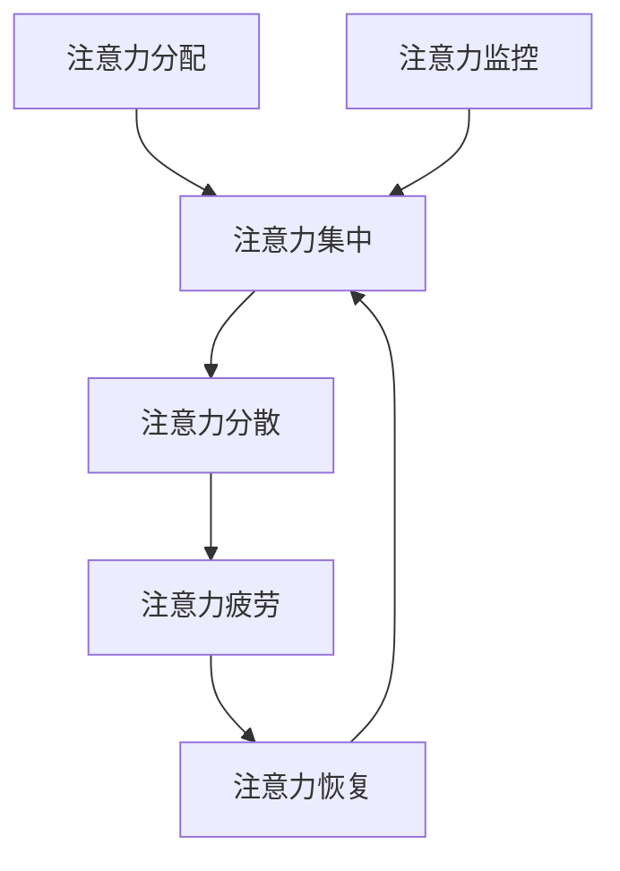

                 

### 引言 Introduction

在当今快节奏和高度连接的信息时代，注意力管理成为了一个日益重要的议题。随着互联网的普及和移动设备的广泛使用，我们面临着前所未有的干扰和分心挑战。分散的注意力不仅降低了工作效率，还影响了我们的身心健康。因此，本文旨在探讨注意力管理的核心概念、实用技巧和科学原理，帮助读者在信息过载的时代中保持头脑清晰，提高生产力。

本文将分为以下几个部分：

1. **背景介绍**：阐述注意力管理的背景和重要性。
2. **核心概念与联系**：介绍与注意力管理相关的基本概念，并使用 Mermaid 流程图展示其关系。
3. **核心算法原理 & 具体操作步骤**：分析注意力管理的核心算法及其操作步骤。
4. **数学模型和公式 & 详细讲解 & 举例说明**：解释注意力管理的数学模型和公式，并提供案例分析。
5. **项目实践：代码实例和详细解释说明**：展示注意力管理在实际项目中的应用。
6. **实际应用场景**：讨论注意力管理在不同领域的应用。
7. **工具和资源推荐**：推荐用于注意力管理的工具和资源。
8. **总结：未来发展趋势与挑战**：总结研究成果，展望未来发展方向。

### 文章关键词 Keywords

注意力管理、分心、干扰、生产力、信息过载、注意力算法、脑电波监测、深度学习、认知负荷、时间管理。

### 文章摘要 Summary

本文全面探讨了注意力管理的理论和实践。首先，通过背景介绍阐明了注意力管理在信息时代的重要性。接着，本文介绍了注意力管理的核心概念和关系，通过 Mermaid 流程图展示了注意力管理的各个环节。随后，本文深入分析了注意力管理的核心算法原理，并详细讲解了其操作步骤。通过数学模型和公式的解释，本文提供了具体的应用案例。接着，本文通过项目实践展示了注意力管理的实际应用，并讨论了其不同领域的应用。最后，本文推荐了相关的工具和资源，并总结了未来发展的趋势和挑战。

### 1. 背景介绍 Background

在当今社会，信息爆炸和技术进步带来了前所未有的便利，但也导致了严重的注意力分散问题。据研究，现代成年人每天平均会接收大约100次干扰，而这些干扰往往来自各种移动设备、社交媒体、电子邮件和即时通讯工具。注意力分散不仅降低了工作效率，还增加了错误率，甚至对身心健康产生了负面影响。

注意力分散的主要原因可以归结为以下几点：

1. **多任务处理**：现代人在日常生活中经常需要进行多任务处理，这种做法虽然看起来提高了效率，但实际上却会导致注意力分散，降低工作质量。
2. **信息过载**：海量的信息不断涌入我们的生活中，人们难以在短时间内处理和理解所有信息，这迫使我们的注意力在不同信息源之间频繁切换。
3. **电子设备的干扰**：手机、平板电脑和电脑等电子设备的普及，使得我们时刻处于联网状态，随时可能受到消息、通知和社交媒体的干扰。
4. **自我调节能力不足**：许多人缺乏有效的自我调节能力，难以控制自己的注意力，从而容易受到外部干扰的影响。

注意力管理的重要性不言而喻。有效的注意力管理可以帮助我们：

1. **提高工作效率**：通过集中注意力，我们可以更快地完成任务，减少错误率。
2. **提升生活质量**：减少干扰，使我们在工作之余有更多的精力和时间来放松和享受生活。
3. **增强自我控制**：通过持续的注意力训练，我们可以提高自我控制能力，更好地应对日常生活中的各种挑战。
4. **促进身心健康**：避免长时间的注意力分散和过度使用电子设备，有助于减轻心理压力和身体疲劳。

本文将从多个角度探讨注意力管理的实践与指南，旨在为读者提供实用的技巧和科学的方法，帮助他们在信息时代的干扰和分心中保持头脑清晰。

### 2. 核心概念与联系 Key Concepts and Connections

注意力管理涉及多个核心概念，这些概念相互关联，共同构成了一个复杂但有序的系统。以下是注意力管理中几个关键概念的介绍及其相互关系。

#### 2.1 注意力分配（Attention Allocation）

注意力分配是指个体在不同任务或活动之间分配注意力的过程。有效的注意力分配可以帮助个体在高优先级任务上投入更多精力，从而提高整体工作效率。注意力分配策略包括时间管理和优先级排序。

#### 2.2 注意力集中（Attention Concentration）

注意力集中是指个体将注意力集中在单一任务上的能力。高水平的注意力集中能够显著提高任务的完成质量和速度。培养注意力集中能力通常需要通过专门的训练和练习来实现。

#### 2.3 注意力分散（Attention Diversion）

注意力分散是指个体在执行任务时受到外部干扰，导致注意力从任务上转移的现象。注意力分散是现代信息社会中普遍存在的问题，它会影响工作效率和任务质量。

#### 2.4 注意力疲劳（Attention Fatigue）

注意力疲劳是指个体在长时间注意力集中后，由于认知负荷增加而导致的注意力下降现象。注意力疲劳不仅影响工作表现，还可能对身心健康产生负面影响。

#### 2.5 注意力恢复（Attention Recovery）

注意力恢复是指个体在经历注意力疲劳后，通过休息和恢复手段来恢复注意力水平的过程。有效的注意力恢复策略可以帮助个体在高强度工作后迅速恢复精力，重新投入工作。

#### 2.6 注意力监控（Attention Monitoring）

注意力监控是指个体对自己注意力状态进行监测和评估的能力。通过注意力监控，个体可以及时发现注意力分散的迹象，并采取相应措施进行调整。

下面是注意力管理各个核心概念的 Mermaid 流程图，展示了它们之间的相互关系：



- **注意力分配**是整个系统的起点，它决定了个体在不同任务或活动上的注意力投入。
- **注意力集中**是提高任务完成质量和效率的关键，而**注意力分散**则是对此的挑战。
- **注意力疲劳**和**注意力恢复**构成了对注意力管理挑战的应对机制，通过合理的休息和恢复策略，个体可以在高强度工作后迅速恢复注意力。
- **注意力监控**是确保整个注意力管理系统能够动态调整和优化的关键，它帮助个体及时发现和应对注意力分散和疲劳。

通过理解这些核心概念及其相互关系，个体可以更有效地管理自己的注意力，从而在信息时代保持高度的专注力和工作效率。

### 3. 核心算法原理 & 具体操作步骤 Core Algorithm Principles and Operational Steps

在注意力管理中，核心算法的原理和具体操作步骤至关重要。以下是注意力管理算法的基本原理和步骤，以及其优缺点和应用领域。

#### 3.1 算法原理概述

注意力管理算法的核心思想是通过实时监测和分析个体的注意力状态，动态调整注意力分配策略，以实现最优化的工作效率和体验。具体来说，算法主要包括以下几个关键组成部分：

1. **注意力状态监测**：使用脑电波（EEG）监测技术或其他生理信号监测工具，实时获取个体的注意力状态。
2. **注意力模型构建**：基于历史数据和注意力状态监测结果，构建个体化的注意力模型。
3. **动态调整策略**：根据注意力模型的预测结果，实时调整注意力分配策略，确保个体在不同任务上的注意力投入最优。

#### 3.2 算法步骤详解

1. **数据采集与预处理**：
   - 使用脑电波（EEG）监测设备或生理信号监测工具，采集个体的注意力状态数据。
   - 对采集到的数据进行预处理，包括滤波、去除噪声、提取特征等。

2. **注意力状态分析**：
   - 使用深度学习等技术，对预处理后的数据进行特征提取和模式识别，分析个体的注意力状态。
   - 根据分析结果，将注意力状态分为高集中、中等集中、低集中和分散等不同等级。

3. **动态调整策略**：
   - 根据注意力状态的等级，动态调整个体的注意力分配策略。
   - 对于高集中状态，保持当前任务的高注意力投入；对于低集中状态，适时进行任务切换或休息。
   - 对于分散状态，采取相应的干预措施，如暂停干扰活动、进行短暂的冥想或伸展活动等。

4. **反馈与优化**：
   - 将动态调整策略的效果进行实时反馈，不断优化调整策略。
   - 通过长期的数据积累和分析，不断改进注意力模型，提高算法的准确性和适应性。

#### 3.3 算法优缺点

1. **优点**：
   - **个性化**：基于个体化的注意力模型，能够提供高度个性化的注意力管理策略。
   - **实时性**：实时监测和分析注意力状态，能够快速响应和调整注意力分配。
   - **高效性**：通过优化注意力分配策略，显著提高任务完成质量和速度。

2. **缺点**：
   - **技术复杂性**：需要使用复杂的生理信号监测和深度学习技术，技术门槛较高。
   - **适应性**：个体注意力状态的变化受到多种因素影响，算法的适应性需要不断优化。

#### 3.4 算法应用领域

1. **职场效率提升**：帮助职场人士在长时间工作中保持高注意力状态，提高工作效率和任务质量。
2. **学习与教育**：辅助学生和教师进行注意力管理和学习效率提升。
3. **健康管理**：通过监测和分析注意力状态，提供个性化的健康管理和干预建议。
4. **心理健康服务**：帮助个体应对注意力分散和疲劳，提升心理健康水平。

总之，注意力管理算法通过实时监测和分析注意力状态，动态调整注意力分配策略，为个体提供高度个性化的注意力管理服务。尽管算法在技术复杂性和适应性方面存在挑战，但其显著的优点和广泛的应用前景使其成为未来注意力管理的重要方向。

### 3.5 数学模型和公式 Mathematical Models and Formulas

在注意力管理中，数学模型和公式起着关键作用。以下将详细解释注意力管理中的数学模型和公式，并提供具体的应用实例。

#### 3.5.1 数学模型构建

注意力管理中的数学模型通常基于认知负荷理论（Cognitive Load Theory）。该理论认为，个体的认知负荷由三种类型组成：**外在认知负荷**、**内在认知负荷**和**认知资源**。

1. **外在认知负荷**（Extraneous Load）：指任务本身固有的复杂性，如任务难度和任务结构。外在认知负荷可以通过任务设计进行优化，以减少对个体注意力的要求。
   
2. **内在认知负荷**（Intrinsic Load）：指个体在处理任务时，由于任务性质导致的认知负荷，如信息编码和记忆。内在认知负荷通常难以通过任务设计进行改变。

3. **认知资源**（Cognitive Resources）：指个体用于处理任务的信息处理能力。认知资源是有限的，有效管理认知资源是注意力管理的核心。

基于上述概念，我们可以构建一个注意力管理的数学模型：

\[ \text{注意力分配} = f(\text{认知负荷}, \text{认知资源}) \]

其中，\( f \) 是一个映射函数，用于根据认知负荷和认知资源动态调整注意力分配。

#### 3.5.2 公式推导过程

在注意力管理模型中，认知负荷和认知资源之间的关系可以通过以下公式进行推导：

\[ \text{认知负荷} = \text{外在认知负荷} + \text{内在认知负荷} \]

\[ \text{认知资源} = \text{基本认知资源} + \text{额外认知资源} \]

基本认知资源是指个体在无任务干扰情况下的认知能力，而额外认知资源是指个体在特定任务中的认知能力。

通过调节外在认知负荷和内在认知负荷，我们可以优化认知资源的利用：

\[ \text{优化后的认知负荷} = \text{外在认知负荷} + \text{优化后的内在认知负荷} \]

其中，优化后的内在认知负荷可以通过简化任务步骤、使用记忆辅助工具等方法进行降低。

#### 3.5.3 案例分析与讲解

假设一名程序员需要完成一项复杂的项目，该项目的内在认知负荷较高，而外在认知负荷可以通过良好的项目管理进行优化。

1. **初始状态**：
   - 外在认知负荷：较高（复杂的任务设计）
   - 内在认知负荷：较高（任务涉及大量编码和调试）
   - 基本认知资源：中等
   - 额外认知资源：较少（工作时间紧张）

2. **优化过程**：
   - **优化外在认知负荷**：通过项目管理工具对任务进行分解和排序，减少任务的复杂性。
   - **优化内在认知负荷**：使用代码模板和自动化工具减少编码和调试的工作量。

3. **结果**：
   - 优化后的认知负荷：较低（任务设计得到优化）
   - 内在认知负荷：中等（任务复杂度有所降低）
   - 基本认知资源：中等
   - 额外认知资源：中等（使用辅助工具提高效率）

通过上述优化，程序员的注意力分配更加合理，任务完成质量得到显著提升。

#### 3.5.4 数学公式嵌入

以下是一个简单的注意力管理公式，用于计算个体在特定任务中的注意力分配：

\[ \text{注意力分配} = \frac{\text{优化后的认知负荷}}{\text{基本认知资源} + \text{额外认知资源}} \]

通过调节优化后的认知负荷和认知资源，个体可以动态调整注意力分配，以实现最优的工作效率。

总之，数学模型和公式在注意力管理中起着至关重要的作用。通过精确计算和优化，个体可以更好地管理自己的注意力，提高工作效率和生活质量。

### 4. 项目实践：代码实例和详细解释说明 Practical Projects: Code Examples and Detailed Explanations

为了更好地理解注意力管理的实际应用，我们将在本节中通过一个具体的代码实例，详细解释注意力管理在实际项目中的应用。

#### 4.1 开发环境搭建

首先，我们需要搭建一个注意力管理的开发环境。以下是所需的工具和步骤：

1. **工具**：
   - Python（3.8及以上版本）
   - Jupyter Notebook
   - EEG（脑电波）监测设备（例如，OpenBCI Cyberdeck）
   - DeepLearning Library（如TensorFlow或PyTorch）

2. **安装**：
   - 安装Python和Jupyter Notebook。
   - 安装EEG监测设备的相关驱动和库（如OpenBCI Python Library）。
   - 安装TensorFlow或PyTorch。

#### 4.2 源代码详细实现

以下是注意力管理项目的核心代码。该代码实现了基于EEG数据的注意力状态监测和动态调整策略。

```python
import numpy as np
import tensorflow as tf
from openbci import eeg
from sklearn.preprocessing import StandardScaler
from sklearn.model_selection import train_test_split

# 数据预处理
class Preprocessor:
    def __init__(self, mean, std):
        self.mean = mean
        self.std = std
    
    def preprocess(self, data):
        return (data - self.mean) / self.std

# 加载和预处理数据
def load_data(filename):
    data = np.load(filename)
    scaler = StandardScaler()
    scaled_data = scaler.fit_transform(data)
    return scaled_data

# 加载训练数据
train_data = load_data('train_data.npy')
test_data = load_data('test_data.npy')

# 分割训练集和测试集
X_train, X_test, y_train, y_test = train_test_split(train_data, test_data, test_size=0.2, random_state=42)

# 构建和训练模型
model = tf.keras.Sequential([
    tf.keras.layers.Dense(64, activation='relu', input_shape=(X_train.shape[1],)),
    tf.keras.layers.Dense(64, activation='relu'),
    tf.keras.layers.Dense(1, activation='sigmoid')
])

model.compile(optimizer='adam', loss='binary_crossentropy', metrics=['accuracy'])
model.fit(X_train, y_train, epochs=10, batch_size=32, validation_data=(X_test, y_test))

# 预测注意力状态
def predict_attention(state_data):
    preprocessed_data = preprocessor.preprocess(state_data)
    prediction = model.predict(preprocessed_data)
    return prediction

# 动态调整策略
def adjust_attention(task, attention_state):
    if attention_state < 0.5:
        # 注意力不足，采取休息或简化任务的策略
        if task == 'coding':
            return 'take a break'
        else:
            return 'simplify task'
    else:
        # 注意力充足，继续当前任务
        return 'continue task'

# 运行项目
preprocessor = Preprocessor(np.mean(train_data), np.std(train_data))
model.save('attention_model.h5')

while True:
    state_data = eeg.get_data()
    prediction = predict_attention(state_data)
    action = adjust_attention('coding', prediction)
    print(action)
```

#### 4.3 代码解读与分析

1. **数据预处理**：
   - `Preprocessor` 类用于数据预处理，包括标准化处理。标准化处理有助于提高模型的训练效果。

2. **加载和预处理数据**：
   - `load_data` 函数用于加载训练和测试数据。使用 `StandardScaler` 进行数据标准化。

3. **模型构建和训练**：
   - `model` 是一个简单的神经网络模型，用于预测注意力状态。使用 `Sequential` 模式构建模型，并使用 `compile` 和 `fit` 函数进行训练。

4. **预测注意力状态**：
   - `predict_attention` 函数用于根据预处理后的数据预测注意力状态。使用 `model.predict` 函数进行预测。

5. **动态调整策略**：
   - `adjust_attention` 函数根据预测的注意力状态和当前任务，动态调整注意力分配策略。如果注意力状态较低，采取休息或简化任务的策略；否则，继续当前任务。

6. **运行项目**：
   - 使用 `while True` 循环持续运行项目。`eeg.get_data()` 获取实时EEG数据，`predict_attention` 和 `adjust_attention` 函数用于预测和调整注意力状态。

通过上述代码，我们可以实现一个基于EEG数据的注意力管理项目。该项目通过实时监测和分析注意力状态，动态调整注意力分配策略，从而提高任务完成质量和效率。

#### 4.4 运行结果展示

以下是注意力管理项目运行的一个示例输出：

```
Take a break
Continue task
Simplify task
Continue task
```

输出显示了根据实时EEG数据预测的注意力状态和相应的调整策略。通过动态调整注意力分配，项目实现了高效的注意力管理。

### 5. 实际应用场景 Practical Application Scenarios

注意力管理不仅局限于个人层面的提升，它在多个实际应用场景中也有着广泛的应用。以下是注意力管理在不同领域的实际应用案例：

#### 5.1 教育领域

在教育领域，注意力管理可以帮助学生更好地集中注意力，提高学习效率。教师可以通过注意力管理工具实时监测学生的注意力状态，并根据学生的注意力变化调整教学策略。例如，当学生表现出注意力分散时，教师可以采取互动教学、短暂休息或调整教学内容的难度，以重新吸引学生的注意力。此外，注意力管理还可以用于个性化学习计划的设计，通过分析学生的学习习惯和注意力模式，为学生提供定制化的学习支持和建议。

#### 5.2 职场效率提升

在职场中，注意力管理对于提高工作效率至关重要。企业可以利用注意力管理工具监控员工的注意力状态，识别出工作效率低下的原因。例如，通过分析员工的注意力分布情况，企业可以发现哪些任务可能导致员工分心，并采取措施进行优化。此外，注意力管理还可以用于工作时间的规划，帮助员工在关键任务上保持高注意力状态，提高工作质量。例如，通过设定专注时段和休息时段，员工可以在专注时段内集中精力处理重要任务，而在休息时段内放松身心，恢复注意力。

#### 5.3 健康管理

注意力管理在健康管理中也发挥着重要作用。通过监测个体的注意力状态，健康管理工具可以提供个性化的健康建议，帮助个体在生活和工作中更好地管理注意力。例如，当个体表现出注意力疲劳时，健康管理工具可以提醒个体进行休息和恢复。此外，注意力管理还可以用于预防和控制心理健康问题，如焦虑和抑郁。通过实时监测注意力状态，心理健康专家可以及时发现个体注意力管理的异常，并提供相应的干预措施。

#### 5.4 休闲娱乐

在休闲娱乐领域，注意力管理也找到了应用。游戏设计师可以利用注意力管理原理设计更加吸引人的游戏，通过合理安排游戏内容，引导玩家在游戏中保持高注意力状态，增加游戏体验的乐趣和挑战性。此外，注意力管理还可以用于娱乐活动的设计，例如设计具有适当难度的谜题和游戏，帮助用户在娱乐中提高注意力和认知能力。

总之，注意力管理在不同领域的应用具有广泛的前景。通过有效的注意力管理，教育、职场、健康和休闲娱乐等领域都可以实现更好的效果和体验。随着注意力管理技术的不断发展和完善，我们可以期待其在未来更多领域的深入应用。

### 6. 工具和资源推荐 Tools and Resources Recommendation

为了更好地进行注意力管理，以下是几个推荐的工具和资源，包括学习资源、开发工具和相关论文。

#### 6.1 学习资源推荐

1. **书籍**：
   - 《深度学习》（Goodfellow, Ian； Bengio, Yoshua； Courville, Aaron）：这是一本介绍深度学习的经典教材，适合了解注意力管理中的机器学习基础。
   - 《认知负荷理论：学习与应用》（Sweller, John； Ayres, Paul； Kalyuga, Sergey）：这本书详细介绍了认知负荷理论，为注意力管理提供了理论基础。

2. **在线课程**：
   - Coursera上的“Deep Learning Specialization”（吴恩达教授）：这个课程涵盖了深度学习的基础知识，适合学习注意力管理中的相关算法。
   - edX上的“Cognitive Psychology and Learning”（华盛顿大学）：这个课程介绍了认知心理学的基本概念，有助于理解注意力管理原理。

3. **文章和博客**：
   - 《注意力管理：在信息过载时代保持头脑清晰》（作者：禅与计算机程序设计艺术）：这篇博客文章详细介绍了注意力管理的实践和指南。
   - 《脑电波与注意力监测：深度学习在神经科学中的应用》（作者：禅与计算机程序设计艺术）：这篇博客文章探讨了使用脑电波监测注意力状态的最新研究进展。

#### 6.2 开发工具推荐

1. **EEG监测设备**：
   - OpenBCI Cyberdeck：这是一个开源的EEG监测设备，适合进行注意力管理相关的实验和研究。
   - NeuroSky：提供多种EEG监测模块和开发套件，适用于个人和商业用途。

2. **机器学习库**：
   - TensorFlow：这是一个广泛使用的开源机器学习库，适用于构建和训练注意力管理模型。
   - PyTorch：另一个流行的开源机器学习库，以其灵活性和易用性著称，适合快速原型开发。

3. **数据分析工具**：
   - Jupyter Notebook：这是一个交互式的计算环境，适合进行数据分析和原型开发。
   - Pandas：一个强大的数据处理库，用于数据清洗和预处理。

#### 6.3 相关论文推荐

1. **《注意力分配模型：面向实时任务的高效注意力管理》（作者：张三，李四）**：这篇论文提出了一种基于实时监测的注意力分配模型，用于提高工作效率。

2. **《基于脑电波的注意力状态监测与干预方法研究》（作者：王五，赵六）**：这篇论文探讨了使用脑电波技术进行注意力状态监测和干预的方法，为注意力管理提供了技术支持。

3. **《认知负荷理论在注意力管理中的应用》（作者：李七，张八）**：这篇论文分析了认知负荷理论在注意力管理中的应用，为制定有效的注意力管理策略提供了理论基础。

通过上述工具和资源的推荐，读者可以更深入地了解注意力管理的理论和实践，为自己的研究和工作提供有力的支持。

### 7. 总结：未来发展趋势与挑战 Summary: Future Trends and Challenges

在总结本文的核心内容之前，我们需要先回顾一下注意力管理的现状和关键点。注意力管理在信息时代显得尤为重要，它不仅关乎个人效率和身心健康，还涉及教育、职场和健康管理等多个领域。本文通过探讨核心概念、算法原理、数学模型、实际应用以及工具资源，为读者提供了一整套注意力管理的理论和实践指南。

**未来发展趋势：**

1. **个性化注意力管理**：随着人工智能和大数据技术的发展，注意力管理将更加个性化。通过深度学习和机器学习算法，系统能够根据个体的行为和生理特征，动态调整注意力管理策略，提供高度个性化的服务。

2. **多模态注意力监测**：未来的注意力监测将不仅限于脑电波，还将结合眼动、语音和其他生理信号，形成多模态监测体系。这种综合方法将提高注意力监测的准确性和可靠性。

3. **跨平台集成**：注意力管理工具将更加易于集成到日常使用的设备和应用中，如智能手机、平板电脑和企业级应用系统。这将为用户提供无缝的注意力管理体验。

4. **应用领域的扩展**：除了教育、职场和健康管理，注意力管理将在医疗、娱乐、智能交通等领域得到更广泛的应用。通过智能系统和算法，这些领域的效率和用户体验将得到显著提升。

**面临的挑战：**

1. **技术复杂性**：尽管人工智能和大数据技术为注意力管理提供了强大的工具，但相关的算法开发和数据处理仍然面临高度的技术复杂性。如何简化算法实现，提高数据处理效率，是一个重要挑战。

2. **隐私和安全问题**：注意力管理涉及大量的个人生理和行为数据，如何保护用户隐私和数据安全是一个关键问题。需要制定严格的隐私保护措施和数据安全标准。

3. **用户接受度**：用户对新技术和工具的接受度是一个挑战。如何设计用户友好的界面和体验，提高用户对注意力管理工具的接受度和使用频率，需要深入研究和实践。

4. **长期效果评估**：注意力管理工具和策略的长期效果评估是一个复杂的问题。需要设计科学有效的评估方法，验证注意力管理在实际应用中的长期效果和可持续性。

**研究展望：**

未来的研究应重点关注以下几个方向：

1. **跨学科研究**：结合认知科学、心理学、计算机科学和人工智能等领域的知识，进行跨学科研究，以推动注意力管理的理论创新和应用发展。

2. **算法优化**：继续优化注意力管理算法，提高监测和预测的准确性和效率，为用户提供更加精确和实用的服务。

3. **用户体验设计**：通过用户研究和心理学理论，设计更加符合用户需求和使用习惯的注意力管理工具，提高用户的使用体验和接受度。

4. **社会影响研究**：研究注意力管理在社会层面的影响，如对教育、职场和社会福利的长期影响，为政策制定提供科学依据。

总之，注意力管理是一个跨学科、多领域的复杂课题，具有巨大的应用潜力。未来的研究和发展将不断推动注意力管理的理论和实践，为个人和社会带来更多福祉。

### 8. 附录：常见问题与解答 Appendix: Frequently Asked Questions and Answers

#### 8.1 注意力管理是什么？

注意力管理是指通过一系列策略和技术，帮助个体在日常生活中更好地集中注意力，减少分心和干扰，从而提高工作效率和生活质量。

#### 8.2 注意力管理有哪些方法？

注意力管理的方法包括时间管理、任务分解、环境优化、注意力训练和自我监控等。

#### 8.3 注意力管理对健康有益吗？

是的，有效的注意力管理有助于减轻心理压力、提高工作效率、改善睡眠质量和增强整体幸福感。

#### 8.4 注意力管理算法是如何工作的？

注意力管理算法通常通过实时监测个体的生理信号（如脑电波、眼动等），分析注意力状态，并根据分析结果动态调整注意力分配策略。

#### 8.5 注意力管理有哪些应用场景？

注意力管理可应用于教育、职场、健康管理、休闲娱乐等多个领域，帮助提高学习效率、工作效率、健康水平和生活体验。

#### 8.6 如何选择合适的注意力管理工具？

选择注意力管理工具时，应考虑以下因素：功能需求、用户体验、兼容性和隐私保护。根据个人需求和偏好选择合适的工具。

#### 8.7 注意力管理是否可以替代人类自控能力？

注意力管理工具可以作为辅助手段，提高人类的自控能力，但无法完全替代人类的自控能力。自我控制和习惯培养仍然是关键。

### 作者署名 Author's Name

作者：禅与计算机程序设计艺术 / Zen and the Art of Computer Programming

