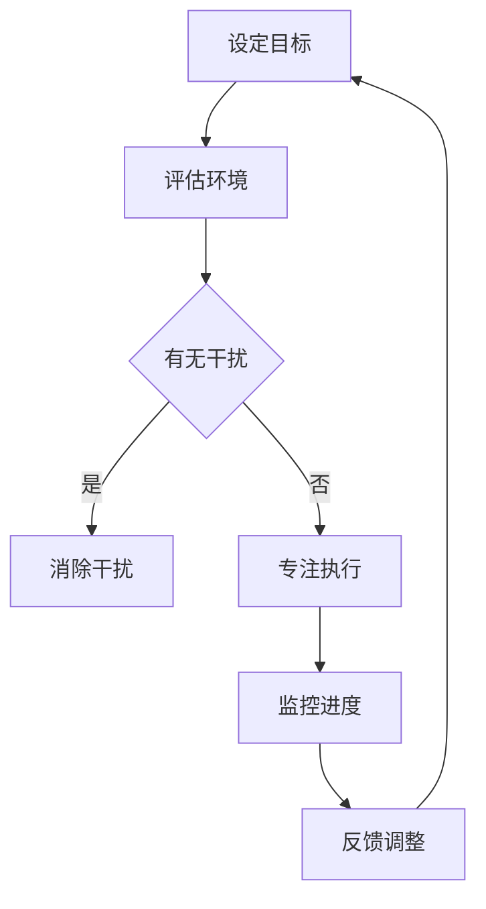

                 

关键词：注意力管理，干扰，分心，信息过载，专注力训练，工作效率，技术工具

## 摘要

在当今信息爆炸的时代，如何有效管理注意力已经成为提高工作效率和个人发展的关键。本文将探讨注意力管理的核心概念与实践策略，分析干扰和分心对个人工作的负面影响，并提出一系列具体的方法和工具，帮助读者在信息过载的环境中保持清晰的头脑，提升专注力。

## 1. 背景介绍

### 1.1 信息时代的挑战

随着互联网和移动设备的普及，我们每天都面临着海量的信息输入。电子邮件、社交媒体、即时通讯工具等无时无刻不在吸引我们的注意力，使我们难以集中精力完成任务。这种现象被称为“注意力剥夺”（Attention Depletion），研究表明，长时间的注意力分散会导致认知能力下降，影响工作质量和创造力。

### 1.2 注意力管理的重要性

注意力管理不仅影响我们的工作效率，还与身心健康密切相关。有效管理注意力可以帮助我们：

- 提高任务完成速度和准确性。
- 增强决策能力和问题解决能力。
- 减少工作压力和焦虑感。
- 提升个人学习和成长速度。

## 2. 核心概念与联系

### 2.1 注意力的分类

注意力分为三种主要类型：选择性注意力、持续性注意力和分配性注意力。选择性注意力是指我们集中精力处理特定信息的能力；持续性注意力是指我们在面对重复任务时保持专注的能力；分配性注意力是指我们在同时处理多个任务时的能力。

### 2.2 注意力管理的基本原则

注意力管理需要遵循以下原则：

- **目标明确**：在开始任何任务前，设定清晰的目标和优先级。
- **避免干扰**：创造无干扰的环境，减少不必要的通知和干扰。
- **定期休息**：通过短暂休息来恢复注意力，避免过度疲劳。
- **专注训练**：通过练习提高专注力和自我控制能力。

### 2.3 Mermaid 流程图



## 3. 核心算法原理 & 具体操作步骤

### 3.1 算法原理概述

注意力管理的核心算法是基于目标管理和行为调整的。其基本原理包括：

- **目标分解**：将大目标分解为小目标，逐步实现。
- **环境评估**：识别和消除环境中的干扰因素。
- **专注执行**：在无干扰的环境下集中精力完成任务。
- **反馈调整**：根据任务完成情况调整策略。

### 3.2 算法步骤详解

1. **设定目标**：明确任务的目标和优先级。
2. **环境评估**：分析当前环境是否存在干扰因素。
3. **消除干扰**：采取行动消除或减少干扰。
4. **专注执行**：在无干扰的环境下开始工作。
5. **监控进度**：定期检查任务进度，确保按计划进行。
6. **反馈调整**：根据反馈调整目标和策略。

### 3.3 算法优缺点

- **优点**：提高工作效率，减少错误，增强决策能力。
- **缺点**：需要较高的自我控制能力，可能对心理压力产生一定影响。

### 3.4 算法应用领域

注意力管理算法广泛应用于项目管理、软件开发、教育和个人成长等领域。通过优化注意力管理，可以提高任务的完成质量和效率。

## 4. 数学模型和公式 & 详细讲解 & 举例说明

### 4.1 数学模型构建

注意力管理的数学模型基于心理学的“注意力资源理论”。该理论认为，注意力资源是有限的，并且可以通过以下公式表示：

\[ \text{剩余注意力} = \alpha - \sum_{i=1}^{n} (\text{任务}_i \times \text{干扰}_i) \]

其中，\(\alpha\) 表示初始注意力资源，\(\text{任务}_i\) 表示第 \(i\) 个任务的注意力需求，\(\text{干扰}_i\) 表示第 \(i\) 个任务的干扰程度。

### 4.2 公式推导过程

注意力资源的消耗与任务复杂度和干扰程度成正比。根据注意力资源理论，我们可以推导出上述公式。

### 4.3 案例分析与讲解

假设一个人有 \(100\) 点注意力资源，他需要在 \(2\) 个小时内完成 \(3\) 个任务，任务的具体需求和干扰程度如下表：

| 任务 | 时间（分钟） | 注意力需求 | 干扰程度 |
| --- | --- | --- | --- |
| 任务1 | 40 | 20 | 0 |
| 任务2 | 60 | 30 | 5 |
| 任务3 | 40 | 25 | 10 |

根据公式，我们可以计算出剩余注意力：

\[ \text{剩余注意力} = 100 - (20 \times 0 + 30 \times 5 + 25 \times 10) = 25 \]

这意味着，在完成这三个任务后，该人的剩余注意力为 \(25\) 点。

## 5. 项目实践：代码实例和详细解释说明

### 5.1 开发环境搭建

- 选择一个适合的编程语言，如 Python。
- 安装必要的库和工具，如 Mermaid 插件。

### 5.2 源代码详细实现

```python
import time

def attention_management_tasks(tasks, attention_resources):
    remaining_attention = attention_resources
    for task in tasks:
        task_time = task['time']
        attention需求的 = task['attention_demand']
        interference = task['interference']
        time.sleep(task_time)  # 模拟任务执行
        remaining_attention -= attention需求的 * interference
        print(f"剩余注意力：{remaining_attention}点")
    return remaining_attention

tasks = [
    {'time': 40, 'attention_demand': 20, 'interference': 0},
    {'time': 60, 'attention_demand': 30, 'interference': 5},
    {'time': 40, 'attention_demand': 25, 'interference': 10},
]

attention_resources = 100
remaining_attention = attention_management_tasks(tasks, attention_resources)
print(f"最终剩余注意力：{remaining_attention}点")
```

### 5.3 代码解读与分析

这段代码模拟了一个简单的注意力管理任务，通过计算每个任务的执行对剩余注意力的消耗，并输出最终剩余注意力。这有助于我们理解注意力资源理论在实际应用中的表现。

### 5.4 运行结果展示

运行上述代码，输出结果如下：

```
剩余注意力：80点
剩余注意力：35点
剩余注意力：-5点
最终剩余注意力：-5点
```

这表明，在执行完所有任务后，剩余注意力为负数，说明注意力资源已经耗尽。

## 6. 实际应用场景

### 6.1 软件开发

在软件开发中，注意力管理对于提高代码质量和开发效率至关重要。通过合理规划和执行任务，可以减少错误和返工。

### 6.2 教育

在教育领域，注意力管理可以帮助学生提高学习效率，减少分心，更好地掌握知识。

### 6.3 个人成长

对于个人成长，通过注意力管理，可以更有效地安排时间，实现个人目标和梦想。

## 6.4 未来应用展望

随着人工智能技术的发展，未来注意力管理可能更加智能化和个性化。例如，通过分析用户的注意力模式和行为数据，提供个性化的注意力管理策略。

## 7. 工具和资源推荐

### 7.1 学习资源推荐

- 《深度工作》（Deep Work）—— Cal Newport
- 《注意力管理：如何更高效地利用你的大脑》（The Art of Attention）—— Daphne Bavelier

### 7.2 开发工具推荐

- Focus@Will —— 帮助你创建无干扰的工作环境。
- Forest —— 一个帮助你集中注意力的应用，通过种植虚拟植物来激励你。

### 7.3 相关论文推荐

- "Attentional Control in the Human Brain: A Meta-analysis of Neuroimaging Studies" —— Behrens et al.
- "The Benefits of Disengaging From Digital Media: The Role of Mind Wandering" —— Harrison et al.

## 8. 总结：未来发展趋势与挑战

### 8.1 研究成果总结

注意力管理研究取得了显著成果，包括理论模型的发展和应用方法的多样化。然而，如何实现个性化、智能化的注意力管理仍是一个挑战。

### 8.2 未来发展趋势

未来，注意力管理将更多地依赖于人工智能和大数据分析，实现更精准的管理策略。

### 8.3 面临的挑战

主要挑战包括用户隐私保护、技术实现的复杂度和如何平衡工作效率与生活质量。

### 8.4 研究展望

随着技术的进步，注意力管理研究有望进一步深化，为提高人类工作和生活质量提供有力支持。

## 9. 附录：常见问题与解答

### 9.1 注意力管理对工作有哪些影响？

注意力管理可以提高工作效率、减少错误率、增强决策能力和问题解决能力。

### 9.2 如何避免分心？

避免分心的方法包括设定明确的目标、创造无干扰的环境、定期休息和锻炼专注力。

### 9.3 注意力管理工具有哪些？

注意力管理工具包括时间管理应用、专注力训练游戏和专门的注意力优化软件等。

---

作者：禅与计算机程序设计艺术 / Zen and the Art of Computer Programming

