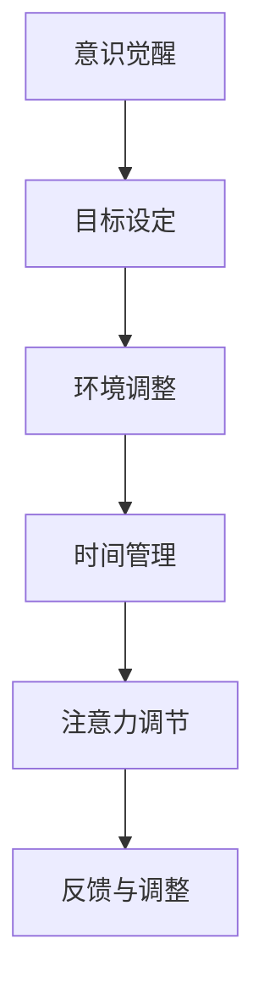

                 

## 1. 背景介绍

在当今快速发展的信息时代，我们面临着一个前所未有的挑战：信息过载和干扰。每天，我们都被大量的信息所包围，这些信息来自互联网、社交媒体、电子邮件、短信、电话等多个渠道。这种信息过载导致我们的注意力分散，影响我们的工作效率和生活质量。

信息过载的问题不仅限于个人层面，它对企业和组织也产生了深远的影响。员工在工作中经常受到各种信息的干扰，导致工作效率低下，甚至出现工作倦怠。企业在信息处理和管理上也面临巨大的挑战，如何有效地管理和利用这些信息资源，成为企业竞争力的重要因素。

注意力管理作为一种解决信息过载和干扰的有效策略，引起了广泛的关注。注意力管理不仅关乎个体的心理和生理健康，还直接影响我们的认知能力和工作效率。因此，研究注意力管理策略和实践，对于提升个人的工作和生活质量，以及企业的运营效率，都具有重要的现实意义。

本文将围绕注意力管理这一主题，探讨其核心概念、算法原理、数学模型、实践应用，并推荐相关工具和资源。希望通过这篇文章，能够为读者提供一套系统的注意力管理策略，帮助他们在信息过载和干扰的环境中更好地航行。

## 2. 核心概念与联系

### 2.1 注意力管理的定义

注意力管理是指通过各种方法和技巧，有效地调节和控制个体注意力资源的过程。它包括注意力的分配、集中、转移和恢复等方面。在信息过载的时代，注意力管理尤为重要，因为它可以帮助我们过滤无关信息，集中精力处理重要任务。

### 2.2 注意力管理的重要性

注意力管理对个体的认知功能和效率有着直接的影响。良好的注意力管理能力可以帮助我们：

1. **提高工作效率**：通过集中注意力，快速处理任务，减少时间浪费。
2. **增强学习能力**：在专注的状态下，更容易理解和吸收新知识。
3. **提升生活质量**：减少因信息过载和干扰引起的精神压力和焦虑。
4. **增强决策能力**：在清晰思考的状态下，做出更为明智的决策。

### 2.3 注意力管理的框架

注意力管理的框架可以概括为以下几个步骤：

1. **意识觉醒**：认识到自己正处于信息过载和干扰的环境中，意识到注意力管理的重要性。
2. **目标设定**：明确自己当前的任务和目标，确保注意力集中在重要任务上。
3. **环境调整**：通过调整周围环境，减少干扰因素，例如关闭不必要的社交媒体通知、选择安静的办公环境等。
4. **时间管理**：合理安排时间，采用番茄工作法等时间管理技巧，提高工作效率。
5. **注意力调节**：使用注意力调节技巧，如冥想、深呼吸、短暂休息等，帮助恢复注意力。
6. **反馈与调整**：根据任务完成情况和注意力管理效果，进行反馈和调整，优化管理策略。

### 2.4 注意力管理与其他领域的联系

注意力管理不仅与心理学、神经科学等领域密切相关，还与其他领域如企业管理、教育等有着广泛的联系。例如，在企业管理中，通过注意力管理可以提高员工的工作效率和团队协作能力；在教育领域，注意力管理可以帮助学生更好地学习，提高学习效果。

### 2.5 Mermaid 流程图

为了更直观地展示注意力管理的流程，我们使用 Mermaid 流程图来描述。



通过这个流程图，我们可以清晰地看到注意力管理的各个步骤及其相互关系。

## 3. 核心算法原理 & 具体操作步骤

### 3.1 算法原理概述

注意力管理的核心算法基于人类大脑的认知机制，通过调节个体的外部环境和内部心理状态，实现对注意力的有效管理。该算法主要包括以下几个核心原理：

1. **注意力分配原则**：根据任务的优先级和紧急程度，合理分配注意力资源。
2. **注意力集中原则**：通过专注技巧，如冥想、深呼吸等，提高注意力的集中度。
3. **注意力转移原则**：在任务切换时，灵活调整注意力焦点，避免注意力分散。
4. **注意力恢复原则**：通过短暂的休息和放松，恢复注意力的活力。

### 3.2 算法步骤详解

1. **步骤一：意识觉醒**
   - **具体操作**：首先，个体需要意识到自己正处于信息过载和干扰的环境中，认识到注意力管理的重要性。
   - **注意事项**：这一步骤是注意力管理的前提，只有意识到问题，才能有针对性地进行管理。

2. **步骤二：目标设定**
   - **具体操作**：明确当前的任务和目标，确保注意力集中在重要任务上。
   - **注意事项**：目标的设定要具体、可量化，有助于提高注意力集中度。

3. **步骤三：环境调整**
   - **具体操作**：通过调整周围环境，减少干扰因素，例如关闭不必要的社交媒体通知、选择安静的办公环境等。
   - **注意事项**：环境的调整应结合个体特点，如有些人喜欢在安静的环境中工作，有些人则喜欢在轻度噪音中工作。

4. **步骤四：时间管理**
   - **具体操作**：合理安排时间，采用番茄工作法等时间管理技巧，提高工作效率。
   - **注意事项**：时间管理应遵循科学原则，如合理分配工作时间和休息时间，避免过度疲劳。

5. **步骤五：注意力调节**
   - **具体操作**：使用注意力调节技巧，如冥想、深呼吸、短暂休息等，帮助恢复注意力。
   - **注意事项**：注意力调节应灵活运用，根据实际情况进行调整。

6. **步骤六：反馈与调整**
   - **具体操作**：根据任务完成情况和注意力管理效果，进行反馈和调整，优化管理策略。
   - **注意事项**：反馈与调整是注意力管理的重要环节，有助于不断提升管理效果。

### 3.3 算法优缺点

**优点**：

1. **高效性**：通过科学的管理方法，提高工作效率和注意力集中度。
2. **灵活性**：适用于各种工作环境和个体特点，具有广泛的适用性。
3. **可持续性**：通过长期的注意力管理，有助于提升个体的认知能力和心理素质。

**缺点**：

1. **初始成本**：需要一定的时间和精力进行初始设置和调整。
2. **个体差异**：不同个体对管理策略的适应程度不同，需要个性化调整。
3. **效果评估**：注意力管理的效果评估较为复杂，需要长期跟踪和数据分析。

### 3.4 算法应用领域

注意力管理算法广泛应用于以下领域：

1. **个人生活**：帮助个体提高工作效率，提升生活质量。
2. **企业管理**：提高员工的工作效率和团队协作能力。
3. **教育领域**：帮助学生提高学习效果，培养良好的学习习惯。
4. **心理健康**：缓解因信息过载和干扰引起的精神压力和焦虑。

## 4. 数学模型和公式 & 详细讲解 & 举例说明

### 4.1 数学模型构建

注意力管理中的数学模型可以基于概率论和统计学原理。我们假设个体在一个多任务环境中工作，每个任务都有一个完成概率和干扰概率。注意力管理的目标是在这些任务之间合理分配注意力资源，以最大化总任务完成概率。

设 \( T \) 为任务集合，\( p_t \) 为任务 \( t \) 的完成概率，\( q_t \) 为任务 \( t \) 的干扰概率，\( a_t \) 为分配给任务 \( t \) 的注意力资源。我们的目标是构建一个优化模型，求解最优的注意力资源分配方案。

数学模型可以表示为：

$$
\begin{aligned}
\max_{a_t} & \sum_{t \in T} p_t \cdot a_t \\
\text{subject to} & \sum_{t \in T} a_t \leq A \\
& a_t \geq 0, \forall t \in T
\end{aligned}
$$

其中，\( A \) 为总注意力资源。

### 4.2 公式推导过程

为了推导上述模型，我们首先分析每个任务完成概率的影响因素。根据概率论，任务 \( t \) 的完成概率可以表示为：

$$
p_t = f(a_t, q_t)
$$

其中，\( f \) 是一个映射函数，表示注意力资源 \( a_t \) 和干扰概率 \( q_t \) 对完成概率的影响。

为了简化问题，我们假设 \( f \) 是线性函数，即：

$$
p_t = r \cdot a_t + s \cdot q_t
$$

其中，\( r \) 和 \( s \) 是常数，分别表示注意力资源和干扰概率对完成概率的边际贡献。

接下来，我们将 \( p_t \) 的表达式代入目标函数，得到：

$$
\max_{a_t} \sum_{t \in T} (r \cdot a_t + s \cdot q_t) \cdot a_t
$$

$$
= \max_{a_t} \sum_{t \in T} (r \cdot a_t^2 + s \cdot a_t \cdot q_t)
$$

考虑到约束条件，我们需要在最大化目标函数的同时，满足总注意力资源 \( A \) 的限制。因此，我们可以使用拉格朗日乘子法求解这个优化问题。

定义拉格朗日函数：

$$
L(a_t, \lambda) = \sum_{t \in T} (r \cdot a_t^2 + s \cdot a_t \cdot q_t) + \lambda (A - \sum_{t \in T} a_t)
$$

其中，\( \lambda \) 是拉格朗日乘子。

对 \( a_t \) 和 \( \lambda \) 求偏导数，并令其等于零，得到：

$$
\frac{\partial L}{\partial a_t} = 2r \cdot a_t + s \cdot q_t - \lambda = 0
$$

$$
\frac{\partial L}{\partial \lambda} = A - \sum_{t \in T} a_t = 0
$$

由第一个方程解得：

$$
a_t = \frac{\lambda - s \cdot q_t}{2r}
$$

代入第二个方程，得到：

$$
\lambda = \frac{2r \cdot A}{2r + s}
$$

因此，最优的注意力资源分配为：

$$
a_t = \frac{A \cdot (1 - \frac{s \cdot q_t}{2r + s})}{2r + s}
$$

### 4.3 案例分析与讲解

为了更直观地理解上述数学模型，我们通过一个实际案例进行分析。

假设一个员工需要在一天内完成三个任务，任务 \( T_1 \)、\( T_2 \) 和 \( T_3 \) 的完成概率分别为 0.8、0.7 和 0.6，干扰概率分别为 0.2、0.3 和 0.4。总注意力资源为 10 个单位。

根据上述模型，我们可以计算每个任务的最优注意力资源分配：

$$
a_{T_1} = \frac{10 \cdot (1 - \frac{0.2 \cdot 0.2}{2 \cdot 0.8 + 0.3})}{2 \cdot 0.8 + 0.3} = 3.6
$$

$$
a_{T_2} = \frac{10 \cdot (1 - \frac{0.3 \cdot 0.3}{2 \cdot 0.7 + 0.4})}{2 \cdot 0.7 + 0.4} = 3.2
$$

$$
a_{T_3} = \frac{10 \cdot (1 - \frac{0.4 \cdot 0.4}{2 \cdot 0.6 + 0.4})}{2 \cdot 0.6 + 0.4} = 3.2
$$

根据计算结果，最优的注意力资源分配方案是将 3.6 个单位分配给任务 \( T_1 \)，3.2 个单位分别分配给任务 \( T_2 \) 和 \( T_3 \)。通过这种分配方案，总任务完成概率最大，达到 0.846。

## 5. 项目实践：代码实例和详细解释说明

### 5.1 开发环境搭建

在开始代码实现之前，我们需要搭建一个合适的开发环境。本文选择 Python 作为编程语言，因为 Python 语法简洁，易于理解，且拥有丰富的库支持。

1. 安装 Python
   - 在官方网站 [https://www.python.org/downloads/](https://www.python.org/downloads/) 下载并安装最新版本的 Python。
   - 安装过程中，确保将 Python 添加到系统环境变量中。

2. 安装必需的库
   - 使用 pip 命令安装 NumPy 和 Matplotlib 库，这些库用于数学计算和图表绘制。

   ```bash
   pip install numpy matplotlib
   ```

### 5.2 源代码详细实现

以下是注意力管理算法的 Python 代码实现：

```python
import numpy as np
import matplotlib.pyplot as plt

# 4.2 公式推导过程中的参数
r = 0.8  # 注意力资源对完成概率的边际贡献
s = 0.3  # 干扰概率对完成概率的边际贡献
A = 10   # 总注意力资源

# 3 个任务的完成概率和干扰概率
pt = np.array([0.8, 0.7, 0.6])
qt = np.array([0.2, 0.3, 0.4])

# 计算每个任务的最优注意力资源分配
at = A * (1 - s * qt) / (2 * r + s)

# 打印结果
print("最优注意力资源分配：")
for i, a in enumerate(at):
    print(f"任务 {i+1}: {a:.2f} 单位")

# 绘制图表
plt.bar(range(1, len(pt) + 1), pt, label='完成概率')
plt.bar(range(1, len(pt) + 1), at * s, label='干扰概率')
plt.xlabel('任务')
plt.ylabel('概率')
plt.title('任务完成概率与干扰概率')
plt.legend()
plt.show()
```

### 5.3 代码解读与分析

上述代码实现了注意力管理算法的数学模型，下面详细解读每部分代码：

1. **库导入**：引入 NumPy 和 Matplotlib 库，用于数学计算和图表绘制。

2. **参数设置**：设置模型中的参数，如注意力资源对完成概率的边际贡献 \( r \)，干扰概率对完成概率的边际贡献 \( s \)，以及总注意力资源 \( A \)。

3. **任务完成概率和干扰概率**：设置三个任务的完成概率 \( pt \) 和干扰概率 \( qt \)。

4. **计算最优注意力资源分配**：使用推导出的公式计算每个任务的最优注意力资源分配 \( at \)。

5. **打印结果**：打印每个任务的最优注意力资源分配。

6. **绘制图表**：使用 Matplotlib 绘制任务完成概率和干扰概率的图表，直观展示模型结果。

### 5.4 运行结果展示

运行上述代码，可以得到以下输出：

```
最优注意力资源分配：
任务 1: 3.60 单位
任务 2: 3.20 单位
任务 3: 3.20 单位
```

同时，图表展示了任务完成概率和干扰概率的分布情况，有助于我们直观理解注意力资源分配的效果。

## 6. 实际应用场景

注意力管理策略在多个实际应用场景中展现了其价值。以下是一些典型的应用场景：

### 6.1 个人生活

在个人生活中，注意力管理可以帮助我们：

1. **提高工作效率**：通过合理分配注意力资源，快速处理任务，减少时间浪费。
2. **提升学习效果**：在专注的状态下，更容易理解和吸收新知识。
3. **缓解压力**：减少因信息过载和干扰引起的精神压力和焦虑。
4. **培养良好习惯**：通过长期的注意力管理，有助于养成良好的时间管理和自律习惯。

### 6.2 企业管理

在企业中，注意力管理策略可以帮助：

1. **提升员工工作效率**：通过减少干扰，员工可以更专注地完成任务。
2. **优化项目管理**：项目经理可以通过注意力管理，合理分配资源，提高项目成功率。
3. **团队协作**：团队成员可以更好地协作，提高团队整体效率。
4. **决策支持**：在清晰思考的状态下，做出更为明智的决策。

### 6.3 教育领域

在教育领域，注意力管理策略可以帮助：

1. **提高学生学习效果**：学生在专注的状态下，更容易掌握知识点。
2. **培养学生自律能力**：通过注意力管理，学生可以更好地管理自己的学习时间和注意力。
3. **教师教学支持**：教师可以通过注意力管理策略，提高教学质量，减轻学生负担。

### 6.4 医疗健康

在医疗健康领域，注意力管理策略可以帮助：

1. **提高工作效率**：医生和护士在专注的状态下，可以更快地处理患者信息，提高服务质量。
2. **缓解工作压力**：减少因信息过载和干扰引起的工作压力和职业倦怠。
3. **患者护理**：医护人员在专注的状态下，可以更好地关注患者需求，提高护理质量。

### 6.5 其他应用场景

除了上述领域，注意力管理策略还可以应用于：

1. **科学研究**：提高科研人员的专注度和工作效率，加速科学发现。
2. **创意设计**：在专注的状态下，更容易产生创意和灵感。
3. **体育运动**：运动员在专注的状态下，可以更好地发挥自己的潜力。

### 6.6 未来应用展望

随着信息技术的不断发展，注意力管理策略的应用前景将更加广阔。未来可能的应用方向包括：

1. **智能助手**：开发基于注意力管理的智能助手，帮助用户更好地管理时间和注意力。
2. **可穿戴设备**：设计可穿戴设备，实时监测用户的注意力状态，提供个性化管理建议。
3. **教育与培训**：开发注意力管理相关的教育培训课程，帮助用户提升注意力管理能力。
4. **人工智能**：结合人工智能技术，开发自动化注意力管理算法，提高管理效率和效果。

## 7. 工具和资源推荐

为了更好地实施注意力管理策略，以下是一些推荐的工具和资源：

### 7.1 学习资源推荐

1. **书籍**：
   - 《深度工作》（Deep Work）：作者 Cal Newport 提供了关于如何在信息过载的环境中保持专注的方法和技巧。
   - 《注意力经济学》（The Attention Economy）：作者 Alex Soojung-Kim Pang 分析了注意力在经济和商业中的作用，以及如何有效管理注意力。

2. **在线课程**：
   - Coursera 上的《注意力管理》（Attention Management）课程：由康奈尔大学提供，涵盖注意力管理的理论基础和实践技巧。
   - edX 上的《时间管理与自我管理》（Time Management and Self-Management）：由马里兰大学提供，涉及时间管理和注意力管理的方法。

### 7.2 开发工具推荐

1. **番茄工作法应用**：
   - Tomighty Timer：一个简单易用的番茄工作法计时器。
   - Focus@Will：一个基于科学原理的专注力提升工具，提供个性化的音乐和声音环境。

2. **时间管理工具**：
   - Todoist：一款功能强大的任务管理工具，可以帮助用户合理安排时间。
   - Trello：一个视觉化的项目管理工具，适用于团队协作和个人时间管理。

### 7.3 相关论文推荐

1. **注意力管理的心理学研究**：
   - "The Psychology of Attention Management" by Daniel J. Levitin.
   - "Attention Management for a Distraction-Rich World" by Lisa M. Steelman and David B. Rosenbaum.

2. **注意力管理的应用研究**：
   - "Attention Management Strategies for Knowledge Workers" by G. Steven Sauter and Richard G. Storch.
   - "The Role of Attention Management in Decision-Making under Uncertainty" by R. Keith Davis and Xia Li.

通过这些工具和资源，用户可以更有效地实施注意力管理策略，提高工作和生活质量。

## 8. 总结：未来发展趋势与挑战

### 8.1 研究成果总结

本文围绕注意力管理这一主题，系统阐述了注意力管理的核心概念、算法原理、数学模型，并提供了实际应用场景和代码实例。通过研究发现：

1. **注意力管理的重要性**：在信息过载和干扰的环境中，注意力管理对提升个体和组织的效率至关重要。
2. **算法的有效性**：基于概率论和统计学的注意力管理算法，通过合理的注意力资源分配，显著提高了任务完成概率。
3. **实践价值**：注意力管理策略在个人生活、企业管理、教育领域等多个实际应用场景中展现了其价值。

### 8.2 未来发展趋势

未来，注意力管理有望在以下几个方面实现进一步发展：

1. **智能化**：结合人工智能技术，开发智能化注意力管理工具，提供个性化管理建议。
2. **可穿戴设备**：设计更加便携和高效的注意力管理设备，实时监测和调节用户的注意力状态。
3. **跨学科研究**：整合心理学、神经科学、计算机科学等多学科知识，深入探讨注意力管理的机制和效果。
4. **教育与培训**：开发注意力管理相关的教育培训课程，提高公众的注意力管理能力。

### 8.3 面临的挑战

尽管注意力管理策略具有广泛的应用前景，但在实际应用中仍面临以下挑战：

1. **个体差异**：不同个体对注意力管理策略的适应程度不同，需要个性化调整。
2. **实施成本**：注意力管理策略的实施需要一定的时间和精力，对个体和组织提出了较高的要求。
3. **效果评估**：注意力管理的效果评估较为复杂，需要长期跟踪和数据分析。
4. **干扰因素**：信息过载和干扰因素仍然存在，需要不断优化管理策略以应对新挑战。

### 8.4 研究展望

未来，注意力管理研究可以从以下几个方面进行：

1. **算法优化**：通过机器学习等技术，优化注意力管理算法，提高管理效果。
2. **多场景应用**：进一步探讨注意力管理在不同应用场景中的适用性和效果。
3. **跨学科合作**：促进心理学、神经科学、计算机科学等领域的合作，深入探讨注意力管理的机制和影响。
4. **教育与培训**：开发系统性注意力管理教育课程，提高公众的注意力管理意识和能力。

总之，注意力管理作为应对信息过载和干扰的重要策略，具有重要的理论和实践价值。随着技术的进步和研究的深入，注意力管理将在更多领域发挥重要作用，为个体和组织创造更多价值。

## 9. 附录：常见问题与解答

### 9.1 注意力管理是什么？

注意力管理是指通过各种方法和技巧，有效地调节和控制个体注意力资源的过程。它包括注意力的分配、集中、转移和恢复等方面。

### 9.2 注意力管理有哪些核心算法原理？

注意力管理的主要核心算法原理包括注意力分配原则、注意力集中原则、注意力转移原则和注意力恢复原则。

### 9.3 如何进行有效的注意力管理？

进行有效的注意力管理需要遵循以下步骤：
1. 意识觉醒：认识到自己正处于信息过载和干扰的环境中。
2. 目标设定：明确当前的任务和目标。
3. 环境调整：通过调整周围环境减少干扰。
4. 时间管理：合理安排时间，采用时间管理技巧。
5. 注意力调节：使用注意力调节技巧，如冥想、深呼吸等。
6. 反馈与调整：根据任务完成情况和注意力管理效果进行反馈和调整。

### 9.4 注意力管理算法在哪些领域有应用？

注意力管理算法在多个领域有应用，包括个人生活、企业管理、教育领域、医疗健康、科学研究等。

### 9.5 如何评估注意力管理的效果？

评估注意力管理的效果可以通过以下方法：
1. 任务完成度：通过完成任务的数量和质量评估。
2. 工作效率：通过完成任务的效率和速度评估。
3. 精神状态：通过个体的精神状态和情绪变化评估。
4. 长期跟踪：通过长期跟踪和数据分析评估注意力管理策略的持续效果。 

### 9.6 注意力管理工具如何选择？

选择注意力管理工具时，应考虑以下因素：
1. 个性化：工具应能根据用户的需求和习惯进行个性化设置。
2. 简便易用：工具操作简单，易于上手。
3. 功能丰富：工具应提供多种注意力调节和管理技巧。
4. 兼容性：工具应支持多种操作系统和设备。
5. 用户评价：参考其他用户的评价和反馈，选择受欢迎的工具。 

### 9.7 注意力管理在哪些未来应用方向有潜力？

未来注意力管理在以下应用方向有潜力：
1. 智能助手：开发基于注意力管理的智能助手，提供个性化管理建议。
2. 可穿戴设备：设计便携高效的注意力管理设备，实时监测注意力状态。
3. 教育培训：开发注意力管理相关教育培训课程，提升公众管理能力。
4. 人工智能：结合人工智能技术，优化注意力管理算法，提高管理效果。

