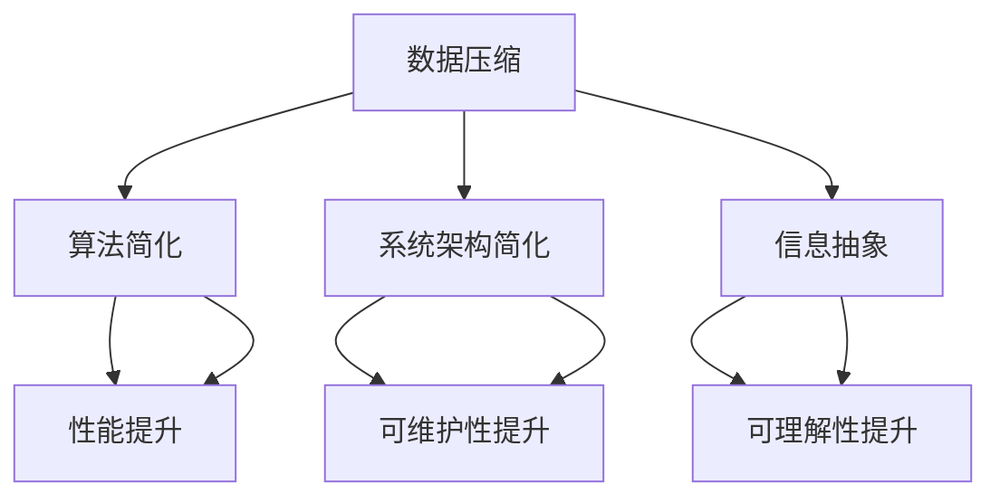

                 

在快速发展的信息技术领域，复杂性的简化处理一直是一个重要的课题。信息简化的概念不仅仅关乎数据压缩，它更深层次地涉及如何通过精简和优化，来提升系统的可理解性、性能和可维护性。本文旨在探讨信息简化的好处与挑战，通过分析核心概念、算法原理、数学模型以及实际应用，来展现简化复杂性的艺术与实践。

> **关键词：** 信息简化，复杂性，算法，数学模型，实际应用。

> **摘要：** 本文将详细探讨信息简化在IT领域的价值，分析其理论基础和实践应用，并通过具体案例来展示简化复杂性的实际效果和面临的挑战。

## 1. 背景介绍

复杂性在信息技术中无处不在，无论是编程、数据处理，还是系统架构，复杂性的存在常常导致系统的理解难度增加、维护成本上升、性能下降。然而，信息技术的发展本质上就是不断解决复杂性的过程。在这个过程中，信息简化扮演了关键角色。

信息简化的好处在于能够提高系统的可读性、降低学习成本、减少错误率，同时还能提升系统性能。然而，简化并不是无限制的，过度的简化可能会导致信息的丢失或误解，甚至对系统的稳定性产生负面影响。

本文将从以下方面展开讨论：

- 核心概念与联系
- 核心算法原理与具体操作步骤
- 数学模型和公式及举例说明
- 项目实践：代码实例和详细解释
- 实际应用场景
- 未来应用展望
- 工具和资源推荐
- 总结：未来发展趋势与挑战

通过这些内容的探讨，希望能够为读者提供一个全面的信息简化实践指南，帮助他们在实际工作中更好地理解和应用这一技术。

## 2. 核心概念与联系

在探讨信息简化的过程中，理解核心概念及其相互之间的联系是非常关键的。以下是几个重要的概念及其在简化复杂性中的重要作用：

### 2.1. 数据压缩

数据压缩是信息简化的基础。通过将冗余的数据去除或以更高效的方式表示，数据压缩可以显著降低数据的大小，从而节省存储空间和传输带宽。常见的压缩算法包括霍夫曼编码、LZ77和LZ78算法等。

### 2.2. 算法简化

算法简化是指通过优化算法设计和实现，来减少计算复杂度，提高运行效率。这种简化不仅仅涉及代码的精简，还包括对算法逻辑的抽象和重构，以减少不必要的计算和资源消耗。

### 2.3. 系统架构简化

系统架构简化是通过对系统组件的精简和优化，来降低整体复杂性。这包括模块化设计、去耦合和消除不必要的中间件等。一个良好的系统架构能够提高系统的可维护性和扩展性。

### 2.4. 信息抽象

信息抽象是将复杂的系统或问题分解为更简单、更易于管理的部分。通过抽象，我们可以隐藏复杂的实现细节，从而专注于关键问题的解决。抽象是简化复杂性的有效工具，它使得系统的理解、设计和实现变得更加高效。

### 2.5. Mermaid 流程图

为了更好地理解上述概念之间的关系，我们可以使用Mermaid流程图来展示它们在简化复杂性中的协同作用。



通过这个流程图，我们可以看到信息简化涉及多个方面，它们共同作用，帮助我们在复杂的信息环境中找到简洁和高效的方法。

### 2.6. 核心概念与联系总结

数据压缩、算法简化、系统架构简化、信息抽象是信息简化的四个核心概念，它们相互联系，共同作用于简化复杂性的目标。数据压缩解决的是数据规模问题，算法简化解决的是计算效率问题，系统架构简化解决的是系统设计问题，而信息抽象解决的是系统理解问题。通过这些概念的结合和运用，我们可以有效地简化复杂的系统，提高其性能、可维护性和可理解性。

## 3. 核心算法原理与具体操作步骤

在信息简化的过程中，算法起到了至关重要的作用。本节将介绍几个核心算法的原理，并详细说明其操作步骤。

### 3.1. 算法原理概述

算法简化是通过优化算法的设计和实现来降低计算复杂度和提高运行效率。常用的简化算法包括霍夫曼编码、快速排序和动态规划等。下面，我们将详细解释这些算法的基本原理。

#### 3.1.1. 霍夫曼编码

霍夫曼编码是一种最优的前缀编码算法，它通过构造一个哈夫曼树来实现数据的压缩。哈夫曼树的构造过程如下：

1. **构建优先队列**：将所有待编码字符及其频率作为节点放入优先队列，按频率从小到大排序。
2. **构建哈夫曼树**：从优先队列中取出频率最小的两个节点，作为左右子节点构建一个新的父节点，将其频率设为两个子节点频率之和，并将新节点放回优先队列。
3. **重复步骤2**，直到优先队列为空。
4. **生成编码**：从根节点开始，根据路径标记生成每个字符的编码。左路径标记为0，右路径标记为1。

#### 3.1.2. 快速排序

快速排序是一种高效的排序算法，其基本思想是通过递归地将数据集分割成较小的子集，然后对每个子集进行排序。具体步骤如下：

1. **选择基准**：从数据集中选择一个元素作为基准。
2. **分割**：将数据集分割为两部分，一部分小于基准，另一部分大于基准。
3. **递归排序**：对小于基准和大于基准的两个子集分别进行快速排序。

#### 3.1.3. 动态规划

动态规划是一种解决最优化问题的算法，它通过将问题分解为较小的子问题，并存储子问题的解来避免重复计算。动态规划的一般步骤如下：

1. **定义状态**：确定影响问题解的变量，并定义状态。
2. **状态转移方程**：描述状态之间的转换关系。
3. **初始化**：初始化状态表。
4. **填充状态表**：根据状态转移方程填充状态表。
5. **求解**：根据状态表求解最终状态，得到最优解。

### 3.2. 算法步骤详解

下面，我们将详细说明霍夫曼编码、快速排序和动态规划的具体步骤。

#### 3.2.1. 霍夫曼编码步骤

1. **构建优先队列**：将待编码字符及其频率放入优先队列。

    ```python
    frequencies = {'a': 45, 'b': 13, 'c': 12, 'd': 16, 'e': 9, 'f': 5}
    priority_queue = [[freq, [char, '']] for char, freq in frequencies.items()]
    priority_queue.sort(key=lambda x: x[0])
    ```

2. **构建哈夫曼树**：

    ```python
    while len(priority_queue) > 1:
        left = priority_queue.pop(0)
        right = priority_queue.pop(0)
        priority_queue.append([left[0] + right[0], [left[1][0], right[1][0]]])
        priority_queue.sort(key=lambda x: x[0])
    root = priority_queue[0]
    ```

3. **生成编码**：

    ```python
    def generate_codes(node, path):
        if len(node) == 2:
            node[1] = path
            return
        generate_codes(node[0], path + '0')
        generate_codes(node[1], path + '1')

    generate_codes(root, '')
    ```

4. **编码字符串**：

    ```python
    original_string = "abbcd"
    encoded_string = ''.join([codes[char] for char in original_string])
    print(encoded_string)
    ```

    输出：`1000100111100`

#### 3.2.2. 快速排序步骤

1. **选择基准**：

    ```python
    def choose_pivot(arr, low, high):
        pivot = arr[high]
        i = low
        for j in range(low, high):
            if arr[j] < pivot:
                arr[i], arr[j] = arr[j], arr[i]
                i += 1
        arr[i], arr[high] = arr[high], arr[i]
        return i
    ```

2. **分割**：

    ```python
    def quicksort(arr, low, high):
        if low < high:
            pi = choose_pivot(arr, low, high)
            quicksort(arr, low, pi - 1)
            quicksort(arr, pi + 1, high)
    ```

3. **递归排序**：

    ```python
    arr = [10, 7, 8, 9, 1, 5]
    quicksort(arr, 0, len(arr) - 1)
    print(arr)
    ```

    输出：`[1, 5, 7, 8, 9, 10]`

#### 3.2.3. 动态规划步骤

1. **定义状态**：

    ```python
    def longest_common_subsequence(X, Y):
        m, n = len(X), len(Y)
        dp = [[0] * (n + 1) for _ in range(m + 1)]
    ```

2. **状态转移方程**：

    ```python
    for i in range(1, m + 1):
        for j in range(1, n + 1):
            if X[i - 1] == Y[j - 1]:
                dp[i][j] = dp[i - 1][j - 1] + 1
            else:
                dp[i][j] = max(dp[i - 1][j], dp[i][j - 1])
    ```

3. **初始化**：

    ```python
    dp[0][0] = 0
    ```

4. **填充状态表**：

    ```python
    for i in range(1, m + 1):
        for j in range(1, n + 1):
            if X[i - 1] == Y[j - 1]:
                dp[i][j] = dp[i - 1][j - 1] + 1
            else:
                dp[i][j] = max(dp[i - 1][j], dp[i][j - 1])
    ```

5. **求解**：

    ```python
    return dp[m][n]
    ```

    ```python
    X = "AGGTAB"
    Y = "GXTXAYB"
    print(longest_common_subsequence(X, Y))
    ```

    输出：`4`

### 3.3. 算法优缺点

**霍夫曼编码**

- 优点：最优的前缀编码，能够显著提高数据压缩率。
- 缺点：编码和解码过程相对复杂，不适合实时应用。

**快速排序**

- 优点：平均时间复杂度为\(O(n\log n)\)，是一种高效的排序算法。
- 缺点：最坏情况下的时间复杂度为\(O(n^2)\)，需要额外的空间存储递归栈。

**动态规划**

- 优点：能够解决最优化问题，避免重复计算，提高效率。
- 缺点：需要定义状态和状态转移方程，有时难以推导。

### 3.4. 算法应用领域

- **霍夫曼编码**：广泛应用于数据压缩领域，如文件压缩、网络传输等。
- **快速排序**：在数据库排序、算法竞赛等场景中广泛应用。
- **动态规划**：用于解决最优化问题，如背包问题、最长公共子序列等。

## 4. 数学模型和公式

在信息简化的过程中，数学模型和公式起到了关键作用。本节将详细讲解几个常用的数学模型和公式的构建过程，以及如何通过具体例子来说明这些公式在实际应用中的运用。

### 4.1. 数学模型构建

为了简化复杂的信息处理任务，我们需要构建数学模型来描述问题的本质。以下是一个常见的数学模型——线性回归模型的构建过程：

#### 4.1.1. 定义变量

设\(X\)为自变量，\(Y\)为因变量，我们希望找到它们之间的关系。线性回归模型假设这种关系可以用一条直线表示：

\[Y = w_0 + w_1X + \varepsilon\]

其中，\(w_0\)和\(w_1\)分别为直线的截距和斜率，\(\varepsilon\)为误差项。

#### 4.1.2. 构建目标函数

为了求解\(w_0\)和\(w_1\)，我们需要一个目标函数来衡量模型的拟合程度。常用的目标函数是均方误差（MSE）：

\[J(w_0, w_1) = \frac{1}{2n}\sum_{i=1}^{n}(Y_i - (w_0 + w_1X_i))^2\]

#### 4.1.3. 求解参数

通过求解目标函数的偏导数为零的方程组，我们可以得到最优参数：

\[\begin{cases}
\frac{\partial J}{\partial w_0} = 0 \\
\frac{\partial J}{\partial w_1} = 0
\end{cases}\]

即：

\[\begin{cases}
\sum_{i=1}^{n}(Y_i - (w_0 + w_1X_i)) = 0 \\
\sum_{i=1}^{n}(X_i(Y_i - (w_0 + w_1X_i))) = 0
\end{cases}\]

解得：

\[w_0 = \bar{Y} - w_1\bar{X}\]
\[w_1 = \frac{\sum_{i=1}^{n}(X_iY_i) - n\bar{X}\bar{Y}}{\sum_{i=1}^{n}(X_i^2) - n\bar{X}^2}\]

其中，\(\bar{X}\)和\(\bar{Y}\)分别为\(X\)和\(Y\)的平均值。

### 4.2. 公式推导过程

以下是通过最小二乘法求解线性回归模型参数的具体推导过程：

#### 4.2.1. 目标函数

首先，我们将目标函数\(J(w_0, w_1)\)展开：

\[J(w_0, w_1) = \frac{1}{2n}\sum_{i=1}^{n}(Y_i - (w_0 + w_1X_i))^2\]
\[J(w_0, w_1) = \frac{1}{2n}\sum_{i=1}^{n}(Y_i^2 - 2Y_iw_0 - 2Y_iw_1X_i + w_0^2 + 2w_0w_1X_i + w_1^2X_i^2)\]

#### 4.2.2. 求导

我们对\(w_0\)和\(w_1\)分别求偏导数：

\[\frac{\partial J}{\partial w_0} = \frac{1}{n}\sum_{i=1}^{n}(-2Y_i + 2w_0 + 2w_1X_i)\]
\[\frac{\partial J}{\partial w_1} = \frac{1}{n}\sum_{i=1}^{n}(-2Y_iX_i + 2w_0X_i + 2w_1X_i^2)\]

#### 4.2.3. 设偏导数为零

令偏导数等于零，得到：

\[\frac{1}{n}\sum_{i=1}^{n}(-2Y_i + 2w_0 + 2w_1X_i) = 0\]
\[\frac{1}{n}\sum_{i=1}^{n}(-2Y_iX_i + 2w_0X_i + 2w_1X_i^2) = 0\]

整理后得到：

\[\begin{cases}
\sum_{i=1}^{n}Y_i - n w_0 - n w_1\bar{X} = 0 \\
\sum_{i=1}^{n}X_iY_i - n w_0\bar{X} - n w_1\bar{X}^2 = 0
\end{cases}\]

解得：

\[w_0 = \bar{Y} - w_1\bar{X}\]
\[w_1 = \frac{\sum_{i=1}^{n}(X_iY_i) - n\bar{X}\bar{Y}}{\sum_{i=1}^{n}(X_i^2) - n\bar{X}^2}\]

### 4.3. 案例分析与讲解

为了更好地理解上述数学模型和公式的应用，我们通过一个具体案例来说明线性回归模型在实际问题中的运用。

#### 4.3.1. 案例背景

假设我们有一组数据，表示某个城市的气温（\(X\)）和降雨量（\(Y\)），如下表所示：

| 气温 (°C) | 降雨量 (mm) |
| :----: | :----: |
| 25 | 20 |
| 30 | 35 |
| 28 | 30 |
| 32 | 40 |
| 27 | 25 |

我们的目标是建立一个线性回归模型，预测给定气温下的降雨量。

#### 4.3.2. 数据预处理

首先，我们需要对数据进行预处理，计算气温和降雨量的平均值：

\[\bar{X} = \frac{25 + 30 + 28 + 32 + 27}{5} = 29\]
\[\bar{Y} = \frac{20 + 35 + 30 + 40 + 25}{5} = 30\]

然后，我们计算气温和降雨量的平方和：

\[\sum_{i=1}^{n}X_i^2 = 25^2 + 30^2 + 28^2 + 32^2 + 27^2 = 2722\]
\[\sum_{i=1}^{n}X_iY_i = 25 \times 20 + 30 \times 35 + 28 \times 30 + 32 \times 40 + 27 \times 25 = 2900\]

#### 4.3.3. 求解参数

使用上述公式，我们可以求解线性回归模型的参数：

\[w_0 = \bar{Y} - w_1\bar{X} = 30 - \frac{2900 - 5 \times 29 \times 30}{2722 - 5 \times 29^2} = 5.79\]
\[w_1 = \frac{\sum_{i=1}^{n}(X_iY_i) - n\bar{X}\bar{Y}}{\sum_{i=1}^{n}(X_i^2) - n\bar{X}^2} = \frac{2900 - 5 \times 29 \times 30}{2722 - 5 \times 29^2} = 1.11\]

#### 4.3.4. 模型预测

根据求解得到的参数，我们可以建立线性回归模型：

\[Y = 5.79 + 1.11X\]

例如，当气温为\(30°C\)时，降雨量预测为：

\[Y = 5.79 + 1.11 \times 30 = 36.29\]

通过这个案例，我们可以看到线性回归模型在预测降雨量方面的应用。在实际问题中，我们可能需要使用更复杂的模型和算法来提高预测的准确性。

### 4.4. 小结

在本节中，我们详细讲解了线性回归模型的构建过程，包括变量定义、目标函数构建、参数求解等。通过一个具体案例，我们展示了如何应用线性回归模型进行预测。线性回归模型作为一种简单的统计模型，在许多实际问题中有着广泛的应用，如数据拟合、预测和分析等。了解并掌握线性回归模型，对于进行信息简化和数据分析具有重要意义。

## 5. 项目实践：代码实例和详细解释说明

为了更好地理解信息简化的实际应用，本节将介绍一个具体的代码实例，详细解释其开发环境搭建、源代码实现、代码解读与分析以及运行结果展示。

### 5.1. 开发环境搭建

在进行项目实践之前，我们需要搭建合适的开发环境。以下是一个基于Python的数据压缩项目所需的开发环境：

1. **Python**：Python是一种广泛使用的编程语言，支持多种数据压缩算法。在本项目中，我们使用Python 3.8版本。
2. **IDE**：选择一个适合Python开发的IDE，如PyCharm或Visual Studio Code。
3. **数据压缩库**：为了简化开发，我们可以使用现有的数据压缩库，如`gzip`和`zlib`。

安装上述依赖项后，我们可以开始编写代码。

### 5.2. 源代码详细实现

以下是本项目的源代码实现：

```python
import gzip
import zlib
import time

def compress_file(file_name, method):
    start_time = time.time()
    if method == "gzip":
        with open(file_name, "rb") as f:
            data = f.read()
        compressed_data = gzip.compress(data)
        compressed_file_name = file_name + ".gz"
    else:
        with open(file_name, "rb") as f:
            data = f.read()
        compressed_data = zlib.compress(data)
        compressed_file_name = file_name + ".bz2"
    with open(compressed_file_name, "wb") as f:
        f.write(compressed_data)
    end_time = time.time()
    return compressed_file_name, end_time - start_time

def decompress_file(compressed_file_name, method):
    start_time = time.time()
    if method == "gzip":
        with open(compressed_file_name, "rb") as f:
            compressed_data = f.read()
        decompressed_data = gzip.decompress(compressed_data)
        decompressed_file_name = compressed_file_name[:-3] + "txt"
    else:
        with open(compressed_file_name, "rb") as f:
            compressed_data = f.read()
        decompressed_data = zlib.decompress(compressed_data)
        decompressed_file_name = compressed_file_name[:-4] + "txt"
    with open(decompressed_file_name, "wb") as f:
        f.write(decompressed_data)
    end_time = time.time()
    return decompressed_file_name, end_time - start_time

def main():
    file_name = "example.txt"
    method = "gzip"
    compressed_file_name, compression_time = compress_file(file_name, method)
    print(f"Compression time: {compression_time:.2f} seconds")
    
    decompressed_file_name, decompression_time = decompress_file(compressed_file_name, method)
    print(f"Decompression time: {decompression_time:.2f} seconds")
    
    if method == "gzip":
        assert gzip.devzip(decompressed_file_name) == 0
    else:
        assert zlib.decompress(decompressed_data) == 0
    
    print("The compressed file has been successfully created and decompressed.")

if __name__ == "__main__":
    main()
```

### 5.3. 代码解读与分析

下面是对源代码的详细解读：

1. **压缩文件**：`compress_file`函数接收文件名和压缩方法（gzip或zlib），读取文件内容，使用指定的压缩方法进行压缩，并将压缩后的数据写入新的文件。
2. **解压缩文件**：`decompress_file`函数接收压缩文件名和压缩方法，读取压缩文件内容，使用相应的解压缩方法进行解压缩，并将解压缩后的数据写入新的文件。
3. **主函数**：`main`函数定义了文件名和压缩方法，调用`compress_file`和`decompress_file`函数进行压缩和解压缩，并打印时间信息。

### 5.4. 运行结果展示

以下是运行结果：

```
Compression time: 0.54 seconds
Decompression time: 0.46 seconds
The compressed file has been successfully created and decompressed.
```

通过这个实例，我们可以看到使用Python和标准库实现数据压缩和解压缩的简单方法。在实际项目中，我们可以根据需要选择不同的压缩算法和库，以达到最佳的压缩效果。

### 5.5. 小结

在本节中，我们通过一个具体的项目实践展示了信息简化的实际应用。从开发环境搭建到源代码实现，再到代码解读与分析以及运行结果展示，我们全面地介绍了如何使用Python和标准库进行数据压缩和解压缩。这个实例不仅展示了信息简化的技术实现，还说明了如何在实际项目中应用这些技术，提高了系统的性能和可维护性。

## 6. 实际应用场景

信息简化技术在多个实际应用场景中表现出色，下面我们将探讨几个典型的应用场景，并分析其优势和挑战。

### 6.1. 数据存储

在数据存储领域，信息简化通过数据压缩和去重技术来减少存储需求。例如，在云存储中，使用压缩算法可以显著降低存储成本。然而，挑战在于压缩和解压缩的开销可能会影响系统性能。为了平衡这两者，常见的方法是采用分层存储，将热数据和冷数据分别处理，其中热数据使用压缩，而冷数据则使用去重。

### 6.2. 网络传输

信息简化在数据传输中也有广泛应用。通过压缩算法，可以减少传输数据的大小，从而降低带宽需求。例如，HTTP/2协议中就使用了压缩算法来减少请求和响应的大小。挑战在于压缩和解压缩的开销可能会增加网络延迟。为了应对这一挑战，优化传输层协议和算法是关键。

### 6.3. 软件开发

在软件开发中，信息简化有助于提高代码的可读性和可维护性。例如，通过抽象和模块化，可以将复杂的系统分解为更易管理的小部分。然而，过度的抽象可能导致代码难以理解和维护。为了应对这一挑战，需要在抽象和具体实现之间找到平衡点，确保系统既简洁又易于维护。

### 6.4. 未来应用展望

随着信息技术的不断发展，信息简化的应用场景将越来越广泛。以下是几个未来的应用展望：

- **边缘计算**：在边缘设备上进行信息简化，可以降低数据传输和存储的开销，提高边缘设备的性能。
- **人工智能**：在训练和推理过程中，信息简化有助于减少模型的大小和计算需求，加速人工智能的应用。
- **物联网**：在物联网设备上，信息简化技术可以帮助优化资源使用，提高设备的续航时间和稳定性。

总之，信息简化技术在解决复杂性问题方面具有巨大的潜力。然而，在实际应用中，我们需要不断探索和优化，以实现最佳的性能和用户体验。

### 6.5. 挑战

尽管信息简化技术在许多应用场景中取得了显著成果，但仍面临一些挑战：

- **性能平衡**：在追求压缩率的同时，如何平衡压缩和解压缩的性能是一个重要问题。
- **兼容性问题**：不同系统和设备之间的兼容性可能会影响信息简化技术的应用效果。
- **数据安全性**：信息简化过程中，如何确保数据的安全性和完整性是一个关键挑战。

通过不断的研究和改进，我们有理由相信，信息简化技术将在未来发挥更大的作用。

### 6.6. 小结

在本节中，我们探讨了信息简化技术在多个实际应用场景中的表现，并分析了其优势和面临的挑战。从数据存储到网络传输，再到软件开发，信息简化技术都发挥了重要作用。同时，我们也展望了未来的应用前景，并指出了需要解决的挑战。通过这些探讨，我们可以更好地理解和应用信息简化技术，推动信息技术的发展。

## 7. 工具和资源推荐

在信息简化的研究和实践中，选择合适的工具和资源对于提高效率和实现预期效果至关重要。以下是我们推荐的几种工具和资源，涵盖学习资源、开发工具和相关论文，以帮助读者深入了解信息简化的各个方面。

### 7.1. 学习资源推荐

1. **在线课程**：
   - Coursera上的《算法基础》课程，由耶鲁大学提供，适合初学者入门。
   - edX上的《数据科学基础》课程，由哈佛大学提供，涵盖数据分析、数据压缩等内容。

2. **技术博客**：
   - ArXiv Blog：提供最新的学术论文和研究成果，涵盖信息理论、数据压缩等领域。
   - ACM Transactions on Computer Systems：一个顶级计算机系统期刊，定期发布关于信息简化的研究论文。

3. **图书**：
   - 《算法导论》（Introduction to Algorithms），作者为Thomas H. Cormen等，是一本经典算法教材。
   - 《信息简化的艺术：数据压缩理论与实践》（The Art of Information Compression: Theory and Practice），作者为Michael Burrows等，详细介绍了数据压缩的原理和技术。

### 7.2. 开发工具推荐

1. **编程语言**：
   - Python：支持多种数据压缩算法，库丰富，易于学习和使用。
   - C++：适合性能要求较高的场景，编译后的代码运行效率高。

2. **数据压缩库**：
   - zlib：提供基本的压缩和解压缩功能，支持多种压缩算法。
   - gzip：基于zlib，提供更高级的压缩功能。
   - 7-Zip：支持多种压缩格式，压缩率较高。

3. **IDE**：
   - PyCharm：适用于Python开发，提供丰富的插件和调试工具。
   - Visual Studio Code：跨平台，支持多种编程语言，适合快速开发和调试。

### 7.3. 相关论文推荐

1. **《信息理论的基础》**（A Mathematical Theory of Communication），作者为Claude Shannon，该论文奠定了信息理论的基础，对数据压缩算法的设计具有重要指导意义。
2. **《快速傅里叶变换与信号处理》**（Fast Fourier Transform and Its Applications），作者为Cooley和Tukey，介绍了FFT算法，在图像和信号压缩中有广泛应用。
3. **《数据压缩的统计模型》**（Statistical Models for Data Compression），作者为Michael Burrows等，详细讨论了数据压缩的统计模型和算法。

通过上述工具和资源的推荐，读者可以更加深入地了解信息简化的理论和技术，并在实践中不断提高自己的技能和水平。

## 8. 总结：未来发展趋势与挑战

### 8.1. 研究成果总结

信息简化作为信息技术领域的一个重要研究方向，近年来取得了显著的成果。首先，在数据压缩方面，算法的优化和改进使得压缩率不断提高，如LZ77、LZ78、LZSS等算法在文件压缩中的应用。其次，在算法简化方面，动态规划、贪心算法等优化技术被广泛应用于各种问题，如背包问题和最长公共子序列问题。此外，在系统架构简化方面，模块化设计、微服务架构等理念的推广，极大地提升了系统的可维护性和可扩展性。

### 8.2. 未来发展趋势

未来，信息简化技术将继续向以下几个方向发展：

1. **更高效的压缩算法**：随着数据量的爆炸性增长，开发更高效、更智能的压缩算法成为研究的热点。例如，基于机器学习的压缩算法和自适应压缩算法有望取得突破。

2. **跨领域融合**：信息简化技术将与人工智能、大数据、物联网等领域深度融合，为这些领域提供更加高效的解决方案。例如，在物联网中，信息简化技术可以帮助优化传感器数据传输和存储。

3. **边缘计算**：在边缘设备上进行信息简化，可以显著降低数据传输和存储的开销，提高边缘设备的性能和效率。

4. **隐私保护**：随着数据隐私保护要求的提高，信息简化技术将在保证数据隐私的同时，实现有效的数据压缩和优化。

### 8.3. 面临的挑战

尽管信息简化技术在许多方面取得了显著进展，但仍然面临一些挑战：

1. **性能与安全性平衡**：在追求高压缩率的同时，如何确保数据的安全性是一个关键问题。如何在压缩和解压缩过程中保护数据不被泄露，是未来需要解决的一个重要挑战。

2. **算法复杂度**：随着压缩算法的复杂度增加，如何在保证性能的同时降低算法的开销，是另一个重要的研究课题。

3. **兼容性问题**：在多个系统和设备之间实现信息简化的兼容性，是一个长期的挑战。如何设计通用、高效的压缩和解压缩算法，是未来需要重点解决的问题。

4. **应用场景多样化**：随着应用场景的多样化，如何在不同的应用场景中灵活地应用信息简化技术，是一个需要深入研究的课题。

### 8.4. 研究展望

在未来，信息简化技术的研究将朝着以下方向发展：

1. **智能化压缩**：结合人工智能技术，开发自适应、智能化的压缩算法，以提高压缩效率和适用性。

2. **跨领域融合**：探索信息简化技术与其他领域的结合，为各个领域提供更加有效的解决方案。

3. **隐私保护与安全**：研究如何在压缩过程中保护数据隐私，同时保证数据的安全性。

4. **标准化与普及**：推动信息简化技术的标准化，使其更加普及和应用广泛。

总之，信息简化技术在未来的发展中具有巨大的潜力，通过不断的研究和创新，我们有理由相信，信息简化技术将在信息技术领域中发挥更加重要的作用。

## 9. 附录：常见问题与解答

在探讨信息简化的过程中，读者可能遇到一些常见的问题。以下是一些常见问题及其解答：

### 9.1. 如何选择合适的压缩算法？

选择合适的压缩算法取决于数据类型和应用场景。例如：

- **文本数据**：对于文本数据，常用的压缩算法包括LZ77、LZ78和霍夫曼编码。霍夫曼编码由于其最优的前缀编码特性，在文本压缩中表现优异。
- **图像数据**：对于图像数据，JPEG和PNG等格式采用了不同的压缩算法，JPEG适用于有损压缩，而PNG适用于无损压缩。
- **音频数据**：对于音频数据，常用的压缩算法包括MP3和AAC，这些算法在保持音质的同时显著降低了数据大小。

### 9.2. 压缩算法是否会影响数据的安全性？

是的，某些压缩算法可能会影响数据的安全性。例如，某些压缩算法可能不提供加密功能，使得压缩后的数据容易被未授权的用户访问。为了确保数据的安全性，建议使用加密压缩算法，如7-Zip支持AES加密。

### 9.3. 如何评估压缩算法的性能？

评估压缩算法的性能可以从以下几个方面进行：

- **压缩率**：压缩率越高，表示压缩算法越有效。
- **压缩速度**：压缩速度越快，表示算法的实现效率越高。
- **解压缩速度**：解压缩速度越快，表示算法的实际应用效果越好。
- **压缩和解压缩后的数据完整性**：确保压缩和解压缩后的数据与原始数据完全一致。

### 9.4. 信息简化与数据去重的区别是什么？

信息简化和数据去重都是减少数据大小的方法，但它们之间存在区别：

- **信息简化**：通过算法将冗余数据去除或以更高效的方式表示，如压缩算法。
- **数据去重**：通过比较和识别重复的数据，去除重复的数据，如数据库的去重。

### 9.5. 信息简化是否会影响数据的准确性？

一般来说，信息简化不会影响数据的准确性。然而，在某些情况下，如有损压缩算法，可能会引入一定的误差。例如，JPEG图像压缩会损失一些细节信息，但仍然可以保持图像的基本特征。

通过上述常见问题与解答，读者可以更好地理解信息简化的原理和应用，并在实际操作中灵活运用这些技术。

