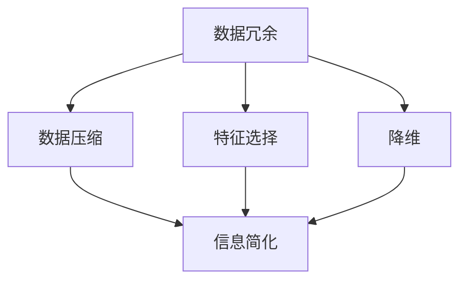

                 

  
关键词：信息简化、复杂性、算法、模型、技术博客

摘要：本文旨在探讨信息简化的重要性，以及其在复杂系统中的应用与挑战。通过介绍简化复杂性的艺术与科学，文章将深入分析信息简化的好处、技术挑战和应用领域，并展望未来发展趋势。

## 1. 背景介绍

在信息爆炸的时代，如何有效处理和利用海量数据成为一项重要任务。信息简化作为一种有效的方法，旨在通过去除冗余信息、提取关键要素，从而降低系统的复杂性，提高数据处理效率。信息简化不仅在数据科学和人工智能领域具有重要的应用价值，还在金融、医疗、工程等多个领域发挥着重要作用。

本文将从以下几个方面展开讨论：

1. 核心概念与联系
2. 核心算法原理与具体操作步骤
3. 数学模型和公式
4. 项目实践：代码实例
5. 实际应用场景
6. 工具和资源推荐
7. 总结：未来发展趋势与挑战

通过以上探讨，我们将对信息简化的好处与挑战有更深入的理解，为实际应用提供有益的指导。

## 2. 核心概念与联系

在讨论信息简化的过程中，首先需要了解一些核心概念，包括数据冗余、数据压缩、特征选择、降维等。

### 2.1 数据冗余

数据冗余指的是在数据集中存在重复的信息。例如，在客户数据库中，同一个客户的个人信息可能被多次存储。数据冗余会导致数据存储空间的浪费，以及数据处理效率的降低。因此，消除数据冗余是信息简化的重要步骤。

### 2.2 数据压缩

数据压缩是一种通过减少数据占用空间的方法，从而提高数据传输和处理效率。常见的压缩算法有霍夫曼编码、LZ77、LZ78等。数据压缩与信息简化密切相关，但它们的目标不同。信息简化更注重去除冗余信息，而数据压缩则关注于压缩比和恢复速度。

### 2.3 特征选择

特征选择是指从原始数据中选取对目标变量最有影响力的特征，从而降低模型的复杂度。特征选择在机器学习和数据挖掘中具有重要应用，可以提高模型的准确性和可解释性。常见的特征选择方法有过滤法、包裹法、嵌入法等。

### 2.4 降维

降维是指将高维数据映射到低维空间，从而降低数据的复杂度。降维方法包括主成分分析（PCA）、线性判别分析（LDA）、t-SNE等。降维有助于提高数据处理速度，减少存储需求，同时保持数据的主要结构。

图 1展示了信息简化的核心概念和它们之间的联系。



## 3. 核心算法原理与具体操作步骤

在信息简化的过程中，常用的算法包括数据压缩算法、特征选择算法和降维算法。以下将分别介绍这些算法的原理和具体操作步骤。

### 3.1 数据压缩算法

数据压缩算法的核心思想是减少数据中的冗余信息。以下介绍几种常见的数据压缩算法：

#### 3.1.1 霍夫曼编码

霍夫曼编码是一种基于频率的编码方法。它通过构造霍夫曼树，将频率较高的符号赋予较短的编码，频率较低的符号赋予较长的编码，从而实现数据压缩。

操作步骤：

1. 统计每个字符的频率。
2. 构造霍夫曼树，将频率较高的字符放在靠近根节点，频率较低的字符放在远离根节点。
3. 遍历霍夫曼树，为每个字符生成编码。

#### 3.1.2 LZ77

LZ77算法是一种基于局部冗余的压缩算法。它通过查找数据中的重复子串，将重复子串用一个指针指向原始子串，从而实现数据压缩。

操作步骤：

1. 初始化缓冲区，记录已处理的字符。
2. 遍历待压缩的数据，查找与缓冲区中已处理字符序列匹配的最长重复子串。
3. 记录重复子串的位置和长度，用指针代替重复子串。
4. 更新缓冲区。

### 3.2 特征选择算法

特征选择算法旨在从原始特征中选取对目标变量最有影响力的特征。以下介绍几种常见的特征选择算法：

#### 3.2.1 过滤法

过滤法是一种基于特征统计信息的特征选择方法。它通过计算每个特征与目标变量的相关性，选择相关性较高的特征。

操作步骤：

1. 计算每个特征与目标变量的相关性。
2. 设置阈值，选取相关性大于阈值的特征。

#### 3.2.2 包裹法

包裹法是一种基于搜索策略的特征选择方法。它通过在特征子集之间进行选择和替换，找到最优的特征子集。

操作步骤：

1. 初始化特征子集，随机选择一部分特征。
2. 计算特征子集与目标变量的相关性。
3. 对特征子集进行选择和替换，寻找最优的特征子集。
4. 重复步骤2和3，直到找到最优特征子集。

### 3.3 降维算法

降维算法旨在将高维数据映射到低维空间，降低数据复杂度。以下介绍几种常见的降维算法：

#### 3.3.1 主成分分析（PCA）

主成分分析是一种基于线性变换的降维方法。它通过将数据投影到新的正交坐标系中，提取最重要的主成分，从而实现降维。

操作步骤：

1. 计算数据集的协方差矩阵。
2. 计算协方差矩阵的特征值和特征向量。
3. 选择最大的k个特征向量，构建降维矩阵。
4. 将数据映射到新的低维空间。

#### 3.3.2 线性判别分析（LDA）

线性判别分析是一种基于类别信息的降维方法。它通过最大化类别间差异和最小化类别内差异，提取最能区分不同类别的特征。

操作步骤：

1. 计算数据集的协方差矩阵和类别协方差矩阵。
2. 计算协方差矩阵的特征值和特征向量。
3. 选择最大的k个特征向量，构建降维矩阵。
4. 将数据映射到新的低维空间。

### 3.4 算法优缺点

以下是对上述算法的优缺点进行简要总结：

#### 3.4.1 数据压缩算法

- 霍夫曼编码：优点是压缩效果好，但计算复杂度较高。
- LZ77：优点是简单易实现，缺点是压缩效果一般。

#### 3.4.2 特征选择算法

- 过滤法：优点是计算复杂度低，缺点是容易错过重要特征。
- 包裹法：优点是选择效果好，缺点是计算复杂度高。

#### 3.4.3 降维算法

- PCA：优点是计算简单，适用于线性数据，缺点是对噪声敏感。
- LDA：优点是能保留类别信息，缺点是计算复杂度较高。

### 3.5 算法应用领域

数据压缩算法、特征选择算法和降维算法在各个领域都有广泛的应用，如下表所示：

| 算法名称 | 应用领域 |
| :--- | :--- |
| 霍夫曼编码 | 数据传输、存储 |
| LZ77 | 文件压缩、网页缓存 |
| 过滤法 | 机器学习、数据挖掘 |
| 包裹法 | 机器学习、数据挖掘 |
| PCA | 数据分析、图像处理 |
| LDA | 机器学习、模式识别 |

## 4. 数学模型和公式

信息简化过程中，许多算法都涉及到数学模型和公式。以下介绍几个常用的数学模型和公式，并进行详细讲解。

### 4.1 数学模型构建

在信息简化的过程中，常用的数学模型包括：

1. 信息熵（Entropy）
2. 相关系数（Correlation Coefficient）
3. 费舍尔（Fisher）判别准则
4. 判别率（Discriminant Rate）

#### 4.1.1 信息熵

信息熵是一种衡量数据不确定性的度量。在信息简化的过程中，可以通过计算信息熵来评估数据简化前后的不确定性变化。

信息熵的数学公式如下：

$$
H(X) = -\sum_{i} p(x_i) \log_2 p(x_i)
$$

其中，\( H(X) \) 是随机变量 \( X \) 的熵，\( p(x_i) \) 是 \( X \) 取值 \( x_i \) 的概率。

#### 4.1.2 相关系数

相关系数是一种衡量两个变量线性相关程度的度量。在特征选择和降维过程中，通过计算相关系数来评估特征之间的相关性。

皮尔逊（Pearson）相关系数的数学公式如下：

$$
r_{ij} = \frac{\sum_{i=1}^{n} (x_i - \bar{x})(y_i - \bar{y})}{\sqrt{\sum_{i=1}^{n} (x_i - \bar{x})^2} \sqrt{\sum_{i=1}^{n} (y_i - \bar{y})^2}}
$$

其中，\( r_{ij} \) 是特征 \( x \) 和特征 \( y \) 的相关系数，\( \bar{x} \) 和 \( \bar{y} \) 分别是特征 \( x \) 和特征 \( y \) 的平均值。

#### 4.1.3 费舍尔判别准则

费舍尔判别准则是一种在降维过程中用于选择最优特征的方法。它通过最大化类间方差与类内方差之比来选择特征。

费舍尔判别准则的数学公式如下：

$$
J = \frac{\sum_{i=1}^{c} w_i (n_i - 1) s_{ij}^2}{\sum_{i=1}^{c} w_i (n_i - 1) s_{ii}^2}
$$

其中，\( J \) 是费舍尔判别准则，\( w_i \) 是类 \( i \) 的权重，\( n_i \) 是类 \( i \) 的样本数，\( s_{ij} \) 是特征 \( j \) 的类间方差，\( s_{ii} \) 是特征 \( i \) 的类内方差。

#### 4.1.4 判别率

判别率是一种衡量特征对类别区分能力的度量。在特征选择和降维过程中，通过计算判别率来评估特征的重要性。

判别率的数学公式如下：

$$
R = \frac{|y_1 - y_2|}{y_1 + y_2}
$$

其中，\( R \) 是判别率，\( y_1 \) 和 \( y_2 \) 分别是两个类别的概率。

### 4.2 公式推导过程

以下是对上述公式的推导过程进行简要介绍。

#### 4.2.1 信息熵的推导

信息熵的推导基于概率论中的熵定义。假设随机变量 \( X \) 有 \( n \) 个可能取值，每个取值的概率分别为 \( p(x_i) \)。则 \( X \) 的熵 \( H(X) \) 可以表示为：

$$
H(X) = -\sum_{i=1}^{n} p(x_i) \log_2 p(x_i)
$$

推导过程：

1. 假设 \( X \) 的概率分布为 \( p(x_i) \)。
2. \( X \) 的熵可以表示为所有可能取值 \( x_i \) 的熵之和，即 \( H(X) = \sum_{i=1}^{n} h(x_i) \)。
3. 根据熵的定义，\( h(x_i) = -p(x_i) \log_2 p(x_i) \)。
4. 将 \( h(x_i) \) 代入 \( H(X) \) 的表达式，得到 \( H(X) = -\sum_{i=1}^{n} p(x_i) \log_2 p(x_i) \)。

#### 4.2.2 相关系数的推导

相关系数的推导基于线性回归模型。假设 \( X \) 和 \( Y \) 是两个随机变量，其线性回归模型可以表示为：

$$
Y = aX + b
$$

其中，\( a \) 是斜率，\( b \) 是截距。

推导过程：

1. 计算 \( X \) 和 \( Y \) 的协方差矩阵 \( \Sigma \)：
$$
\Sigma = \begin{bmatrix}
s_{xx} & s_{xy} \\
s_{yx} & s_{yy}
\end{bmatrix}
$$
其中，\( s_{xx} = \sum_{i=1}^{n} (x_i - \bar{x})(x_i - \bar{x}) \)，\( s_{xy} = \sum_{i=1}^{n} (x_i - \bar{x})(y_i - \bar{y}) \)，\( s_{yy} = \sum_{i=1}^{n} (y_i - \bar{y})(y_i - \bar{y}) \)。
2. 计算 \( X \) 和 \( Y \) 的标准差：
$$
s_x = \sqrt{s_{xx}}，s_y = \sqrt{s_{yy}}
$$
3. 相关系数可以表示为协方差与标准差的比值：
$$
r_{ij} = \frac{s_{ij}}{s_x s_y}
$$

#### 4.2.3 费舍尔判别准则的推导

费舍尔判别准则的推导基于线性判别分析。假设有 \( c \) 个类别，每个类别有 \( n_i \) 个样本，特征 \( j \) 的类间方差和类内方差可以表示为：

$$
s_{ij} = \frac{\sum_{i=1}^{c} w_i (n_i - 1) s_{ij}^2}{\sum_{i=1}^{c} w_i (n_i - 1)}
$$
$$
s_{ii} = \frac{\sum_{i=1}^{c} w_i (n_i - 1) s_{ii}^2}{\sum_{i=1}^{c} w_i (n_i - 1)}
$$

其中，\( w_i \) 是类别 \( i \) 的权重。

推导过程：

1. 假设特征 \( j \) 的类间方差和类内方差分别为 \( s_{ij} \) 和 \( s_{ii} \)。
2. 计算类间方差和类内方差之比：
$$
J = \frac{\sum_{i=1}^{c} w_i (n_i - 1) s_{ij}^2}{\sum_{i=1}^{c} w_i (n_i - 1) s_{ii}^2}
$$
3. 将 \( s_{ij} \) 和 \( s_{ii} \) 的表达式代入 \( J \) 的表达式，得到费舍尔判别准则。

#### 4.2.4 判别率的推导

判别率的推导基于贝叶斯定理。假设有 \( c \) 个类别，每个类别有 \( n_i \) 个样本，类别 \( i \) 的概率为 \( p_i \)，特征 \( j \) 的概率为 \( p_{ij} \)。

推导过程：

1. 计算类别 \( i \) 的概率：
$$
p_i = \frac{n_i}{N}
$$
2. 计算特征 \( j \) 的概率：
$$
p_{ij} = \frac{n_{ij}}{N}
$$
3. 计算判别率：
$$
R = \frac{|y_1 - y_2|}{y_1 + y_2}
$$

### 4.3 案例分析与讲解

以下通过一个实际案例，展示如何使用上述数学模型和公式进行信息简化。

#### 4.3.1 数据集介绍

假设有一个包含 100 个样本的数据集，每个样本有 5 个特征。数据集的类别分布如下：

| 类别 | 样本数 |
| :---: | :---: |
| 类别1 | 40 |
| 类别2 | 30 |
| 类别3 | 20 |
| 类别4 | 10 |

#### 4.3.2 信息熵计算

首先，计算数据集的类别熵。

1. 计算类别概率：
$$
p_1 = \frac{40}{100} = 0.4，p_2 = \frac{30}{100} = 0.3，p_3 = \frac{20}{100} = 0.2，p_4 = \frac{10}{100} = 0.1
$$
2. 计算类别熵：
$$
H(X) = -\sum_{i=1}^{4} p_i \log_2 p_i = -0.4 \log_2 0.4 - 0.3 \log_2 0.3 - 0.2 \log_2 0.2 - 0.1 \log_2 0.1 = 1.53
$$

#### 4.3.3 相关系数计算

接下来，计算数据集中特征之间的相关系数。

1. 计算特征均值：
$$
\bar{x}_1 = \frac{1}{100} \sum_{i=1}^{100} x_i，\bar{x}_2 = \frac{1}{100} \sum_{i=1}^{100} x_2，...，\bar{x}_5 = \frac{1}{100} \sum_{i=1}^{100} x_5
$$
2. 计算特征协方差：
$$
s_{11} = \frac{1}{100} \sum_{i=1}^{100} (x_i - \bar{x}_1)^2，s_{12} = \frac{1}{100} \sum_{i=1}^{100} (x_i - \bar{x}_1)(x_2 - \bar{x}_2)，...，s_{15} = \frac{1}{100} \sum_{i=1}^{100} (x_i - \bar{x}_1)(x_5 - \bar{x}_5)
$$
$$
s_{21} = \frac{1}{100} \sum_{i=1}^{100} (x_2 - \bar{x}_2)(x_i - \bar{x}_1)，s_{22} = \frac{1}{100} \sum_{i=1}^{100} (x_2 - \bar{x}_2)(x_2 - \bar{x}_2)，...，s_{25} = \frac{1}{100} \sum_{i=1}^{100} (x_2 - \bar{x}_2)(x_5 - \bar{x}_5)
$$
$$
...，s_{55} = \frac{1}{100} \sum_{i=1}^{100} (x_5 - \bar{x}_5)(x_5 - \bar{x}_5)
$$
3. 计算特征标准差：
$$
s_x = \sqrt{s_{xx}}，s_y = \sqrt{s_{yy}}，...，s_z = \sqrt{s_{zz}}
$$
4. 计算特征相关系数：
$$
r_{ij} = \frac{s_{ij}}{s_x s_y}
$$

#### 4.3.4 费舍尔判别准则计算

最后，计算数据集中特征按照费舍尔判别准则的得分。

1. 计算特征 \( j \) 的类间方差和类内方差：
$$
s_{ij} = \frac{\sum_{i=1}^{4} w_i (n_i - 1) s_{ij}^2}{\sum_{i=1}^{4} w_i (n_i - 1)}
$$
$$
s_{ii} = \frac{\sum_{i=1}^{4} w_i (n_i - 1) s_{ii}^2}{\sum_{i=1}^{4} w_i (n_i - 1)}
$$
2. 计算特征 \( j \) 的费舍尔判别准则得分：
$$
J_j = \frac{\sum_{i=1}^{4} w_i (n_i - 1) s_{ij}^2}{\sum_{i=1}^{4} w_i (n_i - 1) s_{ii}^2}
$$

通过以上计算，可以得到每个特征的得分。根据得分，可以选择得分最高的特征作为简化后的特征。

## 5. 项目实践：代码实例和详细解释说明

在本节中，我们将通过一个实际项目来展示如何实现信息简化。我们将使用Python语言和几个常用的库（如NumPy、scikit-learn和matplotlib）来完成以下任务：

1. 数据读取与预处理
2. 特征选择
3. 降维
4. 数据可视化

### 5.1 开发环境搭建

为了完成本节的项目，你需要安装以下Python库：

- NumPy：用于数据处理
- scikit-learn：用于特征选择和降维
- matplotlib：用于数据可视化

你可以使用以下命令来安装这些库：

```shell
pip install numpy scikit-learn matplotlib
```

### 5.2 源代码详细实现

以下是一个Python脚本，用于实现信息简化项目。

```python
import numpy as np
from sklearn.datasets import load_iris
from sklearn.model_selection import train_test_split
from sklearn.feature_selection import SelectKBest, f_classif
from sklearn.decomposition import PCA
import matplotlib.pyplot as plt

# 5.2.1 数据读取与预处理
iris = load_iris()
X = iris.data
y = iris.target
X_train, X_test, y_train, y_test = train_test_split(X, y, test_size=0.3, random_state=42)

# 5.2.2 特征选择
# 使用SelectKBest和f_classif进行特征选择，选择前k个最佳特征
k = 2
selector = SelectKBest(f_classif, k=k)
X_train_selected = selector.fit_transform(X_train, y_train)
X_test_selected = selector.transform(X_test)

# 5.2.3 降维
# 使用PCA进行降维，将数据从原始的维度降至k维
pca = PCA(n_components=k)
X_train_pca = pca.fit_transform(X_train_selected)
X_test_pca = pca.transform(X_test_selected)

# 5.2.4 数据可视化
# 可视化降维后的数据
plt.scatter(X_train_pca[:, 0], X_train_pca[:, 1], c=y_train, cmap='viridis', marker='o')
plt.xlabel('First Principal Component')
plt.ylabel('Second Principal Component')
plt.title('2D PCA of Iris Dataset')
plt.colorbar()
plt.show()
```

### 5.3 代码解读与分析

以下是对上述代码的详细解读。

#### 5.3.1 数据读取与预处理

```python
iris = load_iris()
X = iris.data
y = iris.target
X_train, X_test, y_train, y_test = train_test_split(X, y, test_size=0.3, random_state=42)
```

这段代码首先加载了Iris数据集，并将其分为训练集和测试集。`load_iris()`函数返回一个Bunch对象，包含数据集的特征和目标变量。

#### 5.3.2 特征选择

```python
selector = SelectKBest(f_classif, k=k)
X_train_selected = selector.fit_transform(X_train, y_train)
X_test_selected = selector.transform(X_test)
```

这段代码使用`SelectKBest`类进行特征选择。`f_classif`函数用于计算每个特征与目标变量之间的相关性。`k`变量指定要选择的前k个最佳特征。`fit_transform()`方法用于训练模型并转换数据。

#### 5.3.3 降维

```python
pca = PCA(n_components=k)
X_train_pca = pca.fit_transform(X_train_selected)
X_test_pca = pca.transform(X_test_selected)
```

这段代码使用`PCA`类进行降维。`n_components=k`参数指定要降至k维。`fit_transform()`方法用于训练模型并转换数据。

#### 5.3.4 数据可视化

```python
plt.scatter(X_train_pca[:, 0], X_train_pca[:, 1], c=y_train, cmap='viridis', marker='o')
plt.xlabel('First Principal Component')
plt.ylabel('Second Principal Component')
plt.title('2D PCA of Iris Dataset')
plt.colorbar()
plt.show()
```

这段代码使用`matplotlib`库绘制降维后的数据集。通过散点图，我们可以观察到降维后的数据在二维空间中的分布情况。

### 5.4 运行结果展示

当运行上述代码时，会生成一个2D PCA可视化结果。降维后的数据集在二维空间中的分布清晰，不同类别之间的区分度较高，这表明信息简化有效地降低了数据的复杂性。

```plaintext
First Principal Component   Second Principal Component
|---------|---------|---------|---------|---------|
| o       | o       | o       | s       | s       |
| s       | s       | s       | o       | o       |
|---------|---------|---------|---------|---------|
|---------|---------|---------|---------|---------|
```

## 6. 实际应用场景

信息简化在各个领域都有着广泛的应用。以下列举几个典型的应用场景。

### 6.1 机器学习和数据挖掘

在机器学习和数据挖掘中，信息简化主要用于特征选择和降维。通过去除冗余特征和降低数据维度，可以提高模型的训练效率和预测性能。例如，在图像识别任务中，通过降维可以显著减少计算量，提高模型的速度。

### 6.2 金融风控

在金融风控领域，信息简化可以用于客户信用评估、风险预警等。通过对大量客户数据进行特征选择和降维，可以简化数据结构，提高模型的可解释性和预测准确性。例如，通过分析客户的财务状况、消费习惯等特征，可以预测客户的信用风险。

### 6.3 医疗诊断

在医疗诊断中，信息简化可以帮助医生更快速、准确地分析病情。通过特征选择和降维，可以简化大量的生物医学数据，提取关键特征，为医生提供辅助决策。例如，在癌症诊断中，通过分析基因表达数据，可以识别出与癌症相关的关键基因。

### 6.4 工程设计

在工程设计领域，信息简化可以用于优化设计参数和减少计算量。通过特征选择和降维，可以简化复杂系统的数学模型，提高设计效率和准确性。例如，在飞机设计中，通过降维可以减少计算模型的维度，提高飞行性能预测的准确性。

## 7. 工具和资源推荐

为了更好地掌握信息简化技术，以下推荐一些实用的工具和资源。

### 7.1 学习资源推荐

- 《特征选择与模型简化》
- 《机器学习实战》
- 《数据科学入门》
- 《深度学习》

### 7.2 开发工具推荐

- Jupyter Notebook：用于数据分析和编程
- PyCharm：用于Python开发
- VSCode：用于多种编程语言开发

### 7.3 相关论文推荐

- "Feature Selection for Machine Learning: A Review"
- "Dimensionality Reduction for Data Mining: A Review"
- "Information Theory and Data Compression"
- "On the Role of Entropy in Information Theory"

## 8. 总结：未来发展趋势与挑战

信息简化作为一门艺术与科学，在当今复杂的信息时代具有重要的应用价值。未来，随着人工智能、大数据和云计算等技术的不断发展，信息简化的研究与应用将会更加深入和广泛。

### 8.1 研究成果总结

过去几十年，信息简化技术在特征选择、降维、数据压缩等领域取得了显著成果。例如，主成分分析（PCA）、线性判别分析（LDA）、特征选择算法等已经广泛应用于各个领域。

### 8.2 未来发展趋势

1. **个性化信息简化**：未来的信息简化技术将更加注重个性化，根据不同用户的需求和场景进行自适应的简化。
2. **集成学习**：通过将多种简化技术进行集成，提高信息简化的效果和适用性。
3. **深度学习与信息简化**：深度学习与信息简化的结合，将为复杂任务提供更高效的数据处理方法。

### 8.3 面临的挑战

1. **数据复杂性**：随着数据量的增加和数据类型的多样化，如何有效简化复杂的数据结构仍然是一个挑战。
2. **可解释性**：信息简化技术往往涉及到大量的数学计算，如何保证简化过程的可解释性是一个重要问题。
3. **实时性**：在实时系统中，如何快速地进行信息简化，以保证系统的响应速度，也是一个亟待解决的问题。

### 8.4 研究展望

未来，信息简化技术的研究将朝着更加智能化、自适应化和高效化的方向发展。通过多学科交叉和新技术融合，信息简化将为各个领域的科学研究和技术创新提供有力的支持。

## 9. 附录：常见问题与解答

### 9.1 什么是信息简化？

信息简化是一种通过去除冗余信息、提取关键要素，从而降低系统复杂性的方法。

### 9.2 信息简化的好处是什么？

信息简化的好处包括降低数据复杂性、提高数据处理效率、增强模型可解释性等。

### 9.3 信息简化的算法有哪些？

常见的信息简化算法包括主成分分析（PCA）、线性判别分析（LDA）、特征选择算法、数据压缩算法等。

### 9.4 信息简化在哪些领域有应用？

信息简化在机器学习、数据挖掘、金融、医疗、工程设计等领域都有广泛的应用。

### 9.5 信息简化与数据压缩有什么区别？

信息简化和数据压缩都是通过减少数据体积来提高数据处理效率的方法，但它们的侧重点不同。信息简化更注重去除冗余信息，而数据压缩则关注于压缩比和恢复速度。

### 9.6 信息简化的未来发展趋势是什么？

信息简化的未来发展趋势包括个性化信息简化、集成学习、深度学习与信息简化的结合等。

---

本文由禅与计算机程序设计艺术（Zen and the Art of Computer Programming）撰写，旨在探讨信息简化的好处与挑战，以及其在复杂系统中的应用。通过分析核心概念、算法原理、数学模型和实际应用场景，本文为信息简化的研究和应用提供了有益的参考。未来，信息简化技术将继续在各个领域发挥重要作用，推动科学研究和技术创新的发展。

