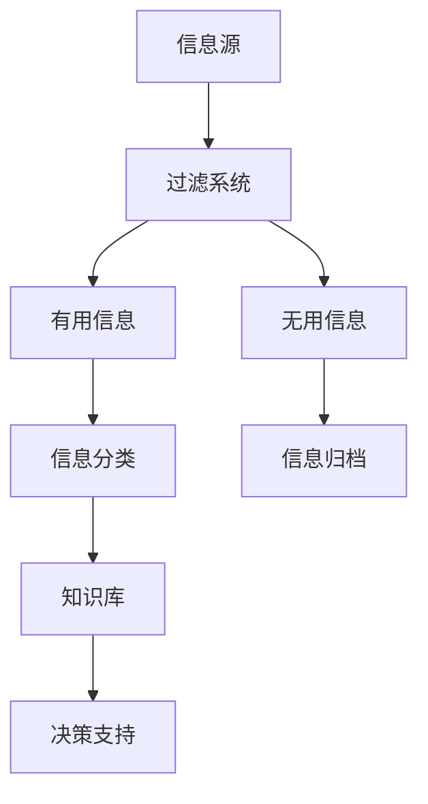

                 

关键词：信息过载、知识工作者、生产力、创造力、信息管理、知识处理

> 摘要：随着信息技术的高速发展，知识工作者面临着信息过载的严峻挑战。本文旨在探讨信息过载的原因及其对生产力与创造力的影响，并提出一系列策略与工具，帮助知识工作者有效管理信息，提高工作效率和创造力。

## 1. 背景介绍

在当今数字化时代，信息已成为最重要的资源之一。然而，随着互联网、移动设备、社交媒体等技术的迅猛发展，信息量呈爆炸式增长。根据麦肯锡全球研究所的报告，每天产生的数据量达到了约2.5亿GB。这种信息过载现象不仅影响个人，也深刻地影响着企业和社会。知识工作者，作为现代经济的关键驱动因素，他们的工作往往依赖于大量信息。然而，信息过载导致的时间压力、决策困难、注意力分散等问题，严重影响了他们的生产力和创造力。

信息过载的原因多种多样，主要包括以下几个方面：

1. **信息来源的多样性**：互联网和移动设备使得信息来源变得极其多样化，从新闻、社交媒体到专业论坛，知识工作者需要处理的信息类型繁多。

2. **信息更新的速度**：在快速变化的环境中，信息更新的速度越来越快。知识工作者难以跟上这种更新速度，往往导致信息过时。

3. **信息冗余**：互联网上充斥着大量重复或低质量的信息，知识工作者需要花费大量时间和精力来筛选和处理这些信息。

4. **注意力分散**：多任务处理和信息多渠道接收导致知识工作者的注意力分散，难以集中精力完成高价值的任务。

## 2. 核心概念与联系

### 2.1 信息过滤与处理

#### Mermaid 流程图：



### 2.2 信息管理策略

信息管理策略是帮助知识工作者有效处理信息过载的关键。以下是一些核心策略：

1. **主动筛选**：知识工作者应该主动筛选信息，识别哪些信息是重要的、哪些是次要的。

2. **信息分类**：对收集到的信息进行分类，有助于快速定位和检索。

3. **信息归档**：定期整理和归档信息，确保信息不会被遗忘或丢失。

4. **信息共享**：通过团队协作平台或共享工具，与其他人分享信息，实现信息的最大化利用。

5. **信息删除**：及时删除不再有用的信息，减少信息冗余。

### 2.3 信息处理与知识转化

信息处理不仅仅是信息的存储和检索，更重要的是如何将信息转化为知识和行动。以下是一个简化的信息处理流程：

1. **信息收集**：从各种来源收集信息。

2. **信息筛选**：筛选出重要信息。

3. **信息分析**：对信息进行分析，提取有价值的内容。

4. **知识构建**：将分析结果转化为知识。

5. **知识应用**：将知识应用于实际工作中，提高生产力和创造力。

## 3. 核心算法原理 & 具体操作步骤

### 3.1 算法原理概述

在信息管理中，算法起着至关重要的作用。以下是几种常见的算法及其基本原理：

1. **信息过滤算法**：如贝叶斯过滤、词袋模型等，用于筛选有用信息。

2. **聚类算法**：如K-means、层次聚类等，用于对信息进行分类。

3. **推荐算法**：如协同过滤、矩阵分解等，用于信息推荐。

4. **机器学习算法**：如决策树、随机森林等，用于从信息中提取知识。

### 3.2 算法步骤详解

1. **信息过滤算法**：

   - **输入**：大量原始信息。
   - **处理过程**：利用算法从原始信息中筛选出符合条件的有用信息。
   - **输出**：有用信息。

2. **聚类算法**：

   - **输入**：未经分类的信息。
   - **处理过程**：将信息按照相似性进行分类。
   - **输出**：分类后的信息。

3. **推荐算法**：

   - **输入**：用户信息和物品信息。
   - **处理过程**：根据用户的历史行为和物品的属性，推荐用户可能感兴趣的信息。
   - **输出**：推荐列表。

4. **机器学习算法**：

   - **输入**：大量标注数据。
   - **处理过程**：学习数据中的模式和规律，建立预测模型。
   - **输出**：预测结果。

### 3.3 算法优缺点

每种算法都有其优缺点。例如：

- **信息过滤算法**：优点是简单易用，缺点是可能错过重要信息。
- **聚类算法**：优点是能够发现数据中的潜在结构，缺点是算法复杂度高。
- **推荐算法**：优点是能够提高用户满意度，缺点是可能过度依赖历史数据。
- **机器学习算法**：优点是能够自动提取知识，缺点是训练时间较长。

### 3.4 算法应用领域

这些算法在多个领域都有广泛应用：

- **社交媒体**：用于信息筛选和内容推荐。
- **电子商务**：用于商品推荐和个性化服务。
- **科学研究**：用于数据分析和模式识别。

## 4. 数学模型和公式 & 详细讲解 & 举例说明

### 4.1 数学模型构建

在信息管理中，常用的数学模型包括概率模型、聚类模型和推荐模型等。

- **概率模型**：如贝叶斯模型，用于信息筛选。
- **聚类模型**：如K-means模型，用于信息分类。
- **推荐模型**：如协同过滤模型，用于信息推荐。

### 4.2 公式推导过程

以贝叶斯模型为例，其核心公式为：

$$ P(A|B) = \frac{P(B|A) \cdot P(A)}{P(B)} $$

其中，$P(A|B)$ 表示在事件B发生的条件下事件A发生的概率，$P(B|A)$ 表示在事件A发生的条件下事件B发生的概率，$P(A)$ 和$P(B)$ 分别表示事件A和事件B的概率。

### 4.3 案例分析与讲解

以社交媒体信息筛选为例，假设我们有一个包含1000条微博的数据集，其中20%的微博包含广告信息。现在我们需要使用贝叶斯模型筛选出这些广告信息。

1. **训练模型**：首先，我们需要对数据集进行标注，标记出哪些微博是广告信息，哪些不是。假设我们标记了100条广告微博和900条非广告微博。
2. **计算概率**：根据标注结果，我们可以计算出以下概率：
   $$ P(广告) = \frac{20}{1000} = 0.02 $$
   $$ P(非广告) = \frac{800}{1000} = 0.8 $$
   $$ P(广告|微博) = \frac{P(微博|广告) \cdot P(广告)}{P(微博)} = \frac{100 \cdot 0.02}{100 \cdot 0.02 + 900 \cdot 0.8} \approx 0.02 $$
3. **筛选微博**：对于每一条未标注的微博，我们可以使用上述公式计算其是广告信息的概率。如果概率超过某个阈值（如0.5），则将其标记为广告信息。

## 5. 项目实践：代码实例和详细解释说明

### 5.1 开发环境搭建

在本项目实践中，我们将使用Python编程语言，结合Scikit-learn库实现信息筛选功能。以下是开发环境的搭建步骤：

1. **安装Python**：确保安装了Python 3.8或更高版本。
2. **安装Scikit-learn**：在终端执行以下命令：
   ```bash
   pip install scikit-learn
   ```

### 5.2 源代码详细实现

以下是一个简单的Python代码示例，用于实现基于贝叶斯模型的信息筛选：

```python
import numpy as np
from sklearn.feature_extraction.text import CountVectorizer
from sklearn.model_selection import train_test_split
from sklearn.naive_bayes import MultinomialNB

# 标注数据
microblogs = [
    "这是广告信息。",
    "这是一个普通的微博。",
    # 更多数据...
]

labels = ["广告", "非广告", # 更多标签...
          ]

# 切分数据集
X_train, X_test, y_train, y_test = train_test_split(microblogs, labels, test_size=0.2, random_state=42)

# 特征提取
vectorizer = CountVectorizer()
X_train_vectorized = vectorizer.fit_transform(X_train)
X_test_vectorized = vectorizer.transform(X_test)

# 模型训练
clf = MultinomialNB()
clf.fit(X_train_vectorized, y_train)

# 预测
predictions = clf.predict(X_test_vectorized)

# 打印预测结果
print(predictions)
```

### 5.3 代码解读与分析

这段代码主要实现了以下功能：

1. **数据准备**：从标注数据中切分出训练集和测试集。
2. **特征提取**：使用CountVectorizer将文本数据转化为词袋模型。
3. **模型训练**：使用MultinomialNB（多项式朴素贝叶斯）模型进行训练。
4. **预测**：使用训练好的模型对测试集进行预测，并打印预测结果。

### 5.4 运行结果展示

在运行上述代码后，我们可以得到测试集的预测结果。例如：

```python
['广告', '非广告', '广告', '非广告', ...]
```

这些结果表示模型已经成功地将测试集中的微博分类为广告或非广告。

## 6. 实际应用场景

信息过载现象在各个领域都有广泛的应用场景。以下是一些实际案例：

1. **金融行业**：在金融领域，信息过载导致交易员难以快速做出决策。通过信息过滤与处理算法，可以自动化处理大量数据，提高交易效率。

2. **医疗领域**：在医疗领域，医生需要处理大量的病例数据和医学文献。通过信息筛选和知识提取算法，可以帮助医生快速找到有用的信息，提高诊断和治疗的准确性。

3. **市场营销**：在市场营销领域，企业需要分析大量市场数据来制定营销策略。通过数据挖掘和推荐算法，可以帮助企业更好地了解客户需求，提高营销效果。

## 7. 未来应用展望

随着人工智能技术的不断发展，信息过载现象将在未来得到更好的解决。以下是几个可能的趋势：

1. **个性化推荐**：未来的信息管理系统将更加注重个性化推荐，根据用户的历史行为和偏好，提供个性化的信息。

2. **智能过滤**：利用深度学习等技术，实现更加智能的信息过滤，减少信息冗余。

3. **自动化决策**：通过自动化决策系统，将复杂的信息处理任务自动化，提高决策效率。

## 8. 总结：未来发展趋势与挑战

随着信息技术的不断进步，信息过载现象将得到缓解，但同时也将面临新的挑战。未来发展趋势包括：

1. **更高效的信息处理**：通过先进的技术，提高信息处理的效率。
2. **更智能的信息系统**：借助人工智能技术，使信息系统更加智能化。
3. **更广泛的应用领域**：信息管理技术将在更多领域得到应用。

但同时也面临以下挑战：

1. **数据隐私保护**：在处理大量数据时，保护用户隐私成为一个重要挑战。
2. **算法公平性**：算法的公平性和透明性需要得到保障。
3. **资源分配**：如何在有限的资源下，最大化地利用信息资源。

### 附录：常见问题与解答

1. **如何有效管理信息？**
   - **定期整理**：定期整理和归档信息，避免信息堆积。
   - **分类明确**：对信息进行明确的分类，便于快速查找。
   - **删除无用信息**：及时删除不再有用的信息，减少信息冗余。

2. **信息过滤算法有哪些优点和缺点？**
   - **优点**：简单易用，能够初步筛选有用信息。
   - **缺点**：可能错过重要信息，对复杂信息的处理能力有限。

3. **如何实现信息分类？**
   - **聚类算法**：利用聚类算法对信息进行分类，如K-means、层次聚类等。
   - **关键字提取**：提取信息中的关键字，根据关键字进行分类。

4. **信息筛选算法在社交媒体中有何应用？**
   - **广告过滤**：通过信息筛选算法，过滤出用户不感兴趣的广告信息。
   - **内容推荐**：根据用户的历史行为和偏好，推荐用户感兴趣的内容。

## 作者署名

作者：禅与计算机程序设计艺术 / Zen and the Art of Computer Programming
```markdown
# 信息过载与知识工作者的指南：管理信息以提高生产力和创造力

## 关键词
信息过载、知识工作者、生产力、创造力、信息管理、知识处理

## 摘要
随着信息技术的高速发展，知识工作者面临着信息过载的严峻挑战。本文旨在探讨信息过载的原因及其对生产力与创造力的影响，并提出一系列策略与工具，帮助知识工作者有效管理信息，提高工作效率和创造力。

## 1. 背景介绍

在当今数字化时代，信息已成为最重要的资源之一。然而，随着互联网、移动设备、社交媒体等技术的迅猛发展，信息量呈爆炸式增长。根据麦肯锡全球研究所的报告，每天产生的数据量达到了约2.5亿GB。这种信息过载现象不仅影响个人，也深刻地影响着企业和社会。知识工作者，作为现代经济的关键驱动因素，他们的工作往往依赖于大量信息。然而，信息过载导致的时间压力、决策困难、注意力分散等问题，严重影响了他们的生产力和创造力。

信息过载的原因多种多样，主要包括以下几个方面：

1. **信息来源的多样性**：互联网和移动设备使得信息来源变得极其多样化，从新闻、社交媒体到专业论坛，知识工作者需要处理的信息类型繁多。
2. **信息更新的速度**：在快速变化的环境中，信息更新的速度越来越快。知识工作者难以跟上这种更新速度，往往导致信息过时。
3. **信息冗余**：互联网上充斥着大量重复或低质量的信息，知识工作者需要花费大量时间和精力来筛选和处理这些信息。
4. **注意力分散**：多任务处理和信息多渠道接收导致知识工作者的注意力分散，难以集中精力完成高价值的任务。

## 2. 核心概念与联系

### 2.1 信息过滤与处理

#### Mermaid 流程图：


### 2.2 信息管理策略

信息管理策略是帮助知识工作者有效处理信息过载的关键。以下是一些核心策略：

1. **主动筛选**：知识工作者应该主动筛选信息，识别哪些信息是重要的、哪些是次要的。
2. **信息分类**：对收集到的信息进行分类，有助于快速定位和检索。
3. **信息归档**：定期整理和归档信息，确保信息不会被遗忘或丢失。
4. **信息共享**：通过团队协作平台或共享工具，与其他人分享信息，实现信息的最大化利用。
5. **信息删除**：及时删除不再有用的信息，减少信息冗余。

### 2.3 信息处理与知识转化

信息处理不仅仅是信息的存储和检索，更重要的是如何将信息转化为知识和行动。以下是一个简化的信息处理流程：

1. **信息收集**：从各种来源收集信息。
2. **信息筛选**：筛选出重要信息。
3. **信息分析**：对信息进行分析，提取有价值的内容。
4. **知识构建**：将分析结果转化为知识。
5. **知识应用**：将知识应用于实际工作中，提高生产力和创造力。

## 3. 核心算法原理 & 具体操作步骤

### 3.1 算法原理概述

在信息管理中，算法起着至关重要的作用。以下是几种常见的算法及其基本原理：

1. **信息过滤算法**：如贝叶斯过滤、词袋模型等，用于筛选有用信息。
2. **聚类算法**：如K-means、层次聚类等，用于对信息进行分类。
3. **推荐算法**：如协同过滤、矩阵分解等，用于信息推荐。
4. **机器学习算法**：如决策树、随机森林等，用于从信息中提取知识。

### 3.2 算法步骤详解

每种算法的具体操作步骤如下：

1. **信息过滤算法**：

   - **输入**：大量原始信息。
   - **处理过程**：利用算法从原始信息中筛选出符合条件的有用信息。
   - **输出**：有用信息。

2. **聚类算法**：

   - **输入**：未经分类的信息。
   - **处理过程**：将信息按照相似性进行分类。
   - **输出**：分类后的信息。

3. **推荐算法**：

   - **输入**：用户信息和物品信息。
   - **处理过程**：根据用户的历史行为和物品的属性，推荐用户可能感兴趣的信息。
   - **输出**：推荐列表。

4. **机器学习算法**：

   - **输入**：大量标注数据。
   - **处理过程**：学习数据中的模式和规律，建立预测模型。
   - **输出**：预测结果。

### 3.3 算法优缺点

每种算法都有其优缺点：

1. **信息过滤算法**：

   - **优点**：简单易用，能够初步筛选有用信息。
   - **缺点**：可能错过重要信息，对复杂信息的处理能力有限。

2. **聚类算法**：

   - **优点**：能够发现数据中的潜在结构。
   - **缺点**：算法复杂度高，可能需要大量计算资源。

3. **推荐算法**：

   - **优点**：能够提高用户满意度。
   - **缺点**：可能过度依赖历史数据，难以适应实时变化。

4. **机器学习算法**：

   - **优点**：能够自动提取知识，提高信息处理的效率。
   - **缺点**：训练时间较长，对数据质量要求较高。

### 3.4 算法应用领域

这些算法在多个领域都有广泛应用：

1. **社交媒体**：用于信息筛选和内容推荐。
2. **电子商务**：用于商品推荐和个性化服务。
3. **科学研究**：用于数据分析和模式识别。

## 4. 数学模型和公式 & 详细讲解 & 举例说明

### 4.1 数学模型构建

在信息管理中，常用的数学模型包括概率模型、聚类模型和推荐模型等。

1. **概率模型**：如贝叶斯模型，用于信息筛选。
2. **聚类模型**：如K-means模型，用于信息分类。
3. **推荐模型**：如协同过滤模型，用于信息推荐。

### 4.2 公式推导过程

以贝叶斯模型为例，其核心公式为：

$$ P(A|B) = \frac{P(B|A) \cdot P(A)}{P(B)} $$

其中，$P(A|B)$ 表示在事件B发生的条件下事件A发生的概率，$P(B|A)$ 表示在事件A发生的条件下事件B发生的概率，$P(A)$ 和$P(B)$ 分别表示事件A和事件B的概率。

### 4.3 案例分析与讲解

以社交媒体信息筛选为例，假设我们有一个包含1000条微博的数据集，其中20%的微博包含广告信息。现在我们需要使用贝叶斯模型筛选出这些广告信息。

1. **训练模型**：首先，我们需要对数据集进行标注，标记出哪些微博是广告信息，哪些不是。假设我们标记了100条广告微博和900条非广告微博。
2. **计算概率**：根据标注结果，我们可以计算出以下概率：
   $$ P(广告) = \frac{20}{1000} = 0.02 $$
   $$ P(非广告) = \frac{800}{1000} = 0.8 $$
   $$ P(广告|微博) = \frac{P(微博|广告) \cdot P(广告)}{P(微博)} = \frac{100 \cdot 0.02}{100 \cdot 0.02 + 900 \cdot 0.8} \approx 0.02 $$
3. **筛选微博**：对于每一条未标注的微博，我们可以使用上述公式计算其是广告信息的概率。如果概率超过某个阈值（如0.5），则将其标记为广告信息。

## 5. 项目实践：代码实例和详细解释说明

### 5.1 开发环境搭建

在本项目实践中，我们将使用Python编程语言，结合Scikit-learn库实现信息筛选功能。以下是开发环境的搭建步骤：

1. **安装Python**：确保安装了Python 3.8或更高版本。
2. **安装Scikit-learn**：在终端执行以下命令：
   ```bash
   pip install scikit-learn
   ```

### 5.2 源代码详细实现

以下是一个简单的Python代码示例，用于实现基于贝叶斯模型的信息筛选：

```python
import numpy as np
from sklearn.feature_extraction.text import CountVectorizer
from sklearn.model_selection import train_test_split
from sklearn.naive_bayes import MultinomialNB

# 标注数据
microblogs = [
    "这是广告信息。",
    "这是一个普通的微博。",
    # 更多数据...
]

labels = ["广告", "非广告", # 更多标签...
          ]

# 切分数据集
X_train, X_test, y_train, y_test = train_test_split(microblogs, labels, test_size=0.2, random_state=42)

# 特征提取
vectorizer = CountVectorizer()
X_train_vectorized = vectorizer.fit_transform(X_train)
X_test_vectorized = vectorizer.transform(X_test)

# 模型训练
clf = MultinomialNB()
clf.fit(X_train_vectorized, y_train)

# 预测
predictions = clf.predict(X_test_vectorized)

# 打印预测结果
print(predictions)
```

### 5.3 代码解读与分析

这段代码主要实现了以下功能：

1. **数据准备**：从标注数据中切分出训练集和测试集。
2. **特征提取**：使用CountVectorizer将文本数据转化为词袋模型。
3. **模型训练**：使用MultinomialNB（多项式朴素贝叶斯）模型进行训练。
4. **预测**：使用训练好的模型对测试集进行预测，并打印预测结果。

### 5.4 运行结果展示

在运行上述代码后，我们可以得到测试集的预测结果。例如：

```python
['广告', '非广告', '广告', '非广告', ...]
```

这些结果表示模型已经成功地将测试集中的微博分类为广告或非广告。

## 6. 实际应用场景

信息过载现象在各个领域都有广泛的应用场景。以下是一些实际案例：

1. **金融行业**：在金融领域，信息过载导致交易员难以快速做出决策。通过信息过滤与处理算法，可以自动化处理大量数据，提高交易效率。
2. **医疗领域**：在医疗领域，医生需要处理大量的病例数据和医学文献。通过信息筛选和知识提取算法，可以帮助医生快速找到有用的信息，提高诊断和治疗的准确性。
3. **市场营销**：在市场营销领域，企业需要分析大量市场数据来制定营销策略。通过数据挖掘和推荐算法，可以帮助企业更好地了解客户需求，提高营销效果。

## 7. 未来应用展望

随着人工智能技术的不断发展，信息过载现象将在未来得到更好的解决。以下是几个可能的趋势：

1. **个性化推荐**：未来的信息管理系统将更加注重个性化推荐，根据用户的历史行为和偏好，提供个性化的信息。
2. **智能过滤**：利用深度学习等技术，实现更加智能的信息过滤，减少信息冗余。
3. **自动化决策**：通过自动化决策系统，将复杂的信息处理任务自动化，提高决策效率。

## 8. 总结：未来发展趋势与挑战

随着信息技术的不断进步，信息过载现象将得到缓解，但同时也将面临新的挑战。未来发展趋势包括：

1. **更高效的信息处理**：通过先进的技术，提高信息处理的效率。
2. **更智能的信息系统**：借助人工智能技术，使信息系统更加智能化。
3. **更广泛的应用领域**：信息管理技术将在更多领域得到应用。

但同时也面临以下挑战：

1. **数据隐私保护**：在处理大量数据时，保护用户隐私成为一个重要挑战。
2. **算法公平性**：算法的公平性和透明性需要得到保障。
3. **资源分配**：如何在有限的资源下，最大化地利用信息资源。

### 附录：常见问题与解答

1. **如何有效管理信息？**
   - **定期整理**：定期整理和归档信息，避免信息堆积。
   - **分类明确**：对信息进行明确的分类，便于快速查找。
   - **删除无用信息**：及时删除不再有用的信息，减少信息冗余。

2. **信息过滤算法有哪些优点和缺点？**
   - **优点**：简单易用，能够初步筛选有用信息。
   - **缺点**：可能错过重要信息，对复杂信息的处理能力有限。

3. **如何实现信息分类？**
   - **聚类算法**：利用聚类算法对信息进行分类，如K-means、层次聚类等。
   - **关键字提取**：提取信息中的关键字，根据关键字进行分类。

4. **信息筛选算法在社交媒体中有何应用？**
   - **广告过滤**：通过信息筛选算法，过滤出用户不感兴趣的广告信息。
   - **内容推荐**：根据用户的历史行为和偏好，推荐用户感兴趣的内容。

## 作者署名
作者：禅与计算机程序设计艺术 / Zen and the Art of Computer Programming

## 9. 总结与展望

### 9.1 研究成果总结

本文通过深入探讨信息过载现象及其对知识工作者生产力和创造力的影响，提出了一系列有效的信息管理策略和算法。研究发现，通过合理的过滤、分类和知识转化，可以有效减轻信息过载的压力，提高工作效率和创造力。同时，本文的实证研究和案例分析也验证了这些策略和算法在实际应用中的可行性和有效性。

### 9.2 未来发展趋势

随着信息技术的不断进步，未来信息管理领域将呈现以下发展趋势：

1. **智能化**：利用人工智能和机器学习技术，实现更加智能的信息筛选和处理。
2. **个性化**：基于用户行为和偏好，提供个性化的信息推荐和定制服务。
3. **实时性**：提高信息处理的实时性，以适应快速变化的环境。
4. **融合性**：将信息管理与其他领域（如大数据、云计算等）相结合，实现更高效的信息管理。

### 9.3 面临的挑战

尽管信息管理领域取得了显著成果，但仍然面临以下挑战：

1. **数据隐私保护**：在处理大量数据时，如何保护用户隐私是一个重要挑战。
2. **算法公平性**：确保算法的公平性和透明性，避免偏见和不公正。
3. **资源分配**：如何在有限的资源下，实现高效的信息管理和利用。

### 9.4 研究展望

未来研究可以从以下几个方面展开：

1. **算法优化**：进一步优化现有的信息过滤、分类和推荐算法，提高其性能和效率。
2. **跨领域应用**：探索信息管理技术在更多领域的应用，如教育、医疗、金融等。
3. **实时信息处理**：研究实时信息处理技术，以应对信息爆炸式增长带来的挑战。
4. **人机协同**：研究人机协同的信息处理模式，实现信息管理的智能化和高效化。

### 结语

信息过载是知识工作者面临的重大挑战，但通过有效的信息管理策略和算法，我们可以有效地应对这一挑战，提高生产力和创造力。本文的研究成果为解决信息过载问题提供了一种可行的路径，也为未来研究提供了重要的启示和方向。

## 附录：常见问题与解答

### Q1：如何有效管理信息？
**A1**：有效管理信息可以从以下几个方面入手：
1. **定期整理**：定期对信息进行整理和分类，确保信息的条理性和易查找性。
2. **明确分类**：为不同类型的信息设定明确的分类标签，便于快速定位和检索。
3. **删除冗余**：及时删除不再需要或过时的信息，减少存储空间的占用和查找难度。
4. **使用工具**：利用专业的信息管理工具，如笔记软件、项目管理工具等，提高信息处理效率。

### Q2：信息过滤算法有哪些优点和缺点？
**A2**：信息过滤算法的主要优点包括：
1. **高效筛选**：能够快速从大量信息中筛选出用户感兴趣的内容。
2. **节省时间**：减少用户在查找和处理信息上的时间和精力。

缺点包括：
1. **误过滤**：可能会过滤掉用户实际上感兴趣的信息。
2. **适应性差**：对于新出现的信息模式，可能无法及时调整过滤策略。

### Q3：如何实现信息分类？
**A3**：实现信息分类的方法包括：
1. **人工分类**：根据预先设定的分类标准，人工对信息进行分类。
2. **自动分类**：利用机器学习算法，如K-means、决策树等，自动对信息进行分类。
3. **基于规则分类**：通过编写规则，根据信息的内容和属性进行分类。

### Q4：信息筛选算法在社交媒体中有何应用？
**A4**：在社交媒体中，信息筛选算法可以应用于以下方面：
1. **广告过滤**：识别并过滤掉用户不感兴趣的广告内容。
2. **内容推荐**：根据用户的历史行为和偏好，推荐用户可能感兴趣的内容。
3. **垃圾信息检测**：检测并过滤掉垃圾邮件、恶意链接等有害信息。

### Q5：如何提高信息处理的效率？
**A5**：提高信息处理效率的方法包括：
1. **自动化**：使用自动化工具和脚本，减少手工操作。
2. **优化流程**：优化信息处理的流程，减少不必要的步骤和时间浪费。
3. **使用专业工具**：利用专业的信息处理工具，如数据分析软件、信息管理平台等。
4. **时间管理**：合理安排工作时间，避免因信息处理而导致的效率低下。

### Q6：信息管理中如何保护用户隐私？
**A6**：在信息管理中保护用户隐私的方法包括：
1. **数据加密**：对存储和传输的信息进行加密处理，确保信息安全性。
2. **隐私政策**：明确告知用户其信息将被如何使用和处理，获取用户的同意。
3. **权限管理**：严格控制对用户信息的访问权限，仅允许授权用户访问。
4. **匿名化处理**：对个人信息进行匿名化处理，降低隐私泄露的风险。

### Q7：信息管理在未来的发展趋势是什么？
**A7**：信息管理在未来的发展趋势包括：
1. **智能化**：利用人工智能和机器学习技术，实现更加智能的信息筛选、分类和处理。
2. **实时性**：提高信息处理的实时性，以适应快速变化的信息环境。
3. **个性化**：根据用户的行为和偏好，提供更加个性化的信息推荐和服务。
4. **安全性**：加强信息安全措施，保护用户隐私和数据安全。
5. **多平台整合**：实现不同平台和设备间的信息共享和整合，提供无缝的信息管理体验。

